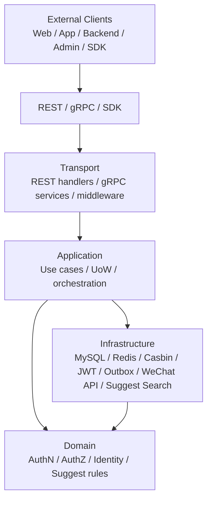
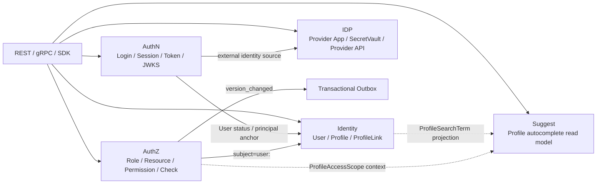
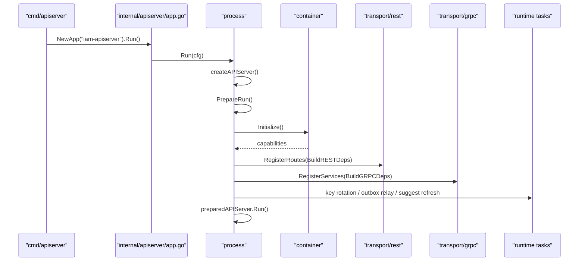

# IAM

IAM 是一个面向业务系统接入的身份与访问管理服务，统一提供认证、授权、身份关系、第三方身份源集成、Profile 联想搜索辅助读模型，以及 REST / gRPC / Go SDK 接入能力。

它不是普通用户中心，也不是单纯 JWT 登录系统，更不是完整搜索服务。

它的核心职责是把：

```text
AuthN 认证
AuthZ 授权
Identity 身份关系
IDP 第三方身份源
Suggest Profile 联想搜索辅助读模型
REST / gRPC / SDK 接入
架构与契约护栏
```

收敛成一个可装配、可接入、可治理、可持续演进的 Go 服务。

[](https://go.dev/)
[](LICENSE)

---

## 30 秒定位

```text
IAM 是一个面向业务系统接入的身份与访问管理服务，统一提供登录认证、Session 与 Token 管理、资源授权判定、User/Profile/ProfileLink 身份关系、第三方身份源集成、Profile 联想搜索辅助读模型，以及 REST/gRPC/SDK 接入能力。
```

更短一点：

```text
IAM 不是普通用户中心，而是统一处理认证、授权、身份关系、业务系统接入和后台辅助查询的基础服务。
```

Suggest 的定位需要特别说明：

```text
Suggest 是 iam-apiserver 内置的 Profile autocomplete 辅助读模型；
它服务 operating 后台快速搜索当前可见 Profile；
它不是 IAM 核心身份域、不是完整搜索服务、也不是 AuthZ 权限中心。
```

---

## 核心能力

| 能力 | 说明 |
| --- | --- |
| AuthN 认证 | 登录身份、凭证、挑战、Principal、Session、AccessToken、RefreshToken、Verify、Revoke、JWKS、KeyRotation、Service Token |
| AuthZ 授权 | Subject、Role、Resource、Permission、RoleBinding、Action、Scope、Check、AuthorizationSnapshot、PolicyVersion、Transactional Outbox |
| Identity 身份关系 | User、Profile、ProfileLink、MyProfiles、MyProfileLinks、self profile link |
| IDP 第三方身份源 | 微信/企微应用配置、SecretVault、平台 access_token、外部身份源 API 适配 |
| Suggest 辅助读模型 | ProfileSearchTerm、OperatingPrincipal、ProfileAccessScope、Trie/Hash Runtime、Full/Delta refresh、mobile_mask、限流、指标、降级 |
| REST API | 面向 Web、App、管理后台、登录、HTTP 调试和 Suggest Profile autocomplete |
| gRPC API | 面向可信服务间调用，例如 VerifyToken、AuthZ Check、Identity/ProfileLink 查询 |
| Go SDK | 面向 Go 业务服务，封装 REST/gRPC/JWKS/Verifier/ServiceAuth/AuthZ/Identity/IDP |
| CacheGovernance | token、session、OTP、JWKS、IDP 等缓存族状态读取与 debug |
| Transactional Outbox | 授权版本事件和其他领域事件的可靠发布机制 |
| 架构护栏 | architecture tests、REST/gRPC contract tests、SDK compile test、Suggest tests、docs-hygiene |

---

## 系统架构

IAM 采用分层与六边形架构组织代码。



分层职责：

| 层次 | 位置 | 职责 |
| --- | --- | --- |
| 进程入口 | [`cmd/apiserver`](cmd/apiserver) | `iam-apiserver` 服务入口 |
| 生命周期管理 | [`internal/apiserver/process`](internal/apiserver/process) | 配置、资源初始化、container、REST/gRPC、后台任务、优雅关闭 |
| 组合根 | [`internal/apiserver/container`](internal/apiserver/container) | 装配 AuthN、AuthZ、Identity、IDP、Suggest、Outbox 等模块 |
| REST 适配层 | [`internal/apiserver/transport/rest`](internal/apiserver/transport/rest) | HTTP 路由、中间件、DTO、错误映射、debug 接口、Suggest REST |
| gRPC 适配层 | [`internal/apiserver/transport/grpc`](internal/apiserver/transport/grpc) | Proto service 注册、interceptor、mapper |
| 应用层 | [`internal/apiserver/application`](internal/apiserver/application) | 用例编排、事务边界、命令/查询、跨模块协作 |
| 领域层 | [`internal/apiserver/domain`](internal/apiserver/domain) | 实体、值对象、领域服务、业务规则、端口定义 |
| 基础设施层 | [`internal/apiserver/infra`](internal/apiserver/infra) | MySQL、Redis、Casbin、JWT、Outbox、微信 API、Suggest Trie/Hash Runtime 等适配器 |
| SDK | [`pkg/sdk`](pkg/sdk) | Go 服务端接入 IAM 的产品化封装 |

核心原则：

```text
main 很薄；
process 管生命周期；
container 管组合装配；
transport 管协议适配；
application 管用例编排；
domain 管业务规则；
infra 管外部资源；
Suggest 是辅助读模型，不越权替代 Identity 或 AuthZ。
```

---

## 模块边界



---

### AuthN：认证态

AuthN 负责回答：

```text
你如何证明你是谁？
这次登录态和 token 当前是否仍然有效？
```

核心链路：

```text
Login request
  -> LoginMethod / ProofFactory
  -> Auth proof
  -> Authenticator
  -> Principal
  -> Session
  -> AccessToken
  -> RefreshToken
  -> JWKS / Verify / Revoke / Refresh
```

关键边界：

```text
JWT 只是短期 AccessToken 的实现；
Session 是在线登录态锚点；
RefreshToken 是服务端可控的续期凭证；
JWKS 证明签名可信；
Online Verify 证明 token 当前可用。
```

---

### AuthZ：访问权

AuthZ 负责回答：

```text
某个 subject 在某个 tenant domain 下，能不能对某个 resource 执行某个 action，并且满足某个 scope？
```

核心模型：

```text
Subject
  -> RoleBinding
  -> Role
  -> Permission
  -> Resource / Action / Scope
  -> AuthorizationDecision
```

关键边界：

```text
AuthZ 不是 user.role；
Casbin 是 infra runtime engine，不是领域模型；
PolicyVersion 表达授权事实版本变化；
Transactional Outbox 保证授权版本变化最终可靠传播。
```

---

### Identity：身份与档案关系

Identity 负责回答：

```text
系统内部这个人是谁？
这个人和哪些业务档案有关？
这些关系是否仍然有效？
```

核心模型：

```text
User -- ProfileLink -- Profile
```

其中：

- `User` 是登录主体和身份锚点；
- `Profile` 是业务档案；
- `ProfileLink` 是 User 与 Profile 之间的关系事实；
- `ProfileLink` 可以作为当前用户访问档案的关系 guard，但不是 AuthZ permission；
- `ProfileLink` 也不是 Suggest 的 `ProfileAccessScope`。

---

### IDP：第三方身份源基础设施

IDP 负责回答：

```text
第三方身份源如何接入？
微信/企微应用、secret、access_token 如何管理？
```

IDP 不直接签发 IAM token。

微信/企微登录最终仍回到 AuthN 的：

```text
LoginIdentity / account binding
Principal
Session
AccessToken
RefreshToken
```

---

### Suggest：Profile 联想搜索辅助读模型

Suggest 负责回答：

```text
当前 operating 操作员输入关键词时，如何快速返回他有权看到的 Profile 候选？
```

它服务管理后台 autocomplete，典型入口是：

```http
GET /api/v2/suggest/profile?k={keyword}&limit={limit}
```

核心链路：

```text
Suggest REST
  -> OperatingPrincipal
  -> ProfileAccessScopeProvider
  -> ProfileAccessScope
  -> ProfileSuggestionRuntime
  -> Trie / Hash match
  -> scope filter
  -> ranking
  -> mobile_mask DTO
```

关键边界：

```text
Suggest 不是完整搜索服务；
Suggest 不是 AuthZ 权限中心；
Suggest 不是 Identity 核心域；
ProfileSearchTerm 不是 Profile 聚合本体；
ProfileAccessScope 不是 ProfileLink；
手机号搜索必须授权、限流、脱敏；
响应返回 mobile_mask，不返回明文 mobile；
索引不可用时可降级为空结果，不能绕过权限直接查全局 MySQL。
```

---

## 运行时主链路



---

## API 与 SDK

### REST API

REST 使用 OpenAPI 3.1，适合 Web、App、管理后台、登录、HTTP 调试和 Suggest Profile autocomplete。

契约入口：

- [api/rest/README.md](api/rest/README.md)
- [api/rest/authn.v2.yaml](api/rest/authn.v2.yaml)
- [api/rest/authz.v2.yaml](api/rest/authz.v2.yaml)
- [api/rest/identity.v2.yaml](api/rest/identity.v2.yaml)
- [api/rest/idp.v2.yaml](api/rest/idp.v2.yaml)
- [api/rest/suggest.v2.yaml](api/rest/suggest.v2.yaml)

Suggest REST 重点接口：

```http
GET /api/v2/suggest/profile?k={keyword}&limit={limit}
```

响应语义：

```text
候选结果必须经过 ProfileAccessScope 过滤；
手机号形态关键词需要 AllowMobileSearch；
响应只返回 mobile_mask，不返回明文 mobile。
```

---

### gRPC API

gRPC 面向可信服务间调用，当前发布 v2 proto。

契约入口：

- [api/grpc/README.md](api/grpc/README.md)
- [api/grpc/iam/authn/v2/authn.proto](api/grpc/iam/authn/v2/authn.proto)
- [api/grpc/iam/authz/v2/authz.proto](api/grpc/iam/authz/v2/authz.proto)
- [api/grpc/iam/identity/v2/identity.proto](api/grpc/iam/identity/v2/identity.proto)
- [api/grpc/iam/idp/v2/idp.proto](api/grpc/iam/idp/v2/idp.proto)

---

### Go SDK

Go 服务端推荐通过官方 SDK 接入 IAM。

入口：

- [pkg/sdk/README.md](pkg/sdk/README.md)
- [pkg/sdk](pkg/sdk)

示例：

```go
package main

import (
    "context"
    "log"

    authnv2 "github.com/FangcunMount/iam/v2/api/grpc/iam/authn/v2"
    sdk "github.com/FangcunMount/iam/v2/pkg/sdk"
)

func main() {
    ctx := context.Background()

    client, err := sdk.NewClient(ctx, &sdk.Config{
        Endpoint: "localhost:8081",
    })
    if err != nil {
        log.Fatal(err)
    }
    defer client.Close()

    resp, err := client.Auth().VerifyToken(ctx, &authnv2.VerifyTokenRequest{
        AccessToken: "jwt-token",
    })
    if err != nil {
        log.Fatal(err)
    }

    log.Printf("valid=%v", resp.GetValid())
}
```

SDK 是接入产品层，不是业务层。

它封装 REST/gRPC/JWKS/ServiceAuth/AuthZ Check 等接入复杂度，但不定义 IAM 业务规则。

---

## 快速开始

### 环境依赖

- Go 1.25+
- Make
- MySQL
- Redis
- Docker（可选，运行 API 契约校验时需要）

### 构建

```bash
make deps
make build
```

### 运行

```bash
make run APISERVER_CONFIG=configs/apiserver.dev.yaml
```

### 健康检查

```bash
curl http://localhost:8080/health
curl http://localhost:8080/.well-known/jwks.json
```

### 测试

```bash
make test
```

### 常用质量检查

```bash
make docs-hygiene
go test ./internal/pkg/architecture
go test ./pkg/sdk/...
```

涉及 REST 契约：

```bash
make docs-swagger
make api-validate
```

涉及 gRPC 契约：

```bash
make proto-gen
go test ./internal/apiserver/transport/grpc
```

涉及 Suggest：

```bash
go test ./internal/apiserver/domain/suggest/... \
  ./internal/apiserver/application/suggest/... \
  ./internal/apiserver/infra/suggest/... \
  ./internal/apiserver/infra/mysql/suggest/... \
  ./internal/apiserver/transport/rest/suggest/...
```

---

## 文档导航

新版文档中心位于 [docs/README.md](docs/README.md)。

推荐入口：

| 你想了解 | 推荐阅读 |
| --- | --- |
| IAM 是什么，整体架构怎么分层 | [docs/00-概览/README.md](docs/00-概览/README.md) |
| 服务如何启动、装配和关闭 | [docs/01-运行时/README.md](docs/01-运行时/README.md) |
| 登录、Session、Token、JWKS 如何工作 | [docs/02-认证AuthN/README.md](docs/02-认证AuthN/README.md) |
| 授权模型、Check、Outbox 如何工作 | [docs/03-授权AuthZ/README.md](docs/03-授权AuthZ/README.md) |
| User、Profile、ProfileLink 如何建模 | [docs/04-身份Identity/README.md](docs/04-身份Identity/README.md) |
| REST/gRPC/SDK 如何接入 | [docs/05-接入与契约/README.md](docs/05-接入与契约/README.md) |
| 架构和文档如何防漂移 | [docs/06-架构护栏/README.md](docs/06-架构护栏/README.md) |
| 面试和技术分享怎么讲 | [docs/07-宣讲/README.md](docs/07-宣讲/README.md) |
| Suggest Profile 联想搜索读模型 | [docs/08-Suggest/README.md](docs/08-Suggest/README.md) |
| 30 分钟技术分享脚本 | [docs/07-宣讲/11-30分钟技术分享脚本.md](docs/07-宣讲/11-30分钟技术分享脚本.md) |
| 架构图素材 | [docs/07-宣讲/12-架构图素材索引.md](docs/07-宣讲/12-架构图素材索引.md) |
| 面试追问证据 | [docs/07-宣讲/13-面试追问证据索引.md](docs/07-宣讲/13-面试追问证据索引.md) |

---

## 文档体系

```text
docs/
├── README.md
├── 00-概览/
├── 01-运行时/
├── 02-认证AuthN/
├── 03-授权AuthZ/
├── 04-身份Identity/
├── 05-接入与契约/
├── 06-架构护栏/
├── 07-宣讲/
├── 08-Suggest/
└── _archive/
```

说明：

- `00-06` 是主事实层，解释当前系统核心能力如何实现；
- `07-宣讲` 是表达层，服务技术分享、面试准备、架构图和追问证据；
- `08-Suggest` 是 Profile 联想搜索辅助读模型事实层；
- `_archive` 只保存历史材料，不作为当前事实源。

---

## 事实源优先级

当 README、docs、API、代码出现不一致时，按以下优先级判断：

1. 源码与运行时行为  
   `cmd/`、`internal/apiserver/`、`internal/pkg/`、`pkg/`

2. 机器契约、配置和迁移  
   `api/rest`、`api/grpc`、`configs`、`internal/pkg/migration/migrations`、`pkg/sdk` public API

3. 测试与架构护栏  
   `internal/pkg/architecture`、REST/gRPC transport tests、SDK public API compile tests、Suggest tests、docs-hygiene

4. 当前事实层文档  
   `docs/00-概览` 到 `docs/06-架构护栏`、`docs/08-Suggest`

5. 表达层文档  
   `docs/07-宣讲`

6. 历史文档与归档材料  
   `docs/_archive` 只用于历史追溯，不作为当前事实源

特别说明：

```text
Suggest 相关事实优先看：
api/rest/suggest.v2.yaml；
internal/apiserver/transport/rest/suggest；
internal/apiserver/application/suggest；
internal/apiserver/domain/suggest；
internal/apiserver/infra/suggest；
internal/apiserver/infra/mysql/suggest；
docs/08-Suggest。
```

---

## 工程质量与架构护栏

IAM 使用自动化护栏防止系统长期演进成大泥球。

| 护栏 | 作用 |
| --- | --- |
| architecture tests | 保护 domain/application/transport/container 的依赖方向 |
| REST contract tests | 保护 OpenAPI 与运行时路由一致 |
| gRPC proto contract tests | 保护 proto service 与 runtime registration 一致 |
| SDK public API compile test | 保护 Go SDK 对外公开稳定面 |
| Suggest tests | 保护 ProfileAccessScope、mobile_mask、降级和索引刷新语义 |
| docs-hygiene | 保护活跃文档链接、术语和事实源不漂移 |

常用命令：

```bash
go test ./internal/pkg/architecture
make docs-hygiene
go test ./pkg/sdk/...
```

---

## 贡献指南

提交代码或文档时，请遵守以下规则：

1. **保持分层边界**
   - domain 不依赖 infra/database；
   - application 不依赖 transport/infra；
   - transport 不直接访问 container 或全局配置；
   - container 只做组合根，不处理请求；
   - Suggest REST handler 不直接操作 Trie/Hash；
   - Suggest domain 不依赖 infra/search。

2. **同步机器契约**
   - 修改 REST 路由时同步 `api/rest`；
   - 修改 Suggest REST 时同步 `api/rest/suggest.v2.yaml`；
   - 修改 gRPC service/message 时同步 `api/grpc`；
   - 修改 SDK 公开 API 时同步 `pkg/sdk` 文档和 compile test。

3. **同步文档**
   - 代码行为变化时更新 `docs/`；
   - Suggest 行为变化时同步 `docs/08-Suggest` 和 `docs/07-宣讲` 中相关表达；
   - 不从 `_archive` 复制当前事实；
   - 不恢复旧目录作为 active 文档入口。

4. **保护安全边界**
   - Suggest 查询必须经过 `ProfileAccessScope` 过滤；
   - 不把 `ProfileLink` 写成 `ProfileAccessScope`；
   - 不返回明文 mobile，只返回 `mobile_mask`；
   - 降级时不能绕过权限直接查全局 MySQL。

5. **运行验证**
   - 基础检查：`make docs-hygiene`
   - 架构检查：`go test ./internal/pkg/architecture`
   - REST 检查：`make api-validate`
   - gRPC 检查：`make proto-gen`
   - SDK 检查：`go test ./pkg/sdk/...`
   - Suggest 检查：`go test ./internal/apiserver/domain/suggest/... ./internal/apiserver/application/suggest/... ./internal/apiserver/infra/suggest/... ./internal/apiserver/infra/mysql/suggest/... ./internal/apiserver/transport/rest/suggest/...`

---

## 许可证

本项目采用 Apache License 2.0 开源许可证，详见 [LICENSE](LICENSE)。
