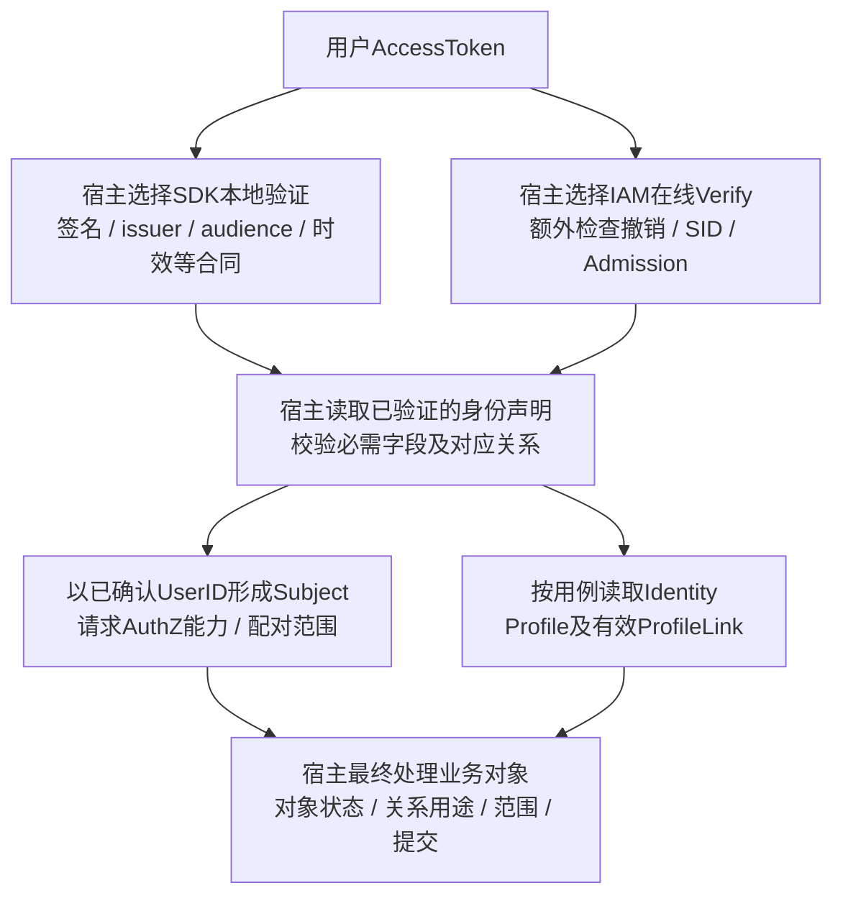

# IAM系统定位：交付事实、接入路径与责任边界

> 状态：已实现 · 以当前源码和契约说明定位，目标部署、消费者配置与业务接受另行取证；本文的接入情境不表示新功能已经实施。

## 1. IAM提供哪些共同能力

IAM为多个业务入口提供内部主体与档案关系、登录与在线会话、资源动作能力及范围事实。其价值在于这些事实可由共同合同管理：同一内部User不必随登录provider变化而换ID，登录状态不必寄生在业务档案上，人员岗位变更不必重写每个业务对象。当前实现是Go模块化单体，五个业务模块在标准APIServer进程中装配，并与后台任务、消息运行时协作；五个模块不对应五个部署服务。[实际组合根](../../internal/apiserver/container/module_graph.go)、[标准入口](../../cmd/apiserver/apiserver.go)。

共享这些能力也集中了承诺和故障责任：消费者必须采用一致的身份引用、Token接受合同和范围语义，不能各自解释同名字段。IAM并没有接管任务、报告、业务组织主数据或每个对象的执行规则。业务接入应明确自己需要哪一种事实，而不是只问“是否接了IAM”。

| 读者的问题 | 当前职责中心 | 交付内容及边界 |
| --- | --- | --- |
| 登录人、服务对象和两者关系如何表示 | Identity | User、Profile、ProfileLink；档案可属于被服务对象，不要求该对象已有登录主体 |
| 本次证明指向谁，能否建立/继续登录状态 | AuthN | LoginIdentity/Credential、Principal、Admission、Session、Access/Refresh Token；这些成功分阶段成立 |
| 这个主体有什么资源动作能力和范围事实 | AuthZ | 直接Role/Assignment、无条件Grant、Decision、许可配对Scope；宿主处理实际对象 |
| 外部code如何解析、应用秘密如何管理 | IDP | provider/realm标识、ExternalIdentity、应用凭据与provider AppToken；不是用户授权票据 |
| 怎样从输入取得少量档案候选 | Suggest | Identity派生投影、有限召回、可见性过滤和按配置披露；不是后续动作授权 |

五类职责按事实与变化原因划分，不自动证明五个DDD战略子域。“核心/辅助”是本仓实现分组，不是部署拓扑或启动优先级：标准关键模块清单包含IDP、AuthN、AuthZ、Identity，Suggest另有enable/required配置。辅助能力也可能处于登录关键路径。术语与协作细节分别由[术语表](03-核心概念术语表.md)、[模块协作](02-模块划分与协作关系.md)维护。

## 2. 三个接入情境：成功之后还需要什么

### 家长U17使用儿童档案P88

受信内部调用创建User U17，只得到用户事实，不自动生成LoginIdentity、Profile、Role或Token。AuthN注册另建立/复用内部User与登录入口，返回UserID/LoginIdentityID及可选Credential摘要；SignUp也不创建Session或交付Token。登录才继续身份核验、Admission、Session及初始Token保存/签发。[用户创建](../../internal/apiserver/application/identity/user/service_create.go)、[注册](../../internal/apiserver/application/authn/signup/service.go)、[登录完成](../../internal/apiserver/application/authn/signin/completion.go)。

Identity CreateProfile可以为U17创建儿童档案P88并建立ProfileLink。这不等于让儿童以U17登录；U17是请求者，P88是被服务对象。当前Identity REST查询档案从可信用户上下文进入MyProfiles，以有效关系决定能否查看自己的档案；同名gRPC目录读取则按受信服务请求目标，不重做这一自助门禁。ProfileLink确实参与这些用例的访问判断，不能笼统说“关系完全不参与授权”。[创建出口](../../internal/apiserver/transport/grpc/service/identity/profile_command.go)、[自助读取](../../internal/apiserver/transport/rest/identity/handler/profile_query.go)。

若业务随后让U17为P88完成某个测评任务，宿主还须从自身可信记录取得任务与对象、判断当前关系可用于这个操作、校验任务状态和本次提交。一个有效ProfileLink不自动授予全部业务动作；IAM也不从前端提交的ProfileID推断任务归属。该场景说明责任划分，不声称本仓已经实现任意业务任务接口。

### 员工从公司1门店A转到门店B

Role描述岗位能力，Assignment描述主体获得该Role及公司/门店范围。设某员工的read范围在A，retry范围在B；Check只判断目标resource/action是否命中Grant，不检查业务对象究竟在哪个门店。宿主必须取可信对象上的公司/门店，再消费对应许可的范围，不能将全部Assignment范围并成A+B用于每个动作。Scope构造器校验结构和正数ID，也不查询真实门店归属。[模型](../02-业务模块/03-AuthZ/01-领域模型设计.md)、[范围配对](../../internal/apiserver/infra/authz/runtime/scopes.go)。

岗位调整成功、事实版本提交、某实例加载、旧证明到期和业务操作提交分别成立。Check与Snapshot是独立调用，没有共同版本承诺；一次旧ALLOW后的在途业务也不会被新快照自动撤回。需要更严格的转店/撤权生效语义时，宿主先确定冲突处理和业务提交边界，再选择在线判定、应用快照或缓存合同，不能用“实时权限”四个字跳过这些条件。[判定主文](../02-业务模块/03-AuthZ/02-关键链路-授权判定与不可变快照.md)、[收敛主文](../02-业务模块/03-AuthZ/04-关键链路-多实例策略收敛.md)。

### 操作员搜索到了P88，或搜索结果为空

Suggest处理的是展示候选。内建默认Loader SQL从Identity资料构建索引，owner取Profile.created_by，Org取配置占位值；标准装配也允许FullSQL/DeltaSQL覆盖，覆盖后须重核字段来源。局部可见性按创建人ProfileID、索引Org或索引owner任一命中。它与AuthZ的Assignment company/store Scope不同，也不能直接当作当前ProfileLink持有关系。[来源](../../internal/apiserver/infra/mysql/suggest/loader.go)、[局部可见性](../../internal/apiserver/domain/suggest/visibility/scope.go)。

召回先受预算限制，之后过滤和排序；空结果还可能来自查询准入拒绝或optional降级。因此返回P88不证明可以编辑/测评它，返回空也不证明全库不存在符合业务条件的P88。宿主用ProfileID取得当前事实并重新判断后续操作；默认掩码保护展示，生产禁止配置关闭mask，但不能抹去手机号已进入Loader和内存索引的事实。[查询](../../internal/apiserver/application/suggest/queryprofile/service.go)、[运行配置](../../internal/apiserver/container/suggest/module.go)、[读模型专题](../06-专题设计/05-Suggest为什么是读模型.md)。

## 3. 请求者、服务调用者和业务对象是三条线

外部微信code被IDP交换为provider/realm标识，再由AuthN按登录入口合同映射内部主体。ExternalIdentity不含IAM UserID/LoginIdentityID，也不表示已建立Session。provider AppToken供服务调用provider API，不是用户AccessToken；秘密保存或AppToken获取成功不能当作用户登录完成。当前provider枚举、已注册接口与真正可用路径也应分开：标准企微nil-cache装配限制尚未修复，详见[外部解析](../02-业务模块/04-IDP/02-外部身份解析与AuthN协作.md)。

对于用户AccessToken，接入方先确定接受合同，再读取验证结果并校验宿主必需的身份字段和对应关系。AuthN Principal在证明核验成功后即可形成，仍须经过Admission、Session和Token交付；它不是已登录会话。在线Verify还检查撤销标记、claims指向的活跃SID及User/LoginIdentity准入，但不把IAM验证与宿主业务commit绑定。Verify RPC无错误也可返回Valid=false，必须读取结果；SID检查和准入读取也不能宣称全库同版。[在线验证器](../../internal/apiserver/domain/authn/token/verifier.go)、[应用结果](../../internal/apiserver/application/authn/token/capabilities.go)。

图表示接入责任，两个验证出口是可选接受合同，不表示一次请求必定都执行。SDK结果缓存与fallback也会改变实际路径，本地验证不检查实时Session/User/LoginIdentity撤销，也不重跑IAM claims对象的完整身份不变量；它提取UserID等可选字段，宿主不能把验签成功直接等同于身份字段齐全且相互一致。这里区分来源证明与消费形状，不声称标准IAM签发产生异常身份。线上验证后仍存在读取到业务执行的窗口。图不是所有REST路由的统一middleware流水线：Identity自助关系门禁、Suggest局部过滤与AuthZ管理路由各有实现。[SDK接入合同](../04-接口与SDK/02-Go-SDK与业务系统接入.md)、[JWT专题](../06-专题设计/04-JWT-JWS-JWK-JWKS与密钥轮换.md)。

服务调用者在启用并正确装配的安全配置下，由mTLS证书身份和配置ACL准入；方法ACL只在启用且成功加载时安装，不能从接口存在推导现场已经启用。一个QS服务获准调用AuthZ，不表示该请求字段中的`user:42`已被验证为本次登录人。Check/Snapshot读RPC校验服务身份与Subject语法，没有再次认证目标User；Snapshot的AppName也不绑定到证书服务。宿主必须从可信用户验证结果构造Subject，不能照抄前端字段。Assignment写入另有服务、受管Role及管理保护准入，但ChangedBy/GrantedBy文本也不是人类操作者的身份或管理权证明。[AuthZ gRPC](../../internal/apiserver/transport/grpc/service/authz/service.go)、[调用准入](../03-基础设施/05-传输层与服务间安全.md)。

## 4. 持久事实、在线状态与投影各有恢复合同

| 载体 | 当前承担什么责任 | 接入/恢复时需要保留的区别 |
| --- | --- | --- |
| MySQL | 内部身份/登录入口/凭据、关系、授权事实与版本、应用凭据、JWK元数据、Outbox等 | 同库UoW只覆盖加入该事务的写入；不包含所有Redis、文件与provider操作 |
| Redis | Session、RefreshToken、Challenge、撤销标记及部分普通缓存 | Session/Refresh是在线状态，不是可由MySQL自动重建的普通cache；丢失和清理有登录后果 |
| 本地授权快照 | 已发布能力、范围及目录投影，附版本/证明 | 可重建不等于当前新鲜；全量构建失败保留旧版，读取仍受证明预算 |
| Suggest内存索引 | 从Identity资料重建，Full替换/Delta更新 | 可重建不等于完整召回、及时同步或长期不可变；局部查询还可读DB/AuthZ |
| 秘密材料与公钥分发 | 签名私钥PEM、IDP主密钥输入、公钥元数据及消费缓存 | 公钥不是私钥；只恢复数据库不保证文件/密钥与事实相配，也不清除外部旧缓存 |
| Broker与标准Outbox | 已提交事件的持久交接、发布/重试及消费传播 | Broker确认、consumer ACK和业务接受分别取证，重复与恢复由各层合同处理 |

共享数据库、同进程调用和一个版本数字不能统称“全系统强一致”。Required借入宿主事务时应用返回未必已提交；某些即时Reload又通过根DB独立读取。跨MySQL/Redis、消息与文件的失败要按具体窗口补偿或恢复，而不是把一切贴成“最终一致”。本页只给定位，时序与候选恢复由[一致性专题](../06-专题设计/02-事务缓存与事件一致性.md)及[基础设施](../03-基础设施/README.md)维护。

## 5. 当前接入面与扩展代价

当前公开传输由REST和gRPC适配，后台任务与NSQ消息协作不算第三套用户API。REST包含登录/自助/管理/搜索等不同门禁，gRPC面向受信服务；不能按协议名称假定全部方法具备相同用户授权。Go SDK提供已发布gRPC客户端与本地验证等消费能力，Raw/Conn的出口也保留；Suggest当前只有REST，没有Suggest gRPC/SDK客户端。`/v5` Go module、REST URL与proto package分别演进。[接口治理](../04-接口与SDK/01-REST-gRPC与契约治理.md)。

本仓“已实现”是源码/契约状态。Prepare、模块Available、gRPC SERVING、REST readyz和业务流成功各有依据；只看端口或健康不能证明所有provider、所有权限或所有消费者可用。标准运行模式还有关键模块与可靠消息硬门禁，optional Suggest降级不是“任意模块都可缺失”的启动保证。[启动](../01-运行时/01-启动与组合根.md)、[就绪与关闭](../01-运行时/03-后台任务就绪与优雅关闭.md)。

下表是定位层面的候选判断条件，不是已经接受的改造计划；实现方案仍由相应主文决定。

| 新诉求 | 需要新增/改变的合同 | 成本与接受样本 |
| --- | --- | --- |
| 把完整业务对象授权收进IAM | 谁提供当前对象/关系/组织事实；数据类型、时效、拒绝语义及提交顺序 | 增加业务耦合；以同主体不同对象、旧关系/旧属性、未知值和撤销并发验证，不能直接恢复已退役object_context求值 |
| 接入一个新provider或统一入口 | realm/标识等价、证明来源、内部归属、应用停用/凭据轮换、历史入口迁移 | 不能只加provider enum；需要新旧入口正反匹配、来源错配、停用、失败重试与退出样本 |
| 将模块拆为独立服务 | 资源/lifecycle归属、事务替代、远程失败/重试、版本传播与缓存消费 | 五模块名称不构成拆分理由；分别证明注册与关系写入、会话撤销、权限变更在网络失败下的结果 |
| 增加更大规模的通用档案搜索 | 搜索用途、资格与披露合同、来源覆盖、预算/分页、索引更新与恢复 | 搜索结果仍不授权后续动作；需要可见集合之外的拒绝样本、坏资料、迟到更新和全量恢复 |

## 6. 如何阅读和验证这个定位

先按问题进入唯一正文：模型关系见[业务模块](../02-业务模块/README.md)，部署与资源责任见[运行时](../01-运行时/README.md)，接入接受合同见[接口与SDK](../04-接口与SDK/README.md)，跨模块取舍见[专题](../06-专题设计/README.md)。本页的例子说明返回值为何不足以代表最终业务接受，不重复各模块完整算法，也不将候选写成当前路线承诺。

本轮新增Go行为执行0、测试文件0；精确复用第43/44/50篇原日志6run/pass（6顶层、0子项），5份原package pass另计、5不同包。原绑定、命令与日期保留；43/44没有记录工具摘要及执行开始/结束字段，保持缺口，不由当前工具或阶段HEAD补写。55组来源map重核5022条路径，本篇90项静态子集没有新增独立路径；数量不等于行为覆盖，详见[阶段记录](../_data/reviews/2026-10-06-docs-refactor.md)。

注册、typed facade、ForceRemote分派与fake版本恢复均只证明各自断言，不建立完整五模块回归或真实provider、跨库补偿、宿主对象授权。源码/契约核对、文档门禁、CI、目标部署及业务接受分别成立；当前现场配置、消费者接受集合、索引时效、组织事实和业务结果仍为unknown。
