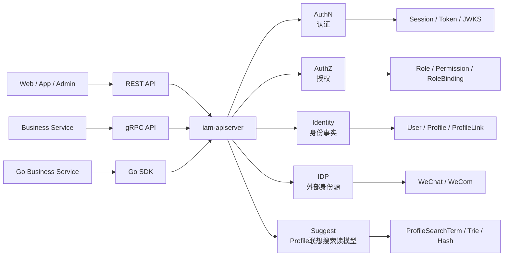
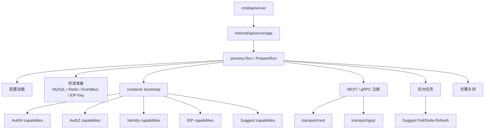
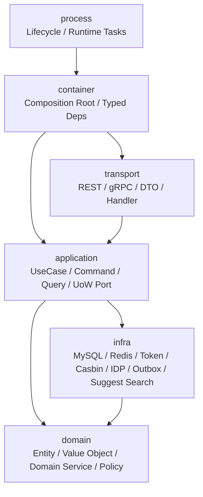
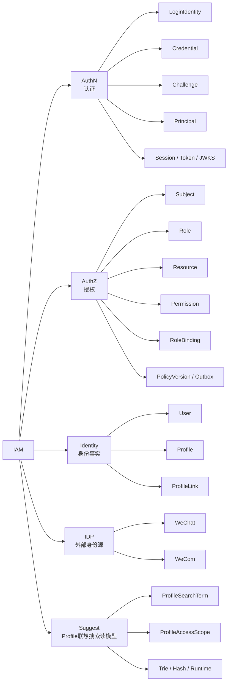
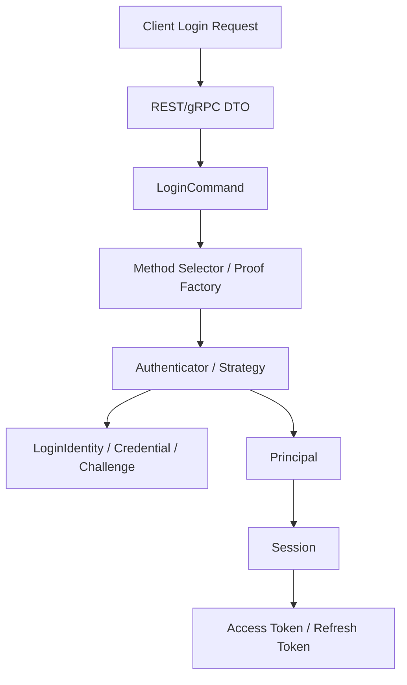
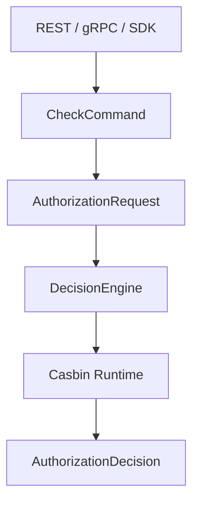
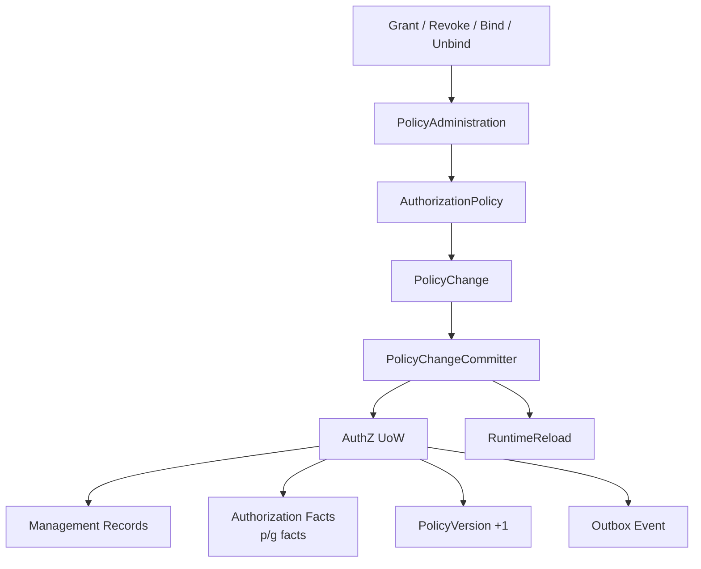
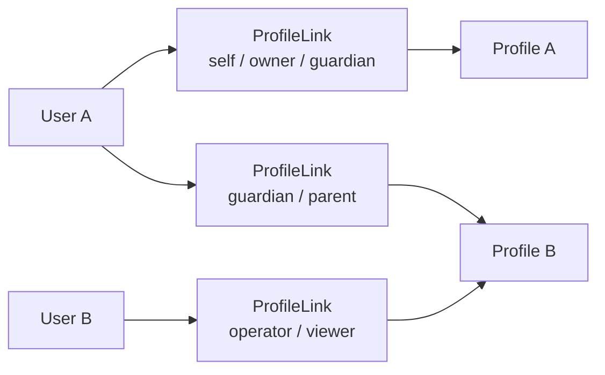
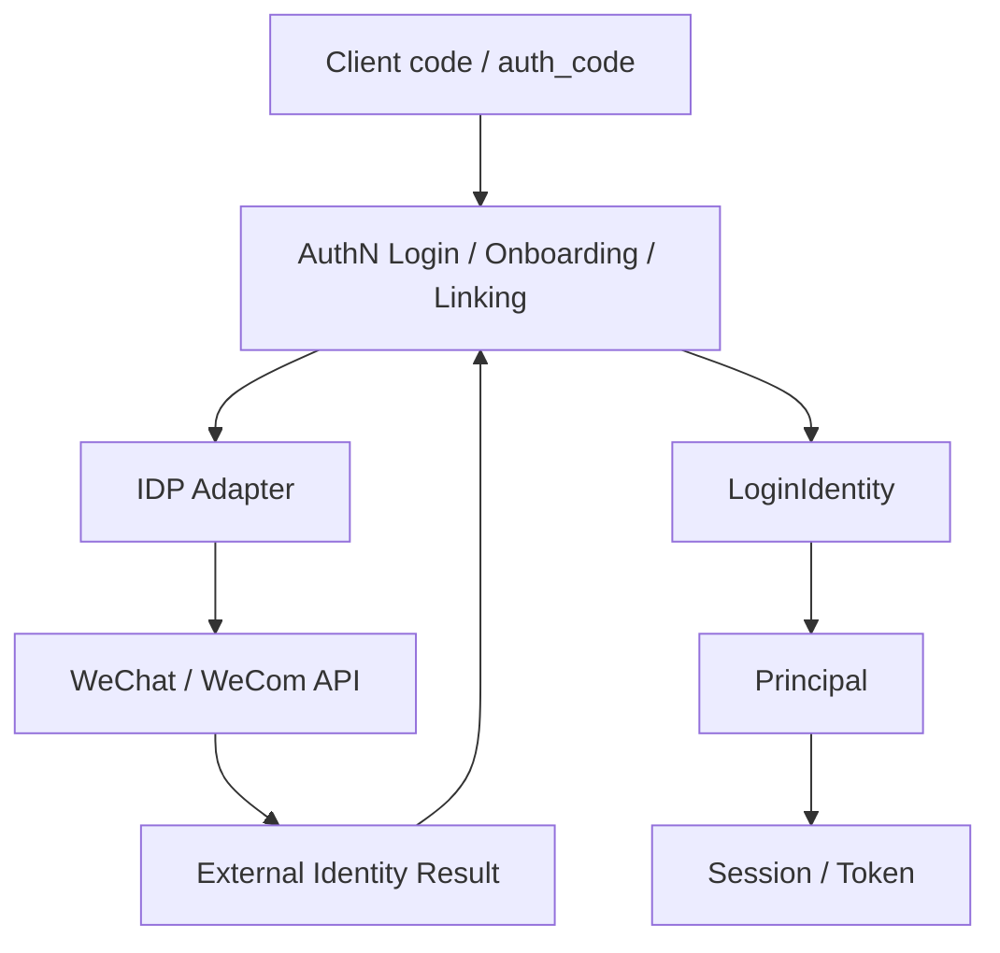
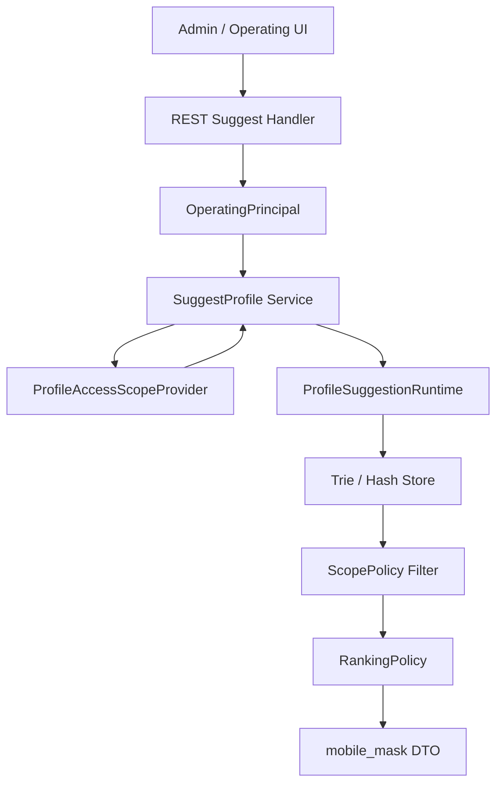

# 01-系统架构总览

## 1. 本文定位

本文是 IAM 项目的系统级架构入口。

它不负责展开每个模块的全部实现细节，而是回答：

```text
IAM 是什么系统？
它如何对外提供能力？
它如何从 Go 进程装配成 REST/gRPC 服务？
它内部如何分层？
AuthN、AuthZ、Identity、IDP 如何协作？
Suggest 这个辅助读模型为什么存在、放在什么边界内？
后续应该从哪里继续阅读源码和文档？
```

读完本文后，读者应该能形成一张完整的 IAM 系统地图，再进入 `01-运行时/`、`02-认证AuthN/`、`03-授权AuthZ/`、`04-身份Identity/`、`08-Suggest/` 等目录深潜。

---

## 2. 一句话定位

IAM 是面向业务系统接入的身份与访问管理服务。

它不是单纯的用户资料 CRUD，也不是单纯的登录接口集合，更不是把 Casbin 表暴露出来做权限 CRUD。

当前 IAM 的核心职责是：

```text
认证：识别“你是谁”，并签发可验证的访问凭证。
授权：判断“你能做什么”，并维护可传播的授权事实。
身份：维护“系统内部这个人是谁，以及他关联了哪些业务档案”。
外部身份源：对接微信、企业微信等第三方身份提供方。
接入产品化：通过 REST、gRPC、SDK 支持业务系统接入。
辅助读模型：内置 Suggest，为 operating 后台提供 Profile 联想搜索能力。
```

一句话：

> IAM 以 User 为稳定身份锚点，以 AuthN 解决登录与 Token，以 AuthZ 解决资源访问控制，以 Identity 解决 User/Profile/ProfileLink 身份事实，以 IDP 适配外部身份源，并通过 REST/gRPC/SDK 向业务系统提供身份与访问管理能力；同时在 iam-apiserver 内暂存 Suggest 辅助读模型，用于 operating 后台的 Profile 联想搜索。

---

## 3. 系统边界

### 3.1 IAM 负责什么

IAM 负责以下能力：

```text
1. 维护 IAM 内部稳定身份主体 User。
2. 维护 User 与登录身份 LoginIdentity 的关系。
3. 校验 Credential 或 Challenge，完成登录认证。
4. 生成 Principal、Session、Access Token、Refresh Token。
5. 发布 JWKS，支持资源服务本地验签。
6. 提供在线 Verify，支持检查 Session、Token、User、LoginIdentity 的当前状态。
7. 维护 Role、Resource、Permission、RoleBinding 等授权事实。
8. 提供 AuthZ Check，判断 Subject 是否允许访问 Resource。
9. 维护 PolicyVersion 与 Outbox Event，支持授权版本传播和 runtime reload。
10. 维护 Profile 与 ProfileLink，表达 User 与业务档案的关系。
11. 适配微信、企业微信等第三方身份源。
12. 通过 REST、gRPC、SDK 让业务系统接入 IAM。
13. 内置 Suggest 辅助读模型，为 operating 后台提供 Profile 联想搜索。
```

---

### 3.2 IAM 不负责什么

IAM 不应该变成所有业务概念的中心。

它不负责：

```text
1. 不负责具体业务系统的业务流程。
2. 不负责把医生、患者、老师、学生等业务角色建成 AuthN Account。
3. 不负责替业务系统保存所有业务资料字段。
4. 不负责把 ProfileLink 直接当作资源权限。
5. 不负责让 transport 层承载业务规则。
6. 不负责让业务系统直接理解 Casbin p/g facts。
7. 不负责用文档替代 OpenAPI、proto、SDK public API 等机器契约。
8. 不负责把 Suggest 扩展成完整搜索服务或完整组织权限系统。
```

边界原则是：

```text
IAM 提供身份、认证、授权和接入能力；
业务系统使用这些能力完成自己的业务流程；
业务语义如果需要权限控制，应进入 AuthZ Resource / Action / Scope / Check；
业务身份关系如果需要表达，应进入 Identity Profile / ProfileLink；
登录方式与认证材料应进入 AuthN LoginIdentity / Credential / Challenge；
Profile 联想搜索如需高频查询和权限过滤，可进入 Suggest 读模型；但 Suggest 只消费 ProfileAccessScope，不承载完整 AuthZ，也不拥有完整 Organization 模型。
```

---

## 4. 外部视角：业务系统如何接入 IAM

IAM 对外主要提供以下接入方式：

| 接入方式 | 主要使用者 | 适用场景 |
| --- | --- | --- |
| REST API | Web、App、管理后台、调试工具 | 登录、刷新 Token、用户资料、管理操作、普通 HTTP 接入 |
| gRPC API | 可信服务间调用 | 服务间 Verify、AuthZ Check、Identity 查询等低延迟内部调用 |
| Go SDK | Go 业务服务 | 封装 REST/gRPC 调用，降低业务服务接入成本 |
| Suggest REST | 管理后台 / operating 后台 | Profile 联想搜索 autocomplete，返回当前操作员可见的 Profile 候选 |

外部接入关系如下：



这张图表达的是：

```text
REST、gRPC、SDK 都只是接入形态；
真正的业务能力沉在 application/domain/infra；
业务系统不应该直接操作 IAM 数据库；
业务系统也不应该直接理解 Casbin runtime facts；
Suggest REST 是管理端辅助查询入口，不是完整搜索服务；它通过 ProfileAccessScope 过滤当前操作员可见候选。
```

---

## 5. 运行时视角：iam-apiserver 如何装配成服务

当前 IAM 的主要运行单元是：

```text
iam-apiserver
```

运行时主轴可以概括为：

```text
cmd/apiserver
  -> internal/apiserver/app
  -> internal/apiserver/process
  -> container bootstrap
  -> transport/rest + transport/grpc
  -> background tasks
  -> graceful shutdown
```

运行时装配图如下：



其中：

| 运行时部分 | 职责 |
| --- | --- |
| `cmd/apiserver` | 进程入口，只负责启动命令和进入应用启动流程 |
| `internal/apiserver/app` | 应用启动入口，承接命令行、配置和运行流程 |
| `process` | 生命周期编排，负责启动阶段、后台任务、关闭流程 |
| `container` | 组合根，集中装配模块能力和外部依赖 |
| `transport/rest` | REST 路由、DTO、HTTP handler、协议响应映射 |
| `transport/grpc` | gRPC service 注册、proto message 与 application 入参出参映射 |
| `application` | 用例编排，处理 command/query、事务边界、端口调用 |
| `domain` | 领域模型、值对象、不变量、领域策略 |
| `infra` | MySQL、Redis、Token、Casbin、IDP、Outbox 等外部资源适配 |
| `suggest runtime` | Profile 联想搜索索引、Full/Delta 刷新、限流、指标与降级服务 |

关键边界是：

```text
process 管生命周期，不写业务规则；
container 管装配，不处理请求；
transport 管协议，不写领域规则；
application 管用例，不直接暴露技术细节；
domain 管不变量，不依赖数据库和协议；
infra 管适配，不反向污染领域语言。
```

---

## 6. 分层视角：代码结构如何组织

IAM 的核心代码按 layer + module 组织。

简化后可以理解为：

```text
internal/apiserver/
├── process/      # 生命周期编排
├── container/    # 组合根与能力装配
├── transport/    # REST / gRPC 协议适配，包含 suggest REST handler
├── application/  # 用例编排，包含 suggest 查询与刷新用例
├── domain/       # 领域模型与领域规则，包含 suggest 读模型与策略
├── infra/        # 外部资源适配，包含 suggest search/runtime/mysql loader
└── options/      # 配置选项
```

分层依赖关系如下：



需要注意：

```text
这张图不是说 infra 是 domain 的上层。
它表达的是 infra adapter 可能需要把持久化对象转换为 domain object。
从业务规则角度看，domain 仍然是核心。
从装配角度看，container 将 application 需要的 port 绑定到 infra adapter。
```

分层约束可以总结为：

| 层 | 可以做什么 | 不应该做什么 |
| --- | --- | --- |
| transport | 协议适配、DTO 映射、错误响应转换 | 写业务规则、直接操作数据库、直接调用 Casbin Enforce |
| application | 用例编排、事务边界、端口调用、结果组装 | 承载底层 SQL 细节、泄露 HTTP/gRPC DTO |
| domain | 建模核心概念、不变量、值对象、领域策略 | 依赖 MySQL、Redis、HTTP、gRPC、Casbin 技术 API |
| infra | 实现 repository、token、cache、idp、casbin、outbox | 把 p/g facts 写成业务语言、绕过 application 修改业务事实 |
| suggest | 构建 Profile 联想搜索读模型、执行 scope filter、索引刷新、限流与指标 | 成为 AuthZ 权限中心、逐条调用 Casbin、返回明文手机号、把 TenantDomain 当 OrgID |
| container | 依赖装配、能力收集、模块组合 | 处理请求、写业务判断 |
| process | 启动、关闭、后台任务、健康诊断 | 进入具体业务用例细节 |

---

## 7. 模块视角：AuthN / AuthZ / Identity / IDP / Suggest

IAM 当前的核心模块不是按数据库表划分，而是按业务责任划分。其中 AuthN、AuthZ、Identity、IDP 是身份与访问管理主线，Suggest 是暂存在 iam-apiserver 内的辅助读模型模块。



---

### 7.1 AuthN：认证模块

AuthN 回答：

```text
请求者是谁？
系统如何找到这个主体？
请求者如何证明自己控制某个登录身份？
认证成功后如何表达主体并签发访问凭证？
```

当前 AuthN 的核心模型是：

```text
User / Principal
  └── LoginIdentity 0..N
        └── Credential 0..N

Challenge 独立承载短期认证挑战。
Session / Token 承载认证成功后的访问上下文。
JWT / JWS / JWKS / KeyRotation 承载 Token 安全表达与验签能力。
```

AuthN 不再以业务 `Account` 为中心。

它不应该建模：

```text
OperatorAccount
CustomerAccount
DoctorAccount
GuardianAccount
```

这些业务角色和业务身份应该由业务系统、Identity/ProfileLink 或 AuthZ 表达。

AuthN 的深潜入口是：

```text
docs/02-认证AuthN/README.md
```

---

### 7.2 AuthZ：授权模块

AuthZ 回答：

```text
某个 Subject，在某个 Tenant 下，能不能对某个 Resource 执行某个 Action，并且满足某个 Scope？
```

核心模型是：

```text
Subject
  -> RoleBinding
  -> Role
  -> Permission
  -> Resource / Action / Scope
  -> AuthorizationDecision
```

AuthZ 不是：

```text
user.role == "admin"
```

也不是：

```text
直接增删改查 casbin_rule
```

AuthZ 的核心特点是：

```text
1. ResourceKey 使用四段结构：<app>:<domain>:<type>:<name-or-pattern>。
2. Resource、Role、Permission、RoleBinding 是领域语言。
3. Casbin 是 infra/runtime policy engine，不是领域模型。
4. Check 是权威实时判定。
5. Snapshot 是授权事实投影。
6. 授权写入通过 PolicyChangeCommitter + AuthZ UoW 统一提交。
7. PolicyVersion + Outbox 用于授权版本传播和 runtime reload。
8. PolicyLinter 用于授权事实治理，但不自动修复权限。
```

AuthZ 的深潜入口是：

```text
docs/03-授权AuthZ/README.md
```

---

### 7.3 Identity：身份事实模块

Identity 回答：

```text
系统内部这个人是谁？
这个人关联了哪些业务身份资料或业务档案？
这些关系如何表达、查询、撤销和治理？
```

核心模型是：

```text
User
  -> ProfileLink
  -> Profile
```

其中：

| 模型 | 含义 |
| --- | --- |
| User | IAM 内部稳定身份主体 |
| Profile | 业务身份资料、业务档案或被服务对象 |
| ProfileLink | User 与 Profile 之间的身份关系 |

Identity 与 AuthN/AuthZ 的边界是：

```text
AuthN 认证成功后通过 Principal.UserID 指向 Identity.User。
AuthZ 通过 user:<userID> 引用 Identity.User。
ProfileLink 是身份关系，不是 AuthZ Permission。
Profile 可以作为资源或 Scope 上下文，但资源访问仍应走 AuthZ Check。
```

Identity 的深潜入口是：

```text
docs/04-身份Identity/README.md
```

---

### 7.4 IDP：外部身份源基础设施

IDP 负责适配外部身份源，例如：

```text
微信小程序
微信公众号
企业微信
```

IDP 的职责是：

```text
1. 保存第三方应用配置。
2. 保护 AppSecret 等敏感材料。
3. 调用第三方身份源 API。
4. 将外部身份结果交给 AuthN 的 Onboarding / Login / Linking 链路使用。
```

IDP 不应该直接决定 IAM 内部登录态。

边界是：

```text
IDP 提供外部身份源证明材料；
AuthN 判断这些材料如何映射为 LoginIdentity、Principal、Session、Token；
Identity 维护 User/Profile/ProfileLink；
AuthZ 判断资源访问权。
```

---

### 7.5 Suggest：Profile 联想搜索读模型

Suggest 回答：

```text
operating 后台输入一个关键词时，如何快速返回当前操作员可见的 Profile 候选？
```

它的核心模型是：

```text
OperatingPrincipal
  -> ProfileAccessScope
  -> ProfileSearchTerm
  -> Trie / Hash / Runtime
```

Suggest 的核心特点是：

```text
1. 它不是 IAM 核心身份域，而是辅助读模型模块。
2. 它服务 operating 后台的 Profile autocomplete 查询。
3. 它通过 ProfileAccessScope 消费权限侧解析出的可见范围。
4. 它不逐条调用 Casbin，也不承载完整 AuthZ。
5. 它使用 Trie 支持中文名、拼音、简拼前缀搜索。
6. 它使用 Hash 支持 ProfileID / 手机号精确匹配。
7. 它通过 Runtime 持有当前活动索引，支持 Full/Delta refresh。
8. 它对手机号搜索做额外授权、限流、脱敏和指标观测。
9. 它可以降级为空结果，不阻断 AuthN/AuthZ/Identity 主链路。
```

Suggest 的深潜入口是：

```text
docs/08-Suggest/README.md
```

---

## 8. 核心链路总览

### 8.1 登录认证链路

登录链路回答：

```text
一次登录请求如何变成 Principal、Session、Access Token、Refresh Token？
```

简化流程如下：



关键点：

```text
LoginIdentity 解决“如何找到 User”；
Credential 解决“长期认证材料如何校验”；
Challenge 解决“短期认证挑战如何创建、校验和消费”；
Principal 是认证成功后的运行时主体表达；
JWT 是 Token 的安全表达，不等于 Principal 本身。
```

---

### 8.2 授权判定链路

授权判定链路回答：

```text
Subject 能不能对 Resource 执行 Action？
```

简化流程如下：



关键点：

```text
业务入口使用 AuthZ Check；
application/domain 使用 Subject、Resource、Action、Scope、Decision 等业务语言；
infra/casbin 负责把业务事实映射成 p/g facts；
transport 不直接调用 Casbin Enforce。
```

---

### 8.3 授权写入与版本传播链路

授权写入链路回答：

```text
一次授权变更如何同时影响管理记录、runtime facts、PolicyVersion、Outbox Event 和 RuntimeReload？
```

简化流程如下：



关键点：

```text
授权写入不是 CRUD；
授权写入的本质是生成并提交 PolicyChange；
管理记录、运行时事实、版本号、事件记录必须保持一致；
Outbox 是 at-least-once 传播语义，consumer 需要幂等。
```

---

### 8.4 Identity/ProfileLink 链路

Identity 链路回答：

```text
User 与 Profile 的关系如何表达？
```

简化模型如下：



关键点：

```text
User 不是 Profile；
ProfileLink 不是 User.profile_id；
ProfileLink 是独立身份关系事实；
ProfileLink 可以作为授权上下文，但不能替代 AuthZ Permission。
```

---

### 8.5 第三方登录协作链路

第三方登录链路回答：

```text
微信/企微等外部身份源如何进入 IAM 的 AuthN 模型？
```

简化流程如下：



关键点：

```text
IDP 提供外部身份源证明；
AuthN 决定如何映射为 LoginIdentity；
微信/企微通常不创建本地 Credential；
Onboarding、Login、Linking 都可能使用 IDP，但语义不同。
```

---

### 8.6 Suggest 查询与过滤链路

Suggest 链路回答：

```text
一次 Profile 联想搜索请求如何从关键词变成当前操作员可见的候选列表？
```

简化流程如下：



关键点：

```text
Handler 负责参数绑定、principal 提取和限流；
Service 负责查询用例编排；
ScopeProvider 负责解析当前操作员可见范围；
Store 负责 match -> scope filter -> rank；
手机号搜索必须额外授权，返回 mobile_mask；
Suggest 失败可降级为空结果。
```

---

## 9. 数据与基础设施视角

IAM 的基础设施不是单独的业务模块，而是支撑 application/domain 的 adapter。

常见基础设施包括：

| 基础设施 | 作用 |
| --- | --- |
| MySQL | 持久化 User、LoginIdentity、Credential、Role、Resource、RoleBinding、PolicyVersion 等管理事实 |
| Redis | Challenge、Session、Refresh Token、缓存等运行时状态 |
| Token/JWT/KeySet | Access Token 签发、验签、JWKS、KeyRotation |
| Casbin | AuthZ runtime policy engine，用于授权判定 |
| Outbox | 业务事实与事件记录同事务提交，支持异步传播 |
| IDP adapter | 微信、企业微信等外部身份源 API 适配 |
| SMS adapter | 短信验证码发送适配 |
| Suggest search runtime | 进程内 Profile 联想搜索索引，包含 Trie、Hash、terms、profileKeys、Runtime |
| Suggest MySQL loader | 将 Profile 相关数据投影为 ProfileSearchTerm，支持 Full / Delta 刷新 |

基础设施层的关键约束是：

```text
infra 负责技术实现；
领域语言仍然属于 domain/application；
业务流程仍然由 application 编排；
外部系统不应该直接依赖 IAM 的 infra 内部表示；
Suggest infra/search 只实现索引与读模型运行时，不应该承载完整 AuthZ 或业务组织权限系统。
```

---

## 10. 代码事实源入口

本文只提供系统级入口。更细的事实源索引应进入各模块文档。

| 主题 | 代码入口 |
| --- | --- |
| 进程入口 | `cmd/apiserver` |
| 应用启动 | `internal/apiserver/app.go` |
| 生命周期编排 | `internal/apiserver/process` |
| 组合根 | `internal/apiserver/container` |
| REST transport | `internal/apiserver/transport/rest` |
| gRPC transport | `internal/apiserver/transport/grpc` |
| 应用层 | `internal/apiserver/application` |
| 领域层 | `internal/apiserver/domain` |
| 基础设施层 | `internal/apiserver/infra` |
| REST 契约 | `api/rest` |
| gRPC 契约 | `api/grpc` |
| SDK | `pkg/sdk` |
| 配置 | `configs` |
| migration | `internal/pkg/migration/migrations` |
| 架构测试 | `internal/pkg/architecture` |
| Suggest application | `internal/apiserver/application/suggest` |
| Suggest domain | `internal/apiserver/domain/suggest` |
| Suggest infra/search | `internal/apiserver/infra/suggest` |
| Suggest MySQL loader | `internal/apiserver/infra/mysql/suggest` |
| Suggest REST | `internal/apiserver/transport/rest/suggest` |

---

## 11. 文档深潜入口

| 想理解的问题 | 深潜入口 |
| --- | --- |
| 服务如何启动、装配、运行和关闭 | `docs/01-运行时/README.md` |
| AuthN 如何建模 LoginIdentity、Credential、Challenge、Session、Token | `docs/02-认证AuthN/README.md` |
| AuthZ 如何建模 Role、Resource、Permission、RoleBinding、Check、Outbox | `docs/03-授权AuthZ/README.md` |
| Identity 如何建模 User、Profile、ProfileLink | `docs/04-身份Identity/README.md` |
| Suggest 如何实现 Profile 联想搜索读模型 | `docs/08-Suggest/README.md` |
| REST/gRPC/SDK 如何接入 | `docs/05-接入与契约/README.md` |
| 架构边界如何被测试保护 | `docs/06-架构护栏/README.md` |
| 架构边界如何防漂移 | `docs/06-架构护栏/README.md` |
| 如何对外讲解、面试表达和技术分享 | `docs/07-宣讲/README.md` |

---

## 12. 事实源优先级

如果文档、代码、契约之间出现冲突，按以下优先级判断：

```text
1. 源码与运行时行为
2. REST / gRPC / SDK 机器契约、配置、migration
3. 测试与架构护栏
4. 当前 active docs
5. _archive 历史材料
```

具体来说：

| 优先级 | 事实源 | 示例 |
| --- | --- | --- |
| 1 | 源码与运行时行为 | `internal/apiserver/*`、`internal/pkg/*`、`pkg/*` |
| 2 | 机器契约与配置 | `api/rest`、`api/grpc`、`configs`、`migrations` |
| 3 | 测试与护栏 | domain/application/transport tests、architecture tests、SDK compile tests |
| 4 | 当前文档 | `docs/00-概览` 到 `docs/08-Suggest`，不包括 `_archive` |
| 5 | 历史材料 | `docs/_archive` |

维护原则是：

```text
代码变了，文档跟着改；
契约变了，接入文档跟着改；
架构边界变了，架构护栏和专题分析跟着改；
Suggest 查询、索引、刷新、安全护栏变了，docs/08-Suggest 跟着改；
_archive 不能作为当前事实源。
```

---

## 13. 当前架构的核心判断

### 13.1 IAM 不是普通用户中心

普通用户中心通常围绕用户资料 CRUD 展开。

IAM 的核心是：

```text
身份主体
认证登录
访问授权
身份关系
跨服务接入
```

所以 User 只是身份锚点，不是全部业务资料的容器。

---

### 13.2 AuthN 不再围绕 Account 建模

新版 AuthN 的核心不是业务 Account，而是：

```text
User
LoginIdentity
Credential
Challenge
Principal
Session
Token
```

这个拆分能避免把业务账号、登录标识、认证材料、短期验证码、登录态混成一个对象。

---

### 13.3 AuthZ 不是 Casbin CRUD

Casbin 是 runtime policy engine。

IAM 的授权领域语言是：

```text
Subject
Role
Resource
Permission
RoleBinding
Scope
AuthorizationRequest
AuthorizationDecision
PolicyChange
```

因此业务系统和 transport 都不应该直接理解或操作 Casbin p/g facts。

---

### 13.4 Identity 不等于 User 表

Identity 的核心不是单张 User 表，而是：

```text
User
Profile
ProfileLink
```

`ProfileLink` 是独立身份关系事实，它不能退化成 `user.profile_id` 字段，也不能替代 AuthZ Permission。

---

### 13.5 container 是组合根，不是业务服务层

container 的价值是集中装配：

```text
application service
repository adapter
token adapter
cache adapter
idp adapter
transport deps
runtime tasks
```

但 container 不应该处理业务请求，也不应该承载业务规则。

---

### 13.6 Suggest 是辅助读模型，不是 IAM 核心身份域

Suggest 的存在是为了解决 operating 后台 Profile autocomplete 的查询体验。

它不改变 IAM 的核心定位，也不应该被解释成：

```text
AuthN 的一部分；
AuthZ 的一部分；
Identity 的一部分；
完整搜索服务；
完整组织权限系统。
```

正确理解是：

```text
Suggest 使用 IAM 的认证与授权上下文；
Suggest 消费 ProfileAccessScope；
Suggest 构建 ProfileSearchTerm 读模型索引；
Suggest 对查询结果做 scope filter 和手机号安全处理；
Suggest 可降级，不阻断 IAM 主链路。
```

---

## 14. 后续阅读建议

如果你是第一次阅读 IAM，建议顺序是：

```text
1. docs/00-概览/01-系统架构总览.md
2. docs/00-概览/02-核心概念术语.md
3. docs/00-概览/03-阅读路径-代码组织与事实来源.md
4. docs/01-运行时/README.md
5. docs/02-认证AuthN/README.md
6. docs/03-授权AuthZ/README.md
7. docs/04-身份Identity/README.md
8. docs/08-Suggest/README.md
```

如果你要改代码，建议先读对应模块的“分层架构与事实源索引”：

```text
AuthN    -> docs/02-认证AuthN/08-AuthN分层架构与事实源索引.md
AuthZ    -> docs/03-授权AuthZ/09-AuthZ分层架构与事实源索引.md
Identity -> docs/04-身份Identity/04-Identity分层架构与事实源索引.md
Suggest  -> docs/08-Suggest/README.md
```

如果你要做架构评审，建议继续读：

```text
docs/06-架构护栏/README.md
docs/07-宣讲/README.md
```

---

## 15. 本文总结

IAM 的系统架构可以压缩成一条主线：

```text
iam-apiserver 作为运行单元，
由 process 管生命周期，
由 container 做组合根，
由 REST/gRPC/SDK 对外提供接入，
由 application 编排用例，
由 domain 承载领域不变量，
由 infra 适配 MySQL、Redis、Token、Casbin、IDP、Outbox，
最终围绕 AuthN、AuthZ、Identity、IDP 提供身份与访问管理能力，并通过 Suggest 辅助读模型支持 operating 后台 Profile 联想搜索。
```

如果只记一句话：

> IAM 不是用户表、登录接口和权限表的拼接，而是以稳定身份 User 为锚点，将认证 AuthN、授权 AuthZ、身份事实 Identity、外部身份源 IDP、接入契约和 Suggest 辅助读模型组织在同一个分层架构中的身份与访问管理系统。
