# IAM 系统架构总览

## 本文回答

本文回答一个核心问题：

> IAM 是如何从一个 Go 进程，装配成同时提供认证、授权、用户身份、第三方身份源、档案关系、联想搜索、事件传播能力的身份与访问管理服务？

读完本文，你应该能回答：

- IAM 的系统定位是什么；
- 为什么它不是简单的用户表 + 登录接口；
- 服务从 `cmd/apiserver` 到 REST/gRPC 的启动链路是什么；
- `process`、`container`、`transport`、`application`、`domain`、`infra` 各层分别解决什么问题；
- AuthN、AuthZ、Identity、IDP、Suggest、Outbox 如何协作；
- 后续阅读源码应该从哪些入口开始。

---

## 30 秒结论

IAM 是一个面向业务系统接入的 **Identity and Access Management 服务**。它的核心不是“管理用户”，而是把用户认证、Token/JWKS、权限判定、角色策略、用户档案关系、第三方身份源和授权事件传播统一收敛到一个可扩展的服务中。

当前系统的主装配链路是：

```text
cmd/apiserver
  -> internal/apiserver/app.go
  -> internal/apiserver/process
  -> internal/apiserver/container
  -> transport/rest + transport/grpc
  -> application/domain/infra
```

`process` 负责进程生命周期，`container` 负责模块组合，`transport` 负责 REST/gRPC 协议适配，`application` 负责用例编排，`domain` 负责业务规则，`infra` 负责 MySQL、Redis、Casbin、JWT、Outbox、微信 API 等外部资源适配。

这不是文档包装，而是源码入口真实体现出来的结构：

- `internal/apiserver/app.go` 创建 App、初始化日志、根据 options 创建 config，然后调用 `Run(cfg)`。
- `internal/apiserver/run.go` 不直接处理启动细节，只把运行权委托给 `internal/apiserver/process.Run`。
- `internal/apiserver/process.Run` 创建 API server，执行 `PrepareRun()`，最后运行 prepared server。

源码入口：

- [cmd/apiserver/apiserver.go](../../cmd/apiserver/apiserver.go)
- [internal/apiserver/app.go](../../internal/apiserver/app.go)
- [internal/apiserver/run.go](../../internal/apiserver/run.go)
- [internal/apiserver/process/run.go](../../internal/apiserver/process/run.go)

---

## 1. IAM 的系统定位

IAM 不是单纯的“用户管理后台”，而是一个服务化的身份与权限基础设施。

它主要解决五类问题：

| 问题 | IAM 中的能力 |
| --- | --- |
| 用户如何登录 | AuthN：账号、密码、手机号验证码、微信/企微登录、Token、Session |
| 登录态如何被其他服务验证 | JWT、Refresh Token、在线 Verify、JWKS 离线验签 |
| 用户能不能访问某个资源 | AuthZ：角色、资源、权限、RoleBinding、Casbin 判定 |
| 用户与业务档案如何建立关系 | Identity / Profile / ProfileLink |
| 授权变化如何通知其他系统 | PolicyVersion、Transactional Outbox、Event Relay |

所以 IAM 的核心价值不是“有一个登录接口”，而是把身份、授权、用户关系和跨系统一致性传播统一成一个可维护的架构。

---

## 2. 运行时总览

IAM 对外暴露两类入站协议：

- REST API：面向 Web、Admin、业务前端接入；
- gRPC API：面向服务间调用和内部系统集成。

对外依赖的资源主要包括：

- MySQL：持久化用户、角色、资源、策略、ProfileLink、IDP 配置、Outbox 等；
- Redis：Token、Session、OTP、IDP AccessToken、JWKS snapshot 等缓存；
- Event Bus：发布授权版本变化等领域事件；
- WeChat / WeCom：外部身份认证能力。

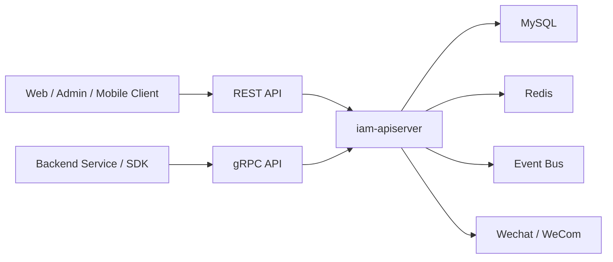

这张图只描述运行时外部关系。真正的系统结构，要从启动链路和分层边界看。

---

## 3. 从 main 到服务运行

IAM 的启动链路可以概括为：

```text
main
  -> NewApp
  -> load options/config
  -> process.Run
  -> createAPIServer
  -> PrepareRun
  -> Run HTTP + gRPC
```

`internal/apiserver/app.go` 负责创建命令行 App、初始化日志、根据 options 创建 config，然后调用 `Run(cfg)`。根 `internal/apiserver/run.go` 不直接拥有启动细节，只把运行权委托给 `internal/apiserver/process.Run`。

`process.Run` 的职责是创建 API server、执行 `PrepareRun()`，然后运行 prepared server。

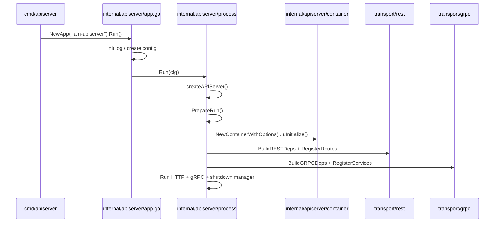

核心源码：

- [internal/apiserver/app.go](../../internal/apiserver/app.go)
- [internal/apiserver/run.go](../../internal/apiserver/run.go)
- [internal/apiserver/process/run.go](../../internal/apiserver/process/run.go)
- [internal/apiserver/process/root.go](../../internal/apiserver/process/root.go)
- [internal/apiserver/process/run_group.go](../../internal/apiserver/process/run_group.go)

---

## 4. process：进程生命周期编排层

`process` 是 IAM 运行时的生命周期编排层。

它不处理业务请求，也不实现业务规则。它负责把服务启动拆成可测试、可定位的阶段：

| 阶段 | 职责 |
| --- | --- |
| prepare runtime | 从配置推导运行模式、应用模式、是否允许降级启动 |
| prepare resources | 初始化 MySQL、Redis、IDP 加密密钥、EventBus |
| initialize container | 创建并初始化组合根 |
| initialize transports | 构建 HTTP/gRPC server 并注册路由/服务 |
| start runtime tasks | 启动 key rotation、suggest refresh、outbox relay 等运行期任务 |
| register shutdown callbacks | 注册优雅关闭回调 |

这些阶段在 `prepare_runner.go` 中明确声明，资源、container、transport 的装配细节在 `bootstrap.go` 中完成。

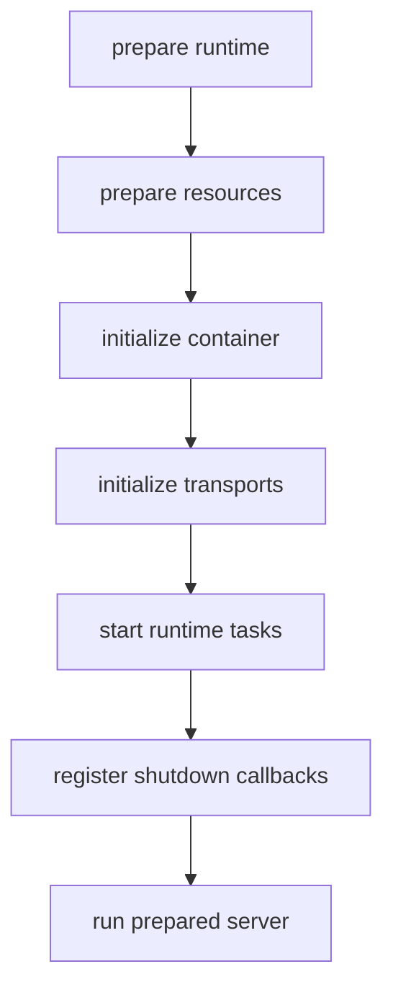

### 为什么需要 process 层？

如果没有 `process`，启动逻辑很容易散落在 `main`、container、server、router、module assembler 里，最后变成：

```text
入口知道配置
配置知道资源
资源知道模块
模块知道路由
路由知道业务服务
```

这样会导致启动顺序、降级策略、后台任务和关闭逻辑都很难维护。

`process` 的价值是把“服务如何启动和关闭”集中起来，让业务模块只关心能力装配，让 transport 只关心协议适配。

核心源码：

- [internal/apiserver/process/prepare_runner.go](../../internal/apiserver/process/prepare_runner.go)
- [internal/apiserver/process/bootstrap.go](../../internal/apiserver/process/bootstrap.go)
- [internal/apiserver/process/runtime_mode.go](../../internal/apiserver/process/runtime_mode.go)
- [internal/apiserver/process/shutdown_lifecycle.go](../../internal/apiserver/process/shutdown_lifecycle.go)

---

## 5. container：业务模块组合根

`container` 是 IAM 的组合根。它负责把 MySQL、Redis、EventBus、IDP encryption key、runtime options 等运行时资源装配成业务模块。

当前 container 管理的核心模块包括：

| 模块 | 职责 |
| --- | --- |
| AuthN | 登录、账号、Token、Session、JWKS |
| AuthZ | 角色、资源、权限、RoleBinding、授权判定 |
| User / Identity | 用户、Profile、ProfileLink |
| IDP | 微信应用配置、AppSecret、AccessToken、外部身份源 |
| Suggest | 儿童档案联想搜索 |
| CacheGovernance | 缓存族状态读取与治理 |
| Eventing / Outbox | 领域事件 catalog、publisher、outbox store、relay |

`Container` 持有这些模块和基础设施资源，并通过 `Initialize()` 执行 bootstrap plan。

初始化顺序是：

```text
event runtime
  -> idp module
  -> authn module
  -> authz module
  -> user module
  -> suggest module
  -> cache governance
```

这个顺序不是随意的。AuthN 依赖 IDP 能力，User 依赖 AuthN 的 SessionManager 和 AuthZ 的 RoleNameReader，所以必须先装配上游模块，再装配依赖它们的模块。

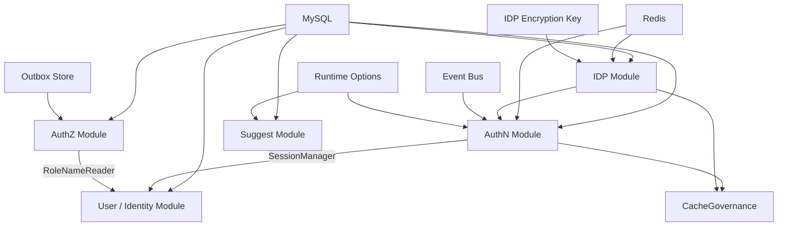

### container 不应该做什么？

container 不应该处理 HTTP 请求，不应该解析 REST DTO，不应该拼 gRPC response，也不应该承载业务规则。

它只做三件事：

1. 创建模块；
2. 注入依赖；
3. 暴露模块能力给 REST/gRPC/runtime。

例如 REST 依赖不是直接暴露整个 module，而是通过 `BuildRESTDeps()` 收集 handler 所需的应用能力；gRPC 依赖则通过 `BuildGRPCDeps()` 生成 service registration。

核心源码：

- [internal/apiserver/container/container.go](../../internal/apiserver/container/container.go)
- [internal/apiserver/container/bootstrap.go](../../internal/apiserver/container/bootstrap.go)
- [internal/apiserver/container/module_graph.go](../../internal/apiserver/container/module_graph.go)
- [internal/apiserver/container/rest_deps.go](../../internal/apiserver/container/rest_deps.go)
- [internal/apiserver/container/grpc_registry.go](../../internal/apiserver/container/grpc_registry.go)

---

## 6. transport：协议适配层

IAM 当前有两个 transport：

```text
internal/apiserver/transport/rest
internal/apiserver/transport/grpc
```

它们的职责是：

- 注册路由或 gRPC service；
- 解析 request；
- 做 DTO / mapper 转换；
- 调用 application service；
- 映射 response 和错误；
- 接入认证/授权中间件。

它们不应该直接访问数据库、Redis、Casbin adapter，也不应该知道模块是如何被初始化的。

### REST 注册流

REST Router 接收 container 投影出来的 `Deps`，然后注册：

- base routes；
- cache governance debug routes；
- AuthN/AuthZ/IDP/Identity/Suggest module routes；
- admin routes。

如果 container 未初始化，则只注册基础和部分 debug 路由，不注册业务模块路由。若 AuthN token service 不可用，则受保护路由不会被注册。这个设计能避免服务在半初始化状态下暴露伪可用接口。

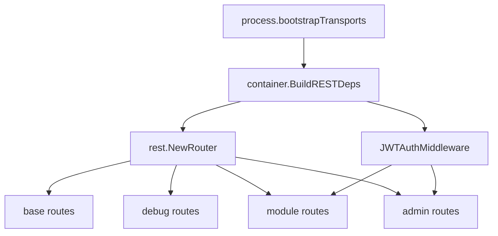

核心源码：

- [internal/apiserver/transport/rest/router.go](../../internal/apiserver/transport/rest/router.go)
- [internal/apiserver/transport/rest/module_routes.go](../../internal/apiserver/transport/rest/module_routes.go)
- [internal/apiserver/transport/rest/base_routes.go](../../internal/apiserver/transport/rest/base_routes.go)
- [internal/apiserver/transport/rest/debug_routes.go](../../internal/apiserver/transport/rest/debug_routes.go)

### gRPC 注册流

gRPC 层同样不直接 new 业务模块。container 根据已初始化模块生成 registration 列表，然后由 `transport/grpc.Registry` 逐个注册服务。

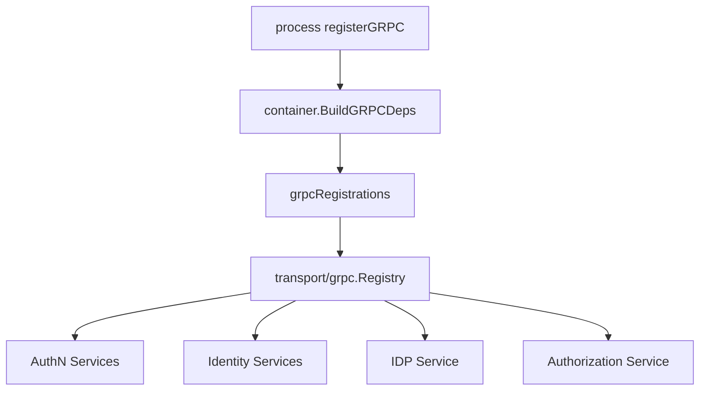

核心源码：

- [internal/apiserver/container/grpc_registry.go](../../internal/apiserver/container/grpc_registry.go)
- [internal/apiserver/transport/grpc/registry.go](../../internal/apiserver/transport/grpc/registry.go)
- [api/grpc/iam/authn/v2/authn.proto](../../api/grpc/iam/authn/v2/authn.proto)
- [api/grpc/iam/authz/v2/authz.proto](../../api/grpc/iam/authz/v2/authz.proto)
- [api/grpc/iam/identity/v2/identity.proto](../../api/grpc/iam/identity/v2/identity.proto)
- [api/grpc/iam/idp/v2/idp.proto](../../api/grpc/iam/idp/v2/idp.proto)

---

## 7. application / domain / infra：业务内核分层

IAM 的业务内核可以按六边形架构理解：

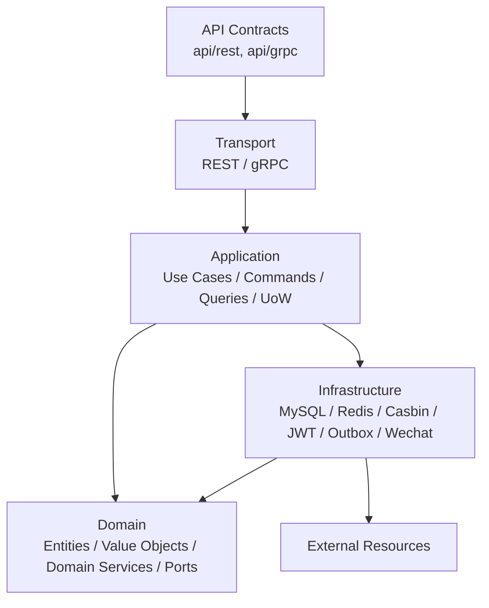

各层职责如下：

| 层 | 职责 | 不应该做的事 |
| --- | --- | --- |
| `transport` | 协议适配、DTO、mapper、中间件、错误映射 | 不写业务规则，不直接操作数据库 |
| `application` | 用例编排、事务边界、命令/查询、跨聚合协作 | 不依赖 REST/gRPC，不泄漏协议对象 |
| `domain` | 领域模型、值对象、领域服务、业务规则、端口定义 | 不依赖数据库、Redis、Casbin 实现 |
| `infra` | 外部资源适配，实现仓储、缓存、JWT、Casbin、微信 API、Outbox | 不承载业务语言本身 |

这不是纯理论。项目里有架构测试约束这些边界，例如 domain 不应依赖 infra/database，application 不应依赖 transport，REST router 不应依赖 container/global config，assembler 必须使用 typed deps，transport 不能直接依赖 Casbin facts 等。

核心源码：

- [internal/apiserver/application](../../internal/apiserver/application)
- [internal/apiserver/domain](../../internal/apiserver/domain)
- [internal/apiserver/infra](../../internal/apiserver/infra)
- [internal/pkg/architecture/architecture_test.go](../../internal/pkg/architecture/architecture_test.go)

---

## 8. 核心业务模块

### 8.1 AuthN：认证、Token、Session、JWKS

AuthN 负责用户如何登录，以及登录后凭证如何被签发、刷新、验证、撤销。

核心链路不是 handler 直接查账号，而是：

```text
Login request
  -> SignInAdapterCatalog
  -> MethodSelector
  -> AuthCredential proof
  -> Authenticator / AuthStrategy
  -> TokenIssuer
  -> Session / RefreshToken / JWT / JWKS
```

这个设计允许 password、phone_otp、wechat、wecom、bearer 等登录方式通过 adapter/strategy 扩展，而不是在 handler 或 login service 里堆巨大条件分支。

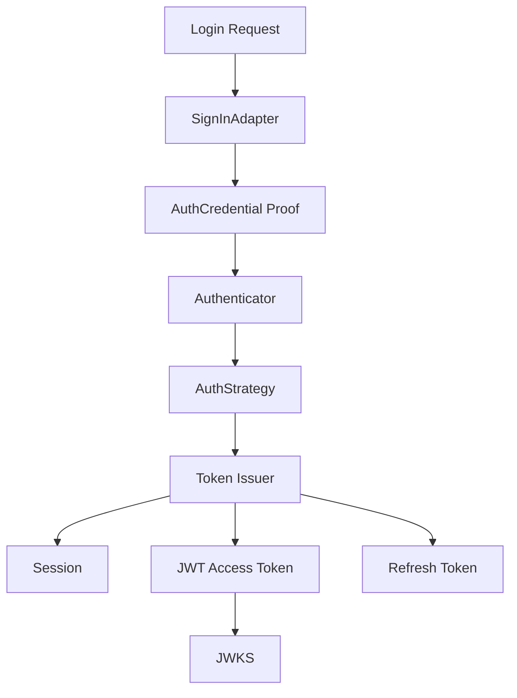

核心源码：

- [internal/apiserver/application/authn/login](../../internal/apiserver/application/authn/login)
- [internal/apiserver/application/authn/token](../../internal/apiserver/application/authn/token)
- [internal/apiserver/application/authn/jwks](../../internal/apiserver/application/authn/jwks)
- [internal/apiserver/domain/authn](../../internal/apiserver/domain/authn)
- [internal/apiserver/infra/token](../../internal/apiserver/infra/token)

### 8.2 AuthZ：角色、资源、权限、授权判定

AuthZ 负责回答：

> 某个 subject 在某个 tenant/scope 下，能不能对某个 resource 执行某个 action？

它的核心对象包括：

- Role；
- Resource；
- Permission；
- RoleBinding；
- AuthorizationRequest；
- AuthorizationDecision；
- PolicyVersion。

对外合同里仍然可以使用 `assignment`，但内部领域语言统一使用 `rolebinding`。这能避免外部兼容术语污染内部模型。

授权写入不是简单 CRUD，而是：

```text
Command
  -> AuthorizationPolicy
  -> PolicyChange
  -> PolicyChangeCommitter
  -> UoW
  -> authorization facts
  -> policy version
  -> outbox event
  -> runtime policy reload
```

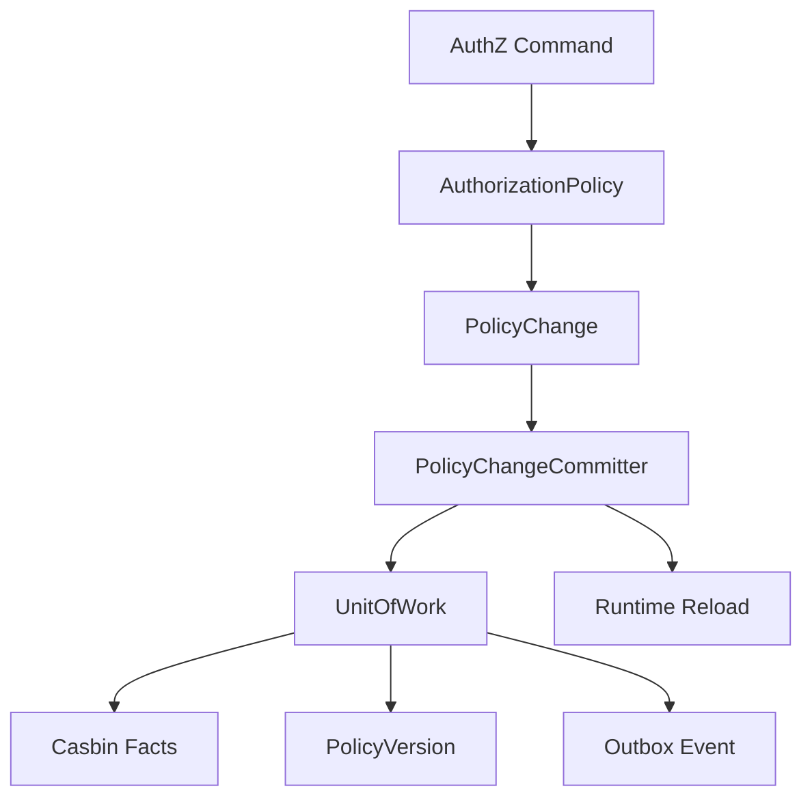

Casbin 在这里是基础设施适配器，不是 IAM 的业务语言。业务层说 Role、Resource、Permission、RoleBinding；infra/casbin 才负责 p/g rules 和 Enforce。

核心源码：

- [internal/apiserver/domain/authz](../../internal/apiserver/domain/authz)
- [internal/apiserver/application/authz](../../internal/apiserver/application/authz)
- [internal/apiserver/infra/casbin](../../internal/apiserver/infra/casbin)
- [internal/apiserver/application/authz/policy/committer.go](../../internal/apiserver/application/authz/policy/committer.go)

### 8.3 Identity / ProfileLink：用户与档案关系

Identity 模块负责用户、Profile、ProfileLink。

这里最重要的模型是 `ProfileLink`。它表达 User 与 Profile 的关系，例如 self、parent、grandparent、other。

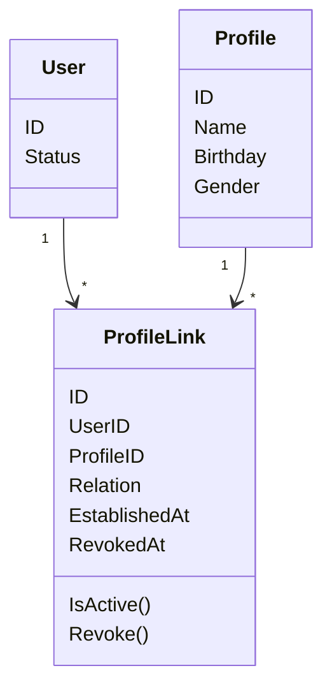

ProfileLink 独立成模型，是因为一个用户可以关联多个 Profile，一个 Profile 也可能被多个用户关联。把这个关系塞进 User 或 Profile 都会让查询和撤销历史变得混乱。

当前用户视角通过 `MyProfileLinks` 做边界保护，防止用户操作其他用户的关系。self profile/link 则由 `SelfProfileEnsurer` 维护，保证登录用户有自己的基础档案关系。

核心源码：

- [internal/apiserver/domain/uc/profilelink](../../internal/apiserver/domain/uc/profilelink)
- [internal/apiserver/application/uc/profilelink](../../internal/apiserver/application/uc/profilelink)
- [internal/apiserver/application/uc/uow](../../internal/apiserver/application/uc/uow)
- [internal/apiserver/transport/rest/identity](../../internal/apiserver/transport/rest/identity)
- [internal/apiserver/transport/grpc/service/uc/identity](../../internal/apiserver/transport/grpc/service/uc/identity)

### 8.4 IDP：第三方身份源

IDP 模块负责第三方身份源配置，当前重点是微信应用：

- 微信应用配置；
- AppSecret 加密存储；
- SecretVault 解密；
- AccessToken 缓存；
- 微信 API 调用适配。

IDP 不负责最终登录态。微信 code exchange 只是认证过程的一部分，账号绑定、session、token 仍由 AuthN 统一处理。

核心源码：

- [internal/apiserver/application/idp/wechatapp](../../internal/apiserver/application/idp/wechatapp)
- [internal/apiserver/domain/idp/wechatapp](../../internal/apiserver/domain/idp/wechatapp)
- [internal/apiserver/infra/wechatapi](../../internal/apiserver/infra/wechatapi)
- [internal/apiserver/container/assembler/idp.go](../../internal/apiserver/container/assembler/idp.go)

### 8.5 Suggest：档案联想搜索

Suggest 负责基于 Profile 候选数据提供联想搜索。

它不建立 ProfileLink，也不判断用户是否有权访问某个 Profile。  
它只是候选发现能力，关系建立仍然要走 Identity/ProfileLink，权限判定仍然要走 AuthZ。

核心源码：

- [internal/apiserver/application/suggest](../../internal/apiserver/application/suggest)
- [internal/apiserver/infra/suggest](../../internal/apiserver/infra/suggest)
- [internal/apiserver/container/assembler/suggest.go](../../internal/apiserver/container/assembler/suggest.go)
- [internal/apiserver/transport/rest/suggest](../../internal/apiserver/transport/rest/suggest)

---

## 9. 事件与 Outbox：授权变化如何传播

IAM 中最有工程价值的一条链路是 AuthZ policy version event。

当授权策略发生变化时，系统不仅要写授权事实，还要：

1. 递增 policy version；
2. stage domain event；
3. 将事件写入 MySQL outbox；
4. 由后台 relay 发布到 event bus；
5. 让其他系统或运行时感知授权变化。

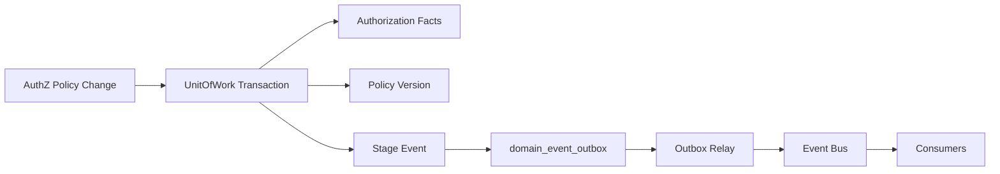

这条链路的关键不是“发消息”，而是 **授权事实和 outbox 记录在同一个数据库事务中提交**。这样即使消息系统不可用，授权事实也不会丢失对应事件。relay 在 event bus 不可用时不会 claim 事件，记录会保留在 pending/failed 状态，等待后续恢复。

这体现了 IAM 的一个重要设计取向：

> 同步写入保证事实正确，异步事件保证跨系统最终一致。

核心源码：

- [internal/apiserver/application/authz/policy/committer.go](../../internal/apiserver/application/authz/policy/committer.go)
- [internal/apiserver/application/authz/shared/version_event.go](../../internal/apiserver/application/authz/shared/version_event.go)
- [internal/apiserver/infra/mysql/eventoutbox](../../internal/apiserver/infra/mysql/eventoutbox)
- [internal/apiserver/infra/messaging/outbox_relay.go](../../internal/apiserver/infra/messaging/outbox_relay.go)
- [pkg/outboxcore](../../pkg/outboxcore)
- [pkg/eventruntime](../../pkg/eventruntime)

---

## 10. 降级启动与半可用边界

IAM 支持受控的 degraded startup。

当数据库、Redis、IDP encryption key 等资源不可用时，`process.prepareResources` 会根据运行模式判断是否允许降级启动。严格模式下关键资源不可用会失败退出；允许降级时，系统会记录 warning，并尽量启动基础能力。

但降级启动不等于业务可用。

REST router 会根据 container 和模块状态决定是否注册业务路由：

- container 未初始化：只注册基础/debug 路由；
- AuthN token service 不可用：受保护路由不注册；
- AuthZ 可用但 JWT middleware 不可用：AuthZ/Identity/Suggest 等受保护路由不注册。

这个设计的价值是防止系统“看起来启动了，但业务接口实际不可用”。

核心源码：

- [internal/apiserver/process/bootstrap.go](../../internal/apiserver/process/bootstrap.go)
- [internal/apiserver/transport/rest/router.go](../../internal/apiserver/transport/rest/router.go)
- [internal/apiserver/transport/rest/module_routes.go](../../internal/apiserver/transport/rest/module_routes.go)

---

## 11. 架构护栏

IAM 的架构边界不是只靠约定维护，而是通过测试约束。

典型护栏包括：

| 护栏 | 保护的设计 |
| --- | --- |
| domain 不依赖 infra/database | 保持领域规则纯净 |
| application 不依赖 transport | 用例不绑定 REST/gRPC |
| REST router 不依赖 container/global config | transport 消费显式 deps |
| assembler 使用 typed deps | 避免 `interface{}` 黑盒注入 |
| assembler 不构造 transport | transport 自己负责 handler/service |
| AuthZ 内部不使用 assignment 包 | 内部统一 rolebinding 领域语言 |
| Casbin facts 不进入 domain/transport | Casbin 只作为 infra adapter |
| Suggest application 不依赖 infra/cron/filesystem | application 只依赖候选数据端口 |

这些规则集中体现在：

- [internal/pkg/architecture/architecture_test.go](../../internal/pkg/architecture/architecture_test.go)

这说明 IAM 的架构不是“画图好看”，而是有自动化测试防止回退。

---

## 12. 推荐源码阅读路线

第一次阅读 IAM，不建议从 handler 或 repository 随机看。推荐按下面路线：

### 第一轮：看运行时装配

```text
cmd/apiserver/apiserver.go
internal/apiserver/app.go
internal/apiserver/run.go
internal/apiserver/process/run.go
internal/apiserver/process/root.go
internal/apiserver/process/prepare_runner.go
internal/apiserver/process/bootstrap.go
```

目标：搞清服务怎么启动。

### 第二轮：看 container 装配

```text
internal/apiserver/container/container.go
internal/apiserver/container/bootstrap.go
internal/apiserver/container/module_graph.go
internal/apiserver/container/rest_deps.go
internal/apiserver/container/grpc_registry.go
```

目标：搞清模块依赖关系。

### 第三轮：看 transport 注册

```text
internal/apiserver/transport/rest/router.go
internal/apiserver/transport/rest/module_routes.go
internal/apiserver/transport/grpc/registry.go
```

目标：搞清 REST/gRPC 如何接入模块能力。

### 第四轮：看核心业务链路

```text
internal/apiserver/application/authn/login
internal/apiserver/application/authn/token
internal/apiserver/domain/authn
internal/apiserver/application/authz
internal/apiserver/domain/authz
internal/apiserver/application/uc/profilelink
internal/apiserver/domain/uc/profilelink
```

目标：搞清 AuthN、AuthZ、ProfileLink 的业务模型。

### 第五轮：看工程亮点

```text
internal/apiserver/application/authz/policy/committer.go
internal/apiserver/infra/mysql/eventoutbox
internal/apiserver/infra/messaging/outbox_relay.go
internal/pkg/architecture/architecture_test.go
```

目标：搞清事务、事件传播和架构护栏。

---

## 13. 本文总结

IAM 的架构主线可以压缩成一句话：

> `process` 管生命周期，`container` 管模块装配，`transport` 管协议适配，`application` 管用例编排，`domain` 管业务规则，`infra` 管外部资源适配。

它不是简单 CRUD 项目，而是围绕身份认证、授权判定、用户档案关系和授权事件传播构建的 IAM 服务。

后续文档应围绕四条主线展开：

1. 运行时主线：服务如何启动、装配、降级、关闭；
2. 认证主线：登录如何变成 session/token/JWKS；
3. 授权主线：角色/资源/策略如何变成在线判定和版本事件；
4. 关系主线：User/Profile/ProfileLink 如何支撑业务身份关系。

---

## 验证建议

```bash
make docs-hygiene
go test ./internal/pkg/architecture \
  ./internal/apiserver/process \
  ./internal/apiserver/container \
  ./internal/apiserver/transport/...
```

这组测试用于验证本文涉及的架构边界、运行时装配、container 能力投影和 REST/gRPC 注册事实。
