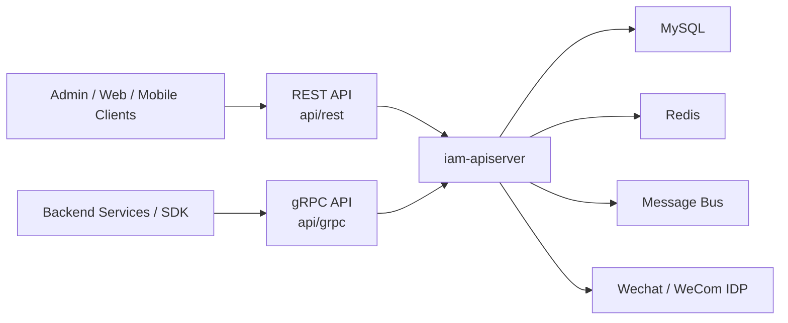
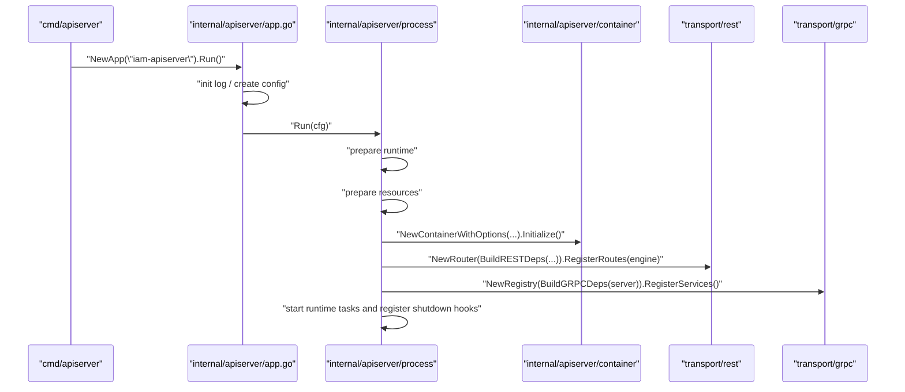
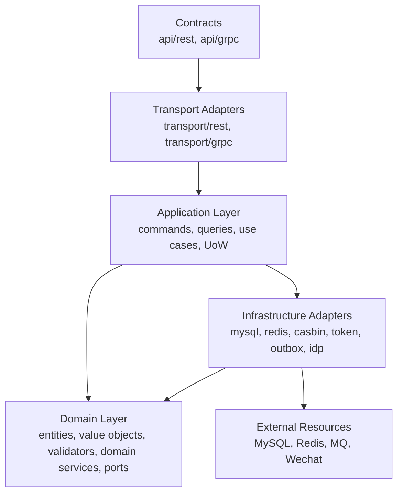
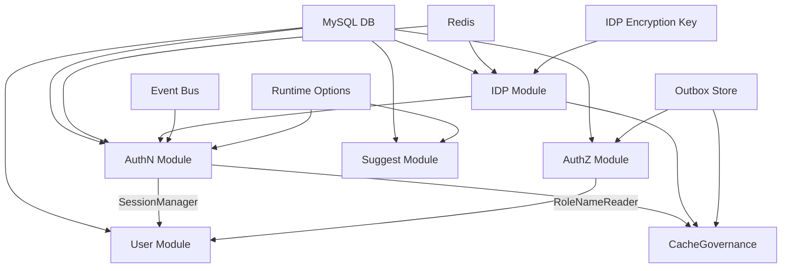
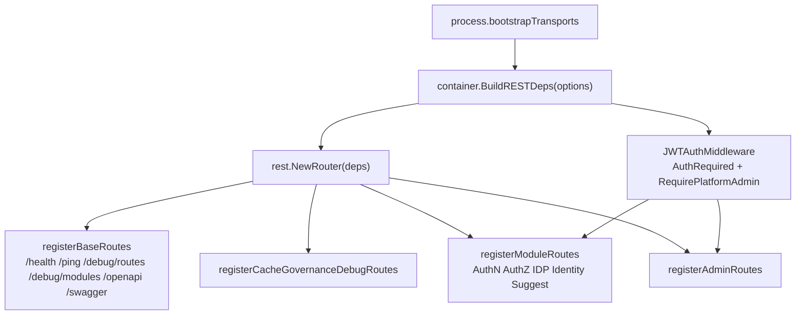
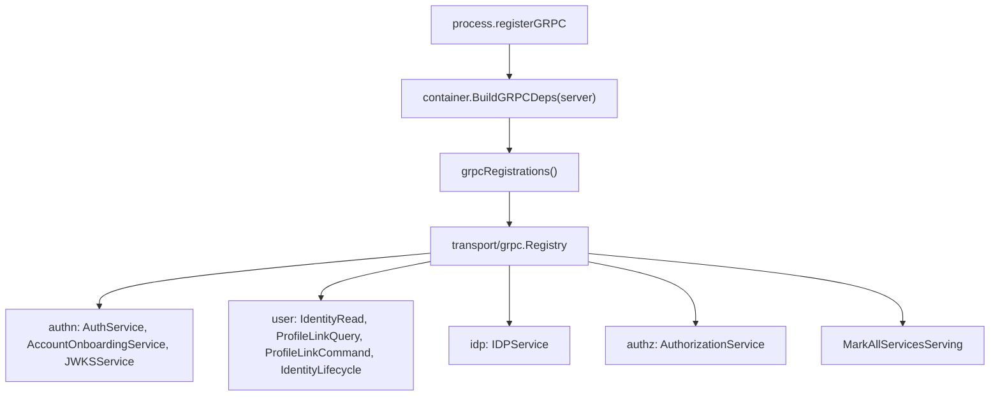
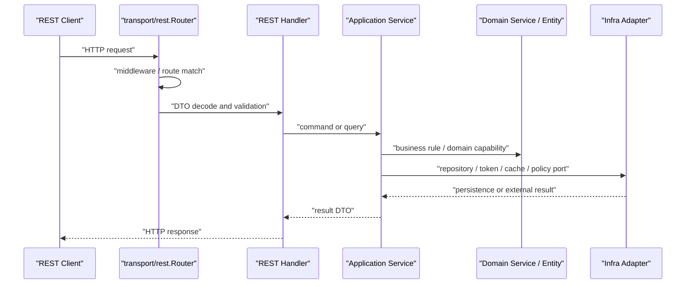
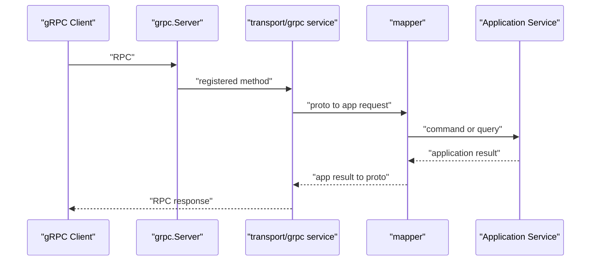

# 系统架构总览

## 本文回答

本文回答：重构后的 IAM 如何从一个进程入口，装配成同时提供 REST、gRPC、后台任务、事件中继和 graceful shutdown 的服务；各层为什么存在，分别解决什么问题。

## 30 秒结论

- IAM 当前不是由旧式 server/router 包直接拼装，而是由 `cmd/apiserver -> app -> process -> container -> transport` 逐级交接职责。
- `process` 是生命周期编排层：准备运行模式、数据库、Redis、事件总线、container、HTTP/gRPC server、后台任务和关闭回调。
- `container` 是组合根：按模块依赖图装配 AuthN、AuthZ、User、IDP、Suggest、CacheGovernance，并把应用能力投影成 REST/gRPC 所需的 deps。
- `transport/rest` 与 `transport/grpc` 是协议适配层：只关心路由、handler、middleware、DTO、错误映射和服务注册，不直接拥有业务规则。
- `application/domain/infra` 构成业务内核：application 编排用例和事务，domain 保存业务规则和端口，infra 实现 MySQL、Redis、Casbin、Token、Outbox、外部 IDP 等适配器。

## 主图：运行时上下文



这张图只表达运行时外部关系：REST/gRPC 是入站合同，MySQL/Redis/MQ/IDP 是出站资源。系统内部如何分层，由下面的装配图解释。

## 重点速查

| 问题 | 当前答案 | 主要证据 |
| ---- | ---- | ---- |
| 进程从哪里启动 | `main()` 调用 `apiserver.NewApp("iam-apiserver").Run()`。 | [../../cmd/apiserver/apiserver.go](../../cmd/apiserver/apiserver.go) |
| 配置在哪里转运行时 | `internal/apiserver/app.go` 初始化日志、创建 config，再调用 `Run(cfg)`。 | [../../internal/apiserver/app.go](../../internal/apiserver/app.go) |
| 生命周期怎么拆 | `prepareRunner` 由 6 个 stage 组成。 | [../../internal/apiserver/process/prepare_runner.go](../../internal/apiserver/process/prepare_runner.go) |
| 模块怎么装配 | `Container.Initialize()` 执行 bootstrap plan；`moduleGraph` 提供 typed deps。 | [../../internal/apiserver/container/bootstrap.go](../../internal/apiserver/container/bootstrap.go)、[../../internal/apiserver/container/module_graph.go](../../internal/apiserver/container/module_graph.go) |
| REST 怎么注册 | process 构建 `rest.Deps`，`Router.RegisterRoutes()` 注册 base/debug/module/admin routes。 | [../../internal/apiserver/process/bootstrap.go](../../internal/apiserver/process/bootstrap.go)、[../../internal/apiserver/transport/rest/router.go](../../internal/apiserver/transport/rest/router.go) |
| gRPC 怎么注册 | container 生成 `[]Registration`，`Registry.RegisterServices()` 逐个注册。 | [../../internal/apiserver/container/grpc_registry.go](../../internal/apiserver/container/grpc_registry.go)、[../../internal/apiserver/transport/grpc/registry.go](../../internal/apiserver/transport/grpc/registry.go) |
| 边界如何防回退 | 架构测试约束 domain/application/transport/container/process 的依赖方向。 | [../../internal/pkg/architecture/architecture_test.go](../../internal/pkg/architecture/architecture_test.go) |

## 1. 从入口到运行时

### 启动调用链



### `process` 为什么存在

`process` 解决的是“服务启动和关闭到底由谁负责”的问题。它把启动过程拆成可测试、可定位的阶段，避免入口包、container 和 transport 互相知道太多细节。

| 阶段 | 代码名 | 解决的问题 | 输出 |
| ---- | ---- | ---- | ---- |
| 准备运行时 | `prepareRuntimeStage` | 从配置推导运行模式、应用模式、是否允许降级启动。 | `runtimeOutput` |
| 准备资源 | `resourceStage` | 初始化数据库、Redis、IDP 加密密钥、事件总线。 | `resourceOutput` |
| 初始化 container | `containerStage` | 用资源和 typed options 创建并初始化组合根。 | `containerOutput` |
| 初始化 transport | `transportStage` | 构建 HTTP/gRPC server 并注册 REST/gRPC 能力。 | `transportOutput` |
| 启动运行期任务 | `runtimeTaskStage` | 启动 scheduler、outbox relay 等后台任务。 | 生命周期回调 |
| 注册关闭回调 | `shutdownStage` | 把资源清理和后台任务停止接入 graceful shutdown。 | shutdown hooks |

代码证据：阶段列表在 [../../internal/apiserver/process/prepare_runner.go](../../internal/apiserver/process/prepare_runner.go)，资源和 transport 装配在 [../../internal/apiserver/process/bootstrap.go](../../internal/apiserver/process/bootstrap.go)，运行期任务和 outbox relay 在 [../../internal/apiserver/process/shutdown_lifecycle.go](../../internal/apiserver/process/shutdown_lifecycle.go)。

### 降级启动边界

`prepareResources` 在数据库、Redis、IDP 密钥等资源不可用时，会根据运行模式判断是否允许降级启动。这个设计服务两个目标：

- 开发或诊断场景中，允许服务以受控方式暴露 `/health`、`/debug/modules` 等信息。
- 生产或严格模式中，关键资源不可用时失败退出，避免注册半可用业务路由。

降级不是业务可用性的承诺。REST router 在 container 未初始化时只注册基础和部分 debug 路由；受保护业务路由依赖 AuthN token service，缺失时会跳过注册。

## 2. 六边形分层



> 说明：图中 `Application --> Infra` 表示组合后的运行时对象会调用 infra 实现的端口。架构约束上，application 包不应直接依赖 transport，也应尽量通过端口隔离基础设施细节；具体边界由架构测试保护。

### 各层职责

| 层 | 为什么要有 | 解决什么问题 | IAM 中如何落地 |
| ---- | ---- | ---- | ---- |
| `cmd/apiserver` | 提供最薄进程入口。 | 避免入口夹带配置、server、模块装配细节。 | 只导入 apiserver 包和 swagger docs。 |
| `app` | 接入通用命令行 App 框架。 | 把 options、log、config 创建和 process 启动分开。 | [../../internal/apiserver/app.go](../../internal/apiserver/app.go) |
| `process` | 集中生命周期。 | 启动阶段、降级策略、运行期任务、关闭顺序可测试。 | [../../internal/apiserver/process](../../internal/apiserver/process) |
| `container` | 组合根。 | 模块依赖显式化，避免 handler/service/repo 到处 new。 | [../../internal/apiserver/container](../../internal/apiserver/container) |
| `transport` | 协议适配。 | REST/gRPC DTO、路由、中间件、错误映射与业务规则分离。 | [../../internal/apiserver/transport](../../internal/apiserver/transport) |
| `application` | 用例编排。 | 命令、查询、事务、跨聚合协作不污染 domain。 | [../../internal/apiserver/application](../../internal/apiserver/application) |
| `domain` | 业务规则。 | 保持实体、值对象、校验器、领域服务不依赖数据库和协议。 | [../../internal/apiserver/domain](../../internal/apiserver/domain) |
| `infra` | 外部资源适配。 | 把 MySQL、Redis、Casbin、JWT/keyset、IDP、Outbox 实现隔离在外圈。 | [../../internal/apiserver/infra](../../internal/apiserver/infra) |

## 3. Container 模块依赖图



### 组合根的设计意图

`container` 的职责不是处理请求，而是把“哪些模块需要哪些依赖”显式化。这样做解决三类问题：

- **启动顺序问题**：例如 AuthN 依赖 IDP 能力，User 依赖 AuthN 的 session manager 和 AuthZ 的 role name reader，因此 bootstrap plan 需要稳定顺序。
- **模块可替换问题**：模块内部可以重组仓储、应用服务和领域服务，只要对外暴露的 capabilities 不变，transport 不需要跟着改。
- **能力收集问题**：REST/gRPC 只消费 `Deps` 和 `Registration`，不应该直接穿透 container 模块结构。

主要证据：

- bootstrap plan 顺序：event runtime、idp、authn、authz、user、suggest、cache governance，见 [../../internal/apiserver/container/bootstrap.go](../../internal/apiserver/container/bootstrap.go)。
- typed deps 来源：`userModuleDependencies()`、`authnModuleDependencies()`、`authzModuleDependencies()`，见 [../../internal/apiserver/container/module_graph.go](../../internal/apiserver/container/module_graph.go)。
- REST capability 收集：见 [../../internal/apiserver/container/rest_deps.go](../../internal/apiserver/container/rest_deps.go)。
- gRPC registration 收集：见 [../../internal/apiserver/container/grpc_registry.go](../../internal/apiserver/container/grpc_registry.go)。

## 4. REST 注册流



REST 层当前遵循几条规则：

- base routes 总是优先注册，用于健康、ping、路由调试、模块状态、OpenAPI 和 Swagger UI。
- container 未初始化时，不注册业务模块路由，避免伪装成可用服务。
- AuthN token service 不可用时，受保护路由不注册；AuthZ 可用但 JWT middleware 不可用时，AuthZ/Identity/Suggest 也不会暴露为受保护业务面。
- CacheGovernance debug 面默认在非 production 开放；production 中强制要求 admin 保护。

对应代码在 [../../internal/apiserver/transport/rest/router.go](../../internal/apiserver/transport/rest/router.go)、[../../internal/apiserver/transport/rest/module_routes.go](../../internal/apiserver/transport/rest/module_routes.go)、[../../internal/apiserver/transport/rest/debug_routes.go](../../internal/apiserver/transport/rest/debug_routes.go)。

## 5. gRPC 注册流



gRPC 的关键设计是：服务注册由 transport registry 完成，但注册项由 container 根据已初始化模块生成。这样可以同时避免两个问题：

- container 不需要知道 gRPC server 的注册细节，只提供 `Register(*grpc.Server)` 函数。
- gRPC transport 不需要知道模块如何初始化，只消费 `Registration` 列表。

合同事实以 [../../api/grpc/iam/authn/v1/authn.proto](../../api/grpc/iam/authn/v1/authn.proto)、[../../api/grpc/iam/authz/v1/authz.proto](../../api/grpc/iam/authz/v1/authz.proto)、[../../api/grpc/iam/identity/v1/identity.proto](../../api/grpc/iam/identity/v1/identity.proto)、[../../api/grpc/iam/idp/v1/idp.proto](../../api/grpc/iam/idp/v1/idp.proto) 为准。

## 6. 业务请求穿透路径

### REST 请求



### gRPC 请求



这两条路径的共同点是：协议层只负责入站适配和出站响应；业务不应反向依赖 REST/gRPC。

## 7. 当前模块视图

| 模块 | 业务角色 | 主要应用能力 | 主要基础设施 |
| ---- | ---- | ---- | ---- |
| AuthN | 账号、登录、会话、Token、JWKS。 | `account`、`login`、`loginprep`、`onboarding`、`session`、`token`、`jwks`。 | MySQL、Redis、`infra/token/jwt`、`infra/token/keyset`、SMS、IDP。 |
| AuthZ | 角色、资源、策略、角色绑定、授权判定、授权快照。 | `authorization`、`policy`、`resource`、`role`、`rolebinding`。 | MySQL、Casbin、transactional outbox。 |
| User / Identity | 用户、档案、档案关系。 | `user`、`profile`、`profilelink`。 | MySQL UoW，AuthN session manager，AuthZ role name reader。 |
| IDP | 微信应用配置、密钥、远程 token 缓存。 | `idp/wechatapp`。 | MySQL、Redis、加密密钥、微信 API。 |
| Suggest | 儿童档案联想搜索。 | `suggest.ProfileSuggestor`。 | MySQL profile candidates、搜索索引适配器。 |
| CacheGovernance | 缓存族目录与状态只读治理面。 | `cachegovernance.ReadService`。 | 各模块 inspector、Redis/JWKS/outbox 状态读取器。 |

## 8. 架构护栏

当前架构不是只靠约定维护，而是有测试护栏：

| 护栏 | 保护的设计 | 代码位置 |
| ---- | ---- | ---- |
| domain 不依赖 infra/database | 领域规则不被数据库实现污染。 | [../../internal/pkg/architecture/architecture_test.go](../../internal/pkg/architecture/architecture_test.go) |
| application 不依赖 transport | 用例不绑定 REST/gRPC。 | [../../internal/pkg/architecture/architecture_test.go](../../internal/pkg/architecture/architecture_test.go) |
| REST router 不依赖 container/global config | transport 消费显式 deps。 | [../../internal/pkg/architecture/architecture_test.go](../../internal/pkg/architecture/architecture_test.go) |
| assembler 使用 typed deps | 模块装配不用 `interface{}` 黑盒参数。 | [../../internal/pkg/architecture/architecture_test.go](../../internal/pkg/architecture/architecture_test.go) |
| assembler 不构造 transport | 组合根只暴露应用能力，transport 自己建 handler/service。 | [../../internal/pkg/architecture/architecture_test.go](../../internal/pkg/architecture/architecture_test.go) |
| token/JWKS 实现边界 | Token 用例在 `application/authn/token`，JWT/keyset 在 `infra/token/*`。 | [../../internal/pkg/architecture/architecture_test.go](../../internal/pkg/architecture/architecture_test.go) |
| ProfileLink 语义边界 | 当前 Identity 关系能力以 `ProfileLink` 为标准术语。 | [../../internal/pkg/architecture/architecture_test.go](../../internal/pkg/architecture/architecture_test.go) |
| durable outbox 事件 | 持久事件先入 outbox，再由 relay 发布。 | [../../internal/pkg/architecture/architecture_test.go](../../internal/pkg/architecture/architecture_test.go) |

## 9. 如何验证本页事实

```bash
make docs-hygiene
go test ./internal/pkg/architecture ./internal/apiserver/process ./internal/apiserver/container ./internal/apiserver/transport/...
```

如果只想快速确认 00 文档没有重新传播退役事实，可以复用 [../../scripts/check-docs-links.py](../../scripts/check-docs-links.py) 中的 retired reference 列表，对活跃 00 文档运行同类关键词检查。预期结果是无输出。
