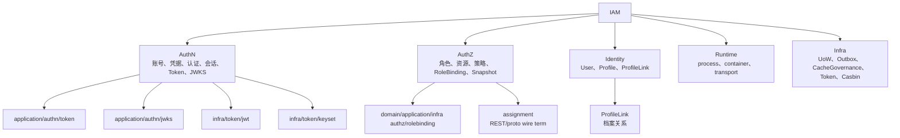
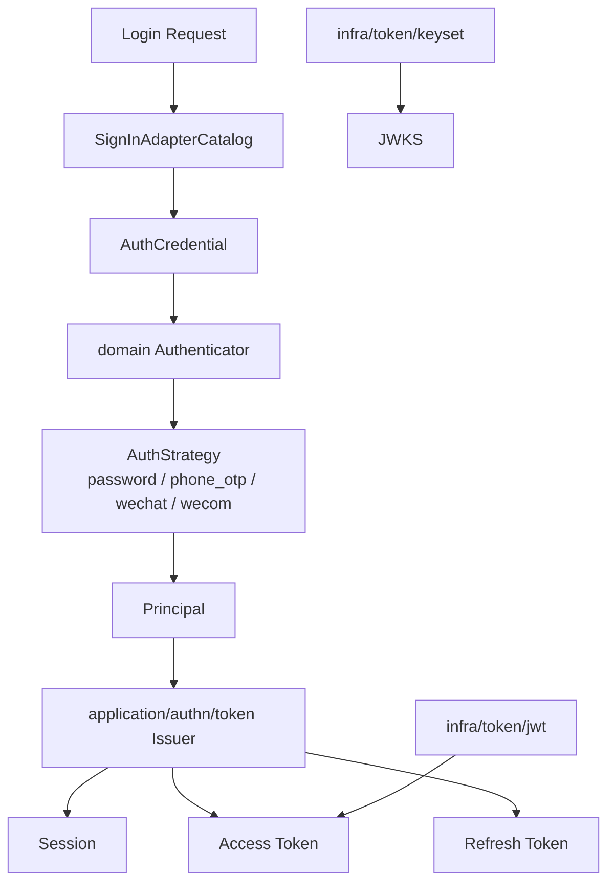
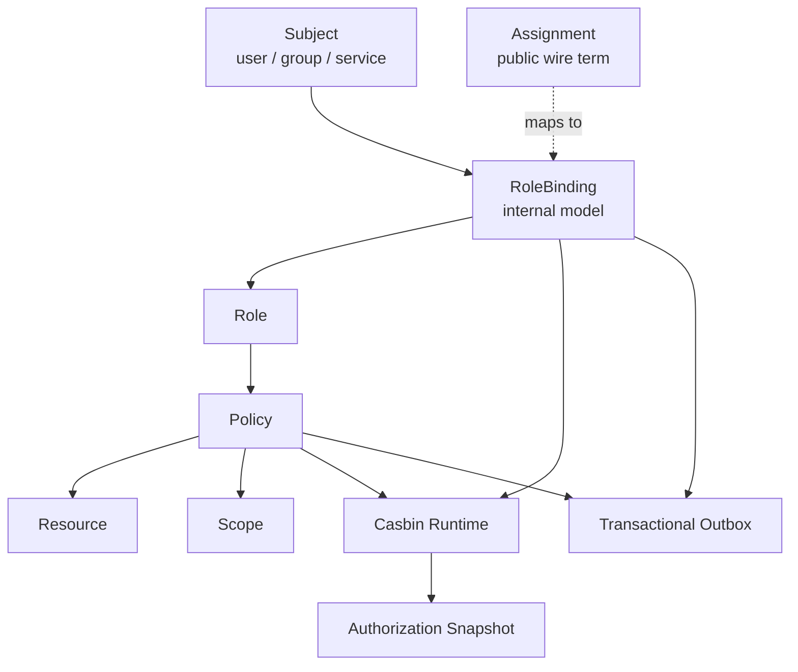
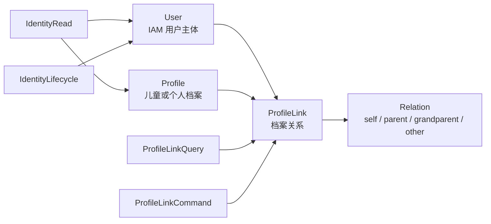
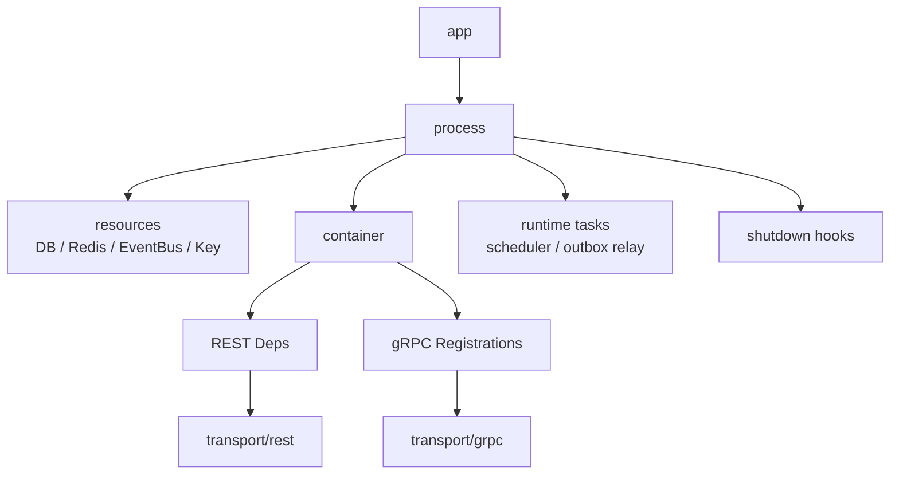
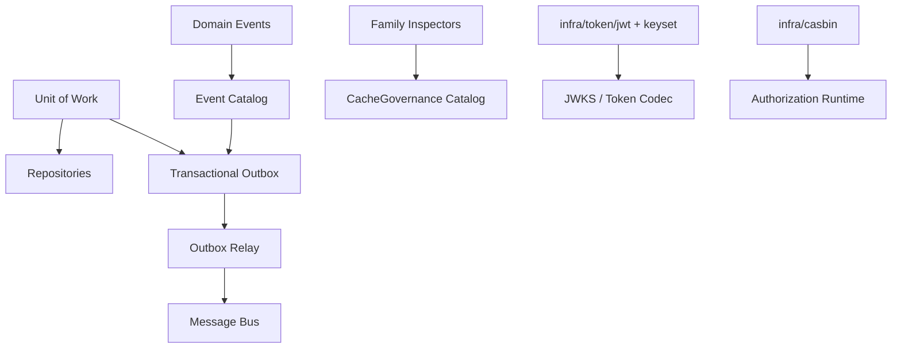

# 核心概念术语

## 本文回答

本文回答：IAM 当前文档中最容易漂移的核心概念，在业务语言、代码路径、REST/gRPC 合同和边界说明中分别应该怎么表达。

## 30 秒结论

- 认证域的核心不是“JWT 本身”，而是 Account、Credential、Authentication、Session、Token、JWKS 的协作；Token 用例在 `application/authn/token`，编码实现位于 `infra/token/*`。
- 授权域内部实现使用 `rolebinding` 表达“主体获得角色”；公开 REST/proto 中仍保留 `assignment` 作为 wire term，文档需要说明它是外部合同名。
- 身份域当前标准关系名是 `ProfileLink`：它表达 User 与 Profile 的档案关系，可以承载 self、parent、grandparent、other 等语义，但不是法律监护判定引擎。
- 运行时术语以 `process + container + transport` 为准；不要再把启动、装配和协议注册混成一个 server/router 层。
- 基础设施术语要把 UoW、transactional outbox、outbox relay、CacheGovernance、JWT/keyset、Casbin 分清楚，它们分别解决事务一致性、事件可靠投递、缓存可观测、token 编码和授权判定问题。

## 术语总览图

## 重点速查

| 概念 | 业务含义 | 代码名 | 契约名 | 不要混淆 |
| ---- | ---- | ---- | ---- | ---- |
| Account | 可登录账号。 | `domain/authn/account`、`application/authn/account` | REST account，gRPC `AccountOnboardingService` | Account 不等于 User；一个 User 可关联不同登录账号。 |
| Credential | 认证凭据，如密码、短信、微信身份。 | `domain/authn/credential`、`domain/authn/authentication` | 登录请求中的 method payload | Credential 不是 access token。 |
| Session | 登录后的在线状态。 | `domain/authn/session`、`application/authn/session` | Token claims 中的 `session_id` | 离线 JWKS 验签不能证明 session 仍有效。 |
| Token | 访问、刷新和服务间令牌能力。 | `application/authn/token` | REST/gRPC token APIs | JWT 是编码实现，不是应用用例本身。 |
| JWKS | 对外发布验签公钥集合。 | `application/authn/jwks`、`infra/token/keyset` | REST/gRPC `JWKSService` | JWKS 只解决验签公钥分发，不解决在线撤销。 |
| Role | 权限集合名。 | `domain/authz/role` | REST role，gRPC role name | Role 不是主体。 |
| Resource | 被保护对象。 | `domain/authz/resource` | REST resource，gRPC `object` | Resource 不是具体数据行的全部建模。 |
| Policy | 角色到资源动作的授权规则。 | `domain/authz/policy`、`application/authz/policy` | REST policy，gRPC permission | Policy 不是角色绑定。 |
| RoleBinding | 主体获得角色的内部模型。 | `domain/authz/rolebinding`、`application/authz/rolebinding` | REST/proto 中可称 assignment | 内部实现不要用 wire term 反向命名。 |
| Authorization Snapshot | 面向接入方的角色与权限快照。 | `application/authz/authorization` | gRPC `GetAuthorizationSnapshot` | Snapshot 是读取模型，不是授权事实写入口。 |
| User | IAM 用户主体。 | `domain/uc/user`、`application/uc/user` | REST/gRPC `User` | User 不是登录凭据。 |
| Profile | 儿童或个人档案。 | `domain/uc/profile`、`application/uc/profile` | REST/gRPC `Profile` | Profile 不是账号。 |
| ProfileLink | User 与 Profile 的档案关系。 | `domain/uc/profilelink`、`application/uc/profilelink` | REST/gRPC `ProfileLink` | 可表达监护关系语义，但不等同法律监护裁定。 |
| process | 服务生命周期。 | `internal/apiserver/process` | 无直接外部合同 | 不负责业务模块内部装配。 |
| container | 模块组合根。 | `internal/apiserver/container` | 无直接外部合同 | 不处理协议请求。 |
| transport | REST/gRPC 适配层。 | `internal/apiserver/transport` | `api/rest`、`api/grpc` | 不承载领域规则。 |

## 1. AuthN 概念模型

### AuthN 术语细节

| 术语 | 业务含义 | 代码证据 | 边界说明 |
| ---- | ---- | ---- | ---- |
| `SignInAdapterCatalog` | 登录方式目录，把外部登录请求转换成领域可认证的凭据或兼容验证路径。 | [../../internal/apiserver/application/authn/login/adapter_catalog.go](../../internal/apiserver/application/authn/login/adapter_catalog.go) | 它属于 application login，用来适配输入，不是领域认证策略本身。 |
| `AuthCredential` | 领域认证所需的凭据对象。 | [../../internal/apiserver/domain/authn/authentication](../../internal/apiserver/domain/authn/authentication) | 只表达认证所需数据，不负责签发 token。 |
| `AuthStrategy` | 针对凭据类型执行认证的领域策略。 | [../../internal/apiserver/domain/authn/authentication](../../internal/apiserver/domain/authn/authentication) | 策略返回认证判决，不直接写 session/token。 |
| `Principal` | 认证成功后的主体快照。 | [../../internal/apiserver/domain/authn/authentication/types.go](../../internal/apiserver/domain/authn/authentication/types.go)、[../../internal/apiserver/application/authn/token/ports.go](../../internal/apiserver/application/authn/token/ports.go) | Principal 是签发 token 的输入，不等于持久化用户实体。 |
| `TokenApplicationService` | access/refresh/service token 的应用能力入口。 | [../../internal/apiserver/application/authn/token](../../internal/apiserver/application/authn/token) | 不把 JWT 库细节暴露给 application 调用方。 |
| `AccessTokenCodec` | access/service token 编码端口。 | [../../internal/apiserver/application/authn/token/ports.go](../../internal/apiserver/application/authn/token/ports.go) | JWT 只是一个 infra 实现。 |
| `KeyManagement` / `KeyPublish` | JWKS 管理与发布应用服务。 | [../../internal/apiserver/application/authn/jwks](../../internal/apiserver/application/authn/jwks)、[../../internal/apiserver/infra/token/keyset](../../internal/apiserver/infra/token/keyset) | key lifecycle 行为归 keyset 实现，不应散落到协议层。 |

### AuthN 不变量

- 登录成功后，业务上得到的是 Principal；session 创建、access token 签发、refresh token 保存由 token issuer 编排。
- refresh token 是服务端可控状态；access token 可离线验签，但撤销、会话状态和主体状态需要在线 Verify。
- service token 不创建 refresh token，适合服务间调用。
- JWKS 发布公钥，不表达用户、账号、session 是否仍有效。

## 2. AuthZ 概念模型

### AuthZ 术语细节

| 术语 | 业务含义 | 代码证据 | 边界说明 |
| ---- | ---- | ---- | ---- |
| `Subject` | 被授权主体，包含类型和 ID。 | [../../internal/apiserver/domain/authz](../../internal/apiserver/domain/authz) | Subject 不是 User 的同义词，也可表达其他主体类型。 |
| `Role` | 命名权限集合。 | [../../internal/apiserver/domain/authz/role](../../internal/apiserver/domain/authz/role) | Role 本身不授予主体，授予关系由 RoleBinding 表达。 |
| `Resource` | 受保护资源定义。 | [../../internal/apiserver/domain/authz/resource](../../internal/apiserver/domain/authz/resource) | Resource 与 action/scope 共同构成权限语义。 |
| `Policy` | Role 到 Resource/action/scope 的规则。 | [../../internal/apiserver/domain/authz/policy](../../internal/apiserver/domain/authz/policy)、[../../internal/apiserver/application/authz/policy](../../internal/apiserver/application/authz/policy) | 领域用业务模型表达，Casbin tuple 留在 infra/application 边界之后。 |
| `RoleBinding` | 主体与角色之间的内部绑定。 | [../../internal/apiserver/domain/authz/rolebinding](../../internal/apiserver/domain/authz/rolebinding)、[../../internal/apiserver/application/authz/rolebinding](../../internal/apiserver/application/authz/rolebinding) | REST/proto 可称 assignment，但内部实现以 rolebinding 为准。 |
| `Authorization Snapshot` | 读取主体在某域和应用下的角色、权限与版本。 | [../../internal/apiserver/application/authz/authorization](../../internal/apiserver/application/authz/authorization)、[../../api/grpc/iam/authz/v2/authz.proto](../../api/grpc/iam/authz/v2/authz.proto) | Snapshot 适合接入方缓存或显示，不是策略写入口。 |
| `PolicyChangeCommitter` | 授权写操作的事务提交和事实同步入口。 | [../../internal/apiserver/application/authz/policy](../../internal/apiserver/application/authz/policy) | 与 UoW 和 outbox 协作，避免策略事实与事件割裂。 |

### AuthZ 不变量

- 内部实现使用 `rolebinding`；公开合同中保留 `assignment` 是兼容接入方的 wire term。
- Casbin 是授权判定运行时，不应向 transport 或 domain 泄漏为核心业务语言。
- 授权变更是事务性写操作，需要同时维护业务记录、授权事实和版本/事件。
- gRPC `AuthorizationService` 提供 Check、Snapshot、Grant/Revoke assignment wire term；具体实现仍落回 application authz 能力。

## 3. Identity / ProfileLink 概念模型

### Identity 术语细节

| 术语 | 业务含义 | 代码证据 | 边界说明 |
| ---- | ---- | ---- | ---- |
| `User` | IAM 内部用户主体。 | [../../internal/apiserver/domain/uc/user](../../internal/apiserver/domain/uc/user)、[../../internal/apiserver/application/uc/user](../../internal/apiserver/application/uc/user) | User 不等于 Account；User 可被账号、外部身份和 profile link 使用。 |
| `Profile` | 儿童或个人档案。 | [../../internal/apiserver/domain/uc/profile](../../internal/apiserver/domain/uc/profile)、[../../internal/apiserver/application/uc/profile](../../internal/apiserver/application/uc/profile) | Profile 是档案，不是登录主体。 |
| `ProfileLink` | User 与 Profile 的关系。 | [../../internal/apiserver/domain/uc/profilelink](../../internal/apiserver/domain/uc/profilelink)、[../../internal/apiserver/application/uc/profilelink](../../internal/apiserver/application/uc/profilelink) | 中文可解释为档案关系或监护关系语义，但代码和合同名以 ProfileLink 为准。 |
| `Linker` | 建立和撤销档案关系的领域能力。 | [../../internal/apiserver/domain/uc/profilelink](../../internal/apiserver/domain/uc/profilelink) | 负责领域校验和实体变化，持久化由 application/UoW 承担。 |
| `Commands` / `MyProfileLinks` / `Directory` | ProfileLink 的写用例、当前用户视角用例和查询用例。 | [../../internal/apiserver/application/uc/profilelink](../../internal/apiserver/application/uc/profilelink) | 当前用户视角会做访问边界检查，不能把它当成全局管理查询。 |

### ProfileLink 不变量

- 建立关系前需要验证 User 和 Profile 存在。
- 同一个 User 与 Profile 的 active 关系不能重复建立。
- revoke 是关系状态变化，不是删除业务语义。
- 当前用户视角的查询和撤销需要确认请求主体与 profile link 访问边界匹配。

## 4. Runtime 概念模型

| 术语 | 当前含义 | 代码证据 | 不要混淆 |
| ---- | ---- | ---- | ---- |
| `process` | 服务生命周期、资源准备、transport 注册、运行期任务和关闭回调。 | [../../internal/apiserver/process](../../internal/apiserver/process) | 不等于业务进程模型，也不直接处理路由。 |
| `container` | 模块组合根和能力收集器。 | [../../internal/apiserver/container](../../internal/apiserver/container) | 不等于依赖注入框架；当前是显式装配代码。 |
| `transport/rest` | REST 路由、handler、middleware 和 DTO 适配。 | [../../internal/apiserver/transport/rest](../../internal/apiserver/transport/rest) | 不承载领域规则。 |
| `transport/grpc` | gRPC service 注册、mapper 和错误映射。 | [../../internal/apiserver/transport/grpc](../../internal/apiserver/transport/grpc) | 不负责模块初始化。 |
| `ModuleStatus` | router 可见的模块初始化状态。 | [../../internal/apiserver/transport/rest/deps.go](../../internal/apiserver/transport/rest/deps.go) | 这是运行时暴露状态，不是业务健康的完整判断。 |

## 5. 基础设施概念模型

| 术语 | 业务/技术含义 | 代码证据 | 边界说明 |
| ---- | ---- | ---- | ---- |
| UoW | 一次用例内的事务边界和仓储集合。 | [../../pkg/uow](../../pkg/uow)、[../../internal/apiserver/infra/mysql/uow](../../internal/apiserver/infra/mysql/uow) | application 通过 UoW 编排事务，不直接散落开启事务。 |
| Transactional Outbox | 在业务事务中 stage durable events。 | [../../internal/apiserver/infra/mysql/eventoutbox](../../internal/apiserver/infra/mysql/eventoutbox)、[../../pkg/outboxcore](../../pkg/outboxcore) | 不直接把持久事件发布到 MQ。 |
| Outbox Relay | 周期性 claim due events 并发布到消息总线。 | [../../internal/apiserver/infra/messaging/outbox_relay.go](../../internal/apiserver/infra/messaging/outbox_relay.go)、[../../internal/apiserver/process/shutdown_lifecycle.go](../../internal/apiserver/process/shutdown_lifecycle.go) | relay 不改变业务事务，只处理投递状态。 |
| Event Catalog | 事件类型、topic、delivery class 的配置源。 | [../../configs/events.yaml](../../configs/events.yaml)、[../../pkg/eventcatalog](../../pkg/eventcatalog) | durable 事件必须走 outbox。 |
| CacheGovernance | 缓存族目录和只读状态检查。 | [../../internal/apiserver/application/cachegovernance](../../internal/apiserver/application/cachegovernance) | 治理面第一版只读，不负责在线修复缓存。 |
| JWT codec | access/service token 编码和验签实现。 | [../../internal/apiserver/infra/token/jwt](../../internal/apiserver/infra/token/jwt) | 编码实现不应渗透到 domain。 |
| Keyset | 签名密钥生命周期和 JWKS 发布快照。 | [../../internal/apiserver/infra/token/keyset](../../internal/apiserver/infra/token/keyset) | key lifecycle 行为归 infra/token/keyset。 |
| Casbin | 授权判定和策略事实运行时。 | [../../internal/apiserver/infra/casbin](../../internal/apiserver/infra/casbin)、[../../configs/casbin_model.conf](../../configs/casbin_model.conf) | Casbin tuple 是技术事实，不应成为领域核心术语。 |

## 6. 事实源和验证

| 术语类别 | 首选事实源 | 辅助验证 |
| ---- | ---- | ---- |
| REST 路径和请求响应 | [../../api/rest](../../api/rest) | [../../internal/apiserver/transport/rest](../../internal/apiserver/transport/rest) |
| gRPC 服务和消息 | [../../api/grpc](../../api/grpc) | [../../internal/apiserver/transport/grpc](../../internal/apiserver/transport/grpc) |
| 模块边界 | [../../internal/apiserver/container](../../internal/apiserver/container) | [../../internal/pkg/architecture](../../internal/pkg/architecture) |
| 领域规则 | [../../internal/apiserver/domain](../../internal/apiserver/domain) | application 用例测试 |
| 事务与事件 | [../../internal/apiserver/application](../../internal/apiserver/application)、[../../internal/apiserver/infra](../../internal/apiserver/infra) | outbox、UoW、架构测试 |

维护本页时，如果一个术语同时有代码名和公开合同名，优先在表格里同时写出两者，并明确“哪个是内部实现名、哪个是 wire term”。这比在正文里混用更安全。
