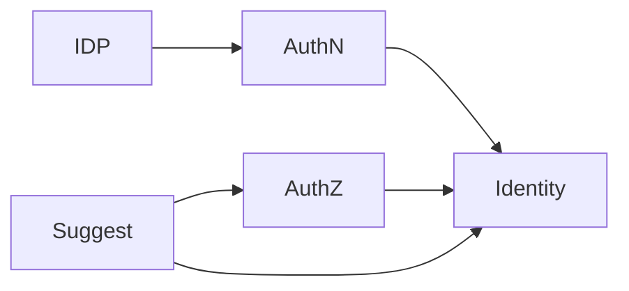

# 模块划分与协作关系

> 状态：待补证据 · 骨架初稿，待与代码/契约核对。

## 30 秒结论

IAM 模块分为 3 个核心模块和 2 个辅助模块：

- 核心模块：Identity、AuthN、AuthZ。
- 辅助模块：IDP、Suggest。

辅助模块可以支撑核心模块，但不能吞并核心模块的领域职责。

## 模块关系

## 职责边界

| 模块 | 拥有什么 | 不负责什么 |
| --- | --- | --- |
| Identity | User、Profile、ProfileLink | 登录态、Token、权限判定 |
| AuthN | LoginIdentity、Credential、Challenge、Principal、Session、Token | 授权判定、Profile 关系治理 |
| AuthZ | Subject、Resource、Action、Scope、Role、Permission、RoleBinding | 认证登录、User/Profile 写模型 |
| IDP | WechatApp、Credentials、外部身份源证明 | IAM 登录态、IAM Token、User 所有权 |
| Suggest | ProfileSearchTerm、ProfileAccessScope、索引快照 | Profile 写模型、通用授权策略管理 |

详细模块事实见 [02-业务模块](../02-业务模块/README.md)。
