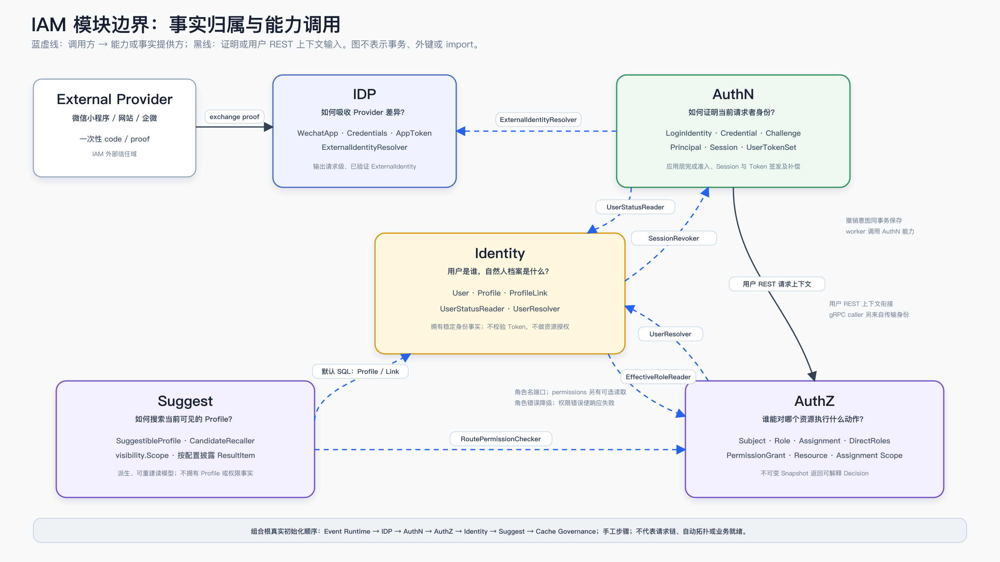

# 模块划分与协作关系：事实、事务与运行责任

> 状态：已实现 · 按当前组合根、应用调用和存储适配说明协作；扩展方案另标为候选。

## 1. 五个模块分开什么，又仍然共享什么？

IAM 是模块化单体：Identity 管内部身份事实，AuthN 管认证与在线状态，AuthZ 管授权事实和决策，IDP 吸收外部身份源差异，Suggest 提供派生搜索。划分依据是规则和变化原因，不能把目录直接解释为五个独立服务或已经完全隔离的限界上下文。

理解一次协作，要同时回答四件事：**谁定义事实、调用哪个能力、谁提交事务、谁启动并停止工作**。当前窄端口、跨模块仓储、共享数据库和后台投影并存；接口变窄只解决调用形状，没有自动解决后三种耦合。

| 模块 | 拥有的事实或规则 | 当前协作入口 | 仍保留的耦合 |
| --- | --- | --- | --- |
| Identity | User、Profile、ProfileLink及生命周期 | 向AuthN提供状态，向AuthZ提供User存在性；消费SessionRevoker与角色展示读取 | 标准生命周期UoW保存撤销任务；初始化可启动worker；共享MySQL |
| AuthN | LoginIdentity、Credential、Challenge、Session、Token及登录准入 | IDP解析外部证明；Identity状态读取 | SignUp直接使用Identity User仓储和模型，同库事务创建身份与登录入口；基础设施装配接收具体IDPModule |
| AuthZ | Role、Resource、PermissionGrant、Assignment、Scope与快照 | 部分赋权写入校验User存在；向接入方提供动作、范围和直接角色读取 | 写入提交与本机加载、其他实例加载分离；User存在性读取不锁生命周期 |
| IDP | 外部应用、secret、AppToken和proof解析规则 | ExternalIdentityResolver输出请求级ExternalIdentity | provider调用、密钥、数据库和缓存各有失败；不创建IAM User或签发用户Token |
| Suggest | 派生索引、召回、可见性、排序和披露策略 | AuthZ布尔能力读取；默认SQL读取Identity表及creator可见ID | 动作、可见性缓存、Full/Delta索引没有共同版本；不是Identity写事务的查询视图 |

领域对象和模块内部算法由[业务模块正文](../02-业务模块/README.md)维护；本篇解释跨越这些边界后，成功与责任怎样变化。

## 2. 图中的调用方向与启动顺序



[SVG图源](../_images/architecture/module-boundary.svg)。蓝虚线统一从consumer指向能力或事实provider；Profile箭头表示默认SQL读取，不代表已存在Identity Directory端口。黑线分别表示外部proof输入、用户REST请求上下文衔接；不是全部入口都走AuthN→AuthZ。图不表达共享事务、数据库外键或Go import方向。

标准初始化由组合根手工排列：`event runtime → IDP → AuthN → AuthZ → Identity → Suggest → cache governance`。AuthN/AuthZ先于完整Identity模块启动，是因为组合根可提前从DB构造Identity-owned UserAccess，再分别注入UserStatusReader/UserResolver；不是User事实转归认证或授权，也不是根据模块图自动拓扑排序。

普通步骤失败会登记并继续，unsafe messaging handoff会提前返回；模块指针、initialized、服务注册与业务就绪各有自己的判据。Identity在Initialize中可启动会话撤销worker，在Cleanup中取消并等待；它借用共享DB，却拥有这个任务的停止责任。不能概括为“模块不拥有后台任务”或“process统一启动所有工作”。启动和退出细节归[组合根](../01-运行时/01-启动与组合根.md)及[后台任务、就绪与关闭](../01-运行时/03-后台任务就绪与优雅关闭.md)。

## 3. 微信注册：身份所有权与事务参与者不是同一件事

家长第一次用微信注册时，IDP解析code获得外部身份，AuthN决定绑定或创建哪个User、LoginIdentity及Credential。User的生命周期语义仍由Identity模型定义；当前SignUp却直接使用该模型和仓储，而不是调用一个独立的Identity创建服务。

标准AuthN UoW把User、LoginIdentity、Credential以及Profile/ProfileLink仓储绑定到同一个事务；SignUp本身不因此自动创建所有五种对象，也不自动建立Session或完成登录。共享事务让本次注册的SQL写入可以一起提交/回滚，代价是AuthN依赖Identity模型、仓储与同库协议。普通Link另有自己的步骤，不能套用同一个三对象原子性结论。

AuthN基础设施装配先接收具体IDPModule，再提取ExternalIdentityResolver给AuthN应用层。应用依赖窄能力与装配依赖具体模块同时存在；“所有跨模块调用都只依赖窄接口”不符合当前代码。

外部证明准备先于SignUp自己的WithinTx，但传入context可能已经带宿主事务。此时Required复用外层事务，provider耗时仍可能占住它，消费过的一次性code也不会随MySQL回滚复原。用户名、Mock、TrustedLegacy等路径不都执行相同的IDP交换。具体匹配、repair和登录补偿见[注册与身份绑定](../02-业务模块/02-AuthN/02-注册登录与身份绑定.md)及[外部解析协作](../02-业务模块/04-IDP/02-外部身份解析与AuthN协作.md)。

若要减少这处耦合，候选是Identity提供“参与调用方事务的User创建能力”，先保持carrier、错误与提交所有者合同，再隐藏仓储。直接改为远程CreateUser会失去本地原子性，需要幂等键、未完成注册状态及补偿/恢复协议。另一个候选是明确事务外prepare合同，但还须处理外层事务、证明新鲜度、一次性消费和重试；当前内存prepared值不是持久化注册凭证。

## 4. 同一个User，准入、赋权和展示为什么不一样？

### 4.1 停用后不能登录，不等于岗位不存在

AuthN消费UserStatusReader判断active/inactive/blocked/missing；AuthZ的UserResolver只确认稳定User锚点存在。为停用用户预配置岗位，在当前存在性合同下仍可成功。

Grant（ID/name）和两种Replace在事务回调内调用resolver；Replace目标为空也校验。按Subject+Role撤销与按Assignment ID删除不重新检查User，避免清理依赖锚点仍存在。默认User仓储会优先取context中的事务carrier，但普通FindByID不锁User；不能把存在性检查当作提交时仍active的屏障。

User停用本身不删除Assignment、不推进AuthZ PolicyVersion。独立AuthZ Check仍可能得到ALLOW；用户REST准入、mTLS服务caller准入、目标Subject与最终对象门禁是不同合同。业务OrgID/provider Realm也不是旧tenant授权分区，不存在失败后自动退回platform判定的默认路径。细节见[AuthZ模块协作](../02-业务模块/03-AuthZ/07-模块边界-AuthZ与AuthN-Identity-Suggest.md)。

若新增“只有active User才能赋权”，必须同时决定预配置、离职清理和重新激活的含义，再定义检查与并发状态变更的协调协议；只在resolver多加一个状态判断，不能自动获得事务屏障。

### 4.2 `/me`的展示失败，也不等于资料更新回滚

EffectiveRoleReader声明读取角色名，当前实际结果是直接角色；permissions由REST handler通过额外可选动态接口取得。角色查询错误降级为空，permission查询错误使GET/PATCH响应失败。PATCH先调用资料写入，再做这些展示读取，所以顶层标准请求可能已保存昵称，却返回权限读取失败。

返回的permission只有resource/action/mode，没有Assignment Scope或PolicyVersion；User、角色、权限也没有共同快照。客户端不应把它当作一次绑定版本的完整业务授权证明。若需要稳定展示，候选是显式拆开写结果与增强字段，或定义共同版本/失败合同；原调用顺序和代价见[Identity模块边界](../02-业务模块/01-Identity/04-模块边界-Identity与AuthN-AuthZ-Suggest.md)。

## 5. 停用任务：SQL提交、在线拒绝与Redis撤销有三个时点

标准Identity UoW在Deactivate/Block发生状态变化时，将User更新和Session撤销意图一起保存；已经处于目标状态则提前返回。worker随后调用AuthN的RevokeByUser，Redis撤销失败可重试。Identity不在SQL提交后同步撤销Redis，并以Redis结果决定原SQL事务成功。

在线登录/用户请求的主体状态检查可以拒绝后续准入；已经通过检查的在途请求没有因此被取消，本地SDK验签也不实时读取User状态。AuthZ新鲜度预算只约束其授权读取证明，不是User停用传播时限。

内部Activate当前只更新状态，没有公开REST/gRPC激活入口，也不取消旧撤销任务。如果维护调用激活后用户建立新Session，旧任务晚到仍按User列举并撤销会话：worker不检查当前User状态或Session代次。任务的UserVersion也不等于已经实现的生命周期递增代次；普通User更新未自动递增，已完成记录保留与唯一键还可能影响相同组合再次Stage。以上是源码条件推论，尚无真实MySQL/Redis时序复现。

候选有两种不同合同：停用轮次只撤销该轮之前的Session，或把恢复准入放到撤销完成后。前者需要真实状态代次、会话创建界线与幂等结算，后者增加恢复等待及运维失败路径；不能靠Activate方法名推定已经具备。任务机制与通用消息Outbox分开维护，详见[Identity生命周期](../02-业务模块/01-Identity/04-模块边界-Identity与AuthN-AuthZ-Suggest.md)及[事件与Outbox](../03-基础设施/03-事件与Transactional-Outbox.md)。

## 6. 刚改完Profile，为什么不能用Suggest验证共同提交？

AuthZ checker可用时，Suggest授权facts adapter先读取list_all，再按分支读取search_by_mobile_all或search_by_mobile；checker缺失时返回零能力，普通可见性仍继续组合。Suggest自己结合全量能力、Principal组织/owner和VisibilityReader的ProfileID构造范围。默认可见ID来自profiles.created_by，ProfileLink用于Loader候选资格及手机号，不把监护关系展开为可见集合，也不把Assignment门店Scope转换为搜索范围。多个来源按当前策略OR组合，不能解释成各项约束都必须同时满足。

标准组合根给Suggest根DB。默认VisibilityReader直接db.WithContext(...).Raw(...)，没有取IAM事务carrier；TTL包装还可能直接返回旧ProfileID或旧错误。即使调用方把同一个context传进来，也不能据此认定它能读取未提交的Identity写入。

Full/Delta索引、可见性缓存和AuthZ能力读取又是独立时态。刚建立关系或刚删资料后，搜索结果不能证明所有投影已完成；动作检查成功不证明当前对象已退出旧owner分支。敏感输出按实际mask配置披露，非生产允许关闭mask，不能称所有ResultItem必已脱敏。

窄端口保留了替换调用形状的空间，但默认Loader/Visibility的SQL仍耦合Identity表。候选Directory投影端口须先定义creator与关系含义、删除tombstone、水位/重建与失败恢复；若宿主要求“写后立即可见”，还要明确读自己的写或等待投影水位的协议。不能只抽出接口就承诺共同提交与立即搜索。当前查询与刷新分别归[Suggest查询](../02-业务模块/05-Suggest/03-关键链路-SuggestProfile查询.md)、[Full/Delta](../02-业务模块/05-Suggest/02-关键链路-索引刷新Full-Delta.md)及[读模型专题](../06-专题设计/05-Suggest为什么是读模型.md)。

AuthZ的PolicySync则消费版本变更意图并重读授权持久事实，由Reconcile补丢通知。普通写命令与消费者对reload失败有不同返回合同；它不广播User认证上下文或Suggest刷新完成。提交、加载、ACK及证明预算归[事务、缓存与事件一致性](../06-专题设计/02-事务缓存与事件一致性.md)，无需在本篇建立第二份时序定义。

## 7. 修改协作时，先找到哪一个所有者？

| 变化 | 实际代码入口 | 修改时要保住的合同 |
| --- | --- | --- |
| 新增/替换模块能力 | `internal/apiserver/container/module_graph.go`；`internal/apiserver/container/bootstrap.go` | consumer所需语义、提前导出条件、失败路径与任务所有者；不从图推自动启动顺序 |
| 注册隐藏User仓储 | `internal/apiserver/container/authn/infra.go`；`internal/apiserver/infra/mysql/uow/authn/uow.go` | 同库参与事务、外层carrier、创建/repair错误与提交所有者 |
| 改User状态/存在性合同 | `internal/apiserver/domain/identity/useraccess/capabilities.go`；`internal/pkg/database/mysql/base.go` | missing与inactive/blocked的差别、借用事务读取、并发状态边界 |
| 改停用与恢复 | `internal/apiserver/application/identity/user/service_lifecycle.go`；`internal/apiserver/infra/mysql/sessionrevocation/worker.go` | 意图持久化、状态轮次、后续Session、重试与任务取消等待 |
| 改赋权/清理或展示 | `internal/apiserver/application/authz/assignment/command_service.go`；`internal/apiserver/transport/rest/identity/handler/user.go` | resolver调用差别、提交与响应、展示权限的范围/版本限制 |
| 改搜索一致性 | `internal/apiserver/infra/mysql/suggest/visibility_reader.go`；`internal/apiserver/application/suggest/queryprofile/scope_resolver.go` | 根DB与carrier差别、OR范围、缓存错误、索引水位和披露配置 |

若只是新增只读能力，先在consumer侧描述最小事实与失败含义；若改变原子写入，先决定提交所有者；若替换后台工作，先决定启动、停止和恢复所有者。三类变化需要不同合同，不能用“模块解耦”一个词替代。

## 8. 这篇有哪些证据，哪些仍须另验？

本篇按当前HEAD `3a12cd4b`静态追踪组合根、能力、事务适配器、worker与搜索读取。本轮新增Go行为执行0；仅复核第51篇原日志中5个顶层run/pass、0子项，3个原package pass另计。它们证明SQLite UoW的提交/回滚及嵌套复用、publication替身的通知/reload错误返回、Suggest Apply失败不推进游标；不证明真实跨模块事务、worker启动停止、共同搜索视图或目标部署。

原执行HEAD、完整命令、环境、工具摘要及缺失字段保持原样；没有把未绑定的旧用例或测试名当作已执行。97项当前静态选源及续验后的56来源map/5022去重路径是来源保全，不是行为覆盖。完整计数、精确旧事件与保全回执见[阶段记录](../_data/reviews/2026-10-06-docs-refactor.md)；临时证据缺失时不能据正文补造执行结果。

维护本文时可运行文档门禁；涉及真实事务/任务/投影行为的变更须按相应主文补目标后端与失败窗口验收。

```bash
make docs-hygiene docs-facts
```

概念定义归[术语表](03-核心概念术语表.md)，分层与端口约束归[架构原则](05-架构风格与设计原则.md)，跨模块对象的转换归[统一模型](06-跨模块统一模型.md)。
