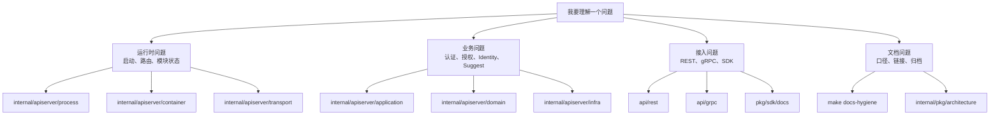
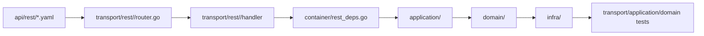
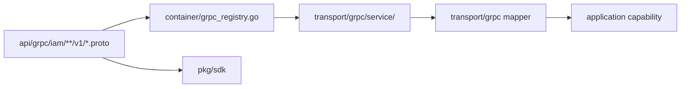
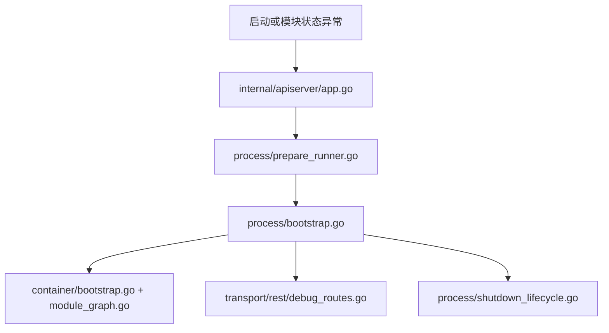
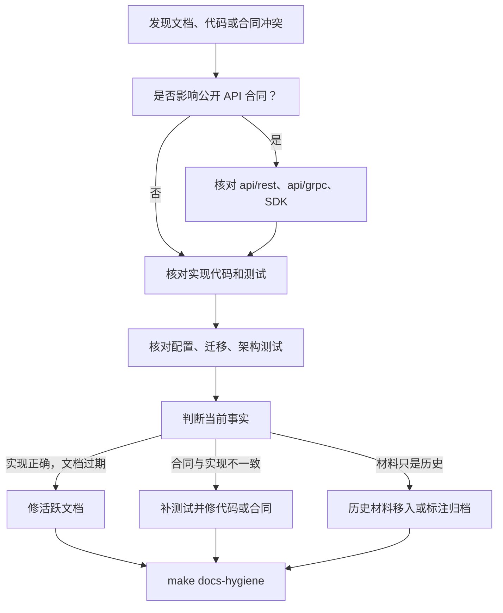

# 阅读路径、代码组织与事实来源

## 本文回答

本文回答：不同读者应该从哪里读 IAM，如何从合同定位到代码，如何判断文档和代码冲突时谁是事实源，以及维护文档前后应该做哪些检查。

## 30 秒结论

- 新成员先读系统形状，再读术语，再读业务域；不要从某个 handler 或 repository 直接推断全局架构。
- 后端开发按“合同或入口 -> transport -> container deps -> application -> domain -> infra -> test”定位代码。
- 接入方按“API 合同 -> SDK 文档 -> 接入专题 -> 运行边界”阅读，避免把内部实现名误认为 wire term。
- 文档维护者以源码、合同、配置、迁移和架构测试为事实源；归档材料只做背景，不作为当前事实。
- 维护活跃文档时，新增链接必须能被 `make docs-hygiene` 检出，新增术语必须能回到真实代码、合同或测试。

## 主图：从问题到事实源



## 1. 四类读者路径

### 新成员路径

目标：建立 IAM 的整体地图，知道代码分层和术语，不急着深入某个用例。

| 步骤 | 阅读内容 | 读的时候回答 |
| ---- | ---- | ---- |
| 1 | [README.md](../../README.md) 与 [../README.md](../README.md) | 这个仓库对外是什么，文档如何分组。 |
| 2 | [01-系统架构总览.md](01-系统架构总览.md) | 进程、生命周期、container、transport 如何协作。 |
| 3 | [02-核心概念术语.md](02-核心概念术语.md) | AuthN、AuthZ、Identity/ProfileLink 的术语怎么对应。 |
| 4 | [04-架构设计与模式导览.md](04-架构设计与模式导览.md) | 为什么要用这些模式，各自解决什么问题。 |
| 5 | [../02-业务域/README.md](../02-业务域/README.md) | 进入具体业务域前，先选定要深挖的模块。 |

建议顺序：先画出自己的“请求路径图”，再进入业务域。否则容易把某个 transport handler 当成业务规则入口。

### 后端开发路径

目标：能安全改代码、补测试、更新文档。

| 场景 | 定位顺序 | 关键事实源 |
| ---- | ---- | ---- |
| 改 REST 接口 | `api/rest` -> `transport/rest/<module>` -> `container/rest_deps.go` -> `application` -> tests | [../../api/rest](../../api/rest)、[../../internal/apiserver/transport/rest](../../internal/apiserver/transport/rest) |
| 改 gRPC 接口 | `api/grpc` -> `transport/grpc/service/<module>` -> `container/grpc_registry.go` -> `application` -> SDK compile tests | [../../api/grpc](../../api/grpc)、[../../internal/apiserver/transport/grpc](../../internal/apiserver/transport/grpc) |
| 改用例 | `application/<domain>` -> `domain/<domain>` -> `infra` ports/repositories -> architecture tests | [../../internal/apiserver/application](../../internal/apiserver/application)、[../../internal/apiserver/domain](../../internal/apiserver/domain) |
| 改启动装配 | `process` -> `container` -> `transport` -> architecture tests | [../../internal/apiserver/process](../../internal/apiserver/process)、[../../internal/apiserver/container](../../internal/apiserver/container) |
| 改事件或事务 | `application` UoW 调用 -> `infra/mysql/uow` -> `pkg/outboxcore` -> relay | [../../internal/apiserver/infra/mysql/uow](../../internal/apiserver/infra/mysql/uow)、[../../pkg/outboxcore](../../pkg/outboxcore) |

最小验证建议：

```bash
go test ./internal/pkg/architecture ./internal/apiserver/process ./internal/apiserver/container ./internal/apiserver/transport/...
make docs-hygiene
```

### 接入方路径

目标：知道该调用什么接口、字段语义是什么、哪些能力不能假设。

| 步骤 | 阅读内容 | 注意事项 |
| ---- | ---- | ---- |
| 1 | [../../api/README.md](../../api/README.md) | 先确认 REST/gRPC 合同入口。 |
| 2 | [../../api/rest/README.md](../../api/rest/README.md) 或 [../../api/grpc/README.md](../../api/grpc/README.md) | 以机器合同为准，不从内部包名推导外部 API。 |
| 3 | [../03-接口与集成/README.md](../03-接口与集成/README.md) | 理解认证、授权、Identity、SDK 接入边界。 |
| 4 | [../../pkg/sdk/docs/README.md](../../pkg/sdk/docs/README.md) | 使用 SDK 时按 SDK 文档和 compile tests 对齐。 |
| 5 | [02-核心概念术语.md](02-核心概念术语.md) | 特别注意 rolebinding 与 assignment 的命名边界。 |

接入方应该避免两个误读：

- REST/proto 的 wire term 不一定是内部实现名。
- 离线验签、授权快照、缓存读取模型都不是在线状态的完整替代。

### 文档维护者路径

目标：让文档能讲清楚，并且能被代码事实验证。

| 步骤 | 做什么 | 验证 |
| ---- | ---- | ---- |
| 1 | 先找代码入口，不先改 prose。 | `rg`、`go test`、合同检查脚本。 |
| 2 | 确认术语是否已有标准口径。 | [02-核心概念术语.md](02-核心概念术语.md) |
| 3 | 判断文档属于活跃区还是归档区。 | [../CONTRIBUTING-DOCS.md](../CONTRIBUTING-DOCS.md)、[../_archive](../_archive/README.md) |
| 4 | 用 conclusion-first 结构重写。 | 先结论和主图，再细节和证据。 |
| 5 | 跑卫生检查。 | `make docs-hygiene` |

## 2. 当前代码组织

```text
cmd/apiserver/                   # iam-apiserver 进程入口
internal/apiserver/app.go         # 命令行 App 与 config 创建
internal/apiserver/process/       # 生命周期、资源、transport、运行期任务、关闭回调
internal/apiserver/container/     # 组合根、模块图、REST deps、gRPC registrations
internal/apiserver/transport/     # REST/gRPC 协议适配
internal/apiserver/application/   # 用例、命令、查询、事务编排
internal/apiserver/domain/        # 领域实体、值对象、领域服务、端口
internal/apiserver/infra/         # MySQL、Redis、Casbin、Token、Outbox、IDP、搜索等适配器
internal/pkg/architecture/        # 架构边界测试
api/rest/                         # OpenAPI 合同
api/grpc/                         # proto 合同和生成物
pkg/sdk/                          # Go SDK 与 SDK 文档
pkg/event* pkg/outbox* pkg/uow/    # 跨模块公共事件、outbox、事务原语
configs/                          # 运行配置、事件目录、Casbin 模型、ACL 等
```

## 3. 代码定位方法

### 从 REST 路径定位



定位步骤：

1. 从 [../../api/rest](../../api/rest) 查路径、方法、请求响应。
2. 到 [../../internal/apiserver/transport/rest](../../internal/apiserver/transport/rest) 找模块 router 和 handler。
3. 通过 [../../internal/apiserver/container/rest_deps.go](../../internal/apiserver/container/rest_deps.go) 看 handler 依赖哪类 application capability。
4. 进入 [../../internal/apiserver/application](../../internal/apiserver/application) 看用例编排。
5. 进入 [../../internal/apiserver/domain](../../internal/apiserver/domain) 看规则和不变量。
6. 进入 [../../internal/apiserver/infra](../../internal/apiserver/infra) 看数据库、缓存、token、授权运行时或外部服务适配。

### 从 gRPC 方法定位



定位步骤：

1. 从 [../../api/grpc](../../api/grpc) 找 service、rpc、message。
2. 到 [../../internal/apiserver/container/grpc_registry.go](../../internal/apiserver/container/grpc_registry.go) 确认该 service 是否由当前模块注册。
3. 到 [../../internal/apiserver/transport/grpc/service](../../internal/apiserver/transport/grpc/service) 看方法如何映射 application。
4. 如涉及 SDK，检查 [../../pkg/sdk](../../pkg/sdk) 与 compile tests。

### 从启动或运行时问题定位



优先看：

- 配置是否正确进入 [../../internal/apiserver/app.go](../../internal/apiserver/app.go)。
- stage 是否在 [../../internal/apiserver/process/prepare_runner.go](../../internal/apiserver/process/prepare_runner.go) 中失败。
- 资源准备和 transport 注册是否在 [../../internal/apiserver/process/bootstrap.go](../../internal/apiserver/process/bootstrap.go) 中降级。
- 模块是否在 [../../internal/apiserver/container/bootstrap.go](../../internal/apiserver/container/bootstrap.go) 的 bootstrap plan 中失败。
- `/debug/modules` 与 `/debug/routes` 是否能展示当前状态。

### 从领域规则定位

| 领域 | 先看 | 再看 | 最后看 |
| ---- | ---- | ---- | ---- |
| AuthN | [../../internal/apiserver/application/authn](../../internal/apiserver/application/authn) | [../../internal/apiserver/domain/authn](../../internal/apiserver/domain/authn) | [../../internal/apiserver/infra/token](../../internal/apiserver/infra/token)、[../../internal/apiserver/infra/cache/redis](../../internal/apiserver/infra/cache/redis) |
| AuthZ | [../../internal/apiserver/application/authz](../../internal/apiserver/application/authz) | [../../internal/apiserver/domain/authz](../../internal/apiserver/domain/authz) | [../../internal/apiserver/infra/casbin](../../internal/apiserver/infra/casbin)、[../../internal/apiserver/infra/mysql](../../internal/apiserver/infra/mysql) |
| Identity | [../../internal/apiserver/application/uc](../../internal/apiserver/application/uc) | [../../internal/apiserver/domain/uc](../../internal/apiserver/domain/uc) | [../../internal/apiserver/infra/mysql/profilelink](../../internal/apiserver/infra/mysql/profilelink) |
| IDP | [../../internal/apiserver/application/idp](../../internal/apiserver/application/idp) | [../../internal/apiserver/domain/idp](../../internal/apiserver/domain/idp) | [../../internal/apiserver/infra/wechat](../../internal/apiserver/infra/wechat)、[../../internal/apiserver/infra/wechatapi](../../internal/apiserver/infra/wechatapi) |
| Suggest | [../../internal/apiserver/application/suggest](../../internal/apiserver/application/suggest) | [../../internal/apiserver/domain/suggest](../../internal/apiserver/domain/suggest) | [../../internal/apiserver/infra/suggest](../../internal/apiserver/infra/suggest) |

## 4. 事实源优先级

| 优先级 | 事实源 | 用来判断什么 |
| ---- | ---- | ---- |
| 1 | 源码和运行时行为 | 当前实现真实做了什么。 |
| 2 | 机器合同、配置、迁移、生成物 | 对外 API、运行配置、数据库结构和生成代码。 |
| 3 | 架构测试、transport tests、SDK compile tests | 边界是否被持续保护。 |
| 4 | 当前活跃文档 | 解释为什么这样设计，以及如何阅读。 |
| 5 | 归档材料 | 历史背景、过期分析、迁移前上下文。 |

## 5. 事实冲突处理流程



原则：

- prose 文档和代码冲突，优先修文档。
- 合同和实现冲突，不能只改 prose；需要补测试并让合同与实现重新一致。
- 历史分析不要留在活跃路径中继续被读者当成事实。
- 如果一个概念有内部名和 wire term，文档必须同时写清，不能混用。

## 6. 维护检查清单

### 改文档前

- 明确读者：新成员、后端开发、接入方，还是文档维护者。
- 找到至少一个代码、合同、配置或测试证据。
- 判断该文档属于活跃区还是归档区。
- 确认是否有既有术语表或专题文档可链接，避免重复造词。

### 改文档时

- 先写“本文回答”和“30 秒结论”。
- 第一屏给主图或重点表，不让读者先陷入细节。
- 详细段落按“为什么用 / 解决什么问题 / 如何落地 / 代价和边界 / 证据”展开。
- 路径链接指向真实文件或目录，不链接不存在的历史文档。
- 对规划、待补证据、已实现状态要显式标注。

### 改文档后

```bash
make docs-hygiene
git diff --check
```

如涉及架构、启动、transport 或合同事实，建议补充运行：

```bash
go test ./internal/pkg/architecture ./internal/apiserver/process ./internal/apiserver/container ./internal/apiserver/transport/...
```

### 合格文档的判断标准

| 标准 | 合格表现 | 不合格表现 |
| ---- | ---- | ---- |
| 可讲清楚 | 开头就能说出结论和主图。 | 只有目录、路径列表或大段散文。 |
| 可验证 | 每个关键事实有代码、合同、配置或测试链接。 | 只写“应该”“设计上”但无证据。 |
| 边界清楚 | 写明当前能力和非能力。 | 把规划能力写成已实现。 |
| 术语稳定 | 内部名、公开名、中文解释各自清楚。 | 同一概念多套名字混用。 |
| 可维护 | 新链接和路径通过卫生检查。 | 链到不存在文件或归档材料作为当前事实。 |

## 7. 本组文档后续如何扩展

`00-概览` 只负责系统级地图。后续逐步恢复深度时，建议按这个顺序推进：

1. `01-运行时`：围绕 process、transport、健康检查、gRPC/mTLS、debug 面展开。
2. `02-业务域`：按 AuthN、AuthZ、Identity/ProfileLink、Suggest 分模块写领域模型、应用服务和流程图。
3. `03-接口与集成`：按 REST、gRPC、授权接入、身份接入、SDK/QS 接入展开。
4. `04-基础设施与运维`：按 UoW、Outbox、缓存治理、端口证书、SQL bootstrap 展开。
5. `05-专题分析`：围绕跨模块链路写时序图和专题解释。

每一层都应使用本页的事实源优先级和维护清单，避免重新退化成只列目录的文档。
