# 架构设计与模式导览

## 本文回答

本文回答：IAM 当前代码中用了哪些架构和设计模式，为什么使用它们，它们解决了哪些问题，如何在代码里落地，以及每个模式的代价和边界是什么。

## 30 秒结论

- IAM 的主架构是 Ports & Adapters：REST/gRPC、MySQL、Redis、Casbin、Token、Outbox、IDP 都是外圈适配器，业务用例和领域规则尽量留在内圈。
- `container` 是 Composition Root：负责把模块依赖和 runtime options 显式组装起来，避免业务代码到处构造基础设施对象。
- `process` 使用 Stage/Pipeline：把启动拆成 runtime、resources、container、transport、runtime tasks、shutdown，提升可测试性和故障定位能力。
- REST/gRPC 使用 Registry/Registrar 思路：transport 拥有注册动作，container 只提供能力或 registration 列表。
- AuthN 登录使用 Adapter Catalog + Strategy：application 适配不同登录输入，domain 执行凭据认证策略。
- AuthZ、Identity 等写用例大量依赖 Repository + UoW；持久事件使用 transactional outbox + relay 解决事务提交和消息投递之间的一致性问题。
- DTO/Mapper、CacheGovernance Read Model 是隔离协议/观测模型的辅助模式，它们让外部合同和内部业务模型不互相污染。

## 模式地图

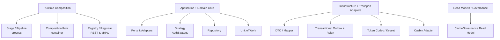

## 重点速查

| 模式 | IAM 落点 | 解决的问题 | 主要代价 |
| ---- | ---- | ---- | ---- |
| Ports & Adapters | `application`、`domain`、`infra`、`transport` | 业务规则不被协议和基础设施污染。 | 需要维护端口、DTO、mapper 和装配代码。 |
| Composition Root | `internal/apiserver/container` | 模块依赖集中、显式、可审计。 | container 代码会比较“装配化”，需要架构测试约束膨胀。 |
| Stage / Pipeline | `internal/apiserver/process` | 启动步骤可测试、失败点清楚。 | stage 边界需要稳定，不适合塞业务逻辑。 |
| Registry / Registrar | `transport/rest`、`transport/grpc` | 注册动作归 transport，模块只暴露能力。 | registration 列表和 deps 需要随模块变化维护。 |
| Strategy | `domain/authn/authentication` | 多认证方式共享统一认证入口。 | 策略之间需要统一错误和认证判决。 |
| Repository | `domain/*` ports、`infra/mysql/*` 实现 | 领域与持久化实现隔离。 | 查询性能和事务上下文要靠 UoW/infra 处理。 |
| Unit of Work | `application/*/uow`、`infra/mysql/uow`、`pkg/uow` | 一次用例内的多仓储事务一致性。 | 回调必须使用事务上下文，嵌套和错误处理要谨慎。 |
| Transactional Outbox | `pkg/outboxcore`、`infra/mysql/eventoutbox`、`infra/messaging/outbox_relay.go` | 业务提交和消息投递可靠衔接。 | 引入投递延迟、重试状态和运维观测。 |
| DTO / Mapper | `transport/rest/*/dto`、`transport/grpc/service/*` | 外部合同与内部模型解耦。 | 字段映射会增加样板代码。 |
| Cache Governance Read Model | `application/cachegovernance`、`transport/rest/debug_routes.go` | 用统一目录观察缓存族状态。 | 第一版是只读治理面，不负责自动修复。 |

## 1. Ports & Adapters

### 为什么用

IAM 同时暴露 REST、gRPC，依赖 MySQL、Redis、Casbin、消息总线、微信/企业微信、JWT/keyset。若业务规则直接依赖这些技术实现，任何 API 或基础设施调整都会扩散到领域代码。

Ports & Adapters 的目标是让业务内核只理解业务语言，外部输入输出都通过适配层转换。

### 解决什么问题

- REST/gRPC DTO 不污染 application/domain。
- MySQL、Redis、Casbin、JWT/keyset 的实现细节不成为领域术语。
- AuthZ 的授权事实可以落到 Casbin，但 domain 仍以 Role、Policy、Resource、RoleBinding、Scope 表达业务。
- AuthN 的 access token 可以用 JWT 编码，但 application 只依赖 `AccessTokenCodec` 端口。

### IAM 中如何落地

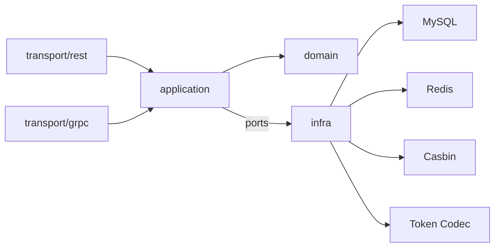

主要证据：

- application/domain/infra 分层目录：[../../internal/apiserver/application](../../internal/apiserver/application)、[../../internal/apiserver/domain](../../internal/apiserver/domain)、[../../internal/apiserver/infra](../../internal/apiserver/infra)。
- Token 编码端口：[../../internal/apiserver/application/authn/token/ports.go](../../internal/apiserver/application/authn/token/ports.go)。
- AuthZ Casbin 适配器：[../../internal/apiserver/infra/casbin](../../internal/apiserver/infra/casbin)。
- 架构护栏：[../../internal/pkg/architecture/architecture_test.go](../../internal/pkg/architecture/architecture_test.go)。

### 代价和边界

- 端口和 mapper 会带来样板代码，但换来边界可测试和变更隔离。
- 不代表 application 永远不知道基础设施存在；运行时组合后，application 会调用端口背后的 infra 实现。
- 不应为了“纯净”把简单读取过度抽象。只有跨边界、可替换或容易泄漏技术细节的协作才值得建端口。

## 2. Composition Root

### 为什么用

IAM 模块之间存在真实依赖：AuthN 需要 IDP、Redis、DB 和 token/keyset 配置；AuthZ 需要 DB 和 outbox stager；User 需要 AuthN session manager 和 AuthZ role name reader。如果这些依赖散落在 handler 或 service 构造处，启动顺序、缺失能力和测试边界都会变得难以追踪。

### 解决什么问题

- 模块初始化顺序显式。
- runtime options 只在装配层进入，不让业务包读取全局配置。
- REST/gRPC 不穿透模块内部字段，只消费 capability。
- 后续重构模块内部时，外部只要能力接口不变，就不需要连锁修改。

### IAM 中如何落地

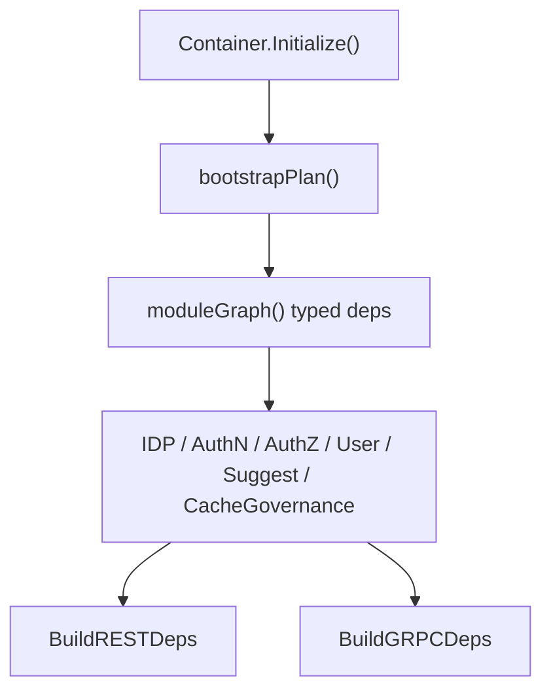

主要证据：

- bootstrap plan：[../../internal/apiserver/container/bootstrap.go](../../internal/apiserver/container/bootstrap.go)。
- typed deps：[../../internal/apiserver/container/module_graph.go](../../internal/apiserver/container/module_graph.go)。
- module assembler：[../../internal/apiserver/container/assembler](../../internal/apiserver/container/assembler)。
- REST deps 收集：[../../internal/apiserver/container/rest_deps.go](../../internal/apiserver/container/rest_deps.go)。
- gRPC registrations 收集：[../../internal/apiserver/container/grpc_registry.go](../../internal/apiserver/container/grpc_registry.go)。

### 代价和边界

- Composition Root 会成为“装配知识集中点”，文件较多是正常现象。
- container 不应该处理请求，也不应该承载领域规则。
- assembler 不应构造 transport 实现；这一点由架构测试保护。

## 3. Stage / Pipeline

### 为什么用

服务启动往往会混杂配置解析、资源初始化、模块装配、路由注册、后台任务和关闭回调。IAM 把它拆成 stage，是为了让每个阶段的输入输出明确，失败点可定位。

### 解决什么问题

- 启动失败时知道是资源、container 还是 transport 阶段失败。
- 降级启动策略只在资源和 container 阶段被统一处理。
- 后台任务和 shutdown hook 不再散落在入口或模块代码里。

### IAM 中如何落地


主要证据：[../../internal/apiserver/process/prepare_runner.go](../../internal/apiserver/process/prepare_runner.go)、[../../internal/apiserver/process/bootstrap.go](../../internal/apiserver/process/bootstrap.go)、[../../internal/apiserver/process/shutdown_lifecycle.go](../../internal/apiserver/process/shutdown_lifecycle.go)。

### 代价和边界

- stage 之间通过 output struct 传递状态，新增阶段时要避免把状态对象变成“万能袋”。
- stage 适合启动生命周期，不适合承载业务用例流程。

## 4. Registry / Registrar

### 为什么用

REST 和 gRPC 的注册逻辑属于协议层，但注册所需能力来自模块装配。若 container 直接操作全部路由细节，协议实现会污染组合根；若 transport 直接查 container 模块字段，又会穿透装配内部结构。

### 解决什么问题

- transport 拥有注册动作。
- container 只提供明确的 deps 或 registrations。
- 模块缺失时可以受控跳过注册，避免半初始化能力被暴露。

### IAM 中如何落地

REST：

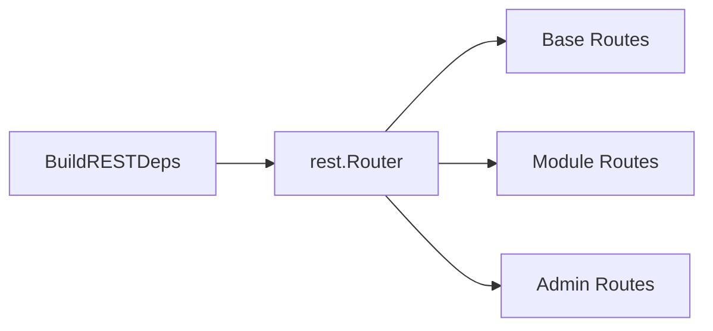

gRPC：

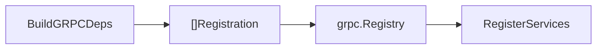

主要证据：[../../internal/apiserver/transport/rest/router.go](../../internal/apiserver/transport/rest/router.go)、[../../internal/apiserver/transport/rest/module_routes.go](../../internal/apiserver/transport/rest/module_routes.go)、[../../internal/apiserver/transport/grpc/registry.go](../../internal/apiserver/transport/grpc/registry.go)。

### 代价和边界

- 每新增模块能力，需要同时维护 container deps 收集和 transport 注册。
- 注册器不应该做业务决策；它只能根据依赖是否存在决定是否注册协议入口。

## 5. Strategy 与 Adapter Catalog

### 为什么用

AuthN 支持密码、手机验证码、微信小程序、企业微信、Bearer 兼容等登录输入。如果把这些分支写成一个巨大的 login 函数，输入解析、外部身份交换、领域认证、失败翻译、token 签发会纠缠在一起。

IAM 把它拆成两层：

- application login 使用 `SignInAdapterCatalog` 识别和准备登录输入。
- domain authentication 使用 `AuthStrategy` 对领域凭据执行认证。

### 解决什么问题

- 新增登录方式时，可以添加 adapter 和 strategy，而不是改动所有登录主流程。
- application 层处理 wire/input 兼容，domain 层只处理认证判决。
- 认证失败可以统一翻译成登录错误语义。

### IAM 中如何落地

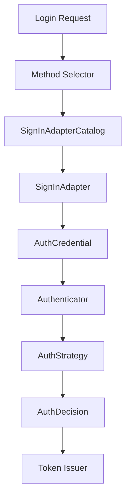

主要证据：

- adapter catalog：[../../internal/apiserver/application/authn/login/adapter_catalog.go](../../internal/apiserver/application/authn/login/adapter_catalog.go)。
- login service 装配：[../../internal/apiserver/application/authn/login/services_impl.go](../../internal/apiserver/application/authn/login/services_impl.go)。
- domain auth strategies：[../../internal/apiserver/domain/authn/authentication](../../internal/apiserver/domain/authn/authentication)。

### 代价和边界

- adapter 和 strategy 的职责必须分清：adapter 准备输入，strategy 执行认证。
- 失败语义需要统一，否则不同登录方式会泄漏不同错误。
- Strategy 适合多算法/多方式认证；不适合把简单 if/else 都过度模式化。

## 6. Repository

### 为什么用

领域规则需要读取角色、资源、用户、档案、凭据等数据，但不应该知道它们来自 MySQL 还是其他存储。Repository 把“领域需要什么数据访问能力”和“数据如何持久化”分开。

### 解决什么问题

- 领域服务可依赖仓储接口而非 GORM。
- infra 可以把 PO、SQL、索引和事务上下文封装起来。
- 测试可以用 stub/fake repository 覆盖领域规则。

### IAM 中如何落地

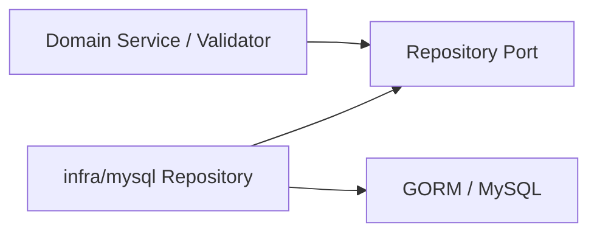

示例：

- AuthZ role/resource/policy/rolebinding repositories：[../../internal/apiserver/domain/authz](../../internal/apiserver/domain/authz)、[../../internal/apiserver/infra/mysql](../../internal/apiserver/infra/mysql)。
- Identity profile link repository：[../../internal/apiserver/domain/uc/profilelink](../../internal/apiserver/domain/uc/profilelink)、[../../internal/apiserver/infra/mysql/profilelink](../../internal/apiserver/infra/mysql/profilelink)。
- AuthN account/credential repositories：[../../internal/apiserver/domain/authn](../../internal/apiserver/domain/authn)、[../../internal/apiserver/infra/mysql/account](../../internal/apiserver/infra/mysql/account)、[../../internal/apiserver/infra/mysql/credential](../../internal/apiserver/infra/mysql/credential)。

### 代价和边界

- Repository 不应成为万能 DAO；接口应按领域需要设计。
- 查询型能力和命令型仓储可以拆分，避免读写关注点混在一个过大的接口里。
- 性能优化通常落在 infra 实现，不应让领域服务知道 SQL 细节。

## 7. Unit of Work

### 为什么用

很多 IAM 用例不是单表操作。例如授权变更需要验证角色/资源/主体、写业务记录、写授权事实、更新版本或 stage 事件；ProfileLink 建立需要验证 User/Profile、创建关系并保持事务一致。

UoW 用来把一次用例内的多个 repository 操作放在同一个事务上下文中。

### 解决什么问题

- 多仓储写操作要么全部提交，要么全部回滚。
- application 不直接操作 GORM 事务。
- 事务内 repository 可以通过 `txCtx` 获取同一个事务连接。

### IAM 中如何落地

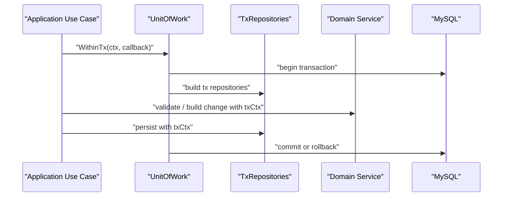

主要证据：

- 公共 GORM UoW：[../../pkg/uow/gorm](../../pkg/uow/gorm)。
- AuthZ UoW：[../../internal/apiserver/application/authz/uow](../../internal/apiserver/application/authz/uow)、[../../internal/apiserver/infra/mysql/uow/authz](../../internal/apiserver/infra/mysql/uow/authz)。
- UC UoW：[../../internal/apiserver/application/uc/uow](../../internal/apiserver/application/uc/uow)、[../../internal/apiserver/infra/mysql/uow/uc](../../internal/apiserver/infra/mysql/uow/uc)。
- 事务上下文架构护栏：[../../internal/pkg/architecture/architecture_test.go](../../internal/pkg/architecture/architecture_test.go)。

### 代价和边界

- 回调内必须使用 `txCtx`，否则可能绕开事务。
- UoW 不解决跨服务分布式事务；跨边界可靠投递由 outbox 负责。
- 长事务会放大锁和超时风险，用例编排应保持事务内工作最小化。

## 8. Transactional Outbox

### 为什么用

业务写入和消息发布之间存在经典一致性问题：如果先写 DB 再发 MQ，发 MQ 失败会丢事件；如果先发 MQ 再写 DB，DB 失败会发布不存在的业务事实。Transactional Outbox 把要可靠投递的领域事件先写入业务数据库中的 outbox，再由 relay 异步发布。

### 解决什么问题

- 业务事务提交和事件持久化保持一致。
- MQ 临时不可用时，不影响业务事务完成。
- relay 可以重试、标记失败、观测积压。

### IAM 中如何落地

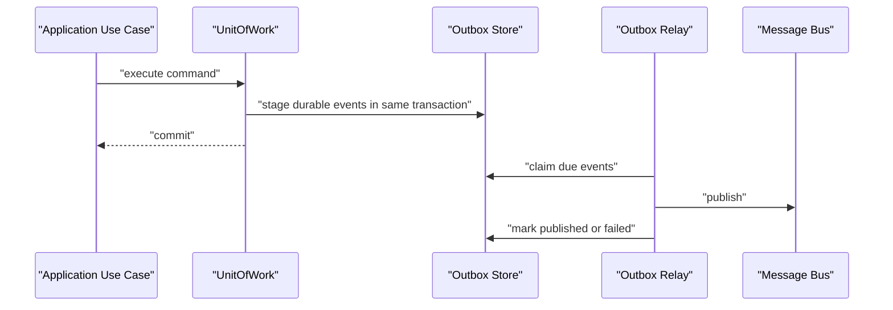

主要证据：

- event catalog：[../../configs/events.yaml](../../configs/events.yaml)、[../../pkg/eventcatalog](../../pkg/eventcatalog)。
- outbox record 构建：[../../pkg/outboxcore/core.go](../../pkg/outboxcore/core.go)。
- MySQL outbox store：[../../internal/apiserver/infra/mysql/eventoutbox](../../internal/apiserver/infra/mysql/eventoutbox)。
- relay：[../../internal/apiserver/infra/messaging/outbox_relay.go](../../internal/apiserver/infra/messaging/outbox_relay.go)。
- 架构护栏：[../../internal/pkg/architecture/architecture_test.go](../../internal/pkg/architecture/architecture_test.go)。

### 代价和边界

- 事件投递是最终一致，不是同步完成。
- relay 需要监控积压、失败和重试延迟。
- 消费方仍需幂等处理；outbox 解决投递可靠性，不保证下游处理只发生一次。

## 9. DTO / Mapper

### 为什么用

REST/gRPC 的字段、枚举、分页、错误语义和内部领域对象不完全一致。直接把领域对象暴露给合同，会让外部 API 被内部重构牵着走；直接让领域接受协议 DTO，也会让业务规则依赖 wire 格式。

### 解决什么问题

- 外部合同可以稳定演进。
- 内部模型可以按 DDD 边界重构。
- 协议错误、字段脱敏、枚举转换集中在 transport。

### IAM 中如何落地

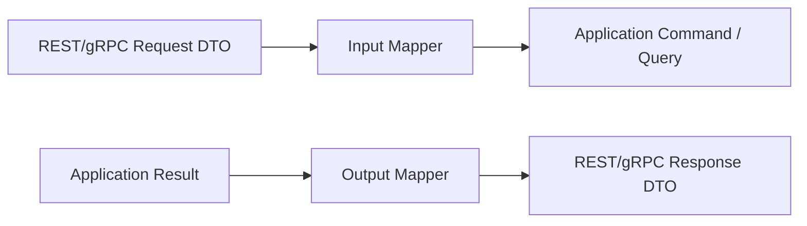

主要证据：

- REST DTO：[../../internal/apiserver/transport/rest/authz/dto](../../internal/apiserver/transport/rest/authz/dto)、[../../internal/apiserver/transport/rest/identity](../../internal/apiserver/transport/rest/identity)。
- gRPC service mapper：[../../internal/apiserver/transport/grpc/service](../../internal/apiserver/transport/grpc/service)。
- 合同目录：[../../api/rest](../../api/rest)、[../../api/grpc](../../api/grpc)。

### 代价和边界

- mapper 增加样板代码，但能阻止协议字段泄漏到业务层。
- mapper 不应该补业务规则；校验可做输入格式校验，业务不变量仍应在 application/domain 中维护。

## 10. Cache Governance Read Model

### 为什么用

IAM 使用 Redis、内存快照和远程 token 缓存等多种缓存形态。如果只在各模块里散落 key pattern 和 TTL 说明，运维和调试时很难回答“当前有哪些缓存族、谁负责、能观察什么、TTL 从哪里来”。

CacheGovernance 把缓存族元数据建成只读目录，并通过 debug 路由暴露概览和 family 详情。

### 解决什么问题

- 统一描述缓存族，而不是靠代码注释或口头约定。
- 让 AuthN、IDP、JWKS、outbox 等状态读取器有统一展示面。
- 将“观测缓存”与“改写缓存”分开，降低误操作风险。

### IAM 中如何落地

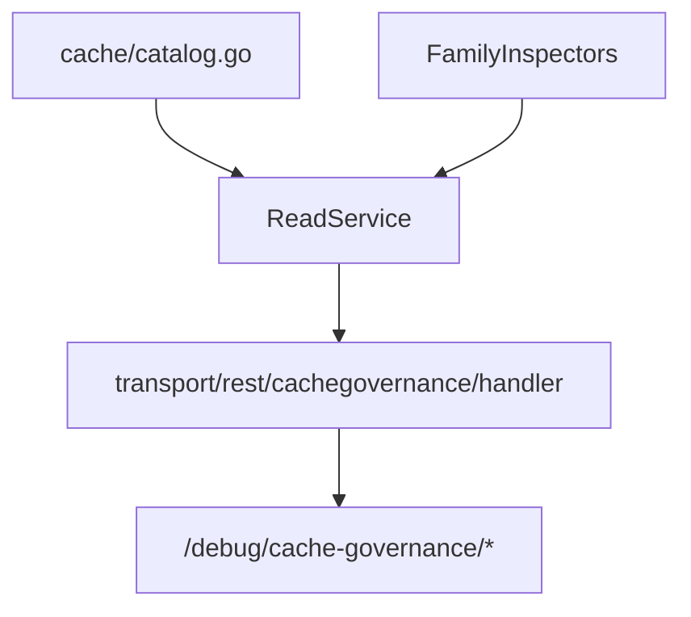

主要证据：

- 静态目录：[../../internal/apiserver/cache/catalog.go](../../internal/apiserver/cache/catalog.go)。
- 读取服务：[../../internal/apiserver/application/cachegovernance](../../internal/apiserver/application/cachegovernance)。
- AuthN inspector 暴露：[../../internal/apiserver/container/assembler/authn.go](../../internal/apiserver/container/assembler/authn.go)。
- debug routes：[../../internal/apiserver/transport/rest/debug_routes.go](../../internal/apiserver/transport/rest/debug_routes.go)。

### 代价和边界

- 第一版只读，不负责在线清理、重建或强制刷新。
- cache family metadata 需要随代码变更同步维护。
- Debug 面在 production 中需要 admin 保护，不能当作公开 API。

## 11. 这些模式如何一起工作

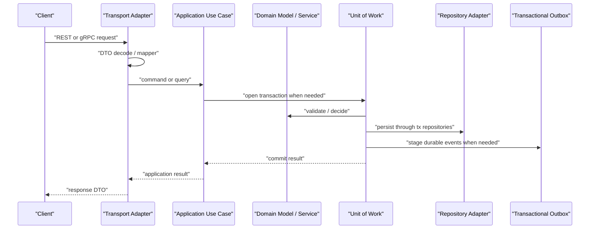

这个组合的核心收益是：外部合同、业务规则、基础设施实现、运行时装配和运维观测各有归属。代价是代码层次更多，文档必须持续解释“为什么要这样分”，否则读者只会看到目录。

## 12. 判断是否应该引入新模式

新增模式前先问四个问题：

1. 它是否隔离了真实变化点，例如协议、存储、外部系统、事务或算法。
2. 它是否减少了跨层依赖，而不是只增加包装。
3. 它是否能被测试或架构测试保护。
4. 它的代价是否小于当前重复、耦合或不一致带来的维护成本。

如果答案不明确，优先使用现有模式：capability、typed deps、repository、UoW、mapper、outbox、read model。不要为了“设计感”引入新抽象。

## 13. 验证入口

```bash
make docs-hygiene
go test ./internal/pkg/architecture ./internal/apiserver/process ./internal/apiserver/container ./internal/apiserver/transport/...
```

模式说明必须能回到代码证据。若某个文档段落只能解释“想这样设计”，但找不到源码、合同、配置或测试支撑，应标注为规划或移出活跃事实层。
