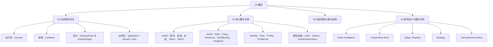
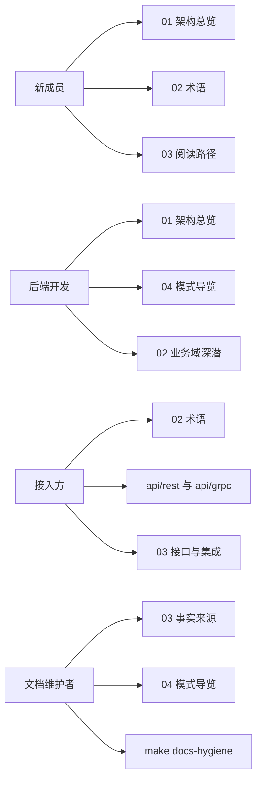

# 00-概览

## 本文回答

本组文档回答三个问题：

1. IAM 当前是什么样的系统。
2. 新读者如何用最短路径理解它的架构、领域和接口。
3. 文档与代码冲突时，应当相信哪些事实源。

它不是简单目录页，而是 IAM 的系统级知识入口。读完本组后，读者应当能看懂 `iam-apiserver` 的进程装配、主要业务域、协议适配方式、关键设计模式，以及后续阅读各业务模块时需要带着的边界意识。

## 30 秒结论

- IAM 当前以 `iam-apiserver` 为运行单元，由 [../../cmd/apiserver/apiserver.go](../../cmd/apiserver/apiserver.go) 启动，进入 [../../internal/apiserver/app.go](../../internal/apiserver/app.go)，再把生命周期交给 [../../internal/apiserver/process](../../internal/apiserver/process)。
- 运行时主轴是 `process + container + transport`：`process` 管启动阶段和运行期任务，`container` 管模块装配和能力收集，`transport/rest` 与 `transport/grpc` 管协议注册和 DTO 映射。
- 业务知识不在 transport 中展开，而是进入 [../../internal/apiserver/application](../../internal/apiserver/application)、[../../internal/apiserver/domain](../../internal/apiserver/domain)、[../../internal/apiserver/infra](../../internal/apiserver/infra) 后按 AuthN、AuthZ、Identity/ProfileLink、IDP、Suggest、CacheGovernance 分层理解。
- 当前标准术语是 `ProfileLink`、内部 `rolebinding`、公开合同中的 `assignment`、`application/authn/token`、`infra/token/jwt`、`infra/token/keyset`、transactional outbox 与 outbox relay。
- 本层文档先给系统地图；业务域细节仍以后续 `01-运行时`、`02-业务域`、`03-接口与集成`、`04-基础设施与运维`、`05-专题分析` 为深潜入口。

## 00 层知识地图



## 推荐阅读顺序

| 顺序 | 文档 | 读完应获得什么 |
| ---- | ---- | ---- |
| 1 | [01-系统架构总览.md](01-系统架构总览.md) | 知道请求、启动、模块装配、REST/gRPC 注册如何串起来。 |
| 2 | [02-核心概念术语.md](02-核心概念术语.md) | 知道核心业务词在代码、合同和文档中的对应关系。 |
| 3 | [03-阅读路径&代码组织与事实来源.md](03-阅读路径&代码组织与事实来源.md) | 能按读者角色定位代码，并能处理代码、合同、文档之间的冲突。 |
| 4 | [04-架构设计与模式导览.md](04-架构设计与模式导览.md) | 理解 IAM 为什么使用这些模式、它们解决了什么问题、代价在哪里。 |

## 读者路径图



## 本层覆盖什么

| 主题 | 00 层讲到什么程度 | 深潜入口 |
| ---- | ---- | ---- |
| 运行时 | 讲入口、启动阶段、资源准备、transport 注册和关闭边界。 | [../01-运行时/README.md](../01-运行时/README.md) |
| 认证 | 讲 AuthN 的概念模型、Token/JWKS 当前归属、登录策略目录。 | [../02-业务域/01-authn-认证&Token&JWKS.md](../02-业务域/01-authn-认证&Token&JWKS.md) |
| 授权 | 讲 Role/Policy/Resource/RoleBinding/Snapshot 的术语和模式。 | [../02-业务域/02-authz-角色&策略&资源&Assignment.md](../02-业务域/02-authz-角色&策略&资源&Assignment.md) |
| 用户与档案 | 讲 User/Profile/ProfileLink 的边界与当前命名。 | [../02-业务域/03-user-用户&儿童&ProfileLink.md](../02-业务域/03-user-用户&儿童&ProfileLink.md) |
| 接口 | 讲 REST/gRPC 从 container 能力到 transport 注册的机制。 | [../03-接口与集成/README.md](../03-接口与集成/README.md) |
| 基础设施 | 讲 UoW、Outbox、CacheGovernance 等跨模块模式。 | [../04-基础设施与运维/README.md](../04-基础设施与运维/README.md) |

## 本层不替代什么

- 不替代业务域文档：本层只解释系统级形状，不展开每个用例的字段、错误码和完整流程。
- 不替代 API 合同：REST 以 [../../api/rest](../../api/rest) 为准，gRPC 以 [../../api/grpc](../../api/grpc) 为准。
- 不替代架构测试：边界是否仍成立，以 [../../internal/pkg/architecture](../../internal/pkg/architecture) 的架构测试和相关模块测试为准。
- 不替代归档材料：历史分析放在 [../_archive](../_archive/README.md)，只能作为背景，不作为当前事实。

## 当前事实速查

| 事实面 | 当前口径 | 主要证据 |
| ---- | ---- | ---- |
| 运行入口 | `iam-apiserver` 是当前服务进程。 | [../../cmd/apiserver/apiserver.go](../../cmd/apiserver/apiserver.go) |
| 生命周期 | `process` 拆分 runtime、resource、container、transport、runtime task、shutdown 阶段。 | [../../internal/apiserver/process/prepare_runner.go](../../internal/apiserver/process/prepare_runner.go) |
| 模块装配 | `container` 是组合根，按 typed deps 初始化模块并收集能力。 | [../../internal/apiserver/container/bootstrap.go](../../internal/apiserver/container/bootstrap.go)、[../../internal/apiserver/container/module_graph.go](../../internal/apiserver/container/module_graph.go) |
| REST | `transport/rest.Router` 使用 `rest.Deps` 注册 base、debug、业务和 admin 路由。 | [../../internal/apiserver/transport/rest/router.go](../../internal/apiserver/transport/rest/router.go)、[../../internal/apiserver/transport/rest/module_routes.go](../../internal/apiserver/transport/rest/module_routes.go) |
| gRPC | `transport/grpc.Registry` 消化 container 传入的 service registrations。 | [../../internal/apiserver/container/grpc_registry.go](../../internal/apiserver/container/grpc_registry.go)、[../../internal/apiserver/transport/grpc/registry.go](../../internal/apiserver/transport/grpc/registry.go) |
| 领域分层 | `application` 编排用例，`domain` 承载规则，`infra` 实现外部资源访问。 | [../../internal/apiserver/application](../../internal/apiserver/application)、[../../internal/apiserver/domain](../../internal/apiserver/domain)、[../../internal/apiserver/infra](../../internal/apiserver/infra) |
| 架构护栏 | 架构测试防止边界回退和旧实现回流。 | [../../internal/pkg/architecture/architecture_test.go](../../internal/pkg/architecture/architecture_test.go) |

## 维护门禁

本组文档的维护目标是“能讲清楚，并能被验证”。改动后至少运行：

```bash
make docs-hygiene
```

如果本组文档新增了代码路径、合同路径或历史命名说明，还需要用 `rg` 复查活跃文档没有重新引入退役事实。归档区默认不参加活跃文档门禁。
