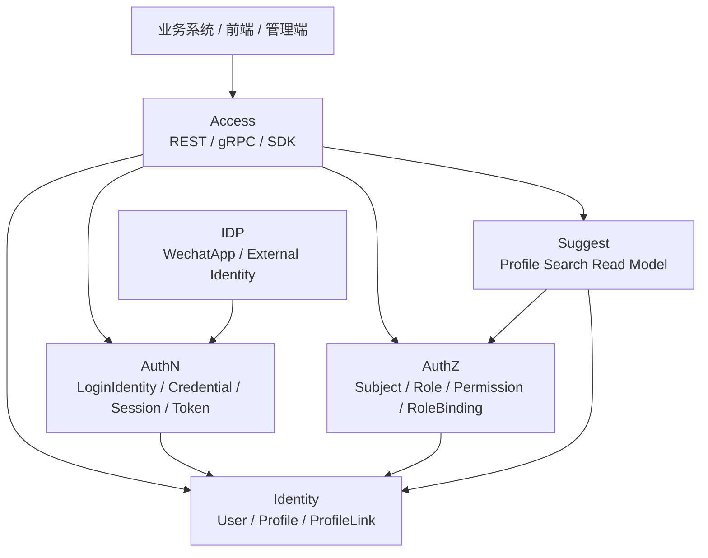

# 00-概览

## 本目录定位

`00-概览/` 是 IAM 文档体系的系统级入口。它只回答全局问题：

- IAM 是什么，不是什么。
- Identity、AuthN、AuthZ、IDP、Suggest 如何协作。
- 核心概念如何区分。
- 不同读者应该怎么读。
- 文档、代码、契约、测试冲突时相信谁。

业务模块细节放在 [02-业务模块](../02-业务模块/README.md)，设计取舍放在 [05-专题设计](../05-专题设计/README.md)。

## 文档结构

| 文档 | 作用 |
| --- | --- |
| [01-IAM系统定位.md](01-IAM系统定位.md) | 定义 IAM 的系统边界和核心问题 |
| [02-模块划分与协作关系.md](02-模块划分与协作关系.md) | 说明 3 个核心模块和 2 个辅助模块如何协作 |
| [03-核心概念术语表.md](03-核心概念术语表.md) | 统一 User、Principal、Subject、Profile、RoleBinding 等术语 |
| [04-阅读路径与事实源优先级.md](04-阅读路径与事实源优先级.md) | 提供读者路径和事实源规则 |
| [05-架构风格与设计原则.md](05-架构风格与设计原则.md) | 说明分层架构、组合根、Ports & Adapters 和 Outbox 等原则 |

## 总图

