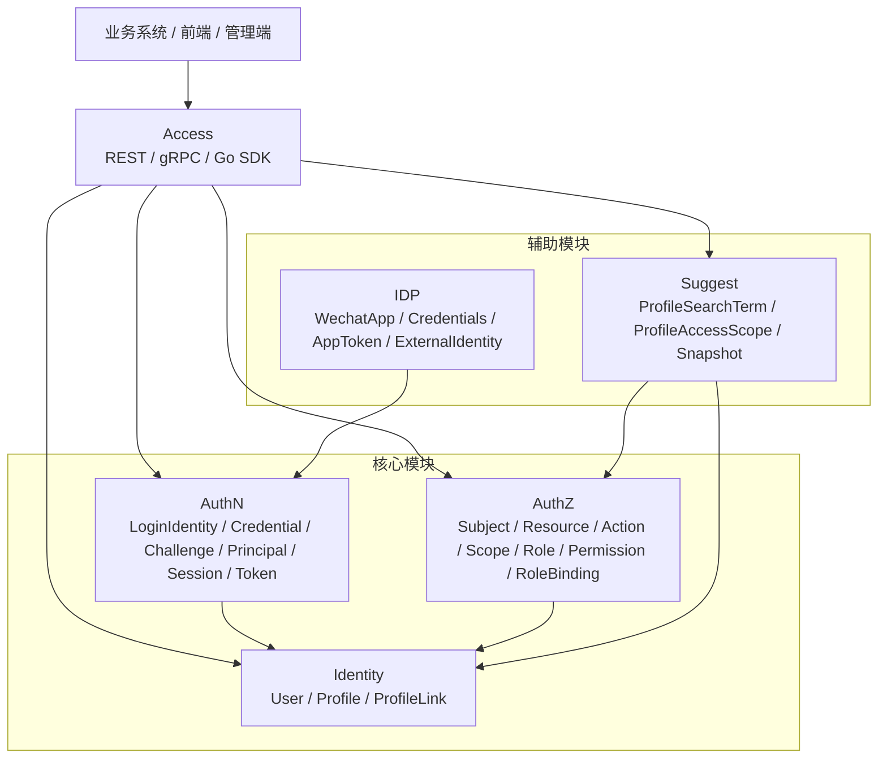

# 00-概览

> 状态：待补证据 · 目录入口与系统级导航，待继续随业务模块文档补全后校准链接和事实源。

---

## 1. 本目录定位

`00-概览/` 是 IAM 文档体系的系统级入口。

它只回答全局问题：

```text
IAM 是什么，不是什么；
IAM 为什么拆成 Identity、AuthN、AuthZ、IDP、Suggest；
核心概念如何区分；
不同读者应该怎么读；
文档、代码、契约、测试冲突时相信谁；
IAM 采用什么架构风格和设计原则。
```

它不展开业务模块内部模型和具体链路。

业务模块细节放在 [02-业务模块](../02-业务模块/README.md)，设计取舍放在 [05-专题设计](../05-专题设计/README.md)，运行时装配放在 [01-运行时](../01-运行时/README.md)。

---

## 2. 30 秒结论

IAM 是面向业务系统接入的身份与访问管理服务。

它围绕 3 个核心问题组织能力：

```text
用户是谁？        -> Identity
如何证明用户身份？ -> AuthN + IDP
用户能访问什么？   -> AuthZ
```

同时提供 2 类配套能力：

```text
接入能力：REST / gRPC / Go SDK。
辅助读模型：Suggest Profile 联想搜索。
```

本文档目录的作用是先建立全局心智模型，再把读者引导到对应事实层：

```text
系统定位和术语       -> 00-概览
启动装配和生命周期   -> 01-运行时
业务模块事实         -> 02-业务模块
接入方式和契约       -> 03-接入与契约
架构防漂移机制       -> 04-架构护栏
设计取舍             -> 05-专题设计
面试和宣讲表达       -> 06-宣讲
历史材料             -> _archive
```

---

## 3. 文档结构

| 文档 | 作用 | 阅读重点 |
| --- | --- | --- |
| [01-IAM系统定位.md](01-IAM系统定位.md) | 定义 IAM 的系统边界和核心问题 | IAM 是什么、不是什么、对外提供什么 |
| [02-模块划分与协作关系.md](02-模块划分与协作关系.md) | 说明 3 个核心模块和 2 个辅助模块如何协作 | Identity/AuthN/AuthZ/IDP/Suggest 的边界和协作主线 |
| [03-核心概念术语表.md](03-核心概念术语表.md) | 统一 User、Principal、Subject、Profile、RoleBinding 等术语 | 高频混淆概念的定义和“不是什么” |
| [04-阅读路径与事实源优先级.md](04-阅读路径与事实源优先级.md) | 提供读者路径和事实源裁决规则 | 不同角色怎么读、冲突时相信谁 |
| [05-架构风格与设计原则.md](05-架构风格与设计原则.md) | 说明分层架构、组合根、Ports & Adapters、Outbox 等原则 | 架构分层、依赖方向、边界护栏和常见反模式 |

---

## 4. 总图



这张图表达的是系统级协作关系：

```text
Access 是接入形态，不是业务模块；
Identity、AuthN、AuthZ 是核心模块；
IDP、Suggest 是辅助模块；
IDP 支撑 AuthN，但不拥有 AuthN 登录态；
Suggest 消费 Identity 的 Profile 事实，并受 AuthZ 可见范围约束。
```

更完整的模块协作说明见 [02-模块划分与协作关系.md](02-模块划分与协作关系.md)。

---

## 5. 核心模块与辅助模块

### 5.1 核心模块

| 模块 | 回答的问题 | 核心事实 | 不负责什么 |
| --- | --- | --- | --- |
| Identity | 用户是谁 | User、Profile、ProfileLink | 登录态、Token、权限判定、Suggest 索引 |
| AuthN | 如何证明用户身份 | LoginIdentity、Credential、Challenge、Principal、Session、Token、JWKS | 授权判定、ProfileLink 关系治理、外部身份源配置所有权 |
| AuthZ | 用户能访问什么 | Subject、Resource、Action、Scope、Role、Permission、RoleBinding、AuthorizationDecision、PolicyVersion | 登录认证、Token 签发、User/Profile 写模型 |

### 5.2 辅助模块

| 模块 | 回答的问题 | 核心事实 | 不负责什么 |
| --- | --- | --- | --- |
| IDP | 外部身份来源如何接入 | WechatApp、Credentials、AppToken、ExternalIdentity | IAM 登录态、IAM Token、User 所有权、权限判定 |
| Suggest | 如何快速搜索可见 Profile | ProfileSearchTerm、ProfileAccessScope、Snapshot、SuggestResult | Profile 写模型、登录认证、通用授权策略管理 |

---

## 6. 最重要的概念边界

阅读 IAM 文档时，先记住这些边界：

```text
User 是稳定身份主体，不是 Principal，也不是 Subject。
Principal 是认证成功后的运行时主体，不是数据库里的 User。
Subject 是授权域中的主体引用，不是 User 本体。
Profile 是业务身份资料或被服务对象，不等于 User。
ProfileLink 是 User 与 Profile 的身份关系事实，不是 Permission。
LoginIdentity 是登录身份，不是 Credential。
IDP 只提供外部身份来源证明，不创建 IAM 登录态。
Casbin 是 infra runtime，不是 AuthZ 领域语言。
Suggest 是读模型，不是 Identity 写模型。
```

完整术语说明见 [03-核心概念术语表.md](03-核心概念术语表.md)。

---

## 7. 推荐阅读路径

### 7.1 新读者

```text
../README.md
  -> 01-IAM系统定位.md
  -> 02-模块划分与协作关系.md
  -> 03-核心概念术语表.md
  -> ../02-业务模块/README.md
  -> ../02-业务模块/00-模块协作总图.md
```

目标：先建立 IAM 的边界、模块关系和核心术语。

---

### 7.2 后端开发

```text
04-阅读路径与事实源优先级.md
  -> ../01-运行时/README.md
  -> ../01-运行时/01-服务入口与生命周期.md
  -> ../01-运行时/02-组合根与依赖装配.md
  -> ../01-运行时/03-REST与gRPC传输层装配.md
  -> ../02-业务模块/README.md
```

目标：先理解服务如何启动、装配和进入业务模块。

---

### 7.3 模块维护者

```text
../02-业务模块/README.md
  -> ../02-业务模块/00-模块协作总图.md
  -> 目标模块/README.md
  -> 目标模块/00-模块总览.md
  -> 目标模块/01-领域模型-xxx.md
  -> 目标模块/02-领域模型图.md
  -> 目标模块/关键链路文档
  -> 目标模块/分层架构与代码索引.md
```

目标：按“模型优先、链路随后”的方式修改模块事实。

---

### 7.4 接入方

```text
../03-接入与契约/README.md
  -> ../03-接入与契约/01-REST接入契约.md
  -> ../03-接入与契约/02-gRPC接入契约.md
  -> ../03-接入与契约/03-Go-SDK接入模型.md
  -> OpenAPI / proto / pkg/sdk
```

目标：按机器契约正确接入 IAM。

---

### 7.5 文档维护者

```text
../CONTRIBUTING-DOCS.md
  -> 04-阅读路径与事实源优先级.md
  -> 目标目录 README.md
  -> 目标文件
  -> 对应源码 / 契约 / 测试
```

目标：避免旧事实、旧术语、旧目录和 `_archive/` 结论回流。

---

### 7.6 面试与宣讲

```text
../06-宣讲/README.md
  -> ../05-专题设计/README.md
  -> ../02-业务模块/README.md
  -> ../02-业务模块/目标模块/分层架构与代码索引.md
```

目标：用稳定讲法表达项目，但所有表达都能回链事实层。

---

## 8. 事实源优先级

当文档、代码、契约、测试或历史材料冲突时，按下面顺序判断：

1. 源码与运行时行为。
2. 机器可读契约与配置：OpenAPI、proto、配置、迁移。
3. 测试：架构测试、契约测试、模块测试、SDK compile test。
4. 现行维护中的 `docs/`。
5. `_archive/` 历史材料。

规则：

```text
代码和文档冲突：相信代码，更新文档。
契约和文档冲突：相信 OpenAPI/proto/SDK，更新文档。
测试和文档冲突：先确认测试是否仍有效；若测试有效，更新文档。
active docs 和 archive 冲突：相信 active docs，但要回到代码/契约复核。
代码和契约冲突：视为实现或契约漂移，不能靠文档裁决。
```

`_archive/` 只能作为历史材料和迁移参考，不能作为当前事实源。

---

## 9. 和其他目录的关系

| 目录 | 与 `00-概览/` 的关系 |
| --- | --- |
| [01-运行时](../01-运行时/README.md) | 承接架构风格中的启动、生命周期、组合根、transport、配置和后台任务细节 |
| [02-业务模块](../02-业务模块/README.md) | 承接 Identity、AuthN、AuthZ、IDP、Suggest 的当前事实层 |
| [03-接入与契约](../03-接入与契约/README.md) | 承接 REST、gRPC、Go SDK 和业务系统接入说明 |
| [04-架构护栏](../04-架构护栏/README.md) | 承接分层依赖、架构测试、契约测试、SDK compile test、docs-hygiene |
| [05-专题设计](../05-专题设计/README.md) | 承接 JWT/JWKS、Session/Token、Outbox、Casbin、ProfileLink、Suggest 的设计取舍 |
| [06-宣讲](../06-宣讲/README.md) | 承接面试、技术分享、讲法脚本和追问证据链 |
| [_archive](../_archive/README.md) | 历史材料和迁移参考，不作为当前事实源 |

---

## 10. Verify

修改本目录文档后至少执行：

```bash
make docs-hygiene
```

涉及架构边界时，再执行：

```bash
go test ./internal/pkg/architecture
```

涉及 REST 契约时，再执行：

```bash
make api-validate
```

涉及 gRPC 契约时，再执行：

```bash
make proto-gen
go test ./internal/apiserver/transport/grpc
```

涉及 Go SDK 公开 API 时，再执行：

```bash
go test ./pkg/sdk/...
```

---

## 11. 本目录总结

`00-概览/` 是 IAM 文档体系的系统级入口。

它的价值不是替代业务模块文档，而是先回答：

```text
IAM 是什么；
模块为什么这样分；
核心概念如何区分；
读者应该怎么读；
事实冲突时相信谁；
整体架构遵守什么原则。
```

读完本目录后，读者应该能带着清晰心智模型进入 [02-业务模块](../02-业务模块/README.md)，再逐个理解 Identity、AuthN、AuthZ、IDP、Suggest 的当前模型、关键链路、模块边界和代码事实源。
