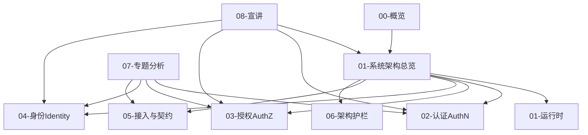

# 00-概览

## 本文回答

`00-概览/` 是 IAM 文档体系的系统级入口，负责回答：

1. IAM 当前是什么类型的系统；
2. 它为什么不是普通用户中心、登录系统或单独权限系统；
3. `iam-apiserver` 如何从进程入口装配成 REST/gRPC 服务；
4. `process / container / transport / application / domain / infra` 各层分别承担什么职责；
5. AuthN、AuthZ、Identity、IDP、接入契约和架构护栏之间如何衔接；
6. 新读者应该如何从概览层进入后续文档。

本目录不是 API 字段手册，也不是源码逐行解读。  
它的职责是先帮读者建立 IAM 的 **系统地图、分层认知和阅读路径**。

---

## 30 秒结论

IAM 是一个面向业务系统接入的身份与访问管理服务，不是普通用户中心。

它把以下能力收敛到一个可装配、可接入、可治理的 Go 服务中：

```text
AuthN：登录、账号、Session、Access Token、Refresh Token、JWKS、KeyRotation
AuthZ：Role、Resource、Permission、RoleBinding、Check、PolicyVersion、Outbox
Identity：User、Profile、ProfileLink
IDP：微信/企微应用配置、SecretVault、外部身份源协作
Access：REST、gRPC、SDK
Guard：架构测试、契约测试、SDK compile test、docs-hygiene
```

当前系统的运行主线是：

```text
cmd/apiserver
  -> internal/apiserver/app.go
  -> internal/apiserver/process
  -> internal/apiserver/container
  -> transport/rest + transport/grpc
  -> application / domain / infra
```

其中：

| 层次 | 职责 |
| --- | --- |
| `process` | 管理进程生命周期、资源准备、运行时任务和优雅关闭 |
| `container` | 作为组合根装配 AuthN/AuthZ/Identity/IDP 等模块 |
| `transport` | 负责 REST/gRPC 协议适配、路由注册、DTO/mapper、错误映射 |
| `application` | 编排用例、事务、UoW、跨模块协作 |
| `domain` | 承载实体、值对象、领域服务和业务规则 |
| `infra` | 适配 MySQL、Redis、Casbin、JWT、Outbox、微信 API 等外部资源 |

---

## 本目录文档

当前 `00-概览/` 只保留系统级总览文档：

```text
00-概览/
├── README.md
└── 01-系统架构总览.md
```

| 文档 | 作用 | 读完后应该能回答 |
| --- | --- | --- |
| [01-系统架构总览.md](01-系统架构总览.md) | IAM 第一张系统地图 | IAM 如何从 Go 进程装配成同时提供认证、授权、身份、IDP、REST/gRPC、Outbox 能力的服务 |

后续如果新增概览层文档，应继续保持“系统级入口”定位，不要把业务模块深潜内容塞回 `00-概览/`。

---

## 概览层知识地图



这张图表达的是：

- `00-概览` 只负责建立系统地图；
- `01-06` 是事实层，解释当前实现；
- `07-专题分析` 是设计取舍层，解释为什么这样设计；
- `08-宣讲` 是表达层，服务技术分享和面试准备；
- `_archive` 是历史层，不作为当前事实源。

---

## 建议阅读路径

### 路径一：第一次了解 IAM

适合新读者、面试复盘、技术分享前预习。

```text
docs/README.md
  -> 00-概览/README.md
  -> 00-概览/01-系统架构总览.md
  -> 08-宣讲/00-项目一句话定位.md
  -> 08-宣讲/01-业务背景与问题.md
```

目标：

```text
先知道 IAM 是什么、为什么需要它、整体如何分层。
```

---

### 路径二：理解系统运行时

适合后端开发、部署排查、源码阅读。

```text
00-概览/01-系统架构总览.md
  -> 01-运行时/01-服务入口与生命周期装配.md
  -> 01-运行时/02-Transport装配--REST路由与gRPC服务注册.md
  -> 01-运行时/03-配置与运行模式.md
  -> 01-运行时/04-后台任务与优雅关闭.md
  -> 01-运行时/05-降级启动与健康检查.md
```

目标：

```text
看懂 iam-apiserver 如何从 main 启动、准备资源、装配 container、注册 REST/gRPC、启动后台任务并优雅关闭。
```

---

### 路径三：理解核心业务模型

适合项目深读、面试项目讲解、DDD/架构复盘。

```text
02-认证AuthN/
  -> 01-登录链路--从Login请求到Session与Token.md
  -> 02-认证语义--用户状态&会话&Token边界.md
  -> 03-JWKS与KeyRotation.md
  -> 04-第三方登录与IDP协作.md

03-授权AuthZ/
  -> 01-授权模型--Role&Resource&Permission&RoleBinding.md
  -> 02-授权判定链路--从Check到Casbin.md
  -> 03-PolicyChangeCommitter与UoW.md
  -> 04-授权版本事件与Outbox.md

04-身份Identity/
  -> 01-User与Profile模型.md
  -> 02-ProfileLink链路--用户与儿童档案关系协作.md
```

目标：

```text
掌握 AuthN、AuthZ、Identity 三条核心业务链路。
```

---

### 路径四：理解外部接入

适合业务系统接入 IAM、SDK 使用、接口调试。

```text
05-接入与契约/01-REST API契约.md
05-接入与契约/02-gRPC API契约.md
05-接入与契约/03-SDK接入模型.md
api/rest/README.md
api/grpc/README.md
pkg/sdk/README.md
```

目标：

```text
知道 REST、gRPC、SDK 分别服务什么调用方，以及机器契约事实源在哪里。
```

---

### 路径五：面试与技术分享

适合对外讲解项目。

```text
08-宣讲/00-项目一句话定位.md
08-宣讲/01-业务背景与问题.md
08-宣讲/02-系统架构讲法.md
08-宣讲/03-AuthN认证体系讲法.md
08-宣讲/04-AuthZ授权体系讲法.md
08-宣讲/05-Identity与ProfileLink讲法.md
08-宣讲/11-30分钟技术分享脚本.md
08-宣讲/13-面试追问证据索引.md
```

目标：

```text
把项目讲清楚、讲准确、讲出亮点，并能回链源码证据。
```

---

## 00-概览 与后续目录的关系

| 后续目录 | `00-概览` 如何衔接 |
| --- | --- |
| `01-运行时` | 从系统总览进入服务入口、启动阶段、container 初始化、transport 注册、后台任务和优雅关闭 |
| `02-认证AuthN` | 从系统定位进入登录、Session、Access/Refresh Token、JWKS、KeyRotation、IDP 登录协作 |
| `03-授权AuthZ` | 从系统模块图进入 Role、Resource、Permission、RoleBinding、Casbin、PolicyVersion、Outbox |
| `04-身份Identity` | 从用户/档案关系进入 User、Profile、ProfileLink 和当前用户访问 guard |
| `05-接入与契约` | 从 REST/gRPC/SDK 接入图进入 OpenAPI、proto、SDK public API |
| `06-架构护栏` | 从分层架构进入 architecture tests、contract tests、docs-hygiene |
| `07-专题分析` | 从“当前是什么”进入“为什么这样设计” |
| `08-宣讲` | 从“系统事实”进入“如何对外讲清楚” |
| `_archive` | 只用于历史追溯，不进入当前阅读主路径 |

---

## 核心术语速查

| 术语 | 当前含义 |
| --- | --- |
| IAM | Identity and Access Management，身份与访问管理服务 |
| AuthN | Authentication，认证，负责登录、账号、Session、Token、JWKS |
| AuthZ | Authorization，授权，负责 Role、Resource、Permission、RoleBinding、Check |
| Identity | 身份主体与业务档案关系，负责 User、Profile、ProfileLink |
| IDP | Identity Provider 基础设施，负责第三方身份源配置、SecretVault、外部 API |
| User | 登录主体和 IAM 内部身份锚点 |
| Profile | 业务档案，例如本人档案、儿童档案、被测评者档案 |
| ProfileLink | User 与 Profile 之间的关系事实 |
| Assignment | REST/proto 对外 wire term，表示角色分配 |
| RoleBinding | 内部领域语言，表示 subject 在 tenant 下持有 role |
| Session | 在线登录态锚点 |
| Access Token | 短期访问凭证，当前实现为 JWT |
| Refresh Token | 服务端可控的续期凭证 |
| JWKS | 公钥发布机制，用于业务系统本地验签 |
| Online Verify | 在线认证状态检查，用于 revoked/session/user/account 状态判断 |
| PolicyVersion | tenant 级授权事实版本 |
| Transactional Outbox | 业务事实和事件记录同事务提交，再由 relay 异步发布 |
| SDK | Go 业务服务接入 IAM 的产品化封装，不是业务层 |
| docs-hygiene | 活跃文档断链与退役事实引用检查 |

---

## 当前事实源优先级

当文档、代码、接口说明发生冲突时，按以下优先级判断：

1. **源码与运行时行为**  
   例如 `cmd/`、`internal/apiserver/`、`internal/pkg/`、`pkg/`。

2. **机器契约、配置和迁移**  
   例如 `api/rest`、`api/grpc`、`configs`、`internal/pkg/migration/migrations`。

3. **测试与架构护栏**  
   例如 `internal/pkg/architecture`、REST/gRPC transport tests、SDK compile tests。

4. **当前维护文档**  
   例如 `docs/00-概览` 到 `docs/08-宣讲`。

5. **历史文档与归档材料**  
   `_archive/` 只用于历史追溯，不作为当前事实源。

这条规则非常重要。  
概览文档只能解释当前事实，不能替代源码、OpenAPI、proto 或 SDK 公开 API。

---

## 代码证据入口

| 主题 | 代码 / 契约入口 |
| --- | --- |
| 进程入口 | `cmd/apiserver/apiserver.go` |
| App 初始化 | `internal/apiserver/app.go` |
| 生命周期管理 | `internal/apiserver/process` |
| 组合根 | `internal/apiserver/container` |
| REST transport | `internal/apiserver/transport/rest` |
| gRPC transport | `internal/apiserver/transport/grpc` |
| AuthN 应用层 | `internal/apiserver/application/authn` |
| AuthN 领域层 | `internal/apiserver/domain/authn` |
| AuthZ 应用层 | `internal/apiserver/application/authz` |
| AuthZ 领域层 | `internal/apiserver/domain/authz` |
| Identity 应用层 | `internal/apiserver/application/uc` |
| Identity 领域层 | `internal/apiserver/domain/uc` |
| IDP 应用层 | `internal/apiserver/application/idp` |
| IDP 领域层 | `internal/apiserver/domain/idp` |
| JWT / JWKS | `internal/apiserver/infra/token` |
| Casbin | `internal/apiserver/infra/casbin` |
| Outbox | `internal/apiserver/infra/mysql/eventoutbox`、`internal/apiserver/infra/messaging/outbox_relay.go` |
| REST 契约 | `api/rest` |
| gRPC 契约 | `api/grpc` |
| SDK | `pkg/sdk` |
| 架构测试 | `internal/pkg/architecture/architecture_test.go` |
| 文档检查 | `scripts/check-docs-links.py` |

---

## 维护规则

### 1. `00-概览` 只写系统地图

不要在 `00-概览` 中重复展开每个模块的完整实现。  
详细链路应放在：

```text
01-运行时
02-认证AuthN
03-授权AuthZ
04-身份Identity
05-接入与契约
06-架构护栏
07-专题分析
08-宣讲
```

### 2. 不恢复旧目录体系

不要再把旧的 active 入口写回：

```text
02-业务域
03-接口与集成
04-基础设施与运维
05-专题分析
```

当前新版 active 入口是：

```text
00-概览
01-运行时
02-认证AuthN
03-授权AuthZ
04-身份Identity
05-接入与契约
06-架构护栏
07-专题分析
08-宣讲
_archive
```

### 3. 不把归档材料写成当前事实

`_archive/` 可以用于历史追溯，但不能作为当前实现事实源。

### 4. 概览层术语必须与事实层一致

尤其注意：

```text
ProfileLink
RoleBinding
Assignment wire term
Session
Access Token
Refresh Token
JWKS
Online Verify
PolicyVersion
Transactional Outbox
SDK 接入产品层
```

### 5. 新增图必须能回链源码

概览层的每一张图都应该能回链到：

```text
源码路径
API 契约
测试文件
文档事实层
```

不要画没有证据支撑的“想象架构图”。

---

## 发布检查

修改本目录后，至少执行：

```bash
make docs-hygiene
```

涉及 REST 契约时：

```bash
make docs-swagger
make api-validate
```

涉及 gRPC 契约时：

```bash
make proto-gen
go test ./internal/apiserver/transport/grpc
```

涉及架构边界时：

```bash
go test ./internal/pkg/architecture
```

涉及 SDK 公开 API 时：

```bash
go test ./pkg/sdk
```

---

## 本文总结

`00-概览/` 是 IAM 文档体系的第一张地图。

它不替代源码，不替代 OpenAPI，不替代 proto，不替代 SDK 文档，也不替代业务模块深潜文档。

它的价值是让读者先建立这套心智：

```text
IAM 不是用户中心
IAM 是身份与访问管理服务

process 管生命周期
container 管组合装配
transport 管 REST/gRPC 适配
application 管用例编排
domain 管业务规则
infra 管外部资源

AuthN 管认证态
AuthZ 管访问权
Identity 管 User/Profile/ProfileLink
IDP 管外部身份源
Access 管 REST/gRPC/SDK
Guard 管架构与契约防漂移
```

读完 `00-概览` 后，读者应该能够决定下一步去哪里：

```text
想看服务怎么启动 -> 01-运行时
想看登录和 token -> 02-认证AuthN
想看权限模型 -> 03-授权AuthZ
想看用户和档案关系 -> 04-身份Identity
想看如何接入 -> 05-接入与契约
想看如何防漂移 -> 06-架构护栏
想看为什么这样设计 -> 07-专题分析
想准备面试和分享 -> 08-宣讲
```
