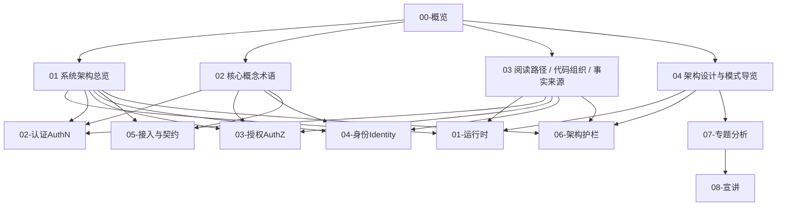

# 00-概览

## 1. 本目录定位

`00-概览/` 是 IAM 文档体系的系统级入口。

它负责在读者进入具体模块之前，先建立一张全局地图：

```text
IAM 是什么？
IAM 不是什么？
iam-apiserver 如何从进程入口装配成 REST/gRPC 服务？
process / container / transport / application / domain / infra 各层分别负责什么？
AuthN / AuthZ / Identity / IDP 如何协作？
读者应该如何继续阅读代码和文档？
文档、源码、契约、测试冲突时应该相信谁？
```

本目录不是 API 字段手册，也不是源码逐行解读，更不是业务模块深潜文档。

它的职责是：

```text
建立系统地图
统一核心术语
提供阅读路径
说明事实源优先级
导览 IAM 中使用的架构模式
```

---

## 2. 30 秒结论

IAM 是面向业务系统接入的身份与访问管理服务。

它不是：

```text
普通用户中心
单纯登录系统
简单权限 CRUD
Casbin 管理后台
业务资料大表
```

它的核心能力是：

```text
AuthN：认证，负责 LoginIdentity、Credential、Challenge、Principal、Session、Token、JWKS。
AuthZ：授权，负责 Subject、Role、Resource、Permission、RoleBinding、Check、PolicyVersion、Outbox。
Identity：身份事实，负责 User、Profile、ProfileLink。
IDP：外部身份源，负责微信、企业微信等第三方身份源适配。
Access：接入形态，负责 REST、gRPC、SDK。
Guard：架构与契约护栏，负责架构测试、契约测试、docs-hygiene。
```

当前运行时主线是：

```text
cmd/apiserver
  -> internal/apiserver/app.go
  -> internal/apiserver/process
  -> internal/apiserver/container
  -> transport/rest + transport/grpc
  -> application / domain / infra
```

当前模块协作主线是：

```text
AuthN 通过 LoginIdentity / Credential / Challenge 证明调用者身份，产出 Principal、Session、Token。
Identity 以 User 为稳定身份主体，维护 Profile 与 ProfileLink 身份事实。
AuthZ 将 User 映射为 Subject，通过 RoleBinding、Role、Permission、Resource、Action、Scope 完成授权判定。
IDP 提供外部身份源证明，但不直接决定 IAM 登录态。
REST/gRPC/SDK 是接入形态，不是业务模型本身。
```

如果只记一句话：

> IAM 以稳定身份 User 为锚点，将认证 AuthN、授权 AuthZ、身份事实 Identity、外部身份源 IDP 和 REST/gRPC/SDK 接入能力组织在同一个分层架构中。

---

## 3. 本目录文档结构

当前 `00-概览/` 包含 4 篇正文和 1 个入口 README：

```text
00-概览/
├── README.md
├── 01-系统架构总览.md
├── 02-核心概念术语.md
├── 03-阅读路径-代码组织与事实来源.md
└── 04-架构设计与模式导览.md
```

| 文档 | 作用 | 读完后应该能回答 |
| --- | --- | --- |
| [01-系统架构总览.md](01-系统架构总览.md) | 建立 IAM 第一张系统地图 | IAM 是什么、如何对外接入、如何启动装配、核心模块如何协作 |
| [02-核心概念术语.md](02-核心概念术语.md) | 统一全局术语边界 | User/Principal/Subject、LoginIdentity/Credential/Challenge、ProfileLink/Permission/RoleBinding 有什么区别 |
| [03-阅读路径-代码组织与事实来源.md](03-阅读路径-代码组织与事实来源.md) | 给不同读者提供阅读路线和事实源规则 | 不同角色该读什么、代码入口在哪里、事实冲突时相信谁 |
| [04-架构设计与模式导览.md](04-架构设计与模式导览.md) | 导览 IAM 中使用的架构模式 | Ports & Adapters、Layered Architecture、Composition Root、UoW、Outbox 等在 IAM 中解决什么问题 |

---

## 4. 概览层知识地图



这张图表达的是：

```text
00-概览负责建立系统地图、术语、阅读路径和架构模式认知；
01-06 是事实层，解释当前实现；
07-专题分析是设计取舍层，解释为什么这样设计；
08-宣讲是表达层，服务技术分享和面试准备；
_archive 是历史层，不作为当前事实源。
```

---

## 5. 推荐阅读顺序

### 5.1 第一次了解 IAM

适合新读者、面试复盘、技术分享前预习。

```text
00-概览/README.md
  -> 00-概览/01-系统架构总览.md
  -> 00-概览/02-核心概念术语.md
  -> 01-运行时/README.md
  -> 02-认证AuthN/README.md
  -> 03-授权AuthZ/README.md
  -> 04-身份Identity/README.md
```

目标：

```text
先知道 IAM 是什么、为什么需要它、整体如何分层、核心模块如何协作。
```

---

### 5.2 后端开发读源码

适合理解服务启动、模块装配、请求链路和分层边界。

```text
00-概览/01-系统架构总览.md
  -> 00-概览/03-阅读路径-代码组织与事实来源.md
  -> 01-运行时/01-服务入口与生命周期装配.md
  -> 01-运行时/02-Transport装配--REST路由与gRPC服务注册.md
```

重点入口：

```text
cmd/apiserver
internal/apiserver/app.go
internal/apiserver/process
internal/apiserver/container
internal/apiserver/container/assembler
internal/apiserver/transport/rest
internal/apiserver/transport/grpc
internal/apiserver/application
internal/apiserver/domain
internal/apiserver/infra
```

---

### 5.3 维护 AuthN

适合理解认证模型、开通链路、登录链路、绑定链路、Challenge、Session、Token、JWKS。

```text
02-认证AuthN/README.md
  -> 02-认证AuthN/00-AuthN模型总览-User-LoginIdentity-Credential-Challenge.md
  -> 02-认证AuthN/01-Onboarding链路-从身份开通到LoginIdentity与Credential.md
  -> 02-认证AuthN/02-Login链路-从登录请求到Principal与Token.md
  -> 02-认证AuthN/03-Linking链路-登录身份绑定解绑与安全边界.md
  -> 02-认证AuthN/04-Challenge链路-短信验证码与短期认证挑战.md
  -> 02-认证AuthN/05-Session与Token边界-Principal-Session-JWT-RefreshToken.md
  -> 02-认证AuthN/06-JWT-JWS-JWKS与KeyRotation.md
  -> 02-认证AuthN/07-第三方登录与IDP协作-WeChat-WeCom.md
  -> 02-认证AuthN/08-AuthN分层架构与事实源索引.md
```

---

### 5.4 维护 AuthZ

适合理解资源授权模型、读链路、写链路、Casbin runtime、PolicyVersion、Outbox、PolicyLinter。

```text
03-授权AuthZ/README.md
  -> 03-授权AuthZ/00-AuthZ模型总览-Subject-Role-Resource-Permission-RoleBinding.md
  -> 03-授权AuthZ/01-授权资源与动作模型-ResourceKey-ResourcePattern-Action-Scope.md
  -> 03-授权AuthZ/02-授权角色与绑定模型-Role-RoleBinding-Subject.md
  -> 03-授权AuthZ/03-Check与Snapshot读链路.md
  -> 03-授权AuthZ/04-授权写入链路-PolicyAdministration与PolicyChange.md
  -> 03-授权AuthZ/05-PolicyChangeCommitter与AuthZUoW.md
  -> 03-授权AuthZ/06-Casbin运行时模型-pgFacts与四段Matcher.md
  -> 03-授权AuthZ/07-PolicyVersion-Outbox与RuntimeReload.md
  -> 03-授权AuthZ/08-PolicyLinter与授权事实治理.md
  -> 03-授权AuthZ/09-AuthZ分层架构与事实源索引.md
```

重点记住：

```text
AuthZ 不是 user.role。
AuthZ 不是 Casbin CRUD。
ResourceKey 使用四段结构。
RoleBinding 是内部术语，Assignment 是对外 wire term。
PolicyChangeCommitter 是授权写入主路径。
```

---

### 5.5 维护 Identity

适合理解 User、Profile、ProfileLink，以及 Identity 与 AuthN/AuthZ 的边界。

```text
04-身份Identity/README.md
  -> 04-身份Identity/00-Identity模型总览-User-Profile-ProfileLink.md
  -> 04-身份Identity/01-ProfileLink链路-User与Profile关系协作.md
  -> 04-身份Identity/02-Identity与AuthN-认证身份-Principal-User边界.md
  -> 04-身份Identity/03-Identity与AuthZ-Subject-Resource-Permission边界.md
  -> 04-身份Identity/04-Identity分层架构与事实源索引.md
```

重点记住：

```text
User 是稳定身份主体。
Profile 是业务身份资料或业务档案。
ProfileLink 是 User 与 Profile 的关系事实。
Principal 不是 User。
Subject 不是 User。
ProfileLink 不是 Permission。
```

---

### 5.6 接入方阅读 IAM

适合业务系统接入 IAM、SDK 使用、接口调试。

```text
05-接入与契约/README.md
  -> 05-接入与契约/01-REST API契约.md
  -> 05-接入与契约/02-gRPC API契约.md
  -> 05-接入与契约/03-SDK接入模型.md
  -> api/rest
  -> api/grpc
  -> pkg/sdk
```

目标：

```text
知道 REST、gRPC、SDK 分别服务什么调用方，以及机器契约事实源在哪里。
```

---

### 5.7 架构评审

适合检查模块边界、依赖方向、契约事实源、文档事实源是否稳定。

```text
00-概览/01-系统架构总览.md
  -> 00-概览/04-架构设计与模式导览.md
  -> 06-架构护栏/README.md
  -> 06-架构护栏/01-架构测试与依赖边界.md
  -> 06-架构护栏/02-文档事实源与防漂移机制.md
```

重点检查：

```text
domain 是否依赖 infra/transport；
transport 是否绕过 application；
container 是否写业务规则；
AuthZ 内部是否退回 assignment；
Casbin p/g facts 是否泄露到 domain/transport；
AuthN 是否退回 Account 中心模型；
Identity 是否把 ProfileLink 写成 Permission；
docs 是否引用 _archive 或退役路径作为当前事实源。
```

---

### 5.8 面试与技术分享

适合对外讲解项目。

```text
08-宣讲/README.md
  -> 08-宣讲/00-项目一句话定位.md
  -> 08-宣讲/01-业务背景与问题.md
  -> 08-宣讲/02-系统架构讲法.md
  -> 08-宣讲/03-AuthN认证体系讲法.md
  -> 08-宣讲/04-AuthZ授权体系讲法.md
  -> 08-宣讲/05-Identity与ProfileLink讲法.md
  -> 08-宣讲/11-30分钟技术分享脚本.md
  -> 08-宣讲/13-面试追问证据索引.md
```

目标：

```text
把项目讲清楚、讲准确、讲出亮点，并能回链源码证据。
```

---

## 6. 00-概览 与后续目录的关系

| 后续目录 | `00-概览` 如何衔接 |
| --- | --- |
| `01-运行时` | 从系统总览进入服务入口、启动阶段、container 初始化、transport 注册、后台任务和优雅关闭 |
| `02-认证AuthN` | 从术语和系统总览进入 LoginIdentity、Credential、Challenge、Principal、Session、Token、JWKS |
| `03-授权AuthZ` | 从模块图进入 Subject、Role、Resource、Permission、RoleBinding、Check、PolicyVersion、Outbox |
| `04-身份Identity` | 从 User 身份锚点进入 Profile、ProfileLink，以及 Identity 与 AuthN/AuthZ 的边界 |
| `05-接入与契约` | 从 REST/gRPC/SDK 接入图进入 OpenAPI、proto、SDK public API |
| `06-架构护栏` | 从分层架构进入 architecture tests、contract tests、SDK compile tests、docs-hygiene |
| `07-专题分析` | 从“当前是什么”进入“为什么这样设计” |
| `08-宣讲` | 从“系统事实”进入“如何对外讲清楚” |
| `_archive` | 只用于历史追溯，不进入当前阅读主路径 |

---

## 7. 核心术语速查

| 术语 | 当前含义 |
| --- | --- |
| IAM | Identity and Access Management，身份与访问管理服务 |
| AuthN | Authentication，认证，负责 LoginIdentity、Credential、Challenge、Principal、Session、Token、JWKS |
| AuthZ | Authorization，授权，负责 Subject、Role、Resource、Permission、RoleBinding、Check、PolicyVersion、Outbox |
| Identity | 身份事实模块，负责 User、Profile、ProfileLink |
| IDP | Identity Provider 基础设施，负责微信、企微等外部身份源适配 |
| User | IAM 内部稳定身份主体 |
| LoginIdentity | User 绑定的登录身份，用于定位 User |
| Credential | 长期认证材料，例如 password hash |
| Challenge | 短期认证挑战，例如短信验证码 |
| Principal | AuthN 认证成功后的运行时主体表达 |
| Subject | AuthZ 授权主体引用，例如 `user:<userID>` |
| Profile | 业务身份资料、业务档案或被服务对象 |
| ProfileLink | User 与 Profile 之间的身份关系事实 |
| Role | 权限聚合点 |
| Resource | 受保护资源目录项 |
| ResourceKey | 四段资源标识：`<app>:<domain>:<type>:<name-or-pattern>` |
| Permission | Role 对 Resource / Action / Scope 的能力声明 |
| RoleBinding | Subject 在 Tenant 下持有 Role 的内部领域事实 |
| Assignment | REST/proto/SDK 对外 wire term，表示角色分配 |
| Session | 服务端认证上下文 |
| Access Token | 短期访问凭证，当前实现为 JWT/JWS |
| Refresh Token | 服务端可控的续期凭证 |
| JWKS | 公钥发布机制，用于资源服务本地验签 |
| Online Verify | 在线认证状态检查，用于校验 session/token/user/login identity 当前状态 |
| PolicyVersion | Tenant 级授权事实版本 |
| Transactional Outbox | 业务事实和事件记录同事务提交，再由 relay 异步发布 |
| SDK | Go 业务服务接入 IAM 的产品化封装，不是业务层 |
| docs-hygiene | 活跃文档断链与退役事实引用检查 |

---

## 8. 代码证据入口

| 主题 | 代码 / 契约入口 |
| --- | --- |
| 进程入口 | `cmd/apiserver` |
| App 初始化 | `internal/apiserver/app.go` |
| 生命周期管理 | `internal/apiserver/process` |
| 组合根 | `internal/apiserver/container` |
| 模块装配 | `internal/apiserver/container/assembler` |
| REST transport | `internal/apiserver/transport/rest` |
| gRPC transport | `internal/apiserver/transport/grpc` |
| AuthN 应用层 | `internal/apiserver/application/authn` |
| AuthN 领域层 | `internal/apiserver/domain/authn` |
| AuthZ 应用层 | `internal/apiserver/application/authz` |
| AuthZ 领域层 | `internal/apiserver/domain/authz` |
| Identity 应用层 | `internal/apiserver/application/identity` |
| Identity 领域层 | `internal/apiserver/domain/identity` |
| IDP 应用层 | `internal/apiserver/application/idp` |
| IDP 领域层 | `internal/apiserver/domain/idp` |
| JWT / JWKS | `internal/apiserver/infra/token` |
| Casbin | `internal/apiserver/infra/casbin` |
| REST 契约 | `api/rest` |
| gRPC 契约 | `api/grpc` |
| SDK | `pkg/sdk` |
| migration | `internal/pkg/migration/migrations` |
| 架构测试 | `internal/pkg/architecture` |
| 文档检查 | `scripts/check-docs-links.py`、`scripts/check-docs-retired-terms.py` |

---

## 9. 事实源优先级

当文档、代码、接口说明发生冲突时，按以下优先级判断：

```text
1. 源码与运行时行为
2. 机器契约、配置和 migration
3. 测试与架构护栏
4. 当前 active docs
5. 历史文档与归档材料
```

| 优先级 | 事实源 | 示例 |
| --- | --- | --- |
| 1 | 源码与运行时行为 | `cmd/`、`internal/apiserver/`、`internal/pkg/`、`pkg/` |
| 2 | 机器契约、配置和 migration | `api/rest`、`api/grpc`、`configs`、`internal/pkg/migration/migrations` |
| 3 | 测试与架构护栏 | `internal/pkg/architecture`、domain/application/transport tests、SDK compile tests |
| 4 | 当前 active docs | `docs/00-概览` 到 `docs/08-宣讲` |
| 5 | 历史材料 | `docs/_archive` |

规则：

```text
代码变了，文档跟着改；
契约变了，接入文档跟着改；
架构边界变了，架构护栏和专题分析跟着改；
_archive 不能作为当前事实源。
```

---

## 10. 维护规则

### 10.1 `00-概览` 只写系统地图

不要在 `00-概览` 中重复展开每个模块的完整实现。

详细链路应放在：

```text
01-运行时
02-认证AuthN
03-授权AuthZ
04-身份Identity
05-接入与契约
06-架构护栏
07-专题分析
08-宣讲
```

---

### 10.2 不恢复旧目录体系

不要再把旧的 active 入口写回：

```text
02-业务域
03-接口与集成
04-基础设施与运维
05-专题分析
```

当前新版 active 入口是：

```text
00-概览
01-运行时
02-认证AuthN
03-授权AuthZ
04-身份Identity
05-接入与契约
06-架构护栏
07-专题分析
08-宣讲
_archive
```

---

### 10.3 不把归档材料写成当前事实

`_archive/` 可以用于历史追溯，但不能作为当前实现事实源。

---

### 10.4 概览层术语必须与事实层一致

尤其注意：

```text
User / Principal / Subject
LoginIdentity / Credential / Challenge
Profile / ProfileLink
RoleBinding / Assignment
ResourceKey / ResourcePattern / Scope
Session / Access Token / Refresh Token
JWKS / Online Verify
PolicyVersion / Transactional Outbox
SDK 接入产品层
```

---

### 10.5 新增图必须能回链源码

概览层的每一张图都应该能回链到：

```text
源码路径
API 契约
测试文件
文档事实层
```

不要画没有证据支撑的“想象架构图”。

---

## 11. 发布检查

修改本目录后，至少执行：

```bash
make docs-hygiene
```

涉及 REST 契约时：

```bash
make docs-swagger
make api-validate
```

涉及 gRPC 契约时：

```bash
make proto-gen
go test ./internal/apiserver/transport/grpc/...
```

涉及架构边界时：

```bash
go test ./internal/pkg/architecture
```

涉及 SDK 公开 API 时：

```bash
go test ./pkg/sdk/...
```

如果 Makefile 或 CI 命令发生变化，以项目当前 Makefile 和 CI 配置为准。

---

## 12. 本文总结

`00-概览/` 是 IAM 文档体系的第一张地图。

它不替代源码，不替代 OpenAPI，不替代 proto，不替代 SDK 文档，也不替代业务模块深潜文档。

它的价值是让读者先建立这套心智：

```text
IAM 不是用户中心。
IAM 是身份与访问管理服务。

process 管生命周期。
container 管组合装配。
transport 管 REST/gRPC 适配。
application 管用例编排。
domain 管业务规则。
infra 管外部资源。

AuthN 管认证态。
AuthZ 管访问权。
Identity 管 User/Profile/ProfileLink。
IDP 管外部身份源。
Access 管 REST/gRPC/SDK。
Guard 管架构与契约防漂移。
```

读完 `00-概览` 后，读者应该能够决定下一步去哪里：

```text
想看服务怎么启动 -> 01-运行时
想看登录和 Token -> 02-认证AuthN
想看权限模型 -> 03-授权AuthZ
想看用户和档案关系 -> 04-身份Identity
想看如何接入 -> 05-接入与契约
想看如何防漂移 -> 06-架构护栏
想看为什么这样设计 -> 07-专题分析
想准备面试和分享 -> 08-宣讲
```
