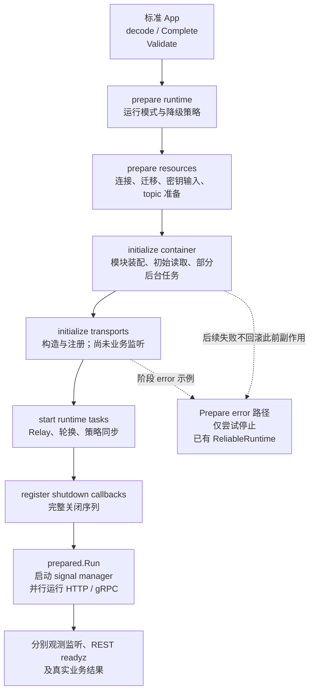
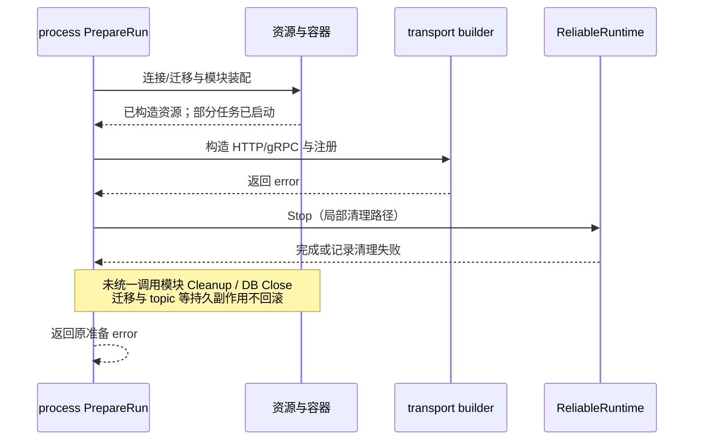

# 启动与组合根：装配顺序、准备副作用和失败边界

> 状态：已实现 · 本文说明标准 APIServer 的启动路径与当前失败合同。带有“候选”的方案尚未实现；准备成功、端口监听和业务就绪分别取证。

## 1. 启动流程解决了什么，还没有解决什么

IAM 把命令输入、进程生命周期、模块装配和传输注册分开：配置错误尽早拒绝，跨模块依赖集中连线，HTTP/gRPC 消费各自需要的能力。六个准备阶段规定了执行顺序，但**没有形成统一的失败回滚**：模块初始化已可能写数据库/文件、启动 worker 和 cron；PrepareRun 失败只显式清理可靠消息运行时。

因此，新增模块或启动步骤时，要同时回答三个问题：它依赖谁、何时产生副作用、后续失败由谁停止或释放。增加一个 interface 或一个 Stage 名称，只回答了部分问题。

| 阅读问题 | 本文定位 | 详细规则的唯一正文 |
| --- | --- | --- |
| 修改入口为何不能只调用 Config 转换？ | 标准 App 的校验链 | [配置与传输装配](02-配置与传输装配.md) |
| Identity 排在后面，AuthN 为什么能读 User 状态？ | 固定计划与窄能力的首次装配 | [Identity 边界](../02-业务模块/01-Identity/04-模块边界-Identity与AuthN-AuthZ-Suggest.md) |
| 一个模块报错，其他模块还会构造吗？ | 容器继续收集错误与进程硬门禁 | 本文第 4、5 节 |
| PrepareRun 成功代表可接业务流量吗？ | 后台启动、注册、监听及 readiness 分开 | [后台任务、就绪与关闭](03-后台任务就绪与优雅关闭.md) |
| 新索引后端能否直接换端口实现？ | 组合根只提供装配入口 | [Suggest 替换合同](../02-业务模块/05-Suggest/04-模块边界与代码索引.md) |

## 2. 从命令输入到进程，不要跳过校验层

标准入口是 `cmd/apiserver/apiserver.go` 的 `NewApp("iam-apiserver").Run()`，不是每个模块单独启动一个 App。

```text
pkg/app：读取配置/绑定 flags → Unmarshal → Complete → Validate
  → internal/apiserver/app.go：初始化日志 → CreateConfigFromOptions
  → internal/apiserver/run.go：转交 process.Run
  → process：createAPIServer → PrepareRun → preparedAPIServer.Run
```

`pkg/app` 是本仓命令框架。标准 runCommand 在运行回调前应用 options 规则；CreateConfigFromOptions 只做 ApplyDefaults 并把 `*Options` 嵌入 Config，没有再次 Validate，也没有深复制成不可变快照。测试或新入口直接调用转换函数时，不能借用标准 App 的安全校验结论。文件选择、env-only 键和各项默认值由配置主文维护。配置读取失败会直接退出，options 错误发生在 PrepareRun 之前；日志初始化的 panic 也不属于六阶段的普通 error。

`internal/apiserver/run.go` 只转交；真正的生命周期实现位于 process。createAPIServer 创建 shutdown manager、POSIX manager 和 DatabaseManager，尚未连接数据库、注册业务路由或监听业务端口。标准 CLI 收到最终 error 后由 `pkg/app.App.Run` 退出 1；直接调用 apiserver.Run 则拿到 error，调用方仍须处理同进程中的资源。

运行模式由 RuntimeProfile 解释：debug→development、test→test、release→production；输入会去空格、转小写，非法值拒绝。显式请求降级只在非 production 生效。这个策略限制资源准备中的容忍范围，不能推导“任何 debug 实例都能缺模块启动”。

## 3. 六阶段有顺序，prepared 不是 ready

prepareRunner 使用锁定的 component-base v0.8.0 processruntime.Runner，共享 prepareState 并顺序执行。普通 error 立即结束后续阶段；全部成功才生成 prepared 包装。



| 阶段 | 当前动作与输出 | 不能从“成功”推出什么 |
| --- | --- | --- |
| prepare runtime | 解析 profile，计算 degradedAllowed，持有 lifecycle hook 集合 | 外部依赖可用 |
| prepare resources | DatabaseManager.Initialize；取 MySQL/Redis；解析 IDP key；确保 durable NSQ topics，输出资源引用 | 没有改持久状态；所有连接初始化错误已由 Initialize 返回 |
| initialize container | 转换 typed RuntimeOptions，执行固定模块计划，再校验 critical 模块 | 所有构造都无 I/O、无 goroutine；Available 等于完整健康 |
| initialize transports | build HTTP→build gRPC→register REST→register gRPC；整体成功才保存到 apiServer | 业务端口已监听；注册即持续就绪 |
| start runtime tasks | 启动 ReliableRuntime、异步轮换、启动 policy sync，补 lifecycle hook | 全部后台任务已运行或首次订阅成功 |
| register shutdown callbacks | 登记完整 drain/stop/close 回调 | 回调已被触发；此前准备失败也走同一关闭路径 |

两个容易被日志掩盖的细节：

- Runner 将失败阶段名作为独立返回值，原 error 不自动包装阶段名；当前 PrepareRun 使用 `prepared, _, err`，丢弃名称。部分下层 error 有自己的操作前缀，不保证每个最终错误包含六阶段标签。
- “hexagonal architecture initialized” 在 runtime-task 阶段写日志，早于最后 callback 注册与 Run。它不能证明监听、订阅、readyz 或登录成功。

prepareRunner 本身没有总启动 context、统一截止时间或 undo。部分操作有局部时限，如 topic 准备的 30s、标准 schema/handoff 检查的 5s；不能据此承诺整个启动在这些时间内完成。数据库迁移、首次 Full 和同步初始尝试应按各自实现分析。

## 4. 固定模块计划与窄能力装配

当前顺序是 `event runtime → IDP → AuthN → AuthZ → Identity → Suggest → cache governance`。这是手写数组；moduleGraph 集中生成 typed deps，没有自动拓扑排序、循环检测或“provider 失败就自动跳过 consumer”。

| 步骤 | 依赖与为什么排在这里 | 实际装配内容 |
| --- | --- | --- |
| event runtime | 后续 AuthN/AuthZ 需要 publisher/stager | catalog、标准 schema 与 legacy drained 检查、专用 publisher、Relay；本步尚未 Start Relay |
| IDP | AuthN 可能需要外部身份解析 | 仓储、Vault、provider/client 与缓存；不是一次真实 provider 登录验收 |
| AuthN | DB/Redis、Identity UserStatusReader、IDP 与 publisher | 认证/Session/Token 能力；可能初始化密钥、PEM/JWKS；轮换 scheduler 在这里构造 |
| AuthZ | DB、event stager、Identity UserResolver | 首次加载策略 Runtime，再校验 constraints/ACL；随后 Container 构造 SDK policy subscriber |
| Identity | DB，以及 AuthN SessionRevoker、AuthZ EffectiveRoleReader | 用户/档案/关系应用；条件满足时立即启动 Session 撤销 worker |
| Suggest | DB、AuthZ checker、Redis 与自身配置 | 同一 memory.Runtime 注入 query/refresh，执行首次 Full 并启动 cron；optional 内部失败可换为空查询能力 |
| cache governance | 收集已构造模块的 inspector | 读侧状态服务；不能替代业务就绪检测 |

Identity 的 UserAccess 是窄能力的提前装配：首次调用 identityUserAccessCapabilities 时，从共同 DB 构造 UserStatusReader/UserResolver 并缓存；当前首次调用在 AuthN deps 构造，随后 AuthZ 复用。完整 Identity 模块仍在 AuthZ 后面。这样解开“AuthN 需要用户状态，而 Identity 需要 SessionRevoker”的装配依赖，既不启动一个提前的完整 Identity，也不复制 User 领域的所有权。

窄能力只解决依赖形状。共同 `*gorm.DB` 不代表不同调用共享事务或同一事实版本；UserResolver 是否借用命令事务、Session 撤销如何跨提交执行，由对应模块正文说明。若新增能力需要完整 Identity 的应用状态或正在运行的 worker，不能直接归入这份提前能力而省略新的启动依赖。

组合根也不等于所有参数都已经是最小接口：AuthN deps 仍接收具体 IDPModule，模块 builder 接收 DB/Redis 来选择 adapter。REST/gRPC collector 在装配边界构造 handler/service；application capability、transport deps 和 runtime deps 提供不同视图，减少直接字段导航。它们不构成绝对的基础设施隔离证明：IDP GetWechatApp 仍有 repository/Vault 的查询例外，见[IDP 代码索引](../02-业务模块/04-IDP/04-模块边界与代码索引.md)。

## 5. 记录错误、可用状态与进程准入分别判定

runBootstrapPlan 对普通 error 记录模块失败原因并继续，收集为错误列表，由 Container.Initialize 汇总为 errors.Join；遇 ErrUnsafeMessagingHandoff 提前结束计划。没有 panic recovery。cache governance 的 typed-nil provider 调用等 panic 不属于这套普通 error 合同，具体条件由 IDP 边界正文登记。

计划正常返回后，Container.Initialize **即使有聚合错误仍设置 initialized=true**；因此下一次 Initialize 返回 already initialized，而不是重试失败模块。ModuleState.Bootstrapped 复用这个容器标记，连提前停止后未执行的步骤也可能显示 true，不能把它解释成逐模块成功执行记录。

| 判断 | 当前依据 | 具体边界 |
| --- | --- | --- |
| ContainerState.Available | initialized | 有 bootstrapErrors 仍可 true，并带聚合原因 |
| ModuleState.Available | initialized && moduleAvailable | IDP/AuthN/AuthZ/Identity 主要看模块指针；Suggest 另看 Querier 是否非 nil；不扣除失败原因 |
| CriticalModulesMissing | IDP/AuthN/AuthZ/Identity 指针是否缺失 | 不检测已赋值模块的 subscriber 错误，也不检查每个 capability 或实时健康 |
| REST/gRPC 出口 | collector 按 Available 构造；REST router检查所需能力，gRPC按registration闭包注册 | gRPC没有统一验证全部capability；装配规则不能证明标准进程接受了上游错误 |
| readiness | required 组件、超时与 draining | 是运行态采样，规则归后台主文 |

例如 initAuthzModule 先成功构造并保存 AuthzModule，再检查 SDK 开关、审计表与订阅依赖。后半段失败时，内部状态可以同时 Available=true 与 DegradedReason!=empty，随后 Identity/Suggest 仍能取得该指针。标准 process 会拒绝继续启动，不能把这个内部反例描述成“线上带错误的路由已经开放”。

标准进程有两道不能被开发降级绕过的限制：prepareMessaging 先要求 reliable messaging 与 SDK consumer 启用，topic 准备失败直接返回；走到 prepareContainer 后，可靠消息启用就拒绝任何 Initialize error，另对 unsafe handoff 明确拒绝。下层 `degradedAllowed && !reliableMessagingEnabled` 的容忍分支仍存在，但完整标准入口不能借此关闭消息后继续。

数据库准备也分两层：DatabaseManager.Initialize 对连接注册/初始化错误主要记录日志；后续资源阶段通过 GetMySQLDB/GetCacheRedisClient 检查，除非模式允许容忍。GetMySQLDB 的类型断言也不排除 typed-nil `*gorm.DB`；runMigrations 单独检查 nil 并跳过，最终模块仍有非 nil DB 门禁。因而“Initialize completed”不证明连接或迁移实际成功，更不证明降级资源能满足后面的硬门禁。

## 6. 准备失败留下什么：三个具体窗口

普通 error 返回不撤销已完成的持久操作，也不统一停止所有后台工作。PrepareRun 的失败分支只调用 cleanupReliableStartup：容器存在且有 ReliableRuntime 时，用 shutdown timeout 执行 Stop；失败只记日志，不把清理错误加入原始准备 error，也没有 Interrupt/再次 Stop。

| 失败窗口 | 已发生的动作 | 当前显式处理与剩余边界 |
| --- | --- | --- |
| DB/Redis 已连接、迁移后，IDP key 缺失或无法解析 | 连接已创建；可能执行 DDL/seed | Container 尚不存在，可靠清理直接返回；没有调用 DatabaseManager.Close，更没有回滚此前迁移 |
| 模块装配后，gRPC mTLS/ACL 构造失败 | AuthN 初始密钥可能已写；Identity worker、Suggest Full/cron 可能已运行 | 停止可靠运行时，不调用模块 Cleanup 或数据库/transport Close；函数返回不等于已 join 所有任务 |
| transport helper 构造成功后，注入的 gRPC registrar 返回 error | 候选 server 已存在；开启 mTLS autoReload 时证书任务已开始 | helper 返回空 output；apiServer 仅在整体成功后保存引用，无统一 Close；此 error 分支不等于当前 Registry 已内建某种普通失败 |

第三行是 helper 允许的失败情境：当前 Registry 的 Registration 回调没有 error 返回，nil server 还会直接成功跳过；重复/非法注册的 panic 也不被转换成此 error。替身测试覆盖 helper 传播注入 error，不证明标准 Registry 能检测全部注册失败。



局部释放仍应保留：迁移专用 sql.DB 有 defer Close；event platform 在自身构造失败时会 Close managed publisher，必要时 Interrupt 后再次 Close；成功构造后交给 ReliableRuntime.Stop。它们保护局部资源，不能扩写为整个启动的 rollback。失败连接的资源是否进入 registry 则须查连接 adapter，不得据 Registry.Close 存在断言所有失败候选均会释放。

标准 CLI 最后退出会由操作系统回收进程资源，但这不证明应用主动 drain/join，也不会撤销已经提交的数据库、PEM 或 NSQ topic 变化。进程内重复启动、测试和嵌入式调用尤其不能依赖 OS 退出代替生命周期合同。

## 7. 后台启动、服务注册与监听的真实关系

后台任务并未全部集中到 startRuntimeTasks，启动结果也有不同政策：

| 任务 | 何时启动 | error/完成的含义 |
| --- | --- | --- |
| Identity 撤销 worker | 模块 Initialize；有 revoker 且 poll interval>0 | 直接开 goroutine，没有等待首轮业务完成 |
| Suggest | 模块 Initialize 同步 Full，登记 cron 后 Start | optional 内部错误可返回 nil 并降级；成功标志不证明持续刷新活性 |
| mTLS autoReload | gRPC NewServer；开关启用时 | Prepare 尚未完成、业务尚未 Listen 就可能运行 |
| ReliableRuntime | process runtime-task 阶段 | Start error 返回到 Prepare；成功只是开始监督，不等于 Outbox 交付/业务接受完成 |
| JWKS rotation | 同一阶段用 goroutine 调 Start | error 只写日志，Prepare 不等待其成功 |
| AuthZ policy sync | 同一阶段直接调用 Start | 外层 error 只写日志；当前 managed loop 等首次尝试/核对，失败仍可返回 nil 并重试 |

专用 managed publisher 的初始 Broker Ping 在此前 event platform 构造中发生；不能把这项连通前置归功于 ReliableRuntime.Start，也不能用一次 Ping 推导后续持续可达或交付成功。

HTTP/gRPC 构造和注册先于 process runtime-task 阶段；注册后的 gRPC MarkAllServicesServing 不调用 REST Container Checker。Suggest 当前无 gRPC 出口；gRPC collector 的顺序是 AuthN→Identity→IDP→AuthZ，与容器 bootstrap 顺序不同，不能把两张顺序表混用。

prepared.Run 先启动 shutdown manager，再并行运行两个 transport runner。业务监听发生在各自 Run：HTTP 开 ListenAndServe/可选 HTTPS；gRPC 先启动独立 health HTTP goroutine，再 net.Listen 业务端口。独立 health 端口 bind error 只记录日志，不通过 RunGroup 使业务服务退出；反过来，业务 Listen 失败前后也不能只用独立探针 200 证明业务端口可用。

HTTP 启用 healthz 时会尝试访问自己的 `/healthz`，预算 10s；它是 liveness，没有执行 `/readyz` 或登录。Prepare 返回成功、某个 listener 存在、gRPC SERVING、REST readyz 和业务接受要分别保存证据，探针矩阵由后台主文维护。

## 8. RunGroup 观察错误，不负责统一失败关闭

IAM wrapper 用 observedErrors 在服务 error 释放前先观察它，避免锁定组件 RunGroup 在“所有短服务同时结束”时选到 done 分支而丢失错误。源码注释提 v0.6.1，但当前锁定 v0.8.0 仍是 err/done select；描述应绑定实际依赖，而不是注释版本。

它没有向另一个 runner 发取消、调用 runShutdownSequence 或等待所有 peer 退出。只要一个服务返回 error，组件 group 可以先返回；另一个仍可能运行。多个 error 的具体返回顺序不能当作固定优先级；全无 active runner 或全部 nil 返回也可成功。

还需区别底层路径：GenericAPIServer 的 HTTP/HTTPS监听失败及 health ping 超时会调用 log.Fatal，按锁定日志/Zap 默认实现退出 1，不保证作为普通 error 经 wrapper 观察；HTTP 自身 errgroup 也没有共享取消 context。gRPC net.Listen 的普通 error 则可返回。不能把二者写成“所有监听故障统一经过 group，然后执行优雅关闭”。

正常关闭信号由最后登记的 callback 驱动；普通 Run 返回 error 没有自动调用它。policy subscriber/Relay 的资源保留门禁、drain delay 与模块/DB/server 关闭顺序归[关闭主文](03-后台任务就绪与优雅关闭.md)。这是显式序列，Lifecycle 内的 hook 按注册顺序执行，不是任意资源的逆序释放栈；成功关闭合同也不自动覆盖 Prepare error、Fatal 或 panic。

## 9. 进一步设计：先补所有权合同，再考虑 DI 工具

以下候选由上述窗口推出，不代表本轮修改实现。

| 候选 | 解决的具体问题 | 必须支付的代价或约束 |
| --- | --- | --- |
| 将 Construct 与 Activate 分开 | 模块先交出能力与可停止任务，传输配置验证后统一启动，减少后续失败留下 worker/cron | 改变现有首次 Full/初始 proof 时机；必须保留准入和读取前置，不能为了“纯构造”放过失败 |
| 获取资源即登记失败清理 | DB、候选 server、模块任务不等到最后 callback 才有归属；同时保留失败 stage | 不可机械逆序 Close：policy/Relay drain 失败要保留仍被使用的 DB/连接；记录清理结果，保留原错误及停止失败 |
| 用显式步骤状态替代单一 initialized | 区分未执行、失败、能力构造、任务启动、可服务，避免 Available+错误和 skipped+Bootstrapped 误读 | 要定义 optional 降级、部分成功能否重试、哪些消费者可使用该能力；不能只换 enum 名称 |
| 为服务失败建立共同停止路径 | 普通 runner error 也能摘流量、停止任务、关闭并 join peer | Fatal/panic、信号及重复 Stop 要有政策；期限不能把未 drain 的可靠资源写成已安全关闭 |
| 编译期 DI 生成 | 减少大量构造参数的手工连线错误 | 不自动定义副作用、启动/停止时机、共享事务或 readiness；仍需以上合同及语义测试 |

持久副作用另行处理：迁移按已提交版本恢复，topic ensure 保留幂等性，密钥文件/数据库的补偿遵循专属模型。启动的“资源释放”与业务事实的“事务回滚”不应共用一个笼统成功标志。

## 10. 修改定位、已有证明与验证缺口

以下简写的 process、container、transport、application 目录均以 `internal/apiserver/` 为根；源码路径与相邻正文一起定位。

| 修改点 | 代码入口 | 当前测试能支持的范围 |
| --- | --- | --- |
| CLI/decode/校验 | `pkg/app/app.go`、`pkg/app/config.go`、`internal/apiserver/app.go`、`internal/apiserver/config/config.go` | pkg/app 当前用例检查配置调试输出不泄露值；不覆盖整个 App→process 启动 |
| 六阶段与 profile | `internal/apiserver/process/prepare_runner.go`、`internal/apiserver/process/runtime_mode.go` | PrepareRunner 测试只核对名称/排列；profile 用例核对规范化/拒绝及降级矩阵，不证明资源可达 |
| 资源与局部清理 | `internal/apiserver/process/database.go`、`internal/apiserver/process/event_bus.go`、`internal/apiserver/container/platform/reliable_eventing.go` | Redis 用 miniredis；topic 用 httptest，覆盖成功/拒绝；没有真实 MySQL迁移与 NSQ 准备验收 |
| 模块计划与 deps | `internal/apiserver/container/bootstrap.go`、`internal/apiserver/container/bootstrap_modules.go`、`internal/apiserver/container/module_graph.go`、`internal/apiserver/container/module_state.go` | 父 container 测试手工装入空模块/状态；不执行完整 bootstrap 或验证 partial assignment 后失败 |
| 传输构造/注册 | `internal/apiserver/process/bootstrap.go`、`internal/apiserver/container/rest_deps.go`、`internal/apiserver/container/grpc_registry.go`、`internal/apiserver/transport/grpc/registry.go` | helper 用替身验证顺序/注入注册 error；container/registry 用例验证注册闭包与顺序，未 Listen/握手 |
| runner/关闭 | `internal/apiserver/process/run_group.go`、`internal/apiserver/process/shutdown_lifecycle.go`、`internal/apiserver/process/reliable_messaging.go` | 单 HTTP 替身 error；关闭次序、受控 drain 重试及子进程退出 1；没有真实监听/peer join 或准备失败清理证明 |
| liveness/readiness | `internal/pkg/server/healthz_test.go`、`internal/apiserver/application/readiness/checker_test.go` | healthz 直接走 Engine；Checker 覆盖 required/optional 与 required超时，不证明完整实例 ready |

锁定组件源码是 Go module cache 中的 component-base v0.8.0、reliable-messaging v0.3.0-m6.1 和 Zap v1.27.0；不修改依赖，也不把其测试结果自动算成本仓验证。

架构护栏有具体范围：TestProcessRootDoesNotOwnBootstrapDetails 检查 root.go 固定字符串，TestLocalProcessRunnerDoesNotReturn 检查两个旧路径不存在；typed deps/capability 导航主要禁止固定片段，assembler transport-import 规则豁免 rest.go/grpc.go。它们防已知结构回退，不分析调用图，也不证明没有 I/O、goroutine、泄漏或任意形式的过宽依赖。

验证按本篇涉及的合同选择。可运行现有 process、父 container、server、grpc、Registry、Checker 与 App 测试，再选择上述 composition 护栏；不要把父 container 整包说成 container/... 所有模块回归。

```bash
go test -race ./internal/apiserver/process ./internal/apiserver/container \
  ./internal/pkg/server ./internal/pkg/grpc ./internal/apiserver/transport/grpc \
  ./internal/apiserver/application/readiness ./pkg/app
# composition 护栏另按本次修改选择 -run；实际 pattern、SHA 和结果见阶段复核记录。
```

本篇复核执行的范围与图示记录见[阶段复核](../_data/reviews/2026-10-06-docs-refactor.md)。没有完整启动后的逐阶段故障注入、真实监听 Fatal 子进程、mTLS 重载资源泄漏或全环境验收，相关窗口依源码与条件推演表述；文档门禁通过不补足这些行为证据。
