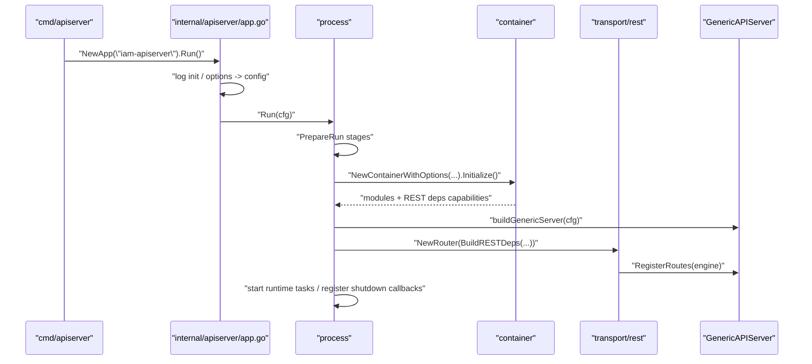
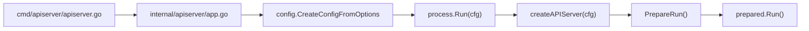
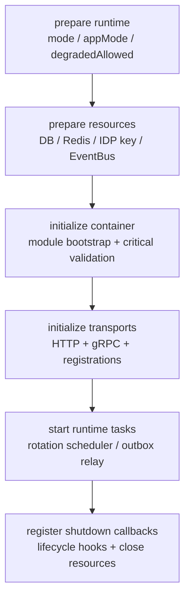
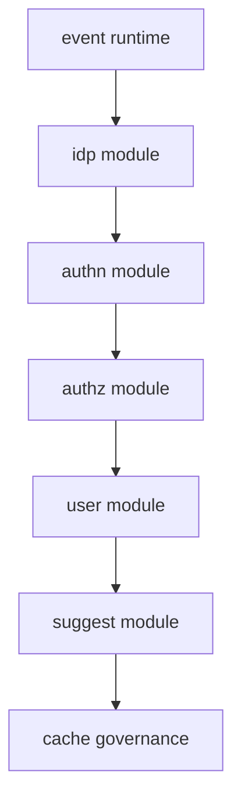
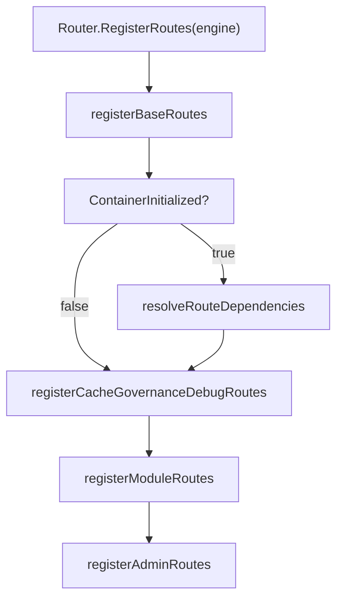

# 服务入口、HTTP 与模块装配

## 本文回答

本文回答：`iam-apiserver` 如何从进程入口进入 `process` 生命周期，如何初始化资源和 container，如何把模块能力投影为 REST deps，并最终注册 HTTP 路由。

## 30 秒结论

- 当前入口链是 `cmd/apiserver -> internal/apiserver/app.go -> process.Run -> PrepareRun -> prepared.Run`。
- `process` 把启动拆成 6 个 stage：runtime、resources、container、transports、runtime tasks、shutdown callbacks。
- `container` 不是请求处理层，而是组合根；它按 bootstrap plan 初始化事件平台、IDP、AuthN、AuthZ、User、Suggest、CacheGovernance。
- REST 注册不是 container 直接写路由，而是 container 先构造 `rest.Deps`，再由 `transport/rest.Router` 统一注册 base、debug、module、admin routes。
- HTTP protected routes 遵循 fail-closed：AuthN TokenService 不可用时，需要身份的 AuthZ、Identity、Suggest 路由不会注册；admin middlewares 不可用时 admin 路由不注册。

## 主图：从入口到 REST 路由



## 重点速查

| 问题 | 当前答案 | 代码证据 |
| ---- | ---- | ---- |
| 进程入口在哪里 | `main()` 创建并运行 `iam-apiserver` app。 | [../../cmd/apiserver/apiserver.go](../../cmd/apiserver/apiserver.go) |
| 配置在哪里进入运行时 | `app.go` 初始化日志、创建 config、调用 `Run(cfg)`。 | [../../internal/apiserver/app.go](../../internal/apiserver/app.go) |
| 生命周期由谁管理 | `process.Run` 创建 server、PrepareRun、再运行 prepared server。 | [../../internal/apiserver/process/run.go](../../internal/apiserver/process/run.go)、[../../internal/apiserver/process/root.go](../../internal/apiserver/process/root.go) |
| stage 顺序在哪里定义 | `newPrepareRunner` 中的 6 个 stage。 | [../../internal/apiserver/process/prepare_runner.go](../../internal/apiserver/process/prepare_runner.go) |
| HTTP server 如何构建 | `buildGenericServer` 从 config 构建 GenericAPIServer。 | [../../internal/apiserver/process/generic_server.go](../../internal/apiserver/process/generic_server.go) |
| REST deps 如何生成 | `Container.BuildRESTDeps` 收集模块 application capabilities 并创建 handlers。 | [../../internal/apiserver/container/rest_deps.go](../../internal/apiserver/container/rest_deps.go) |
| REST 路由如何注册 | `Router.RegisterRoutes` 注册 base、debug、module、admin routes。 | [../../internal/apiserver/transport/rest/router.go](../../internal/apiserver/transport/rest/router.go) |
| 路由矩阵如何防漂移 | transport REST 测试检查关键路由和 OpenAPI 覆盖。 | [../../internal/apiserver/transport/rest/router_matrix_test.go](../../internal/apiserver/transport/rest/router_matrix_test.go) |

## 1. 入口链路



`cmd/apiserver` 是最薄入口，只负责引入 swagger docs 并运行 app。`internal/apiserver/app.go` 承接命令行框架、options、日志和 config 创建。真正的服务生命周期从 [../../internal/apiserver/process/run.go](../../internal/apiserver/process/run.go) 开始。

这层拆分的核心设计意图是让入口不拥有 server 细节，让 process 成为生命周期唯一入口。架构测试也保护 root apiserver package 不重新拿回 process、container 或 transport 的职责。

## 2. PrepareRun Stage Pipeline



| Stage | 主要职责 | 输出 | 代码证据 |
| ---- | ---- | ---- | ---- |
| `prepare runtime` | 推导 server mode、app mode、是否允许降级启动。 | `runtimeOutput` | [../../internal/apiserver/process/runtime_mode.go](../../internal/apiserver/process/runtime_mode.go) |
| `prepare resources` | 初始化 DB/Redis、解析 IDP 加密密钥、创建 EventBus。 | `resourceOutput` | [../../internal/apiserver/process/bootstrap.go](../../internal/apiserver/process/bootstrap.go) |
| `initialize container` | 创建 container、执行 bootstrap plan、验证关键模块。 | `containerOutput` | [../../internal/apiserver/process/bootstrap.go](../../internal/apiserver/process/bootstrap.go)、[../../internal/apiserver/process/server_lifecycle.go](../../internal/apiserver/process/server_lifecycle.go) |
| `initialize transports` | 构建 HTTP/gRPC server，并注册 REST/gRPC。 | `transportOutput` | [../../internal/apiserver/process/bootstrap.go](../../internal/apiserver/process/bootstrap.go) |
| `start runtime tasks` | 启动 key rotation scheduler 和 outbox relay。 | lifecycle hooks | [../../internal/apiserver/process/shutdown_lifecycle.go](../../internal/apiserver/process/shutdown_lifecycle.go) |
| `register shutdown callbacks` | 注册 graceful shutdown sequence。 | shutdown callback | [../../internal/apiserver/process/shutdown_lifecycle.go](../../internal/apiserver/process/shutdown_lifecycle.go) |

### 为什么用 Stage/Pipeline

- **解决的问题**：启动过程包含资源、模块、协议和后台任务，混在一个函数里会让失败点难定位。
- **IAM 的落地**：每个 stage 只读写 `prepareState` 中对应 output，测试通过 [../../internal/apiserver/process/prepare_runner_test.go](../../internal/apiserver/process/prepare_runner_test.go) 锁住 stage 顺序。
- **代价和边界**：stage 适合生命周期编排，不适合塞业务规则；业务规则应在 application/domain 中。

## 3. Container Bootstrap Plan



当前 bootstrap plan 定义在 [../../internal/apiserver/container/bootstrap.go](../../internal/apiserver/container/bootstrap.go)。模块依赖通过 [../../internal/apiserver/container/module_graph.go](../../internal/apiserver/container/module_graph.go) 提供 typed deps：

| 模块 | 主要依赖 | 对外能力 |
| ---- | ---- | ---- |
| Event runtime | event catalog、EventBus、MySQL outbox store。 | event publisher、outbox relay。 |
| IDP | MySQL、Redis、IDP encryption key。 | 微信应用配置、secret vault、token cache。 |
| AuthN | MySQL、Redis、IDP、EventBus、event publisher、Auth/JWKS/SMS options。 | login、token、session、JWKS、account onboarding。 |
| AuthZ | MySQL、outbox stager。 | role/resource/policy/rolebinding、route authorization、snapshot。 |
| User | MySQL、AuthN SessionManager、AuthZ RoleNameReader。 | user/profile/ProfileLink application capabilities。 |
| Suggest | MySQL、suggest options。 | profile suggest service。 |
| CacheGovernance | AuthN/IDP inspectors。 | cache governance read service。 |

### 为什么用 Composition Root

- **解决的问题**：模块依赖如果散在 handler 或 service 中，启动顺序和降级边界会不可审计。
- **IAM 的落地**：container 集中初始化模块，并通过 `ApplicationCapabilities()`、`RuntimeCapabilities()` 暴露能力，不暴露 transport 字段。
- **代价和边界**：container 会保存装配知识，但不能处理请求，也不能承载领域规则；这由 [../../internal/pkg/architecture/architecture_test.go](../../internal/pkg/architecture/architecture_test.go) 保护。

## 4. REST Deps 收集


`BuildRESTDeps` 做的是“能力投影”：

- AuthN module capabilities 转成 `AuthHandler`、`AccountHandler`、`JWKSHandler`、`SessionAdminHandler` 和 `TokenService`。
- AuthZ module capabilities 转成 role/resource/policy/rolebinding/check handlers，以及 `RouteAuthorization` 和 health reporter。
- User module capabilities 转成 user/profile/ProfileLink handlers。
- IDP module capabilities 转成 WeChat app handler。
- Suggest module capabilities 转成 profile suggest service。
- CacheGovernance service 直接给 debug handler 使用。

这个设计让 REST router 不需要知道模块内部如何初始化，也不需要穿透 assembler 字段。对应代码在 [../../internal/apiserver/container/rest_deps.go](../../internal/apiserver/container/rest_deps.go) 和 [../../internal/apiserver/transport/rest/deps.go](../../internal/apiserver/transport/rest/deps.go)。

## 5. REST 注册顺序与路由分层



| 路由层 | 示例 | 注册条件 | 代码证据 |
| ---- | ---- | ---- | ---- |
| Base routes | `/health`、`/ping`、`/debug/routes`、`/debug/modules`、`/openapi`、`/swagger`、`/api/v1/public/info` | 只要 engine 存在。 | [../../internal/apiserver/transport/rest/base_routes.go](../../internal/apiserver/transport/rest/base_routes.go) |
| Cache governance debug | `/debug/cache-governance/catalog` 等 | 非 production 默认启用；production 强制 admin 保护。 | [../../internal/apiserver/transport/rest/debug_routes.go](../../internal/apiserver/transport/rest/debug_routes.go) |
| AuthN | `/api/v1/authn/*`、`/api/v2/authn/login`、JWKS public/admin。 | AuthN handler 存在；admin JWKS 需要 admin middlewares。 | [../../internal/apiserver/transport/rest/authn/router.go](../../internal/apiserver/transport/rest/authn/router.go) |
| AuthZ | `/api/v1/authz/*` | AuthZ handlers 存在且 JWT middleware 存在。 | [../../internal/apiserver/transport/rest/authz/router.go](../../internal/apiserver/transport/rest/authz/router.go) |
| Identity | `/api/v1/identity/*` | User handlers 存在且 JWT middleware 存在。 | [../../internal/apiserver/transport/rest/identity/router.go](../../internal/apiserver/transport/rest/identity/router.go) |
| IDP | `/api/v1/idp/health`、`/api/v1/idp/wechat-apps/*` | health 总是注册；WeChat app 管理需要 handler 和 admin middlewares。 | [../../internal/apiserver/transport/rest/idp/router.go](../../internal/apiserver/transport/rest/idp/router.go) |
| Suggest | `/api/v1/suggest/profile` | Suggest service 和 JWT middleware 都存在。 | [../../internal/apiserver/transport/rest/suggest/handler.go](../../internal/apiserver/transport/rest/suggest/handler.go) |
| Admin | `/api/v1/admin/*` | JWT middleware 存在且支持 role check。 | [../../internal/apiserver/transport/rest/admin_routes.go](../../internal/apiserver/transport/rest/admin_routes.go) |

## 6. Fail-Closed 边界

| 依赖状态 | 当前行为 | 设计原因 |
| ---- | ---- | ---- |
| container 未初始化 | 注册 base routes 和允许的 debug 面，跳过模块路由。 | 保留诊断入口，不暴露半可用业务面。 |
| AuthN TokenService 不存在 | protected routes 不注册。 | 没有权威 token 校验就不能暴露需身份路由。 |
| AuthZ route authorization 不存在 | JWT middleware 可以验证 token，但 admin routes 不注册。 | 管理能力不能在缺少角色判定时放行。 |
| IDP handler 存在但 admin middleware 不存在 | IDP 管理路由不注册，只保留 health。 | 管理面必须有 admin 保护。 |
| Suggest service 不存在 | Suggest 路由不注册。 | 避免把禁用或初始化失败的读侧能力暴露出去。 |

这不是“所有路由都全局挂认证”的模型，而是“每个模块在 registration 阶段根据依赖完整性决定是否暴露”的模型。

## 7. 运行时设计模式

| 模式 | 为什么用 | IAM 中如何落地 | 代价和边界 |
| ---- | ---- | ---- | ---- |
| Stage/Pipeline | 启动步骤多，失败点需要清晰。 | `prepareRunner` 的 6 个 stage。 | 不承载业务规则。 |
| Composition Root | 模块依赖复杂，需要集中装配。 | `container.Initialize()` 和 `moduleGraph`。 | container 不处理请求。 |
| Registry/Registrar | 路由注册属于 transport，能力来自 container。 | `Router.RegisterRoutes` 消费 `rest.Deps`。 | 新增模块要同时维护 deps 和 registration。 |
| Fail Closed | 安全依赖缺失时不能暴露受保护业务面。 | protected routes/admin routes 条件注册。 | 会造成“进程活着但业务路由缺失”，需配合 debug 面排查。 |

## 8. 验证入口

```bash
go test ./internal/apiserver/process ./internal/apiserver/container ./internal/apiserver/transport/rest
make docs-hygiene
```

如要核对 OpenAPI 与实际路由矩阵，重点看 [../../internal/apiserver/transport/rest/router_matrix_test.go](../../internal/apiserver/transport/rest/router_matrix_test.go)。
