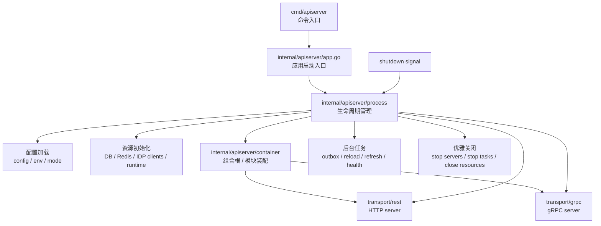
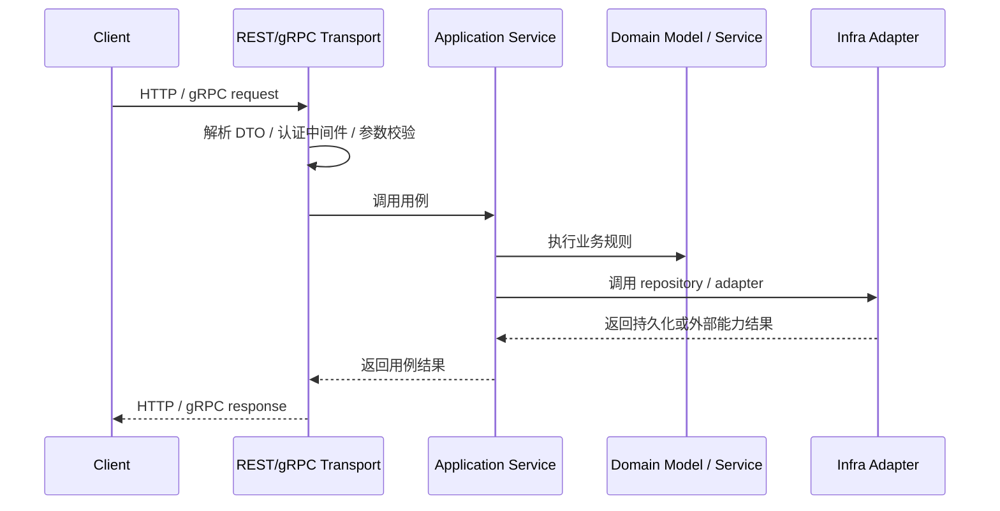

# 服务入口与生命周期

> 状态：设计目标 · 第一版正文，待继续按源码、配置、启动命令和测试核对细节。

---

## 1. 本文回答

本文回答 5 个问题：

- iam-apiserver 从哪里启动？
- `cmd/apiserver`、`app.go`、`process`、`container`、REST/gRPC server 分别负责什么？
- 服务启动、运行、停止的生命周期主线是什么？
- 生命周期层和业务模块层的边界在哪里？
- 修改启动流程时应该检查哪些事实源和测试？

本文只讲运行时入口和进程生命周期，不展开 Identity、AuthN、AuthZ、IDP、Suggest 的业务模型。业务模块模型见 [../02-业务模块](../02-业务模块/README.md)。

---

## 2. 30 秒结论

iam-apiserver 的启动主线是：

```text
cmd/apiserver
  -> internal/apiserver/app.go
  -> internal/apiserver/process
  -> internal/apiserver/container
  -> transport/rest + transport/grpc
  -> shutdown
```

各层职责可以压缩为：

```text
cmd：命令入口，保持 main 足够薄；
app：应用启动入口，承接命令并进入 process；
process：进程生命周期，负责配置、资源、server、后台任务和优雅关闭；
container：组合根，负责依赖和模块装配；
transport：REST/gRPC 协议服务注册和启动；
application/domain/infra：由 container 装配后被 transport 调用，不直接控制进程生命周期。
```

如果只记一句话：

> 运行时层负责“服务怎么启动、怎么装配、怎么运行、怎么退出”，业务模块负责“请求进来后业务怎么判断”。

---

## 3. 启动主线图



这张图表达的是运行时职责，不是业务模块依赖图。

重点边界：

```text
cmd 不直接装配业务模块；
app 不直接写业务逻辑；
process 不直接处理业务请求；
container 不执行业务用例；
transport 不直接访问 repository；
业务模块不控制进程生命周期。
```

---

## 4. 生命周期阶段

iam-apiserver 可以按 5 个阶段理解：

```text
启动入口阶段；
配置与资源阶段；
依赖装配阶段；
服务运行阶段；
优雅关闭阶段。
```

| 阶段 | 主要职责 | 典型代码位置 |
| --- | --- | --- |
| 启动入口 | 进入 apiserver 命令和应用启动逻辑 | `../../cmd/apiserver`、`../../internal/apiserver/app.go` |
| 配置与资源 | 加载配置、初始化数据库/缓存/外部依赖 | `../../internal/apiserver/process` |
| 依赖装配 | 创建 repository、service、adapter、runtime | `../../internal/apiserver/container` |
| 服务运行 | 启动 REST/gRPC server 和后台任务 | `../../internal/apiserver/process`、`../../internal/apiserver/transport` |
| 优雅关闭 | 停止 server、停止后台任务、关闭资源 | `../../internal/apiserver/process` |

---

## 5. 启动入口阶段

### 5.1 cmd/apiserver

`cmd/apiserver` 是命令入口。

它应该负责：

```text
定义 apiserver 可执行入口；
接收命令行参数或启动配置入口；
调用 app 层启动逻辑；
保持 main 函数足够薄。
```

它不应该负责：

```text
创建 repository；
注册 REST/gRPC 路由；
编排业务用例；
访问数据库或 Redis；
写认证、授权、身份关系规则。
```

设计原则：

> `cmd` 只负责把进程拉起来，不负责知道 IAM 的业务怎么运转。

---

### 5.2 internal/apiserver/app.go

`internal/apiserver/app.go` 是应用启动入口。

它应该负责：

```text
承接 cmd 调用；
组织应用启动命令；
进入 process 生命周期；
把启动流程从 main 中剥离出来。
```

它不应该负责：

```text
直接装配所有模块；
直接创建所有 infra adapter；
直接注册每个业务 handler；
直接写业务用例。
```

设计原则：

> `app.go` 是应用入口，不是组合根；组合根属于 `container`。

---

## 6. 配置与资源阶段

配置与资源阶段由 `process` 负责。

它主要回答：

```text
服务以什么模式启动？
使用哪些配置？
需要哪些外部资源？
哪些资源是必须的？
哪些资源允许降级？
启动失败时如何退出？
```

典型资源包括：

```text
数据库连接；
Redis 连接；
JWT/JWK/JWKS key material；
Casbin runtime；
IDP 外部客户端；
Suggest runtime；
后台任务 runner；
REST/gRPC server。
```

边界原则：

```text
process 可以初始化资源，但不应该把资源细节暴露给 transport；
process 可以决定服务能否启动，但不应该写业务判断；
process 可以根据配置决定启停后台任务，但不应该改变领域语义。
```

---

## 7. 依赖装配阶段

依赖装配由 `container` 负责。

`container` 是组合根，它把业务模块和基础设施装配成可运行对象图。

它应该负责：

```text
创建 repository；
创建 infra adapter；
创建 domain service；
创建 application service；
创建 REST/gRPC handler 所需依赖；
装配 AuthN token service；
装配 AuthZ casbin runtime；
装配 IDP external clients；
装配 Suggest runtime；
集中管理跨模块依赖。
```

它不应该负责：

```text
处理 HTTP/gRPC 请求；
执行 Login / Check / SuggestProfile 等业务用例；
在装配阶段写业务数据；
把跨模块调用隐藏成全局变量；
绕过 application 直接串联 infra。
```

设计原则：

> `container` 可以知道所有具体实现，但不能把业务流程藏在装配逻辑里。

---

## 8. 服务运行阶段

服务运行阶段包括 REST server、gRPC server 和后台任务。

### 8.1 REST server

REST server 负责 HTTP 接入。

它应该负责：

```text
注册路由；
挂载 middleware；
解析请求 DTO；
调用 application service；
映射响应 DTO；
映射 HTTP 错误码。
```

它不应该负责：

```text
直接访问 repository；
直接调用数据库；
直接操作 Casbin enforcer；
直接签发 JWT；
直接写领域规则。
```

---

### 8.2 gRPC server

gRPC server 负责服务间 RPC 接入。

它应该负责：

```text
注册 gRPC service；
挂载 interceptor；
解析 proto message；
调用 application service；
映射 response message；
映射 gRPC status。
```

它不应该负责：

```text
直接访问 infra；
直接复用 REST DTO；
直接处理复杂业务编排；
把 proto message 直接传入 domain。
```

---

### 8.3 后台任务

后台任务属于运行时生命周期的一部分。

可能包括：

```text
Outbox dispatcher；
AuthZ runtime reload；
Suggest index refresh；
IDP token refresh；
health check / readiness probe；
metrics / profiling / observability runner。
```

边界原则：

```text
后台任务可以调用 application 或 runtime adapter；
后台任务不应该绕过业务边界直接改领域事实；
后台任务必须受 process 生命周期管理；
shutdown 时后台任务应能停止，避免资源泄漏。
```

---

## 9. 优雅关闭阶段

优雅关闭由 `process` 统一管理。

它应该负责：

```text
监听系统信号；
停止接收新请求；
等待正在处理的请求完成或超时；
停止后台任务；
flush 或终止必要 runtime；
关闭数据库、Redis、外部客户端等资源；
输出关闭日志和错误。
```

关闭顺序建议：

```text
1. 收到 shutdown signal；
2. 标记服务进入 draining；
3. 停止 readiness；
4. 停止接收新请求；
5. 等待 REST/gRPC server 完成 in-flight 请求；
6. 停止后台任务；
7. 关闭 runtime 和外部资源；
8. 退出进程。
```

注意：

```text
优雅关闭不是业务补偿机制；
shutdown 不能保证所有外部事件一定发布完成；
Outbox、重试、幂等应承担跨进程重启后的恢复能力；
长耗时任务必须响应 context cancellation。
```

---

## 10. 请求进入业务模块的主线

运行时启动完成后，请求进入业务模块的主线是：



关键边界：

```text
transport 是协议适配层；
application 是用例编排层；
domain 是业务规则层；
infra 是技术实现层；
process/container 只负责运行时和装配，不参与单次请求业务判断。
```

---

## 11. 生命周期层不负责什么

运行时层不应该吞并业务模块职责。

| 运行时对象 | 不应该负责 |
| --- | --- |
| `cmd` | 业务规则、模块装配、路由注册 |
| `app.go` | 具体模块依赖创建、业务用例执行 |
| `process` | 登录认证、权限判定、ProfileLink 关系规则 |
| `container` | 处理请求、执行用例、写业务数据 |
| REST/gRPC server | 直接访问 repository、直接操作 infra、直接写领域规则 |
| 后台任务 | 绕过 application 修改核心业务事实 |

---

## 12. 常见反模式

| 反模式 | 问题 | 推荐做法 |
| --- | --- | --- |
| `main` 中创建所有 repository 和 service | 启动入口变成组合根，难以测试和维护 | `main` 只进入 app/process，依赖装配放 container |
| `process` 中写登录或授权逻辑 | 生命周期层吞并业务层 | 业务逻辑放 application/domain |
| `container` 装配时执行真实业务流程 | 装配和业务行为混在一起 | container 只创建对象，不跑用例 |
| handler 直接访问 repository | transport 绕过 application | handler 调 application service |
| handler 直接操作 JWT/Casbin/Redis | 协议层污染基础设施细节 | 通过 application 和 port/adapter 调用 |
| 后台任务直接改核心表 | 异步任务绕过用例边界 | 后台任务调用 application 或受控 runtime adapter |
| shutdown 不管理后台任务 | 退出时资源泄漏或数据状态不确定 | 后台任务挂在 process 生命周期下统一停止 |

---

## 13. 和其他运行时文档的关系

| 文档 | 关系 |
| --- | --- |
| [02-组合根与依赖装配.md](02-组合根与依赖装配.md) | 详细说明 container 如何装配模块、repository、adapter、service |
| [03-REST与gRPC传输层装配.md](03-REST与gRPC传输层装配.md) | 详细说明 REST/gRPC server、路由、middleware、interceptor 和 handler 装配 |
| [04-配置加载与运行模式.md](04-配置加载与运行模式.md) | 详细说明配置来源、运行模式、降级开关和配置边界 |
| [05-后台任务与优雅关闭.md](05-后台任务与优雅关闭.md) | 详细说明后台任务、shutdown、context cancellation 和资源关闭 |
| [06-健康检查与降级启动.md](06-健康检查与降级启动.md) | 详细说明 health/readiness/liveness 和依赖降级策略 |

---

## 14. 事实源

本文是运行时入口说明，不是机器契约。

当本文与代码、配置、测试冲突时，按以下优先级判断：

1. 源码与运行时行为。
2. 机器可读配置、OpenAPI、proto、迁移。
3. 测试：架构测试、运行时测试、契约测试。
4. 现行维护中的 `docs/`。
5. `_archive/` 历史材料。

当前主要事实源：

| 事实 | 路径 |
| --- | --- |
| 启动命令 | `../../cmd/apiserver` |
| 应用启动入口 | `../../internal/apiserver/app.go` |
| 生命周期管理 | `../../internal/apiserver/process` |
| 组合根 | `../../internal/apiserver/container` |
| REST transport | `../../internal/apiserver/transport/rest` |
| gRPC transport | `../../internal/apiserver/transport/grpc` |
| Application 层 | `../../internal/apiserver/application` |
| Domain 层 | `../../internal/apiserver/domain` |
| Infra 层 | `../../internal/apiserver/infra` |
| 架构测试 | `../../internal/pkg/architecture` |

---

## 15. Verify

修改本文后至少执行：

```bash
make docs-hygiene
```

涉及分层边界时，再执行：

```bash
go test ./internal/pkg/architecture
```

涉及 REST/gRPC 启动或契约时，再执行：

```bash
make api-validate
make proto-gen
go test ./internal/apiserver/transport/grpc
```

涉及具体启动逻辑时，补充运行时相关测试或本地启动验证：

```bash
go test ./internal/apiserver/...
```

---

## 16. 本文总结

iam-apiserver 的生命周期可以压缩成一条主线：

```text
cmd/apiserver
  -> app.go
  -> process
  -> container
  -> REST/gRPC server + background tasks
  -> graceful shutdown
```

最重要的边界是：

```text
cmd/app 负责进入进程；
process 负责生命周期；
container 负责依赖装配；
transport 负责协议适配；
application/domain/infra 负责业务用例、领域规则和技术实现；
运行时层不应该吞并业务模块职责。
```

维护运行时文档时，必须持续核对源码、配置和架构测试，避免把启动装配、业务用例、基础设施实现混在同一层里。
