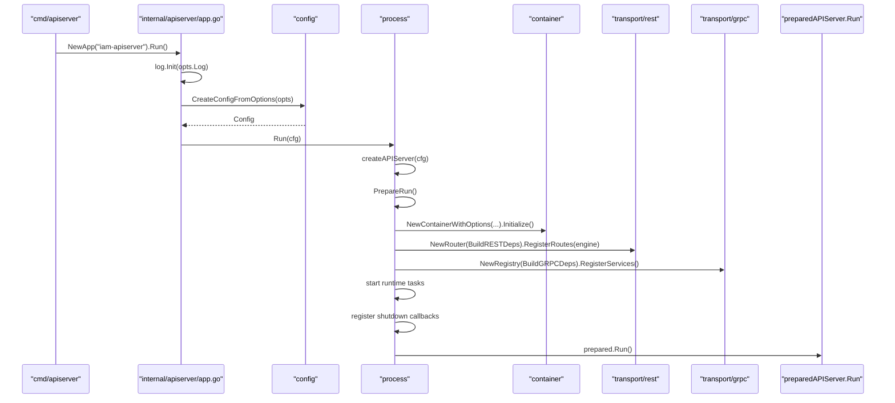
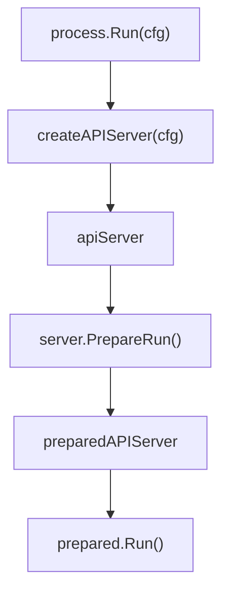
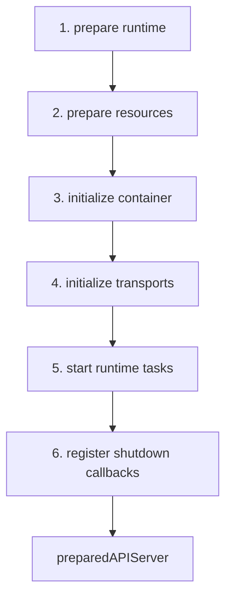
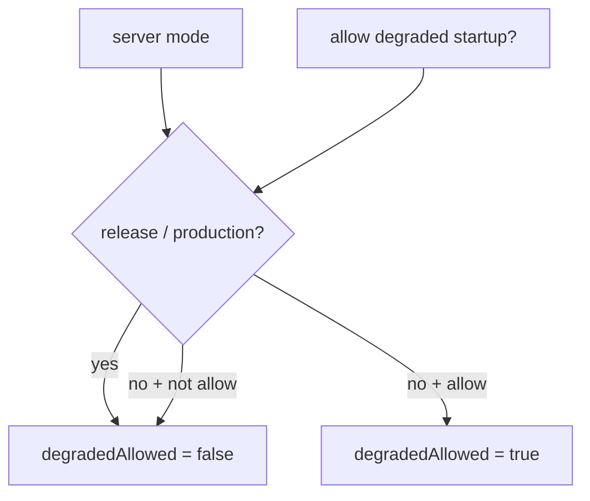
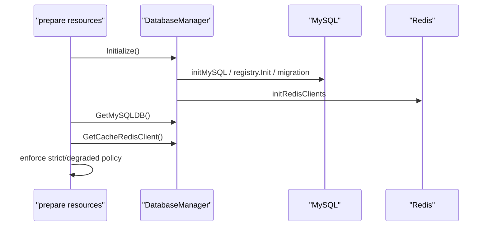
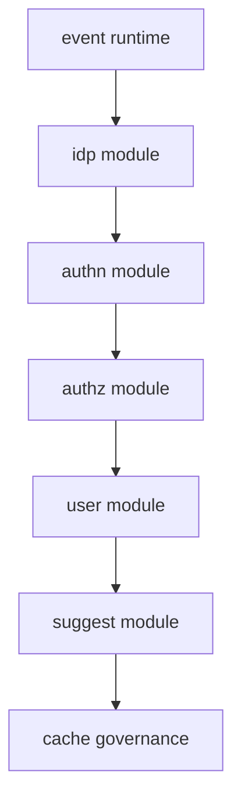
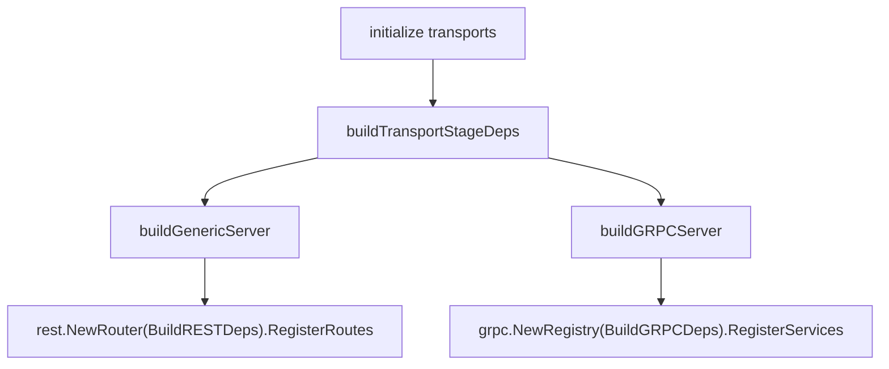
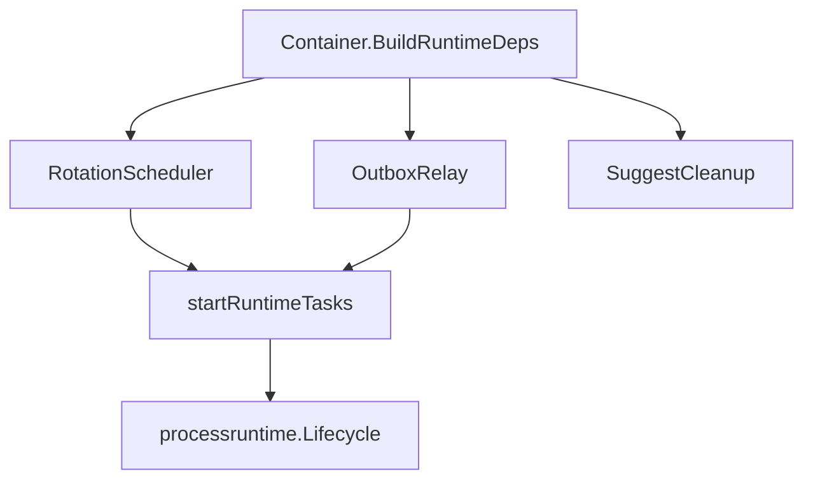
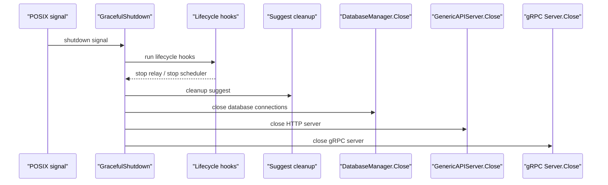
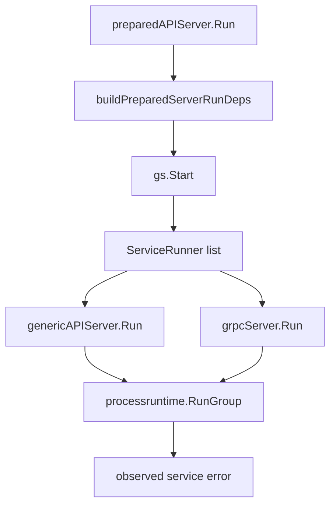

# 服务入口与生命周期装配

## 本文回答

本文回答：`iam-apiserver` 如何从一个很薄的 `main()` 入口，经过 App/options/config、process lifecycle、resource bootstrap、container composition、REST/gRPC transport registration，最终运行成一个同时承载 HTTP、gRPC、后台任务和 graceful shutdown 的服务。

读完本文，你应该能回答：

- 入口层、App 层、process 层各自负责什么；
- 配置如何从 options 转成运行时 config；
- `PrepareRun()` 为什么被拆成多个 stage；
- MySQL、Redis、IDP encryption key、EventBus 如何进入 container；
- container 如何把业务模块能力投影成 REST/gRPC 所需依赖；
- HTTP/gRPC 如何被启动；
- key rotation、outbox relay 等后台任务如何纳入生命周期；
- graceful shutdown 的关闭顺序是什么；
- degraded startup 到底允许什么、不允许什么。

本文只讨论运行时装配，不展开 AuthN、AuthZ、ProfileLink、Outbox 的业务细节。业务链路在专题文档中单独讨论。

---

## 30 秒结论

IAM 的服务启动不是 `main -> router -> handler` 的简单结构，而是：

```text
cmd/apiserver
  -> internal/apiserver/app.go
  -> internal/apiserver/config
  -> internal/apiserver/process
  -> internal/apiserver/container
  -> transport/rest + transport/grpc
  -> preparedAPIServer.Run()
```

其中：

- `cmd/apiserver` 是最薄进程入口，只创建并运行 App。
- `app.go` 接入命令行 App 框架，完成日志初始化、options/config 创建，然后调用 `Run(cfg)`。
- 根 `internal/apiserver/run.go` 只做一件事：把运行权委托给 `internal/apiserver/process.Run`。
- `process` 是生命周期编排层，负责 runtime、resources、container、transports、runtime tasks、shutdown callbacks。
- `container` 是组合根，负责装配 AuthN、AuthZ、User、IDP、Suggest、CacheGovernance、Eventing/Outbox。
- `transport/rest` 和 `transport/grpc` 是协议适配层，只消费 container 投影出来的 deps/registration，不直接拥有模块初始化逻辑。
- `preparedAPIServer.Run()` 先启动 graceful shutdown manager，再把 HTTP 和 gRPC 作为服务组运行。

核心源码入口：

- [../../cmd/apiserver/apiserver.go](../../cmd/apiserver/apiserver.go)
- [../../internal/apiserver/app.go](../../internal/apiserver/app.go)
- [../../internal/apiserver/run.go](../../internal/apiserver/run.go)
- [../../internal/apiserver/process/run.go](../../internal/apiserver/process/run.go)
- [../../internal/apiserver/process/prepare_runner.go](../../internal/apiserver/process/prepare_runner.go)
- [../../internal/apiserver/process/bootstrap.go](../../internal/apiserver/process/bootstrap.go)
- [../../internal/apiserver/process/run_group.go](../../internal/apiserver/process/run_group.go)

---

## 主图：入口到运行



---

## 重点速查

| 问题 | 当前答案 | 代码证据 |
| --- | --- | --- |
| 进程入口在哪里 | `main()` 调用 `apiserver.NewApp("iam-apiserver").Run()`。 | [../../cmd/apiserver/apiserver.go](../../cmd/apiserver/apiserver.go) |
| options 在哪里创建 | `NewApp` 中创建 `options.NewOptions()` 并挂到 App。 | [../../internal/apiserver/app.go](../../internal/apiserver/app.go) |
| config 在哪里生成 | `CreateConfigFromOptions(opts)` 调用 `ApplyDefaults()` 后返回 `Config`。 | [../../internal/apiserver/config/config.go](../../internal/apiserver/config/config.go) |
| 根 `Run` 做什么 | 只委托给 `process.Run`。 | [../../internal/apiserver/run.go](../../internal/apiserver/run.go) |
| lifecycle 从哪里开始 | `process.Run` 创建 server，执行 `PrepareRun()`，再 `prepared.Run()`。 | [../../internal/apiserver/process/run.go](../../internal/apiserver/process/run.go) |
| server 持有哪些运行时对象 | cfg、GracefulShutdown、GenericAPIServer、gRPC Server、DatabaseManager、Container。 | [../../internal/apiserver/process/root.go](../../internal/apiserver/process/root.go) |
| stage 顺序在哪里定义 | `newPrepareRunner` 定义 6 个 stage。 | [../../internal/apiserver/process/prepare_runner.go](../../internal/apiserver/process/prepare_runner.go) |
| HTTP server 如何构建 | `buildGenericServer` 根据 server/secure/insecure options 构建 GenericAPIServer。 | [../../internal/apiserver/process/generic_server.go](../../internal/apiserver/process/generic_server.go) |
| gRPC server 如何构建 | `buildGRPCServer` 应用 bind、mTLS、Auth、ACL、Audit 等选项。 | [../../internal/apiserver/process/grpc_config.go](../../internal/apiserver/process/grpc_config.go) |
| 后台任务在哪里启动 | `runtimeTaskStage` 调用 `startRuntimeTasks`。 | [../../internal/apiserver/process/shutdown_lifecycle.go](../../internal/apiserver/process/shutdown_lifecycle.go) |
| shutdown 顺序在哪里定义 | lifecycle hooks -> suggest cleanup -> DB close -> HTTP close -> gRPC close。 | [../../internal/apiserver/process/shutdown_lifecycle.go](../../internal/apiserver/process/shutdown_lifecycle.go) |

---

## 1. 入口层：main 必须保持很薄

入口文件是：

```text
cmd/apiserver/apiserver.go
```

它只做两件事：

1. 引入 swagger docs。
2. 调用 `apiserver.NewApp("iam-apiserver").Run()`。

```go
func main() {
    apiserver.NewApp("iam-apiserver").Run()
}
```

这个设计看起来简单，但边界很重要：`main` 不解析配置，不初始化数据库，不创建 router，不知道 container，也不处理 shutdown。它只负责把进程控制权交给 App。

如果入口层开始直接拼 server、router、database、module，后续启动链路会很快失控。IAM 当前把入口保持为薄层，是为了让生命周期集中在 `process` 包中。

---

## 2. App 层：接入命令行框架与配置创建

`internal/apiserver/app.go` 负责创建 App：

```text
NewApp(basename string) *app.App
```

它创建 `options.NewOptions()`，把 options 挂到 App，并设置 run function。

真正运行时，`run(opts)` 会做四件事：

1. 初始化日志；
2. 打印 server mode 和 health check 状态；
3. 调用 `config.CreateConfigFromOptions(opts)`；
4. 调用 `Run(cfg)`。

```text
options -> config -> Run(cfg)
```

`CreateConfigFromOptions` 的逻辑很轻：如果 opts 为空就创建默认 options，然后调用 `ApplyDefaults()`，最后返回 `Config{Options: opts}`。


### App 层不应该做什么

App 层不应该：

- 创建数据库连接；
- 组装业务模块；
- 注册 REST/gRPC 路由；
- 启动后台任务；
- 管理 graceful shutdown。

这些都属于 `process` 的职责。

核心源码：

- [../../internal/apiserver/app.go](../../internal/apiserver/app.go)
- [../../internal/apiserver/options/options.go](../../internal/apiserver/options/options.go)
- [../../internal/apiserver/config/config.go](../../internal/apiserver/config/config.go)

---

## 3. 根 Run：只做委托，不拿回生命周期职责

根包中的 `Run` 非常薄：

```go
var runProcess = serverprocess.Run

func Run(cfg *config.Config) error {
    return runProcess(cfg)
}
```

这层存在的价值不是“多写一层包装”，而是维持包边界：

```text
internal/apiserver
  只暴露 App 和 Run

internal/apiserver/process
  真正拥有生命周期
```

这样 root apiserver package 不需要知道 container、transport、process runtime、RunGroup 等细节。项目中的架构测试也限制 root apiserver package 不能重新导入 container/transport/interface/processruntime 等启动细节。

核心源码：

- [../../internal/apiserver/run.go](../../internal/apiserver/run.go)
- [../../internal/pkg/architecture/architecture_test.go](../../internal/pkg/architecture/architecture_test.go)

---

## 4. process：生命周期的唯一拥有者

`process.Run` 是服务生命周期的真正入口：

```text
Run(cfg)
  -> createAPIServer(cfg)
  -> server.PrepareRun()
  -> prepared.Run()
```

`apiServer` 持有完整运行时对象：

| 字段 | 含义 |
| --- | --- |
| `cfg` | 运行配置 |
| `gs` | graceful shutdown manager |
| `genericAPIServer` | HTTP GenericAPIServer |
| `grpcServer` | gRPC Server |
| `dbManager` | 数据库与 Redis 生命周期管理 |
| `container` | 业务模块组合根 |

`createAPIServer(cfg)` 做的事情很克制：

1. 创建 `GracefulShutdown`；
2. 注册 POSIX signal shutdown manager；
3. 创建 `DatabaseManager`；
4. 组装 `apiServer` 对象。

此时还没有真正初始化 DB、Redis、container 或 transport。这些在 `PrepareRun()` 阶段完成。



核心源码：

- [../../internal/apiserver/process/run.go](../../internal/apiserver/process/run.go)
- [../../internal/apiserver/process/root.go](../../internal/apiserver/process/root.go)

---

## 5. PrepareRun：启动前的 Stage Pipeline

`PrepareRun()` 不直接写一坨启动逻辑，而是交给 `prepareRunner`。当前 runner 包含 6 个 stage：

```text
prepare runtime
prepare resources
initialize container
initialize transports
start runtime tasks
register shutdown callbacks
```



| Stage | 输入 | 输出 | 职责 |
| --- | --- | --- | --- |
| `prepare runtime` | config | `runtimeOutput` | 推导 server mode、app mode、是否允许 degraded startup |
| `prepare resources` | runtimeOutput | `resourceOutput` | 初始化 DB/Redis，解析 IDP key，创建 EventBus |
| `initialize container` | runtimeOutput + resourceOutput | `containerOutput` | 创建并初始化 container，校验关键模块 |
| `initialize transports` | runtimeOutput + containerOutput | `transportOutput` | 构建 HTTP/gRPC server，注册 REST/gRPC |
| `start runtime tasks` | prepareState | lifecycle hooks | 启动 key rotation scheduler、outbox relay |
| `register shutdown callbacks` | lifecycle | shutdown callback | 注册 graceful shutdown sequence |

### 为什么用 Stage Pipeline

这是 IAM 当前运行时设计的关键点。

启动过程涉及：

- 配置推导；
- 数据库和缓存；
- 事件总线；
- 加密密钥；
- 模块装配；
- HTTP/gRPC；
- 后台任务；
- 关闭顺序。

如果这些逻辑全部堆在一个 `Run()` 函数里，启动失败时很难定位到底是资源问题、模块问题、transport 问题，还是后台任务问题。

Stage pipeline 的价值是：

- 每一步职责清晰；
- 每一步输出明确；
- 出错位置可定位；
- 单元测试可以锁住 stage 顺序和失败边界；
- `process` 层不会侵入业务规则。

核心源码：

- [../../internal/apiserver/process/prepare_runner.go](../../internal/apiserver/process/prepare_runner.go)

---

## 6. Stage 1：prepare runtime

`prepareRuntime()` 从配置中推导三个运行时值：

| 字段 | 含义 |
| --- | --- |
| `mode` | 原始 server mode，例如 release、production、test、debug 等 |
| `appMode` | 映射后的应用模式：production、test、development |
| `degradedAllowed` | 是否允许降级启动 |

降级启动的规则是：

```text
GenericServerRunOptions.AllowDegradedStartup == true
并且 mode 不是 release / production
```

也就是说，即使显式开启 degraded startup，只要当前模式是 `release` 或 `production`，也不会允许关键资源或关键模块缺失。



这个设计很合理：开发或诊断环境可以容忍半初始化，用于查看 debug/health 信息；生产环境不允许在关键能力缺失时继续暴露服务。

核心源码：

- [../../internal/apiserver/process/runtime_mode.go](../../internal/apiserver/process/runtime_mode.go)

---

## 7. Stage 2：prepare resources

`prepareResources()` 负责把外部资源转成 container 可消费的运行时资源：

| 资源 | 来源 | 失败处理 |
| --- | --- | --- |
| MySQL | `DatabaseManager` | 非 degraded：失败退出；degraded：置为 nil 并记录 warning |
| Redis cache client | `DatabaseManager` | 非 degraded：失败退出；degraded：置为 nil 并记录 warning |
| IDP encryption key | `idp.encryption-key` | 非 degraded：缺失或非法失败退出；degraded：记录 warning |
| EventBus | NSQ options | 创建失败只记录 warning，EventBus 置 nil |

### 7.1 DatabaseManager 的边界

`DatabaseManager.Initialize()` 会尝试初始化 MySQL、Redis，并根据 migration options 执行数据库迁移。

需要注意一个细节：  
MySQL/Redis 初始化失败时，`DatabaseManager.Initialize()` 内部会记录 warning，并不一定立即返回错误；随后 `prepareResources()` 会通过 `GetMySQLDB()`、`GetCacheRedisClient()` 再次确认是否真的拿到了可用 client，并根据 degraded 策略决定是失败退出还是降级置空。

这个拆法让数据库管理器负责“连接和注册”，让 process 负责“启动策略判断”。



### 7.2 IDP encryption key

IDP encryption key 用于 IDP 模块的密钥加解密，例如微信 AppSecret。解析函数支持：

- base64；
- raw base64；
- base64 url；
- raw base64 url；
- hex；
- 32 字节纯字符串。

最终结果必须是 32 字节，用于 AES-256。非 degraded 模式下，缺失或非法都会导致启动失败。

### 7.3 EventBus

EventBus 当前基于 NSQ options 创建。若 NSQ 未启用，`createEventBus()` 返回 nil；若创建失败，`prepareResources()` 记录 warning 并继续。

这说明 EventBus 是可选资源。它不可用时，业务事实仍可以写入数据库；但依赖消息投递的 outbox relay 不会完整启动。

核心源码：

- [../../internal/apiserver/process/bootstrap.go](../../internal/apiserver/process/bootstrap.go)
- [../../internal/apiserver/process/database.go](../../internal/apiserver/process/database.go)
- [../../internal/apiserver/process/idp_key.go](../../internal/apiserver/process/idp_key.go)
- [../../internal/apiserver/process/event_bus.go](../../internal/apiserver/process/event_bus.go)

---

## 8. Stage 3：initialize container

资源准备完成后，process 创建 container：

```text
container.NewContainerWithOptions(
    mysqlDB,
    cacheClient,
    eventBus,
    idpEncryptionKey,
    RuntimeOptionsFromAPIServerOptions(...)
)
```

container 初始化做两件事：

1. 执行业务模块 bootstrap plan；
2. 校验关键模块是否可用。

bootstrap plan 当前顺序是：

```text
event runtime
  -> idp module
  -> authn module
  -> authz module
  -> user module
  -> suggest module
  -> cache governance
```



### 为什么这个顺序成立

这个顺序由模块依赖决定：

| 模块 | 依赖 |
| --- | --- |
| IDP | MySQL、Redis、IDP encryption key |
| AuthN | MySQL、Redis、IDP module、EventBus/EventPublisher、Auth/JWKS/SMS options |
| AuthZ | MySQL、outbox store |
| User | MySQL、AuthN SessionManager、AuthZ RoleNameReader |
| Suggest | MySQL、Suggest options |
| CacheGovernance | AuthN/IDP 暴露的 cache inspectors |

`module_graph.go` 把这些依赖显式化为 typed deps，避免用 `interface{}` 或全局变量隐式传递依赖。

### 关键模块校验

container 初始化后，process 会调用 `validateCriticalModules(degradedAllowed)`。

当前关键模块包括：

```text
idp
authn
authz
user
```

如果这些模块缺失：

- 非 degraded：启动失败；
- degraded：记录 warning，继续启动，用于诊断。

核心源码：

- [../../internal/apiserver/process/bootstrap.go](../../internal/apiserver/process/bootstrap.go)
- [../../internal/apiserver/process/server_lifecycle.go](../../internal/apiserver/process/server_lifecycle.go)
- [../../internal/apiserver/container/container.go](../../internal/apiserver/container/container.go)
- [../../internal/apiserver/container/bootstrap.go](../../internal/apiserver/container/bootstrap.go)
- [../../internal/apiserver/container/module_graph.go](../../internal/apiserver/container/module_graph.go)
- [../../internal/apiserver/container/runtime_deps.go](../../internal/apiserver/container/runtime_deps.go)

---

## 9. Stage 4：initialize transports

container 初始化完成后，process 开始初始化 transport：

```text
build HTTP server
build gRPC server
register REST routes
register gRPC services
```

这一步由 `prepareTransports()` 和 `bootstrapTransports()` 完成。



### 9.1 HTTP server 构建

HTTP server 由 `buildGenericServer(cfg)` 构建。

它会把以下配置应用到 `GenericAPIServer`：

- generic server run options；
- secure serving options；
- insecure serving options。

`GenericAPIServer` 本身负责：

- 安装基础中间件；
- 安装通用 API，例如 `/healthz`、`/version`；
- 根据配置启动 HTTP 与 HTTPS；
- `Close()` 时 shutdown secure/insecure server。

REST 业务路由不在 GenericAPIServer 内部直接写死，而是在 process 阶段调用：

```text
resttransport.NewRouter(container.BuildRESTDeps(...)).RegisterRoutes(httpServer.Engine)
```

这保证了 HTTP server 和 REST 模块路由是两层职责：

```text
GenericAPIServer: HTTP 基础设施
transport/rest: IAM REST API 注册
```

核心源码：

- [../../internal/apiserver/process/generic_server.go](../../internal/apiserver/process/generic_server.go)
- [../../internal/pkg/server/genericapiserver.go](../../internal/pkg/server/genericapiserver.go)
- [../../internal/apiserver/container/rest_deps.go](../../internal/apiserver/container/rest_deps.go)
- [../../internal/apiserver/transport/rest/router.go](../../internal/apiserver/transport/rest/router.go)

### 9.2 REST deps 投影

container 不直接注册路由，而是先把模块能力投影为 `rest.Deps`。

例如：

- AuthN capabilities 转成 AuthHandler、AccountHandler、JWKSHandler、SessionAdminHandler、TokenService；
- AuthZ capabilities 转成 RoleHandler、PolicyHandler、CheckHandler、RouteAuthorization 等；
- User capabilities 转成 UserHandler、ProfileHandler、ProfileLinkHandler；
- IDP capabilities 转成 WechatAppHandler；
- Suggest capabilities 转成 Suggest service；
- CacheGovernance service 转成 debug governance handler 的依赖。

这一步的核心目的是：REST router 不穿透 container 内部模块字段，只消费明确的 transport deps。

核心源码：

- [../../internal/apiserver/container/rest_deps.go](../../internal/apiserver/container/rest_deps.go)
- [../../internal/apiserver/transport/rest/router.go](../../internal/apiserver/transport/rest/router.go)
- [../../internal/apiserver/transport/rest/module_routes.go](../../internal/apiserver/transport/rest/module_routes.go)

### 9.3 gRPC server 构建

gRPC server 由 `buildGRPCServer(cfg)` 构建。它会把配置应用到 `grpc.Config`：

- bind address / bind port / healthz port；
- mTLS；
- 应用层认证；
- ACL；
- audit；
- secure serving 中的 TLS cert/key fallback；
- insecure 模式判断。

`internal/pkg/grpc.Server` 创建时会组装 unary/stream interceptors，包括 recovery、request id、logging、mTLS identity、credential、ACL、audit 等。

业务服务注册仍然不在 process 中直接完成，而是：

```text
grpctransport.NewRegistry(container.BuildGRPCDeps(grpcServer)).RegisterServices()
```

container 负责根据已初始化模块生成 `Registration` 列表；gRPC transport registry 负责真正调用注册函数。

核心源码：

- [../../internal/apiserver/process/grpc_config.go](../../internal/apiserver/process/grpc_config.go)
- [../../internal/pkg/grpc/server.go](../../internal/pkg/grpc/server.go)
- [../../internal/apiserver/container/grpc_registry.go](../../internal/apiserver/container/grpc_registry.go)
- [../../internal/apiserver/transport/grpc/registry.go](../../internal/apiserver/transport/grpc/registry.go)

---

## 10. Stage 5：start runtime tasks

transport 注册完成后，process 启动后台运行时任务。

后台任务依赖不是直接从模块字段读取，而是通过：

```text
Container.BuildRuntimeDeps()
```

当前 runtime deps 包括：

| Runtime dep | 来源 | process 行为 |
| --- | --- | --- |
| `RotationScheduler` | AuthN module runtime capabilities | 后台启动 key rotation scheduler；shutdown hook 中停止 |
| `OutboxRelay` | container eventing/outbox 初始化结果 | 后台循环 dispatch due events；shutdown hook cancel context |
| `SuggestCleanup` | Suggest module runtime capabilities | shutdown sequence 中 cleanup |



### 10.1 Key rotation scheduler

如果 AuthN 模块暴露了 `RotationScheduler`，process 会在 goroutine 中启动：

```text
scheduler.Start(context.Background())
```

同时注册 shutdown hook：

```text
stop key rotation scheduler
```

process 只负责启动和停止，不决定密钥轮换策略，也不处理 JWKS 业务规则。

### 10.2 Outbox relay

如果 container 暴露了 `OutboxRelay`，process 会：

1. 创建可取消 context；
2. 注册 shutdown hook 用于 cancel；
3. 启动 `runOutboxRelay(ctx, relay)`；
4. 按 `events.outbox_relay_interval` 周期调用 `DispatchDue(ctx)`。

interval 小于等于 0 时默认使用 2 秒。

relay dispatch 失败只记录 warning，不直接终止进程。这是因为 outbox relay 是最终一致投递机制，不应因为某次消息投递失败导致整个 API server 停止。

核心源码：

- [../../internal/apiserver/container/runtime_deps.go](../../internal/apiserver/container/runtime_deps.go)
- [../../internal/apiserver/process/shutdown_lifecycle.go](../../internal/apiserver/process/shutdown_lifecycle.go)

---

## 11. Stage 6：register shutdown callbacks

最后一个 stage 注册 graceful shutdown callback。

IAM 在 `createAPIServer` 时已经创建了 `GracefulShutdown`，并注册 POSIX signal manager。  
在 `registerShutdownCallbacks` 中，process 把完整关闭序列挂到 shutdown manager 上。

关闭顺序是：

```text
lifecycle hooks
  -> cleanup suggest module
  -> close database connections
  -> close HTTP server
  -> close gRPC server
```



### gRPC Close 的额外语义

gRPC server 的 `Close()` 不只是 `Stop()`：

1. 将整体服务和已注册服务标记为 `NOT_SERVING`；
2. 关闭独立 HTTP healthz server；
3. 调用 `GracefulStop()`；
4. 超时后强制 `Stop()`；
5. 停止 mTLS 证书自动重载。

### HTTP Close 的语义

HTTP GenericAPIServer 的 `Close()` 会分别 shutdown secure server 和 insecure server，并设置 10 秒 timeout。

核心源码：

- [../../internal/apiserver/process/shutdown_lifecycle.go](../../internal/apiserver/process/shutdown_lifecycle.go)
- [../../internal/pkg/server/genericapiserver.go](../../internal/pkg/server/genericapiserver.go)
- [../../internal/pkg/grpc/server.go](../../internal/pkg/grpc/server.go)

---

## 12. preparedAPIServer.Run：真正启动服务

`PrepareRun()` 完成后，返回 `preparedAPIServer`。真正开始阻塞运行的是：

```text
preparedAPIServer.Run()
```

它内部会：

1. 构建 run deps；
2. 启动 graceful shutdown manager；
3. 启动 HTTP 和 gRPC；
4. 使用 RunGroup 管理服务组；
5. 观察服务错误并返回。



`runPreparedServerTransports` 会构造两个 service runner：

```text
http
grpc
```

如果某个 server 为 nil，则对应 runner 不参与运行。若两个都不存在，则直接返回 nil。  
如果服务运行过程中返回错误，当前实现会先观察错误，再释放 run group，避免短生命周期服务错误被随机 done 分支吞掉。

核心源码：

- [../../internal/apiserver/process/run_group.go](../../internal/apiserver/process/run_group.go)

---

## 13. 降级启动边界

IAM 的 degraded startup 不是“所有错误都忽略”，而是有清晰边界。

| 失败点 | 非 degraded | degraded allowed | 说明 |
| --- | --- | --- | --- |
| `DatabaseManager.Initialize()` 因 migration 等返回错误 | 启动失败 | 记录 warning 后继续 | migration 失败本身会从 Initialize 返回错误 |
| 获取 MySQL client 失败 | 启动失败 | `mysqlDB = nil`，继续 | 后续依赖 MySQL 的模块可能初始化失败 |
| 获取 Redis client 失败 | 启动失败 | `cacheClient = nil`，继续 | AuthN/IDP 通常会受影响 |
| IDP encryption key 缺失 | 启动失败 | 记录 warning，继续 | IDP 模块很可能初始化失败 |
| IDP encryption key 非法 | 启动失败 | 记录 warning，继续 | 必须是 32 字节 |
| EventBus 创建失败 | 记录 warning，继续 | 记录 warning，继续 | EventBus 是可选外部消息资源 |
| container 初始化失败 | 启动失败 | 记录 warning，继续 | 但仍会校验关键模块 |
| 关键模块缺失 | 启动失败 | 记录 warning，继续 | 关键模块包括 idp/authn/authz/user |
| HTTP/gRPC server 构建失败 | 启动失败 | 启动失败 | transport 构建错误不是业务模块降级 |
| gRPC service registration 失败 | 启动失败 | 启动失败 | registration 错误表示协议面装配失败 |

核心源码：

- [../../internal/apiserver/process/runtime_mode.go](../../internal/apiserver/process/runtime_mode.go)
- [../../internal/apiserver/process/bootstrap.go](../../internal/apiserver/process/bootstrap.go)
- [../../internal/apiserver/process/server_lifecycle.go](../../internal/apiserver/process/server_lifecycle.go)

### 降级启动不等于业务可用

降级启动只表示进程可以为了诊断继续启动。它不承诺业务 API 可用。

例如：

- AuthN 初始化失败时，TokenService 不存在；
- REST protected routes 不会注册；
- AuthZ/Identity/Suggest 依赖 JWT middleware，也会因为 AuthN 不可用而无法暴露；
- EventBus 不可用时，outbox relay 不启动，但 outbox store 仍可能保留 pending 事件。

因此排查 degraded startup 时，应同时查看：

- `/healthz`
- `/debug/modules`
- `/debug/routes`
- 启动日志中的 degraded warning

---

## 14. 运行时设计原则

| 原则 | 为什么重要 | IAM 落地 |
| --- | --- | --- |
| 入口保持薄 | 防止 main 变成上帝函数 | `cmd/apiserver` 只调用 `NewApp(...).Run()` |
| 生命周期集中在 process | 启动、后台任务、关闭顺序必须集中管理 | `process.Run`、`PrepareRun`、`prepared.Run` |
| 资源先于模块 | 模块初始化依赖 DB/Redis/EventBus/key | `prepareResources` 在 `prepareContainer` 之前 |
| container 只做组合根 | 防止请求处理和业务规则进入装配层 | container 暴露 REST/gRPC/runtime deps |
| transport 只做协议适配 | 防止 REST/gRPC 直接依赖模块内部结构 | REST consume `rest.Deps`，gRPC consume `Registration` |
| fail closed | 安全依赖缺失时不能暴露受保护路由 | TokenService/JWT middleware 缺失时 protected routes 不注册 |
| 后台任务纳入生命周期 | scheduler/relay 不能游离于 shutdown 外 | `BuildRuntimeDeps` + lifecycle hooks |
| shutdown 有序 | 防止任务、DB、HTTP/gRPC 随机关闭 | lifecycle -> suggest -> DB -> HTTP -> gRPC |

---

## 15. 常见误区

### 误区一：`container` 是业务服务层

不是。container 是组合根，不处理请求，不写业务规则。  
业务规则在 domain，业务用例在 application，请求适配在 transport。

### 误区二：`process` 是普通 server 包

不是。process 是生命周期编排层。  
它关心的是启动顺序、资源准备、模块初始化、transport 装配、后台任务和 shutdown。

### 误区三：HTTP 路由是启动成功就全部注册

不是。REST router 会根据 module status、TokenService、JWT middleware、admin middleware 判断是否注册对应路由。  
受保护路由遵循 fail-closed。

### 误区四：EventBus 不可用就不能写授权事实

不准确。EventBus 不可用时 relay 不启动，事件保留在 outbox 中；业务事实和 outbox 记录仍可以在 MySQL 事务中提交。  
这取决于 MySQL/outbox store 是否可用。

### 误区五：degraded startup 是生产容错

不是。production/release 模式不允许 degraded startup。  
degraded startup 更适合开发、诊断、非生产环境。

---

## 16. 推荐源码阅读路线

第一次读运行时，按这个顺序：

### 第一轮：入口与配置

```text
cmd/apiserver/apiserver.go
internal/apiserver/app.go
internal/apiserver/options/options.go
internal/apiserver/config/config.go
internal/apiserver/run.go
```

目标：看清 options/config 如何进入 `Run(cfg)`。

### 第二轮：process 生命周期

```text
internal/apiserver/process/run.go
internal/apiserver/process/root.go
internal/apiserver/process/prepare_runner.go
internal/apiserver/process/bootstrap.go
internal/apiserver/process/runtime_mode.go
```

目标：看清 6 个 stage 和 degraded startup。

### 第三轮：资源与 container

```text
internal/apiserver/process/database.go
internal/apiserver/process/idp_key.go
internal/apiserver/process/event_bus.go
internal/apiserver/container/container.go
internal/apiserver/container/bootstrap.go
internal/apiserver/container/module_graph.go
```

目标：看清资源如何进入模块装配。

### 第四轮：transport 装配

```text
internal/apiserver/process/generic_server.go
internal/apiserver/process/grpc_config.go
internal/apiserver/container/rest_deps.go
internal/apiserver/container/grpc_registry.go
internal/apiserver/transport/rest/router.go
internal/apiserver/transport/grpc/registry.go
```

目标：看清 HTTP/gRPC 如何被创建和注册。

### 第五轮：后台任务与关闭

```text
internal/apiserver/container/runtime_deps.go
internal/apiserver/process/shutdown_lifecycle.go
internal/apiserver/process/run_group.go
internal/pkg/server/genericapiserver.go
internal/pkg/grpc/server.go
```

目标：看清 scheduler、relay、HTTP/gRPC shutdown 和 RunGroup。

---

## 17. 验证建议

```bash
go test ./internal/apiserver/process \
  ./internal/apiserver/container \
  ./internal/apiserver/transport/rest \
  ./internal/apiserver/transport/grpc \
  ./internal/pkg/architecture

make docs-hygiene
```

重点测试入口：

- [../../internal/apiserver/process/bootstrap_test.go](../../internal/apiserver/process/bootstrap_test.go)
- [../../internal/apiserver/process/shutdown_lifecycle_test.go](../../internal/apiserver/process/shutdown_lifecycle_test.go)
- [../../internal/apiserver/process/run_group_test.go](../../internal/apiserver/process/run_group_test.go)
- [../../internal/apiserver/container/eventing_test.go](../../internal/apiserver/container/eventing_test.go)
- [../../internal/apiserver/transport/rest/router_matrix_test.go](../../internal/apiserver/transport/rest/router_matrix_test.go)
- [../../internal/pkg/architecture/architecture_test.go](../../internal/pkg/architecture/architecture_test.go)

---

## 本文总结

IAM 的运行时装配可以压缩成一句话：

> `main` 只交出控制权，`app` 接入 options/config，`process` 编排生命周期，`container` 装配业务模块，`transport` 注册协议入口，`preparedAPIServer.Run` 运行 HTTP/gRPC 并接入 graceful shutdown。

这篇文档的重点不是“有哪些接口”，而是理解服务如何安全、可测试、可降级、可关闭地启动起来。后续阅读 AuthN、AuthZ、ProfileLink、Outbox 文档时，都应该先把这个生命周期模型放在脑子里。
