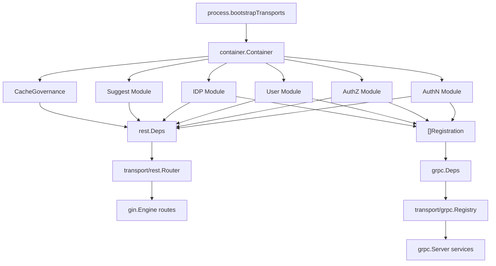
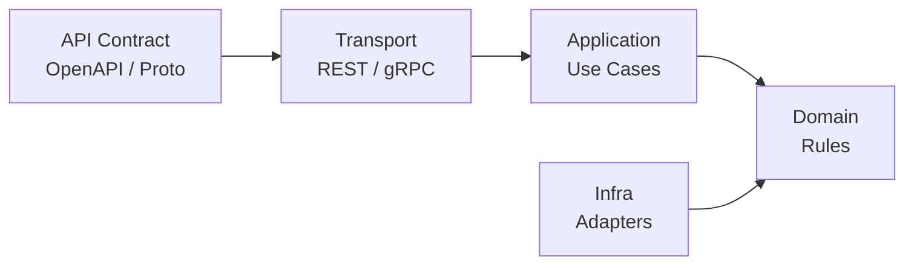
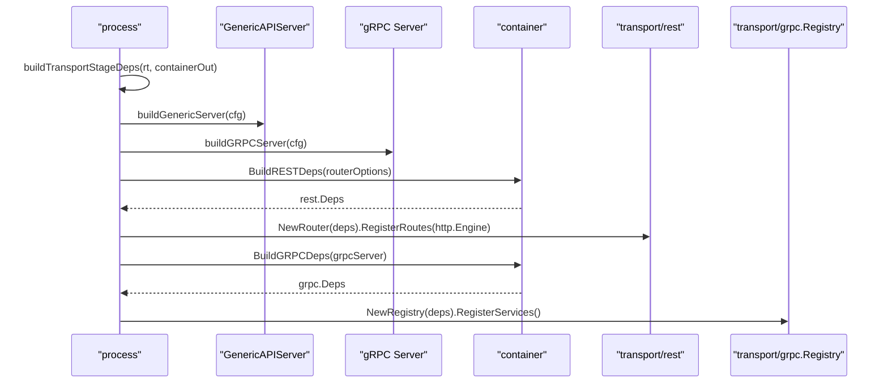
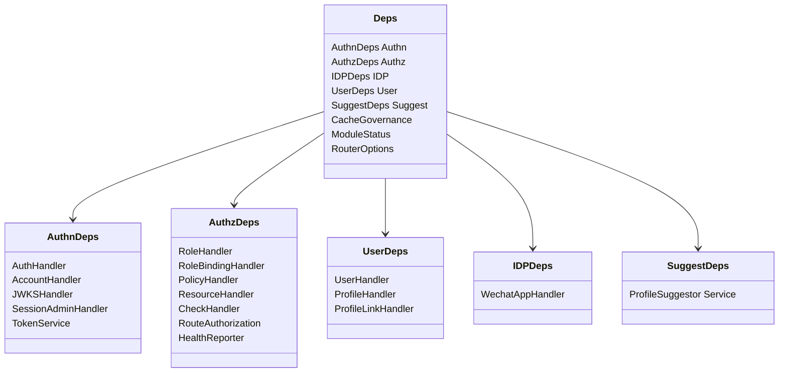
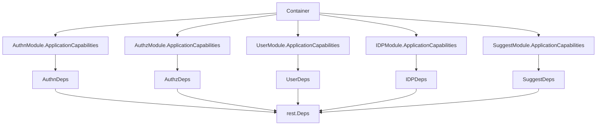
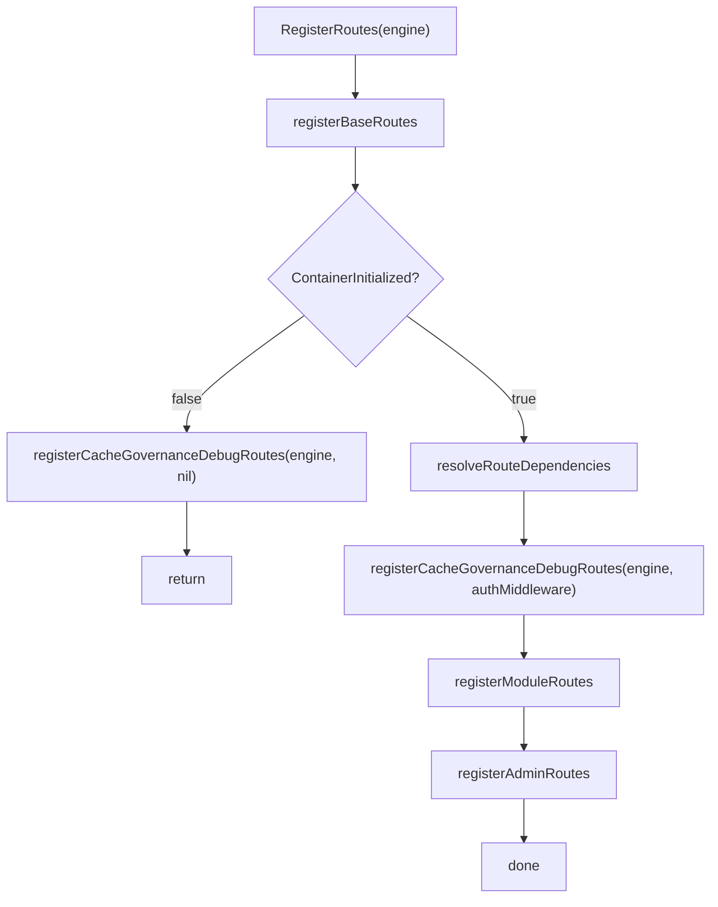
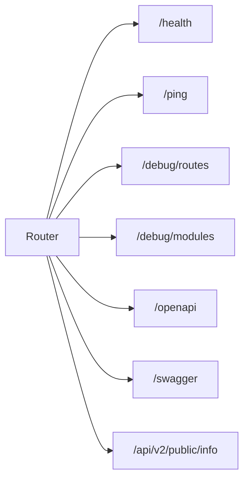
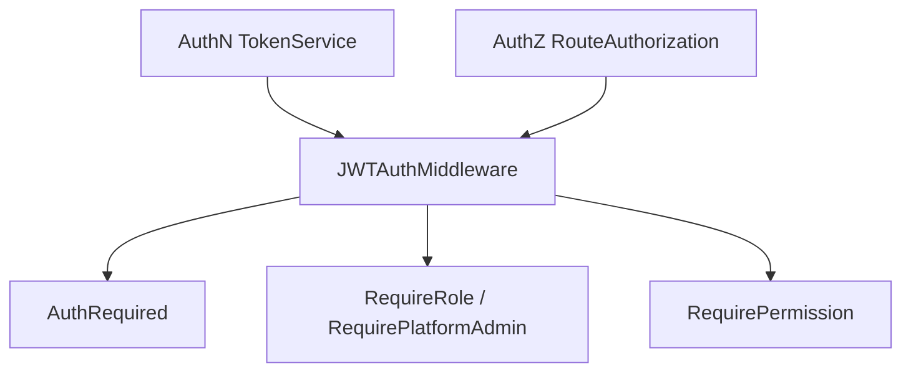
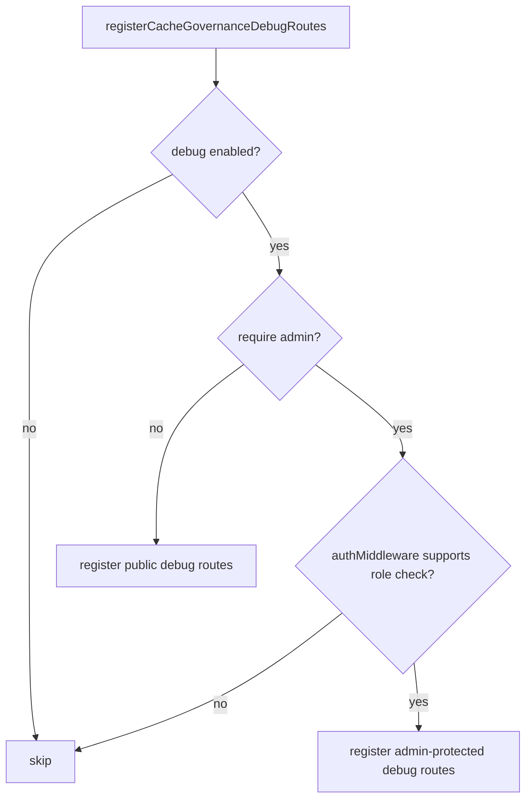
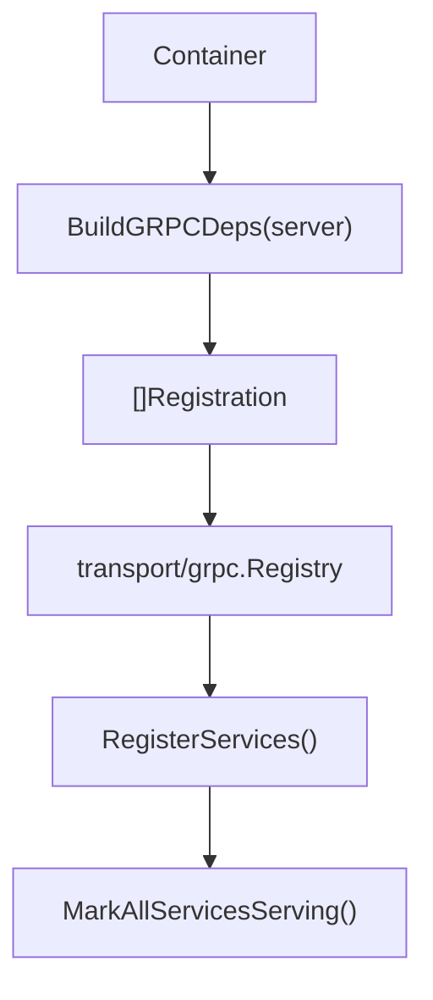

# Transport 装配：REST 路由与 gRPC 服务注册

## 本文回答

本文回答：IAM 的协议层如何从 container 获取模块能力，并把这些能力注册成对外 REST API 和 gRPC service。

读完本文，你应该能回答：

- `transport/rest` 和 `transport/grpc` 在架构中负责什么；
- 为什么 transport 不直接初始化业务模块；
- container 如何把 AuthN、AuthZ、User、IDP、Suggest 能力投影成 REST deps；
- REST Router 的注册顺序是什么；
- AuthN、AuthZ、Identity、IDP、Suggest、Admin 路由分别在什么条件下注册；
- JWT middleware 如何由 TokenService 和 RouteAuthorization 组合出来；
- 为什么受保护路由要 fail-closed；
- gRPC registration 如何由 container 生成，再由 transport registry 注册；
- REST/gRPC 与 OpenAPI/proto 契约如何防止漂移。

本文只讨论协议层装配，不展开登录、授权、ProfileLink、IDP、Suggest 的业务细节。

---

## 30 秒结论

IAM 的 transport 层不是业务层，也不是组合根。

它只做协议适配：

```text
HTTP request / gRPC request
  -> route / service method
  -> DTO / proto mapper
  -> application use case
  -> response / error mapping
```

REST 和 gRPC 的共同设计原则是：

```text
container 负责提供模块能力
transport 负责把能力注册成协议入口
```

REST 的能力入口是 `rest.Deps`：

```text
Container.BuildRESTDeps(...)
  -> rest.Deps
  -> rest.NewRouter(deps)
  -> Router.RegisterRoutes(gin.Engine)
```

gRPC 的能力入口是 `[]Registration`：

```text
Container.BuildGRPCDeps(server)
  -> []grpc.Registration
  -> transport/grpc.Registry
  -> Registry.RegisterServices()
```

这样做的意义是：transport 不需要知道模块如何初始化，container 也不需要知道 REST/gRPC 的具体路由细节。二者通过显式 deps/registration 协作。

核心源码入口：

- [../../internal/apiserver/process/bootstrap.go](../../internal/apiserver/process/bootstrap.go)
- [../../internal/apiserver/container/rest_deps.go](../../internal/apiserver/container/rest_deps.go)
- [../../internal/apiserver/transport/rest/deps.go](../../internal/apiserver/transport/rest/deps.go)
- [../../internal/apiserver/transport/rest/router.go](../../internal/apiserver/transport/rest/router.go)
- [../../internal/apiserver/transport/rest/module_routes.go](../../internal/apiserver/transport/rest/module_routes.go)
- [../../internal/apiserver/container/grpc_registry.go](../../internal/apiserver/container/grpc_registry.go)
- [../../internal/apiserver/transport/grpc/registry.go](../../internal/apiserver/transport/grpc/registry.go)

---

## 主图：container 到 transport 的能力投影



---

## 重点速查

| 问题 | 当前答案 | 代码证据 |
|---|---|---|
| transport stage 在哪里触发 | `prepareTransports` 调用 `bootstrapTransports`。 | [../../internal/apiserver/process/bootstrap.go](../../internal/apiserver/process/bootstrap.go) |
| REST Router 消费什么依赖 | 消费 `rest.Deps`，不是直接消费 container。 | [../../internal/apiserver/transport/rest/deps.go](../../internal/apiserver/transport/rest/deps.go) |
| REST deps 谁生成 | `Container.BuildRESTDeps(options)`。 | [../../internal/apiserver/container/rest_deps.go](../../internal/apiserver/container/rest_deps.go) |
| REST 注册入口 | `Router.RegisterRoutes(engine)`。 | [../../internal/apiserver/transport/rest/router.go](../../internal/apiserver/transport/rest/router.go) |
| REST 模块路由在哪里注册 | `registerModuleRoutes` 分别注册 AuthN、AuthZ、IDP、Identity、Suggest。 | [../../internal/apiserver/transport/rest/module_routes.go](../../internal/apiserver/transport/rest/module_routes.go) |
| JWT middleware 怎么创建 | `TokenService + RouteAuthorization` 组合成 `JWTAuthMiddleware`。 | [../../internal/apiserver/transport/rest/router.go](../../internal/apiserver/transport/rest/router.go)、[../../internal/pkg/middleware/authn/jwt_middleware.go](../../internal/pkg/middleware/authn/jwt_middleware.go) |
| Admin routes 的保护条件 | 必须有 JWT middleware，且支持 role check。 | [../../internal/apiserver/transport/rest/admin_routes.go](../../internal/apiserver/transport/rest/admin_routes.go) |
| gRPC registration 谁生成 | `Container.BuildGRPCDeps(server)` 收集模块 registrations。 | [../../internal/apiserver/container/grpc_registry.go](../../internal/apiserver/container/grpc_registry.go) |
| gRPC 服务谁注册 | `transport/grpc.Registry.RegisterServices()`。 | [../../internal/apiserver/transport/grpc/registry.go](../../internal/apiserver/transport/grpc/registry.go) |
| proto 与实现如何防漂移 | 测试扫描 proto service，并确认 transport/grpc/service 中有对应 registration。 | [../../internal/apiserver/transport/grpc/proto_contract_test.go](../../internal/apiserver/transport/grpc/proto_contract_test.go) |
| REST 路由与 OpenAPI 如何防漂移 | router matrix test 检查关键路由和 OpenAPI 覆盖。 | [../../internal/apiserver/transport/rest/router_matrix_test.go](../../internal/apiserver/transport/rest/router_matrix_test.go) |

---

## 1. Transport 的定位

Transport 是协议适配层。

它的职责包括：

- 注册 REST route 或 gRPC service；
- 解析 HTTP request / proto request；
- 做 DTO、proto、application request 之间的转换；
- 调用 application service；
- 映射响应和错误；
- 接入认证、授权、日志、审计、mTLS、ACL 等协议侧能力。

它不应该：

- 初始化业务模块；
- 直接创建 repository；
- 直接访问 MySQL、Redis；
- 直接操作 Casbin facts；
- 读取全局配置；
- 穿透 container 内部字段；
- 承载业务规则。

Transport 的依赖应该来自 container 的显式投影，而不是自己向内层挖依赖。



这里的重点是：transport 是入站适配器，不是业务模块，也不是组合根。

---

## 2. process 如何进入 transport stage

Transport 装配发生在 `PrepareRun()` 的 `initialize transports` stage。

调用链是：

```text
process.prepareTransports
  -> buildTransportStageDeps
  -> bootstrapTransports
      -> buildHTTPServer
      -> buildGRPCServer
      -> registerREST
      -> registerGRPC
```



这一步有两个关键边界：

1. `process` 只负责编排，不直接构造业务 handler。
2. `transport` 只消费 deps/registration，不直接初始化 container 模块。

核心源码：

- [../../internal/apiserver/process/bootstrap.go](../../internal/apiserver/process/bootstrap.go)
- [../../internal/apiserver/process/generic_server.go](../../internal/apiserver/process/generic_server.go)
- [../../internal/apiserver/process/grpc_config.go](../../internal/apiserver/process/grpc_config.go)

---

## 3. REST 的依赖面：rest.Deps

REST Router 的依赖集中在 `rest.Deps`：

```text
rest.Deps
├── AuthnDeps
├── AuthzDeps
├── IDPDeps
├── UserDeps
├── SuggestDeps
├── CacheGovernance
├── ModuleStatus
└── RouterOptions
```

这些依赖是协议层真正需要的最小面。



### 为什么不直接传 container？

如果 Router 直接拿 container，会出现几个问题：

- Router 可以随意穿透模块内部字段；
- handler/service 初始化职责会向 transport 泄漏；
- REST 测试必须构造完整 container；
- 模块内部重构会导致 Router 跟着变；
- transport 可能绕过 application capabilities 直接调用 infra/domain。

当前设计把 Router 的依赖收口到 `rest.Deps`，让 REST 层只看到协议注册需要的能力。

核心源码：

- [../../internal/apiserver/transport/rest/deps.go](../../internal/apiserver/transport/rest/deps.go)

---

## 4. Container 到 REST Deps 的能力投影

`Container.BuildRESTDeps(options)` 负责把已初始化模块转换成 REST 所需依赖。

它不是简单返回模块对象，而是按模块收集 capabilities，再创建对应 handler。



### 4.1 AuthN 投影

AuthN module capabilities 会被转换成：

| REST 依赖 | 来源能力 | 用途 |
|---|---|---|
| `AuthHandler` | LoginService、TokenService、LoginPreparationService | 登录、刷新、登出、验证、登录预准备 |
| `AccountHandler` | AccountService、AccountOnboarder | 账号查询、账号资料更新、signup、mock consumer seed |
| `JWKSHandler` | KeyManagementApp、KeyPublishApp | JWKS public endpoint、admin key management |
| `SessionAdminHandler` | SessionService | admin session revoke |
| `TokenService` | TokenApplicationService | 构造 JWT middleware |

### 4.2 AuthZ 投影

AuthZ module capabilities 会被转换成：

| REST 依赖 | 用途 |
|---|---|
| `RoleHandler` | 角色管理 |
| `RoleBindingHandler` | assignment/rolebinding 管理 |
| `PolicyHandler` | 权限策略管理、policy version |
| `ResourceHandler` | 资源管理 |
| `CheckHandler` | PDP 授权判定 |
| `RouteAuthorization` | JWT middleware 的角色/权限检查 |
| `HealthReporter` | AuthZ runtime reload health |

### 4.3 User / Identity 投影

User module capabilities 会被转换成：

| REST 依赖 | 用途 |
|---|---|
| `UserHandler` | `/identity/me` 等当前用户接口 |
| `ProfileHandler` | profiles 创建、查询、更新 |
| `ProfileLinkHandler` | profile-links grant/list/revoke |

### 4.4 IDP / Suggest / CacheGovernance 投影

| 模块 | REST 投影 |
|---|---|
| IDP | `WechatAppHandler`，用于微信应用管理 |
| Suggest | `ProfileSuggestor`，用于 `/api/v2/suggest/profile` |
| CacheGovernance | `ReadService`，用于 debug cache governance routes |

核心源码：

- [../../internal/apiserver/container/rest_deps.go](../../internal/apiserver/container/rest_deps.go)

---

## 5. Router.RegisterRoutes 的注册顺序

REST 注册入口是：

```text
rest.NewRouter(deps).RegisterRoutes(engine)
```

注册顺序是：

```text
base routes
  -> container initialized check
  -> resolve route dependencies
  -> cache governance debug routes
  -> module routes
  -> admin routes
```



这个顺序有几个含义：

1. base routes 总是先注册；
2. container 未初始化时，不注册业务模块路由；
3. debug 面可以在受控条件下暴露，用于诊断；
4. module routes 依赖 handler 和 middleware 完整性；
5. admin routes 最后注册，且必须具备 admin protection。

核心源码：

- [../../internal/apiserver/transport/rest/router.go](../../internal/apiserver/transport/rest/router.go)

---

## 6. Base Routes：基础诊断与文档入口

base routes 不依赖业务模块。

当前包括：

| 路由 | 用途 |
|---|---|
| `GET /health` | IAM REST 层健康检查 |
| `GET /ping` | 简单连通性检查 |
| `GET /debug/routes` | 查看已注册路由 |
| `GET /debug/modules` | 查看 container/module 状态 |
| `GET /openapi/*` | OpenAPI 静态文件 |
| `GET /swagger/*` | Swagger UI |
| `GET /api/v2/public/info` | public service info |



这些路由的作用是让服务即使在模块未完整初始化时，也能保留最小诊断入口。

核心源码：

- [../../internal/apiserver/transport/rest/base_routes.go](../../internal/apiserver/transport/rest/base_routes.go)
- [../../internal/apiserver/transport/rest/debug_routes.go](../../internal/apiserver/transport/rest/debug_routes.go)

---

## 7. JWT Middleware 与 RouteAuthorization

REST 中受保护路由依赖 `JWTAuthMiddleware`。

它由两个能力组成：

```text
TokenService + RouteAuthorization
```



### 7.1 TokenService

`AuthRequired()` 负责：

1. 从 Authorization header、query token 或 cookie 中提取 access token；
2. 调用 `TokenService.VerifyToken`；
3. 校验 token 是否有效；
4. 将 claims 中的 user/account/tenant/token 信息放入 Gin context；
5. 无效时返回认证错误并 abort。

### 7.2 RouteAuthorization

`RouteAuthorization` 是 AuthZ 提供给 middleware 的路由级授权运行时。

它支持：

- `DirectRoleKeys`：查询用户直接角色；
- `AuthorizeRoute`：对 resource/action 做路由级授权判定。

如果 `RouteAuthorization` 为空，middleware 仍可做 JWT 校验，但不支持角色/权限检查。  
`SupportsRoleCheck()` 用来判断是否可以注册 admin routes 和需要 admin protection 的 debug routes。

核心源码：

- [../../internal/pkg/middleware/authn/jwt_middleware.go](../../internal/pkg/middleware/authn/jwt_middleware.go)
- [../../internal/apiserver/transport/rest/router.go](../../internal/apiserver/transport/rest/router.go)

---

## 8. REST 模块路由注册条件

### 8.1 AuthN 路由

AuthN 路由在 `authnRoutesAvailable(deps.authn)` 为 true 时注册。

主要包括：

| 路由组 | 条件 | 说明 |
|---|---|---|
| `/api/v2/authn/login` | `AuthHandler` 存在 | 登录 |
| `/api/v2/authn/login/prep/phone-otp` | `AuthHandler` 存在 | 登录预准备 |
| `/api/v2/authn/refresh_token` | `AuthHandler` 存在 | 刷新 token |
| `/api/v2/authn/logout` | `AuthHandler` 存在 | 登出 |
| `/api/v2/authn/verify` | `AuthHandler` 存在 | 在线 verify |
| `/api/v2/authn/signups/wechat-miniprogram` | `AccountHandler` 存在 | 微信小程序 signup |
| `/.well-known/jwks.json` | `JWKSHandler` 存在 | public JWKS |
| `/api/v2/.well-known/jwks.json` | `JWKSHandler` 存在 | public JWKS |
| `/api/v2/authn/admin/jwks/*` | `JWKSHandler` + admin middlewares | JWKS 管理 |
| `/api/v2/internal/authn/mock-consumers/ensure` | seed mock enabled + shared secret | 内部 mock consumer seed |

注意：AuthN 中部分账户管理路由当前在 AuthN router 中注册，但并不全部显式挂 JWT middleware。这个边界后续如果要收紧，应以 OpenAPI、router matrix 和安全需求一起核对。

核心源码：

- [../../internal/apiserver/transport/rest/module_routes.go](../../internal/apiserver/transport/rest/module_routes.go)
- [../../internal/apiserver/transport/rest/authn/router.go](../../internal/apiserver/transport/rest/authn/router.go)

### 8.2 AuthZ 路由

AuthZ 路由注册条件：

```text
AuthZ handlers 存在
并且 JWT middleware 存在
```

`authzhttp.Register` 内部会在 `/api/v2/authz` 下注册 health 和受保护路由。受保护路由包括：

| 路由 | 说明 |
|---|---|
| `POST /api/v2/authz/check` | PDP 授权判定 |
| `/api/v2/authz/roles/*` | 角色管理 |
| `/api/v2/authz/assignments/*` | 对外 assignment 合同，内部 rolebinding |
| `/api/v2/authz/policies/*` | 权限策略与 policy version |
| `/api/v2/authz/resources/*` | 资源管理 |

如果 AuthZ handlers 存在但 JWT middleware 不存在，AuthZ 受保护路由不会注册。  
这就是 fail-closed：没有认证入口，就不暴露受保护授权接口。

核心源码：

- [../../internal/apiserver/transport/rest/module_routes.go](../../internal/apiserver/transport/rest/module_routes.go)
- [../../internal/apiserver/transport/rest/authz/router.go](../../internal/apiserver/transport/rest/authz/router.go)

### 8.3 Identity 路由

Identity 路由注册条件：

```text
User/Profile/ProfileLink handlers 存在
并且 JWT middleware 存在
```

主要路由包括：

| 路由 | 说明 |
|---|---|
| `GET /api/v2/identity/me` | 当前用户 |
| `PATCH /api/v2/identity/me` | 更新当前用户 |
| `GET /api/v2/identity/me/profiles` | 当前用户 profiles |
| `POST /api/v2/identity/profiles` | 创建 profile |
| `GET /api/v2/identity/profiles/search` | 搜索 profiles |
| `GET /api/v2/identity/profiles/:id` | 查询 profile |
| `PATCH /api/v2/identity/profiles/:id` | 更新 profile |
| `GET /api/v2/identity/profile-links` | 查询 profile links |
| `POST /api/v2/identity/profile-links` | 建立关系 |
| `POST /api/v2/identity/profile-links/:id/revoke` | 撤销关系 |

这些路由全部通过 `AuthRequired()` 保护。

核心源码：

- [../../internal/apiserver/transport/rest/identity/router.go](../../internal/apiserver/transport/rest/identity/router.go)

### 8.4 IDP 路由

IDP 路由注册条件：

```text
ModuleStatus.IDP == true
```

注册后分两层：

| 路由 | 条件 | 说明 |
|---|---|---|
| `GET /api/v2/idp/health` | IDP Register 被调用 | IDP health |
| `/api/v2/idp/wechat-apps/*` | WechatAppHandler + admin middlewares | 微信应用管理 |

如果 admin middlewares 不存在，IDP WeChat app 管理路由不注册。  
IDP 不再负责微信登录接口；微信登录由 AuthN 统一处理。

核心源码：

- [../../internal/apiserver/transport/rest/module_routes.go](../../internal/apiserver/transport/rest/module_routes.go)
- [../../internal/apiserver/transport/rest/idp/router.go](../../internal/apiserver/transport/rest/idp/router.go)

### 8.5 Suggest 路由

Suggest 路由注册条件：

```text
Suggest service 存在
并且 JWT middleware 存在
```

当前路由：

```text
GET /api/v2/suggest/profile?k=...
```

Suggest 是受保护的读侧能力。它只做 profile 候选联想，不建立 ProfileLink，也不做 AuthZ 资源判定。

核心源码：

- [../../internal/apiserver/transport/rest/suggest/handler.go](../../internal/apiserver/transport/rest/suggest/handler.go)

### 8.6 Admin 路由

Admin routes 注册条件：

```text
JWT middleware 存在
并且 SupportsRoleCheck() == true
```

也就是说，admin routes 不仅需要 AuthN 的 TokenService，还需要 AuthZ 的 RouteAuthorization。

当前 admin group 在 `/api/v2/admin` 下，使用：

```text
AuthRequired()
RequirePlatformAdmin()
```

注册的 session revoke 能力依赖 `SessionAdminHandler`。

核心源码：

- [../../internal/apiserver/transport/rest/admin_routes.go](../../internal/apiserver/transport/rest/admin_routes.go)

---

## 9. Cache Governance Debug Routes

Cache governance debug routes 的注册受 `RouterOptions.DebugCacheGovernance` 控制。

当前规则：

| 场景 | 行为 |
|---|---|
| 显式 `Enabled=false` | 不注册 |
| 显式 `Enabled=true` | 注册 |
| 未显式配置，`AppMode != production` | 默认注册 |
| `AppMode == production` | 强制要求 admin protection |
| `RequireAdmin=true` | 需要 JWT + platform admin |
| 要求 admin 但 middleware 不可用 | 跳过注册 |



这条规则体现了一个重要边界：debug 面可以用于诊断，但生产环境必须被 admin 保护。

核心源码：

- [../../internal/apiserver/transport/rest/debug_routes.go](../../internal/apiserver/transport/rest/debug_routes.go)

---

## 10. REST Fail-Closed 总结

IAM 的 REST route registration 遵循 fail-closed。

| 依赖缺失 | 当前行为 | 设计原因 |
|---|---|---|
| container 未初始化 | 只注册 base routes 和允许的 debug routes | 保留诊断面，不暴露半可用业务面 |
| TokenService 缺失 | JWT middleware 不创建，protected routes 不注册 | 没有权威 token verify，不能暴露受保护接口 |
| RouteAuthorization 缺失 | middleware 可认证，但不支持 role check；admin routes 不注册 | 没有角色判定就不能暴露管理面 |
| AuthZ handlers 缺失 | AuthZ module routes 不注册 | 避免暴露无处理能力的路由 |
| User handlers 缺失 | Identity routes 不注册 | 避免用户/档案接口半可用 |
| WechatAppHandler 缺失 | IDP 管理路由不注册 | 避免 IDP 管理能力空转 |
| Suggest service 缺失 | Suggest route 不注册 | Suggest 禁用或初始化失败时不暴露 |
| Admin middlewares 缺失 | Admin/JWKS admin/IDP management/cache debug protected routes 不注册 | 管理面必须有管理员保护 |

这不是“启动成功就挂所有路由”的模型，而是：

```text
模块能力完整
  -> 投影 deps
  -> 构造 middleware
  -> 条件注册路由
```

---

## 11. gRPC 的依赖面：Deps 与 Registration

gRPC transport 的依赖面更简单。

container 生成：

```text
grpctransport.Deps {
    Server: grpcServer,
    Registrations: []Registration
}
```

每个 registration 包含：

```text
Module
Description
Register func(*grpc.Server)
```

transport registry 只负责遍历 registration 并调用 `Register(server)`。



核心源码：

- [../../internal/apiserver/container/grpc_registry.go](../../internal/apiserver/container/grpc_registry.go)
- [../../internal/apiserver/transport/grpc/registry.go](../../internal/apiserver/transport/grpc/registry.go)

---

## 12. gRPC 模块注册

### 12.1 AuthN gRPC

AuthN module 会创建 authn gRPC 聚合服务。

它根据能力是否存在，分别注册：

| 服务 | 条件 | 能力来源 |
|---|---|---|
| `AuthService` | TokenService 存在 | token verify / refresh / revoke 等 |
| `AccountOnboardingService` | AccountOnboarder 存在 | account onboarding |
| `JWKSService` | KeyPublishApp 存在 | JWKS 发布 |

核心源码：

- [../../internal/apiserver/container/grpc_registry.go](../../internal/apiserver/container/grpc_registry.go)
- [../../internal/apiserver/transport/grpc/service/authn/service.go](../../internal/apiserver/transport/grpc/service/authn/service.go)
- [../../api/grpc/iam/authn/v2/authn.proto](../../api/grpc/iam/authn/v2/authn.proto)

### 12.2 Identity / User gRPC

User module 会创建 identity gRPC 聚合服务。

它注册：

| 服务 | 说明 |
|---|---|
| `IdentityRead` | 用户与 profile 读取 |
| `ProfileLinkQuery` | ProfileLink 查询 |
| `ProfileLinkCommand` | ProfileLink 命令 |
| `IdentityLifecycle` | 用户生命周期 |

核心源码：

- [../../internal/apiserver/container/grpc_registry.go](../../internal/apiserver/container/grpc_registry.go)
- [../../internal/apiserver/transport/grpc/service/uc/service.go](../../internal/apiserver/transport/grpc/service/uc/service.go)
- [../../internal/apiserver/transport/grpc/service/uc/identity/service.go](../../internal/apiserver/transport/grpc/service/uc/identity/service.go)
- [../../api/grpc/iam/identity/v2/identity.proto](../../api/grpc/iam/identity/v2/identity.proto)

### 12.3 IDP gRPC

IDP module 注册 `IDPService`，用于 IDP 相关服务能力。

核心源码：

- [../../internal/apiserver/container/grpc_registry.go](../../internal/apiserver/container/grpc_registry.go)
- [../../internal/apiserver/transport/grpc/service/idp](../../internal/apiserver/transport/grpc/service/idp)
- [../../api/grpc/iam/idp/v2/idp.proto](../../api/grpc/iam/idp/v2/idp.proto)

### 12.4 AuthZ gRPC

AuthZ module 注册 `AuthorizationService`，主要承载：

- 授权判定；
- 授权快照；
- rolebinding command 等授权相关能力。

核心源码：

- [../../internal/apiserver/container/grpc_registry.go](../../internal/apiserver/container/grpc_registry.go)
- [../../internal/apiserver/transport/grpc/service/authz](../../internal/apiserver/transport/grpc/service/authz)
- [../../api/grpc/iam/authz/v2/authz.proto](../../api/grpc/iam/authz/v2/authz.proto)

---

## 13. REST/gRPC 与机器契约的关系

REST 和 gRPC 的协议事实源分别是：

```text
api/rest/*.yaml
api/grpc/iam/*/v2/*.proto
```

`docs/` 只解释契约如何接入、为什么这样组织、运行时如何注册，不重复维护字段事实。

### REST 防漂移

REST 当前通过 router matrix test 检查：

1. 关键路由是否注册；
2. 注册的 public API 是否被 OpenAPI 覆盖；
3. 一些退役路由不应重新出现。

例如：

- `/api/v2/authn/login`
- `/api/v2/authz/check`
- `/api/v2/identity/me`
- `/api/v2/idp/wechat-apps`
- `/api/v2/suggest/profile`
- `/.well-known/jwks.json`

核心源码：

- [../../internal/apiserver/transport/rest/router_matrix_test.go](../../internal/apiserver/transport/rest/router_matrix_test.go)
- [../../api/rest](../../api/rest)

### gRPC 防漂移

gRPC 当前通过 proto contract test 检查：

1. 扫描 `api/grpc/iam/**/*.proto` 中声明的 service；
2. 检查 `transport/grpc/service` 中是否存在对应的 `Register<ServiceName>Server` 调用。

核心源码：

- [../../internal/apiserver/transport/grpc/proto_contract_test.go](../../internal/apiserver/transport/grpc/proto_contract_test.go)
- [../../api/grpc](../../api/grpc)

---

## 14. 为什么 REST 和 gRPC 的装配方式不同

REST 和 gRPC 都是 transport，但注册方式不同：

| 维度 | REST | gRPC |
|---|---|---|
| 协议入口 | Gin route | grpc.Server service |
| 依赖形态 | `rest.Deps` | `[]Registration` |
| 注册入口 | `Router.RegisterRoutes(engine)` | `Registry.RegisterServices()` |
| 中间件 | Gin middleware | gRPC interceptors + service implementation |
| 契约 | OpenAPI yaml | proto |
| 防漂移 | router matrix + OpenAPI coverage | proto service registration test |
| module unavailable 行为 | 条件注册 routes | 有模块才生成 registration；service 内也可能按能力条件注册子服务 |

为什么 REST 用 `Deps`，gRPC 用 `Registration`？

- REST 的注册逻辑需要综合多个模块能力、JWT middleware、admin middlewares、debug options，所以适合集中在 Router 中决策。
- gRPC 服务注册更接近“模块服务列表”，container 根据模块生成 registration，transport registry 逐个注册即可。

---

## 15. 架构护栏

当前架构测试对 transport 有几条关键约束：

| 护栏 | 保护的设计 |
|---|---|
| REST router 不依赖 container/global config | Router 只能消费显式 deps，避免向组合根穿透 |
| REST registrars 不使用 package global dependencies | 路由注册必须显式传依赖 |
| transport 不依赖 legacy interface packages | transport 自己拥有注册逻辑 |
| assembler 不构造 transport implementations | assembler 只暴露 application/domain capabilities |
| AuthZ transport 不直接依赖 Casbin infra | transport 只能调用 application use cases 或 route authorization |
| gRPC proto service 必须有注册实现 | 防止 proto 声明和 transport 实现漂移 |
| REST OpenAPI 必须覆盖关键 registered routes | 防止注册路由与 API 契约漂移 |

核心源码：

- [../../internal/pkg/architecture/architecture_test.go](../../internal/pkg/architecture/architecture_test.go)
- [../../internal/apiserver/transport/rest/router_matrix_test.go](../../internal/apiserver/transport/rest/router_matrix_test.go)
- [../../internal/apiserver/transport/grpc/proto_contract_test.go](../../internal/apiserver/transport/grpc/proto_contract_test.go)

---

## 16. 推荐源码阅读路线

### 第一轮：看 process 如何进入 transport

```text
internal/apiserver/process/bootstrap.go
internal/apiserver/process/generic_server.go
internal/apiserver/process/grpc_config.go
```

目标：看清 HTTP/gRPC server 如何被构建，REST/gRPC registration 如何被触发。

### 第二轮：看 REST deps 与 Router

```text
internal/apiserver/transport/rest/deps.go
internal/apiserver/container/rest_deps.go
internal/apiserver/transport/rest/router.go
internal/apiserver/transport/rest/module_routes.go
```

目标：看清 container 如何投影能力，Router 如何按条件注册模块路由。

### 第三轮：看各模块 REST 注册

```text
internal/apiserver/transport/rest/authn/router.go
internal/apiserver/transport/rest/authz/router.go
internal/apiserver/transport/rest/identity/router.go
internal/apiserver/transport/rest/idp/router.go
internal/apiserver/transport/rest/suggest/handler.go
internal/apiserver/transport/rest/admin_routes.go
internal/apiserver/transport/rest/debug_routes.go
```

目标：看清每个模块路由的注册条件和 fail-closed 边界。

### 第四轮：看 JWT middleware

```text
internal/pkg/middleware/authn/jwt_middleware.go
```

目标：看清 TokenService、RouteAuthorization、AuthRequired、RequirePlatformAdmin、RequirePermission 的关系。

### 第五轮：看 gRPC registration

```text
internal/apiserver/container/grpc_registry.go
internal/apiserver/transport/grpc/registry.go
internal/apiserver/transport/grpc/service/authn/service.go
internal/apiserver/transport/grpc/service/uc/service.go
internal/apiserver/transport/grpc/service/uc/identity/service.go
internal/apiserver/transport/grpc/service/authz
internal/apiserver/transport/grpc/service/idp
```

目标：看清 container 生成 registration，transport registry 执行注册。

### 第六轮：看契约测试

```text
internal/apiserver/transport/rest/router_matrix_test.go
internal/apiserver/transport/grpc/proto_contract_test.go
internal/pkg/architecture/architecture_test.go
```

目标：看清路由、proto、架构边界如何防漂移。

---

## 17. 验证建议

```bash
go test ./internal/apiserver/transport/rest \
  ./internal/apiserver/transport/grpc \
  ./internal/apiserver/container \
  ./internal/pkg/architecture

make api-validate
make docs-hygiene
```

说明：

- `go test ./internal/apiserver/transport/rest` 用于验证 REST router matrix 和 OpenAPI 覆盖。
- `go test ./internal/apiserver/transport/grpc` 用于验证 proto service registration。
- `go test ./internal/pkg/architecture` 用于验证 transport 边界没有回退。
- `make api-validate` 用于校验 REST/OpenAPI/API 契约，但依赖 Docker daemon。
- `make docs-hygiene` 用于文档卫生检查。

---

## 本文总结

Transport 装配的核心可以压缩成一句话：

> container 负责把模块能力投影出来，transport 负责把能力注册成 REST/gRPC 协议入口。

REST 的关键是：

```text
BuildRESTDeps
  -> rest.Deps
  -> Router.RegisterRoutes
  -> base/debug/module/admin routes
  -> fail-closed protected routes
```

gRPC 的关键是：

```text
BuildGRPCDeps
  -> []Registration
  -> Registry.RegisterServices
  -> MarkAllServicesServing
```

理解这篇文档后，再读 AuthN 登录链路、AuthZ 授权链路、Identity/ProfileLink 链路时，就能明确知道：请求是如何进入业务用例的，认证中间件在哪里生效，模块能力是如何从 container 投影到协议层的。
