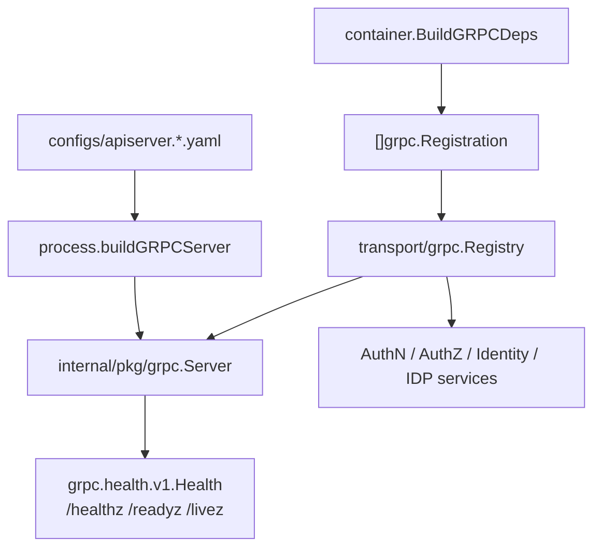
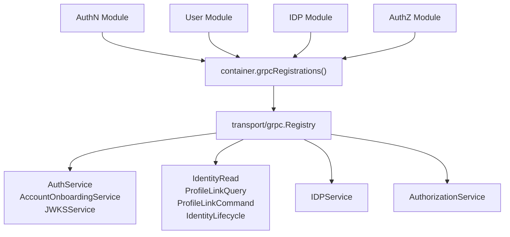
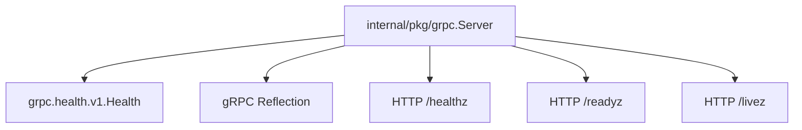
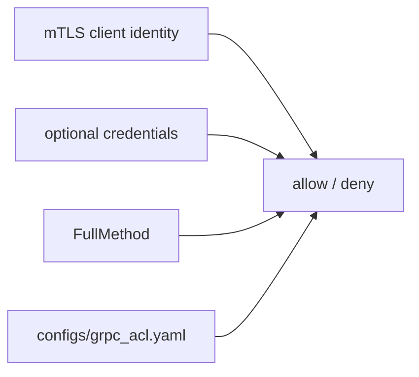

# gRPC 与 mTLS

## 本文回答

本文回答：IAM 的 gRPC 运行面如何由 `process` 创建、由 `container` 生成服务注册项、由 `transport/grpc.Registry` 注册到 gRPC server，并通过 mTLS、ACL、audit、health 和 reflection 形成当前运行时边界。

## 30 秒结论

- gRPC 与 REST 同属 `iam-apiserver` 进程，由 [../../internal/apiserver/process/bootstrap.go](../../internal/apiserver/process/bootstrap.go) 在 transport stage 中构建和注册。
- gRPC server 的底座在 [../../internal/pkg/grpc](../../internal/pkg/grpc)，负责 server options、mTLS/TLS、interceptors、health service、reflection、独立 HTTP 探针和 graceful stop。
- 业务服务注册不是散落在 main 或 process 中，而是 container 生成 registrations，`transport/grpc.Registry` 逐项调用并最终 `MarkAllServicesServing()`。
- 当前 v1 gRPC 暴露面包括 AuthN、AuthZ、Identity/ProfileLink、IDP；没有 v2 proto 运行时面。
- dev/prod 配置都启用 mTLS 和 audit；prod 开启 ACL，dev 默认关闭 ACL；应用层 gRPC credential auth 当前配置为关闭。

## 主图：gRPC 运行时装配



## 重点速查

| 问题 | 当前答案 | 代码/配置证据 |
| ---- | ---- | ---- |
| gRPC server 谁创建 | `process.buildGRPCServer` 把 apiserver config 映射到 `internal/pkg/grpc.Config`。 | [../../internal/apiserver/process/grpc_config.go](../../internal/apiserver/process/grpc_config.go) |
| gRPC server 底座在哪里 | `internal/pkg/grpc.Server` 封装 mTLS、interceptors、health、reflection、Run/Close。 | [../../internal/pkg/grpc/server.go](../../internal/pkg/grpc/server.go)、[../../internal/pkg/grpc/config.go](../../internal/pkg/grpc/config.go) |
| 服务注册谁负责 | `transport/grpc.Registry` 消费 container 传入的 registrations。 | [../../internal/apiserver/transport/grpc/registry.go](../../internal/apiserver/transport/grpc/registry.go) |
| registration 谁生成 | `container.grpcRegistrations()` 根据已初始化模块生成。 | [../../internal/apiserver/container/grpc_registry.go](../../internal/apiserver/container/grpc_registry.go) |
| 合同在哪里 | `api/grpc/iam/**/v1/*.proto`。 | [../../api/grpc/iam](../../api/grpc/iam) |
| dev/prod 安全开关如何验证 | 配置合同测试锁定端口、mTLS、ACL、audit。 | [../../internal/apiserver/config/config_contract_test.go](../../internal/apiserver/config/config_contract_test.go) |
| proto 与 runtime 注册如何对齐 | transport gRPC contract test 检查 proto service 都有注册调用。 | [../../internal/apiserver/transport/grpc/proto_contract_test.go](../../internal/apiserver/transport/grpc/proto_contract_test.go) |

## 1. 配置映射与安全模式


`applyGRPCOptions` 会映射这些配置：

- bind address、bind port、healthz port。
- mTLS CA、server cert/key、client cert requirement、CN/OU/SAN allowlists、TLS version、auto reload。
- 应用层 credential auth 开关。
- ACL config file 和 default policy。
- Audit 开关。
- secure serving TLS cert/key fallback。
- `Insecure` 最终值：启用 mTLS 或配置 TLS cert/key 时强制 false。

对应测试在 [../../internal/apiserver/process/grpc_config_test.go](../../internal/apiserver/process/grpc_config_test.go)。

## 2. dev/prod 当前开关

| 环境 | gRPC 端口 | healthz 端口 | mTLS | 应用层 credential auth | ACL | Audit | 证据 |
| ---- | ---- | ---- | ---- | ---- | ---- | ---- | ---- |
| dev | `19091` | `19092` | enabled | disabled | disabled | enabled | [../../configs/apiserver.dev.yaml](../../configs/apiserver.dev.yaml) |
| prod | `9090` | `9091` | enabled | disabled | enabled | enabled | [../../configs/apiserver.prod.yaml](../../configs/apiserver.prod.yaml) |

边界说明：

- mTLS 是传输和客户端证书身份层，不等同于业务授权。
- 当前应用层 gRPC credential auth 的能力存在于配置和拦截器装配中，但 dev/prod 配置均未启用。
- ACL 是方法级访问控制配置，当前 prod 开启；它不是 proto 合同。

## 3. 拦截器链

### Unary 链


当前 unary chain 的构建顺序在 [../../internal/pkg/grpc/server.go](../../internal/pkg/grpc/server.go)：

1. Recovery
2. RequestID
3. Logging
4. mTLS identity extraction
5. Credential validation
6. ACL
7. Audit

### Stream 链

流式链当前是 Logging、mTLS、Credential、ACL、Audit。IAM 当前公开 proto 主要是 unary 服务；stream chain 仍作为 gRPC 底座能力保留。

### 为什么用 Chain of Responsibility

- **解决的问题**：认证、授权、审计、日志和恢复都是请求横切能力，不应写进每个 service method。
- **IAM 的落地**：`grpc.ChainUnaryInterceptor` 和 `grpc.ChainStreamInterceptor` 按配置拼接拦截器。
- **代价和边界**：拦截器顺序会影响行为；新增安全层必须明确位于认证前、授权前还是审计前。

## 4. 服务注册



| 模块 | 当前注册服务 | 代码证据 | 合同 |
| ---- | ---- | ---- | ---- |
| AuthN | `AuthService`、`AccountOnboardingService`、`JWKSService` | [../../internal/apiserver/transport/grpc/service/authn/service.go](../../internal/apiserver/transport/grpc/service/authn/service.go) | [../../api/grpc/iam/authn/v1/authn.proto](../../api/grpc/iam/authn/v1/authn.proto) |
| Identity | `IdentityRead`、`ProfileLinkQuery`、`ProfileLinkCommand`、`IdentityLifecycle` | [../../internal/apiserver/transport/grpc/service/uc/identity/service.go](../../internal/apiserver/transport/grpc/service/uc/identity/service.go) | [../../api/grpc/iam/identity/v1/identity.proto](../../api/grpc/iam/identity/v1/identity.proto) |
| IDP | `IDPService` | [../../internal/apiserver/transport/grpc/service/idp/service.go](../../internal/apiserver/transport/grpc/service/idp/service.go) | [../../api/grpc/iam/idp/v1/idp.proto](../../api/grpc/iam/idp/v1/idp.proto) |
| AuthZ | `AuthorizationService` | [../../internal/apiserver/transport/grpc/service/authz/service.go](../../internal/apiserver/transport/grpc/service/authz/service.go) | [../../api/grpc/iam/authz/v1/authz.proto](../../api/grpc/iam/authz/v1/authz.proto) |

`Registry.RegisterServices()` 注册完成后调用 `MarkAllServicesServing()`，把整体和已注册业务服务标记为 `SERVING`。如果 server 为空，registry 会跳过并记录 warning。

## 5. Health、Reflection 与独立 HTTP 探针



当前语义：

- `grpc.health.v1.Health`：标准 gRPC health service。
- `/healthz`：检查整体 gRPC health status 是否 `SERVING`。
- `/readyz`：同样依赖整体 gRPC health status，失败返回 `NOT_READY`。
- `/livez`：只说明 healthz HTTP server 活着，不证明业务依赖健康。
- reflection：默认配置启用，用于服务发现和调试。

这些入口属于 gRPC 基础设施运行面，不等价于 MySQL、Redis、EventBus 或每个业务模块都健康。

## 6. ACL 的运行时含义

[../../configs/grpc_acl.yaml](../../configs/grpc_acl.yaml) 描述调用方 `service_name` 与允许访问的 full method name。它的语义是运行时访问控制，而不是 API 合同。



边界：

- proto 声明某个 RPC，不代表所有调用方都能调用。
- ACL 允许某调用方调用某方法，不代表该方法业务内部一定会成功。
- 当前 prod 开启 ACL；dev 默认关闭，适合本地调试。

## 7. 运行时设计模式

| 模式 | 为什么用 | IAM 中如何落地 | 代价和边界 |
| ---- | ---- | ---- | ---- |
| Registry | 服务注册来自模块，但注册动作属于 transport。 | `container.grpcRegistrations()` + `transport/grpc.Registry`。 | 新增 proto service 时必须补 runtime registration。 |
| Chain of Responsibility | 多个横切安全/治理能力需要顺序执行。 | gRPC unary/stream interceptors。 | 顺序错误会改变认证、授权和审计语义。 |
| Adapter / Mapper | proto 消息不能直接污染 application/domain。 | `transport/grpc/service/*` 内部 mapper。 | 增加映射代码，但保护合同稳定。 |
| Fail Closed | server 或注册项缺失时不能假装服务可用。 | nil server 跳过注册；capability 缺失则服务不注册或返回 Unavailable。 | 调试时需要结合 service registration 和 health 判断。 |

## 8. 验证入口

```bash
go test ./internal/apiserver/process ./internal/apiserver/transport/grpc ./internal/pkg/grpc
make docs-hygiene
```

如果 proto 有新增 service，必须同时检查 [../../internal/apiserver/transport/grpc/proto_contract_test.go](../../internal/apiserver/transport/grpc/proto_contract_test.go) 和 SDK compile tests。
