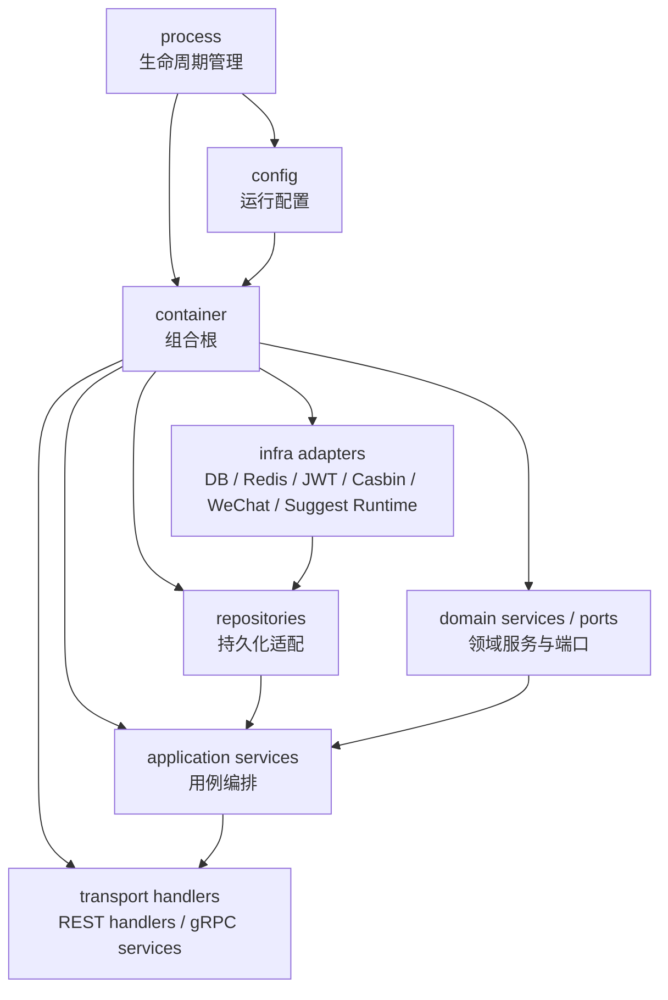

# 组合根与依赖装配

> 状态：待补证据 · 第一版正文，待继续按源码、配置、container 结构和架构测试核对细节。

---

## 1. 本文回答

本文回答 6 个问题：

- 什么是组合根？
- 为什么 `internal/apiserver/container` 是 iam-apiserver 的组合根？
- container 应该装配哪些对象？
- container 不应该承担哪些业务职责？
- Identity、AuthN、AuthZ、IDP、Suggest 五个模块如何在组合根中被装配？
- 修改依赖装配时，应该如何避免跨层依赖和模块边界漂移？

本文只讲依赖装配，不展开 REST/gRPC 路由注册细节，也不展开业务模块内部领域模型。传输层装配见 [03-REST与gRPC传输层装配.md](03-REST与gRPC传输层装配.md)，业务模块模型见 [../02-业务模块](../02-业务模块/README.md)。

---

## 2. 30 秒结论

`internal/apiserver/container` 是 IAM 的组合根。

它负责把配置、基础设施、repository、domain service、application service、runtime adapter 和 transport handler 所需依赖装配成可运行对象图。

装配主线可以压缩为：

```text
config
  -> infra adapters
  -> repositories / runtimes / external clients
  -> domain services / ports
  -> application services
  -> transport handlers / grpc services
```

最重要的边界是：

```text
container 可以知道所有具体实现；
container 只创建对象和连接依赖；
container 不执行业务用例；
container 不处理 HTTP/gRPC 请求；
container 不把跨模块协作藏成隐式全局变量；
container 不替代 application 层。
```

如果只记一句话：

> 组合根是“依赖在哪里汇合”的地方，不是“业务在哪里发生”的地方。

---

## 3. 组合根位置



这张图表达运行时装配关系，不表达单次请求调用方向。

单次请求调用方向仍然是：

```text
transport -> application -> domain / ports -> infra adapters
```

---

## 4. 什么是组合根

组合根是应用启动期间集中创建和连接依赖的地方。

它的价值是：

```text
把具体实现集中到一个可审计位置；
避免 handler、application、domain 到处 new 依赖；
让依赖方向清晰；
让模块装配可测试、可替换、可分层检查；
让运行时配置和具体 adapter 的绑定关系可见。
```

在 IAM 中，组合根主要承担：

```text
读取配置后的依赖创建；
数据库、Redis、外部客户端等资源适配；
repository 创建；
token、casbin、idp、suggest runtime 等技术能力创建；
Identity/AuthN/AuthZ/IDP/Suggest application service 装配；
REST handler 和 gRPC service 所需依赖装配。
```

组合根不是：

```text
业务流程编排器；
请求处理器；
事务控制器；
领域服务本身；
后台任务执行器；
全局变量容器。
```

---

## 5. 装配对象分层

组合根中创建的对象应按层次理解。

| 层次 | 典型对象 | 说明 |
| --- | --- | --- |
| Config | 数据库、Redis、JWT、IDP、Suggest、运行模式配置 | process 加载后传入 container |
| Infra Adapter | DB client、Redis client、JWT signer/verifier、Casbin enforcer、WeChat client、Suggest runtime | 技术实现细节 |
| Repository | Identity/AuthN/AuthZ/IDP/Suggest repository | 持久化适配 |
| Domain Service / Port | 领域服务、端口接口、策略对象 | 表达业务规则或业务需要的能力 |
| Application Service | 注册、登录、授权、Suggest 查询等用例服务 | 编排领域对象和端口 |
| Transport Handler | REST handler、gRPC service implementation | 协议层依赖 application service |

装配顺序一般应是：

```text
配置先于资源；
资源先于 adapter；
adapter 先于 repository；
repository 和 domain service 先于 application service；
application service 先于 transport handler。
```

---

## 6. 推荐装配方向

推荐依赖装配方向：

```text
container -> infra concrete
container -> repository concrete
container -> domain service
container -> application service
container -> transport handler
transport handler -> application service
application service -> domain / ports
infra adapter -> implements ports
```

不推荐依赖方向：

```text
transport handler -> repository concrete；
transport handler -> database client；
transport handler -> casbin enforcer；
transport handler -> jwt signer；
application service -> transport DTO；
domain -> infra concrete；
domain -> mysql / redis / casbin / jwt / wechat sdk；
infra -> transport handler；
repository -> application service。
```

设计原则：

> 具体实现可以汇聚到 container，但业务代码应尽量依赖稳定抽象。

---

## 7. 模块装配总览

IAM 业务模块在组合根中分为 3 个核心模块和 2 个辅助模块。

| 模块 | 组合根建议位置 | 装配重点 |
| --- | --- | --- |
| Identity | `../../internal/apiserver/container/identity` | User、Profile、ProfileLink repository 和 application service |
| AuthN | `../../internal/apiserver/container/authn` | LoginIdentity、Credential、Challenge、Session、Token、JWKS 相关服务 |
| AuthZ | `../../internal/apiserver/container/authz` | Role、Permission、RoleBinding、PolicyVersion、Casbin runtime、Outbox 相关服务 |
| IDP | `../../internal/apiserver/container/idp` | WechatApp、Credentials、AppToken、ExternalIdentity、外部客户端 |
| Suggest | `../../internal/apiserver/container/suggest` | ProfileSearchTerm、ProfileAccessScope、Snapshot、索引 runtime |

注意：上表中的路径需要继续按当前代码核对。如果实际 container 文件组织不同，应以源码为准，并更新本文。

---

## 8. Identity 装配

Identity 是身份事实中心。

组合根中通常需要装配：

```text
User repository；
Profile repository；
ProfileLink repository；
Identity domain service；
Identity application service；
REST/gRPC identity handler 所需依赖。
```

Identity 装配原则：

```text
Identity 可以被 AuthN、AuthZ、Suggest 通过 application service 或 port 引用；
Identity 不应该依赖 AuthN 登录态实现；
Identity 不应该依赖 AuthZ Casbin runtime；
Identity 不应该依赖 Suggest 索引实现。
```

常见反模式：

```text
在 Identity container 中创建 token signer；
在 Identity repository 中判断权限；
在 ProfileLink 装配中直接创建 RoleBinding；
在 Identity handler 中直接访问 AuthZ repository。
```

---

## 9. AuthN 装配

AuthN 是认证域。

组合根中通常需要装配：

```text
LoginIdentity repository；
Credential repository；
Challenge repository；
Session repository；
Token service；
RefreshToken store；
JWT signer/verifier；
JWK/JWKS provider；
Password hasher；
AuthN application service；
IDP external identity resolver port；
Identity user lookup port；
REST/gRPC authn handler 所需依赖。
```

AuthN 装配原则：

```text
AuthN 可以引用 Identity 的 UserID 或用户查询能力；
AuthN 可以消费 IDP 的 ExternalIdentity；
AuthN 不应该拥有 User 写模型；
AuthN 不应该管理 Role / Permission / RoleBinding；
JWT/JWKS 是 infra 能力，不是 AuthN 领域模型的全部。
```

常见反模式：

```text
IDP adapter 直接创建 Session；
JWT signer 直接访问 User repository 并拼完整用户资料；
AuthN handler 直接写 LoginIdentity repository；
RefreshToken store 绕过 application 执行登录逻辑。
```

---

## 10. AuthZ 装配

AuthZ 是授权域。

组合根中通常需要装配：

```text
Resource repository；
Action repository；
Scope repository；
Role repository；
Permission repository；
RoleBinding repository；
PolicyVersion repository；
Outbox repository；
Casbin runtime adapter；
Policy loader / projector；
Authorization checker；
AuthZ application service；
Identity subject/user lookup port；
REST/gRPC authz handler 所需依赖。
```

AuthZ 装配原则：

```text
AuthZ 可以引用 Identity 的 User/Profile 事实；
AuthZ 应通过 Subject 表达授权主体；
Casbin runtime 应作为 infra adapter 装配；
PolicyVersion 和 Outbox 用于授权事实传播；
AuthZ 不应该签发 Token；
AuthZ 不应该维护 User/Profile 写模型。
```

常见反模式：

```text
把 Casbin facts 直接当成 AuthZ domain model；
在 AuthZ container 中创建 AuthN token signer；
在 RoleBinding 装配中直接修改 ProfileLink；
Outbox dispatcher 直接绕过 application 改权限主表。
```

---

## 11. IDP 装配

IDP 是外部身份源辅助模块。

组合根中通常需要装配：

```text
WechatApp repository；
Credentials repository 或 secret provider；
AppToken cache/store；
WeChat / WeCom external client；
ExternalIdentity resolver；
IDP application service；
AuthN external identity port implementation；
REST/gRPC idp handler 所需依赖。
```

IDP 装配原则：

```text
IDP 输出 ExternalIdentity；
AuthN 消费 ExternalIdentity 并决定登录态；
IDP AppToken 是外部平台 token；
IDP Credentials 是外部应用凭据；
IDP 不应该创建 IAM Session；
IDP 不应该签发 IAM AccessToken。
```

常见反模式：

```text
WeChat client 直接创建 LoginIdentity；
IDP container 直接装配 IAM token service 并签发 Token；
把外部 access_token 当成 IAM AccessToken；
ExternalIdentity 被写入 Identity.User 主表。
```

---

## 12. Suggest 装配

Suggest 是 Profile 联想搜索读模型。

组合根中通常需要装配：

```text
ProfileSearchTerm repository 或 builder；
ProfileAccessScope resolver；
Snapshot store；
Suggest index runtime；
Suggest refresh runner；
Suggest application service；
Identity profile source port；
AuthZ visibility/scope port；
REST/gRPC suggest handler 所需依赖。
```

Suggest 装配原则：

```text
Suggest 可以消费 Identity 的 Profile 事实；
Suggest 可以使用 AuthZ 的可见范围；
Suggest runtime 是读模型技术实现；
Suggest 不应该拥有 Profile 写模型；
Suggest 不应该管理通用 Role / Permission / RoleBinding。
```

常见反模式：

```text
Suggest repository 直接写 Profile 主表；
Suggest runtime 绕过 AuthZ 返回不可见 Profile；
ProfileAccessScope 被写成通用授权策略；
Suggest handler 直接访问 Identity repository 和 AuthZ repository 拼业务逻辑。
```

---

## 13. 跨模块依赖装配原则

跨模块依赖不可避免，但必须显式、受控、可测试。

推荐方式：

```text
通过 application service 暴露用例能力；
通过 port 暴露查询或解析能力；
通过 ID 引用其他模块事实；
通过事件或 Outbox 传播事实变化；
在 container 中集中装配跨模块依赖。
```

避免方式：

```text
模块 A 直接 import 模块 B 的 infra repository；
模块 A 直接修改模块 B 的主表；
通过全局变量隐式调用其他模块；
把跨模块协作写在 handler；
把跨模块协作写在 container 初始化副作用中。
```

典型协作：

```text
AuthN -> Identity：通过 UserID 或用户查询能力引用 User；
AuthN -> IDP：消费 ExternalIdentity；
AuthZ -> Identity：通过 Subject 引用 User/Profile 事实；
Suggest -> Identity：消费 Profile 事实；
Suggest -> AuthZ：使用 ProfileAccessScope 或可见范围能力。
```

---

## 14. transport handler 装配原则

REST/gRPC handler 可以在 container 中创建，但 handler 只应该依赖 application service。

推荐：

```text
REST handler -> application service；
gRPC service implementation -> application service；
middleware/interceptor -> AuthN/JWKS/Principal 解析能力；
handler 不知道 repository 和 database。
```

避免：

```text
handler -> repository；
handler -> mysql client；
handler -> redis client；
handler -> casbin enforcer；
handler -> jwt signer；
handler -> wechat client。
```

设计原则：

> handler 是协议入口，不是组合根，也不是用例编排器。

---

## 15. 后台任务装配原则

后台任务也应由 container/process 统一装配和生命周期管理。

可能装配的后台任务包括：

```text
Outbox dispatcher；
AuthZ policy reload worker；
Suggest index refresh worker；
IDP AppToken refresh worker；
health/readiness dependency checker；
metrics/profiling runner。
```

后台任务装配原则：

```text
任务创建可以在 container；
任务启动和停止应归 process 生命周期管理；
任务应响应 context cancellation；
任务不应绕过 application 修改核心事实；
任务失败应有日志、重试、观测和降级策略。
```

---

## 16. 配置注入原则

配置由 process 加载后传入 container。

container 可以根据配置创建不同实现：

```text
是否启用 REST；
是否启用 gRPC；
JWT key source；
数据库连接；
Redis 连接；
Casbin model/policy source；
IDP provider 配置；
Suggest refresh 配置；
后台任务开关。
```

配置注入边界：

```text
配置决定运行方式；
配置不应该绕过领域规则；
配置不应该隐藏跨模块依赖；
配置不应该让 handler 直接选择 infra 实现；
配置变更需要同步运行时文档和 Verify。
```

---

## 17. 常见反模式

| 反模式 | 问题 | 推荐做法 |
| --- | --- | --- |
| handler 中 new repository | transport 泄漏持久化细节 | repository 在 container 创建，handler 调 application |
| application 中 new concrete infra | 用例层依赖具体技术实现 | application 依赖 port，infra 实现 port |
| domain import mysql/redis/casbin/jwt | 领域层被技术污染 | domain 只定义业务模型和端口 |
| container 初始化时执行登录/授权写入 | 装配和业务行为混淆 | container 只创建对象，不执行用例 |
| 使用全局变量保存 service | 隐式依赖，难测试，难替换 | 通过 container 显式传递依赖 |
| 跨模块直接访问 repository | 模块边界被绕开 | 通过 application service、port 或事件协作 |
| Casbin enforcer 注入到 handler | handler 绕过 AuthZ 用例 | handler 调 AuthZ application service |
| WeChat client 注入到 AuthN handler | AuthN handler 吞并 IDP 适配 | IDP adapter 解析 ExternalIdentity，AuthN 编排认证 |
| Suggest runtime 写 Profile 主表 | 读模型吞并写模型 | Suggest 只消费 Identity Profile 事实 |

---

## 18. 和其他运行时文档的关系

| 文档 | 关系 |
| --- | --- |
| [01-服务入口与生命周期.md](01-服务入口与生命周期.md) | 本文承接其中的 container 阶段，展开组合根和依赖装配 |
| [03-REST与gRPC传输层装配.md](03-REST与gRPC传输层装配.md) | 本文说明 handler 依赖如何创建，下一篇说明路由、middleware、interceptor 如何装配 |
| [04-配置加载与运行模式.md](04-配置加载与运行模式.md) | 本文使用配置装配依赖，配置来源和运行模式由该文展开 |
| [05-后台任务与优雅关闭.md](05-后台任务与优雅关闭.md) | 本文说明后台任务如何被创建，该文说明任务如何启动、停止和响应 shutdown |
| [06-健康检查与降级启动.md](06-健康检查与降级启动.md) | 本文说明依赖创建，该文说明依赖不可用时如何 health/readiness 和降级 |

---

## 19. 事实源

本文是组合根与依赖装配说明，不是机器契约。

当本文与代码、配置、测试冲突时，按以下优先级判断：

1. 源码与运行时行为。
2. 机器可读配置、OpenAPI、proto、迁移。
3. 测试：架构测试、运行时测试、契约测试。
4. 现行维护中的 `docs/`。
5. `_archive/` 历史材料。

当前主要事实源：

| 事实 | 路径 |
| --- | --- |
| 组合根 | `../../internal/apiserver/container` |
| 生命周期管理 | `../../internal/apiserver/process` |
| REST transport | `../../internal/apiserver/transport/rest` |
| gRPC transport | `../../internal/apiserver/transport/grpc` |
| Application 层 | `../../internal/apiserver/application` |
| Domain 层 | `../../internal/apiserver/domain` |
| Infra 层 | `../../internal/apiserver/infra` |
| Identity 模块 | `../../internal/apiserver/application/identity`、`../../internal/apiserver/domain/identity` |
| AuthN 模块 | `../../internal/apiserver/application/authn`、`../../internal/apiserver/domain/authn` |
| AuthZ 模块 | `../../internal/apiserver/application/authz`、`../../internal/apiserver/domain/authz` |
| IDP 模块 | `../../internal/apiserver/application/idp`、`../../internal/apiserver/domain/idp` |
| Suggest 模块 | `../../internal/apiserver/application/suggest`、`../../internal/apiserver/domain/suggest` |
| 架构测试 | `../../internal/pkg/architecture` |

---

## 20. Verify

修改本文后至少执行：

```bash
make docs-hygiene
```

涉及分层依赖或 container 装配边界时，再执行：

```bash
go test ./internal/pkg/architecture
```

涉及 REST/gRPC handler 依赖变更时，再执行：

```bash
make api-validate
make proto-gen
go test ./internal/apiserver/transport/grpc
```

涉及具体 container 代码时，补充运行时相关测试：

```bash
go test ./internal/apiserver/...
```

---

## 21. 本文总结

`internal/apiserver/container` 是 IAM 的组合根。

它的职责可以压缩成：

```text
接收配置；
创建 infra adapter；
创建 repository；
创建 domain/application service；
创建 runtime；
创建 transport handler 所需依赖；
集中表达跨模块依赖关系。
```

它的边界可以压缩成：

```text
container 负责装配，不负责业务；
container 可以知道具体实现，但不能隐藏业务流程；
handler 依赖 application，不依赖 repository；
application 依赖 domain/ports，不依赖 transport；
domain 不依赖 infra concrete；
跨模块协作必须显式、受控、可测试。
```

维护组合根文档时，必须持续核对源码和架构测试，避免依赖装配演变成隐式业务流程或跨层捷径。
