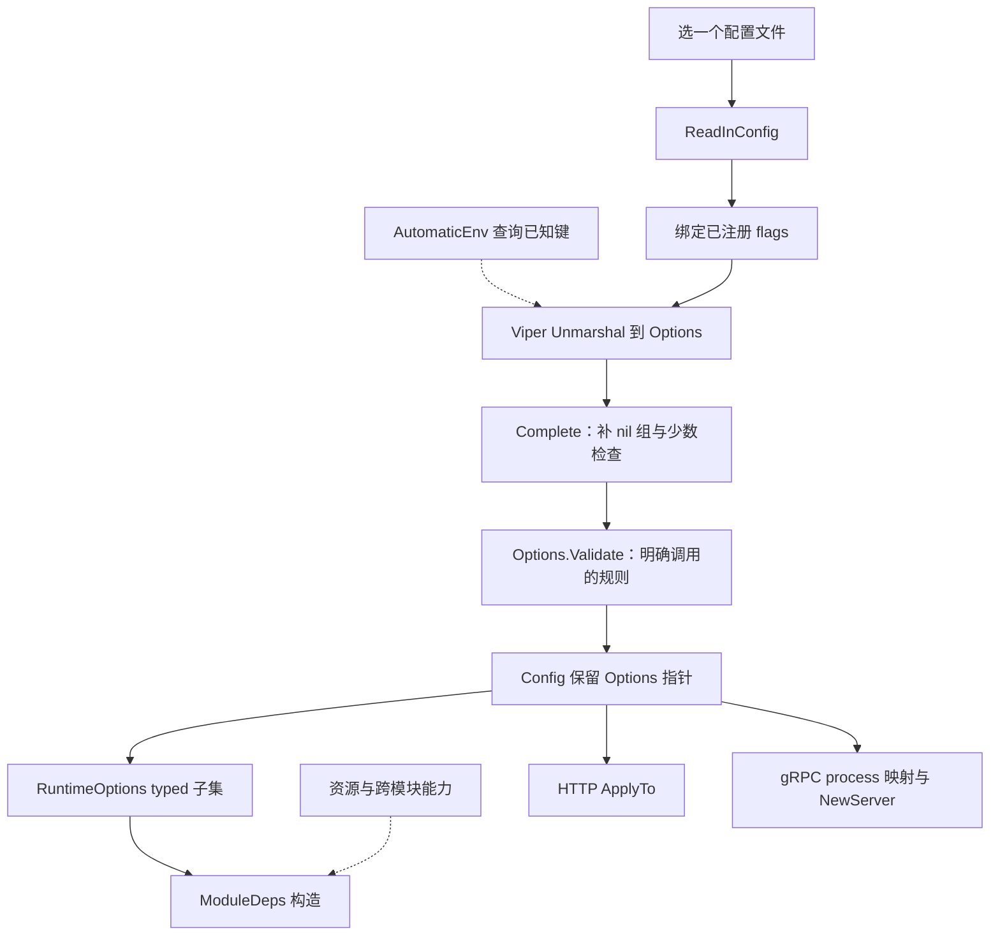
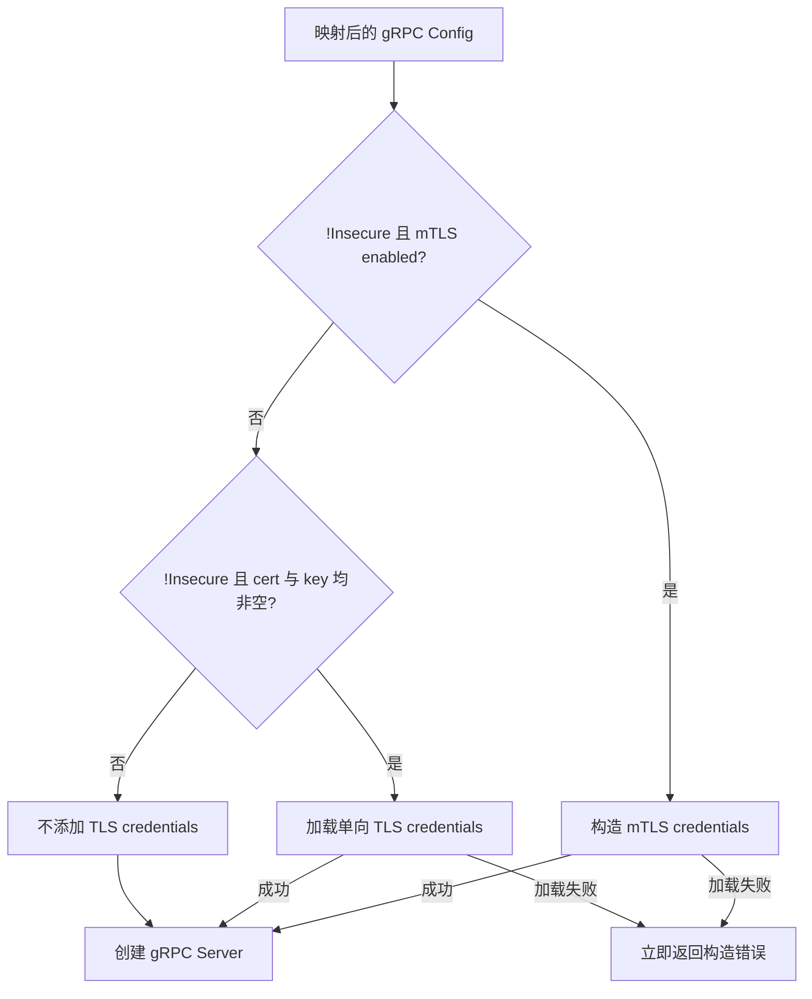

# 配置与传输装配：输入、生效条件和安全边界

> 状态：已实现 · 按当前源码及锁定依赖逐篇复核。本文区分输入、校验、转换、实际装配与运行证据；候选改进尚未实施。

IAM 的配置沿着“选中文件 → 合并已登记输入 → Options → 校验 → 模块/传输配置 → 构造组件”进入进程。每一层只证明自己的合同：YAML 能解码，不证明标准启动成功；`Insecure=false`，也不证明 gRPC 已安装 TLS credentials。排查配置问题，应找出字段在哪一层被读取、回填、忽略或改变，而不是只核对配置文件的文字。

本文拥有通用输入、有效配置和传输装配规则。[启动与组合根](01-启动与组合根.md)维护准备顺序及失败清理；[后台、就绪与关闭](03-后台任务就绪与优雅关闭.md)维护持续可用性和摘流量；各模块主文拥有 TTL、同步预算、准入与业务规则。

## 1. 什么应当由配置表达

| 输入或事实 | 例子 | 责任与变化方式 |
| --- | --- | --- |
| 运行参数 | 监听端口、连接地址、Token TTL、刷新周期 | Options 输入，再由对应组件消费；字段存在不等于已消费 |
| 受信服务准入 | 证书限制、RPC ACL、Assignment 可授予 Role 集合 | 部署配置限定服务调用边界；它们是安全策略，不只是性能参数 |
| 业务事实 | User 状态、Role/PermissionGrant、用户的 Assignment、WechatApp | 领域/应用通过持久化端口及事实事务管理；不能用部署 allowlist 冒充某用户已有岗位 |
| 运行状态 | 模块 Available、已加载策略版本、readiness | 由本次装配和运行产生；不由 YAML 声明为成功 |
| 秘密或引用 | DB 密码、IDP encryption key、TLS 私钥文件 | 注入与日志保护另有合同；路径不是证书已加载的证明 |

例如，把 `qs-apiserver.svc` 可授予的 Role ID 写进准入文件，是限制服务管理权；真正给 `user:42` 分配 Role，还须经过请求准入、应用规则和数据库事务。两者不能合并成“角色只在数据库”或“配置已授权用户”。具体集合与方法边界见[服务间授权](../02-业务模块/03-AuthZ/06-关键链路-gRPC服务间授权与SDK.md)。

## 2. 配置怎样进入 Options

### 2.1 先选一个文件，再解码已登记的键

标准入口使用本仓 `pkg/app`，basename 为 `iam-apiserver`。显式 `-c/--config` 选择一个文件；未指定时搜索当前目录、`configs`、`~/.iam`、`/etc/iam` 下的 `iam-apiserver.*`。仓库的 `apiserver.dev.yaml` 与 `apiserver.prod.yaml` 不会因文件名含 dev/prod 自动被选择。读文件失败直接退出，环境变量不能替代这一阶段的必需文件；独立 Suggest 配置示例也不会自动合并。



配置/环境由全局 Viper 及 Cobra initializer 管理，并非每个 App 独立的输入对象。标准执行中先读文件，RunE 再绑定 flags、解码并执行 Complete/Validate；不能用直接调用 `CreateConfigFromOptions` 替代这条入口合同。

环境变量前缀是 `IAM_APISERVER`，`.` 与 `-` 在环境名中替换为 `_`。对于**键名一致且已登记**的字段，changed flag 优先于非空环境变量，再优先于 YAML，最后使用默认值。已有测试具体证明 `server.mode` 的这条优先级，不代表所有字段的 CLI 名称、tag 和转换都匹配。

Options 只为 Log、Server、GRPC、HTTP insecure/secure、MySQL、Redis、NSQ、Migration 注册 flags。Auth、AuthZ、JWKS、IDP、Identity、Health、Suggest、Events 等没有逐字段 CLI flags；gRPC 也只注册 bind address、业务端口、health 端口三个参数，安全子组靠其它输入进入。

### 2.2 三个容易误读的输入案例

| 输入场景 | 当前源码行为 | 为什么不能从日志或测试名推导成功 |
| --- | --- | --- |
| YAML 有 `server.mode: debug`，环境为 `IAM_APISERVER_SERVER_MODE=test` | 键已登记，环境覆盖为 test；changed `--server.mode=release` 又优先 | 这一同名键已有优先级回归；不能推广至命名错配的字段 |
| YAML 有 DB 密码，环境把同名密码设为空串 | 锁定 Viper 默认忽略空环境值，不能据此清除 YAML 密码 | presence 输出仍会显示 `<set>`；显式 changed 空 flag 属于另一条路径 |
| 只设置一个 YAML/flags/BindEnv/default 都未登记的环境键 | AutomaticEnv 不主动枚举所有环境键；普通 Unmarshal 的 AllKeys 可能没有它 | Options 构造器已有该字段，也不等于 Viper 已登记输入键 |

第三类的具体 Suggest 案例、转换默认和直接构造差别由[Suggest 配置主文](../02-业务模块/05-Suggest/04-模块边界与代码索引.md#5-配置键来源转换与作用阶段)维护。类似地，打印 `IAM_APISERVER_IDP_ENCRYPTION_KEY=<set>` 只证明环境中有这个名字，仍要核对所选文件是否登记了该键、最终 Options 是否获得值，以及资源阶段能否消费。

还有一个实际命名偏移：MySQL 字段 tag 是 `mysql.log-level`，flag 却是 `--mysql.log-mode`。当 YAML 给出 `log-level: 1` 时，flag 先写入的字段可被后续 Unmarshal 按 YAML 键重写；本仓未发现 alias。这个结果是源码条件推导，本轮未做专项 CLI 实验，不能将 `server.mode` 的测试用作它的覆盖证据。

### 2.3 未知键与退役键不是同一套校验

标准入口调用普通 `Unmarshal`，没有启用 Exact。锁定 Viper 默认允许未使用的键及弱类型转换；拼错的 `server.mdoe` 可被忽略，保留程序默认 release。环境名替换规则不等于 YAML 自动把 `_` 与 `-` 归一化。

已登记的退役字段则有专门 tombstone：解码得到非 nil 指针后 Validate 拒绝；固定退役环境名使用 `LookupEnv`，存在即拒绝，包括空串。这不能推广为任意未知键都拒绝，也不能把 YAML `null` 或另一种拼写当成已经命中 tombstone。现有退役键回归证明的是指定键及值的路径。

## 3. 程序默认、仓库样例与部署输入

文件名不是运行模式，`server.mode` 的最终输入才决定 profile。下表只比较本仓静态输入，不宣称线上正采用这些值。

| 项目 | NewOptions | dev YAML | prod YAML |
| --- | --- | --- | --- |
| mode | release | debug | release |
| HTTP insecure / secure 端口 | 9080 / 9444 | 18081 / 18441 | 9080 / 0 |
| gRPC / HTTP health 端口 | 9090 / 9091 | 19091 / 19092 | 9090 / 9091 |
| gRPC mTLS / 方法 ACL | 均关闭 | 均开启，指定文件 | 均开启，指定文件 |
| gRPC application Auth | 关闭 | 关闭 | 关闭 |
| password lockout | 关闭，阈值 5 / 15m | 关闭，阈值 5 / 15m | 开启，阈值 5 / 15m |
| Seed Mock | 关闭，secret 空 | 未声明，沿用默认 | enabled=true，secret 空，待注入 |
| reliable messaging / SDK consumer / NSQ | 均默认关闭 | 可靠开关未声明、SDK 未声明、NSQ=false | reliable=false、无 NSQ 组 |

NewOptions 的 secure 端口默认开启，但证书路径为空，Complete 就会失败；它不是零配置可启动方案。prod YAML 开启 Seed Mock 却未填 secret，标准 Validate 会拒绝；dev YAML 的 HTTPS 文件检查也要求部署的路径存在。

当前标准 `prepareMessaging` 只接受可靠消息、SDK consumer 和 NSQ 显式开启，还要求数据库/schema、legacy drained 与传输准备通过。因此上述文件**原样输入不能据解码测试推定可启动**；debug/allow-degraded 也不能绕过可靠消息门禁。准备后果归[启动主文](01-启动与组合根.md)。

生产镜像默认 `--config=/app/configs/apiserver.prod.yaml`；prod compose 又以宿主 configs 覆盖镜像目录，并注入生成的 `config.prod.env`。CD 的实际输入还有一层转换：

| 包生成输入 | 输出给进程的环境键 | 当前生成规则 |
| --- | --- | --- |
| `IAM_RELIABLE_MESSAGING_ENABLED` | `IAM_APISERVER_EVENTS_RELIABLE_MESSAGING_ENABLED` | workflow 与脚本 fallback 都为 false |
| `IAM_NSQ_CONSUMER_SDK_ENABLED` | `IAM_APISERVER_NSQ_CONSUMER_SDK_ENABLED` | fallback 为 false；true 时检查 reliable/lookupd/nsqd 前置 |
| NSQ 主机与端口 | `IAM_APISERVER_NSQ_*` 地址及 enabled | 有 lookupd 才 enabled；SDK=true 才写 nsqd HTTP endpoints |
| Seed Mock 选择与 secret | `IAM_APISERVER_SEED_MOCK_AUTH_*` | enabled 默认 true；开启时脚本要求 secret |

这里有尚未消除的默认值错位：包生成允许 reliable/SDK=false，当前标准服务准备却要求 true。包生成测试验证字符串与输入拒绝，不启动 apiserver。部署变量可以覆盖 fallback，但本轮没有读取线上变量、Secret 或进程，实际部署是否满足条件仍为 unknown。配置验收应绑定镜像/SHA、选中文件、覆盖项及运行结果，不能只保存仓库 prod YAML。

## 4. 校验和转换分别保证什么

### 4.1 profile 是共同规则，不是只解析一次的不可变对象

`RuntimeProfile` 将 debug/test/release 分别归一为 development/test/production；其它值拒绝。Server Complete/Validate/ApplyTo、生产专题规则和 process 准备会分别调用解析。标准 process 将捕获的 Environment 传给模块与 Router，但 HTTP 又按 Config 中的 Options 解析 mode。

标准入口共享的是输入与解析语义。直接调用 RuntimeOptions 转换时，Environment 是 caller 提供的参数，没有强制与 `server.mode` 一致的校验。不能由 typed 参数或测试矩阵推导整个进程只解析一次、配置已冻结或所有其它入口都不会分叉。

release 下 `allow-degraded-startup=true` 的有效结果仍是“不允许降级”；不是整个配置一定因此报错。feature flag 则表示计划启停某能力，例如 Suggest=false，两者拥有不同目的与门禁。

### 4.2 当前早期校验不是所有组 Validate 的总和

| 层 | 实际工作 | 仍未证明的事项 |
| --- | --- | --- |
| Options.Complete | 给 nil 组补默认；Server.Complete；Secure.Complete | 不逐字段统一回填；失败会短路后续 Validate |
| Secure.Complete | secure port 非零时要求 cert/key 路径且 `os.Stat` 成功 | 不解析 PEM、不校验证书与私钥匹配；port=0 跳过这项检查 |
| Options.Validate | Server、MySQL、Log；发行 audience、AuthZ sync、可靠消息/SDK 前置、退役项、生产日志/SMS、Seed secret、锁定、Worker、readiness、JWKS 等具体规则 | 没有聚合 GRPC、Secure、Insecure、Redis、NSQ、Migration 各自 Validate；存在方法也不等于被调用 |
| Config / RuntimeOptions 转换 | ApplyDefaults 与 typed 映射 | 不再次 Complete/Validate；不是完整资源或网络验证 |
| 组件构造 / Run | 解析所用证书、加载 ACL、建立依赖或实际监听 | 只对到达且执行的分支负责；仍有未拒绝的组合，见第 6 节 |

例如 gRPC port=70000 不会由 Options 的早期范围校验统一拒绝，后续实际监听才可能失败；这里只说明校验调用范围，不承诺它越过其它启动前置后一定在哪个时刻退出。也不能简单“把所有 Validate 都调用一遍”就视为解决：NSQ 的局部 Validate 本身没有完成地址拒绝逻辑。

### 4.3 typed 子集收缩依赖，未承诺深拷贝或完整消费

`Config` 保留原 `*Options`；RuntimeOptions 对多数组做值复制，Auth 的 slice 等仍可共享底层数据，NSQ 两组地址才显式 clone。模块除运行参数外，还通过 ModuleDeps 接收 DB、Redis 和跨模块能力。这能减少模块读取全局配置的范围，不能保证输入不可变、每个字段都已映射或资源隔离。

具体下游可能自行复制，例如 AuthN 再复制通知 App IDs；不能倒推整个 RuntimeOptions 是冻结快照。当前没有通用 YAML 热更新机制；mTLS 证书文件 autoReload 是独立任务，不能用它承诺运行参数、方法 ACL 或业务准入文件自动重载。

端口的零值也不是统一“关闭”：

| 输入 | 当前实际路径 |
| --- | --- |
| `secure.bind-port=0` | HTTP HTTPS 分支关闭，但证书路径仍可参与 gRPC fallback |
| `insecure.bind-port=0` | HTTP 仍监听 `:0`，由系统分配临时端口；不是禁用 HTTP |
| `grpc.bind-port=0` | gRPC Config.Complete 回填 **8090**，并非 NewOptions 的 9090 |
| `grpc.healthz-port=0` | 回填 9091，不是禁用探针 |

类似地，`nsq.msg-timeout` 没进入当前 RuntimeOptions/标准消费者映射；gRPC Config 中的 ReadTimeout/WriteTimeout 没有变成通用 RPC deadline。参数列表应按消费者核对，不能据注释或字段默认值承诺运行行为。

## 5. REST：注册条件、身份与业务规则分开

Router 先注册基础路由，再检查 Container 和模块能力。其输入是 ModuleState、handler/capability 与 middleware，不直接以 `server.mode` 决定所有业务路由。

| 路由类别 | 注册所需依赖或门禁 | 之后仍需检查 |
| --- | --- | --- |
| `/health`、`/readyz`、`/ping`、`/debug/routes`、`/debug/modules`、静态契约入口 | 基础注册，不挂模块级 JWT/权限门禁；debug 两项也不是 cache governance 的 admin 规则 | 各自响应内容、外部网络暴露与实例 readiness |
| 公开登录 / 公开 JWKS 读取 | AuthN module 可用及对应 handler | 具体认证、证明消费、准入或密钥可用性；公开不等于跳过用例规则 |
| AuthZ 管理 | 外层要求 AuthZ 可用、handler、JWT、checker；局部才先注册 health/410，再凭 Role handler 注册管理组 | 路由动作、应用管理可见性/写入复核、Role 保护和事务 |
| IDP 应用管理、JWKS 管理、Session 管理 | 各自 handler 及 JWT/checker；各局部条件不同 | 不统一要求所有入口额外满足 AuthZ ModuleState；对象与敏感操作规则另查 |
| Identity 自服务 | Identity 可用、handler、JWT | 当前用户/对象归属及 ProfileLink 等应用规则 |
| Suggest | Suggest 可用、Querier、JWT；仅 AuthZ 可用且 checker 存在时叠加 profiles/search | 无 checker 的 facts reader 给零全量/手机号能力，但保留局部 owner/Org/ProfileID 可见性 |
| cache governance debug | 环境/显式开关与 admin protection | release 强制 admin；不能推广至上面的基础 debug 两项 |
| internal Seed Mock | enabled、非空 secret、对应 handler | shared secret 在 payload 校验前验证；仍执行注册用例 |

Seed Mock 的程序默认关闭，prod **样例**与部署包默认开启。标准入口中开启但 secret 空会先 Validate 失败；绕过标准校验直接调用 Router，才表现为跳过注册。不能写成“生产缺 secret 也能启动，只少一条路由”。

例如路由表里看不到 AuthZ 410 墓碑，可能是组合层缺安全能力而未进入局部 Register；不能据局部代码保证所有实例都返回 410。Suggest 直接 Router 测试构造的退化组合，也不证明当前可靠模式允许缺关键模块启动。详细规则回链[REST 管理](../02-业务模块/03-AuthZ/05-关键链路-REST管理与路由授权.md)与[Suggest 查询](../02-业务模块/05-Suggest/03-关键链路-SuggestProfile查询.md#31-标准入口与直接调用有不同合同)。

## 6. gRPC：配置值必须追到实际 credentials

### 6.1 映射和构造使用不同条件

实际标准路径是 `process.applyGRPCOptions → grpc.Config.Complete → NewServer`。不要把另一个 Options.ApplyTo helper 的实现当作本路径。

process 逐项复制 gRPC cert/key；只有**两者都空**才回退到 SecureServing 中的路径，与 HTTP secure 端口是否关闭无关。随后计算：

```text
Insecure = 输入 insecure && !mTLS.enabled && certFile==空 && keyFile==空
```

这个 boolean 没有表达“需要 TLS、完整证书、credentials 已装配”三种不同事实。实际构造如下：



| 关闭 mTLS 后的输入 | 映射/构造结果 | 暴露出的合同缺口 |
| --- | --- | --- |
| gRPC cert/key 都空，HTTP 也无路径，insecure=true | Insecure=true，无 credentials | 显式明文路径 |
| gRPC cert/key 都空，HTTP 有完整路径 | fallback 后 Insecure=false，加载单向 TLS | 即使 HTTPS port=0，gRPC 也可能使用其文件 |
| gRPC 只填 cert 或只填 key | 不执行 fallback，Insecure=false；构造条件不满足，未添加 credentials | 不会仅因半套路径在此处报错；false 不能证明安全传输 |
| gRPC/HTTP 都无路径，insecure=false | Insecure=false，但没有可加载的 pair，未添加 credentials | 请求“安全”不等于实现拒绝缺失证书 |

后两项是已核对源码条件，**本轮没有运行监听/握手复现**，也不据此断言线上采用了这组输入。现有 process 测试覆盖完整 fallback 和若干字段映射，没有覆盖这些反例的 wire 行为。

mTLS enabled 时进入另一条分支，尝试解析证书/CA；成功安装 credentials，构造失败则立即返回错误。`require-client-cert` 虽被映射、测试保留 false，NewServer 却硬编码 `RequireClientCert: true`；最终要求并验证客户端证书。不能从中间 Config 测试承诺该设置能关闭握手要求。

### 6.2 握手、服务名、方法与请求内容是四项检查

证书额外白名单分别检查 CN、OU、DNS SAN；某类列表非空才检查，多类非空时都须通过。`allowed-sans` 并未覆盖所有 SAN 类型。通过这些限制后，identity extractor 优先从 SPIFFE URI 的 `sa` 提取 serviceName，再回退 CN；namespace/OU 也不代表业务 Org。

例如证书 CN 符合允许列表，但 URI 得到的 serviceName 不在方法 ACL 中，握手可通过而 RPC 被拒绝。这个例子说明规则的分层，不是本轮证书变体实验。ACL 决定 caller 能否调用方法；方法内部的 Assignment 内容准入再限定 Role/操作/目标，目标用户的业务 AuthZ 与它们仍是不同事实。

通用 NewServer 只有 `ACL.Enabled && ConfigFile非空` 才加载 ACL、装拦截器；标准 AuthZ 初始化另以 LoadWithACL 拒绝启用后的空文件。不能把通用构造器的空路径分支描述为标准启动已经存在的绕过。启动交叉比对也只覆盖部分 Assignment 写方法，详细边界由[AuthZ gRPC 主文](../02-业务模块/03-AuthZ/06-关键链路-gRPC服务间授权与SDK.md)拥有。

`Auth.Enabled=true` 同样不代表 IAM 已装好 Bearer/HMAC/APIKey verifier：当前构造的是空 CompositeValidator，没有注册机制验证器；组件遇到这些凭据会返回 unsupported credential type，映射为 Unauthenticated。相应 bool 主要被复制/打印，旧 ServiceToken 已退役。未来使用扩展点还须显式注入 validator 并核对 unary/stream 差异，不能只修改开关。

### 6.3 注册与健康不构成安全验收

Container 按模块可用性收集 registration，Registry 执行传入的 callback并跳过 nil callback；传 nil server 也返回 nil。callback 没有 error 返回，现有注册结束标记不检查所有期望业务服务都存在。MarkAllServicesServing 按实际表更新，只有 health 而无业务 service 仍可能整体 SERVING。

反射默认开启。锁定 grpc v1.80.0 的 Register 同时注册 v1/v1alpha，锁定 component-base 的默认 skip 仅包括 Health Check/Watch 和 **v1alpha** reflection 的身份/ACL拦截器；v1 不在这个默认列表，传输 TLS 握手仍适用。不能写“所有 reflection 都跳过认证”。这是当前锁定源码范围，本轮未发真实反射请求。

SERVING、独立 HTTP health 端口、完整 REST readiness 和业务调用成功必须分别保存证据。Suggest 当前没有 proto/registration/SDK；一个 proto service 存在也不证明本实例执行了注册。

## 7. 秘密保护和有效配置的可观测性

当前三个打印机制已有保护，但范围不同：

| 打印机制 | 保护方式 | 能证明什么 |
| --- | --- | --- |
| Options.String | JSON 排除标为 `json:"-"` 的已知秘密字段 | 当前字段的非秘密 Options 值；没有证明之后转换/消费者生效 |
| PrintFlags | 名称含 password/secret/token/key/credential 时输出 presence | flags 阶段的值；发生在 Viper Unmarshal 前，不是 YAML 的最终值报告 |
| printViperConfig | 列键及固定环境名的 `<set>/<unset>`，不输出配置/env 值 | 输入名存在；空值、未登记键和转换差异仍须追查 |

新的秘密字段需要延续排除/脱敏合同；不能从已有 sentinel 测试推导任意新增名字都安全。证书路径、DB 主机、用户名等可打印输入也不应被当作公开业务内容。

排查时保存“选中文件与版本、非秘密覆盖项、最终消费分支、运行结果”比输出完整 Options 更有用。真实秘密应经受限环境文件、Secret 或 secret manager 注入；日志/处置的完整规则由[安全日志与凭据处置](../05-工程质量与运维/04-安全日志与凭据处置.md)维护。本轮没有读取或发布部署秘密。

## 8. 候选改进：按失败后果选择设计

以下方案尚未实施；它们解决不同问题，不能合写成“加强配置校验”。

| 当前问题 | 具体候选设计 | 收益、成本与验收要求 |
| --- | --- | --- |
| env-only 键遗漏、拼写错误、flag/tag 错配 | 一份运行键登记表维护 tag、flag、env、默认、兼容 alias 和退役项 | 能检查映射与未知输入；需维护 schema 同步。先剥离 config/version/help 等 CLI 控制键，不能直接把当前整组 Unmarshal 换成 Exact |
| 校验分散，安全 boolean 不表达已装配状态 | Normalize/Validate 产出明确 Plain/TLS/mTLS 模式；拒绝半套 pair、需要 TLS 却无 pair 的输入，定义客户端证书配置合同 | 在构造前拒绝危险组合；改变旧输入的接受范围。验收须包含完整 pair、缺/半套、HTTPS fallback 和 require-client-cert 的真实正反握手 |
| Options 被共享、多次解析与部分转换 | 对标准和直接入口统一生成冻结运行配置，明确 slice/pointer 克隆及资源借用；动态证书更新单独建版本合同 | 防止输入/Environment 分叉；不能顺带承诺 ACL/业务规则热更。兼容调用者及资源所有权有迁移成本 |
| 模板/部署包默认不满足标准启动 | 把支持的启动模式、required 开关与依赖作为包生成的显式校验；发布记录保存脱敏有效摘要与产物版本 | 较早拒绝不支持组合；模板和发布变量需同时迁移。包生成、完整 Prepare、ready 与实际业务仍分层验收 |
| 注册完成被当作能力完整 | 给预期服务/路由及保护依赖建立可核对清单，与实际表和机器契约比对 | 能发现遗漏；不能据存在性证明对象授权。测试需分别覆盖注册矩阵与真实 middleware/方法正反请求 |

配置把运行选择集中起来，typed 注入把模块所读范围收窄；目前的代价是输入名、校验调用和消费者仍分散。后续设计应围绕这三份合同收敛，而不是把全部运行状态放回一个巨大的 Config。

## 9. 代码入口与本篇证据边界

| 关注点 | 代码与现有测试 |
| --- | --- |
| 文件/env/flags/打印与标准校验 | `pkg/app/{config,app}.go`、`pkg/flag/flag.go`；两个 security test |
| 默认、校验覆盖、退役与专题门禁 | `internal/apiserver/options/{options,validation,runtime_options}.go`；audience/reliable/security tests |
| 文件解码与局部优先级 | `internal/apiserver/config/config_contract_test.go`；其中 MapsToRuntimeOptions 名称实际主要断言 Options 字段与 Config 同指针，没有执行 RuntimeOptions 转换 |
| typed 映射与共同 profile | `container/runtime_options.go`、`internal/pkg/options/server_run_options.go`、`internal/pkg/server/runtime_profile.go` |
| HTTP/gRPC 零值和 TLS 构造 | `internal/pkg/server/{config,genericapiserver}.go`、`process/grpc_server.go`、`internal/pkg/grpc/{config,server}.go`；process 两项映射测试 |
| REST 注册矩阵与能力收集 | `transport/rest/{router,module_routes,base_routes}.go`、`container/rest_deps.go`；matrix/router/deps tests |
| gRPC 注册 | `transport/grpc/registry.go`、`container/grpc_registry.go`；父包 collector/Registry tests，固定 proto 文本检查 |
| 部署输入转换 | `scripts/cd/prepare-package.sh`、`.github/workflows/cd.yml`、`build/docker`；两项 package 模式回归 |
| 锁定组件行为 | component-base v0.8.0 的 `pkg/grpc/{mtls,interceptors}`；Viper v1.20.1；grpc v1.80.0 reflection |

本篇复用既有测试而不增加文档镜像测试：Options、配置、通用 options、App、flag、REST 六整包，以及 process gRPC 映射、Container REST/gRPC collector、CD 包模式选择的明确子集。具体包/事件数、源码摘要、图和门禁结果登记于[阶段复核记录](../_data/reviews/2026-10-06-docs-refactor.md)。

这些测试覆盖局部规则、人工模块组合、路由出现/消失、部分 shared-secret 请求和生成包字符串；OpenAPI 自动路由比较主要为 v2/公开 JWKS，另有若干 v3/v4存在性断言。没有完整 App CLI、env-only/空 env/未知键/命名错配专项，也没有完整标准启动、半套证书网络实验、全部 RPC 安全矩阵或当前生产验收。本篇将这些缺口保留为源码条件与候选，不用绿色文档检查替代运行证明。

transport 经 application 访问基础设施是主约束；IDP GetWechatApp 仍由 gRPC service 直接读 Repository/Vault，例外及敏感契约由[IDP 代码索引](../02-业务模块/04-IDP/04-模块边界与代码索引.md)维护。AuthZ 同步预算由[多实例策略收敛](../02-业务模块/03-AuthZ/04-关键链路-多实例策略收敛.md)维护，不在本篇建立另一套参数说明。
