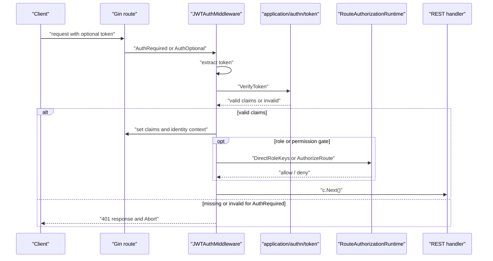
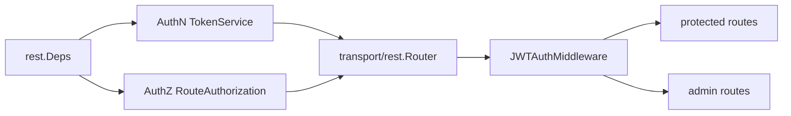
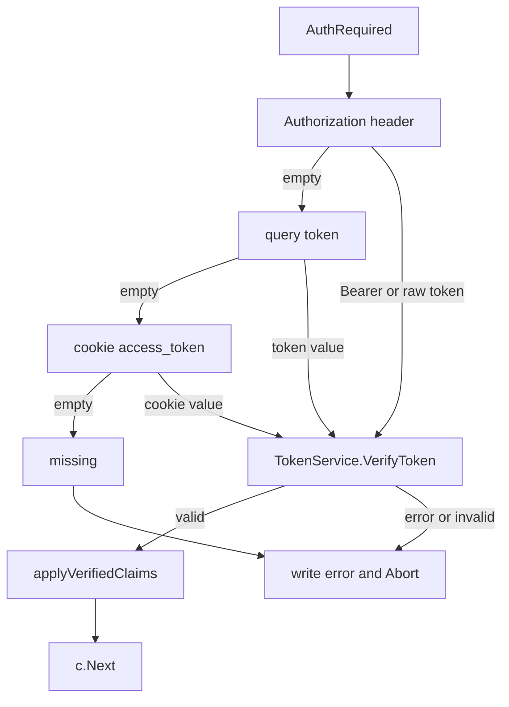
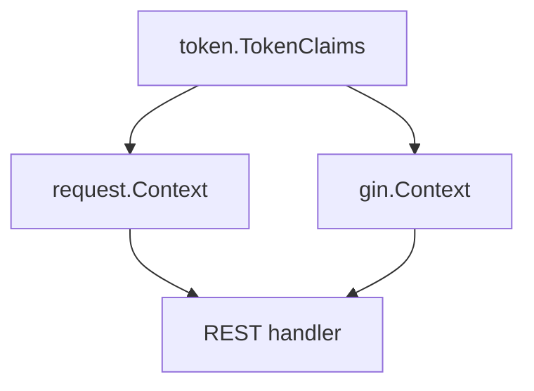
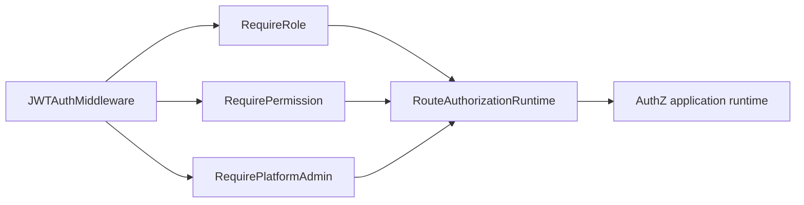
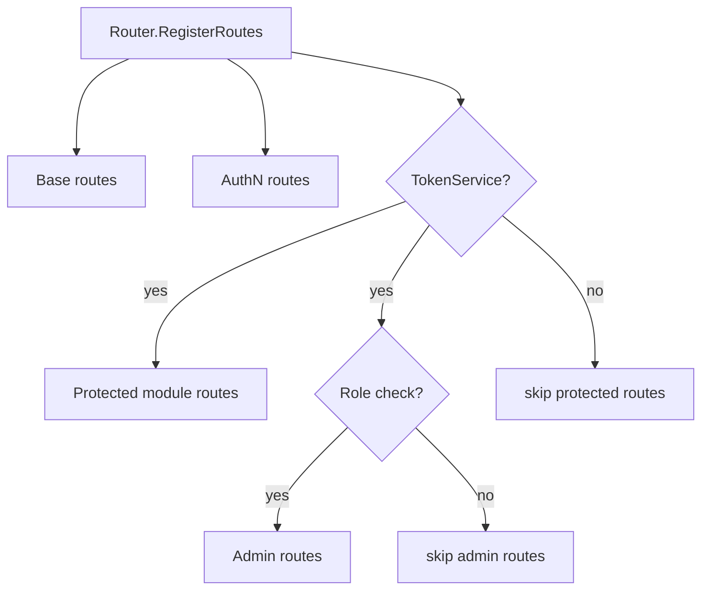

# HTTP 认证中间件与身份上下文

## 本文回答

本文回答：REST protected routes 如何通过 JWT 建立当前身份、如何把 claims 写入 Gin 和 request context、如何接入 AuthZ 路由级授权，以及 IAM 为什么选择“依赖缺失时不注册受保护路由”的 fail-closed 边界。

## 30 秒结论

- HTTP 认证中间件由 REST router 在 `resolveRouteDependencies` 阶段创建，依赖 AuthN 的 `TokenService` 和 AuthZ 的 `RouteAuthorizationRuntime`。
- `AuthRequired` 的 token 提取顺序是 `Authorization` header、query `token`、cookie `access_token`；缺失、验证失败或 claims 无效都会写错误响应并 `Abort`。
- `AuthOptional` 只在 token 有效时注入身份；无 token 或无效 token 都允许请求继续。
- 验证通过后，middleware 注入 `claims`、`user_id`、`account_id`、`tenant_id`、`token_id`；`session_id` helper 存在，但当前认证链不写入 session id。
- `RequireRole`、`RequirePermission`、`RequirePlatformAdmin` 都依赖 `RouteAuthorizationRuntime`；没有该依赖时 admin routes 不注册，路由级权限检查返回不可用。
- IAM 的安全边界在注册阶段就 fail-closed：AuthN TokenService 不存在时，AuthZ、Identity、Suggest 等 protected routes 不注册。

## 主图：HTTP 身份链路



## 重点速查

| 问题 | 当前答案 | 代码证据 |
| ---- | ---- | ---- |
| 中间件在哪里创建 | `Router.resolveRouteDependencies` 在 AuthN `TokenService` 存在时创建 `JWTAuthMiddleware`。 | [../../internal/apiserver/transport/rest/router.go](../../internal/apiserver/transport/rest/router.go) |
| token 如何验证 | `AuthRequired` 和 `AuthOptional` 调用 `TokenApplicationService.VerifyToken`。 | [../../internal/pkg/middleware/authn/jwt_middleware.go](../../internal/pkg/middleware/authn/jwt_middleware.go)、[../../internal/apiserver/application/authn/token](../../internal/apiserver/application/authn/token) |
| 身份写到哪里 | `applyVerifiedClaims` 写 Gin context 和 request context。 | [../../internal/pkg/middleware/authn/jwt_middleware.go](../../internal/pkg/middleware/authn/jwt_middleware.go)、[../../internal/pkg/middleware/authn/context_keys.go](../../internal/pkg/middleware/authn/context_keys.go) |
| 路由级授权在哪里 | `RequireRole`、`RequirePermission`、`RequirePlatformAdmin` 调用 `RouteAuthorizationRuntime`。 | [../../internal/pkg/middleware/authn/jwt_middleware.go](../../internal/pkg/middleware/authn/jwt_middleware.go) |
| protected routes 谁决定注册 | `registerModuleRoutes` 对 AuthZ、Identity、Suggest 做 auth middleware 判定。 | [../../internal/apiserver/transport/rest/module_routes.go](../../internal/apiserver/transport/rest/module_routes.go) |
| admin routes 如何保护 | `registerAdminRoutes` 要求 `SupportsRoleCheck()`。 | [../../internal/apiserver/transport/rest/admin_routes.go](../../internal/apiserver/transport/rest/admin_routes.go) |
| 路由注册边界如何测试 | REST router tests 锁定 admin 和 protected routes fail-closed。 | [../../internal/apiserver/transport/rest/router_test.go](../../internal/apiserver/transport/rest/router_test.go) |

## 1. 中间件的装配位置



`container.BuildRESTDeps` 只负责把模块能力投影成 REST deps。真正创建中间件的是 [../../internal/apiserver/transport/rest/router.go](../../internal/apiserver/transport/rest/router.go)：

1. `resolveRouteDependencies` 复制 AuthN、AuthZ、IDP、User、Suggest deps。
2. AuthN `TokenService` 不为空时，创建 `NewJWTAuthMiddleware(tokenService, routeAuth)`。
3. 中间件支持 role check 时，拼出 admin middlewares：`AuthRequired()` + `RequirePlatformAdmin()`。
4. module/admin route registration 根据这些能力决定是否注册路由。

这样做的设计意图是让 transport 层拥有 HTTP 中间件和路由注册知识，而 AuthN/AuthZ application service 只提供业务能力。

## 2. Token 提取和认证语义



| 步骤 | 当前行为 | 边界 |
| ---- | ---- | ---- |
| Header | 支持 `Bearer <token>`，也支持 header 直接是 token。 | Header 优先级最高。 |
| Query | 读取 `token` query parameter。 | 主要用于特殊集成场景，不应作为常规浏览器登录形态。 |
| Cookie | 读取 `access_token` cookie。 | 优先级低于 header 和 query。 |
| Verify | 调用 AuthN application token service。 | middleware 不解析签名细节，也不直接碰 keyset。 |
| Missing/Invalid | `AuthRequired` 写错误响应并 abort。 | 不进入 handler。 |
| Optional | `AuthOptional` 验证失败也允许通过。 | 只是不写身份上下文。 |

`AuthRequired` 和 `AuthOptional` 的差异是“是否强制身份存在”，不是“是否验证 token”。只要请求带了 token，二者都会调用 `VerifyToken`。

## 3. 身份上下文模型



| 字段 | 写入位置 | 来源 | 当前用途边界 |
| ---- | ---- | ---- | ---- |
| `claims` | Gin context | `TokenVerifyResult.Claims` | handler 或后续 middleware 可读取完整 claims。 |
| `user_id` | Gin context；request context 中也写入 `ContextKeyUserID` | `claims.UserID` | 路由级授权构造 `user:<id>` subject。 |
| `account_id` | Gin context | `claims.AccountID` | 账户维度 handler 可读取。 |
| `tenant_id` | Gin context | `claims.TenantID` | `TenantIDFromGin` 优先读该值；没有时回退默认 tenant。 |
| `token_id` | Gin context | `claims.TokenID` | 可用于 token/session 相关审计或撤销入口。 |
| `session_id` | 当前认证链不写入 | 无 | `GetCurrentSessionID` helper 存在，但不要假设 JWT middleware 会设置它。 |

这层不是领域模型。它是 transport 中的请求身份上下文，目的是把 AuthN claims 传给后续 HTTP handler 和路由级授权检查。

## 4. 路由级授权运行时



`RouteAuthorizationRuntime` 是 AuthN middleware 与 AuthZ runtime 的最小接口，包含两类能力：

| 方法 | 用途 | 当前调用方 |
| ---- | ---- | ---- |
| `AuthorizeRoute(ctx, sub, tenantID, resourceKey, action)` | 对资源和动作执行路由级授权判定。 | `RequirePermission` |
| `DirectRoleKeys(ctx, sub, tenantID)` | 查询 subject 在 tenant 下的 role keys。 | `RequireRole`、`RequirePlatformAdmin` |

`RequirePlatformAdmin` 会先检查当前 tenant；如果当前 tenant 不是 platform tenant，还会额外检查 platform tenant。这使 admin route 不需要自己重复实现“当前域或平台域具备平台管理员”的判断。

## 5. Protected Route Matrix



| 路由面 | 示例 | 认证/授权边界 |
| ---- | ---- | ---- |
| Base | `/health`、`/ping`、`/debug/routes`、`/debug/modules`、`/openapi`、`/swagger` | 不要求用户 JWT。 |
| Public info | `/api/v1/public/info` | 不要求用户 JWT。 |
| AuthN 登录与令牌 | `/api/v1/authn/login`、`/api/v2/authn/login`、`/api/v1/authn/refresh_token`、`/api/v1/authn/verify` | 不由 JWT middleware 保护；它们属于签发、刷新、校验令牌的入口。 |
| JWKS public | `/.well-known/jwks.json`、`/api/v1/.well-known/jwks.json` | 不要求用户 JWT。 |
| AuthZ | `/api/v1/authz/*` | `registerAuthzRoutes` 要求 AuthZ handlers 和 JWT middleware；模块内 `/health` 也只在 AuthZ module registration 发生时出现。 |
| Identity/ProfileLink | `/api/v1/identity/*` | 要求 JWT middleware；ProfileLink 是当前档案关系能力的标准术语。 |
| Suggest | `/api/v1/suggest/profile` | 要求 Suggest service 和 JWT middleware。 |
| IDP admin | `/api/v1/idp/wechat-apps/*` | 需要 admin middlewares；IDP health 不需要用户 JWT。 |
| AuthN JWKS admin | `/api/v1/authn/admin/jwks/*` | 需要 admin middlewares。 |
| Platform admin | `/api/v1/admin/*` | 需要 `AuthRequired` 和 `RequirePlatformAdmin`。 |

当前实现选择“不满足依赖就不注册受保护路由”。这比注册后在请求时返回 500 更容易被 `/debug/routes` 发现，也避免了安全依赖缺失时误暴露业务面。

## 6. Fail-Closed 规则

| 缺失项 | 当前行为 | 代码证据 |
| ---- | ---- | ---- |
| Container 未初始化 | 只注册 base routes 和允许的 cache governance debug routes，跳过模块路由。 | [../../internal/apiserver/transport/rest/router.go](../../internal/apiserver/transport/rest/router.go) |
| AuthN `TokenService` 缺失 | JWT middleware 不创建；AuthZ、Identity、Suggest protected routes 不注册。 | [../../internal/apiserver/transport/rest/module_routes.go](../../internal/apiserver/transport/rest/module_routes.go) |
| AuthZ `RouteAuthorizationRuntime` 缺失 | JWT 可以认证，但 `SupportsRoleCheck()` 为 false；admin routes 不注册。 | [../../internal/apiserver/transport/rest/router.go](../../internal/apiserver/transport/rest/router.go)、[../../internal/apiserver/transport/rest/admin_routes.go](../../internal/apiserver/transport/rest/admin_routes.go) |
| Admin middlewares 缺失 | JWKS admin、IDP admin、platform admin routes 不注册。 | [../../internal/apiserver/transport/rest/authn/router.go](../../internal/apiserver/transport/rest/authn/router.go)、[../../internal/apiserver/transport/rest/idp/router.go](../../internal/apiserver/transport/rest/idp/router.go) |
| Route authorization 调用失败 | middleware 写内部错误并 abort。 | [../../internal/pkg/middleware/authn/jwt_middleware.go](../../internal/pkg/middleware/authn/jwt_middleware.go) |

## 7. 运行时设计模式

| 模式 | 为什么用 | IAM 中如何落地 | 代价和边界 |
| ---- | ---- | ---- | ---- |
| Chain of Responsibility | 认证、身份注入、角色/权限检查是请求横切链路。 | Gin middleware 顺序组合：`AuthRequired` 后再接 role/admin/permission gate。 | 中间件顺序错误会改变行为；需要保持“先认证，后授权”。 |
| Strategy | token verification 和 route authorization 是可替换能力，不应写死在 middleware。 | middleware 依赖 `TokenApplicationService` 和 `RouteAuthorizationRuntime` 接口。 | 接口太宽会泄露业务细节；当前只保留路由所需最小能力。 |
| Context Carrier | handler 需要稳定读取当前身份。 | `applyVerifiedClaims` 写 Gin context 和 request context。 | context 不是领域状态，不能长期保存或跨请求复用。 |
| Fail Closed | 安全依赖缺失时不能暴露 protected routes。 | protected/admin route registration 要求 middleware 和 role check。 | 排障时会看到“路由不存在”，需要结合 `/debug/routes` 和 `/debug/modules` 判断原因。 |

## 8. 验证入口

```bash
go test ./internal/pkg/middleware/authn ./internal/apiserver/transport/rest
make docs-hygiene
```

如要核对 protected route registration，重点看 [../../internal/apiserver/transport/rest/router_test.go](../../internal/apiserver/transport/rest/router_test.go) 中的 admin fail-closed、protected routes skip 和 ProfileLink routes 测试。
