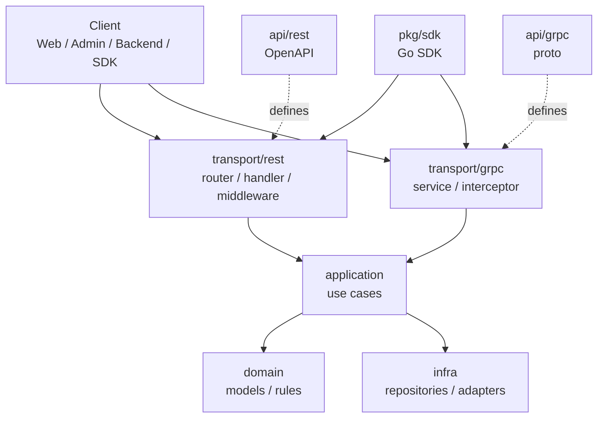
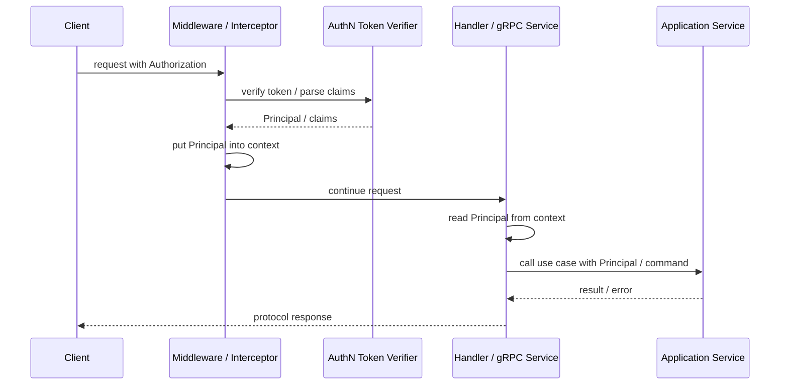

# REST 与 gRPC 传输层装配

> 状态：待补证据 · 第一版正文，待继续按源码、OpenAPI、proto、SDK 和契约测试核对细节。

---

## 1. 本文回答

本文回答 6 个问题：

- REST 和 gRPC 在 iam-apiserver 中分别承担什么职责？
- transport 层如何被 process/container 装配？
- REST handler 和 gRPC service 应该依赖什么，不应该依赖什么？
- middleware 和 interceptor 应该处理哪些横切能力？
- OpenAPI、proto、Go SDK 与 transport 实现如何保持一致？
- 修改传输层时应该运行哪些 Verify？

本文只讲传输层装配，不展开业务模块内部模型，也不复制完整 REST/gRPC 契约。机器契约以 `../../api/rest`、`../../api/grpc`、`../../pkg/sdk` 为准。

---

## 2. 30 秒结论

REST 和 gRPC 是 IAM 的接入形态，不是业务模型。

传输层负责：

```text
协议接入；
路由或 service 注册；
middleware / interceptor；
请求 DTO / proto message 解析；
参数校验；
Principal 提取或认证上下文注入；
调用 application service；
响应 DTO / proto message 组装；
HTTP/gRPC 错误映射。
```

传输层不负责：

```text
领域规则；
用例编排；
事务边界；
repository 查询；
数据库访问；
Casbin matcher；
JWT 签名；
微信 API 调用；
Suggest 索引实现。
```

如果只记一句话：

> REST/gRPC 是协议翻译器：把外部请求翻译成 application 用例调用，再把用例结果翻译成协议响应。

---

## 3. 传输层位置



这张图表达 4 个边界：

```text
OpenAPI 定义 REST 机器契约；
proto 定义 gRPC 机器契约；
transport 实现契约并调用 application；
SDK 封装接入体验，但不替代机器契约。
```

---

## 4. 传输层装配主线

传输层通常由 `process` 和 `container` 协作装配。

主线是：

```text
process 加载配置
  -> container 创建 application services
  -> container 创建 REST handlers / gRPC services
  -> process 创建 HTTP/gRPC server
  -> process 注册 routes / services / middleware / interceptor
  -> process 启动 server
  -> process 在 shutdown 时停止 server
```

职责拆分：

| 对象 | 职责 |
| --- | --- |
| `process` | 管理 REST/gRPC server 生命周期，决定是否启用、监听地址、启动和关闭 |
| `container` | 创建 handler/service 依赖，把 application service 注入 transport 对象 |
| `transport/rest` | 注册 HTTP 路由、middleware、handler、错误映射 |
| `transport/grpc` | 注册 gRPC service、interceptor、错误映射 |
| `application` | 承接用例调用，执行业务编排 |

---

## 5. REST 装配

REST 是 HTTP 接入层。

它面向：

```text
前端；
管理端；
调试工具；
部分业务系统；
Go SDK 的 HTTP transport 实现。
```

REST 装配通常包括：

```text
创建 router；
注册基础 middleware；
注册认证/Principal middleware；
注册模块路由；
创建 handler；
handler 注入 application service；
注册错误映射；
注册 health/readiness endpoint；
启动 HTTP server。
```

REST handler 应该负责：

```text
解析 path/query/body/header；
校验基本参数；
从 context 读取 Principal 或认证结果；
构造 application command/query；
调用 application service；
把 application result 映射为 response DTO；
把 application error 映射为 HTTP status 和 error body。
```

REST handler 不应该负责：

```text
直接访问 repository；
直接操作 DB/Redis；
直接调用 Casbin enforcer；
直接签发 JWT；
直接调用微信 API；
直接构建 Suggest 索引；
直接修改跨模块主表。
```

---

## 6. gRPC 装配

gRPC 是服务间 RPC 接入层。

它面向：

```text
内部业务服务；
后端服务间调用；
高频、强契约的服务通信；
Go SDK 的 gRPC transport 实现。
```

gRPC 装配通常包括：

```text
创建 grpc.Server；
注册 unary/stream interceptor；
注册模块 service implementation；
service implementation 注入 application service；
注册 health service；
注册 reflection 或调试能力；
启动 gRPC server；
shutdown 时 GracefulStop 或 Stop。
```

gRPC service implementation 应该负责：

```text
解析 proto request；
校验必要字段；
从 context 读取 Principal 或认证结果；
构造 application command/query；
调用 application service；
把 application result 映射为 proto response；
把 application error 映射为 gRPC status。
```

gRPC service implementation 不应该负责：

```text
直接访问 repository；
直接操作 infra adapter；
直接复用 REST DTO；
把 proto message 直接传入 domain；
直接返回 infra 原始错误；
直接持有数据库事务。
```

---

## 7. REST 与 gRPC 的共同边界

REST 和 gRPC 的共同原则：

```text
只做协议适配；
只依赖 application service；
不直接依赖 repository；
不直接依赖 DB/Redis/Casbin/JWT/WeChat/Suggest runtime；
不定义领域模型；
不持有事务边界；
不绕过 AuthN/AuthZ 用例。
```

| 关注点 | REST | gRPC | 共同原则 |
| --- | --- | --- | --- |
| 契约来源 | OpenAPI | proto | 机器契约优先 |
| 输入模型 | JSON / query / path / header | proto message | 不直接进入 domain |
| 输出模型 | response DTO | proto message | 由 application result 映射 |
| 错误表达 | HTTP status + error body | gRPC status + details | 由统一错误映射转换 |
| 认证上下文 | middleware | interceptor | 写入 context，供 handler/service 读取 |
| 业务调用 | handler -> application | service -> application | transport 不编排复杂业务 |

---

## 8. middleware 与 interceptor

middleware/interceptor 负责横切能力。

常见能力：

```text
request id / trace id；
结构化日志；
panic recovery；
CORS；
认证 token 解析；
Principal 注入；
超时控制；
限流；
metrics；
审计上下文；
错误标准化。
```

middleware/interceptor 可以做：

```text
解析 Authorization header；
调用 AuthN token verifier 或 JWKS verifier；
把 Principal 写入 context；
记录请求耗时；
转换 panic；
注入 request scoped metadata。
```

middleware/interceptor 不应该做：

```text
执行登录流程；
执行权限写入；
执行复杂业务查询；
直接访问业务 repository；
直接修改 User/Profile/RoleBinding；
吞掉 application error 并伪造成功响应。
```

设计原则：

> middleware/interceptor 可以建立请求上下文，但不能替代 application 用例。

---

## 9. 认证上下文传递

传输层中的认证上下文通常按以下路径传递：



关键边界：

```text
Principal 是 AuthN 的认证结果表达；
transport 可以读取 Principal；
application 决定用例如何使用 Principal；
AuthZ Check 仍由 AuthZ application service 或授权能力完成；
Token 验签通过不等于业务授权通过。
```

---

## 10. 错误映射

错误映射属于 transport 层职责。

分层原则：

```text
domain/application 返回业务错误或用例错误；
transport 把错误映射成 HTTP status 或 gRPC status；
infra 原始错误不应直接暴露给客户端；
REST 和 gRPC 的错误语义应保持一致。
```

REST 示例：

| 错误类型 | HTTP status | 说明 |
| --- | --- | --- |
| 参数错误 | `400 Bad Request` | 请求格式或字段不合法 |
| 未认证 | `401 Unauthorized` | 缺少或无效认证凭证 |
| 无权限 | `403 Forbidden` | 已认证但没有访问权 |
| 资源不存在 | `404 Not Found` | 请求对象不存在或不可见 |
| 冲突 | `409 Conflict` | 唯一约束、状态冲突、重复绑定等 |
| 内部错误 | `500 Internal Server Error` | 未预期服务端错误 |


gRPC 示例：

| 错误类型 | gRPC code | 说明 |
| --- | --- | --- |
| 参数错误 | `InvalidArgument` | 请求字段不合法 |
| 未认证 | `Unauthenticated` | 缺少或无效认证凭证 |
| 无权限 | `PermissionDenied` | 已认证但没有访问权 |
| 资源不存在 | `NotFound` | 请求对象不存在或不可见 |
| 冲突 | `AlreadyExists` / `FailedPrecondition` | 唯一约束、状态冲突、重复绑定等 |
| 内部错误 | `Internal` | 未预期服务端错误 |

注意：具体错误码必须以 OpenAPI/proto 和当前实现为准，本文只说明映射原则。

---

## 11. DTO / proto / domain 的边界

REST DTO、proto message、domain model 不能混为一谈。

| 对象 | 所属层 | 作用 |
| --- | --- | --- |
| REST request/response DTO | `transport/rest` | HTTP 输入输出结构 |
| proto request/response message | `api/grpc` + `transport/grpc` | gRPC 输入输出结构 |
| application command/query/result | `application` | 用例输入输出 |
| domain model/value object | `domain` | 业务模型和规则 |
| infra entity/record | `infra` | 数据库或外部系统持久化结构 |

推荐转换方向：

```text
REST DTO -> application command/query -> domain model/value object；
proto message -> application command/query -> domain model/value object；
domain/application result -> REST response DTO；
domain/application result -> proto response message。
```

避免：

```text
把 REST DTO 直接传入 domain；
把 proto message 直接传入 domain；
把 DB entity 直接返回给 REST/gRPC；
把 JWT claims 当成完整 User/Profile；
把 Casbin fact 当成 AuthZ response DTO。
```

---

## 12. 模块路由与 service 装配

传输层应按业务模块注册入口，但不改变模块边界。

| 模块 | REST handler | gRPC service | 调用目标 |
| --- | --- | --- | --- |
| Identity | User/Profile/ProfileLink 相关 handler | Identity service | Identity application service |
| AuthN | register/login/refresh/logout/JWKS 相关 handler | AuthN service | AuthN application service |
| AuthZ | role/permission/role-binding/check 相关 handler | AuthZ service | AuthZ application service |
| IDP | wechat/wecom/app/token/identity 相关 handler | IDP service | IDP application service |
| Suggest | profile suggest/search 相关 handler | Suggest service | Suggest application service |

注意：上表是传输层组织建议，实际路径、RPC 名称和 service 名称必须以 OpenAPI/proto/源码为准。

---

## 13. OpenAPI / proto / SDK 一致性

传输层有 3 类契约事实源：

```text
REST：api/rest；
gRPC：api/grpc；
Go SDK：pkg/sdk。
```

一致性原则：

```text
REST handler 实现必须匹配 OpenAPI；
gRPC service 实现必须匹配 proto；
Go SDK public API 必须能编译并正确调用 REST/gRPC；
文档只解释接入方式，不复制完整机器契约；
机器契约变化必须同步接入文档和 SDK。
```

修改 REST 时检查：

```text
OpenAPI path/method 是否更新；
request/response schema 是否更新；
错误响应是否更新；
handler 是否实现；
SDK 是否受影响；
文档是否同步。
```

修改 gRPC 时检查：

```text
proto service/message 是否更新；
生成代码是否更新；
service implementation 是否实现；
SDK 是否受影响；
文档是否同步。
```

---

## 14. Go SDK 与传输层关系

Go SDK 是接入封装，不是业务模块。

它可以：

```text
封装 IAM 客户端初始化；
封装 REST/gRPC 调用；
统一错误处理；
统一 Token 注入；
提供更稳定的业务方调用体验；
通过 compile test 防止 public API 漂移。
```

它不应该：

```text
重新定义 IAM 领域模型；
绕过 REST/gRPC 契约；
把 SDK 类型当成 domain model；
在 SDK 内实现服务端业务规则；
成为事实源优先级高于 OpenAPI/proto 的契约。
```

设计原则：

> SDK 是接入体验层，OpenAPI/proto 是机器契约，application/domain 才是服务端业务实现。

---

## 15. 健康检查与调试入口

传输层通常还承载健康检查和调试入口。

常见入口：

```text
liveness；
readiness；
metrics；
pprof；
gRPC health service；
gRPC reflection；
JWKS endpoint。
```

边界原则：

```text
liveness 判断进程是否活着；
readiness 判断是否可以接流量；
metrics/pprof 是观测能力；
JWKS 是 AuthN 的公钥发布能力；
这些入口不应该泄露敏感配置或内部数据。
```

健康检查和降级启动细节见 [06-健康检查与降级启动.md](06-健康检查与降级启动.md)。

---

## 16. 常见反模式

| 反模式 | 问题 | 推荐做法 |
| --- | --- | --- |
| handler 直接访问 repository | transport 绕过 application | handler 调 application service |
| handler 直接操作 JWT signer | 协议层吞并 AuthN infra | 通过 AuthN application 或 token verifier 能力完成 |
| handler 直接操作 Casbin enforcer | 协议层绕过 AuthZ 用例 | 调 AuthZ application service |
| REST DTO 传入 domain | 协议结构污染领域模型 | DTO 转 application command，再进入 domain |
| proto message 传入 domain | RPC 契约污染领域模型 | proto 转 application command |
| REST 和 gRPC 错误语义不一致 | 接入方体验割裂 | 建立统一错误映射策略 |
| SDK 类型当成服务端 domain model | 接入封装反向污染业务模型 | SDK 类型只作为客户端调用模型 |
| middleware 执行业务写入 | 横切逻辑吞并用例 | middleware 只建立上下文或做通用校验 |
| OpenAPI/proto 改了但 handler 未同步 | 契约和实现漂移 | 同步实现、测试、文档和 SDK |

---

## 17. 和其他运行时文档的关系

| 文档 | 关系 |
| --- | --- |
| [01-服务入口与生命周期.md](01-服务入口与生命周期.md) | 本文承接服务运行阶段，展开 REST/gRPC server 如何进入 application |
| [02-组合根与依赖装配.md](02-组合根与依赖装配.md) | 本文依赖 container 创建 handler/service 所需依赖 |
| [04-配置加载与运行模式.md](04-配置加载与运行模式.md) | REST/gRPC 是否启用、监听地址、超时等由配置控制 |
| [05-后台任务与优雅关闭.md](05-后台任务与优雅关闭.md) | REST/gRPC server shutdown 由 process 生命周期统一管理 |
| [06-健康检查与降级启动.md](06-健康检查与降级启动.md) | health/readiness/JWKS 等入口与健康检查策略相关 |

---

## 18. 事实源

本文是传输层装配说明，不是机器契约。

当本文与代码、契约、测试冲突时，按以下优先级判断：

1. 源码与运行时行为。
2. 机器可读契约与配置：OpenAPI、proto、配置。
3. 测试：契约测试、transport 测试、SDK compile test、架构测试。
4. 现行维护中的 `docs/`。
5. `_archive/` 历史材料。

当前主要事实源：

| 事实 | 路径 |
| --- | --- |
| REST transport 实现 | `../../internal/apiserver/transport/rest` |
| gRPC transport 实现 | `../../internal/apiserver/transport/grpc` |
| REST 机器契约 | `../../api/rest` |
| gRPC 机器契约 | `../../api/grpc` |
| Go SDK | `../../pkg/sdk` |
| Application 层 | `../../internal/apiserver/application` |
| 组合根 | `../../internal/apiserver/container` |
| 生命周期管理 | `../../internal/apiserver/process` |
| 架构测试 | `../../internal/pkg/architecture` |

---

## 19. Verify

修改本文后至少执行：

```bash
make docs-hygiene
```

涉及 REST 契约或 REST handler 时，执行：

```bash
make api-validate
go test ./internal/apiserver/transport/rest/...
```

涉及 gRPC 契约或 gRPC service 时，执行：

```bash
make proto-gen
go test ./internal/apiserver/transport/grpc/...
```

涉及 SDK 公开 API 时，执行：

```bash
go test ./pkg/sdk/...
```

涉及分层边界时，执行：

```bash
go test ./internal/pkg/architecture
```

涉及整体 apiserver 装配时，补充：

```bash
go test ./internal/apiserver/...
```

---

## 20. 本文总结

REST 和 gRPC 是 IAM 的传输层接入形态。

它们的职责可以压缩成：

```text
接收请求；
解析协议输入；
建立请求上下文；
调用 application；
映射协议响应；
统一错误语义；
对齐 OpenAPI/proto/SDK。
```

它们的边界可以压缩成：

```text
transport 不定义领域模型；
transport 不编排复杂业务；
transport 不持有事务；
transport 不直接访问 repository；
transport 不直接操作 DB/Redis/Casbin/JWT/WeChat/Suggest runtime；
REST/gRPC 实现必须服从机器契约。
```

维护传输层文档时，必须持续核对源码、OpenAPI、proto、SDK 和契约测试，避免协议入口逐渐演变成业务层或基础设施捷径。