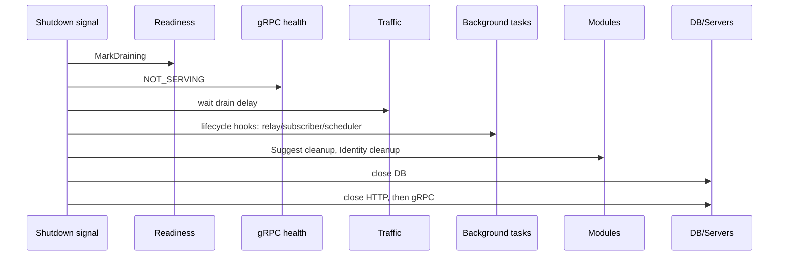

# 后台任务、Readiness 与优雅关闭

> 状态：已实现 · 本文说明“进程活着、可以接流量、派生状态新鲜、正在退出”是四个不同状态。

## 1. Liveness 与 Readiness

Liveness 回答“进程/事件循环是否需要被重启”；Readiness 回答“此实例现在是否应接收业务流量”。外部依赖短暂故障通常应让 readiness 失败，而不是立刻让 liveness 失败造成重启风暴。

当前三个入口不能混用：

| 入口 | 语义 | 是否访问业务依赖 |
| --- | --- | --- |
| `/healthz` | generic server 的纯 liveness | 不访问 MySQL/Redis，只证明进程仍能响应 |
| `/health` | IAM REST 基础健康入口 | 返回服务健康信息，不替代完整 readiness |
| `/readyz` | 部署/负载均衡 readiness | 执行下面的组件检查，失败时不应接新流量 |

CI/deployment 的 server-check 对 `/healthz` 失败视为进程级失败；对 `/readyz` 失败输出 `WARNING: IAM is live but not ready`，用来区分“需要重启进程”和“实例仍活着但尚不能接流量”。生产编排仍应以 readiness 结果控制流量，而不是把告警当成可长期忽略的降级。

当前 Container readiness 逐项并发/受 timeout 检查：

| component | required | 实际检查 |
| --- | --- | --- |
| mysql | 是 | `PingContext` |
| redis | 是 | `PING` |
| authn | 是 | 模块状态 + TokenService |
| jwks | 是 | 可取得 active key |
| authz | 是 | runtime 存在且最近 reload healthy |
| suggest | 配置决定 | 启用时至少一次成功 refresh |
| session_revocation | 是 | store 可读且 oldest unfinished age 未超阈值 |

总超时和单组件超时防止健康接口本身被慢依赖拖死。required=false 的组件失败应进入 degraded details/metrics，但不阻止整体 ready；required=true 失败则实例不可接流量。

## 2. 为什么检查 backlog age

Session revocation worker 是 Identity 状态变化到 Redis Session 撤销的最终一致链。只检查 worker 对象非 nil，无法发现它已卡住数小时。Readiness 查询 oldest unfinished age 并与 `OutboxMaxPendingAge` 比较，用业务延迟而不是“goroutine 存在”判断健康。

类似地，AuthZ 应进一步比较 published/loaded policy version，Suggest 应观测 last success age；当前 readiness 已比单纯对象检查更强，但仍没有为所有后台链统一 freshness SLA。

## 3. 运行时后台任务

process 启动：

- JWKS key rotation scheduler；
- transactional outbox relay；
- AuthZ policy sync subscriber。

Suggest cron 在模块内部创建，但通过 RuntimeCapabilities 暴露 Cleanup；Identity 暴露 session-revocation cleanup。所有停止动作最终进入 process shutdown sequence。

Outbox relay 使用可取消 context 循环：每轮先 DispatchDue，再等待 ticker。错误只告警并在下一轮重试。AuthZ subscriber 启动失败当前只记录 error，不让进程退出；这会让实例保留启动时策略但收不到更新，因此必须依赖 runtime health/readiness/告警，而不是静默接受。

Key rotation scheduler 用 `context.Background()` 启动，由 scheduler.Stop 关闭；AuthZ subscriber 也用 background context，靠显式 Stop。相比统一 lifecycle context，这种实现更依赖 Stop 正确执行，测试必须覆盖 shutdown hook。

## 4. Drain 先于资源关闭

当前 shutdown 顺序：



先标记不 ready，再等待 load balancer 摘流量，避免一边关闭 DB 一边继续接新请求。gRPC health 同时标记 NOT_SERVING。

后台任务在 DB 前停止，因为它们仍可能 dispatch outbox、reload policy 或处理 revocation；若先关 DB，任务会制造无意义错误和部分处理。HTTP/gRPC 最后关闭，让 drain 窗口内在途请求仍可完成。

## 5. 当前 shutdown 的边界

`runShutdownSequence` 对每一步错误只记录并继续，避免一个清理失败阻止其他资源释放。这是关闭阶段合理的 best effort，但不会把失败反馈给 shutdown callback（callback 最终返回 nil）。运维必须从日志/指标发现清理失败。

另外，outbox relay 的 shutdown hook 只 cancel context，没有显式等待 goroutine 已退出；循环会在当前 `DispatchDue` 返回后结束。若 dispatch 阻塞或超时大于剩余关闭窗口，随后 DB close 可能与它竞争。更严格的实现应使用 wait group/join 和 bounded timeout。

`Suggest.Cleanup` 对 cron Stop 的 context 等待没有额外上限；正在执行的 cron callback若不响应上游 ctx，关闭可能被拖延。当前 loader 使用 context-aware DB 调用，仍应做超时演练。

## 6. Readiness 为什么要在启动末尾才可信

端口监听或 base health route 出现不代表模块已装配。完整 ready 至少要求：

```text
resources reachable
AND critical capabilities assembled
AND active JWKS key exists
AND AuthZ runtime loaded
AND required Suggest snapshot built
AND revocation backlog within SLA
AND not draining
```

这也是 deployment rolling update 的安全基础：新实例 ready 后才加入，旧实例先 unready/drain 再退出。

## 7. 降级矩阵

| 场景 | 启动 | Readiness | 行为 |
| --- | --- | --- | --- |
| release 缺 MySQL/Redis/key | 失败 | 不适用 | fail closed |
| debug 显式 degraded 且缺资源 | 可继续诊断 | required checks 失败 | 不应接业务流量 |
| Suggest disabled | 正常 | suggest check 通过 | 路由不注册 |
| Suggest enabled/optional，首次 full 失败 | 模块返回空服务 | overall 可由配置容忍 | 可观测 degraded |
| AuthZ reload unhealthy | 进程可活 | not ready | 避免 stale policy 接流量 |
| session revocation backlog 超阈值 | 进程可活 | not ready | 避免撤权延迟扩大 |

## 8. 面试追问

### 为什么 readiness 不应只 ping DB？

DB 可达不代表 active key、授权策略和撤销 worker 可用。Ready 应代表用户可依赖的最小业务能力，而不仅是基础设施 socket。

### 为什么先 unready 再 sleep？

服务发现/负载均衡摘流量需要传播时间。立即关闭会中断仍被转发的新请求；drain delay 给控制面收敛窗口。

### 关闭时错误为什么要继续执行？

如果停止 subscriber 失败就不关闭 DB/server，会留下更多资源和连接。关闭步骤应独立 best effort，同时让失败可观测；关键数据完整性则应在各任务自己的协议中保证。

## 9. 事实来源与验证

- readiness：`internal/apiserver/container/readiness.go`、`internal/apiserver/application/readiness`
- background：`internal/apiserver/process/shutdown_lifecycle.go`
- runtime deps：`internal/apiserver/container/runtime_deps.go`
- Suggest cleanup：`internal/apiserver/container/suggest/module.go`
- shutdown tests：`internal/apiserver/process/shutdown_lifecycle_test.go`

```bash
/Users/yangshujie/.gvm/gos/go1.25.12/bin/go test ./internal/apiserver/application/readiness ./internal/apiserver/container ./internal/apiserver/process ./internal/apiserver/container/suggest
```
