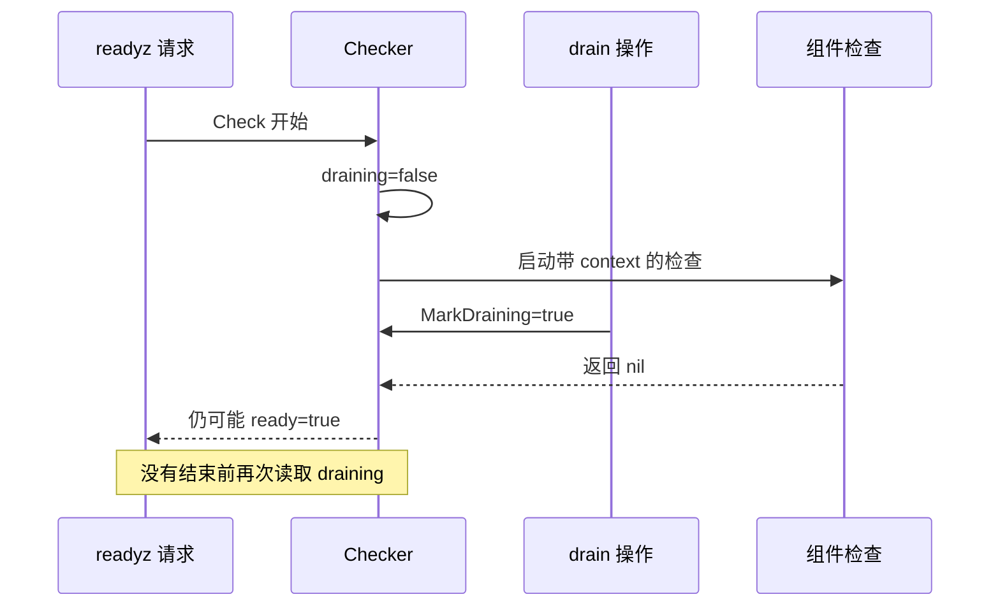
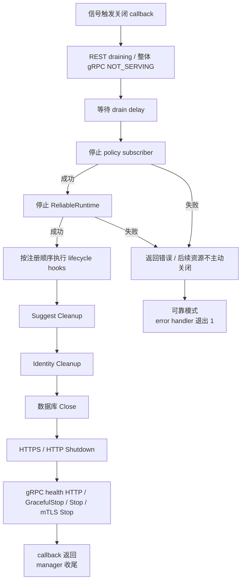

# 后台任务、就绪与关闭：采样、停止和资源释放的合同

> 状态：已实现 · 按当前源码与锁定依赖逐篇复核。本文拥有持续运行/探针和信号关闭；源码条件、既有回归、环境证据与候选设计分别表述。

IAM 目前用组件采样决定 REST readiness，用两个可靠工作停止门禁保护资源释放，再按固定顺序关闭其它任务和服务器。这个方案能发现依赖与部分积压问题，也保留未停止工作仍需使用的数据库；但没有把“开始 draining、旧请求结束、后台停止、依赖释放、关闭回调结束”组合成一个全进程屏障。任何一项成功都不应代替后面的证明。

[启动与组合根](01-启动与组合根.md)拥有准备阶段、副作用和普通 Run error；[配置与传输装配](02-配置与传输装配.md)拥有输入、校验和实际安全分支。本文不重复启动计划或模块业务算法，重点解释它们在持续运行、取消和关闭时的后果。

## 1. 先确定所观察的信号

| 信号 | 当前问的问题 | 没有证明什么 |
| --- | --- | --- |
| 主 REST `/healthz` | generic HTTP server 能否响应 liveness | MySQL/Redis、登录、策略或消息可用 |
| 主 REST `/health` | 装配时 ModuleState 的兼容摘要，HTTP 总是 200 | 持续健康；状态已复制进 Router，不是运行探针 |
| 主 REST `/readyz` | 本次 Checker 的 required 结果与 draining 是否允许 ready | 所有业务可用、全实例收敛、已到达请求已被拒绝 |
| gRPC Health 的整体/服务名状态 | 服务注册/显式 SetServingStatus 的标记 | 当前策略新鲜度、完整业务服务或真实业务请求成功 |
| gRPC 独立 HTTP port 的 `/healthz`、`/readyz` | 整体 gRPC SERVING 标记 | Container Checker 的八项结果 |
| 该独立 port 的 `/livez` | HTTP handler 可返回 200 | gRPC 已监听或业务依赖健康 |

主 REST 与 gRPC HTTP health 的同名路径不是同一合同；当前 prod 模板分别使用 9080 与 9091。Registry 注册结束后会把整体和实际注册服务设为 SERVING，不查 AuthZ freshness；独立 health server 在 gRPC Run 中先启动，监听失败主要记日志。探针任务创建、端口响应与业务监听仍需分开核对。

例如 AuthZ 确认证明过期，直接 Check 返回 Unavailable，主 REST `/readyz` 为 503，而未更新的 gRPC 整体状态及 9091 `/readyz` 仍可能为 200。开始 draining 只改整体 gRPC 为 NOT_SERVING；按具体业务 service 名称查询，旧 SERVING 可以一直保留到最终 gRPC Close。

Health Check/Watch 和 reflection v1alpha 默认跳过身份/ACL拦截器，TLS 握手仍适用；其它 reflection 版本及实际 TLS 条件归[传输装配](02-配置与传输装配.md#6-grpc配置值必须追到实际-credentials)。独立 HTTP health 不要求客户端证书。

## 2. Checker 是并发采样，不是停止或准入控制

标准 Checker 注册八个组件，每次请求各启动一个检查 goroutine。默认单组件 context 为 500ms，总 context 为 2s；读取 request context，结果只给稳定 status，不暴露底层错误文本。`CheckedAt` 在检查开始时记录，不是所有组件同时完成的时间。

### 2.1 实际聚合规则

1. Check 起点遇到 nil Checker 或 draining，直接 not_ready，components 为空。
2. 每个非 nil CheckFunc 获得单组件 context 并同步执行；普通返回 nil 记 ok，required error 记 failed，optional error 记 degraded。
3. 主循环选择结果或 total context Done；选择总超时分支时，未收到项按 required/optional 标记，整体 not_ready。
4. 返回前同步调用 Observer；没有对 observer 单独施加截止时间，也没有再检查 draining 或每个已返回函数的 ctx.Err。

因此 optional 的**普通错误**不阻止 ready；optional 拖到总预算且主循环选择超时分支，仍会阻止本次 ready。generic Checker 还把 required 的 nil CheckFunc 记 skipped，不降低 ready；标准八项当前都有函数，不能把这个构造器边界描述为本次装配缺失。

### 2.2 两个具体时序

```mermaid
sequenceDiagram
    participant P as readyz 请求
    participant C as Checker
    participant D as drain 操作
    participant X as 组件检查
    P->>C: Check 开始
    C->>C: draining=false
    C->>X: 启动带 context 的检查
    D->>C: MarkDraining=true
    X-->>C: 返回 nil
    C-->>P: 仍可能 ready=true
    Note over P,C: 没有结束前再次读取 draining
```

这是源码条件，已有测试只验证**先** MarkDraining 再发请求得到 503，没有验证在途竞态。一次晚到的 ready 响应既不撤销 draining 标记，也不表示关闭中的实例重新接受了业务；它说明探针结果与摘流量操作没有原子绑定。

第二个情景是检查函数不及时配合取消。给它 500ms context，不会强制终止其调用；总 Check 可以在 2s 超时分支返回，但尚在执行的 goroutine 不被 join。缓冲结果通道允许检查最终返回后退出，不保证底层工作已经停止；反复探测可能积累仍在进行的检查。

锁定的 Redis 路径有具体例子：component-base NewClient 未开启 `ContextTimeoutEnabled`，go-redis v9.16.0 的 socket 读写在这个默认下使用独立网络 timeout；零值读 timeout 又回填为 3s。context 在 pool/dial/retry 的其它路径仍有用途，所以不能说“Redis 完全忽略取消”，但 500ms component deadline 不构成 500ms 网络 I/O 上限。检查在 deadline 后返回 nil 仍可记 ok；总 context 取消与结果同时可读时也不是强制优先选择取消。以上未做网络超时实验。

### 2.3 响应与指标是不同证据

`iam_readiness_checks_total` 对每次结果计数；component_status 仅更新本次 Snapshot 出现的项。draining 的快速返回没有组件项，所以旧 component_status=1 可以继续保留，不能据这组 gauge 推导整体 ready。Observer 也不是检查函数停止的证明。

Checker 没有缓存/合并同实例的并发 probe，没有 panic recovery 或统一停止检查 goroutine的协议。当前标准 observer 是简短 Prometheus recorder；generic Observer 的阻塞仍可能延长返回。这些是实现范围，不是已复现的生产泄漏或事故。

## 3. 八项组件检查：存在性、证明与积压分开

| component | required | 当前检查与限制 |
| --- | --- | --- |
| mysql | 是 | sql.DB PingContext；不执行业务事务或验证所有表 |
| redis | 是 | PING；不验证 Session 批撤、Lua、数据完整性或每项网络 deadline |
| authn | 是 | initialized/ModuleState 可用及四个 Token 端口非 nil；不执行登录、刷新或撤销 |
| jwks | 是 | 取得恰一 active key，并检查 CanSignAt；不读/匹配私钥，不签名、不核对下游缓存 |
| authz | 是 | 模块与 RuntimeHealth 存在且 ReloadHealth healthy |
| suggest | `suggest.required` | enable=false 返回 ok；否则 CheckHealth 主要看曾成功刷新 |
| domain_event_outbox | 是 | 同时读取 legacy/standard 的状态桶及最早创建年龄 |
| session_revocation | 是 | store 可读，未 completed 任务的最早创建年龄不超过共同阈值 |

Suggest “曾成功”既不检查索引年龄、Cron 活性，也不检查当前 Querier 类型。空 Full 可以健康；首次成功后 Delta Cron 注册失败，optional 能形成 DegradedQuerier且 Cron 未启动，旧成功标记仍使探针通过；后续刷新失败也不清成功标记。边界由[刷新与关闭](../02-业务模块/05-Suggest/02-关键链路-索引刷新Full-Delta.md)维护。

AuthZ 有三个判断层：直接授权读取检查本次快照 freshness；组件 ReloadHealth 使用 `fresh && syncReady`，当前模块还要求循环运行及订阅已注册；整个 Checker 再组合其它 required 组件。lag/degraded 不直接等于拒绝或摘流量。

| 场景 | 直接 AuthZ 读 | AuthZ 组件 | 主 REST `/readyz` |
| --- | --- | --- | --- |
| v41仍 fresh，观察到v42但加载失败 | 可按v41返回旧结果 | 循环/注册正常时仍可healthy | 还看其余组件 |
| 订阅未注册或循环停止，快照仍fresh | 仍可返回旧结果 | not ready | not ready |
| MySQL Ping失败，快照仍fresh | 仍可读旧快照 | 可能healthy | not ready |
| 确认证明达到max-unconfirmed预算 | 策略不可用 | not ready | not ready |

新鲜度的证明起点和默认60s读取预算由[多实例收敛](../02-业务模块/03-AuthZ/04-关键链路-多实例策略收敛.md)拥有。本次八项并发检查也没有共享一个事实版本，不能把它们当作同一时刻的业务快照。

### 3.1 年龄门禁具体在看什么

默认 `outbox_max_pending_age` 为 5m；session revocation 使用同一字段。当前是**严格大于**阈值才因年龄失败，等于阈值仍通过。

| 被观察对象 | 状态/年龄计算 | 当前阻止 ready 的条件 |
| --- | --- | --- |
| standard/legacy Outbox | UNION 只取精确非 published 的记录；按状态分桶，年龄为进程传入 now−最早 created_at | 任意非空 legacy_*、standard_quarantined/unknown 立即失败；其它非空桶年龄>阈值失败 |
| Session revocation | 只排除 completed；最早 created_at到进程 now | store错误或年龄>同阈值失败；不额外检查 worker正在运行或未知状态 |

标准 Outbox created_at 按 UTC，legacy 按应用固定 UTC+8（Etc/GMT-8）解释，不由运行YAML或宿主TZ选择；未来时间的负年龄 clamp 为 0。撤销任务年龄也 clamp 为 0。它们没有使用数据库当前时间、最后进展时间、重试到期或 lease 到期作为健康年龄。

这有三项直接后果：一万条年轻 pending 不因数量失败；空撤销队列即使 worker 已停也可以通过；published 被排除，不能证明消费者或业务已接受。年轻记录的载荷损坏、lease停滞或未知撤销状态也不由年龄本身判断。探针选择反映“已知需人工介入和最长等待”政策，不是完整消息正确性检查；标准状态、handoff及结果未知由[事件/Outbox](../03-基础设施/03-事件与Transactional-Outbox.md)维护。

例如取消使撤销任务留在 processing，它在年龄未越阈值时仍可能 ready；随后由 stale-processing 重新认领而恢复，是不同机制，不能从 ready 200 推导恢复已经发生。

## 4. 后台任务各自承诺不同的 Start 和 Stop

| 任务 | 激活与所有权 | 实际停止合同 |
| --- | --- | --- |
| ReliableRuntime | process显式Start；宿主监督专用Relay串行重启 | cancel新工作→join Relay→publisher Drain；成功不等于清空全部待发记录 |
| AuthZ policy sync | process调用Start；managed loop首轮注册/核对，失败继续重试 | 取消loop及policy业务handler派生ctx，join loop，再Close所拥有SDK subscriber |
| JWKS rotation scheduler | automatic-enabled时创建；process异步Start | hook先IsRunning；Stop先Cron.Stop并等作业，之后才cancel，无停止timeout |
| Identity撤销worker | 模块初始化按依赖/配置启动 | Cleanup cancel→等done，无自身timeout；worker整批之后检查退出 |
| Suggest Full/Cron | 模块初始化Full后登记/启动Cron | Cleanup cancel→Cron.Stop并等已有作业，无自身timeout |
| mTLS reload | gRPC构造时按开关启动组件任务 | gRPC Close尾部Stop只关闭stopCh，不join，也不是幂等Stop |

这些任务不共用一份运行 context。Reliable Start=nil只说明监督循环启动，不证明 Relay 首次扫描/发布成功；policy Start=nil也不证明订阅已建立。JWKS异步Start失败只日志，不能用“scheduler initialized”当作运行证明。Prepare失败与普通Run error没有统一调用本表全部Stop，责任归[启动主文](01-启动与组合根.md)。

### 4.1 可靠门禁保护的是仍被借用的资源

policy业务回调安装 runCtx 取消，但失败审计 callback 直接交给SDK；标准 DeliveryContext 未设置，SDK默认Background。已有失败审计不随policy loop自动取消，仍可能写MySQL，所以SDK Close须等待自己拥有的consumer/callback/handoff工作。

PolicySync Close成功才记录 sdkClosed；失败后可带新deadline再次Stop，已停止对象不能重新Start。并发Stop先等不感知context的mutex，不能承诺所有并发caller都严格按自己的deadline返回。ReliableRuntime则先join Relay，再drain publisher的真实driver调用，当前managed publisher也会关闭SDK所拥有producer。Relay返回不等于driver全部结束，drain成功不等于数据库队列为空或业务接受完成。

现有受控测试覆盖先join超时、再driver drain失败、最后重试成功，期间不关闭宿主资源。标准信号路径遇到门禁错误则退出1，没有自动Interrupt producer或自动再次Stop；“允许重试”是对象合同，不是生产已配置的恢复循环。

### 4.2 普通任务的取消窗口

若轮换作业等待数据库，scheduler Stop先等作业再cancel，会卡在第一步；此时后续清理不能因“best effort”自动继续。还有极早停止窗口：process的Start goroutine尚未进入时，hook看到IsRunning=false便跳过，随后仍可能Start。该源码条件尚无专项复现；只调整cancel顺序也不能解决尚未开始的Start，需要启动确认/终止状态。

Identity worker取消后仍可能处于一批任务中。例如Redis撤销成功，随后同ctx的Complete回写受取消影响，任务可能保留processing；stale Claim可重新置pending并重试。取消不回滚已完成撤销，也不保证整批持久完成；现有SQLite测试直接调用runBatch，不证明Run/Cleanup的取消窗口。

Suggest已读完数据后，标准内存writer仍可能在取消后发布并记成功；Cleanup等待作业，但没有自己的停止上限。具体代次/发布和预算归[刷新主文](../02-业务模块/05-Suggest/02-关键链路-索引刷新Full-Delta.md)。

### 4.3 证书文件重读与新握手不是同一件事

锁定 component-base v0.8.0 的reload每轮构建新TLSConfig并替换builder指针；IAM装配时调用credentials.NewTLS取得初始配置，锁定grpc v1.80.0又克隆它。当前没有GetConfigForClient/GetCertificate动态交接。因此不能由reload任务或builder更新承诺同一Server的新握手采用新cert/CA；已安装credentials与builder后续替换之间存在断开。

这是锁定源码结论，本轮未换证握手实测。Stop只发channel信号，不能证明重读任务已退出；重复Stop还会再次close同一channel而panic。候选动态凭据必须定义新连接代次、加载失败保留旧配置、CA迁移窗口及幂等join，用真实新连接握手证明切换；只增加reload日志不解决交接。

## 5. 信号关闭：固定局部顺序与两道资源门禁

下面画的是IAM callback的局部顺序；不是“所有步骤必定在主进程返回前完成”的承诺。

```mermaid
flowchart TD
    Signal[信号触发关闭 callback] --> Drain[REST draining / 整体 gRPC NOT_SERVING]
    Drain --> Delay[等待 drain delay]
    Delay --> Policy[停止 policy subscriber]
    Policy -->|成功| Relay[停止 ReliableRuntime]
    Policy -->|失败| Gate[返回错误 / 后续资源不主动关闭]
    Relay -->|失败| Gate
    Relay -->|成功| Hooks[按注册顺序执行 lifecycle hooks]
    Hooks --> Suggest[Suggest Cleanup]
    Suggest --> Identity[Identity Cleanup]
    Identity --> DB[数据库 Close]
    DB --> HTTP[HTTPS / HTTP Shutdown]
    HTTP --> GRPC[gRPC health HTTP / GracefulStop / Stop / mTLS Stop]
    GRPC --> Finish["callback 返回<br/>manager 收尾"]
    Gate --> Exit["可靠模式<br/>error handler 退出 1"]
```

先公布not ready、等待传播，再停止可靠工作。当前门禁失败会直接返回，不运行后面的hooks/cleanup/DB/HTTP/gRPC；保留资源指“不主动提前调用这些Close”，随后失败退出仍会由进程终止回收OS资源，并不是保持一个可继续服务的实例。未完成lease或processing恢复依赖持久协议，不由退出码自动证明。

门禁后的Lifecycle按注册顺序执行；hook/cleanup/DB普通error只日志并继续。**函数阻塞、panic和返回error是不同后果**：当前没有统一deadline或recover，卡住不会执行下一步。不能把它称作所有关闭失败都能继续。

### 5.1 timeout 不是一份总退出预算

| 段 | 当前预算与行为 |
| --- | --- |
| drain delay | prod模板5s，dev0；普通sleep，尚不阻止新业务请求 |
| PolicySync gate | 新建一份ShutdownTimeout，默认20s；同步调用，取消依赖实现配合 |
| ReliableRuntime gate | 再新建完整默认20s；不是上一项剩余预算 |
| lifecycle / Suggest / Identity / DB | 没有统一外层deadline；部分join可无限等待 |
| 主HTTP Close | 同一份硬编码10s context，先HTTPS再HTTP；超时仅日志，无Server.Close回退，wrapper返回nil |
| gRPC Close | health HTTP用3s context；GracefulStop等待5s仍未完成才调用Stop；Stop无context，5s不是整个Close硬上限 |
| mTLS任务 | 最后发Stop信号，不join |

两门禁都接近20s时，仅这两项与drain delay已接近40s加drain delay；后续步骤还增加耗时，甚至卡住。prod compose的stop_grace_period=60s是外部容器停止选择，不是内部完成保证；不能将这一配置与上述数字相加就得出稳定退出SLA。

HTTP Shutdown超时不证明handler结束，未消费的ShutdownTimeout字段也不能代替上述10s实现。GracefulStop等待5s仍未完成时才调用Stop；Stop无context，不能承诺此时连接已全部停止，默认也不join全部method handler。已进入业务的操作可能仍在执行或留下结果未知。真实关闭和客户端重试须区分请求取消、数据库提交及响应交付，不能把连接停止当作事务回滚。

### 5.2 在途请求和callback尾部仍有窗口

当前draining只是健康信号；没有统一业务admission门禁，listeners尚未停止，也没有在关闭DB之前等待所有请求。例子是某PATCH已通过认证、下一次数据库操作前开始关闭；可靠门禁成功后DB先关闭，HTTP/gRPC后停止，存在请求与依赖释放交错的源码窗口。本轮未做真实请求实验，不能承诺具体请求必失败或事务必回滚。

标准POSIX manager在信号goroutine里执行callback；主RunGroup仅等server Run返回，没有显式join callback完成。锁定grpc Serve会等待内部Stop done，所以不能说主路径必越过整个GracefulStop等待；但Stop完成之后，mTLS Stop、callback完成日志及manager Flush/Exit与main正常返回仍有竞速区间。这是静态链，未做真实SIGTERM子进程验收；退出0或“shutdown complete”都不能单独证明所有尾部和请求已完成。

## 6. 发布、容器liveness与日常巡检有不同门禁

| 操作 | 当前脚本政策 | 证据范围 |
| --- | --- | --- |
| prod Docker healthcheck | 请求主HTTP `/healthz` | liveness；不等于主REST ready |
| remote-deploy | 一轮顺序读healthz和readyz，两者200即通过；否则重试，最终失败 | 两次相邻采样，不是同时/持续窗口；不自动回滚 |
| server-check workflow | healthz失败是错误；readyz失败输出WARNING | 仅ready分支如此；模块响应、版本及metrics还有其它硬门禁 |

remote-deploy最多30轮、轮间5s，但curl没有连接/总timeout，不能称“150s内必定完成”。readiness失败的组件摘录还漏掉domain_event_outbox，摘录未出现不代表该组件健康；应核对完整响应。日常巡检还可能按容器unhealthy执行重启，不能把“not ready只警告”概括为整条workflow不改变运行状态。

这些脚本运行结果须绑定本批镜像/SHA、实例/端口、配置来源和采样时间；当前源码只是政策，没有证明本次部署或业务接受。本轮只复核和测试局部门禁，不执行部署、重启或生产演练。

## 7. 候选设计与可检验的取舍

以下尚未实施。每项都有独立责任，不能只加一个timeout便统称“优雅关闭完善”。

| 问题 | 具体候选 | 取舍及必要反例 |
| --- | --- | --- |
| 在途probe在drain后仍ready、超时结果被当ok | 返回前复核draining/ctx；规范driver网络deadline，限制/合并同实例probe，对observer定义有界合同 | 减少晚到结果但不撤回已响应数据；不能用select终止忽略ctx的goroutine。验收在途drain、忽略ctx、取消与结果同时就绪、observer阻塞 |
| 年龄/曾成功掩盖worker停止或高积压 | 给任务定义active/last-progress与可控时钟；明确数量、未知状态、索引age、时钟异常是否纳入ready | 避免把进展当存在性；过严会在批处理峰值频繁摘流。验收空队列停worker、边界等于/超过阈值、未来时间、年轻损坏记录与刷新失败 |
| Start/Stop/running混用且cleanup不统一 | 给owned task建立启动确认、stop-admission、取消、done及失败状态；终止后不再Start，幂等Stop并分类未完成工作 | 需要适配scheduler/worker/证书任务的不同模型，不能复制一个接口就得到join；验收未启动即停止、在途批次取消、重复/并发Stop与加载失败 |
| DB先于请求结束关闭、没有callback完成屏障 | 由process协调ingress准入/在途请求与后台工作，二者证明停止后再释放借用依赖；主Run显式等待shutdown completion | 必须检查依赖顺序；强停后的结果未知和未发持久任务不能冒充业务成功。验收慢HTTP/RPC、提交后断响应、后台仍用DB、manager尾部收尾 |
| 各段完整预算、错误被吞为complete | 一份总deadline按剩余预算分段；结构化结果区分joined/forced/timed-out/resource-retained | 总预算提高可预测性，不能授权超时后提前关仍被借用的DB；保留资源门禁和持久恢复约束。验收两门禁接近上限、后续job不配合、HTTP超时与强停 |

证书动态交接由第4.3节单独定义；探针对状态的采样与资源所有权的join应保持分离。readiness是路由选择依据，后台健康是持续证明，关闭是停止使用依赖的协议，三者需要协作但不能互相替代。

## 8. 代码定位、已有证明和缺口

| 关注点 | 入口 / 已有证明范围 |
| --- | --- |
| Checker / observer | `application/readiness/checker.go`、`infra/observability/readiness/metrics.go`；两项测试只有optional普通错误、先draining和配合ctx的required超时 |
| 八项探针 / 状态读取 | `container/readiness.go`、`infra/mysql/eventoutbox/standard_status.go`、`infra/mysql/sessionrevocation/store.go`；Container用替身证明空/stale/missing Outbox，SQLite只测局部撤销年龄 |
| 各健康路由 | `transport/rest/health_routes.go`、`container/rest_deps.go`、`internal/pkg/grpc/server.go`；人工状态/httptest，不是9091或真实在途drain测试 |
| 可靠运行与PolicySync | `infra/messaging/reliable_runtime.go`、`container/authz/policy_sync.go`；真实SDK Relay+可控SQL/NSQ，取消版本读+subscriber stub |
| 普通后台清理 | `infra/scheduler/key_rotation_cron_scheduler.go`、`container/{identity,suggest}/module.go`、撤销worker；暂无scheduler停止/换证或整批取消专项 |
| 信号关闭与失败退出 | `process/{shutdown_lifecycle,reliable_messaging,run_group}.go`；closures顺序、资源保留/重试、受控自定义manager子进程exit1 |
| 本轮源码绑定 | 锁定component-base v0.8.0、reliable-messaging v0.3.0-m6.1、go-redis v9.16.0、grpc v1.80.0；本地Go1.25.12 HTTP实现，不据此推定生产工具链 |
| 发布/巡检 | `scripts/cd/remote-deploy.sh`、`.github/workflows/server-check.yml`；delivery gate测试是固定源码片段和shell状态码矩阵 |

本篇选取现有readiness、可靠运行时、SQLite撤销三个整包，以及Container探针、process关闭、PolicySync和delivery gate的明确子集；不新增文档镜像测试。具体执行数、源绑定、图及文档检查登记于[阶段复核记录](../_data/reviews/2026-10-06-docs-refactor.md)。

真实MySQL标准reader与SDK subscriber专项需要独立tag/依赖；本篇未执行它们。也未执行drain竞态/不配合取消、Redis网络deadline、换证握手、慢在途请求、真实SIGTERM完整退出及生产摘流传播。已有受控子进程证明exit1，不等于这些环境场景；图和文档门禁不扩大测试合同。
