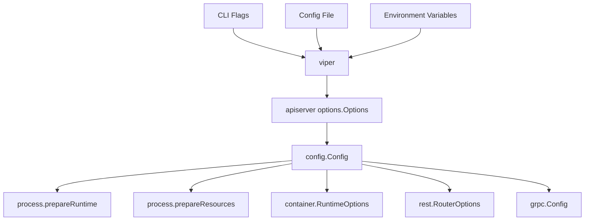
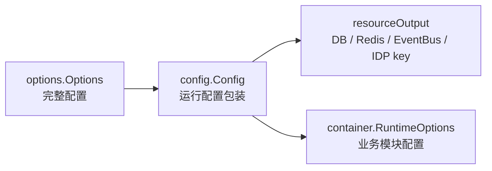
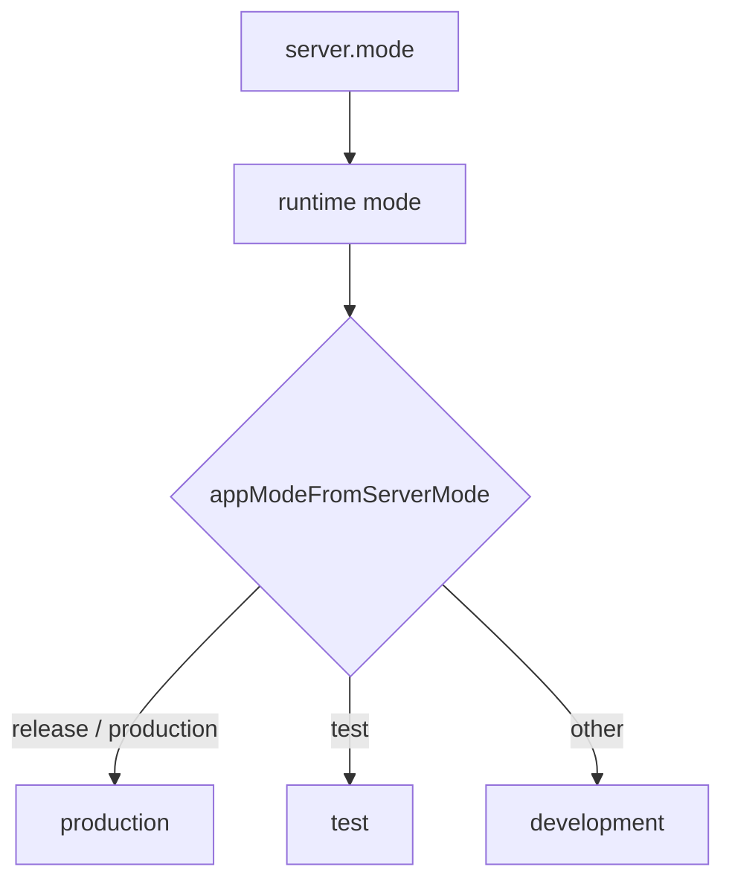
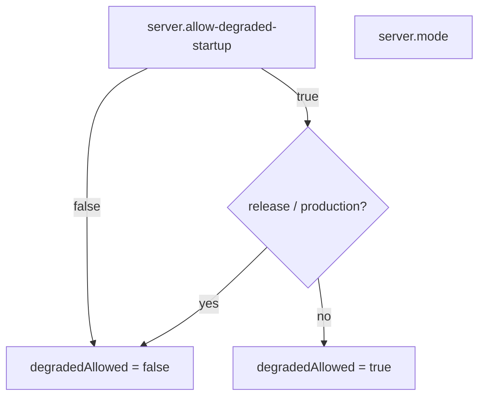

# 配置与运行模式

## 本文回答

本文回答：IAM 的配置如何从命令行、配置文件和环境变量进入运行时；这些配置如何被分成 server、transport、resource、module、debug、event 几类；`server.mode`、`appMode`、`degraded startup` 之间是什么关系；哪些配置会真正影响启动、模块装配、REST/gRPC 注册、后台任务和关闭行为。

读完本文，你应该能回答：

- IAM 配置从哪里读取；
- `Options`、`Config`、`RuntimeOptions` 三者有什么区别；
- `server.mode`、`app.mode`、`appMode` 分别是什么；
- `release/production/test/debug/development` 等模式如何影响运行时；
- degraded startup 什么时候允许；
- HTTP、gRPC、MySQL、Redis、NSQ、migration、AuthN、JWKS、IDP、SMS、Suggest、Debug、Events 配置分别被谁消费；
- 配置文件中哪些字段是当前运行时事实，哪些只是历史或示例字段；
- 本地开发、生产部署应该重点检查哪些配置。

---

## 30 秒结论

IAM 的配置链路是：

```text
CLI flags / config file / env
  -> viper
  -> apiserver options.Options
  -> config.Config
  -> process runtimeOutput / resourceOutput
  -> container.RuntimeOptions
  -> transport RouterOptions / gRPC Config
```

配置体系可以分成三层：

| 层 | 代码 | 作用 |
|---|---|---|
| 命令行与配置读取层 | `pkg/app`、`viper`、`cobra` | 读取 `--config`、flags、env，并反序列化到 options |
| APIServer options 层 | `internal/apiserver/options.Options` | 聚合 IAM 运行所需的所有配置组 |
| 运行时消费层 | `process`、`container.RuntimeOptions`、`transport` | 把配置转成启动模式、资源、模块能力、路由选项、后台任务参数 |

最重要的运行时模式字段是 `server.mode`，不是 `app.mode`。`process` 通过 `server.mode` 推导：

```text
runtime mode: 原始 server mode
appMode: production / test / development
degradedAllowed: 是否允许降级启动
```

`degraded startup` 只允许在非 production/release 模式下启用。即使显式设置 `server.allow-degraded-startup=true`，只要 `server.mode` 是 `release` 或 `production`，也会被拒绝。

核心源码入口：

- [../../pkg/app/config.go](../../pkg/app/config.go)
- [../../pkg/app/app.go](../../pkg/app/app.go)
- [../../internal/apiserver/options/options.go](../../internal/apiserver/options/options.go)
- [../../internal/apiserver/config/config.go](../../internal/apiserver/config/config.go)
- [../../internal/apiserver/process/runtime_mode.go](../../internal/apiserver/process/runtime_mode.go)
- [../../internal/apiserver/process/bootstrap.go](../../internal/apiserver/process/bootstrap.go)
- [../../internal/apiserver/container/runtime_options.go](../../internal/apiserver/container/runtime_options.go)

---

## 主图：配置进入运行时



---

## 重点速查

| 问题 | 当前答案 | 代码证据 |
|---|---|---|
| 配置文件如何指定 | 全局 flag `--config` / `-c`。 | [../../pkg/app/config.go](../../pkg/app/config.go) |
| 默认配置文件名是什么 | 未指定 `--config` 时，viper 使用 `basename`，即 `iam-apiserver`。 | [../../pkg/app/config.go](../../pkg/app/config.go)、[../../cmd/apiserver/apiserver.go](../../cmd/apiserver/apiserver.go) |
| 默认搜索路径有哪些 | 当前目录、`configs/`、用户家目录下的 `.<name>`、`/etc/<name>`。 | [../../pkg/app/config.go](../../pkg/app/config.go) |
| 环境变量前缀是什么 | `basename` 转大写并把 `-` 换成 `_`，即 `IAM_APISERVER_`。 | [../../pkg/app/config.go](../../pkg/app/config.go) |
| env key 如何映射 | `.` 和 `-` 都会替换成 `_`。 | [../../pkg/app/config.go](../../pkg/app/config.go) |
| Options 聚合哪些配置组 | log、app、server、grpc、insecure、secure、mysql、redis、nsq、migration、auth、jwks、idp、sms、suggest、debug、seed_mock_auth、events。 | [../../internal/apiserver/options/options.go](../../internal/apiserver/options/options.go) |
| Config 做什么 | 包装 Options，并调用 `ApplyDefaults()`。 | [../../internal/apiserver/config/config.go](../../internal/apiserver/config/config.go) |
| 运行模式谁决定 | `process.runtimeMode(cfg)` 读取 `cfg.GenericServerRunOptions.Mode`。 | [../../internal/apiserver/process/runtime_mode.go](../../internal/apiserver/process/runtime_mode.go) |
| appMode 谁决定 | `appModeFromServerMode(server.mode)` 推导 production/test/development。 | [../../internal/apiserver/process/runtime_mode.go](../../internal/apiserver/process/runtime_mode.go) |
| degraded startup 何时允许 | `allow-degraded-startup=true` 且 mode 不是 `release/production`。 | [../../internal/apiserver/process/runtime_mode.go](../../internal/apiserver/process/runtime_mode.go) |
| 业务模块消费哪些配置 | container 只消费窄化后的 `RuntimeOptions`。 | [../../internal/apiserver/container/runtime_options.go](../../internal/apiserver/container/runtime_options.go) |

---

## 1. 配置读取入口

IAM 使用 Cobra + Viper 读取配置。

入口在 App 构建阶段：

```text
apiserver.NewApp("iam-apiserver")
  -> app.NewApp(...)
  -> addConfigFlag("iam-apiserver", global flags)
```

配置 flag 是：

```bash
--config
-c
```

示例：

```bash
iam-apiserver --config configs/apiserver.dev.yaml
```

如果没有传 `--config`，Viper 会：

1. 搜索当前目录；
2. 搜索 `configs/`；
3. 如果 basename 包含 `-`，例如 `iam-apiserver`，还会搜索：
   - `~/.iam`
   - `/etc/iam`
4. 使用配置名 `iam-apiserver`。

也就是说，未显式指定 `--config` 时，默认会找类似：

```text
./iam-apiserver.yaml
configs/iam-apiserver.yaml
~/.iam/iam-apiserver.yaml
/etc/iam/iam-apiserver.yaml
```

当前仓库里有 `configs/apiserver.dev.yaml`，它不是默认 basename 名称。因此本地运行通常需要显式传：

```bash
-c configs/apiserver.dev.yaml
```

核心源码：

- [../../pkg/app/config.go](../../pkg/app/config.go)
- [../../pkg/app/app.go](../../pkg/app/app.go)
- [../../configs/apiserver.dev.yaml](../../configs/apiserver.dev.yaml)

---

## 2. 配置来源优先级

IAM 当前配置来源包括：

```text
config file
environment variables
CLI flags
```

Cobra 先注册 flags，Viper 绑定 flags，然后把配置反序列化到 options。

运行时会调用：

```text
viper.BindPFlags(cmd.Flags())
viper.Unmarshal(a.options)
```

环境变量规则：

```text
prefix: IAM_APISERVER_
key replacer: "." -> "_", "-" -> "_"
```

示例映射：

| 配置字段 | 环境变量 |
|---|---|
| `mysql.host` | `IAM_APISERVER_MYSQL_HOST` |
| `mysql.database` | `IAM_APISERVER_MYSQL_DATABASE` |
| `mysql.username` | `IAM_APISERVER_MYSQL_USERNAME` |
| `mysql.password` | `IAM_APISERVER_MYSQL_PASSWORD` |
| `redis.cache.host` | `IAM_APISERVER_REDIS_CACHE_HOST` |
| `redis.cache.port` | `IAM_APISERVER_REDIS_CACHE_PORT` |
| `redis.cache.password` | `IAM_APISERVER_REDIS_CACHE_PASSWORD` |
| `idp.encryption-key` | `IAM_APISERVER_IDP_ENCRYPTION_KEY` |

注意：Viper 的环境变量 key 替换规则会把 `.` 和 `-` 都替换成 `_`。因此 `idp.encryption-key` 对应 `IAM_APISERVER_IDP_ENCRYPTION_KEY`。

核心源码：

- [../../pkg/app/config.go](../../pkg/app/config.go)
- [../../pkg/app/app.go](../../pkg/app/app.go)

---

## 3. Options、Config、RuntimeOptions 的区别

IAM 配置链路里有三个容易混淆的对象：

```text
options.Options
config.Config
container.RuntimeOptions
```

### 3.1 options.Options

`Options` 是完整配置聚合体，包含：

```text
Log
App
GenericServerRunOptions
GRPCOptions
InsecureServing
SecureServing
MySQLOptions
RedisOptions
NSQOptions
MigrationOptions
Auth
JWKS
IDP
SMS
Suggest
Debug
SeedMockAuth
Events
```

它负责：

- 定义配置组；
- 创建默认值；
- 注册 flags；
- `Complete()`；
- `ApplyDefaults()`。

核心源码：

- [../../internal/apiserver/options/options.go](../../internal/apiserver/options/options.go)

### 3.2 config.Config

`Config` 是运行配置包装：

```go
type Config struct {
    *options.Options
}
```

`CreateConfigFromOptions(opts)` 会：

1. 如果 opts 为空，创建默认 options；
2. 调用 `opts.ApplyDefaults()`；
3. 返回 `Config{opts}`。

它本身不做复杂解析，也不直接连接资源。

核心源码：

- [../../internal/apiserver/config/config.go](../../internal/apiserver/config/config.go)

### 3.3 container.RuntimeOptions

`RuntimeOptions` 是传给 container 的窄化配置面。

它只包含模块装配真正需要的业务运行配置：

```text
AppMode
Auth
JWKS
IDP
SMS
Suggest
Events
```

它不包含 MySQL、Redis、HTTP、gRPC、NSQ 原始配置。那些资源已经在 process 层被转成 `mysqlDB`、`redisClient`、`eventBus` 等运行时对象。



核心源码：

- [../../internal/apiserver/container/runtime_options.go](../../internal/apiserver/container/runtime_options.go)
- [../../internal/apiserver/process/bootstrap.go](../../internal/apiserver/process/bootstrap.go)

---

## 4. 运行模式：server.mode、app.mode 与 appMode

IAM 当前有三个名字相近的概念：

| 名称 | 来源 | 当前用途 |
|---|---|---|
| `server.mode` | `GenericServerRunOptions.Mode` | process runtime mode 的主要来源 |
| `app.mode` | `AppOptions.Mode` | 应用元信息，当前不是 degraded startup 的判断来源 |
| `appMode` | `process.appModeFromServerMode(mode)` | 传给 container / REST debug options 的运行模式 |

最重要的是 `server.mode`。

`process.runtimeMode(cfg)` 读取：

```text
cfg.GenericServerRunOptions.Mode
```

然后 `appModeFromServerMode(mode)` 映射：

| `server.mode` | `appMode` |
|---|---|
| `release` | `production` |
| `production` | `production` |
| `test` | `test` |
| 其他值 | `development` |



### 为什么 app.mode 不是主判断来源

`AppOptions.Mode` 当前存在，但 `process.prepareRuntime()` 使用的是 `server.mode`。  
container 和 REST debug governance 收到的 `appMode` 也是由 `server.mode` 推导出来的。

因此文档和部署说明中，涉及运行模式、生产判断、degraded startup、debug cache governance 默认行为时，应优先看 `server.mode`，不要误写成 `app.mode`。

核心源码：

- [../../internal/apiserver/process/runtime_mode.go](../../internal/apiserver/process/runtime_mode.go)
- [../../internal/apiserver/process/bootstrap.go](../../internal/apiserver/process/bootstrap.go)
- [../../internal/apiserver/container/runtime_options.go](../../internal/apiserver/container/runtime_options.go)

---

## 5. Degraded Startup

Degraded startup 的判断函数是：

```text
degradedStartupAllowed(cfg)
```

它的规则是：

```text
server.allow-degraded-startup == true
并且 server.mode 不是 release / production
```

也就是说：

| server.mode | allow-degraded-startup | degradedAllowed |
|---|---:|---:|
| `release` | false | false |
| `release` | true | false |
| `production` | true | false |
| `test` | true | true |
| `debug` | true | true |
| `development` | true | true |
| 其他非生产值 | true | true |



### Degraded startup 允许什么

在 degraded 模式下，以下失败可以降级处理：

| 失败点 | 降级行为 |
|---|---|
| MySQL 获取失败 | `mysqlDB = nil`，记录 warning |
| Redis 获取失败 | `cacheClient = nil`，记录 warning |
| IDP encryption key 缺失或非法 | 记录 warning |
| container 初始化不完整 | 记录 warning |
| 关键模块缺失 | 记录 warning |
| EventBus 创建失败 | 记录 warning，eventBus = nil |

### Degraded startup 不允许什么

以下问题即使 degraded 也不应该被理解为业务可用：

| 问题 | 当前边界 |
|---|---|
| HTTP/gRPC server 构建失败 | 启动失败 |
| gRPC service registration 失败 | 启动失败 |
| AuthN 缺失 | 受保护 REST routes 不注册 |
| AuthZ route authorization 缺失 | admin routes 不注册 |
| EventBus 缺失 | outbox relay 不完整或不启动 |
| production/release 模式 | 不允许 degraded startup |

Degraded startup 的本质是开发、诊断、非生产环境的受控启动，不是生产容错策略。

核心源码：

- [../../internal/apiserver/process/runtime_mode.go](../../internal/apiserver/process/runtime_mode.go)
- [../../internal/apiserver/process/bootstrap.go](../../internal/apiserver/process/bootstrap.go)
- [../../internal/apiserver/process/server_lifecycle.go](../../internal/apiserver/process/server_lifecycle.go)

---

## 6. Server 与 HTTP 配置

HTTP REST API 相关配置主要来自三个配置组：

```text
server
insecure
secure
```

### 6.1 server

`ServerRunOptions` 当前字段：

| 字段 | 默认值来源 | 用途 |
|---|---|---|
| `mode` | `server.NewConfig()` | server run mode |
| `healthz` | `server.NewConfig()` | 是否安装 `/healthz` |
| `middlewares` | `server.NewConfig()` | 通用 middleware 名称列表 |
| `allow-degraded-startup` | false | 是否允许非生产降级启动 |

flags：

```bash
--server.mode
--server.healthz
--server.middlewares
--server.allow-degraded-startup
```

### 6.2 insecure

`InsecureServingOptions` 控制 HTTP 监听：

| 字段 | 默认值 |
|---|---|
| `bind-address` | `127.0.0.1` |
| `bind-port` | `9080` |

flags：

```bash
--insecure.bind-address
--insecure.bind-port
```

### 6.3 secure

`SecureServingOptions` 控制 HTTPS 监听：

| 字段 | 默认值 |
|---|---|
| `bind-address` | `127.0.0.1` |
| `bind-port` | `9444` |
| `tls.cert-file` | 空 |
| `tls.private-key-file` | 空 |

如果 `secure.bind-port != 0`，则必须提供 cert/key 文件，并且文件存在。否则 `Complete()` 会返回错误。

flags：

```bash
--secure.bind-address
--secure.bind-port
--secure.tls.cert-file
--secure.tls.private-key-file
```

### 6.4 HTTP 配置如何被消费

HTTP 配置会在 `buildGenericConfig(cfg)` 中应用到 `GenericAPIServer`：

```text
GenericServerRunOptions.ApplyTo
SecureServing.ApplyTo
InsecureServing.ApplyTo
```

然后 `GenericAPIServer.Run()` 启动 insecure HTTP server；如果 secure bind port 大于 0，则同时启动 HTTPS server。

核心源码：

- [../../internal/pkg/options/server_run_options.go](../../internal/pkg/options/server_run_options.go)
- [../../internal/pkg/options/insecure_serving.go](../../internal/pkg/options/insecure_serving.go)
- [../../internal/pkg/options/secure_serving.go](../../internal/pkg/options/secure_serving.go)
- [../../internal/apiserver/process/generic_server.go](../../internal/apiserver/process/generic_server.go)
- [../../internal/pkg/server/genericapiserver.go](../../internal/pkg/server/genericapiserver.go)

---

## 7. gRPC 配置

gRPC 配置来自 `grpc` 配置组。

默认值：

| 字段 | 默认值 |
|---|---|
| `bind-address` | `127.0.0.1` |
| `bind-port` | `9090` |
| `healthz-port` | `9091` |
| `insecure` | `true` |
| `mtls.enabled` | `false` |
| `mtls.require-client-cert` | `true` |
| `mtls.min-tls-version` | `1.2` |
| `mtls.enable-auto-reload` | `true` |
| `auth.enabled` | `false` |
| `auth.enable-bearer` | `true` |
| `auth.enable-hmac` | `true` |
| `auth.enable-api-key` | `true` |
| `auth.hmac-timestamp-validity` | `5m` |
| `auth.require-identity-match` | `true` |
| `acl.enabled` | `false` |
| `acl.default-policy` | `deny` |
| `audit.enabled` | `true` |

### 7.1 gRPC mTLS

mTLS 配置包括：

```text
grpc.mtls.enabled
grpc.mtls.ca-file
grpc.mtls.ca-dir
grpc.mtls.cert-file
grpc.mtls.key-file
grpc.mtls.require-client-cert
grpc.mtls.allowed-cns
grpc.mtls.allowed-ous
grpc.mtls.allowed-sans
grpc.mtls.min-tls-version
grpc.mtls.enable-auto-reload
grpc.mtls.reload-interval
```

启用 mTLS 时：

```text
grpcConfig.Insecure = false
```

如果 mTLS 没有提供 cert/key，但 secure serving 提供了 TLS cert/key，`applyGRPCOptions` 会 fallback 使用 `cfg.SecureServing.TLS.CertFile` 和 `KeyFile`。

### 7.2 gRPC 应用层认证、ACL、Audit

gRPC 支持：

- Bearer；
- HMAC；
- API Key；
- identity match；
- service ACL；
- audit interceptor。

这些配置在 `applyGRPCOptions` 中进入 `grpc.Config`，再由 `internal/pkg/grpc.Server` 构造 interceptors。

核心源码：

- [../../internal/pkg/options/grpc.go](../../internal/pkg/options/grpc.go)
- [../../internal/apiserver/process/grpc_config.go](../../internal/apiserver/process/grpc_config.go)
- [../../internal/pkg/grpc/server.go](../../internal/pkg/grpc/server.go)

---

## 8. MySQL、Migration 与 Redis 配置

### 8.1 MySQL

MySQL 配置组：

| 字段 | 默认值 |
|---|---|
| `host` | `127.0.0.1:3306` |
| `username` | 空 |
| `password` | 空 |
| `database` | 空 |
| `max-idle-connections` | `100` |
| `max-open-connections` | `100` |
| `max-connection-life-time` | `10s` |
| `log-level` | `viper.GetInt("mysql.log-level")` |

flags：

```bash
--mysql.host
--mysql.username
--mysql.password
--mysql.database
--mysql.max-idle-connections
--mysql.max-open-connections
--mysql.max-connection-life-time
--mysql.log-mode
```

MySQL 在 `DatabaseManager.initMySQL()` 中被注册到 database registry。若 `mysql.host` 为空，则跳过初始化。

### 8.2 Migration

Migration 配置组：

| 字段 | 默认值 |
|---|---|
| `enabled` | `true` |
| `database` | `iam` |

flags：

```bash
--migration.enabled
--migration.database
```

`DatabaseManager.Initialize()` 会在 DB 初始化后调用 `runMigrations()`。  
如果 migration 未启用，则跳过；如果 MySQL 不可用，则记录 warning 并跳过；如果 migration 连接或执行失败，则返回错误，交给 `prepareResources()` 按 degraded 策略处理。

### 8.3 Redis

Redis 当前主要使用 `redis.cache`：

| 字段 | 默认值 |
|---|---|
| `host` | `127.0.0.1` |
| `port` | `6379` |
| `database` | `0` |
| `max-idle` | `50` |
| `max-active` | `100` |
| `timeout` | `5` |
| `enable-cluster` | `false` |
| `use-ssl` | `false` |
| `enable-logging` | `false` |

Redis 用于缓存、会话、令牌等临时数据。  
如果 `redis.cache.host` 为空，Redis 初始化会被跳过。

核心源码：

- [../../internal/pkg/options/mysql_options.go](../../internal/pkg/options/mysql_options.go)
- [../../internal/pkg/options/migration.go](../../internal/pkg/options/migration.go)
- [../../internal/pkg/options/redis_options.go](../../internal/pkg/options/redis_options.go)
- [../../internal/apiserver/process/database.go](../../internal/apiserver/process/database.go)

---

## 9. NSQ 与 Event 配置

### 9.1 NSQ

NSQ 配置组：

| 字段 | 默认值 |
|---|---|
| `enabled` | `false` |
| `lookupd-addrs` | `127.0.0.1:4161` |
| `nsqd-addr` | `127.0.0.1:4150` |
| `max-attempts` | `5` |
| `max-in-flight` | `200` |
| `msg-timeout` | `60` |
| `requeue-delay` | `5` |

NSQ 默认不启用。只有 `nsq.enabled=true` 时，`process.createEventBus()` 才会创建 EventBus。

如果 NSQ 未启用：

```text
EventBus = nil
```

如果 NSQ 创建失败：

```text
prepareResources 记录 warning，EventBus = nil
```

### 9.2 Events

Events 配置组：

| 字段 | 默认值 |
|---|---|
| `catalog_path` | `configs/events.yaml` |
| `outbox_relay_interval` | `2s` |
| `outbox_relay_batch_size` | `0`，由 relay/store 侧默认或运行时处理 |
| `outbox_relay_retry_delay` | `0`，由 relay/store 侧默认或运行时处理 |

`container.RuntimeOptionsFromAPIServerOptions` 会保证：

- `CatalogPath` 为空时回退到默认；
- `OutboxRelayInterval <= 0` 时回退到默认 2 秒。

Event catalog 用于事件类型、topic、delivery 等元数据；outbox relay 参数用于后台事件投递循环。

核心源码：

- [../../internal/pkg/options/nsq_options.go](../../internal/pkg/options/nsq_options.go)
- [../../internal/apiserver/options/runtime_options.go](../../internal/apiserver/options/runtime_options.go)
- [../../internal/apiserver/process/event_bus.go](../../internal/apiserver/process/event_bus.go)
- [../../internal/apiserver/container/runtime_options.go](../../internal/apiserver/container/runtime_options.go)
- [../../internal/apiserver/container/container.go](../../internal/apiserver/container/container.go)

---

## 10. AuthN、JWKS、IDP、SMS 配置

这些配置不会直接被 process 当作资源连接，而是通过 `container.RuntimeOptions` 进入业务模块装配。

### 10.1 Auth

Auth 配置组：

| 字段 | 默认值 | 用途 |
|---|---|---|
| `jwt_issuer` | 空 | JWT issuer |
| `access_token_audience` | 空列表 | access token audience |
| `access_token_ttl` | `15m` | access token 生命周期 |
| `refresh_token_ttl` | `168h` | refresh token 生命周期 |

### 10.2 JWKS

JWKS 配置组：

| 字段 | 默认值 | 用途 |
|---|---|---|
| `keys_dir` | 空 | keyset 存储目录 |
| `auto_init` | false | 启动时是否自动初始化 key |

开发环境可以开启 `auto_init`，生产环境应谨慎，避免密钥生命周期不受控。

### 10.3 IDP

IDP 配置组：

| 字段 | 用途 |
|---|---|
| `encryption-key` | IDP secret 加密密钥，必须解析为 32 字节 |
| `wecom.agent_id` | 企业微信登录的 server-side agent id |

IDP encryption key 支持 base64、base64url、hex 或 32 字节纯字符串。  
非 degraded 模式下，缺失或非法会导致启动失败；degraded 模式下记录 warning。

### 10.4 SMS

SMS 配置组：

| 字段 | 默认值 |
|---|---|
| `provider` | `log` |
| `login_otp_ttl` | `5m` |
| `login_otp_send_cooldown` | `60s` |
| `login_otp_code_length` | `6` |
| `mq.topic` | `iam.notify.sms` |

SMS provider 用于登录 OTP 发送路径。若走 MQ，需要结合 NSQ/EventBus 配置。

核心源码：

- [../../internal/apiserver/options/runtime_options.go](../../internal/apiserver/options/runtime_options.go)
- [../../internal/apiserver/process/idp_key.go](../../internal/apiserver/process/idp_key.go)
- [../../internal/apiserver/process/bootstrap.go](../../internal/apiserver/process/bootstrap.go)
- [../../internal/apiserver/container/runtime_options.go](../../internal/apiserver/container/runtime_options.go)

---

## 11. Suggest 与 Debug 配置

### 11.1 Suggest

Suggest 配置组：

| 字段 | 默认值 |
|---|---|
| `enable` | false |
| `data_dir` | 空 |
| `full_sync_cron` | `@every 1h` |
| `delta_sync_cron` | 空 |
| `max_results` | `20` |
| `key_pad_len` | `25` |
| `full_sql` | 空 |
| `delta_sql` | 空 |
| `snapshot` | nil |

`RuntimeOptionsFromAPIServerOptions` 会把 `SuggestOptions` 转成 `application/suggest.Config`，并调用 `WithDefaults()`。

`snapshot` 的默认规则：

```text
如果 suggest.snapshot 显式配置，则使用显式值
否则如果 data_dir 非空，则 snapshot=true
```

Suggest 如果未启用，不初始化服务；对应 REST suggest route 也不会注册。

### 11.2 Debug CacheGovernance

Debug 配置组：

```text
debug.cache_governance.enabled
debug.cache_governance.require_admin
```

这两个字段是 pointer bool，因此可以区分：

```text
未配置
显式 true
显式 false
```

REST Router 的规则：

| 场景 | 行为 |
|---|---|
| `enabled` 未配置，appMode 非 production | 默认启用 |
| `enabled` 未配置，appMode 为 production | 仍会走 production admin 保护逻辑 |
| `enabled=false` | 不注册 |
| `require_admin=true` | 需要 admin middleware |
| production | 强制 require admin |

核心源码：

- [../../internal/apiserver/options/runtime_options.go](../../internal/apiserver/options/runtime_options.go)
- [../../internal/apiserver/container/runtime_options.go](../../internal/apiserver/container/runtime_options.go)
- [../../internal/apiserver/process/bootstrap.go](../../internal/apiserver/process/bootstrap.go)
- [../../internal/apiserver/transport/rest/debug_routes.go](../../internal/apiserver/transport/rest/debug_routes.go)

---

## 12. Seed Mock Auth 配置

Seed mock auth 配置组：

```text
seed_mock_auth.enabled
seed_mock_auth.shared_secret
```

它控制内部 mock consumer route：

```text
POST /api/v2/internal/authn/mock-consumers/ensure
```

注册条件：

```text
seed_mock_auth.enabled = true
并且 shared_secret 非空
并且 AccountHandler 存在
```

这条路由是内部种子/mock 能力，不应作为普通公开 API 使用。生产环境中默认不应启用。

核心源码：

- [../../internal/apiserver/options/runtime_options.go](../../internal/apiserver/options/runtime_options.go)
- [../../internal/apiserver/process/bootstrap.go](../../internal/apiserver/process/bootstrap.go)
- [../../internal/apiserver/transport/rest/authn/router.go](../../internal/apiserver/transport/rest/authn/router.go)

---

## 13. 配置文件中的历史字段与当前事实

当前 `configs/apiserver.dev.yaml` 是一个开发环境示例，其中包含一些字段是运行时 options 明确消费的，例如：

```text
app
server
insecure
secure
grpc
auth
mysql
migration
redis
jwks
idp
sms
suggest
debug
log
nsq
events
```

但也有一些字段需要谨慎看待，例如：

```text
cors
tls
server.name
server.run-mode
server.read-timeout
server.write-timeout
mysql.conn-max-lifetime
```

这些字段不一定直接对应当前 `internal/apiserver/options.Options` 中的 mapstructure 字段。它们可能是历史配置、示例注释或尚未接入当前 Options 的字段。

当前文档判断配置事实时，应优先看：

```text
internal/apiserver/options/options.go
internal/apiserver/options/runtime_options.go
internal/pkg/options/*.go
process 中实际读取的位置
container/runtime_options.go
```

不要仅凭 `configs/apiserver.dev.yaml` 里的字段判断某个配置已经被当前运行时消费。

这点很重要。否则文档会把历史示例字段误写成当前运行时事实。

核心源码：

- [../../configs/apiserver.dev.yaml](../../configs/apiserver.dev.yaml)
- [../../internal/apiserver/options/options.go](../../internal/apiserver/options/options.go)
- [../../internal/pkg/options/server_run_options.go](../../internal/pkg/options/server_run_options.go)
- [../../internal/pkg/options/mysql_options.go](../../internal/pkg/options/mysql_options.go)

---

## 14. 本地开发建议配置

本地开发建议：

```yaml
server:
  mode: debug
  healthz: true
  allow-degraded-startup: true

insecure:
  bind-address: "0.0.0.0"
  bind-port: 18081

secure:
  bind-port: 0

grpc:
  bind-address: "0.0.0.0"
  bind-port: 19091
  healthz-port: 19092
  insecure: true
  mtls:
    enabled: false

mysql:
  host: "127.0.0.1:3306"
  database: "iam"

redis:
  cache:
    host: "127.0.0.1"
    port: 6379

migration:
  enabled: true
  database: "iam"

nsq:
  enabled: false

idp:
  encryption-key: "<32 bytes / base64 / hex>"

debug:
  cache_governance:
    enabled: true
    require_admin: false
```

说明：

- 本地可以允许 degraded startup，用于排查资源或模块初始化问题。
- `secure.bind-port=0` 可以避免本地必须准备 HTTPS cert/key。
- 若 gRPC 不使用 mTLS，可显式设 `grpc.insecure=true`、`grpc.mtls.enabled=false`。
- IDP encryption key 即使是开发环境，也建议显式配置合法 32 字节密钥，避免和真实行为偏离。
- NSQ 默认关闭时，EventBus 为 nil，outbox relay 不会完整投递消息。

---

## 15. 生产配置检查清单

生产或类生产环境建议检查：

```text
server.mode = release 或 production
server.allow-degraded-startup = false
secure.bind-port > 0 且 cert/key 有效
insecure 暴露范围受控
grpc.mtls.enabled = true 或有明确的安全替代方案
grpc.auth / acl / audit 按接入策略启用
mysql.database / migration.database 明确
redis.cache 使用独立凭证
idp.encryption-key 使用安全注入，不写入公开配置文件
jwks.auto_init 谨慎使用
debug.cache_governance.require_admin = true
seed_mock_auth.enabled = false
nsq.enabled 根据是否需要事件投递开启
events.catalog_path 指向有效事件目录
```

尤其注意：

- production/release 模式不会允许 degraded startup；
- debug 面在 production 中必须被 admin 保护；
- IDP encryption key 是敏感配置；
- gRPC mTLS 与应用层 auth/ACL 是不同层面的安全能力；
- EventBus 不可用不等于业务写入失败，但会影响 outbox 事件投递。

---

## 16. 常见误区

### 误区一：`app.mode` 控制 degraded startup

不对。当前 degraded startup 使用 `server.mode` 判断。  
`app.mode` 是应用元信息，当前不是 process runtime mode 的主要来源。

### 误区二：`server.run-mode` 一定等于当前代码消费字段

不一定。当前 `ServerRunOptions` 的字段是 `mode`，mapstructure 也是 `mode`。如果配置文件中使用 `run-mode`，需要确认是否被当前 Options 消费。

### 误区三：配置文件里出现字段就表示运行时使用了

不对。配置是否生效要看：

```text
Options struct
mapstructure tag
process/container/transport 实际读取位置
```

### 误区四：degraded startup 是生产容错

不对。production/release 下即使配置了 allow-degraded-startup，也不会允许降级启动。

### 误区五：NSQ 关闭会导致授权写入不能提交

不一定。NSQ/EventBus 关闭主要影响事件投递。只要 MySQL/outbox store 可用，业务事实和 outbox 记录仍可提交；但 relay 不会完整发布消息。

### 误区六：gRPC insecure=true 时仍然安全

不对。`grpc.insecure=true` 表示不启用 TLS/mTLS。生产需要结合 mTLS、应用层认证、ACL 和网络边界来设计安全策略。

---

## 17. 推荐源码阅读路线

### 第一轮：配置读取入口

```text
pkg/app/config.go
pkg/app/app.go
cmd/apiserver/apiserver.go
internal/apiserver/app.go
```

目标：看清 `--config`、env、flags 如何进入 options。

### 第二轮：Options 聚合

```text
internal/apiserver/options/options.go
internal/apiserver/options/runtime_options.go
internal/apiserver/config/config.go
```

目标：看清完整配置组和默认值。

### 第三轮：基础设施 options

```text
internal/pkg/options/server_run_options.go
internal/pkg/options/insecure_serving.go
internal/pkg/options/secure_serving.go
internal/pkg/options/grpc.go
internal/pkg/options/mysql_options.go
internal/pkg/options/redis_options.go
internal/pkg/options/nsq_options.go
internal/pkg/options/migration.go
```

目标：看清 server、HTTP、gRPC、DB、Redis、NSQ、migration 的字段和默认值。

### 第四轮：配置如何影响 process

```text
internal/apiserver/process/runtime_mode.go
internal/apiserver/process/bootstrap.go
internal/apiserver/process/database.go
internal/apiserver/process/event_bus.go
internal/apiserver/process/idp_key.go
internal/apiserver/process/generic_server.go
internal/apiserver/process/grpc_config.go
```

目标：看清配置如何变成运行时行为。

### 第五轮：配置如何影响 container 和 transport

```text
internal/apiserver/container/runtime_options.go
internal/apiserver/container/container.go
internal/apiserver/transport/rest/debug_routes.go
internal/apiserver/transport/rest/authn/router.go
internal/pkg/grpc/server.go
```

目标：看清业务模块、debug routes、seed mock auth、gRPC interceptors 的配置消费方式。

---

## 18. 验证建议

```bash
go test ./internal/apiserver/config \
  ./internal/apiserver/process \
  ./internal/apiserver/container \
  ./internal/apiserver/transport/rest \
  ./internal/pkg/architecture

make docs-hygiene
```

配置文件和运行时排查建议：

```bash
iam-apiserver -c configs/apiserver.dev.yaml --help

iam-apiserver -c configs/apiserver.dev.yaml \
  --server.mode=debug \
  --server.allow-degraded-startup=true
```

重点检查启动日志中的：

```text
ConfigFileUsed
Viper Config keys loaded
Using env prefix
Options
Server mode
Health check enabled
degraded startup warning
```

这些日志能帮助确认配置文件、环境变量、flags 是否真的进入了 options。

---

## 本文总结

IAM 配置体系的核心不是“有一个 YAML 文件”，而是：

> Viper/Cobra 负责读取配置，Options 聚合配置，Config 包装配置，process 把配置转成运行时资源和模式，container 只消费窄化后的 RuntimeOptions，transport 只消费 RouterOptions 和 gRPC Config。

最关键的模式判断来自：

```text
server.mode
server.allow-degraded-startup
```

最关键的安全边界包括：

```text
production/release 不允许 degraded startup
debug 面 production 强制 admin protection
gRPC insecure 不等于安全
IDP encryption key 必须安全注入
seed mock auth 不应在生产开启
```

写配置文档时，必须以 Options struct、mapstructure tag 和 process/container/transport 的实际读取位置为事实源，不应把示例 YAML 中的历史字段直接当成当前运行时事实。
