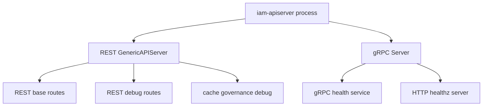
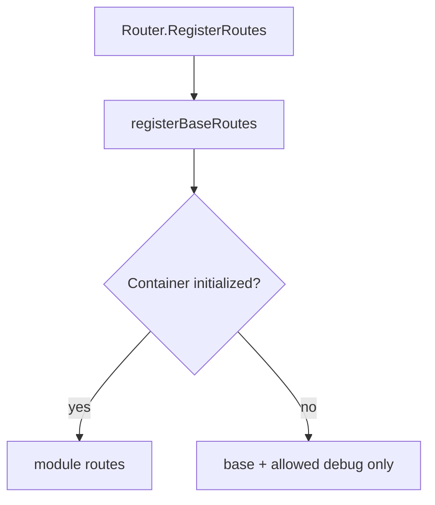
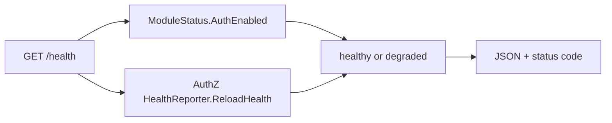
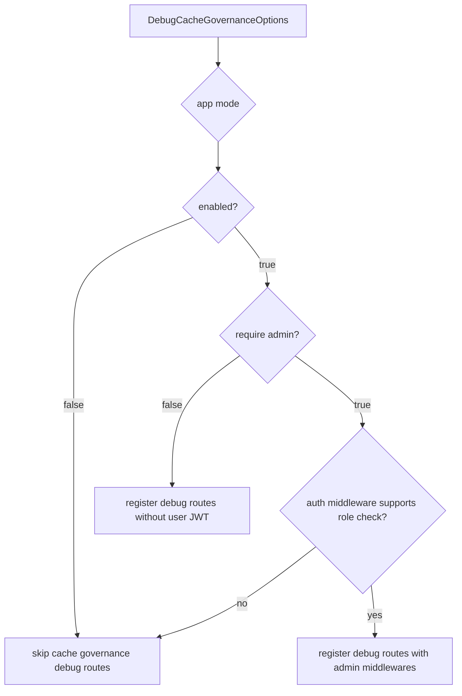
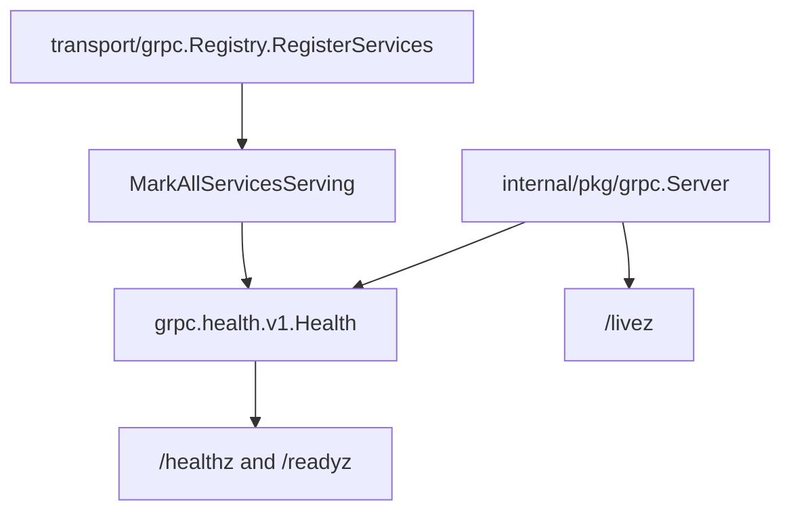
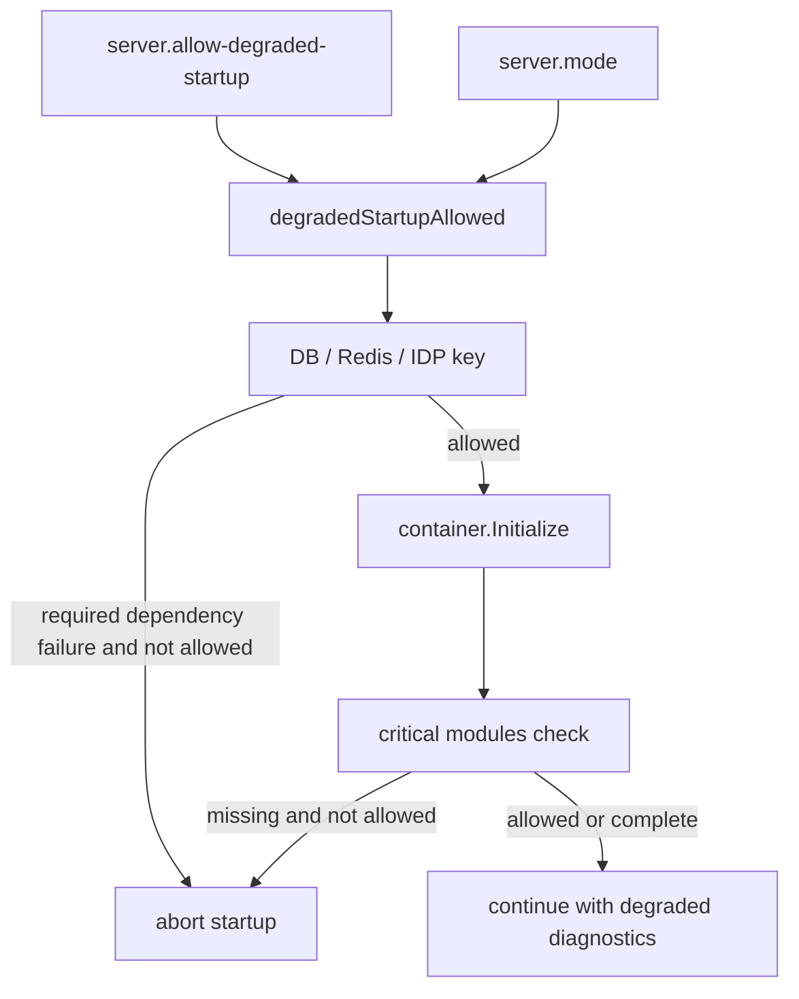

# 健康检查、debug 路由与降级启动边界

## 本文回答

本文回答：IAM 运行时暴露哪些健康和诊断入口、REST `/health` 与 gRPC `/healthz`/`/readyz`/`/livez` 分别代表什么、debug routes 如何受环境与 admin 保护约束，以及 `server.allow-degraded-startup` 的边界在哪里。

## 30 秒结论

- REST base routes 总是先注册，包含 `/health`、`/ping`、`/debug/routes`、`/debug/modules`、OpenAPI/Swagger 和 public info。
- REST `/health` 当前反映 AuthN 是否启用和 AuthZ runtime reload health；它不是完整 DB/Redis/EventBus 健康巡检。
- gRPC health 由 `internal/pkg/grpc.Server` 提供：标准 gRPC health service 加独立 HTTP `/healthz`、`/readyz`、`/livez`。
- Cache governance debug routes 在非 production 默认启用；production 即使显式开启也强制要求 admin protection，缺少 admin 中间件时不注册。
- 降级启动默认关闭；即使打开，release/production 模式也会拒绝降级。
- 降级只意味着进程保留诊断面或部分运行面，不意味着业务能力完整可用。

## 主图：健康与诊断入口



## 重点速查

| 入口 | 当前语义 | 代码证据 |
| ---- | ---- | ---- |
| `/health` | REST 运行面健康；依据 AuthN enabled 和 AuthZ reload health 决定 `healthy` 或 `degraded`。 | [../../internal/apiserver/transport/rest/health_routes.go](../../internal/apiserver/transport/rest/health_routes.go) |
| `/ping` | HTTP router 存活和基础连通性。 | [../../internal/apiserver/transport/rest/base_routes.go](../../internal/apiserver/transport/rest/base_routes.go) |
| `/debug/routes` | 返回 Gin 当前注册路由矩阵。 | [../../internal/apiserver/transport/rest/debug_routes.go](../../internal/apiserver/transport/rest/debug_routes.go) |
| `/debug/modules` | 返回 container 是否初始化，以及已初始化模块状态。 | [../../internal/apiserver/transport/rest/debug_routes.go](../../internal/apiserver/transport/rest/debug_routes.go) |
| `/debug/cache-governance/*` | 缓存治理只读诊断面。 | [../../internal/apiserver/transport/rest/debug_routes.go](../../internal/apiserver/transport/rest/debug_routes.go)、[../../internal/apiserver/application/cachegovernance](../../internal/apiserver/application/cachegovernance) |
| gRPC health service | 标准 `grpc.health.v1.Health`。 | [../../internal/pkg/grpc/server.go](../../internal/pkg/grpc/server.go) |
| gRPC `/healthz` | 检查整体 gRPC health status 是否 `SERVING`。 | [../../internal/pkg/grpc/server.go](../../internal/pkg/grpc/server.go) |
| gRPC `/readyz` | 就绪探针，同样依赖整体 gRPC health status。 | [../../internal/pkg/grpc/server.go](../../internal/pkg/grpc/server.go) |
| gRPC `/livez` | 独立 HTTP health server 存活，不证明业务依赖健康。 | [../../internal/pkg/grpc/server.go](../../internal/pkg/grpc/server.go) |
| 降级启动 gate | `server.allow-degraded-startup` 默认 false，release/production 不允许降级。 | [../../internal/pkg/options/server_run_options.go](../../internal/pkg/options/server_run_options.go)、[../../internal/apiserver/process/runtime_mode.go](../../internal/apiserver/process/runtime_mode.go) |

## 1. REST Base Routes 的稳定诊断面



`Router.RegisterRoutes` 的第一步永远是 `registerBaseRoutes`。这意味着只要 HTTP engine 被创建，下面这些入口优先存在：

| 路由 | 用途 | 注意事项 |
| ---- | ---- | ---- |
| `/health` | 汇总当前 REST 运行面状态。 | 当前只看 AuthN enabled 和 AuthZ reload health。 |
| `/ping` | 基础存活探针。 | 返回 router 和 auth 字段，但不代表 protected routes 一定已注册。 |
| `/debug/routes` | 查看当前实际路由列表。 | 排查“文档有、运行时没有”的第一入口。 |
| `/debug/modules` | 查看 container 和模块初始化状态。 | 用于解释 protected route 缺失原因。 |
| `/openapi`、`/swagger` | 静态合同与 Swagger UI。 | 说明合同存在，不说明某个运行时依赖已初始化。 |
| `/api/v1/public/info` | 服务基础信息。 | 不要求用户 JWT。 |

这种设计的重点是：即使 container 初始化失败或部分模块不可用，也保留最小诊断面，便于在非生产受控环境定位问题。

## 2. REST `/health` 的真实含义



`/health` 当前返回：

| 字段 | 含义 |
| ---- | ---- |
| `status` | `healthy` 或 `degraded`。 |
| `auth` / `auth_system.enabled` | AuthN token 能力是否启用。 |
| `authz_runtime.healthy` | AuthZ runtime reload health。 |
| `authz_runtime.last_error` | 最近一次 reload 错误文本。 |
| `authz_runtime.reloaded_at` | 最近一次 reload 成功时间。 |

状态码语义：

| 条件 | REST 状态 | HTTP status |
| ---- | ---- | ---- |
| AuthN enabled 且 AuthZ reload health healthy | `healthy` | `200` |
| AuthN 未启用或 AuthZ reload health 不健康 | `degraded` | `503` |

边界说明：

- `Container.HealthCheck(ctx)` 能检查 MySQL/Redis ping，但当前 REST `/health` 没有调用它。
- EventBus 不可用不会直接让 `/health` 变成 degraded；它影响 outbox relay 是否启动。
- `/health` 不等于每条业务路由可用，仍需结合 `/debug/routes` 和 `/debug/modules`。

## 3. Debug Routes 与 Cache Governance Read Model



Cache governance debug routes 的当前规则：

| 环境/配置 | 当前行为 | 代码证据 |
| ---- | ---- | ---- |
| 非 production，未显式配置 | 默认启用，不要求 admin。 | [../../internal/apiserver/transport/rest/debug_routes.go](../../internal/apiserver/transport/rest/debug_routes.go) |
| production，未显式配置 | 默认不注册。 | [../../internal/apiserver/transport/rest/debug_routes.go](../../internal/apiserver/transport/rest/debug_routes.go) |
| production，显式 enabled | 强制要求 admin protection。 | [../../internal/apiserver/transport/rest/debug_routes.go](../../internal/apiserver/transport/rest/debug_routes.go) |
| require admin 但 middleware 不支持 role check | 不注册。 | [../../internal/apiserver/transport/rest/debug_routes.go](../../internal/apiserver/transport/rest/debug_routes.go) |

当前只读入口：

- `/debug/cache-governance/catalog`
- `/debug/cache-governance/overview`
- `/debug/cache-governance/families/:family`

这组路由展示的是 `application/cachegovernance/catalog` 驱动的缓存治理读模型，不是缓存写入口。

## 4. gRPC Health 与 REST Health 的差异



| 探针 | 归属 | 当前语义 |
| ---- | ---- | ---- |
| REST `/health` | REST router | AuthN enabled + AuthZ reload health。 |
| gRPC health RPC | gRPC server | 标准 gRPC health status；服务注册后由 registry 标记为 `SERVING`。 |
| gRPC `/healthz` | 独立 HTTP health server | 检查整体 gRPC health status 是否 `SERVING`。 |
| gRPC `/readyz` | 独立 HTTP health server | 就绪探针，整体 gRPC health 非 `SERVING` 时返回 `NOT_READY`。 |
| gRPC `/livez` | 独立 HTTP health server | 只说明探针 server 存活。 |

不要把 REST `/health` 和 gRPC `/healthz` 混成一个概念。它们来自不同 server、不同端口、不同状态源。

## 5. 降级启动 Gate



降级启动的事实口径：

| 规则 | 当前实现 |
| ---- | ---- |
| 默认值 | `AllowDegradedStartup=false`。 |
| CLI/config key | `server.allow-degraded-startup` / `allow-degraded-startup`。 |
| release/production | 即使 flag 为 true，也不允许降级。 |
| DB 初始化失败 | 未允许降级则启动失败；允许时记录 warning 并继续。 |
| MySQL/Redis 不可用 | 未允许降级则启动失败；允许时对应 client 置空。 |
| IDP encryption key 缺失或非法 | 未允许降级则启动失败；允许时记录 warning。 |
| container 初始化不完整 | 未允许降级则启动失败；允许时继续进入 critical module validation。 |
| critical modules 缺失 | `idp`、`authn`、`authz`、`user` 缺失时，未允许降级则启动失败。 |
| EventBus 不可用 | 记录 warning 并继续；是否有 outbox relay 取决于 EventBus 是否创建成功。 |

`server.allow-degraded-startup` 是开发、测试、排障时的开关，不是生产容错策略。生产模式应该依赖外部编排系统重启、告警和回滚，而不是让缺失关键模块的业务面继续对外服务。

## 6. 降级与路由注册的关系

| 场景 | 路由结果 | 排查入口 |
| ---- | ---- | ---- |
| container 未初始化 | base routes 存在；module routes 跳过。 | `/debug/modules`、`/debug/routes` |
| AuthN 未装配或 TokenService 缺失 | protected routes 不注册；`/health` 可能 degraded。 | `/health`、`/debug/routes` |
| AuthZ reload 不健康 | `/health` 返回 degraded 和 reload 错误。 | `/health` |
| production cache governance debug 显式开启但 admin 不可用 | cache governance debug routes 不注册。 | logs、`/debug/routes` |
| gRPC services 未注册 | gRPC health 不应被当作对应业务服务可用。 | gRPC health、reflection、registry logs |

## 7. 运行时设计模式

| 模式 | 为什么用 | IAM 中如何落地 | 代价和边界 |
| ---- | ---- | ---- | ---- |
| Diagnostic Surface | 启动异常时仍需要最小排障入口。 | base routes 优先注册，`/debug/routes` 和 `/debug/modules` 保留事实视图。 | 诊断面必须避免泄露敏感操作能力。 |
| Fail Closed | debug/admin/protected routes 依赖安全能力，缺失时不能开放。 | production cache debug 强制 admin，admin middleware 不可用则不注册。 | 可能导致调试时路由缺失，需要看 debug routes 和日志。 |
| Read Model | 缓存治理只需要展示状态，不应触发写行为。 | `application/cachegovernance` 提供 catalog/overview/family 读模型。 | 读模型不保证底层缓存一定在线。 |
| Guarded Startup | 降级需要显式开关和环境约束。 | `degradedStartupAllowed` 禁止 release/production 降级。 | 降级只适合诊断，不替代生产 HA。 |

## 8. 验证入口

```bash
go test ./internal/apiserver/process ./internal/apiserver/transport/rest ./internal/pkg/grpc
make docs-hygiene
```

重点测试入口：

- [../../internal/apiserver/transport/rest/router_test.go](../../internal/apiserver/transport/rest/router_test.go)：cache governance debug routes、admin protection、protected route fail-closed。
- [../../internal/apiserver/process/prepare_runner_test.go](../../internal/apiserver/process/prepare_runner_test.go)：启动 stage 顺序。
- [../../internal/apiserver/config/config_contract_test.go](../../internal/apiserver/config/config_contract_test.go)：dev/prod gRPC 和运行时配置合同。
