# 后台任务与优雅关闭

## 本文回答

本文回答：IAM 在 HTTP/gRPC 请求处理之外，还运行了哪些后台任务；这些任务如何从业务模块暴露给 process；Outbox Relay 与 AuthZ Policy Sync 如何共同参与授权版本事件的发布与运行时同步；服务关闭时如何停止后台任务、清理模块资源、关闭数据库、HTTP 与 gRPC。

读完本文，你应该能回答：

- IAM 当前有哪些后台任务；
- 后台任务为什么不在 `main`、REST handler 或 gRPC service 中启动；
- `Container.BuildRuntimeDeps()` 的作用是什么；
- AuthN/JWKS key rotation scheduler 如何启动和停止；
- Outbox Relay 的 claim/publish/mark 流程是什么；
- AuthZ Policy Sync Subscriber 如何订阅 `iam.authz.version` 并触发授权运行时同步；
- Outbox Relay 与 AuthZ Policy Sync 的职责边界是什么；
- EventBus 不可用时，为什么 relay 不 claim outbox 事件，policy sync 也不会构建；
- Suggest 模块的 cron/refresher 如何进入关闭流程；
- `preparedAPIServer.Run()` 如何同时运行 HTTP 和 gRPC；
- graceful shutdown 的顺序是什么；
- shutdown 中每一步失败会如何处理。

本文只讨论运行时生命周期，不展开 AuthZ UoW、PolicyVersion、JWKS key model、Suggest 索引刷新算法等业务细节。

---

## 30 秒结论

IAM 的后台任务不直接散落在入口函数里，而是通过 container 暴露 typed runtime deps，再由 process 统一纳入生命周期：

```text
Container.BuildRuntimeDeps()
  -> RotationScheduler
  -> OutboxRelay
  -> AuthzPolicySync
  -> SuggestCleanup
```

当前运行时相关任务包括：

| 运行时能力 | 来源 | 启动位置 | 停止位置 |
| --- | --- | --- | --- |
| AuthN/JWKS key rotation scheduler | AuthN module runtime capabilities | `startRuntimeTasks` | lifecycle shutdown hook |
| Outbox relay loop | container eventing/outbox 初始化结果 | `startRuntimeTasks` | lifecycle shutdown hook cancel context |
| AuthZ policy sync subscriber | AuthZ module + EventBus subscriber | `startRuntimeTasks` | lifecycle shutdown hook |
| Suggest refresher / cron | Suggest module 初始化内部启动 | Suggest module Initialize | shutdown sequence 调用 `SuggestCleanup` |
| HTTP server | `GenericAPIServer` | `preparedAPIServer.Run` | shutdown sequence 调用 `Close()` |
| gRPC server | `grpc.Server` | `preparedAPIServer.Run` | shutdown sequence 调用 `Close()` |
| Graceful shutdown manager | process root | `preparedAPIServer.Run` 前启动 | 监听 POSIX signal 后执行 callbacks |

关闭顺序被明确锁定为：

```text
lifecycle hooks
  -> suggest cleanup
  -> database close
  -> HTTP close
  -> gRPC close
```

其中 lifecycle hooks 会停止：

```text
outbox relay
key rotation scheduler
authz policy sync subscriber
```

核心源码入口：

- [../../internal/apiserver/process/prepare_runner.go](../../internal/apiserver/process/prepare_runner.go)
- [../../internal/apiserver/process/shutdown_lifecycle.go](../../internal/apiserver/process/shutdown_lifecycle.go)
- [../../internal/apiserver/process/run_group.go](../../internal/apiserver/process/run_group.go)
- [../../internal/apiserver/container/runtime_deps.go](../../internal/apiserver/container/runtime_deps.go)
- [../../internal/apiserver/container/container.go](../../internal/apiserver/container/container.go)
- [../../internal/apiserver/infra/messaging/outbox_relay.go](../../internal/apiserver/infra/messaging/outbox_relay.go)
- [../../internal/apiserver/infra/mysql/eventoutbox/store.go](../../internal/apiserver/infra/mysql/eventoutbox/store.go)

---

## 主图：后台任务与关闭链路

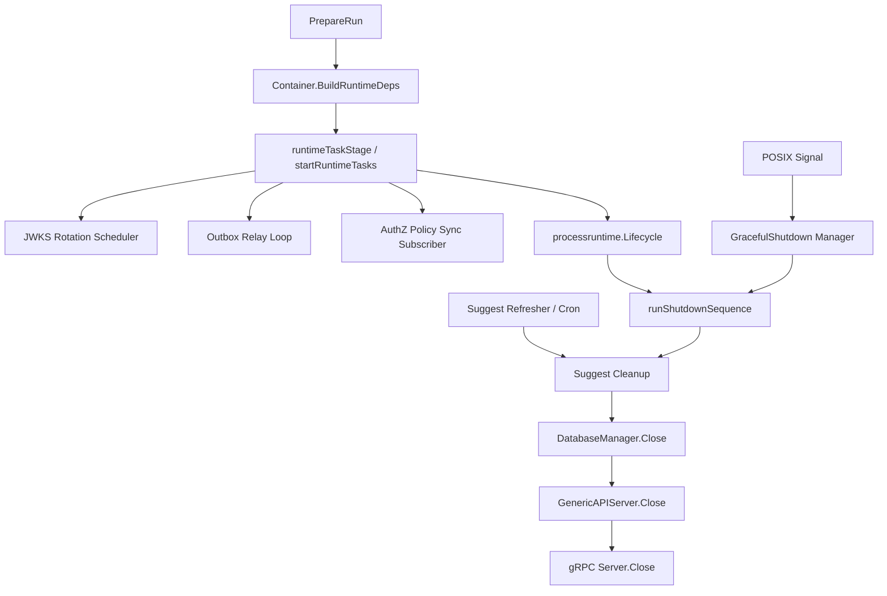

---

## 重点速查

| 问题 | 当前答案 | 代码证据 |
| --- | --- | --- |
| 后台任务在哪个 stage 启动 | `runtimeTaskStage` 调用 `startRuntimeTasks`。 | [../../internal/apiserver/process/prepare_runner.go](../../internal/apiserver/process/prepare_runner.go)、[../../internal/apiserver/process/shutdown_lifecycle.go](../../internal/apiserver/process/shutdown_lifecycle.go) |
| runtime deps 谁提供 | `Container.BuildRuntimeDeps()` 暴露 scheduler、outbox relay、authz policy sync、suggest cleanup。 | [../../internal/apiserver/container/runtime_deps.go](../../internal/apiserver/container/runtime_deps.go) |
| key rotation scheduler 来自哪里 | AuthN module 的 `RuntimeCapabilities().RotationScheduler`。 | [../../internal/apiserver/container/assembler/capabilities.go](../../internal/apiserver/container/assembler/capabilities.go)、[../../internal/apiserver/container/assembler/authn_scheduler_builder.go](../../internal/apiserver/container/assembler/authn_scheduler_builder.go) |
| key rotation cron 默认什么时候执行 | 当前 AuthN assembler 使用 `0 2 * * *`，即每天 2 点。 | [../../internal/apiserver/container/assembler/authn_scheduler_builder.go](../../internal/apiserver/container/assembler/authn_scheduler_builder.go) |
| Outbox store 何时创建 | container eventing 初始化时，有 MySQL 就创建 MySQL outbox store。 | [../../internal/apiserver/container/container.go](../../internal/apiserver/container/container.go) |
| Outbox relay 何时创建 | outbox store 和 EventBus 都存在时创建 relay。 | [../../internal/apiserver/container/container.go](../../internal/apiserver/container/container.go) |
| AuthZ policy sync 何时创建 | AuthZ module 和 EventBus 都存在时，由 container 构建 subscriber。 | [../../internal/apiserver/container/runtime_deps.go](../../internal/apiserver/container/runtime_deps.go)、[../../internal/apiserver/process/shutdown_lifecycle.go](../../internal/apiserver/process/shutdown_lifecycle.go) |
| AuthZ policy sync 监听什么 | 订阅 `iam.authz.version`，负责授权版本事件的运行时同步。 | [../../internal/apiserver/process/shutdown_lifecycle.go](../../internal/apiserver/process/shutdown_lifecycle.go) |
| EventBus 不可用怎么办 | outbox store 可保留，relay 不启动；AuthZ policy sync 不构建；事件保持 pending/failed。 | [../../internal/apiserver/container/eventing_test.go](../../internal/apiserver/container/eventing_test.go)、[../../internal/apiserver/container/runtime_deps.go](../../internal/apiserver/container/runtime_deps.go) |
| relay 如何投递 | claim due events，publish message，成功 mark published，失败 mark failed。 | [../../internal/apiserver/infra/messaging/outbox_relay.go](../../internal/apiserver/infra/messaging/outbox_relay.go) |
| shutdown 顺序如何验证 | 测试断言 lifecycle hooks、suggest、DB、HTTP、gRPC 顺序。 | [../../internal/apiserver/process/shutdown_lifecycle_test.go](../../internal/apiserver/process/shutdown_lifecycle_test.go) |
| HTTP/gRPC 如何并行运行 | `preparedAPIServer.Run()` 用 RunGroup 运行 HTTP 和 gRPC。 | [../../internal/apiserver/process/run_group.go](../../internal/apiserver/process/run_group.go) |

---

## 1. 后台任务的边界

后台任务不是业务请求处理的一部分。它们不应该由 REST handler、gRPC service 或 `main()` 启动。

IAM 当前把后台任务纳入 process lifecycle：

```text
container 负责暴露 runtime capability
process 负责启动和关闭
业务模块负责具体任务逻辑
```

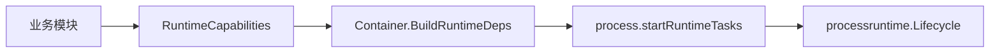

这样做的价值：

- process 不穿透模块内部字段；
- 任务启动顺序清楚；
- 任务关闭顺序可控；
- 运行时任务可以被测试；
- 业务规则仍留在 application/domain/infra 中。

---

## 2. RuntimeDeps：后台任务的组合边界

`Container.BuildRuntimeDeps()` 返回运行时依赖。

当前核心形态是：

```go
type RuntimeDeps struct {
    RotationScheduler RotationScheduler
    OutboxRelay       OutboxRelay
    AuthzPolicySync   AuthzPolicySyncSubscriber
    SuggestCleanup    func() error
}
```

这些字段分别对应：

| Runtime dep | 来源 | 说明 |
| --- | --- | --- |
| `RotationScheduler` | AuthN module runtime capabilities | JWKS/key rotation 调度 |
| `OutboxRelay` | container eventing/outbox 初始化结果 | 领域事件 outbox 异步投递 |
| `AuthzPolicySync` | AuthZ module + EventBus subscriber | 授权版本事件运行时同步 |
| `SuggestCleanup` | Suggest module runtime capabilities | 停止 Suggest cron/refresher |

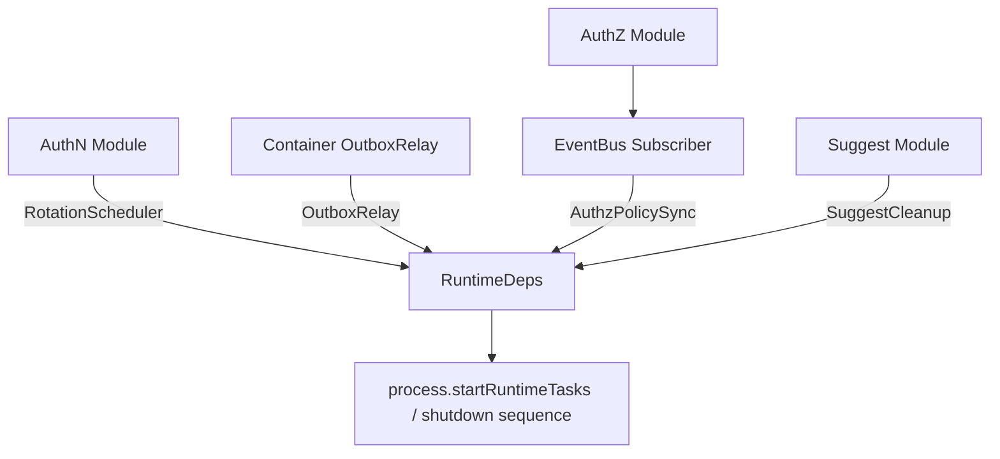

### 为什么不让 process 直接访问模块字段？

如果 process 直接访问：

```text
container.AuthnModule.rotationScheduler
container.AuthzModule.policySyncSubscriber
container.SuggestModule.cron
container.outboxRelay
```

会带来两个问题：

1. process 知道太多模块内部实现；
2. 模块内部重构会破坏 process。

当前通过 `RuntimeCapabilities()` 和 `BuildRuntimeDeps()` 暴露窄接口，可以避免这个问题。

核心源码：

- [../../internal/apiserver/container/runtime_deps.go](../../internal/apiserver/container/runtime_deps.go)
- [../../internal/apiserver/container/assembler/capabilities.go](../../internal/apiserver/container/assembler/capabilities.go)

---

## 3. RuntimeTaskStage：任务启动点

`PrepareRun()` 中的第五个 stage 是：

```text
start runtime tasks
```

它调用：

```text
s.server.startRuntimeTasks(&state.runtime.lifecycle)
```

`startRuntimeTasks` 当前处理三类“主动启动”的后台任务：

1. Key rotation scheduler；
2. Outbox relay loop；
3. AuthZ policy sync subscriber。

Suggest 的 refresher/cron 不是在这里启动的，而是在 Suggest module 初始化过程中启动；process 只在 shutdown sequence 中拿到 cleanup hook。

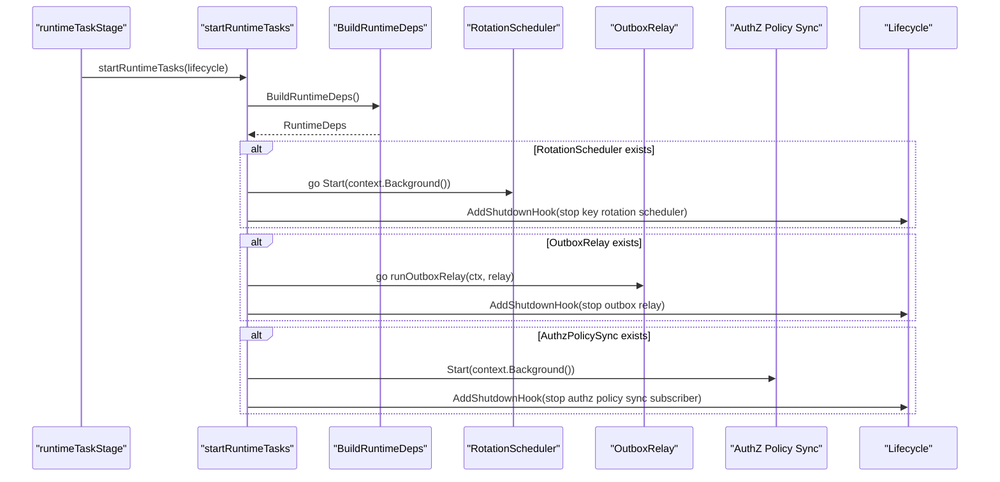

核心源码：

- [../../internal/apiserver/process/prepare_runner.go](../../internal/apiserver/process/prepare_runner.go)
- [../../internal/apiserver/process/shutdown_lifecycle.go](../../internal/apiserver/process/shutdown_lifecycle.go)

---

## 4. Key Rotation Scheduler

AuthN 模块会初始化 key rotation scheduler。

当前 assembler 中使用：

```text
schedulerInfra.NewKeyRotationCronScheduler(
    m.keyRotationApp,
    "0 2 * * *",
    logger,
)
```

即默认每天凌晨 2 点检查一次是否需要密钥轮换。

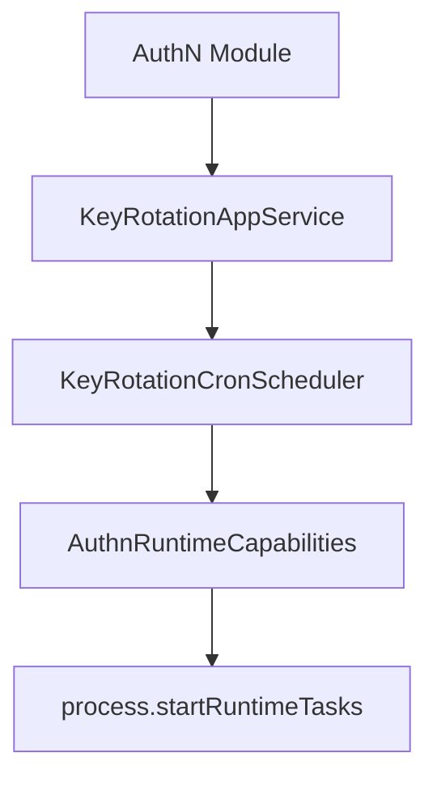

### 4.1 启动语义

process 启动 scheduler 的方式是：

```text
go scheduler.Start(context.Background())
```

如果 `Start` 返回错误，process 只记录 error log，不阻塞 HTTP/gRPC server 启动。

原因是：scheduler 是后台维护任务，不是 HTTP/gRPC transport 成功启动的前置条件。

但如果 scheduler 初始化失败，JWKS/key rotation 的自动维护能力会受影响，需要通过日志或后续 health/debug 方式排查。

### 4.2 Cron scheduler 行为

`KeyRotationCronScheduler.Start()` 会：

1. 防止重复启动；
2. 创建 context；
3. 创建 cron；
4. 添加 cron job；
5. 启动 cron；
6. 标记 running。

cron job 执行时会调用：

```text
checkAndRotate(ctx)
```

其内部逻辑是：

```text
KeyRotationAppService.ShouldRotate
  -> if ShouldRotate
  -> KeyRotationAppService.RotateKey
```

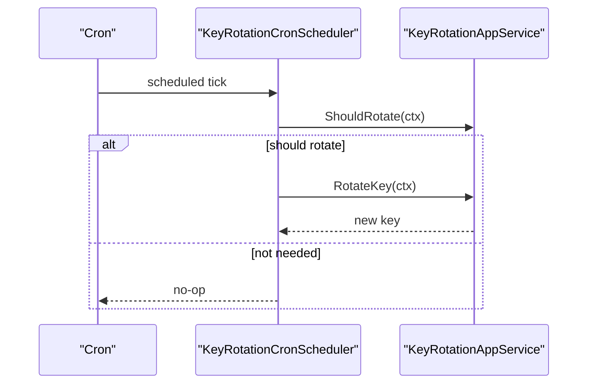

### 4.3 停止语义

shutdown hook 中会执行：

```text
if scheduler.IsRunning() {
    scheduler.Stop()
}
```

`Stop()` 会：

1. 停止 cron；
2. 等待正在执行的任务完成；
3. cancel context；
4. 标记 not running。

核心源码：

- [../../internal/apiserver/container/assembler/authn_scheduler_builder.go](../../internal/apiserver/container/assembler/authn_scheduler_builder.go)
- [../../internal/apiserver/infra/scheduler/key_rotation_cron_scheduler.go](../../internal/apiserver/infra/scheduler/key_rotation_cron_scheduler.go)
- [../../internal/apiserver/process/shutdown_lifecycle.go](../../internal/apiserver/process/shutdown_lifecycle.go)

---

## 5. Outbox Store 与 Relay 的创建

Outbox 由 container 的 eventing 初始化。

核心逻辑：

```text
initEventing()
  -> load event catalog
  -> create event publisher
  -> if mysqlDB != nil: create outbox store
  -> if eventBus != nil: create outbox relay
```

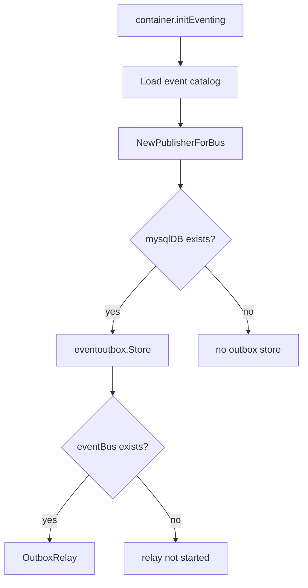

### 5.1 MySQL 存在但 EventBus 不存在

这是一个重要场景。

如果 MySQL 存在，但 EventBus 不存在：

```text
outboxStore != nil
outboxRelay == nil
AuthzPolicySync == nil
```

这意味着业务事务仍可以把事件 stage 到 `domain_event_outbox`，但不会启动 relay 投递，也不会启动 AuthZ policy sync subscriber。事件会保留在数据库中，等待 EventBus 可用后再进入 relay / subscriber 链路，或者通过其他显式 reload 机制补偿。

这个行为有测试保护。

### 5.2 EventBus 不可用不是“吞事件”

EventBus 不可用时，relay 不启动或 relay 进入 degraded，不 claim 事件。

这样做的结果是：

```text
pending/failed outbox rows 保留
不会被错误推进 publishing
不会制造大量无意义失败重试
```

核心源码：

- [../../internal/apiserver/container/container.go](../../internal/apiserver/container/container.go)
- [../../internal/apiserver/container/eventing_test.go](../../internal/apiserver/container/eventing_test.go)
- [../../internal/apiserver/infra/mysql/eventoutbox/store.go](../../internal/apiserver/infra/mysql/eventoutbox/store.go)
- [../../internal/apiserver/infra/messaging/outbox_relay.go](../../internal/apiserver/infra/messaging/outbox_relay.go)

---

## 6. Outbox Relay Loop

process 启动 outbox relay loop 的方式是：

```text
go s.runOutboxRelay(ctx, relay)
```

ctx 由 process 创建，并通过 lifecycle shutdown hook cancel。

`runOutboxRelay` 当前行为：

1. 读取 `events.outbox_relay_interval`；
2. interval 小于等于 0 时使用 2 秒；
3. 进入循环后先执行一次 `DispatchDue(ctx)`；
4. 之后每次 ticker 触发再执行；
5. `DispatchDue` 返回错误时记录 warning；
6. context 被 cancel 后退出。

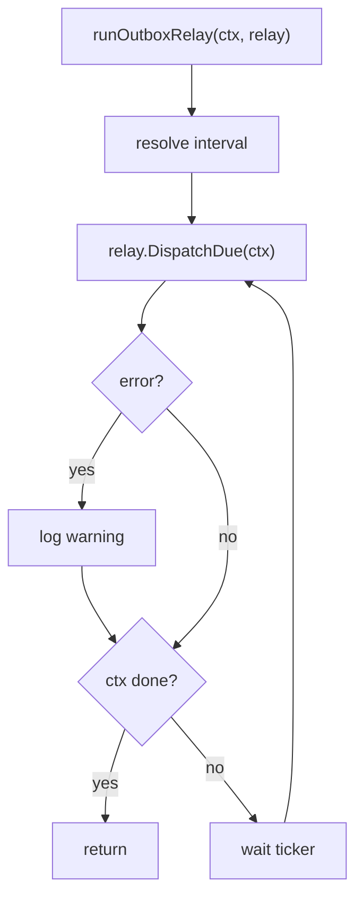

### 为什么 dispatch 失败不终止进程？

Outbox relay 是最终一致投递机制。

某次 claim/publish/mark 失败，不应导致 API server 整体退出。

正确行为是：

```text
记录失败
保留状态
等待下一轮重试
通过 outbox 状态观测积压
```

核心源码：

- [../../internal/apiserver/process/shutdown_lifecycle.go](../../internal/apiserver/process/shutdown_lifecycle.go)

---

## 7. Outbox Relay 的 claim / publish / mark

`OutboxRelay.DispatchDue(ctx)` 的流程是：

```text
if store nil:
  return nil

if publisher nil:
  log degraded
  return nil

pendingEvents = store.ClaimDueEvents(batchSize, now)

for each pending:
  PublishMessage(topic, payload, metadata)

  if publish success:
    MarkEventPublished(eventID)

  if publish failed:
    MarkEventFailed(eventID, err, now + retryDelay)
```

```mermaid
sequenceDiagram
    participant Loop as "relay loop"
    participant Relay as "OutboxRelay"
    participant Store as "Outbox Store"
    participant Bus as "EventBus Publisher"

    Loop->>Relay: DispatchDue(ctx)

    alt publisher unavailable
        Relay-->>Loop: warn degraded, return nil
    else publisher available
        Relay->>Store: ClaimDueEvents(batchSize, now)
        Store-->>Relay: pending events
        loop each event
            Relay->>Bus: PublishMessage(topic, payload)
            alt success
                Relay->>Store: MarkEventPublished(eventID)
            else failed
                Relay->>Store: MarkEventFailed(eventID, nextAttemptAt)
            end
        end
    end
```

### 7.1 ClaimDueEvents 的选择范围

Outbox store 会 claim：

| 状态 | 条件 |
| --- | --- |
| `pending` | `next_attempt_at <= now` |
| `failed` | `next_attempt_at <= now` |
| `publishing` | `updated_at <= staleBefore` |

非 sqlite 场景会使用：

```text
FOR UPDATE SKIP LOCKED
```

以减少多 relay 并发 claim 同一批事件的风险。

### 7.2 状态流转

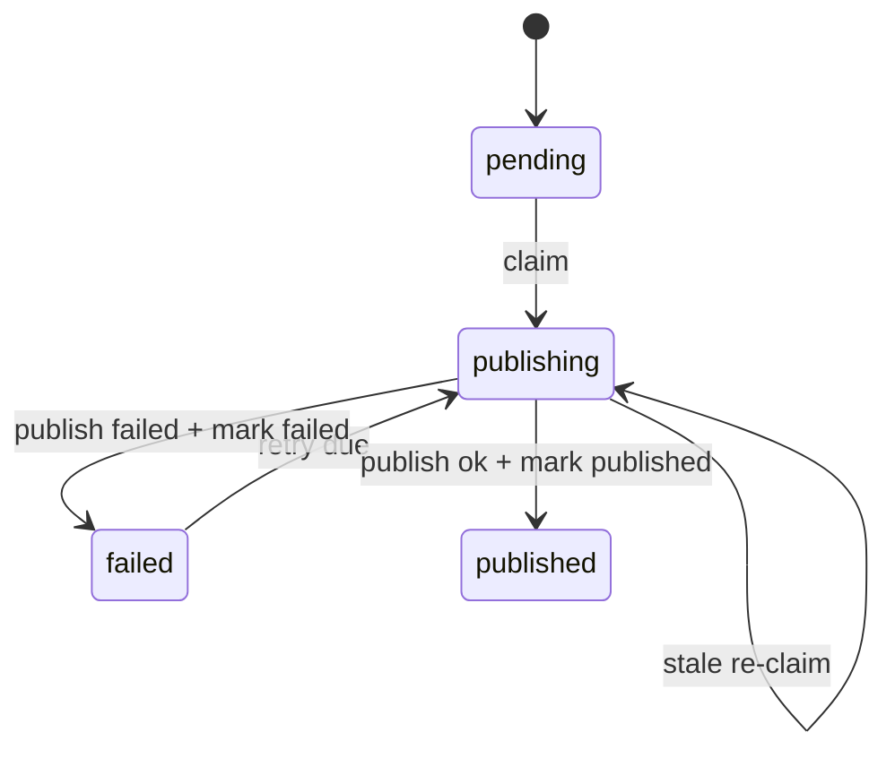

### 7.3 mark failed 的语义

发布失败时，relay 会：

```text
status = failed
last_error = error
next_attempt_at = now + retryDelay
attempt_count += 1
```

这让失败事件可以在 retry delay 后重新被 claim。

核心源码：

- [../../internal/apiserver/infra/messaging/outbox_relay.go](../../internal/apiserver/infra/messaging/outbox_relay.go)
- [../../internal/apiserver/infra/mysql/eventoutbox/store.go](../../internal/apiserver/infra/mysql/eventoutbox/store.go)

---

## 8. AuthZ Policy Sync Subscriber

AuthZ Policy Sync Subscriber 是本轮运行时文档需要补齐的最新事实。

它和 Outbox Relay 都和授权版本事件有关，但职责不同：

```text
Outbox Relay
  -> 从 domain_event_outbox claim due events
  -> publish 到 EventBus
  -> mark published / failed

AuthZ Policy Sync Subscriber
  -> 订阅 iam.authz.version
  -> 收到授权版本事件后触发授权运行时同步
```

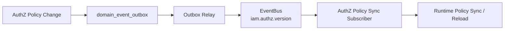

### 8.1 构建条件

AuthZ Policy Sync Subscriber 的构建依赖两个条件：

```text
AuthzModule != nil
eventBus != nil
```

也就是说：

```text
AuthZ 模块不可用 -> 不构建；
EventBus 不可用 -> 不构建。
```

这和 Outbox Relay 的边界一致：没有 EventBus，就不进入事件发布/订阅链路。

### 8.2 启动语义

process 在 `startRuntimeTasks` 中检测：

```text
if deps.AuthzPolicySync != nil {
    startAuthzPolicySync(lifecycle, deps.AuthzPolicySync)
}
```

启动时调用：

```text
sync.Start(context.Background())
```

并注册 shutdown hook：

```text
stop authz policy sync subscriber
```

启动日志中的 topic 是：

```text
iam.authz.version
```

### 8.3 与 Outbox Relay 的边界

不要把二者混在一起。

| 组件 | 角色 | 输入 | 输出 |
| --- | --- | --- | --- |
| Outbox Relay | 事件发布者 | `domain_event_outbox` due events | EventBus message |
| AuthZ Policy Sync | 事件消费者 | `iam.authz.version` topic | runtime policy sync / reload |

Outbox Relay 解决：

```text
授权版本事件如何从 DB outbox 可靠发布出去。
```

AuthZ Policy Sync 解决：

```text
进程如何消费授权版本事件并同步运行时授权状态。
```

核心源码：

- [../../internal/apiserver/container/runtime_deps.go](../../internal/apiserver/container/runtime_deps.go)
- [../../internal/apiserver/process/shutdown_lifecycle.go](../../internal/apiserver/process/shutdown_lifecycle.go)
- [../03-授权AuthZ/04-授权版本与事件传播链路-PolicyVersion-Outbox-RuntimeReload.md](../03-授权AuthZ/04-授权版本与事件传播链路-PolicyVersion-Outbox-RuntimeReload.md)

---

## 9. Suggest Refresher 与 Cleanup

Suggest 模块的后台刷新不在 `startRuntimeTasks` 中启动，而是在 Suggest module 初始化过程中启动。

`SuggestModule.InitializeWithDeps` 会：

1. 读取 suggest config；
2. 如果未启用，直接跳过；
3. 创建 search runtime；
4. 创建 loader；
5. 创建 refresher；
6. 执行一次 full refresh；
7. 创建 cron；
8. 注册 full/delta sync；
9. 启动 cron；
10. 保存 cancel function。

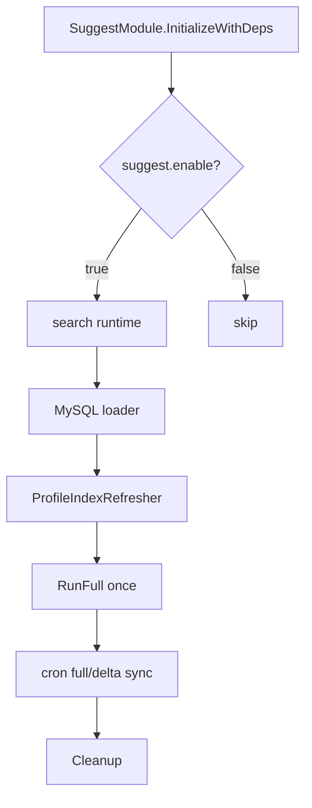

process 在 shutdown sequence 中通过 `SuggestCleanup` 停止它。

`Cleanup()` 会：

1. cancel context；
2. stop cron；
3. 等待 cron 停止完成。

这说明 Suggest 的启动权在模块内部，关闭权通过 runtime deps 暴露给 process。

核心源码：

- [../../internal/apiserver/container/assembler/suggest.go](../../internal/apiserver/container/assembler/suggest.go)
- [../../internal/apiserver/container/runtime_deps.go](../../internal/apiserver/container/runtime_deps.go)
- [../../internal/apiserver/process/shutdown_lifecycle.go](../../internal/apiserver/process/shutdown_lifecycle.go)

---

## 10. preparedAPIServer.Run 与 RunGroup

`PrepareRun()` 完成后，返回 `preparedAPIServer`。

真正阻塞运行服务的是：

```text
preparedAPIServer.Run()
```

其内部流程：

```text
buildPreparedServerRunDeps
  -> start graceful shutdown manager
  -> run HTTP and gRPC transports
```

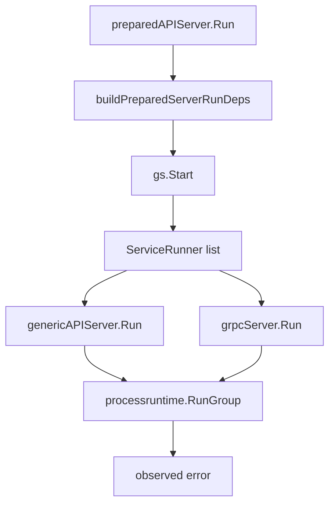

### 10.1 启动顺序

`runPreparedServerGroup` 会先执行：

```text
gs.Start()
```

再运行 HTTP/gRPC service group。

这意味着 POSIX signal manager 和 shutdown callbacks 已经准备好后，HTTP/gRPC 才开始阻塞运行。

### 10.2 ServiceRunner

当前 service runner 列表是：

```text
{Name: "http", Run: genericAPIServer.Run}
{Name: "grpc", Run: grpcServer.Run}
```

如果某个 server 为 nil，对应 runner 不参与运行。

如果没有 active service，直接返回 nil。

### 10.3 错误观测

`runPreparedServerTransports` 会包装服务的 Run 函数：

```text
observeServiceError
```

这样可以优先观测短生命周期服务返回的错误，避免错误被 run group 的 done 分支随机吞掉。

核心源码：

- [../../internal/apiserver/process/run_group.go](../../internal/apiserver/process/run_group.go)

---

## 11. Graceful Shutdown Manager

process 在创建 server 时会创建 graceful shutdown manager：

```text
shutdown.New()
gs.AddShutdownManager(posixsignal.NewPosixSignalManager())
```

它负责监听 POSIX signal，并触发 shutdown callbacks。

关闭 callback 在 `registerShutdownCallbacks` 中注册：

```text
s.gs.AddShutdownCallback(...)
```

callback 里执行：

```text
runShutdownSequence(...)
```

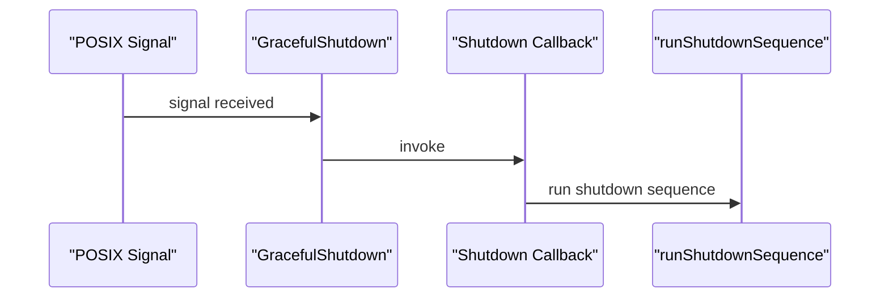

核心源码：

- [../../internal/apiserver/process/root.go](../../internal/apiserver/process/root.go)
- [../../internal/apiserver/process/shutdown_lifecycle.go](../../internal/apiserver/process/shutdown_lifecycle.go)

补充说明：项目依赖的 shutdown 组件采用 callback 模式处理 graceful shutdown，并支持 POSIX signal manager；其公开文档也将 POSIX signal 场景描述为收到 `SIGINT` / `SIGTERM` 后执行 shutdown callbacks。citeturn285820search0

---

## 12. Shutdown Sequence

关闭顺序：

```text
lifecycle.Run(...)
  -> cleanup suggest module
  -> close database connections
  -> close HTTP server
  -> close gRPC server
```

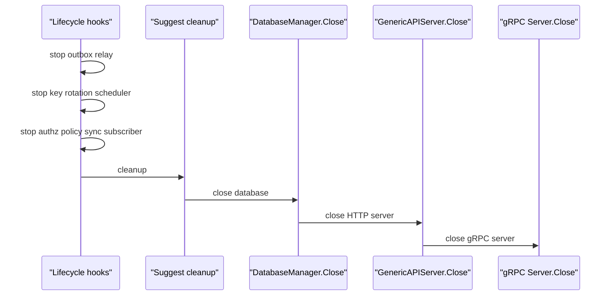

这条顺序有测试锁定：

```text
stop outbox relay
stop key rotation scheduler
stop authz policy sync subscriber
suggest cleanup
database close
http close
grpc close
```

### 12.1 为什么先 lifecycle hooks？

Outbox relay、key rotation scheduler 和 AuthZ policy sync subscriber 属于后台任务。

它们可能使用数据库、事件总线、key repository、authorization runtime 等资源。

因此应先停止后台任务，再关闭数据库和 server。

### 12.2 为什么 DB 在 HTTP/gRPC 之前关闭？

当前代码顺序是 DB close 在 HTTP/gRPC close 之前。

这意味着 shutdown 触发后，后台任务先停，Suggest cleanup 完成，然后数据库连接关闭，最后关闭 server。

这条顺序是当前实现事实。它并不表示所有系统都应这么设计；如果未来需要让 HTTP/gRPC 先停止接收请求再关闭 DB，需要修改 shutdown sequence 和测试。

### 12.3 单步失败如何处理？

`runShutdownStep` 对每一步：

```text
如果 run == nil：跳过
如果返回 error：记录 error，不阻断后续步骤
```

也就是说，shutdown 会尽量执行完整序列，而不是因为某一步失败就停止后续清理。

核心源码：

- [../../internal/apiserver/process/shutdown_lifecycle.go](../../internal/apiserver/process/shutdown_lifecycle.go)
- [../../internal/apiserver/process/shutdown_lifecycle_test.go](../../internal/apiserver/process/shutdown_lifecycle_test.go)

---

## 13. HTTP Close

`GenericAPIServer.Close()` 会：

1. 创建 10 秒 timeout context；
2. 如果 secure server 存在，调用 `Shutdown(ctx)`；
3. 如果 insecure server 存在，调用 `Shutdown(ctx)`；
4. 失败时记录 warning。

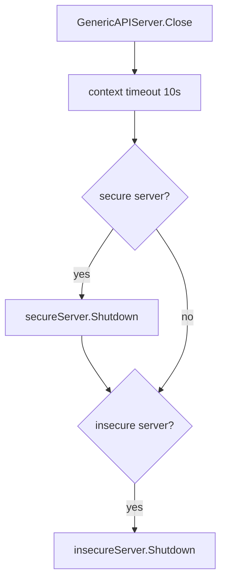

HTTP Run 本身会根据配置启动：

- insecure HTTP；
- secure HTTPS，如果 secure bind port 大于 0。

核心源码：

- [../../internal/pkg/server/genericapiserver.go](../../internal/pkg/server/genericapiserver.go)

---

## 14. gRPC Close

`grpc.Server.Close()` 语义更复杂。

它会：

1. 将整体 gRPC health status 标记为 `NOT_SERVING`；
2. 将每个已注册服务标记为 `NOT_SERVING`；
3. 关闭独立 HTTP healthz server；
4. 调用 `GracefulStop()`；
5. 如果 5 秒超时，调用 `Stop()` 强制停止；
6. 停止 mTLS 证书自动重载。

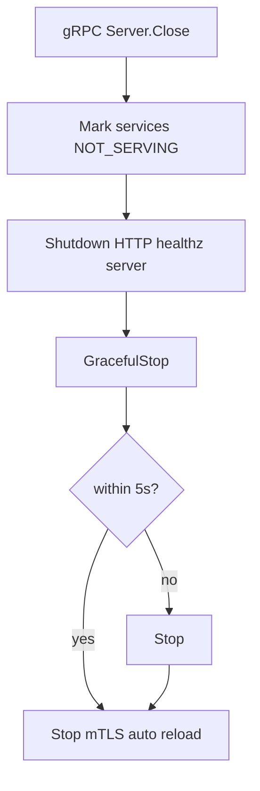

这个顺序的意义是：先让健康检查反映“不可服务”，再给已有 RPC 一段时间优雅退出，最后兜底强停。

核心源码：

- [../../internal/pkg/grpc/server.go](../../internal/pkg/grpc/server.go)

---

## 15. 失败边界

| 场景 | 当前行为 | 结果 |
| --- | --- | --- |
| RotationScheduler 不存在 | 不启动，不注册 stop hook | AuthN 无自动 key rotation 后台任务 |
| RotationScheduler.Start 返回错误 | 记录 error log，不阻塞服务启动 | 需要通过日志排查 |
| RotationScheduler.Stop 返回错误 | shutdown hook 返回错误，lifecycle 记录 | 后续 shutdown step 继续 |
| OutboxRelay 不存在 | 不启动 relay loop | outbox 不会主动投递 |
| EventBus 不可用 | relay 不启动或 DispatchDue degraded return nil；AuthZ policy sync 不构建 | outbox rows 保留 pending/failed，policy sync 不消费事件 |
| AuthzPolicySync 不存在 | 不启动，不注册 stop hook | 本进程不消费 `iam.authz.version` |
| AuthzPolicySync.Start 返回错误 | 记录 error log，不阻塞服务启动 | 需要通过日志排查授权版本同步状态 |
| AuthzPolicySync.Stop 返回错误 | shutdown hook 返回错误，lifecycle 记录 | 后续 shutdown step 继续 |
| ClaimDueEvents 失败 | DispatchDue 返回错误，loop 记录 warning | 下一轮继续 |
| PublishMessage 失败 | mark failed，设置 next attempt | 后续重试 |
| MarkEventPublished 失败 | 记录 mark_failed | 可能导致重复投递，消费者需按 event id 幂等 |
| SuggestCleanup 失败 | 记录 error，继续关闭 DB/HTTP/gRPC | 不阻断后续清理 |
| DB close 失败 | 记录 error，继续关闭 HTTP/gRPC | 不阻断后续清理 |
| HTTP close 失败 | 记录 warning/error | 后续 gRPC close 继续 |
| gRPC graceful stop 超时 | 强制 Stop | 防止进程无限等待 |

---

## 16. 与业务链路的关系

后台任务和 graceful shutdown 是运行时文档，不是业务链路文档。

它们与业务链路的关系如下：

| 运行时任务 | 关联业务 | 本文是否展开业务细节 |
| --- | --- | --- |
| Key rotation scheduler | JWKS/keyset 生命周期 | 不展开，AuthN/JWKS 文档详述 |
| Outbox relay | AuthZ policy version event、domain event 投递 | 不展开，AuthZ/Outbox 文档详述 |
| AuthZ policy sync subscriber | 授权版本事件消费与 runtime policy sync | 不展开，AuthZ PolicyVersion/RuntimeReload 文档详述 |
| Suggest cleanup | Suggest index refresh 生命周期 | 不展开，Identity/Suggest 文档详述 |
| HTTP/gRPC Close | 所有 API 入口 | 只讲关闭语义 |
| gRPC health status | gRPC 服务发现/探活 | 只讲运行时状态切换 |

本文只回答：

```text
这些任务如何进入进程生命周期
如何启动
如何停止
失败如何处理
```

---

## 17. 设计模式

| 模式 | 为什么用 | IAM 落地 | 代价和边界 |
| --- | --- | --- | --- |
| Runtime Capability | process 不应依赖模块内部字段 | `RuntimeCapabilities`、`BuildRuntimeDeps` | 新增后台任务要显式暴露 runtime dep |
| Lifecycle Hooks | 后台任务必须有序停止 | `processruntime.Lifecycle` | hook 只做停止/清理，不做业务补偿 |
| Polling Relay | 消息投递与业务事务解耦 | `runOutboxRelay` 周期 `DispatchDue` | 有投递延迟，需要监控积压 |
| Event Subscriber | 运行时消费授权版本事件 | `AuthzPolicySyncSubscriber` 订阅 `iam.authz.version` | 依赖 EventBus，可重复消费时需幂等 |
| Transactional Outbox | DB 事实与消息发布不能原子提交 | outbox store + relay | 消费端需要幂等 |
| Graceful Stop | 尽量让请求/RPC 收尾 | HTTP Shutdown、gRPC GracefulStop | 超时后仍会强制停止 |
| Fail Soft Shutdown | 某一步失败不阻断后续清理 | `runShutdownStep` 记录错误后继续 | 需要日志和监控发现清理失败 |

---

## 18. 推荐源码阅读路线

### 第一轮：看后台任务入口

```text
internal/apiserver/process/prepare_runner.go
internal/apiserver/process/shutdown_lifecycle.go
internal/apiserver/container/runtime_deps.go
```

目标：看清 runtime task stage 和 runtime deps。

### 第二轮：看 key rotation scheduler

```text
internal/apiserver/container/assembler/capabilities.go
internal/apiserver/container/assembler/authn_scheduler_builder.go
internal/apiserver/infra/scheduler/key_rotation_cron_scheduler.go
internal/apiserver/application/authn/jwks
```

目标：看清 scheduler 如何由 AuthN 暴露，如何按 cron 执行。

### 第三轮：看 outbox relay

```text
internal/apiserver/container/container.go
internal/apiserver/infra/mysql/eventoutbox/store.go
internal/apiserver/infra/messaging/outbox_relay.go
pkg/outbox
pkg/outboxcore
```

目标：看清 outbox store、claim、publish、mark 状态流转。

### 第四轮：看 AuthZ policy sync

```text
internal/apiserver/container/runtime_deps.go
internal/apiserver/process/shutdown_lifecycle.go
internal/apiserver/application/authz
internal/apiserver/domain/authz/policy
```

目标：看清 AuthZ policy sync subscriber 如何进入 runtime deps，如何订阅 `iam.authz.version`，以及它与 Outbox Relay 的边界。

### 第五轮：看 Suggest cleanup

```text
internal/apiserver/container/assembler/suggest.go
internal/apiserver/application/suggest
internal/apiserver/infra/suggest
```

目标：看清 Suggest refresher/cron 如何启动和停止。

### 第六轮：看 HTTP/gRPC 运行与关闭

```text
internal/apiserver/process/run_group.go
internal/pkg/server/genericapiserver.go
internal/pkg/grpc/server.go
```

目标：看清 prepared server 如何运行 HTTP/gRPC，以及 shutdown 如何关闭它们。

### 第七轮：看测试

```text
internal/apiserver/process/shutdown_lifecycle_test.go
internal/apiserver/container/eventing_test.go
internal/apiserver/infra/mysql/eventoutbox/store_test.go
internal/apiserver/infra/messaging
```

目标：看清 shutdown 顺序、EventBus 不可用和 outbox 状态语义如何被测试保护。

---

## 19. 验证建议

```bash
go test ./internal/apiserver/process \
  ./internal/apiserver/container \
  ./internal/apiserver/infra/messaging \
  ./internal/apiserver/infra/mysql/eventoutbox \
  ./internal/apiserver/infra/scheduler

make docs-hygiene
```

重点测试：

- [../../internal/apiserver/process/shutdown_lifecycle_test.go](../../internal/apiserver/process/shutdown_lifecycle_test.go)：shutdown 顺序。
- [../../internal/apiserver/container/eventing_test.go](../../internal/apiserver/container/eventing_test.go)：EventBus 不可用时 outbox store 保留、relay 不启动。
- [../../internal/apiserver/infra/mysql/eventoutbox/store_test.go](../../internal/apiserver/infra/mysql/eventoutbox/store_test.go)：outbox stage、claim、mark 状态。
- [../../internal/apiserver/infra/messaging](../../internal/apiserver/infra/messaging)：relay publish/mark 行为。

---

## 本文总结

IAM 的后台任务和优雅关闭可以压缩成一句话：

> container 暴露运行时能力，process 统一启动后台任务并注册 shutdown hook，shutdown sequence 按固定顺序停止任务、清理模块、关闭数据库、HTTP 和 gRPC。

关键链路是：

```text
BuildRuntimeDeps
  -> startRuntimeTasks
  -> lifecycle hooks
  -> runShutdownSequence
```

其中：

- key rotation scheduler 维护 JWKS/keyset；
- outbox relay 负责领域事件最终一致投递；
- AuthZ policy sync subscriber 订阅 `iam.authz.version`，负责授权版本事件的运行时同步；
- suggest cleanup 停止 Suggest 内部刷新任务；
- HTTP/gRPC 作为 prepared server transports 由 RunGroup 运行；
- graceful shutdown manager 接收 POSIX signal 后执行关闭序列。

这篇文档是后续理解 AuthN/JWKS、AuthZ/Outbox/RuntimeReload、Suggest 刷新机制的运行时基础。
