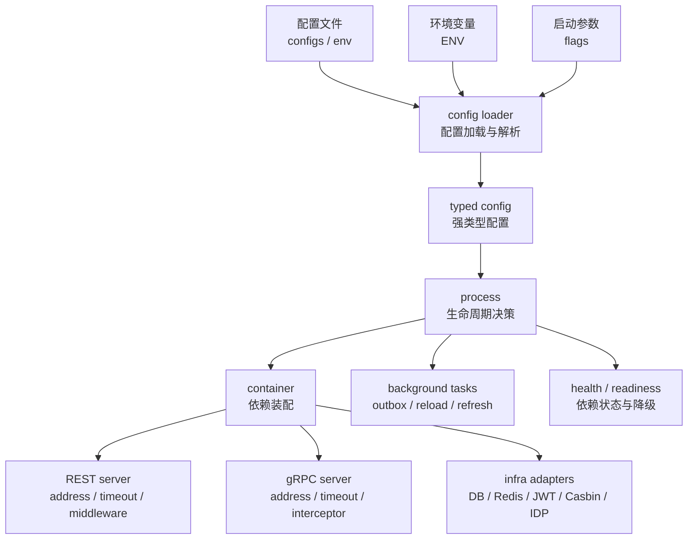

# 配置加载与运行模式

> 状态：待补证据 · 第一版正文，待继续按源码、配置结构、样例配置和启动脚本核对细节。

---

## 1. 本文回答

本文回答 6 个问题：

- iam-apiserver 的配置从哪里加载？
- 配置如何影响 process、container、REST/gRPC、infra adapter 和后台任务？
- 哪些配置属于必需依赖，哪些可以降级？
- local/dev/test/staging/prod 等运行模式应该如何理解？
- 敏感配置、密钥、外部身份源配置应该如何治理？
- 修改配置时应该同步哪些代码、样例、文档和测试？

本文只解释配置加载与运行模式的原则，不复制完整配置样例。具体字段以配置结构、样例配置和启动脚本为准。

---

## 2. 30 秒结论

运行配置决定 iam-apiserver 如何启动、连接外部资源、启用协议服务、装配模块和运行后台任务。

配置主线可以压缩为：

```text
config files / env / flags
  -> config loader
  -> typed config
  -> process lifecycle
  -> container dependency wiring
  -> REST/gRPC server
  -> infra adapters
  -> background tasks
```

配置负责：

```text
选择运行模式；
连接 MySQL / Redis 等资源；
配置 REST/gRPC 监听地址和超时；
配置 JWT/JWK/JWKS key；
配置 IDP 外部应用；
配置 Casbin / AuthZ runtime；
配置 Suggest runtime；
控制后台任务开关、频率和降级策略。
```

配置不负责：

```text
定义业务模型；
绕过领域规则；
替代权限判定；
替代认证流程；
隐藏跨模块依赖；
把规划能力伪装成已实现。
```

如果只记一句话：

> 配置控制“服务怎么运行”，不定义“IAM 的业务事实是什么”。

---

## 3. 配置加载总图



这张图表达 4 个边界：

```text
配置加载发生在 process 进入资源初始化和 container 装配之前；
container 根据 typed config 创建具体实现；
REST/gRPC、infra adapter、background tasks 都受配置影响；
配置错误应尽早失败或明确降级，不能静默变成错误业务行为。
```

---

## 4. 配置来源

IAM 的配置来源需要以当前代码和部署方式为准，通常包括：

```text
默认配置；
环境配置文件；
环境变量；
启动参数；
密钥管理系统或挂载文件；
容器运行时注入配置；
CI/CD 注入变量。
```

当前需要重点核对的事实源：

```text
../../internal/apiserver/config
../../configs
../../configs/env
启动脚本或部署配置
CI/CD 配置
```

当前配置覆盖优先级已经由 Viper 绑定与配置契约测试确认：

```text
默认值 < 配置文件 < 环境变量 < 启动参数
```

只有显式设置的命令行参数会覆盖环境变量和配置文件；flag 的默认值不会覆盖配置文件。

---

## 5. 配置加载阶段

配置加载通常发生在 process 生命周期早期。

推荐阶段：

```text
1. 读取运行模式；
2. 读取配置文件路径或环境；
3. 加载基础配置；
4. 应用环境变量或启动参数覆盖；
5. 解析成 typed config；
6. 校验必需字段；
7. 校验敏感配置来源；
8. 把 typed config 传给 process/container；
9. 根据配置初始化资源和模块。
```

配置加载阶段应该做：

```text
字段存在性校验；
类型校验；
枚举值校验；
地址、端口、超时、开关的基础校验；
密钥来源校验；
必需依赖缺失时 fail fast；
可降级依赖缺失时标记 degraded。
```

配置加载阶段不应该做：

```text
执行登录认证；
执行权限判定；
创建业务数据；
刷新业务索引；
发布 outbox 事件；
把配置值直接拼进领域模型绕过校验。
```

---

## 6. typed config 原则

配置应尽量解析为强类型结构，而不是在业务代码中到处读取字符串。

推荐：

```text
process 负责加载 typed config；
container 接收 typed config；
infra adapter 接收自己需要的配置子集；
application/domain 不直接读取原始环境变量；
handler 不直接读取配置文件。
```

避免：

```text
业务用例中直接 os.Getenv；
domain 中直接读取配置文件；
handler 中根据 env 决定 repository 实现；
infra adapter 到处重复解析同一个字符串配置；
配置字段用 map[string]any 传遍全系统。
```

设计原则：

> 配置读取集中化，配置使用局部化，业务规则不依赖原始配置来源。

---

## 7. 运行模式

IAM 只有一个运行模式真相源：

| 来源 | 配置键 |
| --- | --- |
| YAML | `server.mode` |
| 环境变量 | `IAM_APISERVER_SERVER_MODE` |
| 启动参数 | `--server.mode` |

只支持以下三个值：

| `server.mode` | 派生环境 | production-like |
| --- | --- | --- |
| `debug` | `development` | 否 |
| `test` | `test` | 否 |
| `release` | `production` | 是 |

输入会先去除首尾空白并转成小写；空值、拼写错误以及 `local`、`staging`、`development`、`production` 都会导致启动失败，不会降级为 development。

运行模式当前影响：

```text
Gin server mode；
是否允许 degraded startup；
调试缓存治理的生产鉴权保护；
JWKS 的开发环境自动初始化 fallback；
Suggest 生产环境手机号脱敏保护。
```

下列旧配置已删除，设置后启动直接失败：

```text
app.name / app.version / app.mode；
server.run-mode / server.name；
server.read-timeout / server.write-timeout。
```

IAM 当前没有可配置的 HTTP read/write timeout。Redis、gRPC 等子系统自己的同名 timeout 不受此删除影响。

运行模式不应该影响：

```text
User / Profile / ProfileLink 的领域含义；
LoginIdentity / Credential 的认证语义；
Role / Permission / RoleBinding 的授权语义；
ProfileLink 是否等于 Permission；
IDP 是否拥有 IAM 登录态；
Suggest 是否拥有 Profile 写模型。
```

设计原则：

> 运行模式可以影响“怎么跑”，不能改变“业务是什么”。

---

## 8. 必需依赖与可降级依赖

配置需要区分必需依赖和可降级依赖。

### 8.1 必需依赖

必需依赖不可用时，服务通常应 fail fast。

可能的必需依赖包括：

```text
主数据库；
关键迁移或 schema；
JWT 签名 key；
AuthN 必需 token 配置；
REST 或 gRPC 至少一种对外服务配置；
核心 repository 依赖。
```

判断标准：

```text
缺失后核心身份、认证、授权能力无法正确运行；
继续启动会导致错误业务行为；
不能通过 degraded 状态安全承载流量。
```

---

### 8.2 可降级依赖

可降级依赖不可用时，服务可以启动但进入 degraded 状态，或只关闭部分能力。

可能的可降级依赖包括：

```text
部分外部 IDP provider；
Suggest index refresh；
metrics / profiling；
某些后台刷新任务；
非关键缓存；
gRPC reflection；
调试入口。
```

判断标准：

```text
缺失后不会破坏核心数据正确性；
可以通过 readiness、feature switch 或 degraded 标记对外说明；
调用相关功能时能返回明确错误或降级结果；
恢复后可以自动或手动恢复能力。
```

注意：哪些依赖可以降级，必须以当前代码实现为准。没有代码支撑时，应标记为 `规划改造` 或 `待补证据`。

---

## 9. 配置分类

### 9.1 服务基础配置

服务基础配置通常包括：

```text
service name；
run mode；
log level；
timezone；
request timeout；
shutdown timeout；
metrics / tracing / profiling 开关。
```

边界：

```text
这些配置影响运行时行为；
不应该定义业务规则；
不应该包含敏感密钥明文。
```

---

### 9.2 REST 配置

REST 配置通常包括：

```text
enabled；
listen address；
port；
read/write timeout；
CORS；
trusted proxies；
body size limit；
health/readiness path；
pprof/metrics 开关。
```

边界：

```text
REST 配置决定 HTTP 服务如何暴露；
REST 契约以 api/rest 为准；
配置不能绕过 OpenAPI 事实；
handler 不应该直接读取 REST 配置决定业务逻辑。
```

---

### 9.3 gRPC 配置

gRPC 配置通常包括：

```text
enabled；
listen address；
port；
max message size；
keepalive；
reflection；
health service；
TLS；
interceptor 开关。
```

边界：

```text
gRPC 配置决定 RPC 服务如何暴露；
gRPC 契约以 api/grpc proto 为准；
配置不能改变 proto 语义；
service implementation 不应该根据配置绕过 application。
```

---

### 9.4 数据库配置

数据库配置通常包括：

```text
DSN 或连接参数；
max open connections；
max idle connections；
connection lifetime；
timeout；
migration 开关或 schema 校验策略。
```

边界：

```text
数据库配置属于 infra；
domain 不应该知道数据库配置；
repository adapter 使用数据库配置；
业务用例不应该拼接 DSN 或直接管理连接池。
```

---

### 9.5 Redis / Cache 配置

Redis 或缓存配置通常包括：

```text
address；
password / auth；
db index；
pool size；
timeout；
key prefix；
TTL；
是否启用缓存。
```

边界：

```text
Redis 配置属于 infra；
缓存不可用时是否降级必须有明确策略；
TTL 可以影响性能和一致性窗口，但不能改变领域事实；
业务正确性不能完全依赖易失缓存。
```

---

### 9.6 AuthN / Token 配置

AuthN / Token 配置通常包括：

```text
issuer；
audience；
access token TTL；
refresh token TTL；
JWT signing algorithm；
private key source；
public key / JWKS 配置；
key id / key rotation；
refresh token store；
password hash 参数。
```

边界：

```text
Token 配置影响认证凭证生命周期；
JWT/JWKS 是 AuthN infra 能力；
Token 配置不定义 User/Profile；
Token 配置不替代 AuthZ Check；
生产环境不应使用弱密钥或硬编码私钥。
```

---

### 9.7 AuthZ / Casbin 配置

AuthZ / Casbin 配置通常包括：

```text
casbin model path；
policy source；
policy reload interval；
policy version check；
outbox dispatcher 开关；
outbox polling interval；
授权 runtime 缓存配置。
```

边界：

```text
Casbin 配置属于 infra runtime；
AuthZ 领域模型仍是 Subject / Resource / Action / Scope / Role / Permission / RoleBinding；
配置不能把 Casbin facts 写成领域语言；
Outbox 配置不等于 exactly-once 保证。
```

---

### 9.8 IDP 配置

IDP 配置通常包括：

```text
provider；
appid；
secret source；
callback / redirect 配置；
external API endpoint；
access token cache TTL；
timeout；
mock provider 开关。
```

边界：

```text
IDP 配置用于外部身份源适配；
IDP secret 不应明文提交到仓库；
IDP AppToken 是外部平台 token，不是 IAM AccessToken；
IDP 配置不创建 IAM 登录态；
IAM 登录态仍由 AuthN 决定。
```

---

### 9.9 Suggest 配置

Suggest 配置通常包括：

```text
enabled；
index source；
refresh mode；
refresh interval；
snapshot path 或 store；
max results；
query normalization；
phone search 开关；
rate limit；
masking policy。
```

边界：

```text
Suggest 配置影响读模型和搜索体验；
Suggest 不拥有 Profile 写模型；
Profile 主事实仍属于 Identity；
手机号搜索必须考虑脱敏、限流和审计；
索引不可用时应有明确降级策略。
```

---

### 9.10 后台任务配置

后台任务配置通常包括：

```text
task enabled；
interval；
batch size；
retry policy；
concurrency；
lock / lease；
timeout；
shutdown drain timeout。
```

边界：

```text
后台任务配置影响任务运行方式；
任务不应该绕过 application 修改核心事实；
任务必须响应 context cancellation；
任务失败应有可观测日志和恢复策略。
```

---

## 10. 敏感配置治理

敏感配置包括：

```text
数据库密码；
Redis 密码；
JWT private key；
JWK key material；
微信/企微 app secret；
第三方 API token；
加密 salt；
内部服务凭证。
```

治理原则：

```text
不提交明文密钥到 Git；
样例配置使用 placeholder；
生产密钥通过环境变量、密钥管理系统或挂载文件注入；
日志中不打印敏感值；
错误响应中不返回敏感配置；
docs 中不复制真实 secret；
密钥轮换需要有明确策略和验证方式。
```

配置文档可以说明语义，但不能泄露真实值。

### 10.1 生产内联秘密

`configs/apiserver.prod.yaml` 是可提交的生产结构和非敏感默认值，不是 secret
载体。数据库密码、Redis 密码、IDP 加密键、短信凭据和内部服务共享密钥必须保持
为空，由部署环境或 secret manager 注入。

启动诊断只能输出：

```text
使用的配置文件路径；
已加载的配置键名；
环境变量是 <set> 还是 <unset>。
```

禁止输出配置值、环境变量值、完整 Options、命令行中的 password / secret / token /
key / credential 参数值。

部署包中的 `configs/env/config.prod.env` 包含运行时 secret，生成时权限必须是
`0600`，同步到服务端后权限必须是 `0640` 并归属服务运行用户。部署成功或失败后都要
清理 runner 和远端 `/tmp` 中的临时部署包。

### 10.2 Seed Mock 内部建号接口

内部建号接口不是默认生产能力：

```text
POST /api/v2/internal/authn/mock-consumers/ensure
Header: X-IAM-Seed-Secret
```

仓库配置固定为：

```yaml
seed_mock_auth:
  enabled: false
  shared_secret: ""
```

只有需要 seeddata-runner 每日模拟的部署环境才设置：

```text
IAM_APISERVER_SEED_MOCK_AUTH_ENABLED=true
IAM_APISERVER_SEED_MOCK_AUTH_SHARED_SECRET=<secret manager 注入>
```

`enabled=true` 且共享密钥为空属于配置错误，iam-apiserver 必须 fail fast；不得静默
跳过路由。关闭时部署包必须清空共享密钥，避免残留 secret 被继续分发。

seeddata-runner 使用 `IAM_MOCK_CONSUMER_SHARED_SECRET`。两端必须引用同一轮生成的新
密钥，但不得把密钥写入任一仓库。更新 runner 前先用 `systemctl cat` 和
`systemctl show` 核对实际生效的 `EnvironmentFile` 与 drop-in，不能假定固定路径。

轮换时暂停 seeddata-runner，部署并验证 IAM 后再恢复。缺失或错误密钥应返回
`401`；正确密钥配合无效请求体应返回 `400`，可在不写业务数据的情况下证明鉴权已
通过。

---

## 11. 配置与业务规则的边界

配置可以改变运行行为，但不应该改变领域语义。

允许：

```text
调整 token TTL；
调整连接池大小；
调整缓存 TTL；
启停 gRPC reflection；
启停 Suggest refresh；
选择 IDP provider；
设置 outbox polling interval。
```

不允许：

```text
通过配置让 ProfileLink 变成 Permission；
通过配置让 IDP 创建 IAM Session；
通过配置绕过 AuthZ Check；
通过配置让 handler 直接访问 repository；
通过配置改变 User / Principal / Subject 的含义；
通过配置把规划能力伪装成已实现能力。
```

设计原则：

> 配置是运行参数，不是领域模型的替代品。

---

## 12. 配置变更流程

新增或修改配置字段时，建议按以下顺序处理：

```text
1. 修改配置结构或加载代码；
2. 修改默认值或样例配置；
3. 修改部署配置或环境变量注入；
4. 修改 container/process 使用逻辑；
5. 修改相关测试；
6. 修改运行时文档；
7. 修改接入文档或专题文档（如果影响外部行为）；
8. 更新 docs-hygiene 或配置校验规则（如果需要）。
```

配置变更检查点：

```text
字段是否有默认值；
字段是否必填；
字段是否敏感；
字段是否有合法范围；
字段缺失时 fail fast 还是 degraded；
是否影响 REST/gRPC/SDK 契约；
是否影响后台任务；
是否影响 health/readiness；
是否需要迁移旧配置。
```

---

## 13. 配置校验原则

配置校验应尽早发生，避免服务启动后才暴露配置错误。

推荐校验：

```text
必填字段非空；
端口范围合法；
URL / DSN 格式合法；
TTL / timeout / interval 为正数；
枚举值合法；
生产模式禁止 insecure 配置；
启用某能力时必需依赖存在；
互斥配置不能同时启用；
secret source 可读取。
```

避免：

```text
配置错误被静默忽略；
使用零值导致不安全行为；
生产模式自动降级到 mock；
密钥加载失败后仍签发 token；
数据库不可用但服务仍标记 ready。
```

---

## 14. 运行模式与降级启动

运行模式和降级启动要分开理解。

`server.allow-degraded-startup` 只是显式请求，最终是否允许由解析后的 RuntimeProfile 决定：

| `server.mode` | 开关为 `false` | 开关为 `true` |
| --- | --- | --- |
| `debug` | 禁止 | 允许 |
| `test` | 禁止 | 允许 |
| `release` | 禁止 | 仍然禁止 |

`release` 的生产安全规则不可被 degraded 开关绕过。未知模式会在资源初始化前失败，也不会通过默认分支获得 degraded 权限。

降级启动细节见 [06-健康检查与降级启动.md](06-健康检查与降级启动.md)。

---

## 15. 常见反模式

| 反模式 | 问题 | 推荐做法 |
| --- | --- | --- |
| domain 中直接 `os.Getenv` | 领域层依赖运行环境 | process 加载 typed config，container 注入依赖 |
| handler 读取配置决定 repository 实现 | transport 吞并装配职责 | container 根据配置装配具体实现 |
| 配置文件提交真实 secret | 安全风险 | 使用 placeholder、env、secret manager 或挂载文件 |
| 配置缺失静默使用零值 | 可能导致不安全或错误行为 | 启动时校验并 fail fast/degraded |
| prod 模式启用 mock provider | 生产安全风险 | 按运行模式校验禁止 insecure 配置 |
| 配置控制业务语义 | 业务模型漂移 | 配置只控制运行方式 |
| 配置文档复制完整样例 | 容易过时且可能泄露敏感信息 | 文档解释语义，样例以 configs 为准 |
| 修改配置字段但不改样例 | 部署不可用 | 同步 configs/configs/env 和部署配置 |
| 修改配置但不改 Verify | 漂移不可见 | 补充测试或 docs-hygiene |

---

## 16. 和其他运行时文档的关系

| 文档 | 关系 |
| --- | --- |
| [01-服务入口与生命周期.md](01-服务入口与生命周期.md) | 配置加载发生在 process 生命周期早期，影响资源初始化和服务启动 |
| [02-组合根与依赖装配.md](02-组合根与依赖装配.md) | container 根据 typed config 创建具体依赖 |
| [03-REST与gRPC传输层装配.md](03-REST与gRPC传输层装配.md) | REST/gRPC 是否启用、地址、超时、reflection 等由配置控制 |
| [05-后台任务与优雅关闭.md](05-后台任务与优雅关闭.md) | 后台任务开关、间隔、并发、shutdown timeout 由配置控制 |
| [06-健康检查与降级启动.md](06-健康检查与降级启动.md) | 配置决定依赖是否必需、是否允许 degraded、health/readiness 如何表现 |

---

## 17. 事实源

本文是配置语义说明，不是配置契约本身。

当本文与代码、配置样例、部署配置或测试冲突时，按以下优先级判断：

1. 配置加载源码与运行时行为。
2. 配置结构、样例配置、部署配置和环境变量注入。
3. 测试：配置加载测试、运行时测试、架构测试。
4. 现行维护中的 `docs/`。
5. `_archive/` 历史材料。

当前主要事实源：

| 事实 | 路径 |
| --- | --- |
| 配置加载代码 | `../../internal/apiserver/config` |
| 生命周期管理 | `../../internal/apiserver/process` |
| 组合根 | `../../internal/apiserver/container` |
| 样例配置 | `../../configs` |
| 环境配置 | `../../configs/env` |
| REST transport | `../../internal/apiserver/transport/rest` |
| gRPC transport | `../../internal/apiserver/transport/grpc` |
| Infra 层 | `../../internal/apiserver/infra` |
| 架构测试 | `../../internal/pkg/architecture` |

---

## 18. Verify

修改本文后至少执行：

```bash
make docs-hygiene
```

涉及配置结构、加载逻辑或运行模式时，执行：

```bash
go test ./pkg/app ./pkg/flag ./internal/apiserver/options ./scripts/cd
go test ./internal/apiserver/config/...
go test ./internal/apiserver/...
```

如果当前没有独立 config 测试包，以实际代码结构为准；不要假装已有测试。

涉及分层边界时，执行：

```bash
go test ./internal/pkg/architecture
```

涉及 REST/gRPC 配置或契约时，执行：

```bash
make api-validate
make proto-gen
go test ./internal/apiserver/transport/grpc/...
```

涉及 SDK 接入配置时，执行：

```bash
go test ./pkg/sdk/...
```

---

## 19. 本文总结

配置加载与运行模式可以压缩成一条主线：

```text
配置文件 / 环境变量 / 启动参数
  -> config loader
  -> typed config
  -> process 生命周期
  -> container 依赖装配
  -> REST/gRPC / infra / background tasks / health
```

最重要的边界是：

```text
配置控制运行方式；
配置不定义业务模型；
配置不绕过领域规则；
配置不隐藏跨模块依赖；
敏感配置不进入 Git 和日志；
配置字段变化必须同步代码、样例、部署、测试和文档。
```

维护配置文档时，必须持续核对配置源码、样例配置和运行时行为，避免文档中的配置说明与真实部署方式漂移。
