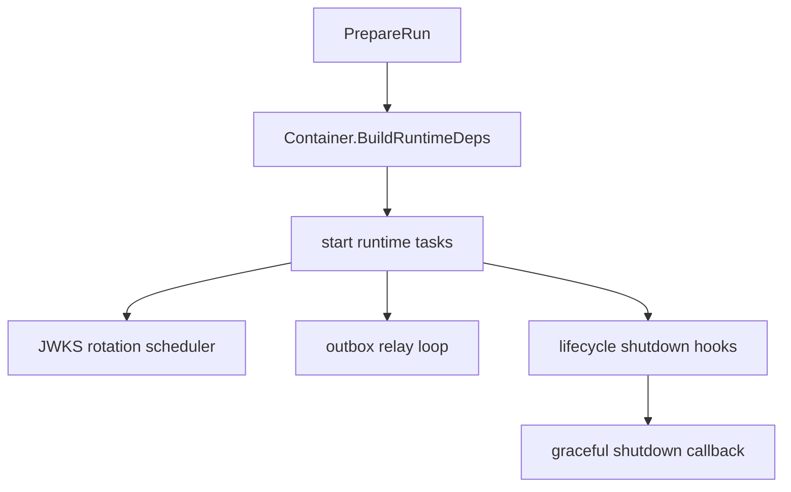
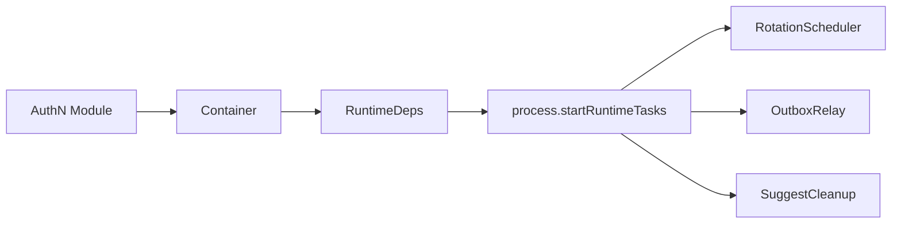
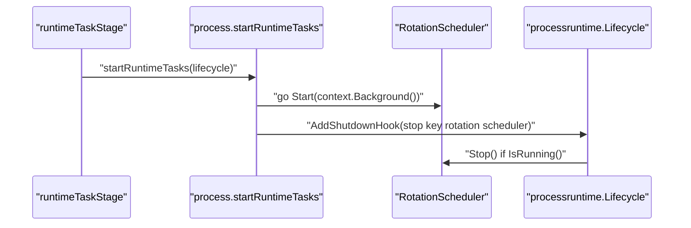
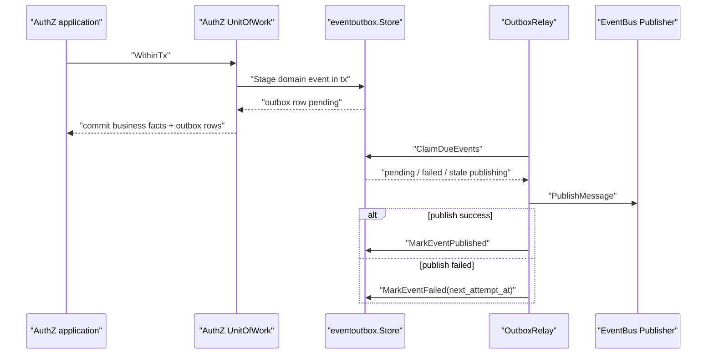
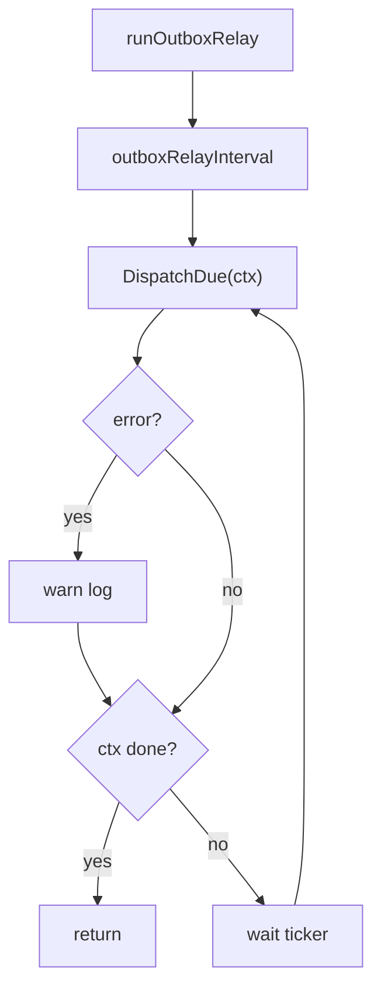
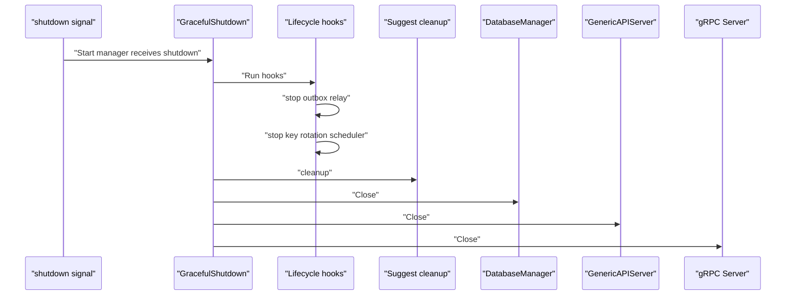
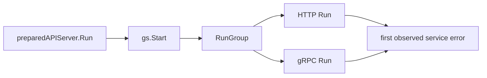

# 后台任务与优雅关闭

## 本文回答

本文回答：IAM 在 HTTP/gRPC 服务之外还启动了哪些后台任务，这些任务如何从 container 暴露到 process，transactional outbox relay 如何保证事件先入库再异步投递，以及优雅关闭时如何停止后台任务、清理模块资源并关闭 DB/HTTP/gRPC。

## 30 秒结论

- 后台任务在 `start runtime tasks` stage 启动，依赖 `Container.BuildRuntimeDeps()` 暴露的 typed runtime deps。
- 当前后台任务包括 AuthN/JWKS key rotation scheduler 和 domain event outbox relay；Suggest cleanup 只在 shutdown sequence 中调用。
- Outbox relay 只有在 MySQL outbox store 和 EventBus 都可用时才启动；EventBus 不可用时 outbox store 仍可保留 pending 事件。
- Relay loop 启动后会立即 `DispatchDue`，随后按 `events.outbox_relay_interval` 周期调度；失败只记录 warning，等待下一轮重试。
- 优雅关闭顺序由 process lifecycle 管理：先运行 lifecycle hooks 停 outbox relay 和 key rotation scheduler，再做 suggest cleanup、DB close、HTTP close、gRPC close。
- 本篇只描述运行时行为；不改变 outbox、UoW、事件合同或 server shutdown 代码。

## 主图：后台任务生命周期



## 重点速查

| 问题 | 当前答案 | 代码证据 |
| ---- | ---- | ---- |
| 后台任务在哪个 stage 启动 | `runtimeTaskStage` 调用 `startRuntimeTasks`。 | [../../internal/apiserver/process/prepare_runner.go](../../internal/apiserver/process/prepare_runner.go)、[../../internal/apiserver/process/shutdown_lifecycle.go](../../internal/apiserver/process/shutdown_lifecycle.go) |
| runtime deps 谁提供 | `Container.BuildRuntimeDeps()` 暴露 scheduler、outbox relay、suggest cleanup。 | [../../internal/apiserver/container/runtime_deps.go](../../internal/apiserver/container/runtime_deps.go) |
| JWKS rotation scheduler 来自哪里 | AuthN module 的 runtime capabilities。 | [../../internal/apiserver/container/assembler/capabilities.go](../../internal/apiserver/container/assembler/capabilities.go)、[../../internal/apiserver/container/assembler/authn_scheduler_builder.go](../../internal/apiserver/container/assembler/authn_scheduler_builder.go) |
| outbox store 何时创建 | container eventing 初始化时，有 MySQL 就创建 MySQL outbox store。 | [../../internal/apiserver/container/container.go](../../internal/apiserver/container/container.go)、[../../internal/apiserver/infra/mysql/eventoutbox/store.go](../../internal/apiserver/infra/mysql/eventoutbox/store.go) |
| outbox relay 何时创建 | EventBus 可用时，基于 outbox store 和 bus 创建 relay。 | [../../internal/apiserver/container/container.go](../../internal/apiserver/container/container.go)、[../../internal/apiserver/infra/messaging/outbox_relay.go](../../internal/apiserver/infra/messaging/outbox_relay.go) |
| EventBus 不可用怎么办 | relay 不启动；outbox store 仍可保存 pending 事件。 | [../../internal/apiserver/container/eventing_test.go](../../internal/apiserver/container/eventing_test.go) |
| 关闭顺序如何锁定 | shutdown lifecycle test 断言 hooks、suggest、DB、HTTP、gRPC 顺序。 | [../../internal/apiserver/process/shutdown_lifecycle_test.go](../../internal/apiserver/process/shutdown_lifecycle_test.go) |

## 1. Runtime Deps：后台任务的组合边界



`BuildRuntimeDeps` 是后台任务的 composition boundary：

| Runtime dep | 来源 | Process 如何使用 |
| ---- | ---- | ---- |
| `RotationScheduler` | AuthN module runtime capabilities。 | 后台 goroutine `Start(context.Background())`，shutdown hook 中 `Stop()`。 |
| `OutboxRelay` | Container eventing 初始化出的 relay。 | 后台 goroutine 周期调用 `DispatchDue(ctx)`，shutdown hook cancel context。 |
| `SuggestCleanup` | Suggest module runtime capabilities。 | shutdown sequence 中调用 cleanup。 |

这个边界避免 process 直接读取 `AuthnModule.rotationScheduler` 或 `SuggestModule.cron` 这类内部字段。process 只知道“可启动/可停止的运行时能力”，不知道模块内部怎么实现。

## 2. JWKS Rotation Scheduler



当前语义：

- scheduler 来自 AuthN/JWKS 模块，不在 process 中构造。
- `Start` 在 goroutine 中执行，失败只记录 error log，不阻塞 HTTP/gRPC server 启动。
- shutdown hook 会先判断 `IsRunning()`，运行中才调用 `Stop()`。
- 这条链路负责周期性 key rotation，不负责 JWKS public endpoint 的即时读取；JWKS endpoint 仍属于 AuthN REST/gRPC transport 能力。

边界：

- scheduler 的业务规则在 AuthN/JWKS application 和 infra 中，不在 process 中。
- process 只管理生命周期，不决定何时应该 rotate、哪些 key 可发布。

## 3. Transactional Outbox Relay



IAM 当前 outbox 链路的事实：

| 步骤 | 当前实现 | 代码证据 |
| ---- | ---- | ---- |
| 事件 catalog | container eventing 从配置加载 event catalog。 | [../../internal/apiserver/container/container.go](../../internal/apiserver/container/container.go)、[../../configs/events.yaml](../../configs/events.yaml) |
| 事件入库 | MySQL outbox store 实现 `event.Stager`，`Stage` 要求事务上下文。 | [../../internal/apiserver/infra/mysql/eventoutbox/store.go](../../internal/apiserver/infra/mysql/eventoutbox/store.go) |
| UoW 集成 | AuthZ UoW 把 `Events event.Stager` 放进事务仓库集合。 | [../../internal/apiserver/application/authz/uow/uow.go](../../internal/apiserver/application/authz/uow/uow.go) |
| 事件来源 | AuthZ policy/version change 等命令通过 shared helper stage 事件。 | [../../internal/apiserver/application/authz/shared/version_event.go](../../internal/apiserver/application/authz/shared/version_event.go) |
| relay claim | relay 领取 pending、failed due、stale publishing 事件。 | [../../internal/apiserver/infra/mysql/eventoutbox/store.go](../../internal/apiserver/infra/mysql/eventoutbox/store.go) |
| relay publish | relay 发布消息，成功标记 published，失败标记 failed 并设置下次尝试时间。 | [../../internal/apiserver/infra/messaging/outbox_relay.go](../../internal/apiserver/infra/messaging/outbox_relay.go) |

这里的设计重点是 transactional outbox：业务事实和事件记录在同一个数据库事务边界中提交，消息投递异步完成。它解决的是“数据库提交成功但消息发布失败”的一致性问题。

## 4. Relay Loop 与降级语义



当前 relay loop 行为：

| 行为 | 当前语义 |
| ---- | ---- |
| interval 来源 | `cfg.Events.OutboxRelayInterval`，缺省或小于等于 0 时使用 2 秒。 |
| 启动后首轮 | 进入 loop 后先调用一次 `DispatchDue`，再等 ticker。 |
| dispatch 失败 | 记录 warning，不终止进程。 |
| shutdown | lifecycle hook cancel context，loop 在下一次 select 退出。 |
| EventBus 不可用 | container 不创建 relay；有 MySQL 时 outbox store 仍可存在，事件保持 pending。 |
| publish 失败 | 单条事件标记 failed，设置 retry delay。 |

EventBus 不可用不是业务事务回滚条件。它的影响是“暂不投递消息”，而不是“拒绝所有依赖 outbox 的命令”。这也是 outbox relay 与直接同步发布的核心差异。

## 5. 优雅关闭顺序



`runShutdownSequence` 当前顺序：

1. `lifecycle.Run(...)`
2. `cleanup suggest module`
3. `close database connections`
4. `close HTTP server`
5. `close gRPC server`

gRPC server 自己的 `Close` 又会：

1. 把整体和已注册业务服务标记为 `NOT_SERVING`。
2. 关闭独立 HTTP healthz server。
3. 调用 `GracefulStop()`，超时后 `Stop()`。
4. 停止 mTLS 证书自动重载。

HTTP server 的 `Close` 会对 secure/insecure server 调用 shutdown。DB close 由 `DatabaseManager.Close` 负责关闭 cache registry 和 DB registry。

## 6. Run Group 与 Shutdown Manager



`prepared.Run()` 会先启动 graceful shutdown manager，再把 HTTP 和 gRPC 作为 service runners 交给 run group。任一服务返回错误时，运行组返回错误；当前 `run_group.go` 还对短生命周期服务错误做了显式观测，避免错误被 run group 的 done 分支吞掉。

这部分属于运行时生命周期编排，不改变 REST/gRPC 的公开合同。

## 7. 运行时设计模式

| 模式 | 为什么用 | IAM 中如何落地 | 代价和边界 |
| ---- | ---- | ---- | ---- |
| Lifecycle Hooks | 后台任务启动在 process，停止也必须由 process 有序管理。 | `processruntime.Lifecycle` 注册 outbox relay cancel 和 key rotation stop。 | hook 只适合资源生命周期，不承载业务补偿逻辑。 |
| Composition Root | process 不应知道模块内部字段。 | `Container.BuildRuntimeDeps()` 暴露 typed runtime deps。 | 新增后台任务要显式加入 runtime deps。 |
| Transactional Outbox | 避免业务 DB 事务与消息发布之间的不一致。 | AuthZ UoW 事务内 stage event，relay 异步 publish。 | 事件不是同步可见；消费者需要接受最终一致性。 |
| Polling Relay | 外部消息系统不可用时仍可保留 pending 事件。 | `runOutboxRelay` 周期调用 `DispatchDue`。 | 有投递延迟，需要配置 interval、batch size、retry delay。 |
| Graceful Stop | 停止时先拒绝新健康请求，再给已有请求收尾时间。 | gRPC `Close` 标记 NOT_SERVING 后 `GracefulStop`，HTTP 调用 shutdown。 | 超时后仍可能强制停止。 |

## 8. 验证入口

```bash
go test ./internal/apiserver/process ./internal/apiserver/container ./internal/apiserver/infra/messaging ./internal/apiserver/infra/mysql/eventoutbox
make docs-hygiene
```

重点测试入口：

- [../../internal/apiserver/process/shutdown_lifecycle_test.go](../../internal/apiserver/process/shutdown_lifecycle_test.go)：shutdown hook 与 close 顺序。
- [../../internal/apiserver/container/eventing_test.go](../../internal/apiserver/container/eventing_test.go)：EventBus 不可用时 outbox store 保留、relay 不启动。
- [../../internal/apiserver/infra/mysql/eventoutbox/store_test.go](../../internal/apiserver/infra/mysql/eventoutbox/store_test.go)：Stage 事务、claim、publish/fail 状态流转。
