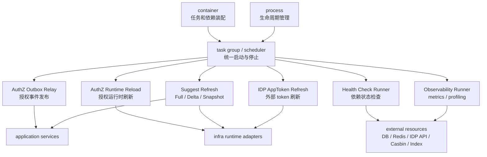
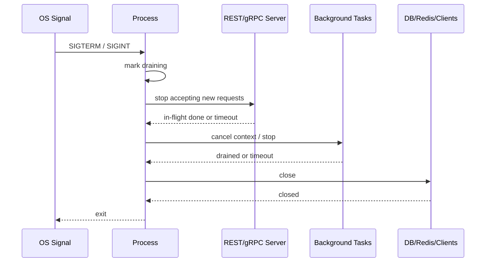

# 后台任务与优雅关闭

> 状态：待补证据 · 第一版正文，待继续按源码、process 生命周期、任务实现和部署配置核对细节。

---

## 1. 本文回答

本文回答 6 个问题：

- iam-apiserver 中哪些能力属于后台任务？
- 后台任务应该由谁创建、由谁启动、由谁停止？
- 后台任务如何与 `process`、`container`、`application`、`infra runtime` 协作？
- 优雅关闭时 REST/gRPC server、后台任务和外部资源应该按什么顺序停止？
- Outbox、AuthZ runtime reload、Suggest refresh、IDP token refresh 等任务的边界是什么？
- 修改后台任务或 shutdown 逻辑时应该运行哪些 Verify？

本文只讲后台任务与优雅关闭，不展开具体业务模块领域模型。AuthZ、Suggest、IDP 等任务的业务事实见 [../02-业务模块](../02-业务模块/README.md)。

---

## 2. 30 秒结论

后台任务是 iam-apiserver 运行期的异步能力，必须纳入 `process` 生命周期统一管理。

典型后台任务包括：

```text
AuthZ Outbox Relay；
AuthZ Runtime Reload；
Suggest Full / Delta / Snapshot Refresh；
IDP AppToken Refresh；
cache warmup / cleanup；
health/readiness dependency check；
metrics / profiling / observability runner。
```

后台任务的生命周期主线是：

```text
container 创建任务对象和依赖
  -> process 注册任务
  -> process 启动任务
  -> 任务循环响应 context cancellation
  -> shutdown 时 process 停止任务
  -> process 关闭外部资源
```

最重要的边界是：

```text
后台任务可以调用 application 或受控 runtime adapter；
后台任务不应该绕过 application 修改核心业务事实；
后台任务必须可取消、可停止、可观测；
shutdown 不是业务补偿机制；
Outbox/重试/幂等才负责跨进程恢复。
```

如果只记一句话：

> 后台任务可以异步执行，但不能脱离生命周期管理，也不能绕开业务边界。

---

## 3. 后台任务位置



这张图表达 4 个边界：

```text
container 负责创建任务和依赖；
process 负责启动、停止和生命周期托管；
任务可以调用 application 或 runtime adapter；
任务不能自行脱离 process 生命周期长期运行。
```

---

## 4. 后台任务生命周期

后台任务生命周期可以按 6 个阶段理解：

```text
定义任务；
装配依赖；
注册任务；
启动任务；
运行与观测；
取消与停止。
```

| 阶段 | 责任方 | 说明 |
| --- | --- | --- |
| 定义任务 | application / infra / runtime | 定义任务行为和执行逻辑 |
| 装配依赖 | container | 注入 repository、application service、runtime adapter、配置 |
| 注册任务 | process | 把任务纳入统一 task group 或 scheduler |
| 启动任务 | process | 在 server 启动前后按策略启动 |
| 运行与观测 | task + process | 周期执行、记录日志、暴露指标、处理错误 |
| 取消与停止 | process | shutdown 时通过 context cancellation 或 stop hook 停止任务 |

设计原则：

> 任务可以由 container 创建，但启动和停止应由 process 统一管理。

---

## 5. 后台任务应具备的能力

一个合格的后台任务至少应具备：

```text
明确名称；
明确启动条件；
明确依赖；
明确执行间隔或触发方式；
明确 timeout；
明确 retry 策略；
明确错误日志；
明确 metrics；
响应 context cancellation；
shutdown 时可停止；
重复执行具备幂等性或去重能力。
```

后台任务不应该：

```text
无限阻塞且不响应 context；
panic 后直接杀死进程且无恢复策略；
吞掉错误不记录；
绕过 application 写核心业务事实；
依赖全局变量；
在 init() 中自行启动 goroutine；
在 container 装配阶段自动执行业务写入；
shutdown 后继续占用 DB/Redis/网络连接。
```

---

## 6. 典型后台任务

| 任务 | 说明 | 关键边界 |
| --- | --- | --- |
| AuthZ Outbox Relay | 发布授权事实变化事件 | Outbox 不等于 exactly-once，消费者仍需幂等 |
| AuthZ Runtime Reload | 授权事实变化后刷新运行时策略 | Casbin 是 infra runtime，不是领域模型 |
| Suggest Refresh | 刷新 Profile 联想搜索索引或快照 | Suggest 是读模型，不拥有 Profile 写模型 |
| IDP AppToken Refresh | 刷新外部平台 AppToken | AppToken 不是 IAM AccessToken |
| Cache Warmup / Cleanup | 预热或清理缓存 | 缓存不改变领域事实 |
| Health Dependency Check | 检测依赖健康状态 | health/readiness 不执行业务修复 |
| Metrics / Profiling Runner | 暴露观测能力 | 不泄露敏感配置和业务数据 |

---

## 7. AuthZ Outbox Relay

AuthZ Outbox Relay 用于发布授权事实变化事件。

它通常解决：

```text
授权写入和 outbox 记录在同一事务中完成；
事务提交后 relay 异步扫描待发布事件；
发布成功后标记事件状态；
发布失败后重试；
消费者根据事件刷新 runtime 或执行后续动作。
```

它应该具备：

```text
批量拉取；
重试策略；
失败记录；
幂等发布标识；
并发控制；
context cancellation；
shutdown drain；
metrics 和日志。
```

它不应该被写成：

```text
exactly-once 保证；
消息队列本身；
业务事务替代品；
消费者幂等替代品；
运行时 reload 成功保证。
```

关键原则：

> Outbox 只保证本地事务内业务事实和事件记录一致；端到端投递和消费仍然需要重试、幂等和观测。

---

## 8. AuthZ Runtime Reload

AuthZ Runtime Reload 用于让授权运行时感知授权事实变化。

它可能由以下方式触发：

```text
Outbox 事件；
PolicyVersion 轮询；
定时 reload；
管理命令；
服务启动时 initial load。
```

它应该负责：

```text
加载授权事实；
投影到 Casbin runtime 或其他授权运行时；
校验策略版本；
安全切换 runtime；
暴露 reload 成功/失败状态；
支持失败重试或保持旧版本可用。
```

它不应该负责：

```text
定义 AuthZ 领域模型；
替代 Role / Permission / RoleBinding；
直接签发 Token；
修改 User/Profile 写模型；
把 Casbin facts 当作业务事实源。
```

关键原则：

> AuthZ 领域事实先成立，再投影到 runtime；reload 只负责运行时同步，不负责定义授权语言。

---

## 9. Suggest Refresh

Suggest Refresh 用于维护 Profile 联想搜索读模型。

常见刷新模式：

```text
Full refresh：全量重建索引；
Delta refresh：增量刷新索引；
Snapshot switch：构建新快照后原子切换；
Warmup：服务启动后预热；
Fallback：索引不可用时降级。
```

它应该负责：

```text
读取 Identity 的 Profile 事实；
构建 ProfileSearchTerm；
构建或更新 Snapshot；
维护进程内索引；
按配置控制刷新频率；
刷新失败时保留旧快照或标记 degraded；
响应 shutdown。
```

它不应该负责：

```text
维护 Profile 主事实；
创建 User/Profile/ProfileLink；
管理 Role / Permission / RoleBinding；
绕过 ProfileAccessScope 返回不可见 Profile；
把搜索索引当作业务主表。
```

关键原则：

> Suggest 可以异步刷新读模型，但 Profile 主事实仍属于 Identity。

---

## 10. IDP AppToken Refresh

IDP AppToken Refresh 用于维护外部身份源访问凭证。

它可能负责：

```text
提前刷新外部平台 access token；
缓存 AppToken；
处理 token 过期；
处理外部 API 错误；
记录 provider 状态；
在不可用时标记相关 IDP provider degraded。
```

它不应该负责：

```text
签发 IAM AccessToken；
创建 IAM Session；
创建 User；
创建 LoginIdentity；
决定权限。
```

关键原则：

> IDP AppToken 是 IAM 调用外部平台的凭证，不是 IAM 签发给客户端的 AccessToken。

---

## 11. Cache Warmup / Cleanup

缓存任务用于提升性能或清理过期运行时数据。

它可以负责：

```text
预热热点配置；
预热 JWKS 或 public key；
预热授权 runtime；
清理过期 challenge；
清理过期 session / token 黑名单；
清理临时索引或快照。
```

它不应该负责：

```text
改变领域事实；
作为唯一正确性来源；
绕过 repository 主事实；
在缓存失败时伪造业务成功；
删除未确认过期的业务主数据。
```

关键原则：

> 缓存任务服务性能和运行时状态，不应该成为业务正确性的唯一依据。

---

## 12. 任务启动顺序

后台任务启动顺序取决于依赖关系。

推荐原则：

```text
先加载配置；
再初始化外部资源；
再装配 container；
再完成核心 runtime initial load；
再启动 REST/gRPC server；
最后启动周期性后台任务。
```

一种推荐顺序：

```text
1. load config；
2. init DB / Redis / external clients；
3. build container；
4. initial load AuthZ runtime；
5. initial load Suggest snapshot（如果配置要求启动前 ready）；
6. start REST/gRPC server；
7. start outbox relay / refresh workers / metrics；
8. mark readiness according to dependency state。
```

注意：

```text
哪些任务必须在接流量前完成，要以当前代码和产品要求为准；
如果任务未完成也允许接流量，readiness 和 degraded 状态必须说清楚；
不要为了启动快而静默跳过必需初始化。
```

---

## 13. 优雅关闭顺序

优雅关闭的目标是尽量减少请求中断和资源泄漏，但不能承诺所有异步工作一定完成。

推荐顺序：

```text
1. 收到 shutdown signal；
2. 标记服务进入 draining；
3. readiness 返回不可接流量；
4. 停止接收新请求；
5. 等待 REST/gRPC in-flight 请求完成或超时；
6. 通知后台任务停止；
7. 等待后台任务 drain 或 timeout；
8. flush 必要的日志/metrics；
9. 关闭外部资源：DB、Redis、HTTP clients、runtime；
10. 退出进程。
```

Mermaid 时序：



关键边界：

```text
shutdown 是运行时行为；
shutdown 不替代业务幂等；
shutdown 不保证 outbox 全部发布完成；
shutdown 不保证所有外部 API 调用成功；
长耗时任务必须能被 context 取消。
```

---

## 14. context cancellation 原则

后台任务必须响应 context cancellation。

推荐写法语义：

```text
任务启动时接收 parent context；
每轮循环检查 ctx.Done；
外部调用使用 context timeout；
ticker 停止时释放资源；
收到取消后停止拉取新批次；
允许当前小批次在 timeout 内完成；
timeout 后安全退出并记录日志。
```

避免：

```text
for 循环不检查 ctx.Done；
time.Sleep 长时间阻塞且无法取消；
外部 HTTP/DB 调用不带 context；
channel send/receive 永久阻塞；
shutdown 后继续重试；
panic 后没有 recovery 或日志。
```

---

## 15. 幂等与重试原则

后台任务通常会重试，因此必须考虑幂等。

需要幂等的场景：

```text
outbox event publish；
policy reload；
suggest delta refresh；
IDP token refresh；
cache cleanup；
定时补偿任务。
```

推荐原则：

```text
每个任务有稳定任务名；
每条事件有稳定 event id；
每次刷新有版本号或 snapshot id；
重复发布不会造成重复业务副作用；
重复 reload 不会破坏 runtime；
失败可重试，成功可确认。
```

注意：

```text
重试不是无限循环；
幂等不是没有副作用；
并发任务要有锁、lease 或分片策略；
多实例部署时要避免重复执行不可重复任务。
```

---

## 16. 多实例与分布式任务

如果 iam-apiserver 多实例部署，后台任务需要考虑多实例并发。

需要明确：

```text
任务是否每个实例都可以执行；
任务是否只能一个 leader 执行；
任务是否按分片执行；
任务是否需要分布式锁或 lease；
重复执行是否安全；
实例重启后如何恢复。
```

典型判断：

| 任务 | 多实例风险 | 建议 |
| --- | --- | --- |
| metrics | 低 | 每实例运行 |
| health check | 低 | 每实例运行 |
| Suggest local index refresh | 中 | 每实例维护本地索引，注意资源开销 |
| Outbox relay | 高 | 需要事件 claim、锁、状态机或幂等发布 |
| Policy reload | 中 | 每实例 runtime 都需要刷新，但触发要可控 |
| IDP token refresh | 中/高 | 需要缓存一致性、锁或容忍重复刷新 |

本文不假设当前已经实现分布式锁或 leader election。没有代码事实支撑时，只能写为设计要求或 `规划改造`。

---

## 17. 任务观测与告警

后台任务必须可观测。

建议观测维度：

```text
任务是否运行；
最后一次成功时间；
最后一次失败时间；
连续失败次数；
本轮处理数量；
处理耗时；
积压数量；
重试次数；
当前版本号或 snapshot id；
当前 degraded 原因。
```

日志建议包含：

```text
task name；
run id；
batch id；
event id；
policy version；
snapshot id；
error reason；
duration；
retry count。
```

注意：

```text
日志不能打印 secret；
日志不能泄露敏感用户数据；
错误信息要能定位任务和依赖；
观测指标应能支持 readiness 或运维判断。
```

---

## 18. health/readiness 与后台任务

后台任务状态可能影响 readiness。

需要区分：

```text
liveness：进程是否还活着；
readiness：实例是否可以接流量；
degraded：实例可以接部分流量，但某些能力降级。
```

示例：

```text
主数据库不可用：通常 not ready；
JWT private key 不可用：通常 fail fast 或 not ready；
Suggest refresh 失败但旧快照可用：可能 ready + degraded；
Outbox relay 积压过高：可能 degraded 或告警；
IDP provider 不可用：相关登录方式 degraded。
```

具体策略必须以 [06-健康检查与降级启动.md](06-健康检查与降级启动.md) 和当前代码实现为准。

---

## 19. 常见反模式

| 反模式 | 问题 | 推荐做法 |
| --- | --- | --- |
| goroutine 在 `init()` 中启动 | 脱离生命周期管理 | 由 process 统一启动 |
| 任务不接收 context | shutdown 无法停止 | 任务必须响应 context cancellation |
| 任务直接改核心业务表 | 绕过 application 和领域边界 | 通过 application 或受控 repository 用例执行 |
| Outbox relay 写成 exactly-once | 误导可靠性边界 | 明确重试、幂等和重复消费处理 |
| Suggest refresh 写 Profile 主事实 | 读模型吞并写模型 | Suggest 只维护索引和快照 |
| shutdown 先关闭 DB 再停任务 | 任务可能使用已关闭资源 | 先停任务，再关闭资源 |
| 任务失败只打印 debug 日志 | 运维不可见 | 记录 error、metrics、告警指标 |
| 多实例任务无锁且不可幂等 | 重复执行造成副作用 | 使用幂等、claim、锁、lease 或分片策略 |
| panic 后静默退出任务 | 功能悄悄失效 | recovery、日志、指标和重启策略 |

---

## 20. 和其他运行时文档的关系

| 文档 | 关系 |
| --- | --- |
| [01-服务入口与生命周期.md](01-服务入口与生命周期.md) | 本文展开其中的后台任务和优雅关闭阶段 |
| [02-组合根与依赖装配.md](02-组合根与依赖装配.md) | 后台任务对象和依赖可由 container 创建 |
| [03-REST与gRPC传输层装配.md](03-REST与gRPC传输层装配.md) | shutdown 时 REST/gRPC server 需要先停止接收新请求 |
| [04-配置加载与运行模式.md](04-配置加载与运行模式.md) | 任务开关、间隔、并发、timeout、降级策略由配置控制 |
| [06-健康检查与降级启动.md](06-健康检查与降级启动.md) | 任务状态可能影响 readiness 或 degraded 状态 |

---

## 21. 事实源

本文是后台任务与优雅关闭说明，不是机器契约。

当本文与代码、配置、测试冲突时，按以下优先级判断：

1. 源码与运行时行为。
2. 机器可读配置、OpenAPI、proto、迁移。
3. 测试：运行时测试、任务测试、架构测试。
4. 现行维护中的 `docs/`。
5. `_archive/` 历史材料。

当前主要事实源：

| 事实 | 路径 |
| --- | --- |
| 生命周期管理 | `../../internal/apiserver/process` |
| 组合根 | `../../internal/apiserver/container` |
| 配置加载 | `../../internal/apiserver/config` |
| AuthZ 应用层 | `../../internal/apiserver/application/authz` |
| AuthZ 领域层 | `../../internal/apiserver/domain/authz` |
| AuthZ infra/runtime | `../../internal/apiserver/infra` |
| Suggest 应用层 | `../../internal/apiserver/application/suggest` |
| Suggest 领域层 | `../../internal/apiserver/domain/suggest` |
| IDP 应用层 | `../../internal/apiserver/application/idp` |
| REST transport | `../../internal/apiserver/transport/rest` |
| gRPC transport | `../../internal/apiserver/transport/grpc` |
| 架构测试 | `../../internal/pkg/architecture` |

---

## 22. Verify

修改本文后至少执行：

```bash
make docs-hygiene
```

涉及后台任务、process 生命周期或 shutdown 逻辑时，执行：

```bash
go test ./internal/apiserver/...
```

涉及分层边界时，执行：

```bash
go test ./internal/pkg/architecture
```

涉及 REST/gRPC shutdown 或传输层时，执行：

```bash
go test ./internal/apiserver/transport/rest/...
go test ./internal/apiserver/transport/grpc/...
```

涉及 AuthZ Outbox / runtime reload 时，执行对应模块测试；如果当前没有细分测试包，以实际代码结构为准，不能假装已有：

```bash
go test ./internal/apiserver/application/authz/...
go test ./internal/apiserver/domain/authz/...
```

涉及 Suggest refresh 时，执行对应模块测试；如果当前没有细分测试包，以实际代码结构为准：

```bash
go test ./internal/apiserver/application/suggest/...
go test ./internal/apiserver/domain/suggest/...
```

---

## 23. 本文总结

后台任务与优雅关闭可以压缩成一条主线：

```text
container 创建任务和依赖
  -> process 注册并启动任务
  -> 任务循环执行并响应 context
  -> shutdown 时 process 先停 server、再停任务、最后关资源
```

最重要的边界是：

```text
后台任务必须纳入生命周期管理；
后台任务不能绕过 application 修改核心业务事实；
后台任务必须可取消、可观测、可重试、可幂等；
Outbox 不等于 exactly-once；
Suggest refresh 不拥有 Profile 写模型；
shutdown 不是业务补偿机制。
```

维护后台任务文档时，必须持续核对 process、container、任务实现、配置和测试，避免异步逻辑变成不可控的隐藏业务流程。
