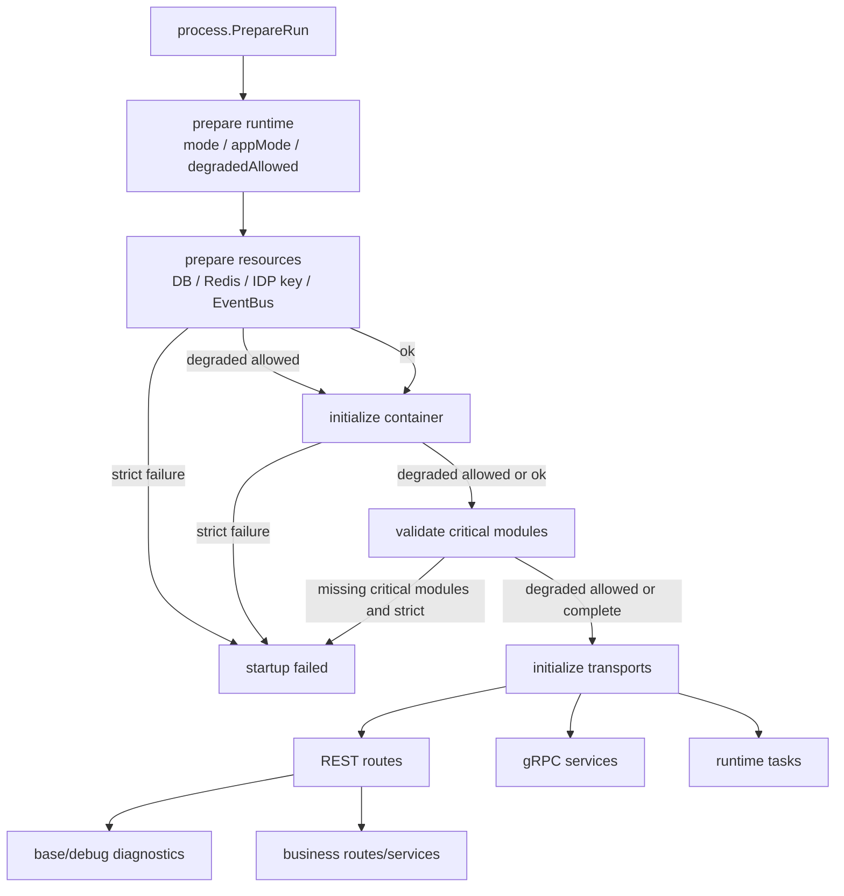
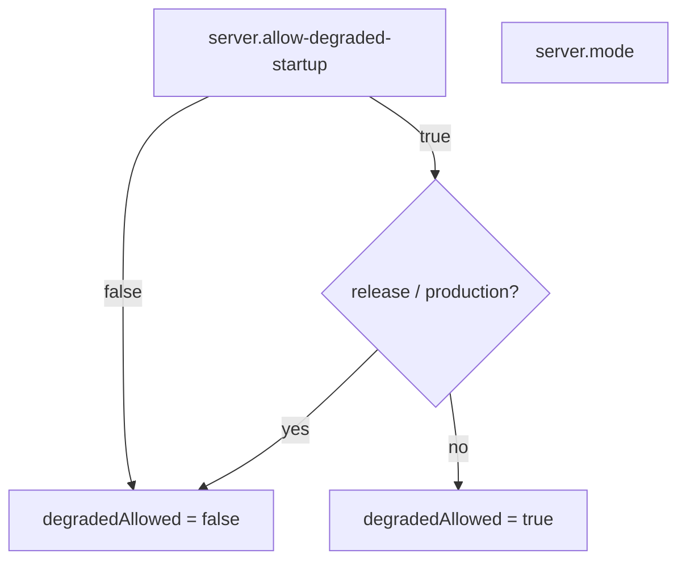
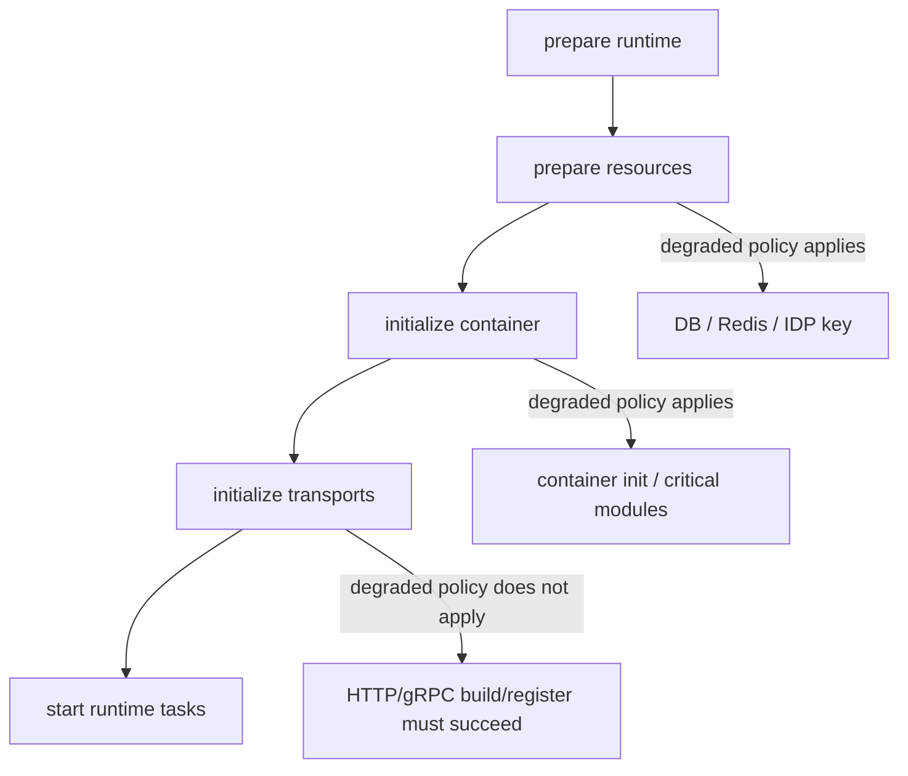
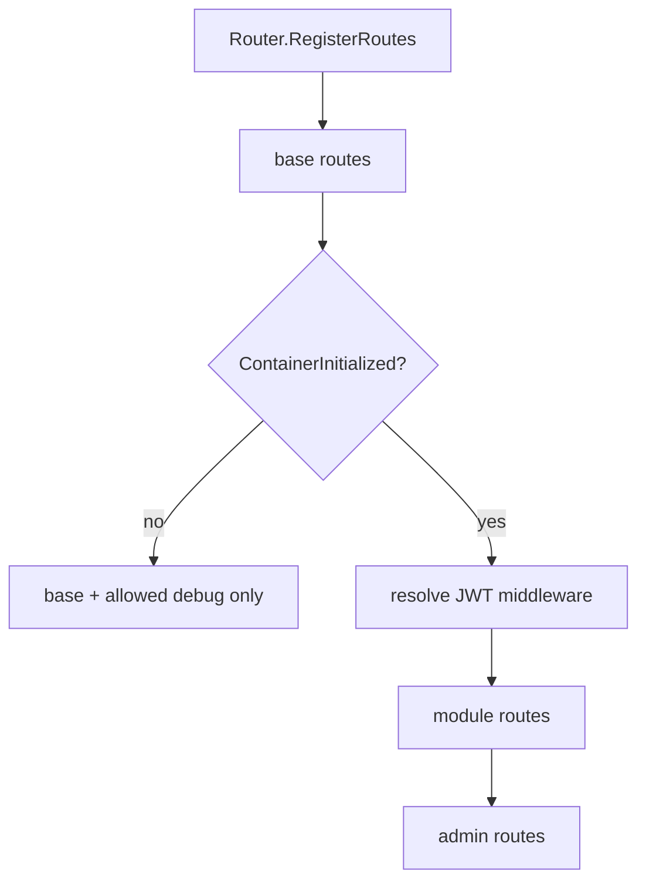
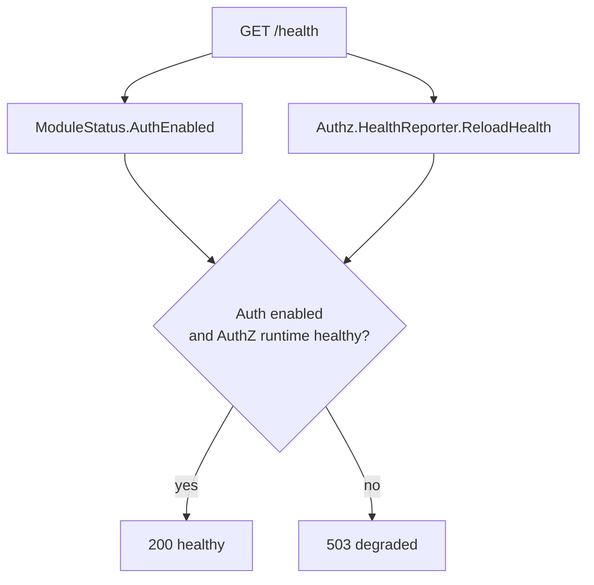
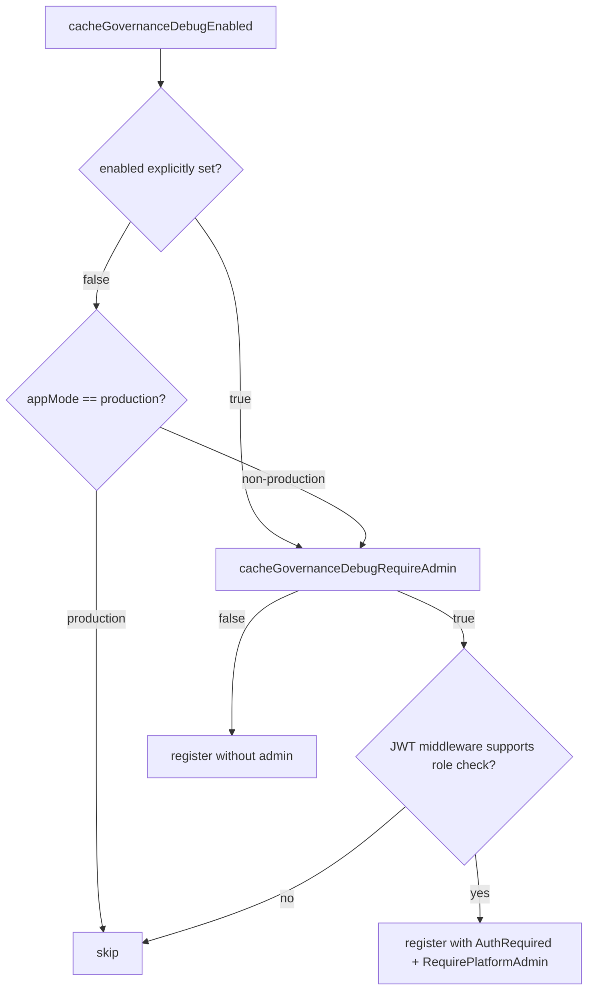
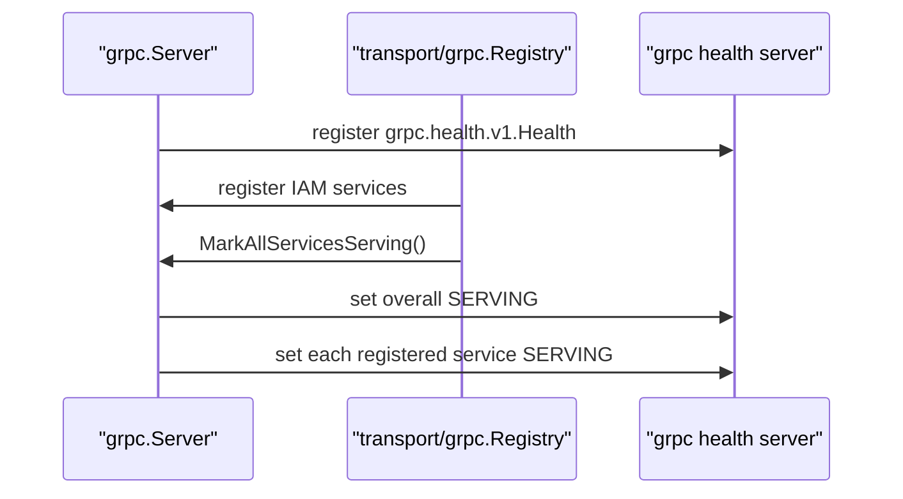

# 降级启动与健康检查

## 本文回答

本文回答：IAM 在启动过程中遇到资源或模块不完整时，什么时候可以降级启动；降级启动之后哪些诊断面会保留、哪些业务面会被跳过；REST `/health`、GenericAPIServer `/healthz`、REST debug routes、gRPC health service、gRPC 独立 HTTP `/healthz`/`/readyz`/`/livez` 分别代表什么。

读完本文，你应该能回答：

- `server.allow-degraded-startup` 到底控制什么；
- 为什么 production/release 模式不允许降级启动；
- MySQL、Redis、IDP encryption key、EventBus、container、critical modules 失败时分别如何处理；
- REST `/health` 的状态来源是什么；
- `/health`、`/healthz`、`/ping`、`/readyz`、`/livez` 的区别是什么；
- `/debug/routes` 和 `/debug/modules` 如何帮助排查半可用状态；
- CacheGovernance debug routes 在 development/production 中如何注册；
- gRPC health status 如何在服务注册完成后变成 `SERVING`；
- shutdown 时 gRPC health 如何变成 `NOT_SERVING`；
- 降级启动和健康检查有哪些容易误解的边界。

---

## 30 秒结论

IAM 的降级启动不是“生产容错”，而是非生产环境下的受控诊断能力。

降级启动的 gate 是：

```text
server.allow-degraded-startup == true
并且 server.mode 不是 release / production
```

即使允许降级，降级也只意味着：

```text
进程可以继续启动
保留基础诊断入口
部分业务模块或受保护路由可能不注册
```

它不意味着 AuthN/AuthZ/Identity/Suggest 等业务能力完整可用。

健康检查也有多层：

| 健康入口 | 所属层 | 当前语义 |
| --- | --- | --- |
| `GET /health` | IAM REST Router | 根据 AuthN token 能力和 AuthZ runtime reload health 返回 healthy/degraded |
| `GET /ping` | IAM REST Router | 基础连通性 |
| `GET /debug/modules` | IAM REST Router | container/module 状态 |
| `GET /debug/routes` | IAM REST Router | Gin 实际注册路由 |
| `GET /healthz` | GenericAPIServer | 通用 HTTP healthz，受 `server.healthz` 控制 |
| gRPC health RPC | gRPC Server | 标准 `grpc.health.v1.Health` 服务状态 |
| gRPC HTTP `/healthz` | gRPC 独立 healthz server | 整体 gRPC health 是否 `SERVING` |
| gRPC HTTP `/readyz` | gRPC 独立 healthz server | gRPC 是否 ready |
| gRPC HTTP `/livez` | gRPC 独立 healthz server | healthz server 是否存活 |

最关键的排障原则是：

```text
/health 不是完整依赖巡检
/healthz 不是业务模块可用性证明
/debug/routes 才能确认某条 REST 路由是否真的注册
/debug/modules 才能确认 container 和模块状态
```

核心源码入口：

- [../../internal/apiserver/process/runtime_mode.go](../../internal/apiserver/process/runtime_mode.go)
- [../../internal/apiserver/process/bootstrap.go](../../internal/apiserver/process/bootstrap.go)
- [../../internal/apiserver/process/server_lifecycle.go](../../internal/apiserver/process/server_lifecycle.go)
- [../../internal/apiserver/container/runtime_deps.go](../../internal/apiserver/container/runtime_deps.go)
- [../../internal/apiserver/transport/rest/health_routes.go](../../internal/apiserver/transport/rest/health_routes.go)
- [../../internal/apiserver/transport/rest/base_routes.go](../../internal/apiserver/transport/rest/base_routes.go)
- [../../internal/apiserver/transport/rest/debug_routes.go](../../internal/apiserver/transport/rest/debug_routes.go)
- [../../internal/pkg/server/genericapiserver.go](../../internal/pkg/server/genericapiserver.go)
- [../../internal/pkg/grpc/server.go](../../internal/pkg/grpc/server.go)

---

## 主图：降级启动与诊断面



---

## 重点速查

| 问题 | 当前答案 | 代码证据 |
| --- | --- | --- |
| 降级启动开关是什么 | `server.allow-degraded-startup`，默认 false。 | [../../internal/pkg/options/server_run_options.go](../../internal/pkg/options/server_run_options.go) |
| 哪些模式禁止降级 | `release`、`production`。 | [../../internal/apiserver/process/runtime_mode.go](../../internal/apiserver/process/runtime_mode.go) |
| 运行时 appMode 如何推导 | `release/production -> production`，`test -> test`，其他 -> `development`。 | [../../internal/apiserver/process/runtime_mode.go](../../internal/apiserver/process/runtime_mode.go) |
| 资源准备在哪里处理降级 | `prepareResources`。 | [../../internal/apiserver/process/bootstrap.go](../../internal/apiserver/process/bootstrap.go) |
| 关键模块缺失在哪里校验 | `validateCriticalModules`。 | [../../internal/apiserver/process/server_lifecycle.go](../../internal/apiserver/process/server_lifecycle.go) |
| 关键模块有哪些 | `idp`、`authn`、`authz`、`user`。 | [../../internal/apiserver/container/runtime_deps.go](../../internal/apiserver/container/runtime_deps.go) |
| REST `/health` 看什么 | AuthN enabled 和 AuthZ runtime reload health。 | [../../internal/apiserver/transport/rest/health_routes.go](../../internal/apiserver/transport/rest/health_routes.go) |
| `/debug/modules` 看什么 | container initialized、authn、authz、user、idp、suggest。 | [../../internal/apiserver/transport/rest/debug_routes.go](../../internal/apiserver/transport/rest/debug_routes.go) |
| `/debug/routes` 看什么 | Gin 实际注册路由列表。 | [../../internal/apiserver/transport/rest/debug_routes.go](../../internal/apiserver/transport/rest/debug_routes.go) |
| CacheGovernance debug 规则在哪里 | `debug_routes.go`。 | [../../internal/apiserver/transport/rest/debug_routes.go](../../internal/apiserver/transport/rest/debug_routes.go) |
| gRPC health 在哪里实现 | `internal/pkg/grpc.Server`。 | [../../internal/pkg/grpc/server.go](../../internal/pkg/grpc/server.go) |
| REST debug 行为如何测试 | `transport/rest/router_test.go`。 | [../../internal/apiserver/transport/rest/router_test.go](../../internal/apiserver/transport/rest/router_test.go) |

---

## 1. 降级启动的判断规则

降级启动由 `degradedStartupAllowed(cfg)` 决定。

规则是：

```text
cfg.GenericServerRunOptions.AllowDegradedStartup == true
并且 runtimeMode(cfg) 不是 production-like
```

production-like 指：

```text
release
production
```



| `server.mode` | `allow-degraded-startup=false` | `allow-degraded-startup=true` |
| --- | --- | --- |
| `release` | 不允许降级 | 不允许降级 |
| `production` | 不允许降级 | 不允许降级 |
| `test` | 不允许降级 | 允许降级 |
| `debug` | 不允许降级 | 允许降级 |
| `development` | 不允许降级 | 允许降级 |
| 其他非生产值 | 不允许降级 | 允许降级 |

### 为什么 release/production 禁止降级

生产环境下，关键资源或关键模块缺失时继续启动，会造成更危险的“伪可用”：

```text
进程还活着
健康探针可能有响应
但认证/授权/用户业务能力不完整
```

因此 production/release 下应 fail fast，让部署系统、告警系统和回滚流程处理，而不是让服务以半可用状态对外提供业务接口。

核心源码：

- [../../internal/apiserver/process/runtime_mode.go](../../internal/apiserver/process/runtime_mode.go)
- [../../internal/pkg/options/server_run_options.go](../../internal/pkg/options/server_run_options.go)

---

## 2. 降级启动覆盖哪些阶段

降级启动主要影响两个阶段：

```text
prepare resources
initialize container / validate critical modules
```

不影响所有启动错误。



### 2.1 Resources 阶段

`prepareResources` 会处理：

| 资源 | 非 degraded | degraded allowed |
| --- | --- | --- |
| `DatabaseManager.Initialize()` 返回错误 | 启动失败 | 记录 warning，继续 |
| `GetMySQLDB()` 失败 | 启动失败 | `mysqlDB=nil`，继续 |
| `GetCacheRedisClient()` 失败 | 启动失败 | `cacheClient=nil`，继续 |
| IDP encryption key 缺失 | 启动失败 | 记录 warning，继续 |
| IDP encryption key 非法 | 启动失败 | 记录 warning，继续 |
| EventBus 创建失败 | 记录 warning，继续 | 记录 warning，继续 |

EventBus 比较特殊：即使在 strict 模式，当前 `createEventBus()` 失败也只是 warning，并置为 nil。它不是启动失败的 hard dependency。  
但 EventBus 不可用会影响 outbox relay 和异步事件投递。

### 2.2 Container 阶段

`prepareContainer` 会：

1. 根据资源和 runtime options 创建 container；
2. 调用 `container.Initialize()`；
3. 调用 `validateCriticalModules(degradedAllowed)`。

container 初始化失败时：

| 场景 | 行为 |
| --- | --- |
| 非 degraded | 启动失败 |
| degraded allowed | 记录 warning，继续做关键模块校验 |

关键模块缺失时：

| 场景 | 行为 |
| --- | --- |
| 非 degraded | 启动失败 |
| degraded allowed | 记录 warning，继续 |

当前关键模块：

```text
idp
authn
authz
user
```

Suggest 不在关键模块列表中。Suggest 失败不应阻断 IAM 的核心认证/授权能力，但会影响联想搜索路由是否注册。

核心源码：

- [../../internal/apiserver/process/bootstrap.go](../../internal/apiserver/process/bootstrap.go)
- [../../internal/apiserver/process/server_lifecycle.go](../../internal/apiserver/process/server_lifecycle.go)
- [../../internal/apiserver/container/runtime_deps.go](../../internal/apiserver/container/runtime_deps.go)

---

## 3. 降级启动不覆盖哪些错误

降级启动不是“所有错误都忽略”。

以下错误不应被理解为 degraded startup 覆盖范围：

| 错误 | 当前边界 |
| --- | --- |
| HTTP GenericAPIServer 构建失败 | 启动失败 |
| gRPC Server 构建失败 | 启动失败 |
| REST 注册函数导致不可恢复错误 | 启动失败或无法继续 |
| gRPC service registration 返回错误 | 启动失败 |
| `preparedAPIServer.Run()` 中 HTTP/gRPC Run 返回错误 | 运行失败 |
| secure serving cert/key 校验失败 | options complete 阶段失败 |
| 配置文件读取失败 | App 启动前失败 |

也就是说，degraded startup 主要处理“资源/模块不完整”，不处理“协议面自身无法构建”。

---

## 4. 降级启动与路由注册

降级启动后，transport 仍会按模块能力条件注册路由。

这意味着：

```text
进程启动成功 ≠ 所有业务路由已注册
```

REST Router 的注册顺序是：

```text
base routes
  -> if container not initialized: only allowed debug routes, return
  -> resolve auth middleware
  -> cache governance debug routes
  -> module routes
  -> admin routes
```



### 4.1 AuthN 不可用

如果 AuthN 没有 TokenService：

```text
JWT middleware 无法创建
protected routes 不注册
```

影响：

- AuthZ protected routes 不注册；
- Identity protected routes 不注册；
- Suggest protected route 不注册；
- Admin routes 不注册；
- `/health` 可能返回 degraded。

### 4.2 AuthZ route authorization 不可用

如果 TokenService 存在，但 AuthZ route authorization 不存在：

```text
JWT middleware 可以做 AuthRequired
但 SupportsRoleCheck() == false
```

影响：

- 需要平台管理员保护的 admin routes 不注册；
- production cache governance debug routes 不注册；
- 需要角色/权限判断的路由级保护能力不可用。

### 4.3 container 未初始化

如果 container 未初始化：

```text
ModuleStatus.ContainerInitialized = false
```

Router 会：

1. 注册 base routes；
2. 注册允许的 cache governance debug routes；
3. 跳过模块业务路由。

排查时优先看：

```text
GET /debug/modules
GET /debug/routes
```

核心源码：

- [../../internal/apiserver/transport/rest/router.go](../../internal/apiserver/transport/rest/router.go)
- [../../internal/apiserver/transport/rest/module_routes.go](../../internal/apiserver/transport/rest/module_routes.go)
- [../../internal/apiserver/transport/rest/router_test.go](../../internal/apiserver/transport/rest/router_test.go)

---

## 5. REST 诊断入口总览

REST 层有三类诊断入口：

```text
GenericAPIServer 通用入口
IAM Router base/debug routes
CacheGovernance debug routes
```

### 5.1 GenericAPIServer `/healthz`

GenericAPIServer 会在 `server.healthz=true` 时安装：

```text
GET /healthz
```

它返回简单的：

```json
{
  "status": "ok"
}
```

这是 HTTP server 层面的通用健康入口，不代表 IAM 业务模块一定完整。

GenericAPIServer 还会安装：

```text
GET /version
```

核心源码：

- [../../internal/pkg/server/genericapiserver.go](../../internal/pkg/server/genericapiserver.go)

### 5.2 IAM Router base routes

REST Router 总是优先注册：

| 路由 | 语义 |
| --- | --- |
| `GET /health` | IAM REST 运行面健康，当前看 AuthN/AuthZ runtime |
| `GET /ping` | 基础连通性 |
| `GET /debug/routes` | 当前 Gin 实际注册路由 |
| `GET /debug/modules` | 当前 container/module 状态 |
| `/openapi` | OpenAPI 静态文件 |
| `/swagger` | Swagger UI |
| `GET /api/v2/public/info` | 服务公开信息 |

核心源码：

- [../../internal/apiserver/transport/rest/base_routes.go](../../internal/apiserver/transport/rest/base_routes.go)
- [../../internal/apiserver/transport/rest/debug_routes.go](../../internal/apiserver/transport/rest/debug_routes.go)

---

## 6. REST `/health` 的真实含义

REST `/health` 当前不做完整 DB/Redis/EventBus 巡检。

它主要看两个维度：

```text
ModuleStatus.AuthEnabled
AuthZ HealthReporter.ReloadHealth()
```



响应中的关键字段：

| 字段 | 含义 |
| --- | --- |
| `status` | `healthy` 或 `degraded` |
| `auth` | `enabled` 或 `disabled` |
| `auth_system.enabled` | AuthN token 能力是否启用 |
| `authz_runtime.healthy` | AuthZ runtime reload 是否健康 |
| `authz_runtime.last_error` | AuthZ reload 最近错误 |
| `authz_runtime.reloaded_at` | 最近 reload 时间 |

状态码：

| 条件 | HTTP status |
| --- | --- :|
| AuthN enabled 且 AuthZ runtime healthy | `200` |
| AuthN disabled 或 AuthZ runtime unhealthy | `503` |

### `/health` 不是什么

`/health` 当前不是：

- MySQL ping；
- Redis ping；
- EventBus ping；
- Outbox relay health；
- 所有 REST routes 可用性检查；
- gRPC 服务健康检查。

如果需要完整排查，应结合：

```text
/health
/healthz
/debug/modules
/debug/routes
启动日志
gRPC health
```

核心源码：

- [../../internal/apiserver/transport/rest/health_routes.go](../../internal/apiserver/transport/rest/health_routes.go)

---

## 7. `/debug/modules`

`/debug/modules` 返回的是 route-visible module state。

当 container 初始化时，响应包含：

```json
{
  "container_initialized": true,
  "container_status": "initialized",
  "modules": {
    "authn": true,
    "authz": true,
    "user": true,
    "idp": true,
    "suggest": true
  }
}
```

当 container 未初始化时，响应包含：

```json
{
  "container_initialized": false,
  "container_status": "not_initialized"
}
```

它的用途是解释：

```text
为什么某些业务路由没有注册
为什么 /health degraded
为什么 protected routes 缺失
```

注意：`/debug/modules` 只展示 Router 接收到的 `ModuleStatus`，不是深度依赖巡检。  
例如某个模块为 true，不代表它的所有外部依赖都在当前时刻一定正常。

核心源码：

- [../../internal/apiserver/transport/rest/debug_routes.go](../../internal/apiserver/transport/rest/debug_routes.go)
- [../../internal/apiserver/transport/rest/deps.go](../../internal/apiserver/transport/rest/deps.go)

---

## 8. `/debug/routes`

`/debug/routes` 返回 Gin 当前实际注册的路由列表：

```json
{
  "total": 12,
  "routes": [
    {
      "method": "GET",
      "path": "/health"
    }
  ]
}
```

它是排查“文档里有这个 API，但运行时没有”的第一入口。

典型场景：

| 现象 | 排查 |
| --- | --- |
| `/api/v2/authz/check` 404 | 看 `/debug/routes` 是否注册，再看 AuthN TokenService/JWT middleware |
| `/api/v2/identity/me` 404 | 看 User module 和 JWT middleware 是否存在 |
| `/debug/cache-governance/catalog` 404 | 看 appMode、debug config、admin middleware |
| `/api/v2/admin/*` 404 | 看 `SupportsRoleCheck()` 是否为 true |

核心源码：

- [../../internal/apiserver/transport/rest/debug_routes.go](../../internal/apiserver/transport/rest/debug_routes.go)
- [../../internal/apiserver/transport/rest/router_test.go](../../internal/apiserver/transport/rest/router_test.go)

---

## 9. CacheGovernance Debug Routes

CacheGovernance debug routes 是缓存治理只读诊断面。

当前路由：

```text
GET /debug/cache-governance/catalog
GET /debug/cache-governance/overview
GET /debug/cache-governance/families/:family
```

注册规则：



简化规则：

| 场景 | 行为 |
| --- | --- |
| `debug.cache_governance.enabled=false` | 不注册 |
| 未显式配置，`appMode != production` | 默认注册，不要求 admin |
| 未显式配置，`appMode == production` | 不注册 |
| `appMode == production` 且显式 enabled | 强制要求 admin |
| `require_admin=true` | 要求 admin |
| 要求 admin 但 middleware 不支持 role check | 不注册 |

核心源码：

- [../../internal/apiserver/transport/rest/debug_routes.go](../../internal/apiserver/transport/rest/debug_routes.go)
- [../../internal/apiserver/transport/rest/router_test.go](../../internal/apiserver/transport/rest/router_test.go)

---

## 10. gRPC Health

gRPC health 与 REST health 是两套不同机制。

gRPC Server 创建时，如果开启 health check，会注册标准：

```text
grpc.health.v1.Health
```

服务注册完成后，`transport/grpc.Registry.RegisterServices()` 会调用：

```text
server.MarkAllServicesServing()
```

它会：

1. 将整体服务 `""` 标记为 `SERVING`；
2. 遍历已注册 gRPC services；
3. 将每个业务 service 标记为 `SERVING`。



### 10.1 gRPC 独立 HTTP health server

gRPC server 还可以启动独立 HTTP healthz server，提供：

| 路由 | 语义 |
| --- | --- |
| `/healthz` | 查询整体 gRPC health status，`SERVING` 返回 OK |
| `/readyz` | 查询整体 gRPC health status，非 `SERVING` 返回 NOT_READY |
| `/livez` | 存活探针，直接返回 OK |

注意：`/livez` 不证明业务服务已经 ready，只证明 healthz server 活着。

### 10.2 shutdown 时的 gRPC health

gRPC close 时会：

1. 将整体服务状态设为 `NOT_SERVING`；
2. 将每个已注册业务服务设为 `NOT_SERVING`；
3. 关闭 HTTP healthz server；
4. 执行 `GracefulStop()`；
5. 超时后强制 `Stop()`。

这让外部探针可以在关闭期间观察到服务不可用。

核心源码：

- [../../internal/pkg/grpc/server.go](../../internal/pkg/grpc/server.go)
- [../../internal/apiserver/transport/grpc/registry.go](../../internal/apiserver/transport/grpc/registry.go)

---

## 11. REST Health 与 gRPC Health 的区别

| 维度 | REST `/health` | Generic `/healthz` | gRPC health RPC | gRPC HTTP `/readyz` |
| --- | --- | --- | --- | --- |
| 所属 server | REST Router | GenericAPIServer | gRPC Server | gRPC 独立 healthz server |
| 是否 IAM-specific | 是 | 否 | 半 IAM-specific：按注册 service 标记 | 半 IAM-specific |
| 当前状态来源 | AuthN enabled + AuthZ reload health | server.healthz route | gRPC health server | gRPC health server |
| 是否检查 DB/Redis | 否 | 否 | 否 | 否 |
| 是否说明路由已注册 | 否 | 否 | 说明 gRPC service health 状态 | 否 |
| 典型用途 | IAM REST 运行面诊断 | HTTP server 存活/就绪 | gRPC 客户端服务发现/探活 | K8s/LB 探测 gRPC ready |

不要用单一探针解释所有运行时状态。正确做法是分层判断：

```text
HTTP server 是否活着 -> /healthz
IAM REST 认证/授权运行面是否正常 -> /health
REST 路由是否注册 -> /debug/routes
模块是否初始化 -> /debug/modules
gRPC 是否 ready -> gRPC health /readyz
```

---

## 12. Container.HealthCheck 的边界

`Container.HealthCheck(ctx)` 当前会检查：

```text
MySQL SELECT 1
Redis PING
```

但它不是 REST `/health` 当前的状态来源。

也就是说：

```text
Container.HealthCheck exists
但 REST /health 当前没有调用它
```

这点很重要。  
如果未来希望 `/health` 变成完整依赖巡检，需要显式把 Container.HealthCheck 或 DatabaseManager.HealthCheck 接入 Router 或 process，并重新定义状态码语义。

核心源码：

- [../../internal/apiserver/container/container.go](../../internal/apiserver/container/container.go)
- [../../internal/apiserver/transport/rest/health_routes.go](../../internal/apiserver/transport/rest/health_routes.go)

---

## 13. 典型排障路径

### 13.1 进程启动失败

优先看日志：

```text
initialize database
parse idp encryption key
initialize container
critical modules unavailable
buildGenericServer
buildGRPCServer
registerGRPC
```

如果错误发生在 transport 构建之前，REST debug routes 也不会存在。

### 13.2 进程启动了，但业务接口 404

看：

```bash
GET /debug/routes
GET /debug/modules
```

判断：

| 现象 | 可能原因 |
| --- | --- |
| base routes 存在，module routes 不存在 | container 未初始化 |
| AuthZ/Identity/Suggest routes 不存在 | JWT middleware 不存在，通常是 AuthN TokenService 缺失 |
| admin routes 不存在 | RouteAuthorization 缺失或 middleware 不支持 role check |
| cache governance debug 不存在 | production 默认关闭，或 admin protection 不可用 |
| IDP health 有，wechat-apps 不存在 | WechatAppHandler 缺失或 admin middleware 缺失 |

### 13.3 `/health` 返回 503 degraded

看响应里的：

```text
auth
auth_system.enabled
authz_runtime.healthy
authz_runtime.last_error
authz_runtime.reloaded_at
```

判断：

| 字段 | 可能原因 |
| --- | --- |
| `auth=disabled` | AuthN TokenService 不存在 |
| `authz_runtime.healthy=false` | AuthZ runtime reload 失败 |
| `last_error` 有值 | 查看 AuthZ/Casbin reload 相关日志 |

### 13.4 gRPC `/readyz` 返回 NOT_READY

可能原因：

- gRPC health server 未标记整体 `SERVING`；
- gRPC services 尚未注册完成；
- gRPC server 正在关闭，已标记 `NOT_SERVING`；
- healthz server 与业务 gRPC server 启动顺序异常。

查看：

```text
transport/grpc registry logs
MarkAllServicesServing logs
gRPC server startup logs
```

---

## 14. 失败边界

| 场景 | 当前行为 | 结果 |
| --- | --- | --- |
| `server.allow-degraded-startup=false` 且 MySQL 不可用 | 启动失败 | 无诊断面 |
| `server.allow-degraded-startup=true` 且 debug/test 模式 MySQL 不可用 | MySQL nil，继续 | 依赖 MySQL 的模块可能缺失 |
| IDP encryption key 缺失且 strict | 启动失败 | IDP/AuthN 不进入半可用状态 |
| IDP encryption key 缺失且 degraded | 记录 warning，继续 | IDP 模块可能缺失 |
| EventBus 不可用 | 记录 warning，继续 | outbox relay 不完整或不启动 |
| container 初始化失败且 strict | 启动失败 | 不暴露半初始化业务面 |
| critical modules 缺失且 degraded | 记录 warning，继续 | base/debug 面可用于诊断 |
| AuthN TokenService 缺失 | protected routes 不注册 | fail-closed |
| RouteAuthorization 缺失 | admin routes 不注册 | fail-closed |
| production cache debug 未显式启用 | 不注册 | 减少生产暴露面 |
| production cache debug 显式启用但 admin middleware 不可用 | 不注册 | fail-closed |

---

## 15. 设计模式

| 模式 | 为什么用 | IAM 落地 | 代价和边界 |
| --- | --- | --- | --- |
| Guarded Degradation | 允许非生产诊断，禁止生产伪可用 | `degradedStartupAllowed` 禁止 release/production 降级 | 需要明确区分“启动成功”和“业务可用” |
| Fail Closed | 安全能力缺失时不暴露受保护面 | protected/admin/debug routes 条件注册 | 用户看到 404，需要 debug routes 辅助排查 |
| Diagnostic Surface | 半可用时仍要可定位问题 | `/debug/routes`、`/debug/modules` | debug 面必须控制生产暴露 |
| Layered Health | 不同层有不同健康语义 | `/health`、`/healthz`、gRPC health、`/readyz` | 运维侧不能混用单一探针 |
| Runtime Health Reporter | AuthZ reload health 与业务路由解耦 | `Authz.HealthReporter.ReloadHealth()` | 当前只覆盖 AuthZ reload，不覆盖所有依赖 |

---

## 16. 推荐源码阅读路线

### 第一轮：看降级 gate

```text
internal/pkg/options/server_run_options.go
internal/apiserver/process/runtime_mode.go
internal/apiserver/process/bootstrap.go
internal/apiserver/process/server_lifecycle.go
```

目标：搞清 degraded startup 什么时候允许、什么时候失败。

### 第二轮：看 critical modules

```text
internal/apiserver/container/runtime_deps.go
internal/apiserver/container/container.go
internal/apiserver/container/bootstrap.go
```

目标：搞清哪些模块缺失会影响启动，哪些模块不是 critical。

### 第三轮：看 REST health/debug

```text
internal/apiserver/transport/rest/base_routes.go
internal/apiserver/transport/rest/health_routes.go
internal/apiserver/transport/rest/debug_routes.go
internal/apiserver/transport/rest/router.go
internal/apiserver/transport/rest/module_routes.go
```

目标：搞清 `/health`、`/debug/modules`、`/debug/routes` 和 route fail-closed 逻辑。

### 第四轮：看 GenericAPIServer healthz

```text
internal/pkg/server/genericapiserver.go
```

目标：区分 Generic `/healthz` 与 IAM REST `/health`。

### 第五轮：看 gRPC health

```text
internal/pkg/grpc/server.go
internal/apiserver/transport/grpc/registry.go
```

目标：搞清 gRPC health service、HTTP healthz server、MarkAllServicesServing 和 shutdown NOT_SERVING。

### 第六轮：看测试

```text
internal/apiserver/transport/rest/router_test.go
internal/apiserver/config/config_contract_test.go
internal/apiserver/process
```

目标：看 debug route、fail-closed、配置映射和启动 stage 的测试保护。

---

## 17. 验证建议

```bash
go test ./internal/apiserver/process \
  ./internal/apiserver/container \
  ./internal/apiserver/transport/rest \
  ./internal/apiserver/transport/grpc \
  ./internal/pkg/architecture

make docs-hygiene
```

手工排查建议：

```bash
# REST 基础健康
curl http://127.0.0.1:<http-port>/health
curl http://127.0.0.1:<http-port>/ping
curl http://127.0.0.1:<http-port>/healthz

# REST 诊断面
curl http://127.0.0.1:<http-port>/debug/modules
curl http://127.0.0.1:<http-port>/debug/routes

# gRPC 独立 HTTP healthz server
curl http://127.0.0.1:<grpc-healthz-port>/livez
curl http://127.0.0.1:<grpc-healthz-port>/readyz
curl http://127.0.0.1:<grpc-healthz-port>/healthz
```

重点测试入口：

- [../../internal/apiserver/transport/rest/router_test.go](../../internal/apiserver/transport/rest/router_test.go)：debug routes、admin protection、protected route fail-closed。
- [../../internal/apiserver/config/config_contract_test.go](../../internal/apiserver/config/config_contract_test.go)：dev/prod 配置映射合同。
- [../../internal/apiserver/process/prepare_runner.go](../../internal/apiserver/process/prepare_runner.go)：stage 定义。
- [../../internal/pkg/grpc/server.go](../../internal/pkg/grpc/server.go)：gRPC healthz/readyz/livez 与 close 语义。

---

## 本文总结

IAM 的降级启动与健康检查可以压缩成一句话：

> 降级启动只允许非生产环境保留诊断能力；健康检查分 REST 业务运行面、Generic HTTP server、gRPC health service、debug routes 多层，不能用单个探针判断整个系统是否完全可用。

最关键的判断链路是：

```text
server.mode + server.allow-degraded-startup
  -> degradedAllowed
  -> resource/container/critical module handling
  -> REST/gRPC transport registration
  -> health/debug observable surface
```

排障时不要只看 `/health`。  
正确顺序应该是：

```text
启动日志
  -> /healthz
  -> /health
  -> /debug/modules
  -> /debug/routes
  -> gRPC /readyz or health RPC
```

这样才能判断问题到底发生在 HTTP server、IAM REST 运行面、container 模块装配、路由注册，还是 gRPC 服务注册。
