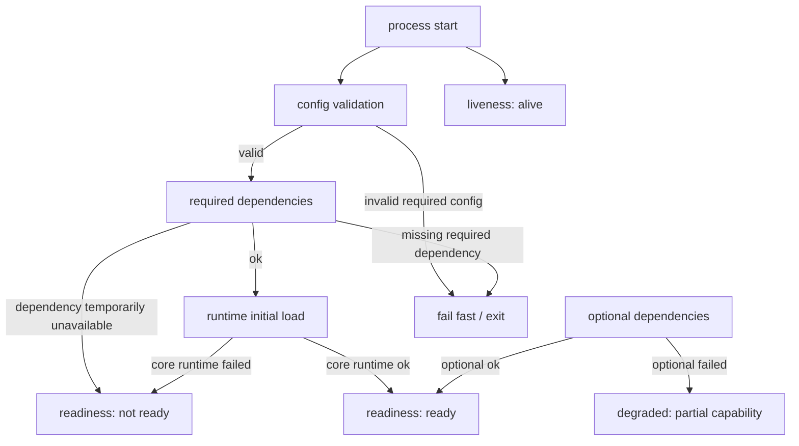

# 健康检查与降级启动

> 状态：待补证据 · 第一版正文，待继续按源码、配置、health endpoint、部署探针和运行时测试核对细节。

---

## 1. 本文回答

本文回答 6 个问题：

- iam-apiserver 应该如何区分 liveness、readiness 和 degraded？
- Identity、AuthN、AuthZ、IDP、Suggest 哪些能力必须可用，哪些能力可以降级？
- 依赖不可用时，服务应该 fail fast、not ready，还是 degraded？
- 健康检查 endpoint 应该暴露什么，不应该暴露什么？
- JWKS、数据库、Redis、Casbin runtime、IDP provider、Suggest index 等依赖如何参与健康状态？
- 修改健康检查或降级启动逻辑时应该运行哪些 Verify？

本文只讲健康检查和降级启动，不展开业务模块内部模型。模块职责见 [../02-业务模块](../02-业务模块/README.md)，配置与运行模式见 [04-配置加载与运行模式.md](04-配置加载与运行模式.md)。

---

## 2. 30 秒结论

健康检查不是一个简单的 `/health = 200`。

IAM 至少需要区分 3 类状态：

```text
liveness：进程是否还活着；
readiness：实例是否可以接收主流量；
degraded：实例可以运行，但部分能力不可用或能力下降。
```

核心能力通常应作为 readiness 的硬条件：

```text
Identity；
AuthN；
AuthZ；
主数据库；
Token/JWKS 必需配置；
REST/gRPC 至少一种对外服务能力。
```

辅助能力可以按配置降级：

```text
部分 IDP provider；
Suggest 索引刷新；
非关键缓存；
metrics / profiling；
gRPC reflection；
部分后台任务。
```

如果只记一句话：

> 核心身份、认证、授权能力不可静默降级；辅助能力可以降级，但必须在 readiness、degraded 状态、日志或指标中明确暴露。

---

## 3. 健康状态模型



这张图表达 4 个判断：

```text
进程活着不等于可以接流量；
可以接流量不等于所有能力都满血；
核心能力失败通常不应该 degraded 后继续承载主流量；
辅助能力失败可以 degraded，但不能静默成功。
```

---

## 4. liveness / readiness / degraded

### 4.1 liveness

liveness 回答：

```text
进程是否还活着？
事件循环或主 goroutine 是否仍在运行？
服务是否需要被容器平台重启？
```

liveness 可以检查：

```text
进程是否可响应；
HTTP/gRPC health handler 是否未死锁；
必要的本地 runtime 是否没有致命错误；
主循环是否仍在运行。
```

liveness 不应该检查过重依赖：

```text
不应该因为短暂数据库抖动就杀进程；
不应该因为某个外部 IDP provider 不可用就重启；
不应该执行复杂业务查询；
不应该触发修复任务。
```

---

### 4.2 readiness

readiness 回答：

```text
当前实例是否可以接收主业务流量？
核心依赖是否可用？
核心 runtime 是否完成初始化？
```

readiness 可以检查：

```text
配置是否有效；
主数据库是否可用；
关键 repository 是否可用；
AuthN token/JWKS 必需能力是否可用；
AuthZ runtime 是否加载到可用版本；
REST/gRPC server 是否已经启动；
必要后台初始化是否完成。
```

readiness 不应该：

```text
泄露敏感配置；
返回完整内部错误堆栈；
执行登录、授权写入或复杂业务流程；
在必需依赖失败时仍返回 ready；
把 degraded 伪装成完全 ready。
```

---

### 4.3 degraded

degraded 回答：

```text
服务是否仍可运行，但某些非核心能力不可用或能力下降？
哪些能力降级？
降级原因是什么？
调用方或运维方如何判断影响范围？
```

degraded 可以包括：

```text
某个 IDP provider 暂不可用；
Suggest 索引刷新失败但旧快照仍可用；
非关键 Redis 缓存不可用，回源 DB；
metrics 或 profiling 不可用；
Outbox relay 积压过高但主服务仍可接收请求；
某个后台任务连续失败。
```

degraded 不应该：

```text
掩盖核心数据库不可用；
掩盖 JWT private key 缺失；
掩盖 AuthZ runtime 未加载；
掩盖核心认证能力不可用；
在响应中泄露 secret 或内部堆栈。
```

---

## 5. 核心能力与辅助能力

### 5.1 核心能力

核心能力通常是 IAM 的主功能，失败时不应静默降级。

| 能力 | 健康语义 | 失败倾向 |
| --- | --- | --- |
| Identity | User、Profile、ProfileLink 主事实可用 | fail fast 或 not ready |
| AuthN | LoginIdentity、Credential、Session、Token、JWKS 可用 | fail fast 或 not ready |
| AuthZ | Check、Role/Permission/RoleBinding、runtime 可用 | not ready 或 degraded，取决于旧 runtime 是否可安全使用 |
| 主数据库 | 核心事实读写可用 | fail fast 或 not ready |
| JWT signing key | Token 签发能力可用 | fail fast |
| JWKS public key | 资源服务本地验签所需公钥可用 | not ready 或对应 endpoint 不可用 |

注意：是否 fail fast 或 not ready，必须以当前代码和部署策略为准。本文只给出判断原则。

---

### 5.2 辅助能力

辅助能力失败时，可以根据配置和场景降级。

| 能力 | 降级语义 | 对外表现 |
| --- | --- | --- |
| IDP provider | 对应微信/企微登录方式不可用 | provider degraded，相关登录接口返回明确错误 |
| Suggest | 搜索能力下降或返回空结果 | degraded，按配置决定是否返回旧快照或空结果 |
| 非关键缓存 | 回源 DB 或关闭缓存 | degraded 或仅记录指标 |
| metrics / profiling | 观测能力下降 | 不影响 readiness，但需要日志或告警 |
| gRPC reflection | 调试能力不可用 | 不影响 readiness |
| Outbox relay | 异步事件传播滞后 | degraded 或告警，需看积压和影响范围 |

辅助能力降级必须满足：

```text
不会破坏核心数据正确性；
不会错误放行认证或授权；
不会泄露不可见数据；
对调用方有明确错误或降级语义；
运维方可以观测降级原因。
```

---

## 6. 依赖检查策略

健康检查不应该把所有依赖都用同一种策略处理。

| 依赖 | 检查方式 | 建议状态影响 |
| --- | --- | --- |
| 主数据库 | ping 或轻量查询 | readiness 硬条件 |
| Redis | ping 或关键 key 操作 | 取决于是否关键依赖 |
| JWT private key | 启动时加载和格式校验 | fail fast |
| JWKS provider | 公钥可导出、kid 可用 | readiness 或 endpoint health |
| Casbin/AuthZ runtime | initial load 和版本状态 | readiness 硬条件或 degraded |
| Outbox relay | 积压、连续失败、最后成功时间 | degraded / alert |
| IDP external API | provider 状态、token refresh 状态 | provider degraded |
| Suggest index | snapshot 版本、最后刷新状态 | degraded 或 not ready，取决于 Required |
| REST/gRPC server | 监听和 handler 可响应 | readiness |

检查原则：

```text
必需依赖失败不能静默 ready；
可选依赖失败不能静默成功；
检查要轻量，避免 health endpoint 自身压垮依赖；
检查结果要有缓存或频率控制；
健康检查不应该执行有副作用的业务写入。
```

---

## 7. 启动时健康状态变化

服务启动过程中的状态应逐步变化。

推荐语义：

```text
process started -> live；
config validated -> live but not ready；
required dependencies initialized -> live but not ready；
core runtime loaded -> ready；
optional dependencies failed -> ready + degraded 或 not ready，取决于 Required；
shutdown signal received -> live but not ready / draining。
```

启动阶段示例：

```text
1. 进程启动，liveness 可响应；
2. 配置加载失败，进程 fail fast；
3. 主数据库连接失败，进程 fail fast 或 not ready；
4. AuthZ runtime initial load 失败，not ready；
5. Suggest index initial load 失败：
   - Required=true：not ready；
   - Required=false：ready + degraded；
6. REST/gRPC server 启动成功，readiness 根据核心依赖状态返回。
```

---

## 8. 降级启动策略

降级启动是指某些非核心依赖不可用时，服务仍然启动，但明确标记能力下降。

降级启动必须有 4 个条件：

```text
依赖被明确标记为 optional 或 Required=false；
降级后不会破坏核心正确性和安全性；
对外接口有明确降级行为；
health/readiness/metrics/logs 能暴露降级原因。
```

不允许降级启动的典型情况：

```text
主数据库不可用；
JWT private key 缺失；
AuthN token verifier 不可用；
AuthZ runtime 没有任何可用策略且 Check 可能错误放行；
配置缺失导致核心模块无法判断业务语义。
```

允许降级启动的典型情况：

```text
Suggest Required=false 且索引不可用，返回空结果或旧快照；
某个 IDP provider 不可用，只影响对应第三方登录方式；
非关键缓存不可用，回源 DB；
metrics/profiling 不可用，仅影响观测能力；
gRPC reflection 不可用，仅影响调试。
```

---

## 9. Suggest 降级语义

Suggest 是辅助读模型，因此可以按配置降级。

推荐语义：

| 场景 | Required=true | Required=false |
| --- | --- | --- |
| 启动时无可用索引 | not ready | ready + degraded |
| 刷新失败但旧快照可用 | ready + degraded | ready + degraded |
| 查询时索引不可用 | 返回明确错误 | 返回空结果或明确 degraded 结果 |
| ProfileAccessScope 不可用 | 不应返回结果 | 不应返回结果 |

关键边界：

```text
Suggest 降级不能泄露不可见 Profile；
Suggest 降级不能写 Profile 主事实；
返回空结果必须可观测，不能被误认为真实无匹配；
手机号搜索降级时仍要遵守脱敏、限流和审计要求。
```

---

## 10. IDP 降级语义

IDP 是外部身份源辅助模块。

某个外部 provider 不可用时，影响范围应限定到对应登录方式。

推荐语义：

```text
微信小程序 provider 不可用 -> 微信小程序登录不可用；
企微 provider 不可用 -> 企微登录不可用；
IDP AppToken refresh 失败 -> 对应 provider degraded；
AuthN password 登录不应因为某个 IDP provider 失败而不可用。
```

关键边界：

```text
IDP 降级不能影响 IAM 内部 User 主事实；
IDP AppToken 不是 IAM AccessToken；
IDP 不可用不代表 AuthN 全部不可用；
相关登录接口必须返回明确错误，而不是伪造身份。
```

---

## 11. AuthZ 降级语义

AuthZ 是核心授权能力，降级必须非常谨慎。

可能场景：

```text
新策略 reload 失败，但旧 runtime 仍可用；
Outbox relay 积压导致策略传播延迟；
PolicyVersion 落后；
Casbin runtime initial load 失败；
授权存储不可用。
```

建议语义：

| 场景 | 建议状态 |
| --- | --- |
| initial load 失败且无旧 runtime | not ready |
| reload 失败但旧 runtime 可用 | ready + degraded / alert |
| policy version 落后过多 | degraded / alert，必要时 not ready |
| Check 依赖不可用且无法安全判断 | fail closed，不应放行 |
| Outbox 积压过高 | degraded / alert |

关键边界：

```text
AuthZ 不应因为降级而错误放行；
无法判断权限时应 fail closed；
Casbin runtime 是 infra，不是领域事实源；
Outbox 积压不等于授权写入失败，但意味着传播滞后。
```

---

## 12. AuthN / JWKS 健康语义

AuthN 是核心认证能力。

需要重点检查：

```text
LoginIdentity/Credential/Session repository 是否可用；
JWT signing key 是否加载成功；
JWKS public key 是否可导出；
access token / refresh token TTL 配置是否合法；
password hash 配置是否合法；
refresh token store 是否可用。
```

JWKS endpoint 的语义：

```text
用于资源服务获取验签公钥；
不应暴露 private key；
应包含可用 kid；
key rotation 时应保留必要旧 key；
JWKS 可用不代表授权通过；
JWKS 不应执行复杂业务查询。
```

Verify 示例：

```bash
curl http://localhost:8080/.well-known/jwks.json
```

注意：实际路径以 OpenAPI/源码为准。

---

## 13. health endpoint 响应原则

health endpoint 可以返回简单状态，也可以返回结构化状态。

推荐结构化语义：

```json
{
  "status": "ready",
  "degraded": false,
  "components": {
    "database": { "status": "ok" },
    "redis": { "status": "ok" },
    "authn": { "status": "ok" },
    "authz": { "status": "ok", "policy_version": "..." },
    "idp_wechat": { "status": "degraded", "reason": "token_refresh_failed" },
    "suggest": { "status": "degraded", "snapshot": "stale" }
  }
}
```

注意：上面是推荐语义，不代表当前已实现。实际响应必须以源码和 OpenAPI 为准。

health 响应不应该包含：

```text
数据库 DSN；
Redis 密码；
JWT private key；
微信 app secret；
完整内部错误堆栈；
用户个人信息；
权限策略明细；
可被攻击者利用的内部拓扑细节。
```

---

## 14. 状态码建议

REST health endpoint 的状态码建议：

| 状态 | HTTP status | 说明 |
| --- | --- | --- |
| live | `200` | 进程活着 |
| ready | `200` | 可接收主流量 |
| degraded | `200` 或 `207` | 可运行但部分能力下降，具体以约定为准 |
| not ready | `503` | 不应接收流量 |
| draining | `503` | 正在关闭，不接收新流量 |

注意：是否使用 `207 Multi-Status` 需要看接入方和部署平台是否支持。多数容器平台只关心 200/非 200，因此 degraded 通常仍返回 200，并在 body/metrics/logs 中暴露原因。

gRPC health 的状态建议：

| 状态 | gRPC health status |
| --- | --- |
| ready | `SERVING` |
| not ready | `NOT_SERVING` |
| unknown | `UNKNOWN` |
| degraded | 可用 `SERVING` + 额外详情或 metrics 表达 |

---

## 15. readiness 与 shutdown

收到 shutdown signal 后，实例应尽快从 ready 变为 not ready 或 draining。

推荐流程：

```text
1. 收到 SIGTERM / SIGINT；
2. process 标记 draining；
3. readiness 返回 503；
4. REST/gRPC server 停止接收新请求；
5. in-flight 请求在 timeout 内完成；
6. 后台任务停止；
7. 关闭外部资源；
8. 进程退出。
```

关键边界：

```text
liveness 可以继续返回 alive，直到进程退出；
readiness 应停止接流量；
shutdown 不保证所有 outbox 全部发布；
shutdown 不替代业务幂等和重试。
```

---

## 16. 观测与告警

健康状态应与日志、metrics 和告警协同。

建议指标：

```text
service_ready；
service_degraded；
dependency_status；
last_success_time；
last_failure_time；
outbox_pending_count；
outbox_relay_failures；
authz_policy_version；
authz_reload_failures；
suggest_snapshot_version；
suggest_refresh_failures；
idp_provider_status；
jwks_key_count。
```

建议日志字段：

```text
component；
status；
reason；
dependency；
last_error；
last_success_at；
version；
snapshot_id；
policy_version。
```

日志和指标不应包含：

```text
secret；
private key；
用户敏感信息；
完整 token；
外部平台敏感凭据。
```

---

## 17. 常见反模式

| 反模式 | 问题 | 推荐做法 |
| --- | --- | --- |
| `/health` 永远返回 200 | 掩盖核心依赖失败 | 区分 live、ready、degraded |
| readiness 执行复杂业务查询 | health endpoint 反而压垮服务 | 使用轻量检查和状态缓存 |
| optional 依赖失败静默成功 | 运维不可见 | 标记 degraded 并记录指标/日志 |
| 核心数据库失败仍 ready | 错误接流量 | not ready 或 fail fast |
| JWT private key 缺失仍启动 | 认证能力不安全 | fail fast |
| AuthZ 无策略仍放行 | 安全风险 | fail closed / not ready |
| Suggest 降级返回不可见 Profile | 数据泄露 | 降级也必须执行可见范围约束 |
| health 响应泄露 secret | 安全风险 | 响应只暴露状态，不暴露敏感值 |
| shutdown 后 readiness 仍 ready | 流量继续打入关闭实例 | draining 后 readiness 返回 503 |

---

## 18. 和其他运行时文档的关系

| 文档 | 关系 |
| --- | --- |
| [01-服务入口与生命周期.md](01-服务入口与生命周期.md) | health 状态随 process 生命周期变化 |
| [02-组合根与依赖装配.md](02-组合根与依赖装配.md) | 依赖由 container 装配，健康检查基于这些依赖状态 |
| [03-REST与gRPC传输层装配.md](03-REST与gRPC传输层装配.md) | health/JWKS/gRPC health 属于传输层入口的一部分 |
| [04-配置加载与运行模式.md](04-配置加载与运行模式.md) | Required/optional、运行模式、降级策略由配置决定 |
| [05-后台任务与优雅关闭.md](05-后台任务与优雅关闭.md) | 后台任务状态影响 degraded/readiness，shutdown 时 readiness 先停止 |

---

## 19. 事实源

本文是健康检查和降级启动说明，不是机器契约。

当本文与代码、配置、OpenAPI、proto 或测试冲突时，按以下优先级判断：

1. 源码与运行时行为。
2. 机器可读配置、OpenAPI、proto。
3. 测试：运行时测试、transport 测试、架构测试。
4. 现行维护中的 `docs/`。
5. `_archive/` 历史材料。

当前主要事实源：

| 事实 | 路径 |
| --- | --- |
| 生命周期管理 | `../../internal/apiserver/process` |
| 配置加载 | `../../internal/apiserver/config` |
| 组合根 | `../../internal/apiserver/container` |
| REST transport | `../../internal/apiserver/transport/rest` |
| gRPC transport | `../../internal/apiserver/transport/grpc` |
| REST 契约 | `../../api/rest` |
| gRPC 契约 | `../../api/grpc` |
| AuthN 应用层 | `../../internal/apiserver/application/authn` |
| AuthZ 应用层 | `../../internal/apiserver/application/authz` |
| Suggest 应用层 | `../../internal/apiserver/application/suggest` |
| IDP 应用层 | `../../internal/apiserver/application/idp` |
| Infra 层 | `../../internal/apiserver/infra` |
| 架构测试 | `../../internal/pkg/architecture` |

---

## 20. Verify

修改本文后至少执行：

```bash
make docs-hygiene
```

涉及 health endpoint 或 REST transport 时，执行：

```bash
go test ./internal/apiserver/transport/rest/...
make api-validate
```

涉及 gRPC health 或 gRPC transport 时，执行：

```bash
go test ./internal/apiserver/transport/grpc/...
make proto-gen
```

涉及 process、配置、降级启动或 shutdown 状态时，执行：

```bash
go test ./internal/apiserver/...
```

涉及分层边界时，执行：

```bash
go test ./internal/pkg/architecture
```

本地手工验证示例：

```bash
curl http://localhost:8080/health
curl http://localhost:8080/ready
curl http://localhost:8080/.well-known/jwks.json
```

注意：实际 endpoint 路径必须以 OpenAPI/源码为准。如果当前没有 `/ready`，不要在文档中写成已实现事实。

---

## 21. 本文总结

健康检查与降级启动可以压缩成 3 个状态：

```text
liveness：进程是否活着；
readiness：是否可以接主流量；
degraded：是否部分能力下降但仍可运行。
```

最重要的边界是：

```text
核心身份、认证、授权能力不可静默降级；
辅助能力可以降级，但必须可观测；
降级不能破坏安全性和数据正确性；
无法判断权限时应 fail closed；
health endpoint 不应泄露敏感信息；
shutdown 时 readiness 应先停止接流量。
```

维护健康检查文档时，必须持续核对源码、配置、OpenAPI/proto 和部署探针，避免 `/health` 变成掩盖真实故障的固定 200。
