# 01-运行时

## 本文回答

本组文档回答：`iam-apiserver` 今天如何启动、装配模块、暴露 REST/gRPC、执行认证与路由保护、提供健康和 debug 面，并在后台任务与 graceful shutdown 中保持运行时边界清楚。

它是 [../00-概览](../00-概览/README.md) 之后的第一层深潜。概览层负责系统地图；本组负责把“系统怎么跑起来、怎么对外提供通信面、怎么在失败时降级和关闭”讲清楚。

## 30 秒结论

- IAM 当前主运行单元是 `iam-apiserver`，入口是 [../../cmd/apiserver/apiserver.go](../../cmd/apiserver/apiserver.go)，运行链路进入 [../../internal/apiserver/process](../../internal/apiserver/process)。
- 运行时主轴是 `process + container + transport`：`process` 管生命周期，`container` 管模块装配和能力收集，`transport/rest` 与 `transport/grpc` 管协议适配。
- REST 与 gRPC 由同一个进程承载，共用 container 装配出的 AuthN、AuthZ、User、IDP、Suggest、CacheGovernance 能力。
- HTTP protected routes 是 fail-closed：没有 AuthN token service 就不注册需要身份的业务路由；没有 route authorization 能力就不注册 admin 路由。
- gRPC 当前以 mTLS 为主要传输保护，prod 开启 ACL，dev 默认关闭 ACL；应用层 gRPC credential auth 当前配置为关闭。
- 运行时健康、debug、降级启动和后台任务都不是业务语义本身；它们是诊断和生命周期控制面。

## 运行时知识地图

```mermaid
flowchart TD
    Runtime["01-运行时"]
    Entry["01 服务入口、HTTP 与模块装配"]
    GRPC["02 gRPC 与 mTLS"]
    Auth["03 HTTP 认证中间件与身份上下文"]
    Health["04 健康检查、debug 与降级启动"]
    Tasks["05 后台任务与优雅关闭"]

    Runtime --> Entry
    Runtime --> GRPC
    Runtime --> Auth
    Runtime --> Health
    Runtime --> Tasks

    Entry --> Process["process stages"]
    Entry --> Container["container bootstrap"]
    Entry --> REST["REST route registration"]

    GRPC --> Server["internal/pkg/grpc"]
    GRPC --> Interceptors["mTLS / ACL / Audit"]
    GRPC --> Registry["gRPC Registry"]

    Auth --> Middleware["JWTAuthMiddleware"]
    Auth --> Context["gin.Context / request.Context"]
    Auth --> Protected["protected route matrix"]

    Health --> Probes["/health /ping /healthz /readyz /livez"]
    Health --> Debug["/debug/routes /debug/modules /debug/cache-governance"]
    Health --> Degraded["degraded startup gate"]

    Tasks --> Rotation["JWKS rotation scheduler"]
    Tasks --> Relay["outbox relay"]
    Tasks --> Shutdown["shutdown hooks"]
```



## 推荐阅读顺序

| 顺序 | 文档 | 读完应获得什么 |
| ---- | ---- | ---- |
| 1 | [01-服务入口&HTTP 与模块装配.md](01-服务入口&HTTP%20与模块装配.md) | 知道进程如何经过 prepare stages、container 和 REST router 进入运行态。 |
| 2 | [02-gRPC与mTLS.md](02-gRPC与mTLS.md) | 知道 gRPC server 如何构建、注册服务，以及 mTLS/ACL/audit 链如何生效。 |
| 3 | [03-HTTP认证中间件与身份上下文.md](03-HTTP认证中间件与身份上下文.md) | 知道 HTTP JWT 中间件如何验证 token、写入上下文，以及哪些路由受保护。 |
| 4 | [04-健康检查&debug 路由与降级启动边界.md](04-健康检查&debug%20路由与降级启动边界.md) | 知道不同探针、debug 面和降级启动分别能证明什么。 |
| 5 | [05-后台任务&优雅关闭.md](05-后台任务&优雅关闭.md) | 知道 rotation scheduler、outbox relay 和 shutdown sequence 如何纳入生命周期。 |

## 读者路径

| 读者 | 推荐路径 | 重点问题 |
| ---- | ---- | ---- |
| 新成员 | README -> 01 -> 04 -> 05 | 服务怎么启动，哪些现象只能说明进程活着。 |
| 后端开发 | 01 -> 03 -> 02 -> 05 | 新增路由、服务或后台任务时应该挂在哪个层。 |
| 接入方 | 02 -> 03 -> 04 | gRPC/HTTP 保护面、健康探针和故障表现。 |
| 运维/排障 | 04 -> 05 -> 01 | 探针含义、模块状态、outbox relay、shutdown 顺序。 |
| 文档维护者 | 01 -> 02 -> 03 -> 04 -> 05 | 运行时事实应回到代码、配置、合同和测试。 |

## 运行时术语

| 术语 | 当前含义 | 代码证据 |
| ---- | ---- | ---- |
| `process` | 进程生命周期编排层，负责 runtime/resource/container/transport/task/shutdown 阶段。 | [../../internal/apiserver/process](../../internal/apiserver/process) |
| `container` | 模块组合根，负责 bootstrap plan、typed deps、REST deps、gRPC registrations、runtime deps。 | [../../internal/apiserver/container](../../internal/apiserver/container) |
| `transport` | 协议适配层，REST 和 gRPC 各自拥有注册、DTO、middleware、mapper。 | [../../internal/apiserver/transport](../../internal/apiserver/transport) |
| `degraded startup` | 非 production-like 模式下，显式允许关键模块缺失时继续启动基础运行面。 | [../../internal/apiserver/process/runtime_mode.go](../../internal/apiserver/process/runtime_mode.go)、[../../internal/apiserver/process/server_lifecycle.go](../../internal/apiserver/process/server_lifecycle.go) |
| `runtime deps` | 后台任务与关闭流程需要的能力投影，如 rotation scheduler、outbox relay、suggest cleanup。 | [../../internal/apiserver/container/runtime_deps.go](../../internal/apiserver/container/runtime_deps.go) |
| `protected routes` | 需要 JWT middleware 的 REST 路由组；依赖缺失时不注册。 | [../../internal/apiserver/transport/rest/module_routes.go](../../internal/apiserver/transport/rest/module_routes.go) |
| `admin routes` | 需要 JWT + platform admin role 的管理面；role check 不可用时不注册。 | [../../internal/apiserver/transport/rest/admin_routes.go](../../internal/apiserver/transport/rest/admin_routes.go) |

## 本组覆盖什么

| 主题 | 本组讲到什么程度 | 深潜入口 |
| ---- | ---- | ---- |
| 进程启动 | 从 main 到 process stages、container、REST/gRPC registration。 | [01-服务入口&HTTP 与模块装配.md](01-服务入口&HTTP%20与模块装配.md) |
| HTTP 运行面 | base/debug/module/admin routes、JWT middleware、fail-closed。 | [01-服务入口&HTTP 与模块装配.md](01-服务入口&HTTP%20与模块装配.md)、[03-HTTP认证中间件与身份上下文.md](03-HTTP认证中间件与身份上下文.md) |
| gRPC 运行面 | server config、mTLS、ACL、audit、service registration、health。 | [02-gRPC与mTLS.md](02-gRPC与mTLS.md) |
| 健康与 debug | HTTP base probes、gRPC healthz、debug routes、cache governance debug 面。 | [04-健康检查&debug 路由与降级启动边界.md](04-健康检查&debug%20路由与降级启动边界.md) |
| 后台任务和关闭 | JWKS rotation、outbox relay、shutdown hooks、资源关闭顺序。 | [05-后台任务&优雅关闭.md](05-后台任务&优雅关闭.md) |

## 本组不替代什么

- 不替代业务域文档：AuthN、AuthZ、Identity/ProfileLink 的领域模型在 [../02-业务域](../02-业务域/README.md) 展开。
- 不替代接口合同：REST 以 [../../api/rest](../../api/rest) 为准，gRPC 以 [../../api/grpc](../../api/grpc) 为准。
- 不替代运维部署文档：端口、证书、数据库迁移和环境部署在 [../04-基础设施与运维](../04-基础设施与运维/README.md) 展开。
- 不替代归档材料：历史分析放在 [../_archive](../_archive/README.md)，不能作为当前运行时事实。

## 维护验证

修改本组文档后至少运行：

```bash
make docs-hygiene
go test ./internal/pkg/architecture ./internal/apiserver/process ./internal/apiserver/container ./internal/apiserver/transport/rest ./internal/apiserver/transport/grpc ./internal/pkg/grpc ./internal/pkg/middleware/authn
```

如果新增运行时术语或路径，还要复查活跃文档没有重新引入退役路径或旧接口名称。
