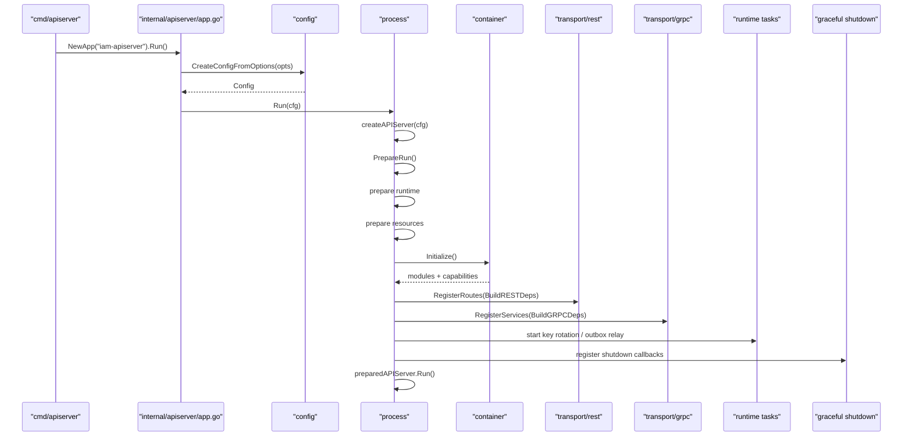

# 01-运行时

## 本文回答

`01-运行时/` 是 IAM 文档体系中解释 **服务如何启动、装配、暴露协议、运行后台任务并安全关闭** 的模块。

它回答：

1. `iam-apiserver` 如何从 `main()` 进入生命周期编排；
2. `process`、`container`、`transport` 三者分别负责什么；
3. MySQL、Redis、EventBus、IDP encryption key 等运行时资源如何进入业务模块；
4. REST 路由与 gRPC 服务如何从 container 投影出来；
5. 配置、运行模式、降级启动、健康检查之间是什么关系；
6. key rotation、outbox relay 等后台任务如何纳入生命周期；
7. graceful shutdown 的边界和关闭顺序是什么。

本目录只解释 **运行时装配与生命周期**。  
AuthN、AuthZ、Identity、IDP 的业务规则不在这里展开。

---

## 30 秒结论

IAM 当前主运行单元是：

```text
iam-apiserver
```

它的运行时主轴是：

```text
cmd/apiserver
  -> app/options/config
  -> process
  -> container
  -> transport/rest + transport/grpc
  -> runtime tasks
  -> graceful shutdown
```

其中：

| 层次 | 职责 |
|---|---|
| `cmd/apiserver` | 最薄进程入口，只创建并运行 App |
| `app/options/config` | 接入命令行框架，生成运行时配置 |
| `process` | 生命周期编排层，负责资源准备、container 初始化、transport 注册、后台任务和关闭 |
| `container` | 组合根，装配 AuthN/AuthZ/Identity/IDP/Suggest/Outbox 等模块 |
| `transport/rest` | HTTP 协议适配、路由注册、JWT middleware、DTO/错误映射 |
| `transport/grpc` | gRPC 协议适配、service registration、mTLS/ACL/audit 链 |
| `runtime tasks` | key rotation scheduler、outbox relay 等后台任务 |
| `graceful shutdown` | 停止后台任务、清理模块、关闭 DB/HTTP/gRPC |

一句话：

> **`process` 管生命周期，`container` 管组合装配，`transport` 管协议适配。**

---

## 本目录文档

当前 `01-运行时/` 包含 5 篇正文文档：

```text
01-运行时/
├── README.md
├── 01-服务入口与生命周期装配.md
├── 02-Transport装配--REST路由与gRPC服务注册.md
├── 03-配置与运行模式.md
├── 04-后台任务与优雅关闭.md
└── 05-降级启动与健康检查.md
```

| 文档 | 作用 | 读完后应该能回答 |
|---|---|---|
| [01-服务入口与生命周期装配.md](01-服务入口与生命周期装配.md) | 解释从 `main()` 到 prepared server 的完整生命周期 | 服务如何从入口启动、准备资源、初始化 container、启动 HTTP/gRPC、注册 shutdown |
| [02-Transport装配--REST路由与gRPC服务注册.md](02-Transport装配--REST路由与gRPC服务注册.md) | 解释 REST/gRPC 如何从 container 获取模块能力 | REST deps、gRPC registrations、路由注册、service registration 如何工作 |
| [03-配置与运行模式.md](03-配置与运行模式.md) | 解释 options/config/server mode/app mode/degradedAllowed | 配置如何进入运行时，不同运行模式如何影响启动策略 |
| [04-后台任务与优雅关闭.md](04-后台任务与优雅关闭.md) | 解释 runtime tasks 与 shutdown lifecycle | key rotation、outbox relay、suggest cleanup、DB/HTTP/gRPC 关闭顺序 |
| [05-降级启动与健康检查.md](05-降级启动与健康检查.md) | 解释 degraded startup、health、debug、fail-closed | 什么时候允许半可用启动，健康检查能证明什么、不能证明什么 |

---

## 运行时知识地图

```mermaid
flowchart TD
    Runtime["01-运行时"]

    Entry["01 服务入口与生命周期装配"]
    Transport["02 Transport 装配"]
    Config["03 配置与运行模式"]
    Tasks["04 后台任务与优雅关闭"]
    Health["05 降级启动与健康检查"]

    Runtime --> Entry
    Runtime --> Transport
    Runtime --> Config
    Runtime --> Tasks
    Runtime --> Health

    Entry --> Main["cmd/apiserver"]
    Entry --> Process["process.Run / PrepareRun"]
    Entry --> Container["container.Initialize"]

    Transport --> REST["REST Router / Module Routes"]
    Transport --> GRPC["gRPC Registry / Services"]

    Config --> Options["options"]
    Config --> Mode["server mode / app mode"]
    Config --> Degraded["degradedAllowed"]

    Tasks --> Scheduler["KeyRotation Scheduler"]
    Tasks --> Relay["Outbox Relay"]
    Tasks --> Shutdown["Graceful Shutdown"]

    Health --> Probes["/health / ready / live"]
    Health --> Debug["/debug/routes / modules / cache-governance"]
    Health --> FailClosed["protected routes fail-closed"]
```



---

## 推荐阅读顺序

### 标准顺序

```text
01-服务入口与生命周期装配
  -> 02-Transport装配--REST路由与gRPC服务注册
  -> 03-配置与运行模式
  -> 04-后台任务与优雅关闭
  -> 05-降级启动与健康检查
```

原因：

1. 先看服务如何跑起来；
2. 再看 REST/gRPC 如何挂载；
3. 再看配置和运行模式如何影响启动；
4. 再看后台任务和关闭顺序；
5. 最后看失败、降级和健康检查边界。

---

### 如果你是新读者

推荐路径：

```text
../00-概览/README.md
  -> ../00-概览/01-系统架构总览.md
  -> 01-服务入口与生命周期装配.md
  -> 02-Transport装配--REST路由与gRPC服务注册.md
```

目标：

```text
先建立系统地图，再看运行时主链路。
```

---

### 如果你要排查服务启动问题

推荐路径：

```text
03-配置与运行模式.md
  -> 01-服务入口与生命周期装配.md
  -> 05-降级启动与健康检查.md
```

重点关注：

```text
options/config
server mode
app mode
degradedAllowed
MySQL / Redis / IDP key / EventBus 初始化
container critical modules
health / debug 输出
```

---

### 如果你要新增 REST/gRPC 能力

推荐路径：

```text
02-Transport装配--REST路由与gRPC服务注册.md
  -> 01-服务入口与生命周期装配.md
  -> ../05-接入与契约/01-REST API契约.md
  -> ../05-接入与契约/02-gRPC API契约.md
```

重点关注：

```text
container.BuildRESTDeps
container.BuildGRPCDeps
REST module routes
gRPC registrations
OpenAPI / proto 同步
route/proto contract tests
```

---

### 如果你要新增后台任务

推荐路径：

```text
04-后台任务与优雅关闭.md
  -> 01-服务入口与生命周期装配.md
  -> ../06-架构护栏/01-架构测试与依赖边界.md
```

重点关注：

```text
Container.BuildRuntimeDeps
startRuntimeTasks
processruntime.Lifecycle
shutdown hooks
任务停止语义
```

---

## 运行时主链路



讲清这张图，运行时模块基本就讲清楚了：

```text
入口很薄
生命周期在 process
组合装配在 container
协议适配在 transport
后台任务纳入 runtime lifecycle
关闭动作统一交给 graceful shutdown
```

---

## 运行时关键概念

| 概念 | 当前含义 | 常见误解 |
|---|---|---|
| `process` | 生命周期拥有者，负责启动阶段、运行期任务和关闭 | 误以为只是普通 server 包 |
| `container` | 组合根，负责装配模块和投影能力 | 误以为是业务 service 或运行期 Service Locator |
| `transport` | REST/gRPC 协议适配层 | 误以为可以直接访问 infra 或 container |
| `PrepareRun` | 启动前 stage pipeline | 误以为只是普通 init 函数 |
| `degraded startup` | 非生产诊断/开发场景的受控降级启动 | 误以为生产容错承诺 |
| `runtime deps` | 后台任务和 shutdown 需要的能力投影 | 误以为 transport deps |
| `protected routes` | 需要 JWT middleware 的业务路由 | 误以为只要进程活着就一定注册 |
| `admin routes` | 需要平台管理员授权的管理路由 | 误以为只要 AuthN 可用就注册 |
| `health/debug` | 诊断控制面 | 误以为等价于所有业务能力可用 |
| `graceful shutdown` | 统一关闭后台任务、模块和外部资源 | 误以为只关 HTTP server |

---

## process、container、transport 的职责边界

### process 负责什么

```text
配置转运行时状态
资源初始化
container 初始化
HTTP/gRPC server 构建
REST/gRPC 注册
后台任务启动
shutdown callbacks 注册
prepared server 运行
```

process 不负责：

```text
登录业务规则
授权业务规则
ProfileLink 关系规则
REST DTO 解析
gRPC response 拼装
repository 实现
```

---

### container 负责什么

```text
接收 MySQL、Redis、EventBus、IDP key、runtime options
初始化 AuthN/AuthZ/Identity/IDP/Suggest/CacheGovernance/Outbox
提供 REST deps
提供 gRPC registrations
提供 runtime deps
提供 module state / capabilities
```

container 不负责：

```text
HTTP 请求处理
gRPC 请求处理
业务用例逻辑
DTO 映射
协议错误码映射
```

---

### transport 负责什么

```text
REST route registration
gRPC service registration
middleware / interceptor 接入
DTO / proto mapper
调用 application capabilities
响应和错误映射
```

transport 不负责：

```text
直接读写数据库
直接调用 Redis
直接调用 Casbin adapter
直接读取全局配置
直接从 container 内部导航模块字段
```

---

## 运行时与业务模块的关系

| 业务模块 | 运行时如何装配 | 深潜入口 |
|---|---|---|
| AuthN | container 初始化 AuthN module，投影 token service、login service、JWKS、session admin、rotation scheduler | `../02-认证AuthN/` |
| AuthZ | container 初始化 AuthZ module，投影 role/resource/policy/rolebinding/check/snapshot、route authorization runtime | `../03-授权AuthZ/` |
| Identity | container 初始化 User module，投影 User/Profile/ProfileLink 相关 capabilities | `../04-身份Identity/` |
| IDP | container 初始化 IDP module，投影 WechatApp 管理和供 AuthN 使用的 Repository/SecretVault/AuthProvider | `../02-认证AuthN/04-第三方登录与IDP协作.md` |
| Suggest | container 初始化 Suggest module，提供 profile suggest 和 cleanup 能力 | 视后续文档补充 |
| Outbox | container/eventing 初始化 outbox store 与 relay，process 启动 relay runtime task | `../03-授权AuthZ/04-授权版本事件与Outbox.md` |

运行时文档只解释这些模块如何进入进程，不展开它们的业务规则。

---

## REST/gRPC 装配概览

### REST

REST 装配链路：

```text
container.BuildRESTDeps
  -> rest.NewRouter(deps)
  -> RegisterRoutes(engine)
  -> base routes
  -> debug routes
  -> module routes
  -> admin routes
```

关键边界：

```text
REST router 消费显式 Deps
REST router 不直接依赖 container
REST router 不直接读 viper
protected routes 依赖 JWT middleware
admin routes 依赖 route authorization
```

---

### gRPC

gRPC 装配链路：

```text
container.BuildGRPCDeps
  -> grpc registrations
  -> transport/grpc.Registry
  -> RegisterServices(server)
  -> MarkAllServicesServing()
```

关键边界：

```text
proto 是 gRPC 机器契约事实源
transport/grpc/service 负责 service 实现与注册
container 只生成 registration，不处理 RPC
gRPC 面向可信服务间调用
```

---

## 配置、运行模式与降级启动

运行时配置的主线是：

```text
options
  -> ApplyDefaults
  -> config.Config
  -> process.prepareRuntime
  -> runtimeOutput
```

`prepareRuntime` 会推导：

```text
mode
appMode
degradedAllowed
```

其中 degraded startup 的原则是：

```text
只有显式允许
并且不是 release / production
才允许关键资源或关键模块缺失时继续启动基础诊断面
```

这意味着：

```text
degraded startup 是开发/诊断能力
不是生产高可用策略
```

生产环境关键资源不可用时应该失败退出，而不是半可用运行。

---

## 后台任务与优雅关闭

当前运行时任务通过：

```text
Container.BuildRuntimeDeps
  -> startRuntimeTasks
```

进入 process lifecycle。

主要任务包括：

```text
KeyRotation Scheduler
Outbox Relay
Suggest cleanup
```

关闭顺序大致是：

```text
lifecycle hooks
  -> stop runtime tasks
  -> suggest cleanup
  -> close database manager
  -> close HTTP server
  -> close gRPC server
```

关键原则：

```text
后台任务必须有停止语义
外部资源必须统一关闭
gRPC/HTTP 停止要进入 graceful shutdown
```

---

## 健康检查与 debug 边界

健康和 debug 不是业务能力本身。

它们只能说明：

```text
进程是否活着
server 是否启动
模块状态如何
路由是否注册
cache governance 状态如何
outbox / runtime 诊断信息如何
```

不能直接说明：

```text
所有业务路由都可用
AuthN/AuthZ 全功能可用
IDP 外部平台可用
业务权限一定正确
```

尤其在 degraded startup 场景下，要区分：

```text
进程活着
HTTP server 可访问
模块是否初始化
protected route 是否注册
业务能力是否完整
```

---

## 代码证据入口

| 主题 | 代码入口 |
|---|---|
| 进程入口 | `cmd/apiserver/apiserver.go` |
| App 初始化 | `internal/apiserver/app.go` |
| 根 Run 委托 | `internal/apiserver/run.go` |
| process 主入口 | `internal/apiserver/process/run.go` |
| apiServer root | `internal/apiserver/process/root.go` |
| stage pipeline | `internal/apiserver/process/prepare_runner.go` |
| runtime mode | `internal/apiserver/process/runtime_mode.go` |
| resource bootstrap | `internal/apiserver/process/bootstrap.go` |
| DB manager | `internal/apiserver/process/database.go` |
| IDP key parser | `internal/apiserver/process/idp_key.go` |
| EventBus | `internal/apiserver/process/event_bus.go` |
| HTTP server | `internal/apiserver/process/generic_server.go` |
| gRPC config | `internal/apiserver/process/grpc_config.go` |
| runtime tasks / shutdown | `internal/apiserver/process/shutdown_lifecycle.go` |
| container root | `internal/apiserver/container/container.go` |
| container bootstrap | `internal/apiserver/container/bootstrap.go` |
| module graph | `internal/apiserver/container/module_graph.go` |
| REST deps | `internal/apiserver/container/rest_deps.go` |
| gRPC registry deps | `internal/apiserver/container/grpc_registry.go` |
| runtime deps | `internal/apiserver/container/runtime_deps.go` |
| REST router | `internal/apiserver/transport/rest/router.go` |
| REST module routes | `internal/apiserver/transport/rest/module_routes.go` |
| gRPC registry | `internal/apiserver/transport/grpc/registry.go` |
| architecture tests | `internal/pkg/architecture/architecture_test.go` |

---

## 验证建议

修改运行时相关文档或代码后，至少检查：

```bash
make docs-hygiene
```

运行时与 transport 相关测试：

```bash
go test ./internal/apiserver/process \
  ./internal/apiserver/container \
  ./internal/apiserver/transport/rest \
  ./internal/apiserver/transport/grpc \
  ./internal/pkg/grpc \
  ./internal/pkg/architecture
```

如果涉及 REST 路由：

```bash
make docs-swagger
make api-validate
go test ./internal/apiserver/transport/rest
```

如果涉及 gRPC proto 或 service registration：

```bash
make proto-gen
go test ./internal/apiserver/transport/grpc
```

如果涉及后台任务或 Outbox：

```bash
go test ./internal/apiserver/infra/messaging \
  ./internal/apiserver/infra/mysql/eventoutbox \
  ./pkg/outboxcore
```

---

## 维护规则

### 1. 不恢复旧运行时文档命名

当前新版运行时文档是：

```text
01-服务入口与生命周期装配.md
02-Transport装配--REST路由与gRPC服务注册.md
03-配置与运行模式.md
04-后台任务与优雅关闭.md
05-降级启动与健康检查.md
```

不要再把旧入口作为 active 文档入口，例如：

```text
01-服务入口&HTTP 与模块装配.md
02-gRPC与mTLS.md
03-HTTP认证中间件与身份上下文.md
04-健康检查&debug 路由与降级启动边界.md
05-后台任务&优雅关闭.md
```

旧文档如需保留，应进入 `_archive/`。

---

### 2. README 只做模块导航

`01-运行时/README.md` 不应重复五篇正文的完整内容。  
它负责：

```text
说明本模块回答什么
列出阅读顺序
串联运行时知识地图
提供术语与证据入口
说明维护和验证规则
```

详细链路放到对应正文。

---

### 3. 不把运行时控制面写成业务语义

例如：

```text
health/debug 不是业务可用性承诺
degraded startup 不是生产容错策略
outbox relay 失败不等于授权事实失败
runtime task 不应承载业务规则
```

---

### 4. process / container / transport 术语必须准确

尤其注意：

```text
process 是生命周期编排层
container 是组合根
transport 是协议适配层
application 是用例编排层
domain 是业务规则层
infra 是外部资源适配层
```

不要把 container 写成 service 层，也不要把 transport 写成业务层。

---

## 本文总结

`01-运行时/` 解释的是 IAM 如何从代码入口运行成服务。

核心心智是：

```text
main 很薄
app 接入命令行和配置
process 统一生命周期
container 装配业务模块
transport 注册 REST/gRPC
runtime tasks 纳入 lifecycle
shutdown 统一关闭资源
```

读完本目录后，读者应该能回答：

```text
服务从哪里启动？
配置如何进入运行时？
资源如何准备？
模块如何装配？
REST/gRPC 如何注册？
后台任务如何启动？
健康检查能证明什么？
降级启动允许什么？
服务如何优雅关闭？
```

如果只记一句话：

> **运行时模块不讲业务规则，它讲 IAM 如何被装配、运行、诊断和关闭。**
