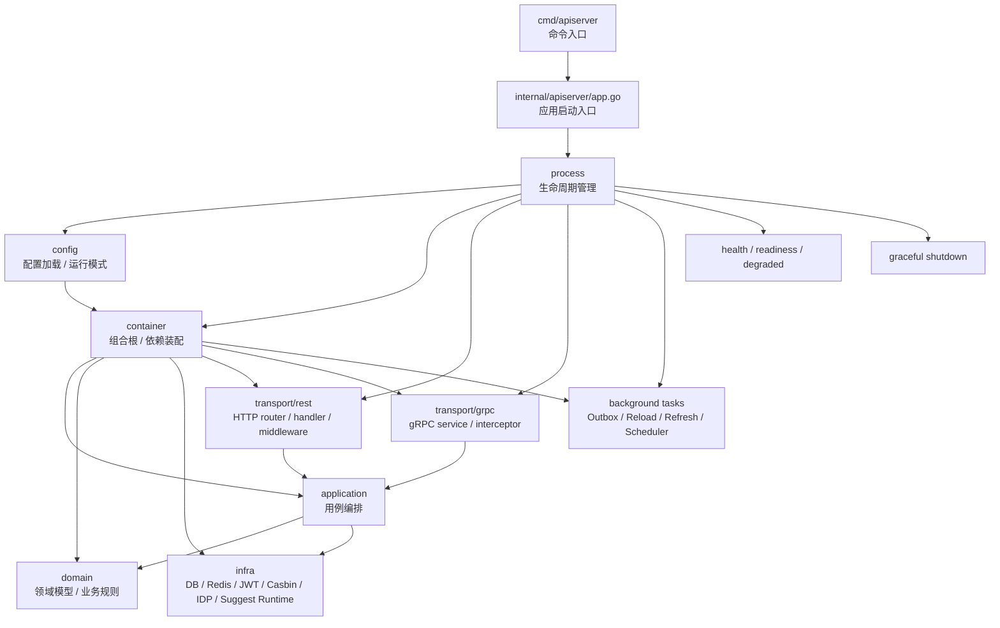

# 01-运行时

> 状态：设计目标 · 运行时目录入口，待继续按源码、配置、契约和测试核对细节。

---

## 1. 本目录定位

`01-运行时/` 解释 iam-apiserver 如何启动、装配、注册协议层、运行后台任务、暴露健康检查并优雅关闭。

它回答的是运行时问题：

```text
iam-apiserver 从哪里启动？
process 如何管理生命周期？
container 如何装配依赖？
REST/gRPC 如何注册和接入 application？
配置如何影响运行模式和依赖装配？
后台任务如何启动、停止和观测？
health/readiness/degraded 如何表达？
```

它不展开业务模块内部模型。

业务模块模型见 [02-业务模块](../02-业务模块/README.md)，系统定位和架构原则见 [00-概览](../00-概览/README.md)，接入契约见 [03-接入与契约](../03-接入与契约/README.md)。

---

## 2. 30 秒结论

iam-apiserver 的运行时主线是：

```text
cmd/apiserver
  -> internal/apiserver/app.go
  -> process
  -> config
  -> container
  -> transport/rest + transport/grpc
  -> application/domain/infra modules
  -> background tasks
  -> health/readiness
  -> graceful shutdown
```

各层职责可以压缩为：

```text
cmd/app：进入进程；
process：生命周期、配置、资源、server、后台任务、shutdown；
container：组合根和依赖装配；
transport：REST/gRPC 协议适配；
application：用例编排；
domain：领域模型和业务规则；
infra：数据库、Redis、JWT、Casbin、IDP、Suggest runtime 等技术实现。
```

如果只记一句话：

> `01-运行时/` 讲“服务如何跑起来并保持可治理”，`02-业务模块/` 讲“请求进入后业务如何判断”。

---

## 3. 文档结构

| 文档 | 作用 | 阅读重点 |
| --- | --- | --- |
| [01-服务入口与生命周期.md](01-服务入口与生命周期.md) | 说明进程入口、启动阶段、运行阶段和关闭阶段 | `cmd -> app.go -> process -> container -> server -> shutdown` |
| [02-组合根与依赖装配.md](02-组合根与依赖装配.md) | 说明 container 如何装配模块、repository、adapter、runtime 和 handler | 组合根职责、依赖方向、模块装配边界 |
| [03-REST与gRPC传输层装配.md](03-REST与gRPC传输层装配.md) | 说明 REST 路由、gRPC service、middleware/interceptor 如何接入 application | transport 是协议适配层，不是业务层 |
| [04-配置加载与运行模式.md](04-配置加载与运行模式.md) | 说明配置来源、typed config、运行模式、必需/可降级依赖 | 配置控制运行方式，不定义业务事实 |
| [05-后台任务与优雅关闭.md](05-后台任务与优雅关闭.md) | 说明 Outbox、runtime reload、Suggest refresh、IDP token refresh、scheduler 和 shutdown | 后台任务必须纳入 process 生命周期 |
| [06-健康检查与降级启动.md](06-健康检查与降级启动.md) | 说明 liveness、readiness、degraded、降级启动和依赖健康 | 核心能力不可静默降级，辅助能力降级必须可观测 |
| [07-安全日志与凭据处置.md](07-安全日志与凭据处置.md) | 说明生产日志契约、Refresh Token 清理与修复前日志处置 | 默认 dry-run，删除必须使用精确确认 |

---

## 4. 运行时主线图



这张图表达运行时职责，不表达业务模块领域模型。

重点边界：

```text
process 管生命周期，不写业务规则；
container 管依赖装配，不执行业务用例；
transport 管协议适配，不直接访问 repository；
application/domain/infra 被装配后服务业务请求；
后台任务必须纳入 process 生命周期；
health/readiness/degraded 反映运行状态，不替代业务修复。
```

---

## 5. 分层职责总览

| 层 | 职责 | 不负责什么 |
| --- | --- | --- |
| `cmd/apiserver` | 命令入口，拉起应用 | 业务规则、依赖装配、路由注册 |
| `app.go` | 应用启动入口，进入 process | 直接创建所有依赖、执行业务用例 |
| `process` | 生命周期、配置、资源、server、后台任务、shutdown | 登录认证、权限判定、ProfileLink 规则 |
| `config` | 加载 typed config、运行模式、依赖开关 | 定义业务模型、绕过领域规则 |
| `container` | 创建 infra、repository、application service、handler、runtime | 处理请求、执行用例、写业务数据 |
| `transport/rest` | HTTP 路由、handler、middleware、错误映射 | 直接访问 DB/Redis/repository/Casbin/JWT |
| `transport/grpc` | gRPC service、interceptor、status 映射 | 直接复用 REST DTO、直接进入 domain |
| `application` | 用例编排、事务边界、跨模块协作 | HTTP/gRPC 细节、SQL/Redis/JWT/Casbin 细节 |
| `domain` | 领域模型、业务规则、端口 | transport、infra concrete、数据库连接 |
| `infra` | repository、外部 adapter、runtime 实现 | 定义业务语言、替代领域模型 |

---

## 6. 推荐阅读路径

### 6.1 想理解服务怎么启动

```text
01-服务入口与生命周期.md
  -> 04-配置加载与运行模式.md
  -> 02-组合根与依赖装配.md
```

目标：理解 cmd、app、process、config、container 的职责边界。

---

### 6.2 想理解请求如何进入业务模块

```text
03-REST与gRPC传输层装配.md
  -> 02-组合根与依赖装配.md
  -> ../02-业务模块/README.md
```

目标：理解 `transport -> application -> domain/infra` 的调用路径。

---

### 6.3 想修改依赖装配

```text
02-组合根与依赖装配.md
  -> 04-配置加载与运行模式.md
  -> ../04-架构护栏/01-分层依赖边界.md
```

目标：保证 container 只装配依赖，不隐藏业务流程，不破坏分层依赖。

---

### 6.4 想修改 REST/gRPC 接入

```text
03-REST与gRPC传输层装配.md
  -> ../03-接入与契约/README.md
  -> ../../api/rest
  -> ../../api/grpc
  -> ../../pkg/sdk
```

目标：确保 handler/service 实现与 OpenAPI、proto、SDK 对齐。

---

### 6.5 想修改后台任务或 shutdown

```text
05-后台任务与优雅关闭.md
  -> 06-健康检查与降级启动.md
  -> 04-配置加载与运行模式.md
```

目标：保证任务可取消、可观测、可重试、可幂等，并纳入 process 生命周期。

---

### 6.6 想修改健康检查或降级策略

```text
06-健康检查与降级启动.md
  -> 04-配置加载与运行模式.md
  -> 05-后台任务与优雅关闭.md
```

目标：区分 liveness、readiness、degraded，避免核心能力静默降级。

---

## 7. 运行时与业务模块的边界

运行时目录不定义 IAM 的业务模型。

业务模型属于 [02-业务模块](../02-业务模块/README.md)：

```text
Identity：User / Profile / ProfileLink；
AuthN：LoginIdentity / Credential / Challenge / Principal / Session / Token；
AuthZ：Subject / Resource / Action / Scope / Role / Permission / RoleBinding；
IDP：WechatApp / Credentials / AppToken / ExternalIdentity；
Suggest：ProfileSearchTerm / ProfileAccessScope / ProfileSuggestionIndex。
```

运行时目录只解释这些模块如何被启动、装配、暴露和托管：

```text
如何装配 Identity repository 和 application service；
如何装配 AuthN token/JWKS 能力；
如何装配 AuthZ Casbin runtime 和 Outbox relay；
如何装配 IDP 外部客户端和 AppToken refresh；
如何装配 Suggest index runtime 和 refresh；
如何把 REST/gRPC 请求转给 application。
```

关键原则：

```text
运行时可以托管业务模块；
运行时不应该改写业务模块边界；
配置可以控制运行方式；
配置不应该改变业务语义；
健康检查可以暴露模块状态；
健康检查不应该执行业务修复。
```

---

## 8. 常见反模式

| 反模式 | 问题 | 推荐做法 |
| --- | --- | --- |
| `main` 中创建所有 service | 启动入口变成组合根 | `main` 进入 app/process，依赖装配放 container |
| `process` 中写登录或授权逻辑 | 生命周期层吞并业务层 | 业务逻辑放 application/domain |
| `container` 装配时执行业务用例 | 装配和业务行为混淆 | container 只创建对象，不跑用例 |
| handler 直接访问 repository | transport 绕过 application | handler 调 application service |
| domain 读取 env/config | 领域层依赖运行环境 | process 加载 typed config，container 注入依赖 |
| 后台任务 `init()` 自启动 | 脱离生命周期管理 | process 统一启动和停止任务 |
| `/health` 固定返回 200 | 掩盖核心依赖失败 | 区分 live、ready、degraded |
| optional 依赖失败静默成功 | 运维不可见 | 标记 degraded 并输出日志/metrics |
| shutdown 先关闭 DB 再停任务 | 任务使用已关闭资源 | 先停 server/任务，再关资源 |

---

## 9. 事实源

本文是运行时目录入口，不是机器契约。

当本文与代码、配置、OpenAPI、proto 或测试冲突时，按以下优先级判断：

1. 源码与运行时行为。
2. 机器可读配置、OpenAPI、proto、迁移。
3. 测试：运行时测试、transport 测试、架构测试、SDK compile test。
4. 现行维护中的 `docs/`。
5. `_archive/` 历史材料。

当前主要事实源：

| 事实 | 路径 |
| --- | --- |
| 启动命令 | `../../cmd/apiserver` |
| 应用启动入口 | `../../internal/apiserver/app.go` |
| 生命周期管理 | `../../internal/apiserver/process` |
| 配置加载 | `../../internal/apiserver/config` |
| 组合根 | `../../internal/apiserver/container` |
| REST transport | `../../internal/apiserver/transport/rest` |
| gRPC transport | `../../internal/apiserver/transport/grpc` |
| Application 层 | `../../internal/apiserver/application` |
| Domain 层 | `../../internal/apiserver/domain` |
| Infra 层 | `../../internal/apiserver/infra` |
| REST 契约 | `../../api/rest` |
| gRPC 契约 | `../../api/grpc` |
| Go SDK | `../../pkg/sdk` |
| 架构测试 | `../../internal/pkg/architecture` |

---

## 10. Verify

修改本目录文档后至少执行：

```bash
make docs-hygiene
```

涉及运行时、process、container、配置或后台任务时，执行：

```bash
go test ./internal/apiserver/...
```

涉及 REST 契约或 REST transport 时，执行：

```bash
make api-validate
go test ./internal/apiserver/transport/rest/...
```

涉及 gRPC 契约或 gRPC transport 时，执行：

```bash
make proto-gen
go test ./internal/apiserver/transport/grpc/...
```

涉及 Go SDK 接入时，执行：

```bash
go test ./pkg/sdk/...
```

涉及分层边界时，执行：

```bash
go test ./internal/pkg/architecture
```

---

## 11. 本目录总结

`01-运行时/` 的核心价值是把 iam-apiserver 的运行方式讲清楚：

```text
服务如何启动；
配置如何加载；
依赖如何装配；
REST/gRPC 如何接入；
后台任务如何托管；
健康状态如何表达；
服务如何优雅关闭。
```

最重要的边界是：

```text
运行时层负责托管服务，不负责定义业务模型；
process 管生命周期；
container 管依赖装配；
transport 管协议适配；
application/domain/infra 管业务用例、领域规则和技术实现；
health/readiness/degraded 管运行状态表达，不替代业务修复。
```

读完本目录后，读者应该能够理解 iam-apiserver 如何被拉起、如何把五个业务模块装配进进程、如何对外暴露 REST/gRPC、如何运行后台任务，以及如何在依赖异常和 shutdown 时保持可治理。
