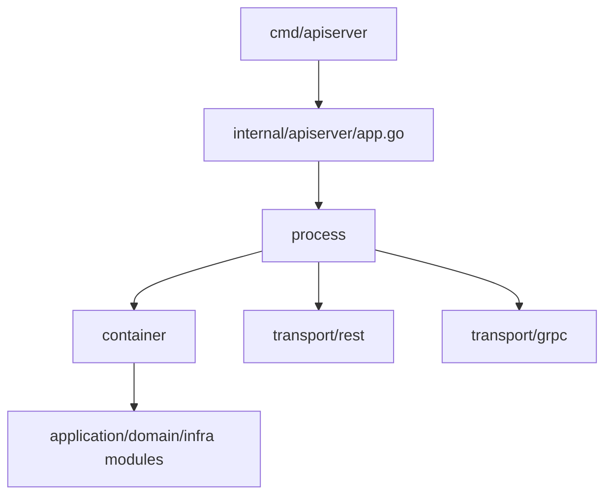

# 01-运行时

## 本目录定位

`01-运行时/` 解释 iam-apiserver 如何启动、装配、注册协议层、运行后台任务并优雅关闭。

业务模块模型不在本目录展开，请阅读 [02-业务模块](../02-业务模块/README.md)。

## 文档结构

| 文档 | 作用 |
| --- | --- |
| [01-服务入口与生命周期.md](01-服务入口与生命周期.md) | 进程入口、启动链路、关闭链路 |
| [02-组合根与依赖装配.md](02-组合根与依赖装配.md) | container 如何装配模块和依赖 |
| [03-REST与gRPC传输层装配.md](03-REST与gRPC传输层装配.md) | REST 路由、gRPC service、middleware/interceptor |
| [04-配置加载与运行模式.md](04-配置加载与运行模式.md) | 配置来源、运行模式、依赖开关 |
| [05-后台任务与优雅关闭.md](05-后台任务与优雅关闭.md) | Outbox、Suggest refresh、scheduler 和 shutdown |
| [06-健康检查与降级启动.md](06-健康检查与降级启动.md) | 健康检查、可选模块、降级启动 |

## 主线

