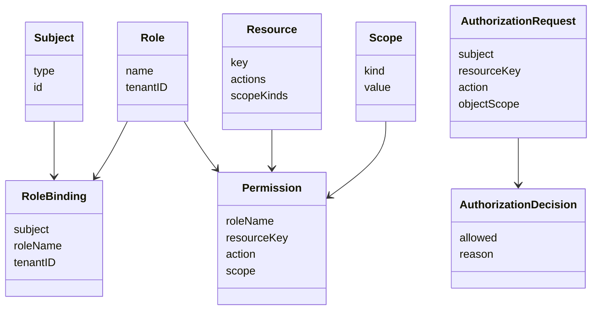
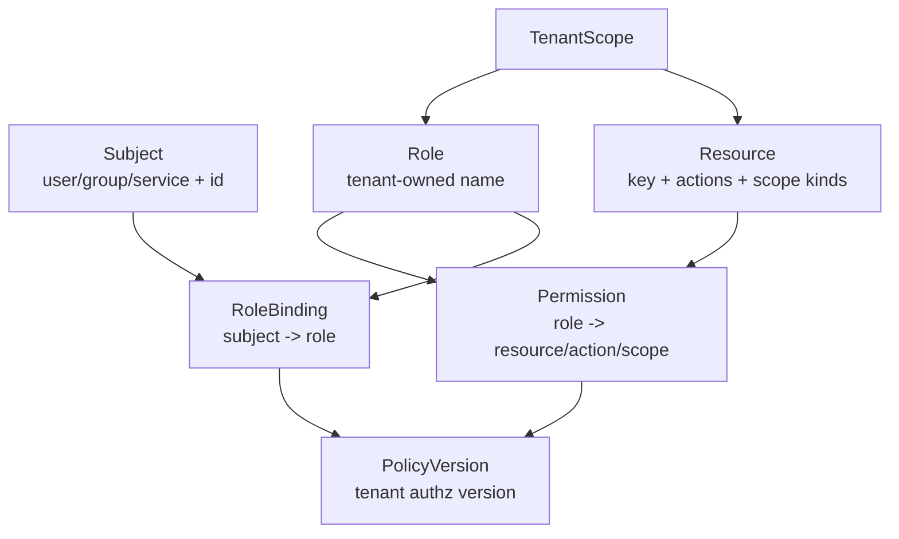
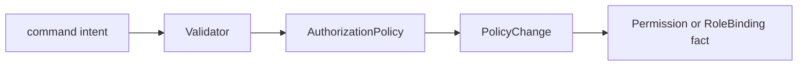
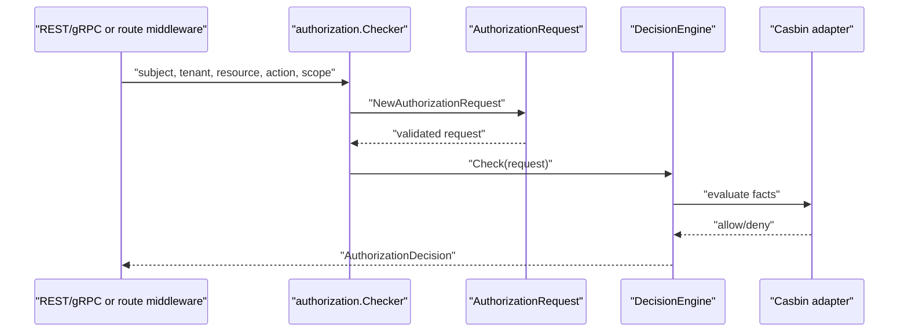
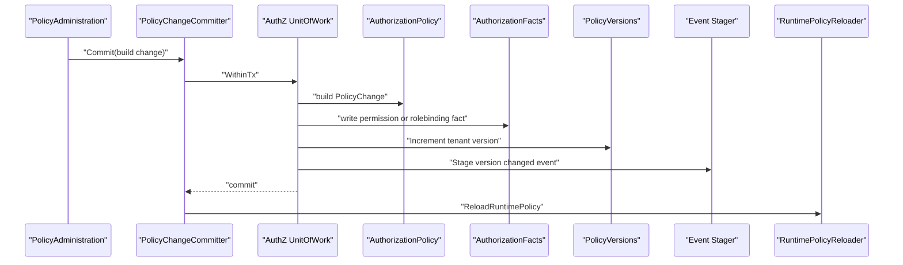
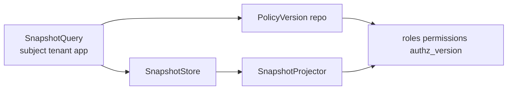

# AuthZ：角色、策略、资源与 Assignment

## 本文回答

本文回答：IAM AuthZ 域如何表达 Subject、Scope、Role、Resource、Permission、RoleBinding、PolicyVersion 和 AuthorizationDecision；为什么公开合同保留 `assignment`，内部实现使用 `rolebinding`；以及授权写操作如何通过 Unit of Work、PolicyChangeCommitter 和 transactional outbox 保持事实与版本事件一致。

## 30 秒结论

- AuthZ 的核心问题有两个：管理授权事实，以及对 subject/resource/action/scope 执行授权判定。
- 公开 REST/proto 使用 `assignment` 作为 wire term；内部 domain/application 以 `rolebinding` 表达“主体持有角色”。
- `Role`、`Resource`、`Permission`、`RoleBinding` 是授权事实；`AuthorizationRequest` 和 `AuthorizationDecision` 是 PDP 判定对象。
- 授权写操作不是直接写一堆表，而是先形成 `PolicyChange`，再由 `PolicyChangeCommitter` 在 UoW 事务内写业务记录、授权事实、版本号和 outbox 事件。
- 授权快照通过 `SnapshotReader` 读取角色、权限和 `authz_version`，再按 `app_name` 投影给接入方。
- Casbin 是运行时决策引擎和事实存储适配，不是业务语言本身；业务语言在 domain/authz 中。

## 主图：AuthZ 概念模型



## 重点速查

| 关注点 | 当前答案 | 代码证据 |
| ---- | ---- | ---- |
| 授权基础模型 | Subject、Scope、Permission、RoleBinding、AuthorizationRequest、AuthorizationDecision。 | [../../internal/apiserver/domain/authz/model.go](../../internal/apiserver/domain/authz/model.go) |
| 角色 | 命名角色，属于 tenant。 | [../../internal/apiserver/domain/authz/role](../../internal/apiserver/domain/authz/role) |
| 资源 | 资源 key、可用 action、scope kind。 | [../../internal/apiserver/domain/authz/resource](../../internal/apiserver/domain/authz/resource) |
| 策略变更 | AuthorizationPolicy 产生 PolicyChange。 | [../../internal/apiserver/domain/authz/policy](../../internal/apiserver/domain/authz/policy) |
| 内部绑定 | rolebinding application/domain。 | [../../internal/apiserver/application/authz/rolebinding](../../internal/apiserver/application/authz/rolebinding)、[../../internal/apiserver/domain/authz/rolebinding](../../internal/apiserver/domain/authz/rolebinding) |
| PDP | Checker 组装 AuthorizationRequest 并调用 DecisionEngine。 | [../../internal/apiserver/application/authz/authorization/service.go](../../internal/apiserver/application/authz/authorization/service.go) |
| 快照 | SnapshotReader 读取角色、权限和版本并按 app 投影。 | [../../internal/apiserver/application/authz/authorization/service.go](../../internal/apiserver/application/authz/authorization/service.go) |
| 事务与事件 | PolicyChangeCommitter 在事务内写 facts、version、outbox event。 | [../../internal/apiserver/application/authz/policy/committer.go](../../internal/apiserver/application/authz/policy/committer.go) |

## 1. 术语：assignment 与 rolebinding

| 名称 | 所在层 | 当前含义 |
| ---- | ---- | ---- |
| `assignment` | REST/proto wire term | 对外接口仍使用的“角色分配”术语。 |
| `rolebinding` | internal domain/application | 主体和角色之间的绑定，是当前代码实现的标准术语。 |
| `authz_assignments` | MySQL schema | 历史表名/存储名，承载 rolebinding 事实。 |

文档写法规则：

- 描述公开 REST/proto 时可以写 `assignment`。
- 描述内部模型、应用服务和代码路径时写 `rolebinding`。
- 不新增 `assignment` internal package 的说法。

## 2. 领域模型与不变量



| 概念 | 业务含义 | 关键规则 |
| ---- | ---- | ---- |
| `Subject` | 被授权主体，可是 user、group、service。 | type 和 id 都不能为空。 |
| `Scope` | 权限覆盖的对象范围。 | 空 scope 归一化为 `all:*`；`origin` 必须有具体值。 |
| `Resource` | 可被保护的资源。 | action 必须在资源 action 集内；scope kind 必须被资源支持。 |
| `Role` | tenant 内命名角色。 | role 属于某个 tenant；跨 tenant 使用会被验证拒绝。 |
| `Permission` | role 对 resource/action/scope 的能力。 | role、tenant、resource、action 都不能为空。 |
| `RoleBinding` | subject 在 tenant 下持有 role。 | subject、role、tenant 必须完整。 |
| `PolicyVersion` | tenant 授权事实版本。 | 写操作递增版本，快照返回版本给接入方。 |

## 3. 领域服务：AuthorizationPolicy 和 Validator



| 领域能力 | 解决的问题 | 落地 |
| ---- | ---- | ---- |
| `AuthorizationPolicy` | 授权变更需要统一产出业务事实和变更意图。 | grant/revoke permission，bind/unbind role。 |
| Role validator | 创建/更新角色时校验名称、tenant ownership、存在性。 | [../../internal/apiserver/domain/authz/role/validator.go](../../internal/apiserver/domain/authz/role/validator.go) |
| Resource validator | 校验资源 key、actions、scope kinds 和存在性。 | [../../internal/apiserver/domain/authz/resource/validator.go](../../internal/apiserver/domain/authz/resource/validator.go) |
| Policy validator | 校验 role/resource/action/scope 组合是否有效。 | [../../internal/apiserver/domain/authz/policy/validator.go](../../internal/apiserver/domain/authz/policy/validator.go) |
| Rolebinding validator | 校验 subject、role、tenant 和绑定存在性。 | [../../internal/apiserver/domain/authz/rolebinding/validator.go](../../internal/apiserver/domain/authz/rolebinding/validator.go) |

Validator 是 Specification 风格的领域服务：它们不负责持久化提交，但会借助 repository 读取必要事实，避免 application command service 重复散落校验规则。

## 4. 应用服务

| 应用服务 | 职责 | 代码入口 |
| ---- | ---- | ---- |
| `RoleCatalog` / `RoleDirectory` | 角色写入与查询。 | [../../internal/apiserver/application/authz/role](../../internal/apiserver/application/authz/role) |
| `ResourceCatalog` / `ResourceDirectory` | 资源写入、查询和 action 校验。 | [../../internal/apiserver/application/authz/resource](../../internal/apiserver/application/authz/resource) |
| `PolicyAdministration` | 权限 grant/revoke 与 role bind/unbind 的统一用例。 | [../../internal/apiserver/application/authz/policy/administration.go](../../internal/apiserver/application/authz/policy/administration.go) |
| `PolicyChangeCommitter` | 授权变更事务模板。 | [../../internal/apiserver/application/authz/policy/committer.go](../../internal/apiserver/application/authz/policy/committer.go) |
| `rolebinding.CommandService` | rolebinding 命令 facade，支撑公开 assignment wire term。 | [../../internal/apiserver/application/authz/rolebinding/command_service.go](../../internal/apiserver/application/authz/rolebinding/command_service.go) |
| `rolebinding.DirectoryService` | rolebinding 查询。 | [../../internal/apiserver/application/authz/rolebinding/directory.go](../../internal/apiserver/application/authz/rolebinding/directory.go) |
| `authorization.Checker` | 单次 PDP 判定应用入口。 | [../../internal/apiserver/application/authz/authorization/service.go](../../internal/apiserver/application/authz/authorization/service.go) |
| `authorization.SnapshotReader` | 授权快照读取和投影。 | [../../internal/apiserver/application/authz/authorization/service.go](../../internal/apiserver/application/authz/authorization/service.go) |

## 5. 授权判定链



判定链的边界：

- Checker 负责把调用方输入变成领域请求。
- DecisionEngine 是端口，当前 runtime 可以由 Casbin-backed engine 实现。
- Domain 不知道 Casbin model.conf，也不依赖数据库。
- HTTP route authorization 使用同一类能力，但路由保护在运行时文档中展开。

## 6. 授权变更事务



`PolicyChangeCommitter` 是 AuthZ 写模型的关键模板：

1. 在事务内构造 `PolicyChange`。
2. 执行可选 before-facts mutation，例如先写 rolebinding 业务记录。
3. 写授权事实。
4. 执行可选 after-facts mutation，例如按 ID 删除记录。
5. 递增 tenant policy version。
6. stage policy version changed event 到 transactional outbox。
7. 事务提交后触发 runtime policy reload。

这解决了“业务记录、授权事实、版本号、事件”分散写入导致不一致的问题。

## 7. 授权快照



授权快照面向接入方缓存和快速判定：

- 输入必须有 subject、tenant、app name。
- 读取 subject 在 tenant 下的 roles 和 permissions。
- 按 `app_name:` 前缀过滤角色与资源。
- 去重后返回 roles、permissions 和 `authz_version`。

它不是写入口，也不是绕过 PDP 的全局权限导出。接入方必须根据版本变化和业务风险选择缓存策略。

## 8. 运行时与契约入口

| 接口面 | 当前能力 |
| ---- | ---- |
| REST | `/api/v2/authz/check`、roles、resources、policies、assignments。 |
| gRPC | `AuthorizationService.Check`、`GetAuthorizationSnapshot`、`GrantAssignment`、`RevokeAssignment`。 |
| Route middleware | `RouteAuthorizationRuntime` 支撑角色/权限/admin 判定。 |
| Event catalog | policy version changed event 以 [../../configs/events.yaml](../../configs/events.yaml) 为准。 |

数据库事实入口包括 [../../configs/mysql/schema.sql](../../configs/mysql/schema.sql) 和 [../../internal/pkg/migration/migrations](../../internal/pkg/migration/migrations)。

## 9. 设计模式

| 模式 | 为什么用 | IAM 中如何落地 | 代价和边界 |
| ---- | ---- | ---- | ---- |
| Policy Object | 授权变更规则需要统一产出业务事实。 | `AuthorizationPolicy` 生成 `PolicyChange`。 | Policy 只表达规则，不提交事务。 |
| Specification/Validator | role/resource/scope/subject 校验会在多个用例重复。 | role/resource/policy/rolebinding validators。 | Validator 需要 repository，注意不要写入状态。 |
| Unit of Work | 授权写入跨多个 repository 和 outbox。 | `authz/uow.UnitOfWork` + `TxRepositories`。 | 事务内不要做外部网络调用。 |
| Template Method | 授权变更流程固定，但各命令的 before/after mutation 不同。 | `PolicyChangeCommitter.Commit` + options。 | 过多 hook 会降低可读性，需保持少量明确扩展点。 |
| Transactional Outbox | 授权版本事件必须和数据库事实一起提交。 | `StagePolicyVersionChanged` 写 outbox。 | 事件异步投递，消费者看到的是最终一致。 |
| Snapshot/Projector | 接入方需要 app 维度快照，而存储是通用授权事实。 | `SnapshotReader` + `SnapshotProjector`。 | 投影只筛选和去重，不改变授权事实。 |
| Adapter | Casbin 是实现细节，不能污染 domain 语言。 | Casbin adapter 实现 facts/decision engine。 | adapter 与模型配置要靠测试保护。 |

## 10. 代码证据与验证

| 关注点 | 路径 |
| ---- | ---- |
| 授权领域模型 | [../../internal/apiserver/domain/authz](../../internal/apiserver/domain/authz) |
| AuthZ 应用服务 | [../../internal/apiserver/application/authz](../../internal/apiserver/application/authz) |
| Casbin adapter | [../../internal/apiserver/infra/casbin](../../internal/apiserver/infra/casbin) |
| Outbox store | [../../internal/apiserver/infra/mysql/eventoutbox](../../internal/apiserver/infra/mysql/eventoutbox) |
| REST 合同 | [../../api/rest/authz.v2.yaml](../../api/rest/authz.v2.yaml) |
| gRPC 合同 | [../../api/grpc/iam/authz/v2/authz.proto](../../api/grpc/iam/authz/v2/authz.proto) |

验证命令：

```bash
go test ./internal/apiserver/domain/authz/... ./internal/apiserver/application/authz/... ./internal/apiserver/infra/casbin ./internal/apiserver/infra/mysql/eventoutbox ./internal/apiserver/transport/rest/authz/... ./internal/apiserver/transport/grpc/service/authz
```
