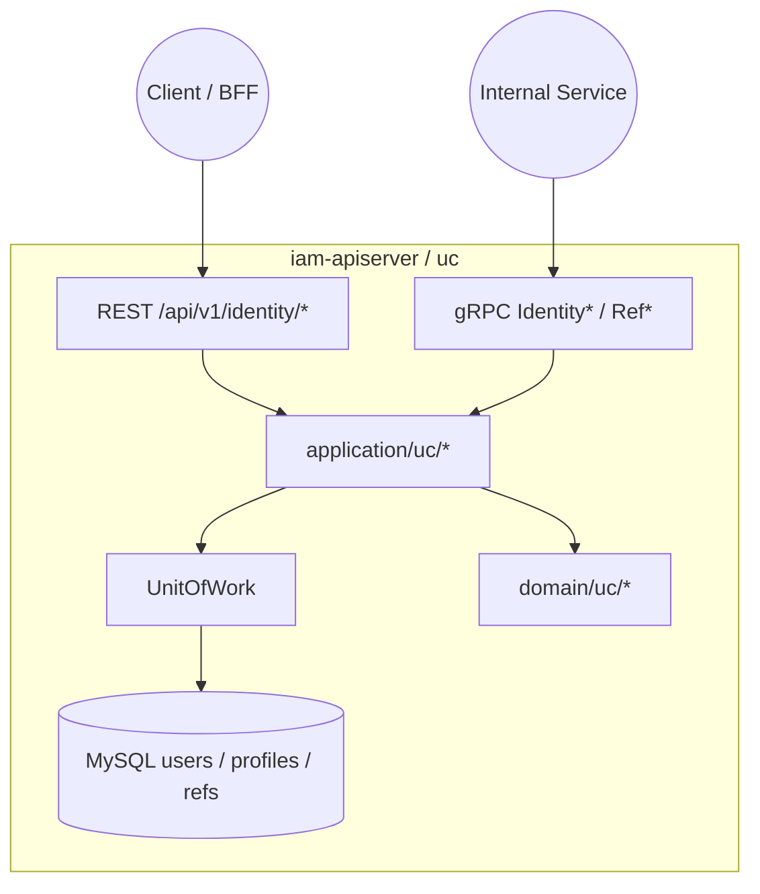
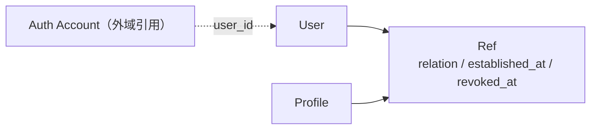
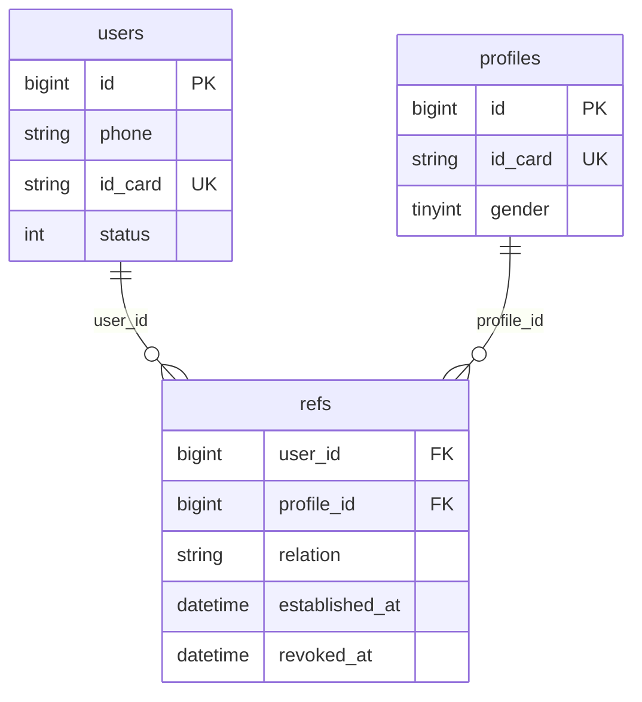
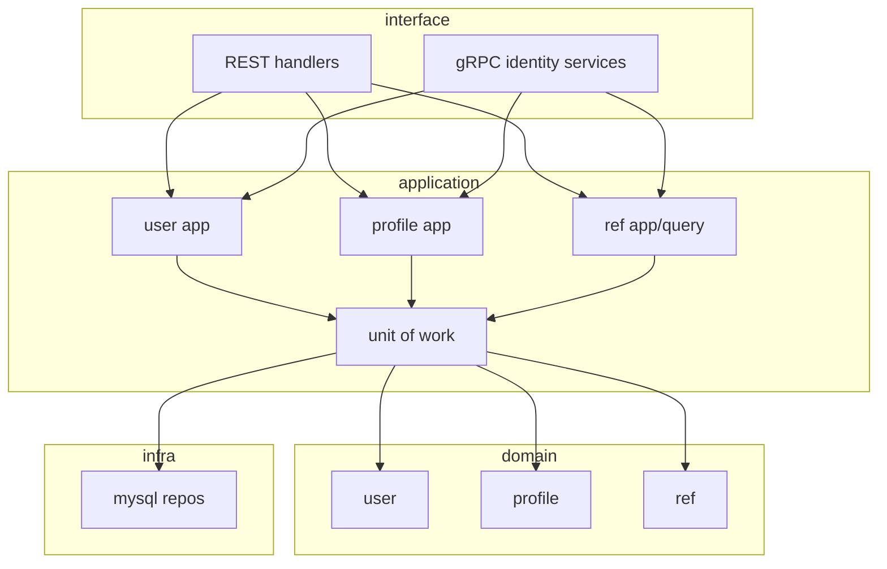
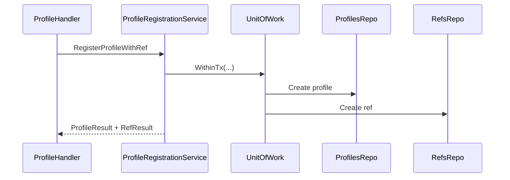

# 用户、儿童、Ref

本文回答：用户域（代码目录 `uc`）今天负责什么、不负责什么；它在 `iam-apiserver` 中如何组织 `User / Profile / Ref` 这组对象；以及当前 REST / gRPC 暴露面、存储与真实代码落点分别是什么。

**阅读维度**：Why = 身份与关系事实；What = `User / Profile / Ref`；Where = `iam-apiserver` 的 `interface/uc`；Verify = [`api/rest/identity.v1.yaml`](../../api/rest/identity.v1.yaml)、[`api/grpc/iam/identity/v1/identity.proto`](../../api/grpc/iam/identity/v1/identity.proto)、[`configs/mysql/schema.sql`](../../configs/mysql/schema.sql) 中 `users / profiles / refs`。

---

## 30 秒了解系统

- 用户域的主问题只有两个：先维护“人”和“儿童”这两类身份对象，再维护“谁和哪个儿童是什么关系”的 `Ref`。
- 模块内最重要的对象是：`User / Profile / Ref`。
- 当前用户域既有 REST，也有 gRPC：REST 偏“当前登录用户上下文”，gRPC 偏“服务间显式传 ID”。
- `profiles/register` 的当前真实写链已经收口为单事务组合用例，是原子闭环。
- 查询与访问控制大多先从 ref 关系出发，再回查 profile 或 user。
- 统一事件清单：见 [`configs/events.yaml`](../../configs/events.yaml)。当前用户域不声明领域事件，对外 identity 合同也不保留事件订阅型 gRPC。

| 主题 | 当前答案 |
| ---- | ---- |
| 核心对象 | `User`、`Profile`、`Ref` |
| 主存储 | `users`、`profiles`、`refs` |
| 典型 REST | `/api/v1/identity/me`、`/me/profiles`、`/profiles/register`、`/refs/grant` |
| 典型 gRPC | `IdentityRead`、`RefQuery`、`RefCommand`、`IdentityLifecycle` |
| 真实契约 | [`api/rest/identity.v1.yaml`](../../api/rest/identity.v1.yaml)、[`api/grpc/iam/identity/v1/identity.proto`](../../api/grpc/iam/identity/v1/identity.proto) |

### 模块边界

#### 负责

- 用户资料与状态维护
- 儿童档案创建、更新、查询
- 用户与儿童之间监护关系的创建、撤销与查询
- 服务间用户/儿童/监护关系读写 RPC

#### 不负责

- 登录、Token、JWKS：见 [01-authn-认证&Token&JWKS.md](./01-authn-认证&Token&JWKS.md)
- 角色、策略、PDP：见 [02-authz-角色&策略&资源&Assignment.md](./02-authz-角色&策略&资源&Assignment.md)
- HTTP JWT 中间件与 gRPC 传输安全：见 [../01-运行时/README.md](../01-运行时/README.md)

#### 依赖

- REST 依赖 `AuthMiddleware` 注入当前用户上下文
- 与 authz 无聚合级依赖
- 与 authn 的耦合主要体现在 `auth_accounts.user_id -> users.id`

### 运行时示意图

`uc` 只运行在 **`iam-apiserver`** 中。

**图意**：用户域没有拆成独立子进程；REST 和 gRPC 共用同一套应用服务、领域模型和 MySQL 存储。

---

## 模型与服务

### 模型关系图

这张图只回答“静态对象如何协作”，不展开建档与查询时序。

**图意**：当前用户域不是“Profile 直接挂在 User 下”，而是通过 `Ref` 这层关系对象把两者连起来。`authn` 通过 `user_id` 引到 `User`，但 `User` 仍属于用户域本体。

### 数据关系（概念 ER）

当前最重要的事实有 3 条：

- `refs.user_id -> users.id`
- `refs.profile_id -> profiles.id`
- `(user_id, profile_id)` 有唯一约束

### 领域模型与领域服务

**限界上下文**：用户域负责维护“谁是谁”“哪个儿童是谁”“谁与哪个儿童有何关系”。它不是认证域，也不是授权域。

| 概念 | 职责 | 与相邻概念的关系 |
| ---- | ---- | ---- |
| `User` | 用户档案与状态锚点 | 可被 `authn` 账户引用 |
| `Profile` | 儿童身份对象与档案字段 | 被 `Ref` 引用 |
| `Ref` | 监护关系对象 | 把 `User` 与 `Profile` 连起来，并记录 `relation / established_at / revoked_at` |

当前 `Ref` 模型已经支持：

- `relation`
- `established_at`
- `revoked_at`

但当前代码里**没有**这些机制：

- 主监护人 / 次监护人
- 邀请码 / 待接受状态
- 最多两个监护人
- 更重的关系规则编排

### 应用服务设计

| 子域 | 命令 / 查询（节选） | 锚点 |
| ---- | ------------------ | ---- |
| User | `UserApplicationService`、`UserProfile`、`UserStatus`、`UserQuery` | [`application/uc/user/`](../../internal/apiserver/application/uc/user/) |
| Profile | `Register`、`Profile`、`ProfileQuery` | [`application/uc/profile/`](../../internal/apiserver/application/uc/profile/) |
| Ref | `AddRef`、`RemoveRef`、`ListProfilesByUserID`、`IsRef` | [`application/uc/ref/`](../../internal/apiserver/application/uc/ref/) |

---

## 核心设计

### 核心对象模型：`Ref` 是关系锚点，不是附属字段

**结论**：当前用户域最关键的设计不是 `User` 或 `Profile` 本身，而是把关系独立建模为 `Ref`。后面的查询、判定、撤销几乎都围绕这张关系表展开。

| 对象 | 当前作用 |
| ---- | ---- |
| `User` | 监护主体、身份锚点 |
| `Profile` | 被监护对象 |
| `Ref` | 关系事实、访问前提、撤销锚点 |

这意味着今天更准确的说法是：

- “我的孩子”不是 `User.profiles` 直接展开
- “能不能看某个 profile”本质上先看 ref 是否存在

### 核心写模型：`profiles/register` 已收口为单事务

**结论**：`profiles/register` 当前已经是一个原子闭环，由组合用例在同一个 `UnitOfWork` 事务内完成 profile + ref 创建。

当前顺序是：

1. 在同一事务里创建 `Profile`
2. 在同一事务里建立 `Ref`
3. 返回聚合后的 profile + ref 响应

**设计边界**：

- 如果第二步失败，`profile` 可能已经落库
- 所以今天不能讲成“注册儿童并授监护已经是单事务闭环”

长链路和风险细节统一看 [../05-专题分析/03-监护关系链路--用户&儿童&Ref 的协作.md](../05-专题分析/03-监护关系链路--用户&儿童&Ref 的协作.md)。

### 核心查询模型：关系查询先于 profile / user 详情查询

**结论**：当前大多数查询和访问控制都先读 ref，再去查 profile 或 user。

| 场景 | 当前主入口 |
| ---- | ---- |
| “我的孩子” | `guardQuery.ListProfilesByUserID(...)` 后再查 profile |
| “我能不能看这个 profile” | `guardQuery.GetByUserIDAndProfileID(...)` |
| “某 user 是否是某 profile 的监护人” | `guardQuery.IsRef(...)` |
| “列出某个 profile 的监护人” | `guardQuery.ListRefsByProfileID(...)` |

所以这组能力今天更像“关系优先的查询模型”，不是单独的 profile 读模型。

### 核心 gRPC 设计：读、写、生命周期拆成 4 个服务

**结论**：gRPC 这层不是一个单一 `IdentityService`，而是按用途拆成 4 个服务。

| Proto 服务 | 当前用途 |
| ---------- | -------- |
| `IdentityRead` | 用户 / 儿童读取 |
| `RefQuery` | 监护关系查询 |
| `RefCommand` | 监护关系写操作 |
| `IdentityLifecycle` | 用户生命周期管理 |

这条拆分本身就是模块设计的一部分，因为它反映了“读 / 写 / 生命周期”三个面向并不完全相同。

### 核心边界：`revoked_at` 支持写模型，但还没统一进入读链和判定链

**结论**：当前写模型支持通过 `revoked_at` 软撤销关系，但 repo 查询和判定入口仍未统一过滤。

| 方法 | 当前是否显式过滤 `revoked_at` |
| ---- | ---- |
| `FindByUserIDAndProfileID` | 是 |
| `FindByUserID` | 是 |
| `FindByProfileID` | 是 |
| `IsRef` | 是 |

这意味着今天更准确的说法是：

- 模型上已经有“撤销关系”
- 公共查询链和判定链默认已经统一收口到 active-only，历史语义要走显式 `IncludingRevoked` 路径

---

## 边界与注意事项

- `GET /identity/refs` 现在已经注册到 router；详见 [../03-接口与集成/04-身份接入与监护关系边界.md](../03-接口与集成/04-身份接入与监护关系边界.md)。
- `profiles/register` 现在已经收口为单事务组合用例；运行时细节统一在专题层继续展开。
- 旧设计稿中的邀请码、主/次监护人、复杂家庭关系规则，都不是当前代码的默认事实。
- 当前 identity proto / SDK / ACL / README 已同步移除未实现但可见的占位 RPC。

---

## 代码锚点索引

| 关注点 | 路径 | 说明 |
| ------ | ---- | ---- |
| 模块装配 | `internal/apiserver/container/assembler/user.go` | `UserModule`、UoW、REST handler、gRPC 聚合 |
| REST 路由 | `internal/apiserver/interface/uc/restful/router.go` | `/api/v1/identity` 路由组 |
| REST profile 写链 | `internal/apiserver/interface/uc/restful/handler/profile.go` | `profiles/register` 单事务组合用例入口 |
| REST ref | `internal/apiserver/interface/uc/restful/handler/ref.go` | `grant` 与 `list` |
| gRPC 聚合 | `internal/apiserver/interface/uc/grpc/identity/service.go` | 4 个服务注册 |
| 领域模型 | `internal/apiserver/domain/uc/` | `user / profile / ref` |
| ref 仓储 | `internal/apiserver/infra/mysql/ref/repo.go` | active-only 默认查询与历史查询分流 |
| 真值契约 | `api/rest/identity.v1.yaml`、`api/grpc/iam/identity/v1/identity.proto` | REST / gRPC 合同 |
