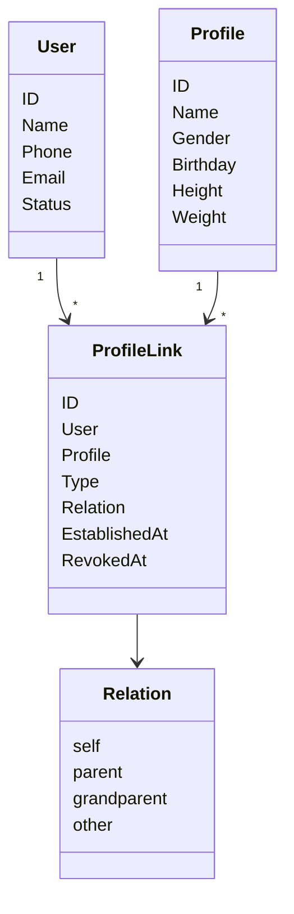
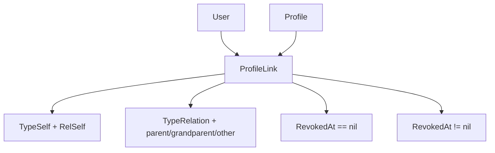
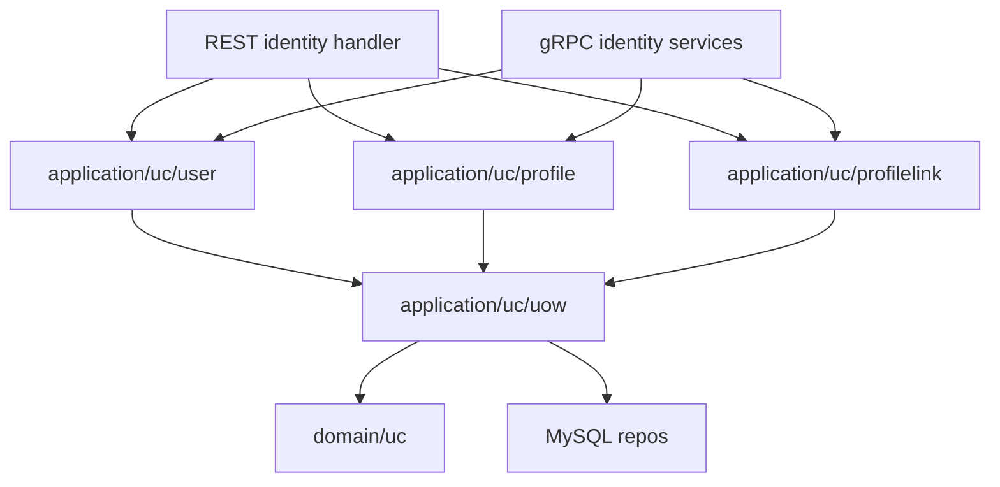
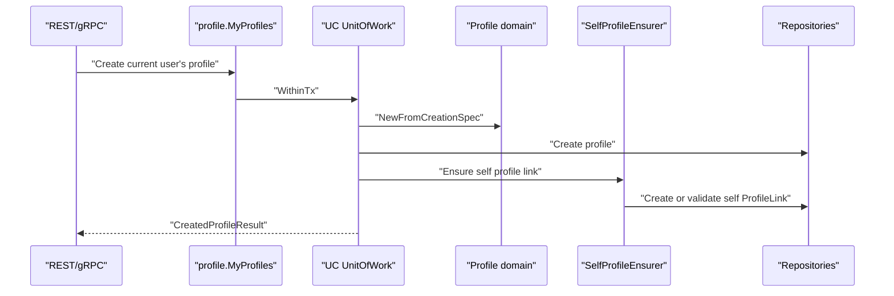
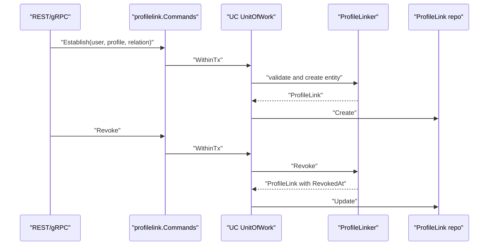

# User、Profile 与 ProfileLink

## 本文回答

本文回答：Identity/UC 域如何表达 User、Profile 和 ProfileLink，如何保证本人档案关系和 active 关系查询边界，为什么 ProfileLink 可承载监护关系语义但不是法律监护判定引擎，以及当前应用服务如何把当前用户视角和系统侧命令分开。

## 30 秒结论

- 当前标准关系模型是 `ProfileLink`，表示 User 与 Profile 之间的档案关系。
- `ProfileLink.Relation` 可表达 self、parent、grandparent、other 等业务语义；`Type` 区分 self 边和普通关系边。
- User、Profile、ProfileLink 都有各自领域模型和服务；跨对象写入由 application/uc 的 Unit of Work 保证事务边界。
- `SelfProfileEnsurer` 用来保证用户自己的 profile 和 self link 不变量；数据库迁移也增加了 active self link guard。
- ProfileLink 默认查询 active 关系；需要包含 revoked 的场景必须调用明确的 including-revoked 能力。
- ProfileLink 不是 AuthZ，也不是法律监护裁定；业务系统需要权限判定时应结合 AuthZ 或业务自己的规则。

## 主图：Identity/UC 领域模型



## 重点速查

| 关注点 | 当前答案 | 代码证据 |
| ---- | ---- | ---- |
| User 领域模型 | 用户资料、联系方式、状态。 | [../../internal/apiserver/domain/uc/user](../../internal/apiserver/domain/uc/user) |
| Profile 领域模型 | 儿童或个人档案字段。 | [../../internal/apiserver/domain/uc/profile](../../internal/apiserver/domain/uc/profile) |
| ProfileLink 领域模型 | User 与 Profile 的档案关系。 | [../../internal/apiserver/domain/uc/profilelink](../../internal/apiserver/domain/uc/profilelink) |
| User 应用服务 | 创建、编辑、状态变更、目录查询。 | [../../internal/apiserver/application/uc/user](../../internal/apiserver/application/uc/user) |
| Profile 应用服务 | 创建、编辑、当前用户 profile 访问、查询。 | [../../internal/apiserver/application/uc/profile](../../internal/apiserver/application/uc/profile) |
| ProfileLink 应用服务 | 系统侧命令、目录查询、当前用户视角关系访问。 | [../../internal/apiserver/application/uc/profilelink](../../internal/apiserver/application/uc/profilelink) |
| UoW | User/Profile/ProfileLink 事务仓库集合。 | [../../internal/apiserver/application/uc/uow/uow.go](../../internal/apiserver/application/uc/uow/uow.go) |
| 合同 | REST Identity 和 gRPC Identity/ProfileLink。 | [../../api/rest/identity.v1.yaml](../../api/rest/identity.v1.yaml)、[../../api/grpc/iam/identity/v1/identity.proto](../../api/grpc/iam/identity/v1/identity.proto) |

## 1. 模块边界

| 边界 | 本域负责 | 本域不负责 |
| ---- | ---- | ---- |
| 用户 | User 创建、查询、资料变更、状态变更。 | 登录凭据、session、token 签发。 |
| 档案 | Profile 创建、查询、资料变更、当前用户档案访问。 | 档案联想索引刷新；这是 Suggest。 |
| 关系 | ProfileLink 建立、撤销、查询、当前用户视角过滤。 | 角色/权限判定；这是 AuthZ。 |
| 自有档案 | 用户 self profile 和 active self link 不变量。 | 法律意义上的监护裁定。 |

## 2. 领域模型与不变量



| 模型 | 关键字段/行为 | 不变量 |
| ---- | ---- | ---- |
| `User` | name、phone、email、id card、status。 | active user 才是可用用户；状态变化会影响 AuthN session。 |
| `Profile` | name、gender、birthday、height、weight、id card。 | 创建和更新时由 validator 校验字段。 |
| `ProfileLink` | user、profile、type、relation、established_at、revoked_at。 | active 关系由 `RevokedAt == nil` 判定；撤销只写 revoked time。 |
| `Relation` | self、parent、grandparent、other。 | self relation 对应 self type；普通关系不能被当成本人档案。 |

active self link guard 由数据库迁移 [../../internal/pkg/migration/migrations/000007_add_active_self_profile_link_guard.up.sql](../../internal/pkg/migration/migrations/000007_add_active_self_profile_link_guard.up.sql) 保护，防止一个用户同时拥有多个 active self profile link。

## 3. 领域服务

| 领域服务 | 解决的问题 | 代码入口 |
| ---- | ---- | ---- |
| `user.Validator` | 用户创建、联系人更新、手机号唯一性。 | [../../internal/apiserver/domain/uc/user/validator.go](../../internal/apiserver/domain/uc/user/validator.go) |
| `user.ProfileEditor` | 用户资料变更规则。 | [../../internal/apiserver/domain/uc/user/profile_editor.go](../../internal/apiserver/domain/uc/user/profile_editor.go) |
| `user.Lifecycler` | 用户激活、停用、封禁。 | [../../internal/apiserver/domain/uc/user/lifecycler.go](../../internal/apiserver/domain/uc/user/lifecycler.go) |
| `profile.Validator` | 档案创建和更新字段校验。 | [../../internal/apiserver/domain/uc/profile/validator.go](../../internal/apiserver/domain/uc/profile/validator.go) |
| `profile.ProfileEditor` | 档案重命名、证件、基础资料、身高体重更新。 | [../../internal/apiserver/domain/uc/profile/editor.go](../../internal/apiserver/domain/uc/profile/editor.go) |
| `ProfileLinker` | 建立/撤销档案关系，校验 user/profile 存在和 active 重复关系。 | [../../internal/apiserver/domain/uc/profilelink/linker.go](../../internal/apiserver/domain/uc/profilelink/linker.go) |
| `SelfProfileEnsurer` | 确保 User 拥有本人 profile 和唯一 active self link。 | [../../internal/apiserver/domain/uc/profilelink/self_profile_ensurer.go](../../internal/apiserver/domain/uc/profilelink/self_profile_ensurer.go) |

ProfileLinker 的边界很重要：它返回要持久化的领域对象，但不直接提交事务。提交由 application 层的 UoW 负责。

## 4. 应用服务



| 应用服务 | 调用者视角 | 职责 |
| ---- | ---- | ---- |
| `user.Creator` | 系统侧 | 创建 User。 |
| `user.Editor` | 系统侧/当前用户资料面 | 修改 User 资料。 |
| `user.StatusChanger` | 系统侧 | 激活、停用、封禁用户，并联动 session。 |
| `user.Directory` | 系统侧 | 按 ID/phone 查询用户。 |
| `profile.Creator` / `Editor` / `Directory` | 系统侧 | Profile 创建、修改和查询。 |
| `profile.MyProfiles` | 当前用户视角 | 创建/查看/修改当前用户可访问的 profile。 |
| `profilelink.Commands` | 系统侧 | 建立、撤销 ProfileLink。 |
| `profilelink.Directory` | 系统侧 | 查询 user/profile 关系，区分 active 与 including-revoked。 |
| `profilelink.MyProfileLinks` | 当前用户视角 | 当前用户 grant/list/revoke 自己相关的 ProfileLink。 |

## 5. 创建本人档案链路



这个流程解决的是“profile 创建成功但本人关系没建立”的一致性问题。当前应用层通过 UoW 把 profile 写入和 self ProfileLink 写入收在同一个事务边界内。

## 6. 建立与撤销 ProfileLink



查询默认行为：

| 查询能力 | 是否包含 revoked |
| ---- | ---- |
| `Get`、`ListProfilesForUser`、`ListLinksForProfile` | 否，只返回 active。 |
| `GetIncludingRevoked`、`ListProfilesForUserIncludingRevoked`、`ListLinksForProfileIncludingRevoked` | 是，调用名显式说明。 |
| `MyProfileLinks.List` | 根据当前用户视角和 DTO 过滤。 |

## 7. REST/gRPC 能力

| 接口面 | 当前能力 |
| ---- | ---- |
| REST `/api/v1/identity/me` | 当前用户资料读取和 patch。 |
| REST `/api/v1/identity/me/profiles` | 当前用户关联 profile。 |
| REST `/api/v1/identity/profiles` | profile 创建、查询、搜索和更新。 |
| REST `/api/v1/identity/profile-links` | ProfileLink 查询、建立和撤销。 |
| gRPC `IdentityRead` | 用户和 profile 读取。 |
| gRPC `ProfileLinkQuery` | HasProfileLink、ListProfiles、ListProfileLinks。 |
| gRPC `ProfileLinkCommand` | Establish、Revoke、BatchRevoke、Import。 |
| gRPC `IdentityLifecycle` | 用户生命周期。 |

运行时 protected routes 和 gRPC 注册在 [../01-运行时](../01-运行时/README.md) 展开。

## 8. 与 AuthN/AuthZ/Suggest 的关系

| 相邻模块 | 关系 |
| ---- | ---- |
| AuthN | AuthN account 通过 user id 关联 User；onboarding 会创建/复用 User 并保证 self ProfileLink。 |
| AuthZ | User 可作为授权 subject；ProfileLink 本身不是权限判定结果。 |
| Suggest | Suggest 从 profile 候选构建读模型，帮助搜索，不写 ProfileLink。 |
| IDP | 外部身份先经 IDP/AuthN 转为账号和用户，再进入 Identity 关系模型。 |

## 9. 设计模式

| 模式 | 为什么用 | IAM 中如何落地 | 代价和边界 |
| ---- | ---- | ---- | ---- |
| Aggregate/Entity | User、Profile、ProfileLink 有各自生命周期和不变量。 | domain/uc 下独立模型和 repository。 | 不强行把 Profile 聚合进 User，避免关系规则耦合。 |
| Domain Service | 建立关系需要同时验证 user/profile/link。 | `ProfileLinker`、`SelfProfileEnsurer`。 | 领域服务不提交事务。 |
| Unit of Work | 创建 profile 与 self link、建立关系和撤销关系需要原子提交。 | `application/uc/uow.UnitOfWork`。 | 应用层负责事务，不把事务泄漏到 domain。 |
| CQRS-lite | 当前用户视角、系统侧命令和目录查询变化原因不同。 | `Commands`、`Directory`、`MyProfileLinks`、`MyProfiles`。 | 接口变多，但权限边界更清晰。 |
| DTO/Mapper | REST/gRPC、应用结果和领域对象字段不同。 | `mapper.go`、DTO/result types。 | 映射层必须跟合同测试一起维护。 |
| Guarded Invariant | self profile link 是强不变量。 | `SelfProfileEnsurer` + DB active self guard。 | 迁移和应用逻辑需共同维护。 |

## 10. 代码证据与验证

| 关注点 | 路径 |
| ---- | ---- |
| UC domain | [../../internal/apiserver/domain/uc](../../internal/apiserver/domain/uc) |
| UC application | [../../internal/apiserver/application/uc](../../internal/apiserver/application/uc) |
| REST Identity | [../../internal/apiserver/transport/rest/identity](../../internal/apiserver/transport/rest/identity) |
| gRPC Identity | [../../internal/apiserver/transport/grpc/service/uc/identity](../../internal/apiserver/transport/grpc/service/uc/identity) |
| REST contract | [../../api/rest/identity.v1.yaml](../../api/rest/identity.v1.yaml) |
| gRPC contract | [../../api/grpc/iam/identity/v1/identity.proto](../../api/grpc/iam/identity/v1/identity.proto) |

验证命令：

```bash
go test ./internal/apiserver/domain/uc/... ./internal/apiserver/application/uc/... ./internal/apiserver/transport/rest/identity/... ./internal/apiserver/transport/grpc/service/uc/identity
```
