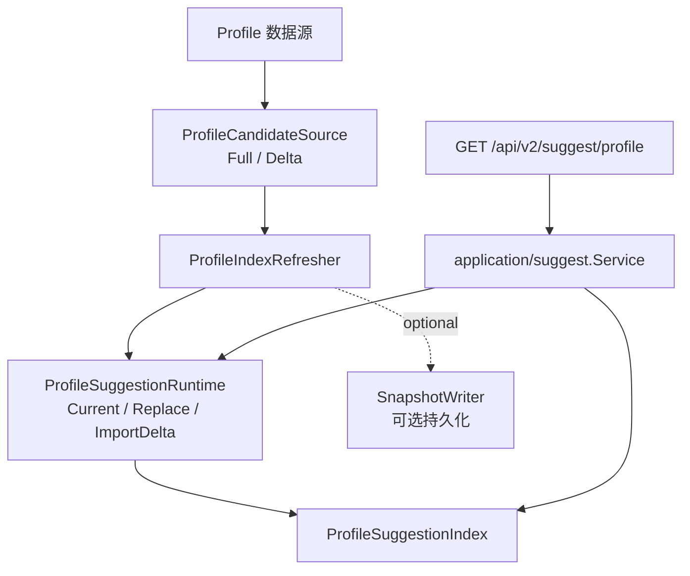
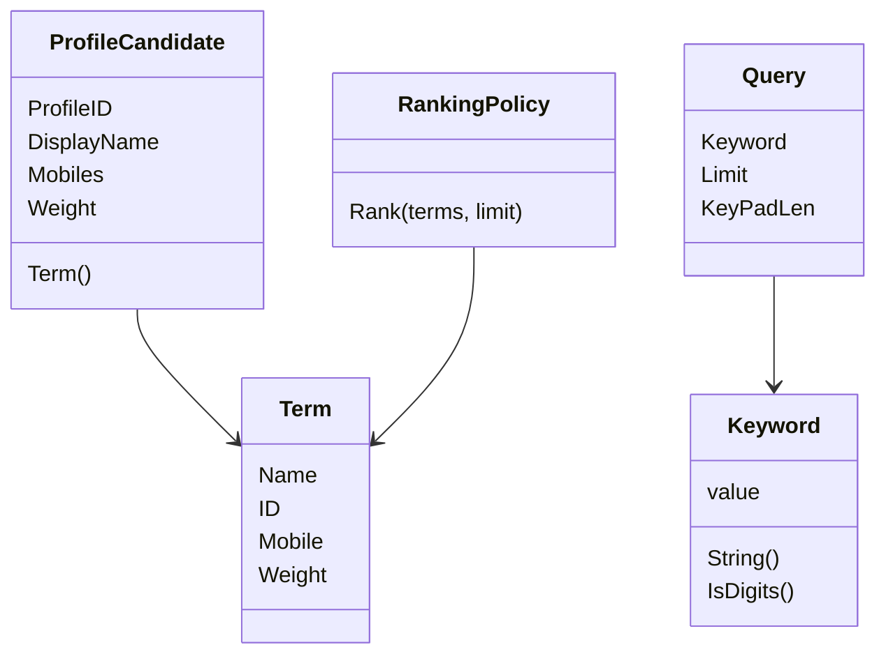
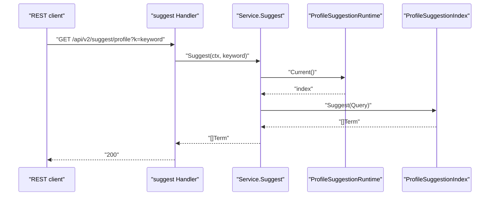
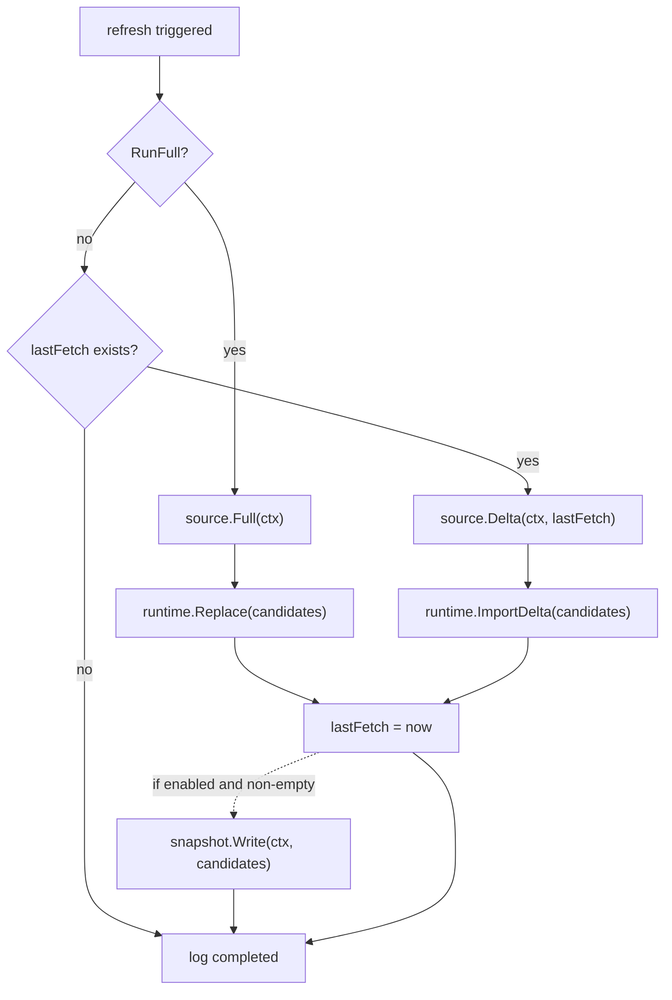

# Suggest：儿童联想搜索

## 本文回答

本文回答：IAM Suggest 域为什么被设计成读侧辅助能力，如何从 Profile 数据构建档案候选索引，查询时怎样表达关键词、限制、排名和去重，以及它为什么不能替代 ProfileLink 写入或 AuthZ 权限判定。

## 30 秒结论

- Suggest 只负责“给当前查询返回候选 profile”，不负责创建 Profile、不负责建立 ProfileLink，也不负责判定访问权限。
- Domain 层用 `ProfileCandidate`、`Term`、`Keyword`、`Query`、`RankingPolicy` 表达候选、查询和排序规则。
- Application 层有两类用例：`Service.Suggest` 是查询用例，`ProfileIndexRefresher` 是索引刷新用例。
- 索引生命周期由 `ProfileSuggestionRuntime` 端口承载；数据来源由 `ProfileCandidateSource` 端口提供；可选 snapshot 写入由 `SnapshotWriter` 端口隔离。
- 查询接口是 `GET /api/v2/suggest/profile?k=...`，REST handler 需要 Auth middleware 和 Suggest service 同时存在才注册。
- 当前默认限制是 `MaxResults=20`、`KeyPadLen=25`，配置入口在 `application/suggest.Config`。

## 主图：Suggest 读模型协作



## 重点速查

| 关注点 | 当前答案 | 代码证据 |
| ---- | ---- | ---- |
| 候选输入 | `ProfileCandidate` 清洗 display name 和 mobile，再转成 `Term`。 | [../../internal/apiserver/domain/suggest/profile.go](../../internal/apiserver/domain/suggest/profile.go) |
| 查询对象 | `Query` 持有 `Keyword`、limit 和 keypad length，并提供默认值。 | [../../internal/apiserver/domain/suggest/profile.go](../../internal/apiserver/domain/suggest/profile.go) |
| 结果项 | `Term` 是 suggest 返回项，包含 name、id、mobile、weight。 | [../../internal/apiserver/domain/suggest/term.go](../../internal/apiserver/domain/suggest/term.go) |
| 排名策略 | `RankingPolicy` 先按 profile id 去重，再按 weight 降序，最后截断 limit。 | [../../internal/apiserver/domain/suggest/profile.go](../../internal/apiserver/domain/suggest/profile.go) |
| 查询应用服务 | `Service.Suggest` 从 runtime 取当前 index，空 runtime/index 返回空结果。 | [../../internal/apiserver/application/suggest/service.go](../../internal/apiserver/application/suggest/service.go) |
| 刷新应用服务 | `ProfileIndexRefresher` 支持 full replace 与 delta import。 | [../../internal/apiserver/application/suggest/refresher.go](../../internal/apiserver/application/suggest/refresher.go) |
| 端口 | 数据源、索引、运行时、snapshot 都通过 application ports 抽象。 | [../../internal/apiserver/application/suggest/ports.go](../../internal/apiserver/application/suggest/ports.go) |
| 合同 | REST `GET /api/v2/suggest/profile`，参数 `k` 必填。 | [../../api/rest/suggest.v2.yaml](../../api/rest/suggest.v2.yaml)、[../../internal/apiserver/transport/rest/suggest/handler.go](../../internal/apiserver/transport/rest/suggest/handler.go) |

## 1. 模块边界

| 边界 | Suggest 负责 | Suggest 不负责 |
| ---- | ---- | ---- |
| 数据写入 | 从候选源读取 ProfileCandidate，刷新读模型。 | 创建、编辑、删除 Profile。 |
| 关系写入 | 返回可被选择的候选 profile。 | 建立、撤销、审核 ProfileLink。 |
| 权限 | REST 层要求已认证用户才能访问 suggest route。 | 判定用户是否有权访问某个 profile 的业务权限。 |
| 查询体验 | 关键词归一、数字关键词识别、候选排序和去重。 | 搜索引擎级全文检索、复杂解释分数、跨域授权投影。 |

这个边界很重要：Suggest 是“帮助用户找到可能的儿童档案”，不是“证明这个用户可以管理该档案”。建立档案关系仍应走 Identity/ProfileLink；需要资源级权限时走 AuthZ。

## 2. 领域模型



### ProfileCandidate

`ProfileCandidate` 是索引的领域输入，不是数据库行的直接镜像。它保留 Profile ID、展示名、手机号集合和权重，并在 `NewProfileCandidate` 中完成最基础的数据清洗：

- 去掉空手机号。
- trim display name 和 mobile。
- 用 `Term()` 把多个手机号折叠成返回项需要的 mobile 字符串。

这样做的原因是 Suggest 的领域规则关注“候选能否进入联想索引”，而不是 Profile 聚合的完整生命周期。候选输入越窄，Suggest 越不容易越界修改 Profile 模型。

### Keyword 与 Query

`Keyword` 封装一次查询关键字，并提供 `IsDigits()`。这让“数字关键词可以走手机号/ID 精确匹配，非数字关键词走前缀联想”的分支成为领域概念，而不是散落在 handler 或 infra index 中的字符串判断。

`Query` 负责把一次查询的业务参数放在一起：

- `Keyword`：用户输入。
- `Limit`：最大结果数，默认 `20`。
- `KeyPadLen`：keypad 索引相关长度，默认 `25`。

默认值放在 domain 中，是因为这些值是 suggest 体验规则的一部分；application config 只负责让部署侧覆盖它们。

### Term 与 RankingPolicy

`Term` 是当前 REST 合同暴露的结果项。它只有 name、id、mobile、weight，避免把 Profile 的完整字段误暴露给联想接口。

`RankingPolicy` 做两件事：

1. 按 `Term.ID` 去重，避免同一 profile 因多个手机号或多条索引项重复出现。
2. 按 `Weight` 降序排序，再按 limit 截断。

这不是通用搜索排序引擎，而是一个小而明确的领域策略对象。它让排序规则可以被测试和替换，同时保持当前实现足够轻。

## 3. 应用服务

### 查询用例：Service.Suggest



`Service.Suggest` 的职责很窄：按配置构造 `Query`，从 runtime 拿当前 index，调用 index 查询。它刻意不关心索引结构、候选来源、快照格式和存储细节。

空依赖的语义也很明确：

- service 为 nil、runtime 为 nil、当前 index 为 nil 时返回 nil。
- handler 会把 nil list 规范成空数组返回。

这种行为让 suggest 在启动或降级场景下不会把查询能力伪装成写入能力，也不会把索引缺失误判成 Profile 不存在。

### 刷新用例：ProfileIndexRefresher



`RunFull` 和 `RunDelta` 对应两种维护读模型的方式：

- `RunFull`：完整读取候选，替换当前索引，并记录 `lastFetch`。
- `RunDelta`：只有在已有 `lastFetch` 后才读取增量；没有候选时直接返回；runtime 缺失时显式报错。

可选 snapshot 的写入失败只记录 warning，不回滚已经完成的 runtime refresh。这是一个刻意的边界：snapshot 是基础设施恢复/观测辅助，不是联想查询正确性的主事实源。

## 4. REST 合同与注册

| 路由 | 认证 | 参数 | 返回 |
| ---- | ---- | ---- | ---- |
| `GET /api/v2/suggest/profile` | Bearer JWT | query `k` 必填 | `[]Term`，按权重降序并去重 |

注册事实在 [../../internal/apiserver/transport/rest/suggest/handler.go](../../internal/apiserver/transport/rest/suggest/handler.go)：

- engine、service、auth middleware 任一缺失时不注册 route。
- route group 是 `/api/v2/suggest`。
- handler 只做参数绑定、调用应用服务和响应规范化。

这符合运行时文档中的 fail-closed 原则：protected route 的认证依赖不可用时，宁可不注册，也不开放一个未受保护的 suggest 查询面。

## 5. 设计模式

| 模式 | 为什么用 | 解决的问题 | IAM 落地 | 代价和边界 |
| ---- | ---- | ---- | ---- | ---- |
| Read Model | 联想搜索是读侧体验优化，不应污染 Profile 写模型。 | 写模型和搜索查询需求不同步、字段需求不同。 | `ProfileCandidate`、`Term`、`ProfileSuggestionIndex`。 | 需要刷新机制；读模型可能短暂落后。 |
| Repository/Port | 候选来源和索引实现不应被应用服务绑定。 | 替换 SQL、内存索引、持久化索引时减少改动。 | `ProfileCandidateSource`、`ProfileSuggestionRuntime`、`SnapshotWriter`。 | 端口过多会增加理解成本，所以都保持窄接口。 |
| Policy Object | 排名去重是业务策略，不该散在 index 实现里。 | 排序规则难测试、重复实现。 | `RankingPolicy.Rank`。 | 当前策略较简单，不能承诺复杂搜索解释能力。 |
| Null/Empty Boundary | 索引缺失时不让查询路径 panic。 | 启动或降级阶段的空依赖风险。 | `Service.Suggest` 对 nil runtime/index 返回 nil，handler 输出空数组。 | 需要监控配合，否则空结果可能掩盖索引未初始化。 |
| Snapshot | 允许把刷新候选保存为基础设施格式。 | 索引恢复、问题定位和离线分析。 | `SnapshotWriter` 是可选端口。 | snapshot 不是主事实源，写入失败只告警。 |

## 6. 代码证据与验证

核心代码：

- Domain：[../../internal/apiserver/domain/suggest](../../internal/apiserver/domain/suggest)
- Application：[../../internal/apiserver/application/suggest](../../internal/apiserver/application/suggest)
- REST handler：[../../internal/apiserver/transport/rest/suggest/handler.go](../../internal/apiserver/transport/rest/suggest/handler.go)
- REST contract：[../../api/rest/suggest.v2.yaml](../../api/rest/suggest.v2.yaml)

建议验证：

```bash
go test ./internal/apiserver/domain/suggest ./internal/apiserver/application/suggest ./internal/apiserver/transport/rest/suggest
```
