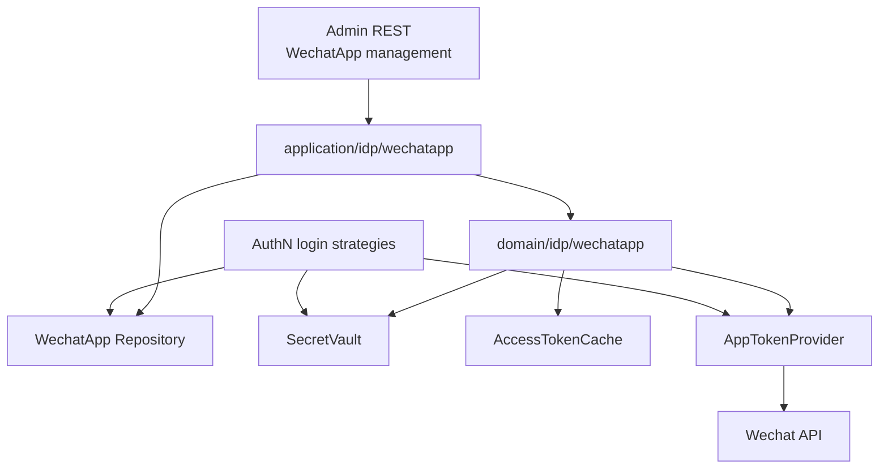
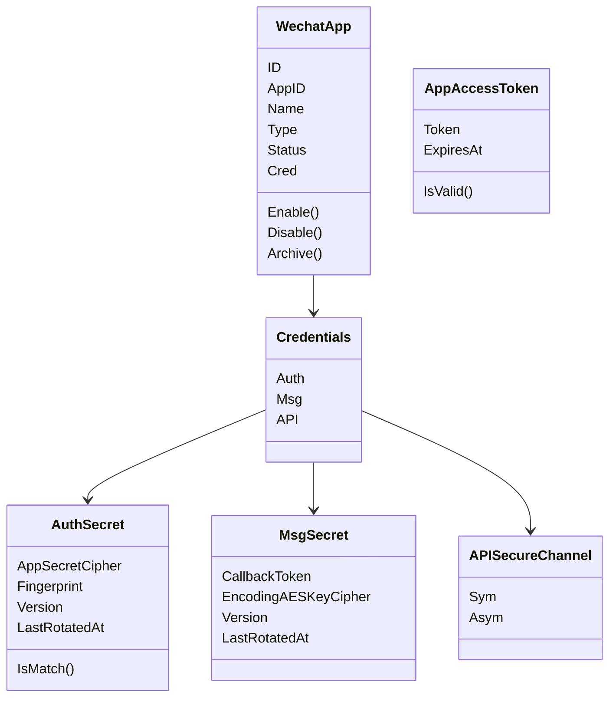
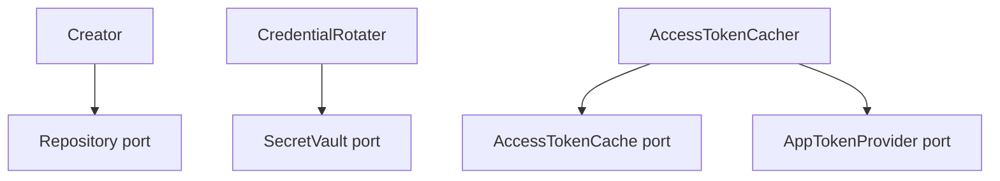
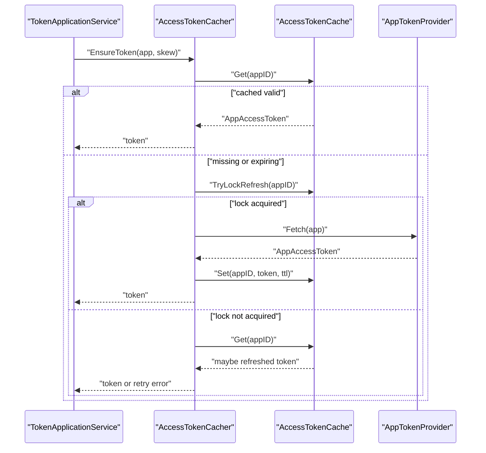
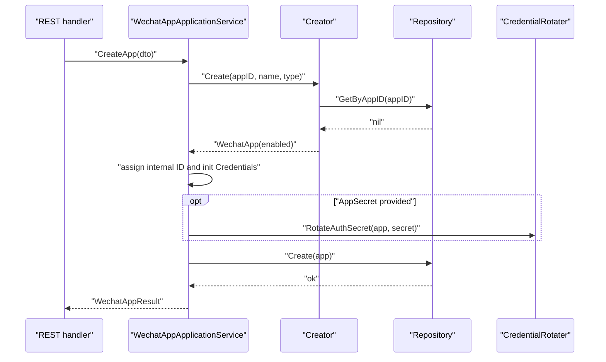
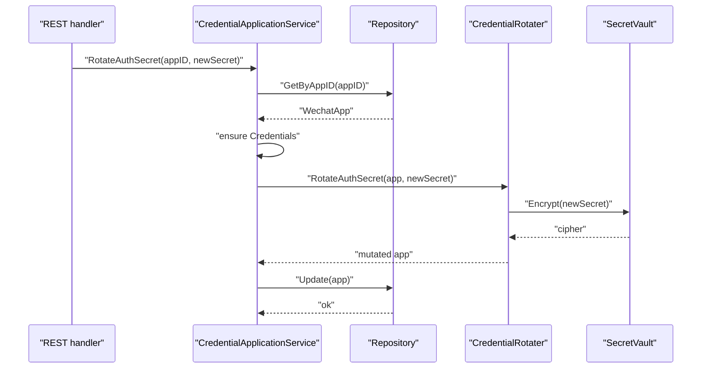
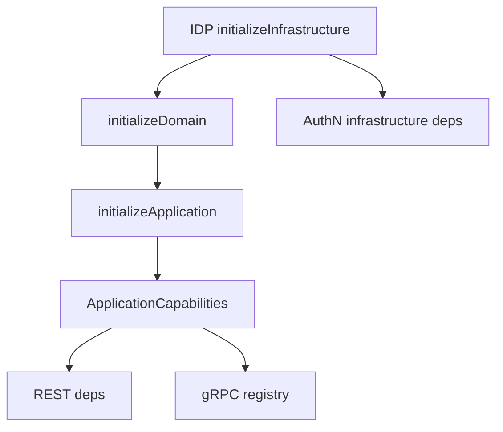

# IDP：微信应用与外部身份

## 本文回答

本文回答：IAM IDP 域如何管理微信应用、密钥和 access token；为什么它属于业务域但不负责最终登录签发；它如何通过领域服务、应用服务和基础设施端口支撑 AuthN 的外部身份登录能力。

## 30 秒结论

- IDP 当前主模型是 `WechatApp`，负责保存微信应用 ID、名称、类型、状态和凭据集合。
- 领域层负责应用创建、状态变更、密钥轮换和 access token cache-aside 策略；应用层负责 DTO、仓储调用、错误转换和持久化编排。
- `AuthSecret` 用于微信登录/换 token 场景；`MsgSecret` 用于消息推送安全模式；`APISecureChannel` 是接口层安全能力的领域占位，但当前 API 对称/非对称轮换方法是空实现，不应写成已完成能力。
- `SecretVault`、`AccessTokenCache`、`AppTokenProvider` 是被驱动端口，基础设施层提供加密、缓存和微信 API 调用能力。
- AuthN 依赖 IDP 提供微信应用查询、secret 解密和微信认证基础能力；登录后的账户、session、token 签发仍由 AuthN 负责。
- REST 管理面在 `/api/v2/idp/wechat-apps` 下，gRPC 当前只注册 `IDPService.GetWechatApp`。

## 主图：IDP 与 AuthN 的关系



IDP 的边界不是“完成登录”，而是“管理外部身份提供者所需的应用配置和访问凭据”。AuthN 调用这些能力换取外部身份结果，再进入 IAM 自己的 Account、Credential、Session 和 Token 流程。

## 重点速查

| 关注点 | 当前答案 | 代码证据 |
| ---- | ---- | ---- |
| 微信应用实体 | `WechatApp` 持有 ID、AppID、Name、Type、Status、Cred。 | [../../internal/apiserver/domain/idp/wechatapp/wechatapp.go](../../internal/apiserver/domain/idp/wechatapp/wechatapp.go) |
| 应用类型与状态 | 类型是 `MiniProgram`、`MP`；状态是 `Enabled`、`Disabled`、`Archived`。 | [../../internal/apiserver/domain/idp/wechatapp/types.go](../../internal/apiserver/domain/idp/wechatapp/types.go) |
| 凭据模型 | `Credentials` 聚合 Auth、Msg、API 三类凭据。 | [../../internal/apiserver/domain/idp/wechatapp/credential.go](../../internal/apiserver/domain/idp/wechatapp/credential.go) |
| 创建领域服务 | `Creator.Create` 校验参数、检查 appID 唯一性、默认 enabled。 | [../../internal/apiserver/domain/idp/wechatapp/creator.go](../../internal/apiserver/domain/idp/wechatapp/creator.go) |
| 凭据轮换 | `CredentialRotater` 加密保存 secret、维护 fingerprint、version、rotated time。 | [../../internal/apiserver/domain/idp/wechatapp/rotater.go](../../internal/apiserver/domain/idp/wechatapp/rotater.go) |
| access token 缓存 | `AccessTokenCacher` 读缓存、抢刷新锁、调用 provider、写 TTL。 | [../../internal/apiserver/domain/idp/wechatapp/accesstoken-cacher.go](../../internal/apiserver/domain/idp/wechatapp/accesstoken-cacher.go) |
| 应用服务 | 管理服务、凭据服务、token 服务三组接口。 | [../../internal/apiserver/application/idp/wechatapp/services.go](../../internal/apiserver/application/idp/wechatapp/services.go) |
| 容器装配 | IDPModule 初始化 infra、domain、application，并向 AuthN 暴露依赖。 | [../../internal/apiserver/container/assembler/idp.go](../../internal/apiserver/container/assembler/idp.go)、[../../internal/apiserver/container/assembler/idp_domain_builder.go](../../internal/apiserver/container/assembler/idp_domain_builder.go) |
| 合同 | REST WechatApp 管理；gRPC `IDPService.GetWechatApp`。 | [../../api/rest/idp.v2.yaml](../../api/rest/idp.v2.yaml)、[../../api/grpc/iam/idp/v2/idp.proto](../../api/grpc/iam/idp/v2/idp.proto) |

## 1. 领域模型



### WechatApp

`WechatApp` 是 IDP 的聚合根。它只暴露最基本的状态行为：

- `Enable()`：启用应用。
- `Disable()`：禁用应用。
- `Archive()`：归档应用。
- `IsEnabled()`、`IsDisabled()`、`IsArchived()`：状态查询。

应用创建由 `Creator` 领域服务完成，而不是让应用服务直接拼对象。原因是创建规则包含业务不变量：appID、name、appType 都不能为空，appID 必须唯一，新建应用默认 enabled。

### Credentials

`Credentials` 把不同使用场景的 secret 分开：

| 凭据 | 业务用途 | 当前字段 |
| ---- | ---- | ---- |
| `AuthSecret` | 微信登录、换取 access token 所需 AppSecret。 | 密文、fingerprint、version、last rotated time。 |
| `MsgSecret` | 微信消息推送安全模式。 | callback token、encoding AES key 密文、version、last rotated time。 |
| `APISecureChannel` | 接口层对称加密/非对称签名能力。 | Sym/Asym key 结构。 |

`AuthSecret` 存 fingerprint 是为了解决两个问题：

1. 不保存明文 secret。
2. 轮换时可以判断新 secret 是否与当前 secret 相同，从而保持幂等。

fingerprint 使用 SHA-256；真正的 secret 密文由 `SecretVault` 端口负责加密和解密。

### AppAccessToken

`AppAccessToken` 只表达 token 字符串和过期时间，`IsValid(now, skew)` 用“提前刷新窗口”判断 token 是否仍可用。这个规则必须靠近 access token 模型，因为它是缓存策略的业务前提，而不是 Redis 特有逻辑。

## 2. 领域服务



### Creator

`Creator.Create` 负责新建应用的业务规则：

- `appID`、`name`、`appType` 不能为空。
- `appID` 不能重复。
- 新应用默认 `Enabled`。

它依赖 `Repository` 查询唯一性，但不负责分配内部 ID，也不负责持久化。这两个动作在应用服务中完成，因为它们属于用例编排和事务边界。

### CredentialRotater

`CredentialRotater` 是 IDP 最重要的领域服务之一。它解决的问题是：secret 轮换既要有业务校验，也要有安全存储，还要保持可审计的版本信息。

`RotateAuthSecret` 当前规则：

- app 不能为空。
- secret 去空后不能为空，且长度至少 16。
- archived 应用不允许改凭据。
- fingerprint 相同则幂等返回。
- 必须有 `SecretVault`。
- 加密密文、更新 fingerprint、递增 version、记录 last rotated time。

`RotateMsgAESKey` 当前规则：

- app 不能为空。
- encoding AES key 必须是 43 位。
- archived 应用不允许改凭据。
- 必须有 `SecretVault`。
- 加密密文、保存 callback token、递增 version、记录 last rotated time。

`RotateAPISymKey` 和 `RotateAPIAsymKey` 目前是空实现。文档和接入方不能把它们理解为已完成的 API key 轮换能力。

### AccessTokenCacher

`AccessTokenCacher.EnsureToken` 是一个 cache-aside + refresh lock 的领域服务：



这里的设计重点不是“缓存 Redis 值”，而是避免多个进程或请求同时刷新同一个微信 access token，并用 `refreshSkew` 提前避开临界过期窗口。

## 3. 应用服务

应用层拆成三组接口，避免一个服务同时承担管理、密钥和 token 全部用例：

| 应用服务 | 用例 | 代码 |
| ---- | ---- | ---- |
| `WechatAppApplicationService` | create/get/list/update/enable/disable。 | [../../internal/apiserver/application/idp/wechatapp/services_impl.go](../../internal/apiserver/application/idp/wechatapp/services_impl.go) |
| `WechatAppCredentialApplicationService` | rotate auth secret、rotate msg secret。 | [../../internal/apiserver/application/idp/wechatapp/services_impl.go](../../internal/apiserver/application/idp/wechatapp/services_impl.go) |
| `WechatAppTokenApplicationService` | get access token、force refresh access token。 | [../../internal/apiserver/application/idp/wechatapp/services_impl.go](../../internal/apiserver/application/idp/wechatapp/services_impl.go) |

### 创建应用流程



应用服务承担这些编排职责：

- 分配内部 ID。
- 初始化 `Credentials`。
- 可选设置 AppSecret。
- 调用 repository 持久化。
- 转换为结果 DTO。

它不直接加密 secret，也不直接调用微信 API；这些都通过领域服务和端口完成。

### 密钥轮换流程



这个流程把安全敏感动作集中在领域服务和 vault port，避免 handler 或应用服务直接处理密文结构。

### Token 获取与强制刷新

`GetAccessToken`：

1. 根据 appID 查询 `WechatApp`。
2. 调用 `AccessTokenCacher.EnsureToken`。
3. 返回 token 字符串。

`RefreshAccessToken`：

1. 根据 appID 查询 `WechatApp`。
2. 直接调用 `AppTokenProvider.Fetch` 获取新 token。
3. 按 token 过期时间计算 TTL，至少 60 秒。
4. 写入 `AccessTokenCache`。

这两个用例的区别是：前者优先复用缓存，后者明确表达“强制刷新”意图。

## 4. container 装配与跨模块依赖



`IDPModule.InitializeWithDeps` 的依赖要求很明确：

- DB 必须存在。
- Redis client 必须存在。
- encryption key 必须是 32 字节。

这说明 IDP 当前不是“可无缓存运行的纯配置模块”。它需要数据库保存 WechatApp，需要 Redis 支撑 access token cache，也需要加密密钥保护 AppSecret。

对外暴露的能力包括：

- `Repository()`：供 AuthN 读取微信应用配置。
- `SecretVault()`：供 AuthN 解密 AppSecret。
- `WechatAuthProvider()`：供 AuthN 调用微信认证基础能力。
- `ApplicationCapabilities()`：供 REST/gRPC 注册 handler/service。
- `CacheFamilyInspectors()`：供缓存治理读侧展示 IDP 相关缓存族。

## 5. REST 与 gRPC 合同

### REST 管理面

| 路由 | 用途 | 应用服务 |
| ---- | ---- | ---- |
| `GET /api/v2/idp/wechat-apps` | 查询微信应用列表。 | `WechatAppApplicationService.ListApps` |
| `POST /api/v2/idp/wechat-apps` | 创建微信应用。 | `WechatAppApplicationService.CreateApp` |
| `GET /api/v2/idp/wechat-apps/{app_id}` | 查询单个微信应用。 | `WechatAppApplicationService.GetApp` |
| `PATCH /api/v2/idp/wechat-apps/{app_id}` | 更新名称或类型。 | `WechatAppApplicationService.UpdateApp` |
| `POST /api/v2/idp/wechat-apps/{app_id}/enable` | 启用应用。 | `WechatAppApplicationService.EnableApp` |
| `POST /api/v2/idp/wechat-apps/{app_id}/disable` | 禁用应用。 | `WechatAppApplicationService.DisableApp` |
| `GET /api/v2/idp/wechat-apps/{app_id}/access-token` | 获取 access token。 | `WechatAppTokenApplicationService.GetAccessToken` |
| `POST /api/v2/idp/wechat-apps/refresh-access-token` | 强制刷新 access token。 | `WechatAppTokenApplicationService.RefreshAccessToken` |
| `POST /api/v2/idp/wechat-apps/rotate-auth-secret` | 轮换 AppSecret。 | `WechatAppCredentialApplicationService.RotateAuthSecret` |
| `POST /api/v2/idp/wechat-apps/rotate-msg-secret` | 轮换消息密钥。 | `WechatAppCredentialApplicationService.RotateMsgSecret` |

REST 注册在 [../../internal/apiserver/transport/rest/idp/router.go](../../internal/apiserver/transport/rest/idp/router.go)。管理路由需要 admin middlewares；如果 WechatApp handler 缺失，只保留 IDP health route；如果 admin middlewares 缺失，则不注册微信应用管理路由。

### gRPC 服务

当前 gRPC 合同只有：

| Service | RPC | 用途 |
| ---- | ---- | ---- |
| `IDPService` | `GetWechatApp` | 按 app_id 查询微信应用。 |

实现位于 [../../internal/apiserver/transport/grpc/service/idp](../../internal/apiserver/transport/grpc/service/idp)。当前 gRPC 实现会直接读取 repository，并在 secret vault 存在时解密 `app_secret` 写入 proto 响应。这是现有合同事实；新增调用方应按最小权限和 gRPC ACL 约束来使用。

## 6. 设计模式

| 模式 | 为什么用 | 解决的问题 | IAM 落地 | 代价和边界 |
| ---- | ---- | ---- | ---- | ---- |
| Aggregate Root | 微信应用、凭据和状态需要一致表达。 | 避免 secret、status、appID 分散在多个无约束结构中。 | `WechatApp` 持有 `Credentials` 和状态行为。 | 当前聚合较轻，复杂事务仍由应用服务和 repository 管。 |
| Domain Service | 创建、轮换、token 缓存都不是单个值对象能完成的行为。 | 避免应用服务直接塞满业务规则。 | `Creator`、`CredentialRotater`、`AccessTokenCacher`。 | 领域服务依赖端口，测试时需要 fake。 |
| Repository | 存储细节不应进入领域模型。 | MySQL schema 与业务对象解耦。 | `Repository` interface。 | 查询能力受接口限制，复杂报表不应硬塞进聚合仓储。 |
| Secret Vault Port | secret 加密、解密、签名属于基础设施能力。 | 防止业务层直接依赖具体 KMS 或本地加密实现。 | `SecretVault`。 | 需要严格管理 vault 实现和密钥。 |
| Cache Aside | 微信 access token 有过期时间且外部获取成本高。 | 减少外部 API 调用，避开临界过期窗口。 | `AccessTokenCacher.EnsureToken`。 | 缓存可能短暂不一致，需要 refresh lock 和 TTL 策略。 |
| Single Flight Lock | 多请求同时刷新同一 token 会放大外部依赖压力。 | 防止刷新风暴。 | `AccessTokenCache.TryLockRefresh`。 | 锁失败时调用方可能收到重试错误。 |
| DTO/Mapper | REST/gRPC 术语和 domain 术语需要隔离。 | 防止 wire 字段渗入领域模型。 | request/response DTO、`toWechatAppResult`、proto mapper。 | Mapper 需要随合同维护。 |

## 7. 代码证据与验证

核心代码：

- Domain：[../../internal/apiserver/domain/idp/wechatapp](../../internal/apiserver/domain/idp/wechatapp)
- Application：[../../internal/apiserver/application/idp/wechatapp](../../internal/apiserver/application/idp/wechatapp)
- Container assembler：[../../internal/apiserver/container/assembler/idp.go](../../internal/apiserver/container/assembler/idp.go)
- REST：[../../internal/apiserver/transport/rest/idp](../../internal/apiserver/transport/rest/idp)
- gRPC：[../../internal/apiserver/transport/grpc/service/idp](../../internal/apiserver/transport/grpc/service/idp)
- Contracts：[../../api/rest/idp.v2.yaml](../../api/rest/idp.v2.yaml)、[../../api/grpc/iam/idp/v2/idp.proto](../../api/grpc/iam/idp/v2/idp.proto)

建议验证：

```bash
go test ./internal/apiserver/domain/idp/... ./internal/apiserver/application/idp/... ./internal/apiserver/container/assembler ./internal/apiserver/transport/rest/idp ./internal/apiserver/transport/grpc/service/idp
```
