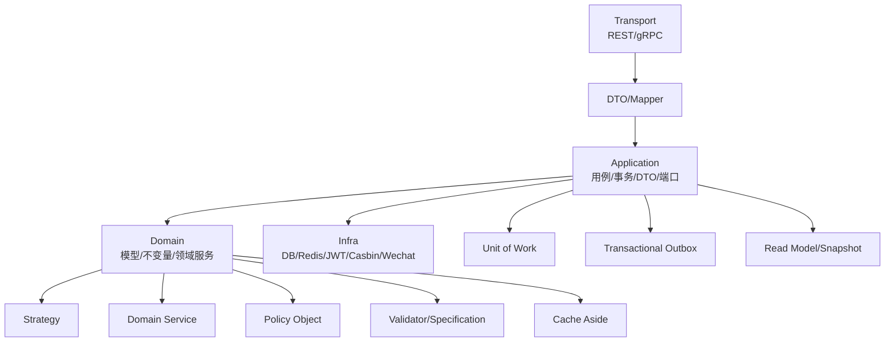
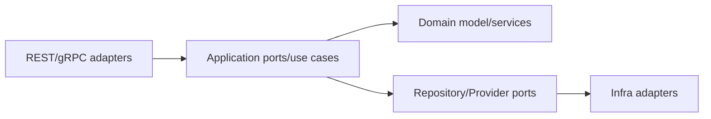
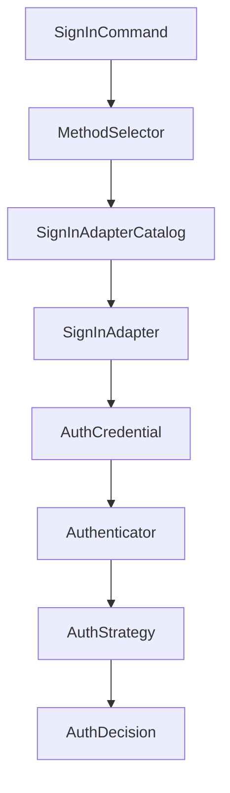
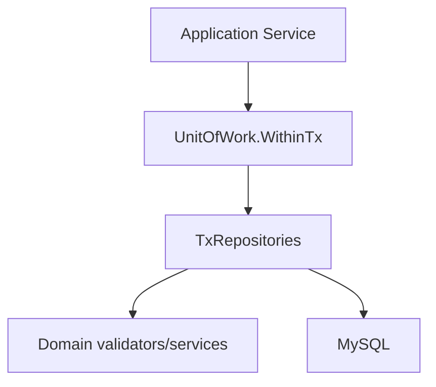
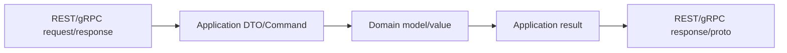
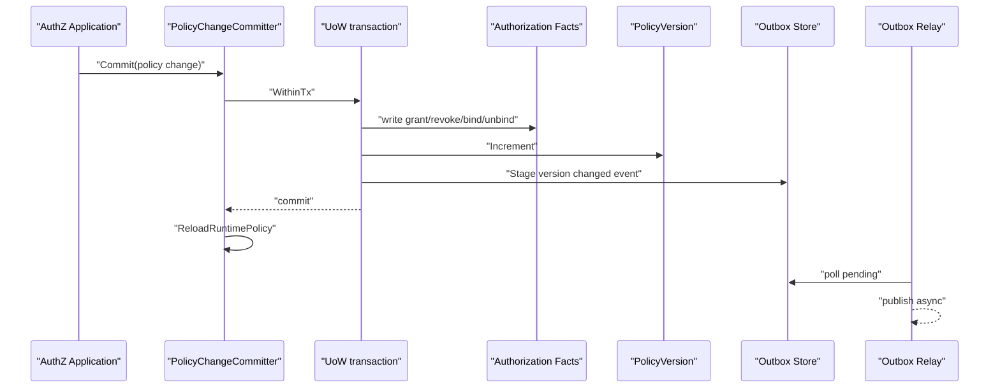

# 业务域设计模式地图

## 本文回答

本文回答：IAM 业务域中哪些 DDD/设计模式是真正在代码里落地的；每个模式为什么被使用、解决什么问题、在 AuthN/AuthZ/Identity/IDP/Suggest 中如何体现，以及它们的代价和边界在哪里。

## 30 秒结论

- IAM 的业务域不是 handler 调 repository 的事务脚本，而是以 Domain + Application 分层承载业务概念、用例编排和基础设施端口。
- AuthN 的主要变化点是“登录方式和认证 proof”，因此使用 Strategy、Adapter Catalog、DTO/Mapper。
- AuthZ 的主要复杂度是“授权事实、运行时判定、版本事件必须一致”，因此使用 Policy Object、Unit of Work、Snapshot/Projection、Transactional Outbox。
- Identity/UC 的主要不变量是 User/Profile/ProfileLink 的跨聚合协作，因此使用 Domain Service、Validator、Unit of Work。
- IDP 的主要风险是 secret 和外部 token 生命周期，因此使用 Secret Vault Port、Cache Aside、single-flight refresh lock。
- Suggest 和 CacheGovernance 属于读侧模型：前者服务业务联想搜索，后者服务运维可观测，两者都不应反向改写业务事实。

## 主图：模式如何支撑业务域



## 模式总览

| 模式 | 主要落点 | 解决的问题 | 代码证据 |
| ---- | ---- | ---- | ---- |
| Ports & Adapters | application/domain 依赖接口，infra/transport 做适配。 | 避免业务规则依赖 Gin、gRPC、GORM、Redis、微信 SDK。 | [../../internal/apiserver/application](../../internal/apiserver/application)、[../../internal/apiserver/domain](../../internal/apiserver/domain)、[../../internal/apiserver/infra](../../internal/apiserver/infra) |
| Strategy | AuthN 多认证方式、Account 创建方式。 | 同一用例下存在多种认证算法和凭据来源。 | [../../internal/apiserver/domain/authn/authentication](../../internal/apiserver/domain/authn/authentication)、[../../internal/apiserver/domain/authn/account/interfaces.go](../../internal/apiserver/domain/authn/account/interfaces.go) |
| Adapter Catalog | AuthN 登录 wire payload 到 domain proof 的适配。 | 新旧登录输入和显式登录方式需要统一到 domain credential。 | [../../internal/apiserver/application/authn/login/adapter_catalog.go](../../internal/apiserver/application/authn/login/adapter_catalog.go) |
| Domain Service | 跨实体或依赖外部端口的领域行为。 | 行为不属于单个实体，放应用服务又会丢业务语义。 | [../../internal/apiserver/domain/uc/profilelink](../../internal/apiserver/domain/uc/profilelink)、[../../internal/apiserver/domain/idp/wechatapp](../../internal/apiserver/domain/idp/wechatapp) |
| Repository | 聚合持久化和查询端口。 | 领域模型不绑定 MySQL/GORM。 | [../../internal/apiserver/domain/authz/rolebinding/repository.go](../../internal/apiserver/domain/authz/rolebinding/repository.go)、[../../internal/apiserver/domain/idp/wechatapp/repository.go](../../internal/apiserver/domain/idp/wechatapp/repository.go) |
| Unit of Work | UC、AuthN onboarding、AuthZ policy changes。 | 多 repository 写入必须共享事务边界。 | [../../internal/apiserver/application/uc/uow/uow.go](../../internal/apiserver/application/uc/uow/uow.go)、[../../internal/apiserver/application/authz/uow/uow.go](../../internal/apiserver/application/authz/uow/uow.go)、[../../internal/apiserver/application/authn/uow/uow.go](../../internal/apiserver/application/authn/uow/uow.go) |
| Policy Object | AuthZ 授权事实变更和判定语义。 | grant/revoke/bind/unbind 需要稳定业务语言。 | [../../internal/apiserver/domain/authz/policy](../../internal/apiserver/domain/authz/policy) |
| Specification/Validator | Credential、User、Profile、Role、Resource、RoleBinding。 | 校验规则不能散落在 handler 和 repository。 | [../../internal/apiserver/domain/authn/credential/spec.go](../../internal/apiserver/domain/authn/credential/spec.go)、[../../internal/apiserver/domain/authz/resource/validator.go](../../internal/apiserver/domain/authz/resource/validator.go)、[../../internal/apiserver/domain/uc/user/validator.go](../../internal/apiserver/domain/uc/user/validator.go) |
| DTO/Mapper | transport/application/domain 边界。 | wire 字段、应用命令、领域对象各有语义。 | [../../internal/apiserver/application/uc/profile/mapper.go](../../internal/apiserver/application/uc/profile/mapper.go)、[../../internal/apiserver/transport/rest/idp/handler/wechatapp_mapping.go](../../internal/apiserver/transport/rest/idp/handler/wechatapp_mapping.go) |
| Snapshot/Projection | AuthZ 授权快照、JWKS 发布状态、Suggest 候选。 | 读侧需要不同形状的数据，不能直接暴露写模型。 | [../../internal/apiserver/application/authz/authorization/service.go](../../internal/apiserver/application/authz/authorization/service.go)、[../../internal/apiserver/application/authn/jwks/models.go](../../internal/apiserver/application/authn/jwks/models.go)、[../../internal/apiserver/application/suggest/refresher.go](../../internal/apiserver/application/suggest/refresher.go) |
| Transactional Outbox | AuthZ policy version changed event。 | 业务事实和领域事件必须同事务写入，异步投递。 | [../../internal/apiserver/application/authz/policy/committer.go](../../internal/apiserver/application/authz/policy/committer.go)、[../../internal/apiserver/application/authz/shared/version_event.go](../../internal/apiserver/application/authz/shared/version_event.go)、[../../internal/apiserver/infra/messaging/outbox_relay.go](../../internal/apiserver/infra/messaging/outbox_relay.go) |
| Cache Aside | IDP access token、JWKS/keyset 发布快照。 | 外部 token/JWKS 有生命周期，读频高且刷新成本不同。 | [../../internal/apiserver/domain/idp/wechatapp/accesstoken-cacher.go](../../internal/apiserver/domain/idp/wechatapp/accesstoken-cacher.go)、[../../internal/apiserver/infra/token/keyset](../../internal/apiserver/infra/token/keyset) |
| Read Model | Suggest 和 CacheGovernance。 | 查询/观测形状不同于业务写模型。 | [../../internal/apiserver/application/suggest](../../internal/apiserver/application/suggest)、[../../internal/apiserver/application/cachegovernance/catalog.go](../../internal/apiserver/application/cachegovernance/catalog.go) |

## 1. Ports & Adapters



### 为什么用

业务域最怕两类耦合：

- handler 里直接写业务规则，导致 REST 字段变化影响领域行为。
- domain 直接依赖 MySQL、Redis、JWT、微信 SDK，导致业务测试必须启动基础设施。

Ports & Adapters 把变化点拆开：transport 处理 wire，application 处理用例，domain 处理规则，infra 实现被驱动端口。

### IAM 如何落地

- AuthN domain 只知道 `AuthStrategy`、credential repository、IDP 端口，不知道 JWT 编码细节。
- AuthZ domain 只表达 Role、Resource、Permission、RoleBinding 和 PolicyChange，不知道 Casbin adapter 细节。
- IDP domain 只依赖 `SecretVault`、`AccessTokenCache`、`AppTokenProvider` 端口，不知道具体 Redis/KMS/微信 SDK。
- Suggest application 只依赖 `ProfileCandidateSource` 和 `ProfileSuggestionRuntime`。

### 代价和边界

端口会增加类型数量。只有当变化点真实存在时才应抽端口：例如 SecretVault 和 AccessTokenCache 是必要端口；一个只被单个函数使用且没有替代实现的本地 helper 不应被过早端口化。

## 2. Strategy 与 Adapter Catalog



### 为什么用

AuthN 同时面对多种登录方式：密码、手机验证码、微信小程序、企业微信、bearer 兼容路径。它们的输入字段、外部依赖和凭据类型不同，但登录用例需要统一产出认证决策和 token。

### IAM 如何落地

- `SignInAdapterCatalog` 注册登录输入适配器，并拒绝重复 kind/auth type。
- adapter 把 transport/application 输入转换成 domain `AuthCredential`。
- `Authenticator` 按 credential type 选择 `AuthStrategy`。
- 具体 strategy 负责认证：password、phone OTP、wechat mini、wecom 等。

### 解决的问题

- 新增登录方式时，优先增加 adapter + strategy，而不是修改一个巨大 switch。
- 兼容输入和显式输入可以在 application 层统一，不污染 domain。
- domain strategy 只关心认证 proof，不关心 REST payload。

### 代价和边界

Strategy 会把调用链拉长。若只是一个固定认证方式，直接服务方法更简单；IAM 使用它是因为登录方式已经有真实变化点。

## 3. Domain Service

Domain Service 用来承载“不属于单个实体，但又是领域规则”的行为。

| 领域服务 | 为什么不是实体方法 | 当前职责 |
| ---- | ---- | ---- |
| `SelfProfileEnsurer` | 需要协调 User、Profile、ProfileLink。 | 保证用户自己的 profile 和 active self link 不变量。 |
| `ProfileLinker` | 建立关系需要检查 profile、user、relation 和已有 link。 | 建立/撤销 ProfileLink。 |
| `CredentialRotater` | 轮换 secret 需要 SecretVault 和版本规则。 | 加密、fingerprint、version、rotated time。 |
| `AccessTokenCacher` | access token 生命周期依赖 cache/provider/lock。 | cache-aside 获取和刷新。 |
| `AuthorizationPolicy` | grant/revoke/bind/unbind 是授权领域语言。 | 产生 `PolicyChange`。 |

代价是领域服务容易变成“业务工具箱”。IAM 的约束是：领域服务必须围绕一个清晰业务动作命名，并且方法参数要保持领域对象或领域值对象，而不是把 transport DTO 塞进去。

## 4. Repository 与 Unit of Work



### Repository 解决什么

Repository 把“我需要保存/查询聚合”从“数据库表怎么查”中分离出来。领域层依赖 repository interface，基础设施层提供 MySQL 实现。

### Unit of Work 解决什么

跨 repository 写入时，只靠单个 repository 无法保证事务边界。IAM 在这些位置使用 UoW：

- UC：创建 profile、建立 ProfileLink、更新 User/Profile 等需要一致提交。
- AuthN onboarding：Account、Credential、User/ProfileLink 协作。
- AuthZ：授权管理事实、授权运行时事实、policy version 和 outbox event 必须同事务。

### 代价和边界

UoW 不应包住所有读请求。读请求可以复用 UoW 端口，但不要把每个查询都设计成复杂事务。写入时才需要认真判断跨 repository 一致性。

## 5. Policy Object 与 Validator

AuthZ 里的 `AuthorizationPolicy` 是 Policy Object：它把 grant/revoke/bind/unbind 这类业务动作变成 `PolicyChange`。应用服务拿到 `PolicyChange` 后，再交给 `PolicyChangeCommitter` 写入事实和事件。

Validator/Specification 则用于输入规则和业务不变量：

- Credential 用 `BindSpec`、`RotateSpec` 表达绑定和轮换参数。
- AuthZ Role/Resource/RoleBinding/Policy 有 validator。
- UC User/Profile 有 validator 和 editor。
- Suggest 用 `RankingPolicy` 表达排序去重策略。

这些模式共同解决一个问题：不要让校验规则散落在 handler、DTO 和 repository 中。handler 的参数校验只说明“请求形状合法”，领域 validator 才说明“业务动作允许”。

## 6. DTO/Mapper



### 为什么用

IAM 有多个命名层：

- 公开合同可能使用 wire term，例如 AuthZ 的 `assignment`。
- 内部 domain 使用业务术语，例如 `rolebinding`。
- REST/gRPC 字段需要兼容外部接入。
- application command/result 需要表达用例输入输出。

DTO/Mapper 避免这些术语互相污染。

### IAM 如何落地

- UC profile/profilelink/user 有 mapper。
- IDP REST handler 有 request/response 和 mapper。
- AuthN token 有 `ClaimMapper` 处理 session claims 与 token claims。
- gRPC service 做 domain/proto enum 和字段转换。

### 代价和边界

Mapper 必须随合同维护。若只是同包内部结构转换，不需要过度抽象 mapper；但跨 transport/application/domain 边界时，显式 mapper 更安全。

## 7. Snapshot、Projection 与 Read Model

读侧模型用于“读者需要的数据形状”和“写模型事实形状”不同的地方。

| 读侧模型 | 来源 | 用途 |
| ---- | ---- | ---- |
| AuthZ Snapshot | Role、Permission、policy version。 | 给接入方读取授权快照。 |
| JWKS publish snapshot | keyset/JWKS 发布状态。 | 给缓存治理和诊断面查看签名密钥发布状态。 |
| Suggest index | ProfileCandidate。 | 支撑档案联想搜索。 |
| CacheGovernance catalog | 缓存族描述和状态 inspector。 | 运维可观测，不改业务事实。 |

Read Model 的好处是查询简单、稳定、可观测；代价是读侧可能滞后。因此文档和代码都不能把 snapshot 说成唯一事实源。业务事实仍以 domain/application 写模型、迁移和测试为准。

## 8. Transactional Outbox



AuthZ 授权变更不能只写业务表，也不能先发消息再提交事务。`PolicyChangeCommitter` 在同一个 UoW 事务里写：

1. 授权事实。
2. Policy version。
3. outbox event。

事务提交后再触发 runtime policy reload；outbox relay 异步投递事件。这样即使事件总线暂时不可用，业务事实和待投递事件仍保存在数据库中。

## 9. Cache Aside 与 Single Flight

IDP access token 是典型 cache-aside：

1. 先读缓存。
2. 缓存命中且未进入提前刷新窗口，直接返回。
3. 未命中或即将过期时尝试获取刷新锁。
4. 拿到锁则调用 provider 拉新 token，按 TTL 写缓存。
5. 没拿到锁则再读一次缓存，仍没有则返回重试错误。

这个模式解决“外部 token 获取成本高、过期时间明确、并发刷新有风险”的问题。边界是：它不能替代持久化的 WechatApp 配置，也不能保证外部微信 API 永远可用。

## 10. 什么时候不要新增模式

新增模式需要满足至少一个条件：

- 有明确变化点，例如新增认证方式、替换 secret vault、替换 suggest index。
- 有明确一致性问题，例如多 repository 写入必须同事务。
- 有明确读写形状差异，例如授权快照或 suggest 读模型。
- 有明确安全边界，例如 secret 不能泄漏到 handler。

如果只是为了“看起来架构完整”，不要新增 interface、manager、factory 或 catalog。IAM 当前文档鼓励解释已有模式，不鼓励把模式当作目标本身。

## 代码证据与验证

建议用这些测试保护模式事实：

```bash
go test ./internal/apiserver/domain/... ./internal/apiserver/application/authn/... ./internal/apiserver/application/authz/... ./internal/apiserver/application/uc/... ./internal/apiserver/application/idp/... ./internal/apiserver/application/suggest
```

文档卫生：

```bash
make docs-hygiene
```
