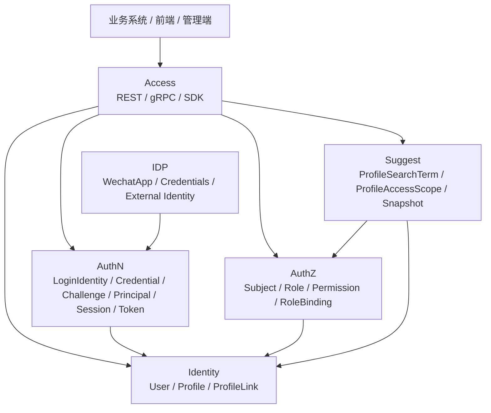

# 模块协作总图

> 状态：待补证据 · 骨架初稿，待与代码/契约核对。

## 30 秒结论

IAM 以 Identity 的 `User` 为稳定锚点：

- AuthN 证明调用者是谁，并通过 `Principal.UserID` 指向 User。
- AuthZ 通过 `Subject` 引用 User，并判断访问权。
- IDP 提供外部身份源证明，供 AuthN 消费。
- Suggest 基于 Profile 事实构建读模型，并用权限范围过滤结果。

## 总图

## 协作边界

| 协作 | 边界 |
| --- | --- |
| IDP -> AuthN | IDP 只提供外部身份源证明；登录态由 AuthN 决定 |
| AuthN -> Identity | AuthN 通过 UserID 引用 Identity.User |
| AuthZ -> Identity | AuthZ 通过 Subject 引用 User，不复制 User 写模型 |
| Suggest -> Identity | Suggest 消费 Profile 读事实，不修改 Profile |
| Suggest -> AuthZ | Suggest 使用权限范围，不管理通用授权策略 |
