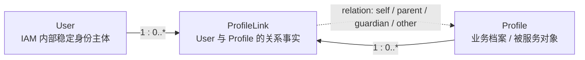

# Identity 模块总览

> 状态：待补证据 · 第一版正文，已结合当前文档体系重写，仍需继续按源码、契约和测试逐项核对。

---

## 1. 本文回答

本文回答 6 个问题：

- Identity 模块在 IAM 中负责什么？
- Identity 为什么是身份事实中心？
- `User`、`Profile`、`ProfileLink` 三个核心对象分别表达什么事实？
- Identity 和 AuthN、AuthZ、IDP、Suggest 的边界在哪里？
- Identity 当前有哪些关键规则和关键链路？
- 阅读 Identity 代码和后续文档应该从哪里进入？

本文是 Identity 模块入口，只做总览。
领域模型细节见 [01-领域模型-User-Profile-ProfileLink.md](01-领域模型-User-Profile-ProfileLink.md)；
模块边界见 [04-模块边界-Identity与AuthN-AuthZ-Suggest.md](04-模块边界-Identity与AuthN-AuthZ-Suggest.md)。

---

## 2. 30 秒结论

Identity 是 IAM 的**身份事实中心**。

它只回答一个核心问题：

```text
系统内部这个人是谁？
他关联了哪些业务档案？
这些关系如何建立、查询和撤销？
```

Identity 维护 3 个核心对象：

```text
User        IAM 内部稳定身份主体
Profile     业务身份资料、业务档案或被服务对象
ProfileLink User 与 Profile 之间的身份关系事实
```

Identity 不负责：

```text
认证登录态；
密码、验证码、第三方登录；
Session / Token / JWKS；
权限判定；
Role / Permission / RoleBinding；
外部身份源配置与解析；
Profile 联想搜索索引。
```

如果只记一句话：

> Identity 负责身份事实，AuthN 负责证明身份，AuthZ 负责访问判定，IDP 负责外部身份来源，Suggest 负责 Profile 读模型搜索。

---

## 3. 模块定位

Identity 是 IAM 的稳定身份锚点。

其他模块可以通过 `UserID`、`ProfileID` 或受控查询能力引用 Identity 事实，但不应该复制或改写 Identity 的写模型。

| 问题 | Identity 的回答 |
| --- | --- |
| 系统内部这个用户是谁？ | `User` |
| 业务上被服务或被管理的档案是谁？ | `Profile` |
| 一个用户和一个档案是什么关系？ | `ProfileLink` |
| 关系是否仍然有效？ | `ProfileLink.RevokedAt` / active 状态 |
| 是否是用户本人的档案？ | `ProfileLink.Rel = self` |

Identity 的定位不是“登录系统”，也不是“权限系统”。它是登录和授权都需要引用的身份事实层。

---

## 4. 核心模型主图



图中有 3 个判断：

```text
User 是 IAM 内部稳定身份主体；
Profile 是业务档案或被服务对象，不等于 User；
ProfileLink 是身份关系事实，不是 Permission。
```

一个 `User` 可以关联多个 `Profile`，例如本人档案、孩子档案、家庭成员档案等。

同一 `User` 只能有一条 active 的 `self` 档案关系。该规则由 `SelfProfileGuard.EnsureCanCreateSelf` 表达，代码事实源见 `internal/apiserver/domain/identity/profilelink/self_profile_guard.go`。

---

## 5. 核心对象

### 5.1 User

`User` 是 IAM 内部稳定身份主体。

它用于回答：

```text
系统内部这个人是谁？
其他模块应该通过什么稳定 ID 引用这个人？
多个登录身份最终归属到哪个内部用户？
```

当前规则：

```text
User 必须有非空 Name；
User 必须有非空 Phone；
User 默认状态为 active；
创建 User 时手机号唯一；
User 可以发生改名、改手机、改邮箱、状态变更。
```

代码事实源：

```text
internal/apiserver/domain/identity/user/user.go
internal/apiserver/domain/identity/user/types.go
internal/apiserver/application/identity/user
```

---

### 5.2 Profile

`Profile` 是业务身份资料、业务档案或被服务对象。

它用于回答：

```text
业务系统真正服务或管理的档案是谁？
管理端搜索、选择、操作的对象是什么？
一个 User 关联了哪些业务档案？
```

当前规则：

```text
Profile 必须有非空 Name；
提供身份证时需要校验身份证唯一；
Profile 可以被创建、更新和查询；
Profile 主事实属于 Identity，不属于 Suggest。
```

代码事实源：

```text
internal/apiserver/domain/identity/profile/profile.go
internal/apiserver/application/identity/profile
```

---

### 5.3 ProfileLink

`ProfileLink` 是 `User` 与 `Profile` 之间的身份关系事实。

它用于回答：

```text
某个 User 和某个 Profile 是否有关联？
是什么关系？
关系是否仍然 active？
关系何时撤销？
```

当前规则：

```text
已存在 active ProfileLink 时不可重复建立；
ProfileLink.Revoke 是软撤销；
重复撤销是幂等的，保留首次 RevokedAt；
同一 User 至多一条 active self 档案。
```

代码事实源：

```text
internal/apiserver/domain/identity/profilelink/profile_link.go
internal/apiserver/domain/identity/profilelink/types.go
internal/apiserver/domain/identity/profilelink/linker.go
internal/apiserver/domain/identity/profilelink/self_profile_guard.go
internal/apiserver/application/identity/profilelink
```

---

## 6. 关键规则

| 规则 | 说明 | 代码事实源 |
| --- | --- | --- |
| User 必须有非空 Name | 创建 User 时校验姓名 | `user.NewUser` |
| User 必须有非空 Phone | 创建 User 时校验手机号 | `user.NewUser` |
| User 默认 active | 新建 User 默认可用状态 | `user.NewUser`、`user/types.go` |
| 手机号唯一 | 创建 User 时检查手机号唯一性 | `user.UniquenessChecker`、`service_create` |
| Profile 必须有非空 Name | 创建 Profile 时校验姓名 | `profile.NewProfile` |
| 身份证唯一 | 提供身份证时检查唯一性 | `profile.IDCardUniquenessChecker` |
| ProfileLink 不可重复 active 建立 | 同一关系已存在时返回冲突 | `ErrIdentityProfileLinkExists`、`profilelink.Linker` |
| Revoke 软撤销且幂等 | 只设置 `RevokedAt`，重复撤销保留首次时间 | `ProfileLink.Revoke` |
| 同一 User 至多一条 active self 档案 | 防止多个本人档案 | `SelfProfileGuard.EnsureCanCreateSelf` |

---

## 7. 关键链路

Identity 当前最重要的链路有两类。

### 7.1 创建 User 与 Profile

该链路回答：

```text
如何创建 IAM 内部稳定身份主体？
如何创建业务档案或被服务对象？
如何保证手机号、身份证等身份不变量？
```

主线：

```text
transport
  -> application/identity/user 或 application/identity/profile
  -> domain/identity/user 或 domain/identity/profile
  -> repository
  -> commit
```

详细文档见 [02-关键链路-创建User与Profile.md](02-关键链路-创建User与Profile.md)。

---

### 7.2 建立与撤销 ProfileLink

该链路回答：

```text
User 和 Profile 如何建立关系？
关系如何撤销？
重复建立和重复撤销如何处理？
self 档案唯一性如何保证？
```

主线：

```text
transport
  -> application/identity/profilelink
  -> domain/identity/profilelink.Linker / SelfProfileGuard
  -> repository
  -> commit
```

详细文档见 [03-关键链路-建立与撤销ProfileLink.md](03-关键链路-建立与撤销ProfileLink.md)。

---

## 8. 模块边界

Identity 的职责边界应保持稳定。

| Identity 负责 | Identity 不负责 |
| --- | --- |
| `User` 的创建、改名、改手机、改邮箱、状态变更 | `Credential` / `Challenge` |
| `Profile` 的创建、资料更新、查询 | `Principal` / `Session` / `Token` / `JWKS` |
| `ProfileLink` 的建立、查询、撤销 | `Subject` / `Role` / `Permission` / `RoleBinding` |
| 按 ID、手机号、身份证、姓名查询身份事实 | 外部身份源配置、密钥、AppToken、ExternalIdentity |
| 手机号唯一、身份证唯一、self 档案唯一等身份不变量 | Suggest 索引刷新、Snapshot、联想搜索 |

最重要的边界：

```text
ProfileLink 不是 Permission；
User 不是 Principal；
User 不是 Subject；
Profile 不是 LoginIdentity；
Identity 不签发 Token；
Identity 不执行 AuthZ Check；
Identity 不维护 Suggest 索引。
```

---

## 9. 与其他模块的协作

### 9.1 Identity 与 AuthN

AuthN 通过 `UserID` 引用 Identity 的 `User`。

协作方式：

```text
AuthN 登录成功后通过 LoginIdentity 定位 UserID；
AuthN 构造 Principal / Session / Token；
Identity 提供 User 身份事实；
Identity 不管理 Credential、Challenge、Session、Token。
```

当前已知跨模块协作：

```text
封禁 User 会连带撤销该用户的 AuthN Session。
```

代码事实源：

```text
internal/apiserver/application/identity/user/service_lifecycle.go
```

该协作通过注入的 `session.Revoker` 完成。这里是 Identity 主动触发 AuthN Session 撤销的例外场景，需要在模块边界文档中重点说明。

---

### 9.2 Identity 与 AuthZ

AuthZ 通过 `Subject` 引用 Identity 的 `User` 或相关身份事实。

协作方式：

```text
Identity 提供 User/Profile/ProfileLink 事实；
AuthZ 使用 Subject / Resource / Action / Scope 执行权限判定；
AuthZ 不维护 User/Profile 写模型；
Identity 不维护 Permission/RoleBinding。
```

关键边界：

```text
ProfileLink 是身份关系事实；
Permission / RoleBinding 是授权事实；
两者不能互相替代。
```

---

### 9.3 Identity 与 IDP

IDP 提供外部身份来源证明，AuthN 决定如何绑定 LoginIdentity 和 User。

协作方式：

```text
IDP 输出 ExternalIdentity；
AuthN 消费 ExternalIdentity；
AuthN 绑定或匹配 LoginIdentity；
LoginIdentity 指向 Identity.User；
Identity 不管理 WechatApp、Credentials、AppToken。
```

关键边界：

```text
ExternalIdentity 不是 User；
微信 openid 不是 Profile；
IDP AppToken 不是 IAM AccessToken；
IDP 不拥有 Identity 写模型。
```

---

### 9.4 Identity 与 Suggest

Suggest 消费 Identity 的 `Profile` 事实构建联想搜索读模型。

协作方式：

```text
Identity 拥有 Profile 主事实；
Suggest 构建 ProfileSearchTerm / Snapshot；
Suggest 使用 ProfileAccessScope 过滤可见范围；
Suggest 返回脱敏后的 ProfileSuggestItem。
```

关键边界：

```text
Suggest 是读模型；
Suggest 不写 Profile 主事实；
Suggest 不管理通用授权策略；
Suggest 降级不能泄露不可见 Profile。
```

---

## 10. 分层架构入口

Identity 模块遵循 IAM 的分层结构。

```text
transport/rest 或 transport/grpc
  -> application/identity
  -> domain/identity
  -> infra/repository
```

各层职责：

| 层 | 职责 |
| --- | --- |
| transport | 解析 REST/gRPC 请求，调用 application |
| application | 编排 User/Profile/ProfileLink 用例，控制事务边界 |
| domain | 表达 User/Profile/ProfileLink 模型和身份不变量 |
| infra/repository | 持久化 Identity 事实 |
| container | 装配 Identity repository、service、handler |

Identity 的业务规则应优先落在 `domain/identity` 或 `application/identity`，不应散落在 transport handler 或 infra adapter 中。

---

## 11. 阅读路径

建议按以下顺序阅读 Identity 文档：

```text
00-模块总览.md
  -> 01-领域模型-User-Profile-ProfileLink.md
  -> 02-领域模型图.md
  -> 03-核心对象生命周期.md
  -> 02-关键链路-创建User与Profile.md
  -> 03-关键链路-建立与撤销ProfileLink.md
  -> 06-模块边界-Identity与AuthN-AuthZ-Suggest.md
  -> 07-分层架构与代码索引.md
```

如果是为了改代码：

```text
先读 01-领域模型；
再读对应关键链路；
最后读 07-分层架构与代码索引；
改完后补测试和 docs-hygiene。
```

---

## 12. 常见反模式

| 反模式 | 问题 | 推荐做法 |
| --- | --- | --- |
| 把 ProfileLink 当成 Permission | 身份关系和授权事实混淆 | ProfileLink 归 Identity，Permission 归 AuthZ |
| 把 User 当成 Principal | 持久身份和认证结果混淆 | User 属于 Identity，Principal 属于 AuthN |
| 把 User 当成 Subject | 身份事实和授权引用混淆 | Subject 属于 AuthZ，可引用 UserID |
| 在 Identity 中签发 Token | Identity 吞并 AuthN 职责 | Token 签发归 AuthN |
| 在 Identity 中执行权限 Check | Identity 吞并 AuthZ 职责 | 权限判定归 AuthZ |
| Suggest 直接写 Profile 主表 | 读模型吞并写模型 | Profile 主事实归 Identity，Suggest 只读 |
| IDP ExternalIdentity 直接写成 User | 外部身份和内部身份混淆 | ExternalIdentity 由 AuthN 绑定到 LoginIdentity/User |
| transport handler 直接写 repository | 协议层绕过 application | handler 调用 application service |

---

## 13. 事实源

本文是模块总览，不是机器契约。

当本文与代码、契约、测试冲突时，按以下优先级判断：

1. 源码与运行时行为。
2. 机器可读契约与配置：OpenAPI、proto、配置、迁移。
3. 测试：领域测试、应用测试、契约测试、架构测试。
4. 现行维护中的 `docs/`。
5. `_archive/` 历史材料。

当前主要事实源：

| 事实 | 路径 |
| --- | --- |
| User 实体与状态 | `internal/apiserver/domain/identity/user/user.go`、`internal/apiserver/domain/identity/user/types.go` |
| Profile 实体 | `internal/apiserver/domain/identity/profile/profile.go` |
| ProfileLink 实体与关系类型 | `internal/apiserver/domain/identity/profilelink/profile_link.go`、`internal/apiserver/domain/identity/profilelink/types.go` |
| 建立/撤销关系领域能力 | `internal/apiserver/domain/identity/profilelink/linker.go` |
| self 档案唯一性守卫 | `internal/apiserver/domain/identity/profilelink/self_profile_guard.go` |
| User 用例编排 | `internal/apiserver/application/identity/user` |
| Profile 用例编排 | `internal/apiserver/application/identity/profile` |
| ProfileLink 用例编排 | `internal/apiserver/application/identity/profilelink` |
| 封禁连带撤销 Session | `internal/apiserver/application/identity/user/service_lifecycle.go` |
| 模块装配 | `internal/apiserver/container/identity/module.go` |

---

## 14. Verify

修改本文后至少执行：

```bash
make docs-hygiene
```

涉及 Identity 领域规则时，执行：

```bash
go test ./internal/apiserver/domain/identity/...
```

涉及 Identity 用例编排时，执行：

```bash
go test ./internal/apiserver/application/identity/...
```

涉及 transport 或契约时，按实际影响执行：

```bash
make api-validate
make proto-gen
go test ./internal/apiserver/transport/rest/...
go test ./internal/apiserver/transport/grpc/...
```

涉及分层边界时，执行：

```bash
go test ./internal/pkg/architecture
```

---

## 15. 本文总结

Identity 可以压缩成一个公式：

```text
Identity = User + Profile + ProfileLink + 身份不变量
```

它的核心职责是：

```text
维护 IAM 内部稳定身份主体；
维护业务档案或被服务对象；
维护 User 与 Profile 的身份关系；
为 AuthN、AuthZ、Suggest 提供可引用的身份事实。
```

它的核心边界是：

```text
不做认证；
不签发 Token；
不做授权判定；
不管理外部身份源；
不维护 Suggest 索引；
不把 ProfileLink 写成 Permission。
```

读完本文后，应继续阅读 [01-领域模型-User-Profile-ProfileLink.md](01-领域模型-User-Profile-ProfileLink.md)
把 `User`、`Profile`、`ProfileLink` 的字段、状态、不变量和关系讲清楚，并理解其背后的设计意图。
