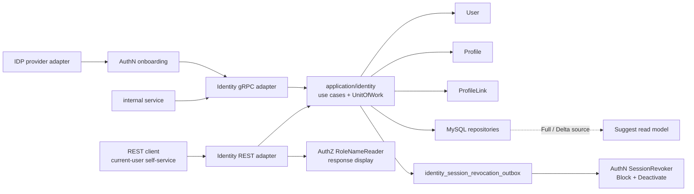

# Identity 模块总览

> 状态：已实现 · 当前职责、协议能力和代码映射已核对；设计决策仅在有历史提交、架构护栏或当前模型可证明时确认。

## 1. 本文回答

- Identity 在 IAM 中解决什么问题，不解决什么问题？
- 为什么要拆成 `User`、`Profile`、`ProfileLink` 三个模型？
- 为什么 User 创建时不自动创建 self Profile？
- 为什么 Profile 创建要与 ProfileLink 组合成一个用例？
- 为什么 REST 和 gRPC 暴露的能力不对称？
- 当前代码与设计之间还有哪些缺口？

## 2. 30 秒结论

Identity 是 IAM 的身份事实中心，而不是登录系统、权限系统或搜索系统。

```text
User        = IAM 内部稳定主体
Profile     = 被业务服务的人员档案
ProfileLink = User 与 Profile 之间的关系事实
```

三个模型的拆分解决了一个核心矛盾：“登录的人”、“接受业务服务的人”和“两者之间的关系”不总是同一件事。一个 User 可以关联多个 Profile，一个 Profile 也可以被多个 User 关联。

当前设计的五个关键选择是：

1. Identity 只管身份事实，与 AuthN、AuthZ、IDP、Suggest 分开。
2. 用通用的 `User / Profile / ProfileLink` 取代 child、guardianship 等场景专用平行模型。
3. User 不天然拥有 self Profile，建档时由业务语义决定 `self` 或 `relation`。
4. 创建 Profile 时必须同时建立 ProfileLink，两者在一个 Identity 事务中提交。
5. REST 面向当前登录用户的自助查改；gRPC 承载内部系统的创建、生命周期和批处理命令。

这些选择不等于当前实现已经没有缺口。活跃手机号唯一性、无作用域 REST Profile
搜索和状态变更后的 Session 最终撤销已经收口；ProfileLink 撤销后能否重建等生命周期语义仍需单独决策。

## 3. 问题背景

### 3.1 “用户”一个词承载了多种含义

在简单系统中，账号、登录人、个人资料和被服务对象可能是同一条记录。IAM 需要支持的场景更复杂：

- 一个登录用户可以管理本人档案，也可以管理父母、祖父母或其他关系人的档案；
- 同一个档案可能与多个登录用户存在不同关系；
- 用户可以先完成注册，之后再按业务需要建档；
- 登录方式、会话、权限和搜索索引都有独立的生命周期。

如果把这些概念合并到一个 `User` 中，任何一个场景变化都可能促使大对象继续扩张，并把认证、关系、授权和搜索的规则缠在一起。

### 3.2 设计需要同时保护事实正确性和模块边界

Identity 不仅要存储资料，还要保证：

- UserID 和 ProfileID 的语义稳定；
- 关系的类型、建立时间和撤销时间可追踪；
- 同一 User 最多只有一条 active self 关系；
- Profile 不会因为关系创建失败而成为孤立记录；
- 身份关系不被误当成访问权限；
- 搜索索引可以从主事实派生，但不能反向篡改主数据。

## 4. 设计目标与约束

| 目标或约束 | 对设计的影响 |
| --- | --- |
| 登录主体与业务档案可独立生存 | `User` 不内嵌 `Profile`，创建 User 不自动建档 |
| 支持多对多关系 | 关系必须建模为独立的 `ProfileLink` |
| 保留关系历史 | 撤销写入 `RevokedAt`，不物理删除关系 |
| 跨实体不变量要能落到事务 | application 通过 Identity UnitOfWork 组合 repository 和 domain guard |
| 并发竞态不能只靠预检查 | 关键唯一性需要数据库约束兜底 |
| 身份、认证、授权、搜索各自演进 | 模块之间只通过 ID、端口或派生读模型协作 |
| 对外接口服务于不同信任边界 | REST 偏自助场景，gRPC 偏内部系统命令 |

## 5. 当前总体设计



读图时需要区分三类关系：

- `User / Profile / ProfileLink` 是 Identity 拥有的主事实；
- Session 撤销和角色名称是 Identity 在特定用例中使用的外部能力；
- Suggest 只从 Identity 数据派生读模型，不是 Profile 事实源。

## 6. 核心设计决策

### 6.1 决策 A：Identity 只管身份事实

> 标签：设计决策 · 当前模块边界和代码依赖可证明

**问题**

登录方式、会话、业务档案、身份关系、角色权限和联想搜索都会用到“用户”，但它们的生命周期和一致性要求不同。

**约束**

- AuthN 需要处理 provider、identifier、Session 和 Token；
- AuthZ 需要处理 Subject、RoleBinding、Permission 和 Check；
- Suggest 需要为拼音、手机号和排序构建专用索引；
- Identity 写模型需要保持语义小而稳定。

**选择**

Identity 仅拥有 User、Profile、ProfileLink 事实。其他模块使用 UserID/ProfileID 或窄端口与它协作。

**替代方案**

- 把 LoginIdentity、Session 放进 User；
- 把 ProfileLink 直接转换成 Permission；
- 把拼音索引和权限过滤放进 Profile repository。

**取舍**

分离后需要明确的跨模块协作，但避免了用一个大 User 对象同时承担认证、授权、业务档案和搜索职责。

**当前实现映射**

- `internal/apiserver/domain/identity`
- `internal/apiserver/application/identity`
- [04-模块边界](04-模块边界-Identity与AuthN-AuthZ-Suggest.md)
- [身份、认证与授权为什么必须分开](../../06-专题设计/01-身份认证与授权边界.md)
- [Suggest 为什么采用派生读模型](../../06-专题设计/05-Suggest为什么是读模型.md)

### 6.2 决策 B：用通用三模型取代场景专用平行模型

> 标签：设计决策 · 有架构回归测试保护

**问题**

如果为每个业务场景分别创建 Child、Guardian、FamilyMember 等实体，同一个自然人事实会散落在多套模型和接口中。

**选择**

当前代码只保留 `User`、`Profile`、`ProfileLink`，用 `ProfileLink.Rel` 表达 `self / parent / grandparent / other`。旧 child/guardianship 模型、路由和契约被明确退役。

**替代方案**

- 为不同关系建立独立表和用例；
- 在 User 上放置 `children` 或 `guardians` 集合；
- 把关系当成 Profile 的固定所有者字段。

**取舍**

通用模型减少了重复实体和专用接口，也使新关系可以在统一生命周期中演进。代价是 `other` 过于宽泛，新关系语义需要明确决定是扩展枚举、增加元数据，还是升格为新模型。

**证据**

`internal/pkg/architecture/architecture_test.go` 中的 `TestIdentityLegacyChildGuardianshipModelDoesNotReturn` 会阻止旧概念重新进入 domain、application、REST、gRPC、SDK 和 schema。

### 6.3 决策 C：User 不自动拥有 self Profile

> 标签：设计决策 · 历史提交 `0d62d27d` 和当前测试可证明

**问题**

注册一个可登录主体，不代表业务已经获得建立本人档案所需的姓名、身份证、性别或出生日期，也不代表用户本次要为自己建档。

**选择**

User 创建用例只创建 User。之后由明确的建档用例同时创建 Profile 和 ProfileLink，并由请求的业务语义决定关系是 `self` 还是其他 relation。

**替代方案**

- User 创建时始终自动创建 self Profile；
- 把 User 基础资料直接当成 self Profile；
- 给 User 添加固定 `profile_id`。

**为什么选当前方案**

- 允许“只注册，尚未建档”的合法状态；
- 不会用不完整的注册信息生成低质量 Profile；
- 同一条建档链路可以表达本人和关系人场景；
- self 唯一性可以在建立关系时统一检查。

**后果**

任何读链路都不能假设 User 必然有 self Profile。调用方需要处理“无 self Profile”，并把建档作为显式业务操作。

### 6.4 决策 D：Profile 与 ProfileLink 组合创建

> 标签：设计决策 · 历史提交 `5dd54232` 与当前 UnitOfWork 可证明

**问题**

在当前业务语义中，创建 Profile 是“为某个 User 建档”的一部分。如果 Profile 写入成功但 ProfileLink 失败，会留下无法从当前用户达到的孤立档案。

**选择**

`MyProfiles.Create` 在一个 Identity UnitOfWork 中完成：

```text
校验建档资料
  -> 确认 User 存在
  -> 校验 self 唯一性
  -> 创建 Profile
  -> 创建 ProfileLink
  -> 同一事务提交
```

**替代方案**

- 对外暴露两个独立创建接口，由调用方编排；
- 先创建 Profile，再通过补偿任务建立关系；
- 允许孤立 Profile，之后再绑定。

**取舍**

组合用例保证了当前建档场景的原子性，也将 relation 选择放在业务语义中。代价是当未来出现“先导入 Profile，之后再归属”的真实需求时，需要新的用例和孤立档案治理规则，而不应直接拆散当前用例。

### 6.5 决策 E：REST 与 gRPC 服务于不同的调用边界

> 标签：设计决策 · 历史提交 `5dd54232` 与当前路由/契约可证明

**问题**

面向终端用户的自助接口与面向受信内部服务的身份编排，不需要拥有相同的写入权限。

**选择**

- REST 只暴露当前用户的查询和更新，以及与当前用户关联的 Profile/ProfileLink 查询；
- gRPC 暴露 User/Profile/ProfileLink 的内部创建、状态变更、建立、撤销和批处理命令。

**替代方案**

- REST 和 gRPC 完全镜像；
- 只保留一种协议；
- 由每个调用方直接使用 application package。

**取舍**

不对称接口减少了外部写入面，但也要求文档不能把 application 已有能力误报为对外 API。例如 application 存在 `Activate`，当前 REST 和 gRPC 均未暴露。

## 7. 当前实现映射

### 7.1 核心对象

| 对象 | Identity 中的职责 | 不属于它的职责 |
| --- | --- | --- |
| `User` | 稳定 UserID、基础资料、`active/inactive/blocked` 状态 | LoginIdentity、Credential、Session、Token |
| `Profile` | 姓名、身份证、性别、出生日期等业务档案事实 | 登录凭证、角色、权限、联想索引 |
| `ProfileLink` | User 与 Profile 的 `self/parent/grandparent/other` 关系及撤销历史 | Permission、RoleBinding、最终访问决策 |

字段、行为和不变量详见 [01-领域模型](01-领域模型-User-Profile-ProfileLink.md)。

### 7.2 对外能力矩阵

| 能力 | REST | gRPC | 当前语义 |
| --- | --- | --- | --- |
| 查询/更新当前 User | `GET/PATCH /identity/me` | `GetUser`、`UpdateUser` | REST 只使用当前登录 UserID |
| 创建 User | 无 | `CreateUser` | Phone、Email 可选；不自动创建 Profile |
| 停用/封禁 User | 无 | `DeactivateUser`、`BlockUser` | 状态与撤销任务同事务提交，后台最终撤销 Session |
| 激活 User | 无 | 无 | application 存在 `Activate`，协议未暴露 |
| 查询 Profile | 当前用户列表、详情 | `GetProfile`、`BatchGetProfiles` | REST 详情/修改检查 active ProfileLink；授权搜索统一由 Suggest 提供 |
| 创建 Profile | 无 | `CreateProfile` | 同事务创建 Profile 和 ProfileLink |
| 查询 ProfileLink | `GET /identity/profile-links` | `HasProfileLink`、`ListProfiles`、`ListProfileLinks` | 默认 active-only，查询契约可显式包含 revoked |
| 建立/撤销 ProfileLink | 无 | `EstablishProfileLink`、`RevokeProfileLink` | 建立使用事务；撤销保留历史 |
| 批量撤销/导入 | 无 | `BatchRevokeProfileLinks`、`ImportProfileLinks` | 逐项执行，允许部分成功，不是单一批事务 |

### 7.3 真实分层

| 层 | 责任 | 代码入口 |
| --- | --- | --- |
| REST/gRPC adapter | 认证上下文、契约映射、错误映射 | `internal/apiserver/transport/rest/identity`、`transport/grpc/service/identity` |
| application | 用例编排、跨实体校验、事务、外部端口调用 | `internal/apiserver/application/identity` |
| domain | 实体行为、关系规则、唯一性 checker/guard 抽象 | `internal/apiserver/domain/identity` |
| infrastructure | MySQL repository、UnitOfWork、PO 映射 | `internal/apiserver/infra/mysql/{user,profile,profilelink,uow/identity}` |
| contract/SDK | gRPC/REST 公开契约与 Go 调用封装 | `api/grpc/iam/identity/v2`、`api/rest/identity.v2.yaml`、`pkg/sdk/identity` |

分层不是为了让每条规则都变成“领域服务”。历史提交 `60dd61f7` 已删除一批不必要的 domain service；当前架构护栏也禁止 `Manager`、`ApplicationService` 这类空泛命名回归，要求用 `Creator`、`Editor`、`Directory`、`MyProfiles`、`Linker`、`Commands` 等语义能力命名。

## 8. 不变量与一致性边界速查

| 规则 | 当前保护位置 | 边界或代价 |
| --- | --- | --- |
| User Name 必填 | domain 构造/重命 | 会 `TrimSpace` |
| User Phone 可选，非空时唯一 | application checker + DB `active_phone` 唯一索引 | 软删除后允许复用；并发冲突映射为既有业务错误 |
| Profile Name 必填 | domain 构造/重命 | domain 只拒绝空字符串，并不 TrimSpace |
| Profile IDCard 可选，非空时唯一 | application checker + DB 唯一索引 | 空值映射为 SQL `NULL` |
| User/Profile 存在后才能建立 link | application 事务内查询 | 当前 schema 无外键 |
| 每个 User 最多一条 active self | `SelfProfileGuard` + DB `self_key` 唯一索引 | 双层保护 |
| User/Profile/Type 历史唯一 | DB `uk_user_profile_link` | 撤销后仍不能重建同 Type |
| ProfileLink 撤销保留首次时间 | domain `Revoke` | 公开用例只解析 active link，重复撤销返回错误 |

## 9. 已知缺口与待决策项

### 9.1 已关闭：活跃手机号由数据库唯一约束兜底

应用层保留规范化和友好预检查；迁移 `000017_users_active_phone_unique_guard` 使用生成列 `active_phone` 和唯一索引保证未软删除 User 的非空手机号唯一。并发冲突统一映射为现有 `ErrUserAlreadyExists`，软删除后可复用手机号。

### 9.2 待确认决策：Phone 为什么可选

代码、DTO 和测试都表明 Phone 可选，但当前文档库没有可核对的决策记录来说明其业务动机。不应仅根据第三方登录场景自行补写理由。

### 9.3 待确认决策：关系撤销后是否允许重建

domain 只检查 active link，但 DB 的 `(user_id, profile_id, type)` 唯一键覆盖全部历史。因此当前实际语义是“撤销后同 Type 不能重建”。这是一个需要业务确认的生命周期决策，不能只修改 application 判断。

### 9.4 已关闭：无作用域 REST Profile 搜索已下线

`GET /identity/profiles/search` 已删除并返回 `404`。授权后的候选搜索统一使用 `GET /suggest/profile`；该入口按 Suggest 的 scope、手机号搜索权限和脱敏规则执行。

### 9.5 已保证：状态提交后持久化补偿 Session 撤销

`Block` 与 `Deactivate` 在更新 User 状态的同一 MySQL 事务中写入 `identity_session_revocation_outbox`。后台 Worker 使用 `FOR UPDATE SKIP LOCKED` claim，并通过幂等 `RevokeByUser` 最终撤销 Redis Session；失败任务指数退避且可恢复 stale processing。该本地安全 Outbox 不依赖 NSQ，也不宣称 MySQL/Redis 原子提交或 exactly-once。

### 9.6 已知缺口：部分契约字段尚未落地

Identity proto 中的 `operator`、avatar、contacts、external identities 等部分字段，当前 handler/mapper 未消费或返回空值。它们是契约与实现的缺口，不是已实现的领域能力。

### 9.7 已关闭：Suggest 统一活跃关系派生规则

Suggest 默认 Full/Delta 都要求 Profile 未删除、ProfileLink 未删除且未 revoke、User 未删除。Delta 同时追踪三类表的更新和删除；最后一个有效关系失效时输出 tombstone，仍有其他关系时输出重新聚合后的 upsert。

## 10. 什么情况下应复议当前设计

以下变化值得新增 ADR 或模块决策记录，而不是直接在现有字段上叠加特判：

- Profile 被允许在没有任何 User 关系时独立存在；
- 关系需要有效期、审批、证据、多状态或可定制语义；
- 同一 User/Profile 在历史上需要多次建立和撤销同类关系；
- self Profile 从“最多一个”变为必须存在，或允许多个；
- ProfileLink 开始直接决定资源 Action，需要重新划定 Identity/AuthZ 边界；
- 外部客户端需要创建或批量修改身份事实，需要重新评估 REST 信任边界；
- Phone 从联系字段升格为账号主键或必填登录标识。

## 11. 事实源与 Verify

### 11.1 事实源

| 内容 | 路径 |
| --- | --- |
| 核心模型 | `internal/apiserver/domain/identity/{user,profile,profilelink}` |
| 用例与事务 | `internal/apiserver/application/identity`、`internal/apiserver/infra/mysql/uow/identity` |
| 数据库约束 | `internal/pkg/migration/migrations`（schema 唯一事实源） |
| REST 实际路由 | `internal/apiserver/transport/rest/identity/router.go` |
| gRPC 契约 | `api/grpc/iam/identity/v2/identity.proto` |
| 架构护栏 | `internal/pkg/architecture/architecture_test.go` |

### 11.2 设计决策来源

| 决策 | 证据 |
| --- | --- |
| User 不自动建 self Profile | 提交 `0d62d27d` 和 User/Profile 创建测试 |
| Profile 与 ProfileLink 组合创建 | 提交 `5dd54232`、`MyProfiles.Create`、Identity UnitOfWork |
| REST 移除 Profile/ProfileLink 写入 | 提交 `5dd54232`、当前 REST router 和 gRPC proto |
| 退役 child/guardianship 平行模型 | `TestIdentityLegacyChildGuardianshipModelDoesNotReturn` |
| 减少空泛领域服务 | 提交 `60dd61f7`、`TestIdentitySemanticServiceNamesDoNotRegress` |

### 11.3 验证命令

```bash
go test ./internal/apiserver/domain/identity/...
go test ./internal/apiserver/application/identity/...
go test ./internal/apiserver/infra/mysql/user ./internal/apiserver/infra/mysql/profile ./internal/apiserver/infra/mysql/profilelink
go test ./internal/pkg/architecture
make docs-hygiene
```

## 12. 继续阅读

- 字段、行为、不变量与替代方案：[01-领域模型](01-领域模型-User-Profile-ProfileLink.md)
- User/Profile 创建时序：[02-创建 User 与 Profile](02-关键链路-创建User与Profile.md)
- ProfileLink 建立和撤销：[03-建立与撤销 ProfileLink](03-关键链路-建立与撤销ProfileLink.md)
- Identity 与 AuthN/AuthZ/Suggest：[04-模块边界](04-模块边界-Identity与AuthN-AuthZ-Suggest.md)
- 分层代码导航：[05-分层架构与代码索引](05-分层架构与代码索引.md)
