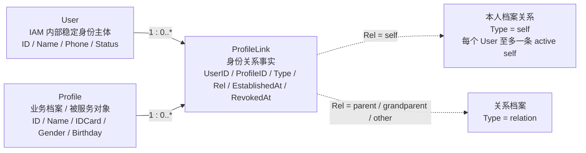
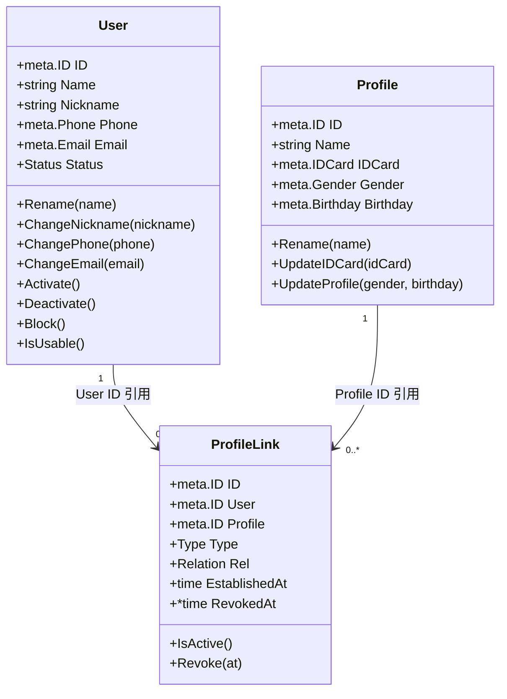
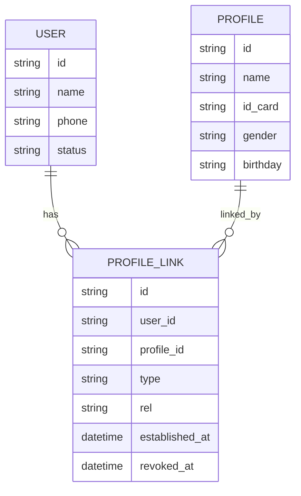
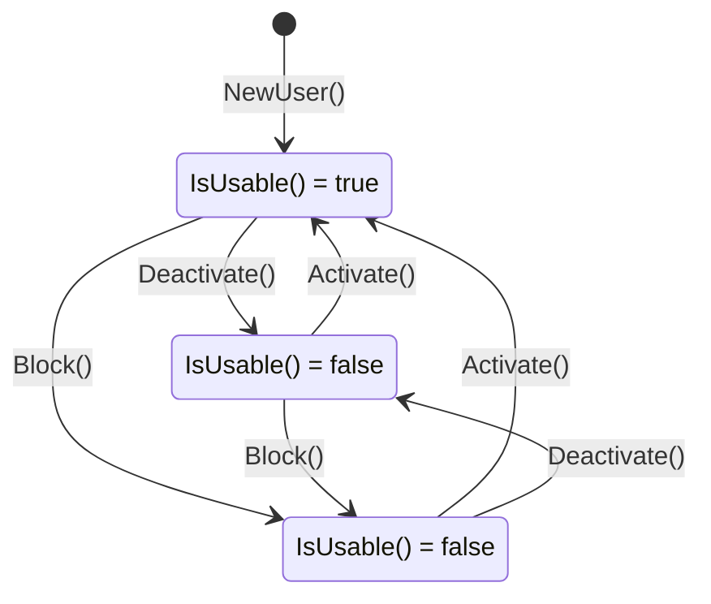
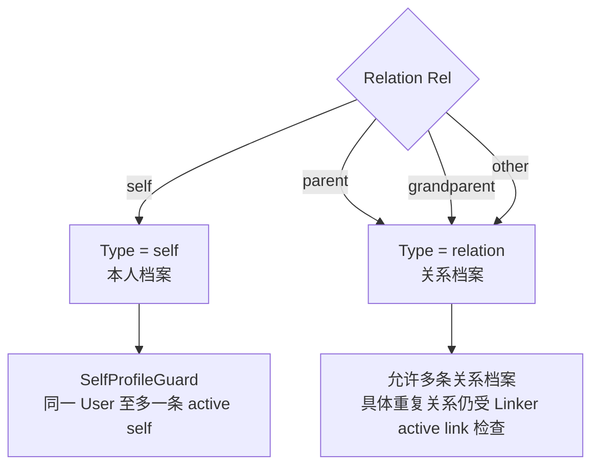
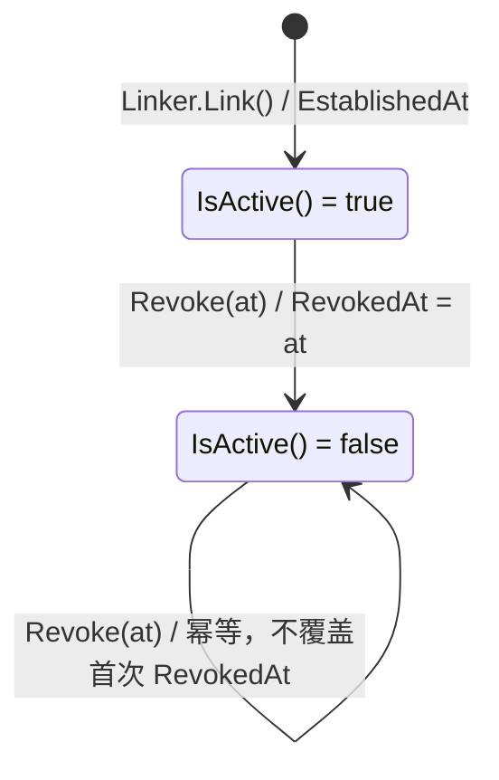
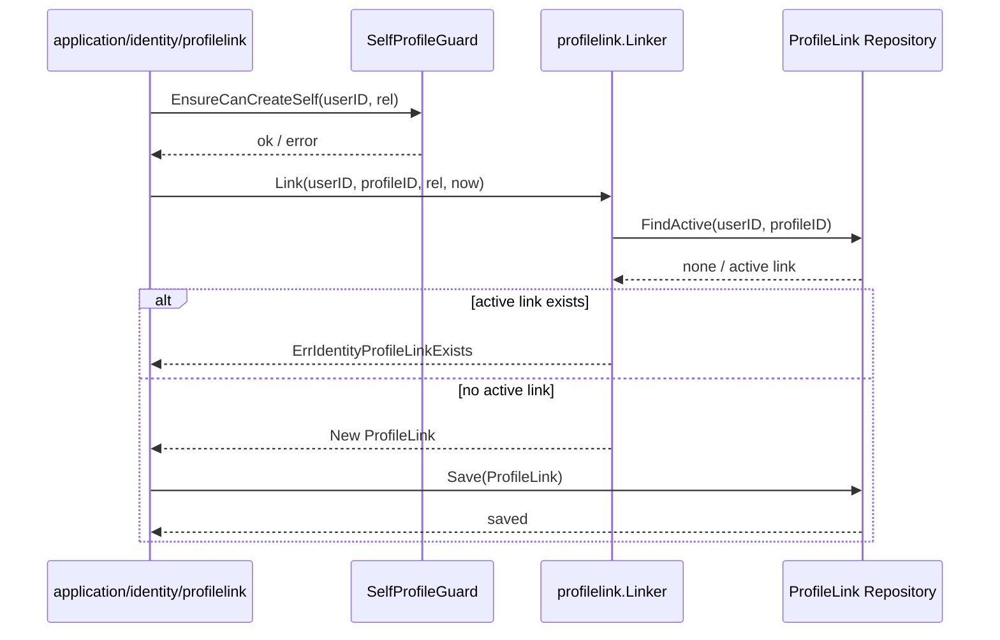
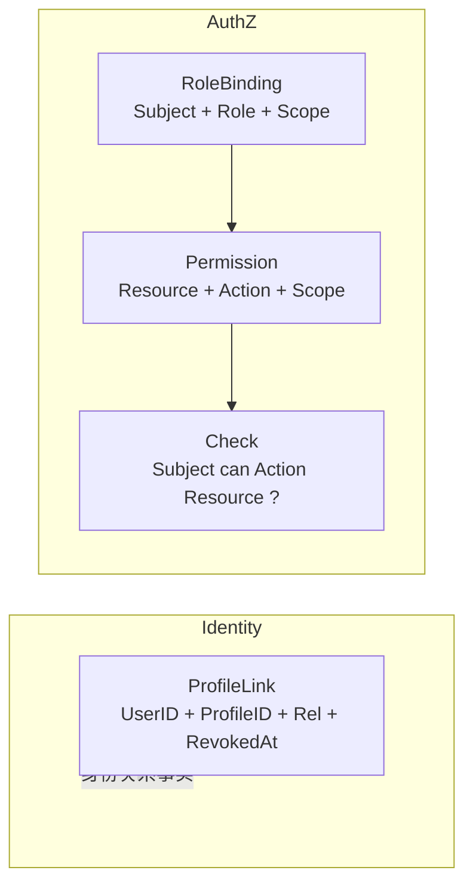
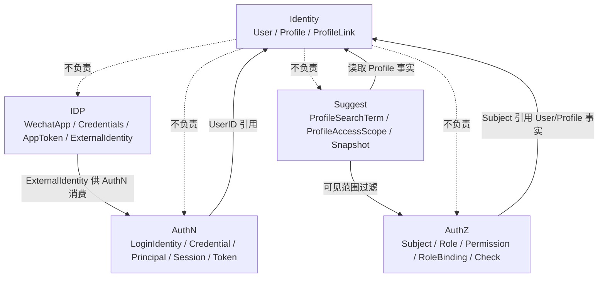

# 领域模型：User / Profile / ProfileLink

> 状态：已实现 · 已与 `internal/apiserver/domain/identity` 代码核对；本文合并原“领域模型 / 领域模型图 / 核心对象生命周期”三类内容，作为 Identity 模型主文档维护。

---

## 1. 本文回答

本文回答 8 个问题：

- `User`、`Profile`、`ProfileLink` 分别是什么？
- 三者为什么要拆成独立领域对象，而不是合并成一个“用户档案”？
- 三个对象各自有哪些字段、行为、不变量和生命周期？
- `User` 与 `Profile` 如何通过 `ProfileLink` 建立关系？
- `Rel` 与 `Type` 如何表达本人档案和关系档案？
- `ProfileLink` 如何通过 `RevokedAt` 表达软撤销？
- 为什么 `ProfileLink` 不是 `Permission`，`User` 不是 `Principal` / `Subject`？
- 修改 Identity 领域模型时应该核对哪些代码和测试？

本文是 Identity 模型主文档，集中说明模型定义、模型图、状态流转和核心生命周期。
模块总览见 [00-模块总览.md](00-模块总览.md)；
关键链路见 [04-关键链路-创建User与Profile.md](04-关键链路-创建User与Profile.md) 和 [05-关键链路-建立与撤销ProfileLink.md](05-关键链路-建立与撤销ProfileLink.md)。

---

## 2. 30 秒结论

Identity 的领域模型由 3 个核心对象组成：

| 对象 | 一句话 | 核心字段 | 领域含义 |
| --- | --- | --- | --- |
| `User` | IAM 内部稳定身份主体 | `ID, Name, Nickname, Phone, Email, Status` | 系统内部“这个用户是谁” |
| `Profile` | 业务档案 / 被服务对象 | `ID, Name, IDCard, Gender, Birthday` | 业务上真正被服务、被管理、被搜索的档案 |
| `ProfileLink` | User 与 Profile 之间的一条关系事实 | `ID, User, Profile, Type, Rel, EstablishedAt, RevokedAt` | 某个用户与某个档案之间是什么关系 |

三者的关系是：

```text
User 与 Profile 是两个独立实体；
User 通过 ProfileLink 关联一个或多个 Profile；
ProfileLink 只表达身份关系，不表达访问权限；
认证能力属于 AuthN；
授权能力属于 AuthZ。
```

如果只记一句话：

> User 是身份锚点，Profile 是业务档案，ProfileLink 是二者之间的身份关系事实；它们都不承载认证凭证和授权权限。

---

## 3. 为什么拆成 User / Profile / ProfileLink

Identity 不是简单的“用户表”。

在 IAM 场景中，需要同时表达两类对象：

```text
系统内部稳定身份主体：谁在使用系统；
业务档案或被服务对象：业务实际服务、管理、搜索和关联的对象。
```

如果把二者合成一个对象，会带来几个问题：

```text
无法表达一个登录用户关联多个业务档案；
无法表达家长、本人、祖辈、其他等关系；
无法独立维护登录主体和业务档案；
容易把身份关系误写成权限关系；
容易让 AuthN/AuthZ 直接污染 Identity 写模型。
```

因此 Identity 拆成 3 个对象：

```text
User：稳定身份主体；
Profile：业务档案；
ProfileLink：User 与 Profile 的关系事实。
```

该拆分让 Identity 能清楚回答：

```text
谁是系统内部用户？
业务档案是谁？
用户与档案是什么关系？
关系是否仍然有效？
```

---

## 4. 模型总览图



读图规则：

```text
User 是 IAM 内部稳定身份主体；
Profile 是业务档案或被服务对象；
ProfileLink 只保存 User/Profile 的 ID 引用，不内嵌实体；
Rel 表达关系语义，Type 由 Rel 推导；
RevokedAt 表达关系是否 active；
ProfileLink 不是 Permission；
User 不是 Principal，也不是 Subject。
```

---

## 5. 类图：字段与行为



要点：

```text
ProfileLink.User 是 meta.ID，不是 User 实体；
ProfileLink.Profile 是 meta.ID，不是 Profile 实体；
Identity 用 ID 引用组合关系，不把 User/Profile/ProfileLink 做成内嵌对象树；
User 有状态机；
Profile 当前没有状态机；
ProfileLink 的 active/revoked 状态由 RevokedAt 表达。
```

---

## 6. 关系基数图



这张图强调关系基数：

```text
一个 User 可以有多条 ProfileLink；
一个 Profile 可以被多条 ProfileLink 引用；
每条 ProfileLink 表达一条独立关系事实；
撤销 ProfileLink 不删除 User；
撤销 ProfileLink 不删除 Profile。
```

注意：

```text
这里是领域关系图，不等同于数据库物理表结构；
具体持久化字段、索引、唯一约束必须以 repository、migration 或 schema 为准。
```

---

## 7. User

### 7.1 定位

`User` 是 IAM 内部稳定身份主体。

它用于回答：

```text
系统内部这个人是谁？
其他模块应该通过什么稳定 ID 引用这个人？
多个登录身份最终归属到哪个内部用户？
```

`User` 是 Identity 的身份锚点。
AuthN 的 `LoginIdentity` 最终指向 `UserID`；
AuthZ 的 `Subject` 可以引用 `UserID`；
Suggest 可以通过 Profile 事实间接关联 User。

---

### 7.2 字段

代码事实源：`internal/apiserver/domain/identity/user/user.go`

| 字段 | 含义 | 说明 |
| --- | --- | --- |
| `ID` | User 标识 | IAM 内部稳定身份 ID |
| `Name` | 姓名 | 创建时必填 |
| `Nickname` | 昵称 | 可选展示信息 |
| `Phone` | 手机号 | 创建时必填，创建用例中校验唯一 |
| `Email` | 邮箱 | 可选联系信息 |
| `Status` | 状态 | `active / inactive / blocked` |

---

### 7.3 创建入口与不变量

创建入口：

```go
NewUser(name, phone, opts...)
```

当前不变量：

```text
Name 必填；
Phone 必填；
Status 默认 active；
手机号唯一由应用层创建用例调用 user.UniquenessChecker.CheckPhoneUnique 保证。
```

代码事实源：

```text
internal/apiserver/domain/identity/user/user.go
internal/apiserver/application/identity/user
```

---

### 7.4 行为

`User` 当前提供以下可变行为：

```text
Rename；
ChangeNickname；
ChangePhone；
ChangeEmail；
Activate；
Deactivate；
Block；
IsUsable。
```

这些行为表达的是 Identity 内部身份主体生命周期，不表达登录态和授权能力。

---

### 7.5 状态机

代码事实源：`internal/apiserver/domain/identity/user/types.go`

| 值 | 常量 | 含义 | `IsUsable()` |
| --- | --- | --- | --- |
| 1 | `UserActive` | 活跃 | true |
| 2 | `UserInactive` | 非活跃 | false |
| 3 | `UserBlocked` | 被封禁 | false |

状态迁移图：



注意：

```text
User 状态不是 Session 状态；
User 被封禁后是否连带撤销 Session，属于 application 层跨模块协作；
Session / Token 生命周期仍属于 AuthN。
```

---

### 7.6 生命周期

`User` 的生命周期可以压缩为：

```text
创建 -> 资料变更 -> 状态变更 -> 被其他模块引用
```

| 阶段 | 说明 | 关键规则 |
| --- | --- | --- |
| 创建 | 通过 `NewUser` 创建 User | Name、Phone 必填，默认 active |
| 资料变更 | 改名、改昵称、改手机、改邮箱 | 手机号变更应保持唯一性校验 |
| 激活/停用/封禁 | 通过状态迁移方法改变可用性 | 只有 active 可用 |
| 被引用 | AuthN/AuthZ/Suggest 通过 ID 引用 | User 不复制到其他模块写模型 |

---

## 8. Profile

### 8.1 定位

`Profile` 是业务身份资料、业务档案或被服务对象。

它用于回答：

```text
业务系统真正服务或管理的对象是谁？
管理端搜索、选择、操作的业务档案是什么？
一个 User 关联了哪些业务档案？
```

`Profile` 不等于 `User`。一个 `User` 可以通过 `ProfileLink` 关联多个 `Profile`。

---

### 8.2 字段

代码事实源：`internal/apiserver/domain/identity/profile/profile.go`

| 字段 | 含义 | 说明 |
| --- | --- | --- |
| `ID` | Profile 标识 | 业务档案 ID |
| `Name` | 姓名 | 创建时必填 |
| `IDCard` | 身份证 | 可选；提供时需要唯一性校验 |
| `Gender` | 性别 | 可选业务资料 |
| `Birthday` | 生日 | 可选业务资料 |

---

### 8.3 创建入口与不变量

创建入口：

```go
NewProfile(name, opts...)
```

当前不变量：

```text
Name 必填；
IDCard 可选；
提供 IDCard 时，身份证唯一由 application 层调用 profile.IDCardUniquenessChecker 保证。
```

代码事实源：

```text
internal/apiserver/domain/identity/profile/profile.go
internal/apiserver/application/identity/profile
```

---

### 8.4 行为

`Profile` 当前提供以下可变行为：

```text
Rename；
UpdateIDCard；
UpdateProfile(gender, birthday)。
```

这些行为只修改业务档案资料。

`Profile` 当前没有：

```text
登录凭证；
Session；
Token；
权限字段；
状态机。
```

因此，`Profile` 不能登录，不能被当成账号，也不能被直接当成权限主体。

---

### 8.5 生命周期

`Profile` 的生命周期可以压缩为：

```text
创建 -> 资料变更 -> 被 ProfileLink 引用 -> 被 Suggest 读取为读模型来源
```

| 阶段 | 说明 | 关键规则 |
| --- | --- | --- |
| 创建 | 通过 `NewProfile` 创建档案 | Name 必填，IDCard 可选且需要唯一性校验 |
| 资料变更 | 改名、更新身份证、更新性别生日 | 只表达业务档案资料变化 |
| 被关联 | 通过 ProfileLink 和 User 建立关系 | Profile 本身不表示关系 |
| 被读取 | Suggest 可读取 Profile 事实构建索引 | Suggest 不拥有 Profile 写模型 |

---

## 9. ProfileLink

### 9.1 定位

`ProfileLink` 是 `User` 与 `Profile` 之间的一条关系事实。

它用于回答：

```text
某个 User 和某个 Profile 是否有关联？
这个关联是什么关系？
关系什么时候建立？
关系是否已经撤销？
```

`ProfileLink` 是 Identity 领域中最容易被误解的对象。它不是权限，也不是角色绑定。

---

### 9.2 字段

代码事实源：

```text
internal/apiserver/domain/identity/profilelink/profile_link.go
internal/apiserver/domain/identity/profilelink/types.go
```

| 字段 | 含义 | 说明 |
| --- | --- | --- |
| `ID` | ProfileLink 标识 | 关系事实 ID |
| `User` | User 引用 | 存储双方 `meta.ID`，不内嵌 User 实体 |
| `Profile` | Profile 引用 | 存储双方 `meta.ID`，不内嵌 Profile 实体 |
| `Type` | 档案类型 | 由 `Rel` 推导 |
| `Rel` | 关系 | `self / parent / grandparent / other` |
| `EstablishedAt` | 建立时间 | 关系建立时间 |
| `RevokedAt` | 撤销时间 | `nil` 表示 active，非 nil 表示已撤销 |

---

### 9.3 Type 与 Rel

`Rel` 表达用户与档案之间的业务关系。

| Relation `Rel` | 对应 Type | 说明 |
| --- | --- | --- |
| `self` | `self` | 本人档案 |
| `parent` | `relation` | 家长 |
| `grandparent` | `relation` | 祖辈 |
| `other` | `relation` | 其他；`ParseRelation` 的兜底值 |

`Type` 由 `Rel` 推导：

```text
RelSelf -> TypeSelf；
其他 Rel -> TypeRelation。
```

推导图：



关键边界：

```text
self 是身份关系，不是登录账号；
parent / grandparent / other 是身份关系，不是权限；
Type = relation 不代表拥有访问权；
是否能访问 Profile 仍由 AuthZ 判断。
```

---

### 9.4 生命周期状态

`ProfileLink` 没有单独的状态枚举。

它的有效性由 `RevokedAt` 表达：

| `RevokedAt` | 状态 | `IsActive()` |
| --- | --- | --- |
| `nil` | active | true |
| 非 `nil` | revoked | false |

状态图：



`Revoke(at)` 是软撤销且幂等：

```text
首次撤销时写入 RevokedAt；
已经撤销后再次调用，不覆盖首次 RevokedAt；
关系记录保留，用于历史追溯。
```

---

### 9.5 建立关系规则

建立关系的领域能力由 `profilelink.Linker` 表达。

当前规则：

```text
已存在 active ProfileLink 时，不可重复建立；
重复 active 关系会返回 ErrIdentityProfileLinkExists；
Rel 决定 Type；
建立时间写入 EstablishedAt。
```

代码事实源：

```text
internal/apiserver/domain/identity/profilelink/linker.go
```

---

### 9.6 self 档案唯一性

同一个 `User` 至多只能有一条 active 的 `self` 档案关系。

该规则由 `SelfProfileGuard.EnsureCanCreateSelf` 表达。

代码事实源：

```text
internal/apiserver/domain/identity/profilelink/self_profile_guard.go
```

该规则的业务含义是：

```text
一个 User 可以关联多个 Profile；
但其中“本人档案”只能有一个 active 关系；
其他 parent / grandparent / other 关系不等于 self。
```

---

### 9.7 建立关系流程图



读图要点：

```text
self 唯一性由 SelfProfileGuard 负责；
重复 active link 检查由 Linker 负责；
Linker 创建的是 ProfileLink 关系事实；
保存由 repository 完成；
具体事务边界属于 application 层。
```

注意：上图是领域流程图，具体函数名和 repository 方法名以后续代码索引文档为准。

---

### 9.8 生命周期

`ProfileLink` 的生命周期可以压缩为：

```text
建立 -> active -> 撤销 -> revoked 历史记录
```

| 阶段 | 说明 | 关键规则 |
| --- | --- | --- |
| 建立 | 创建 User 与 Profile 的关系事实 | 不能重复建立 active link |
| active | `RevokedAt = nil` | `IsActive() = true` |
| 撤销 | 调用 `Revoke(at)` | 软撤销，写入 RevokedAt |
| revoked | `RevokedAt != nil` | `IsActive() = false`，重复撤销幂等 |

---

## 10. 三者之间的关系

### 10.1 User 与 Profile 是独立实体

`User` 与 `Profile` 不是父子包含关系。

```text
User 不内嵌 Profile；
Profile 不内嵌 User；
二者通过 ProfileLink 建立关系。
```

这样做的原因是：

```text
同一个 User 可以关联多个 Profile；
同一个 Profile 的关系可以被历史追溯；
关系可以被建立和撤销；
身份主体和业务档案可以独立演进。
```

---

### 10.2 ProfileLink 是多对多关系事实

从模型上看：

```text
User 1 -> 0..* ProfileLink；
Profile 1 -> 0..* ProfileLink。
```

这意味着：

```text
一个 User 可以关联多个 Profile；
一个 Profile 理论上可以被多个 User 以不同 Rel 关联；
每条 ProfileLink 都是一条独立关系事实；
撤销关系不删除 User，也不删除 Profile。
```

---

### 10.3 ProfileLink 不是权限

`ProfileLink` 回答的是：

```text
User 和 Profile 是什么身份关系？
```

`Permission` 回答的是：

```text
Subject 能否对 Resource 执行 Action，并满足 Scope？
```

对比图：



区别：

| 概念 | 所属模块 | 回答的问题 |
| --- | --- | --- |
| `ProfileLink` | Identity | User 和 Profile 是什么身份关系？ |
| `Permission` | AuthZ | Role 对 Resource / Action / Scope 有什么能力？ |
| `RoleBinding` | AuthZ | Subject 拥有哪些 Role？ |
| `Check` | AuthZ | Subject 能否访问某个 Resource？ |

关键结论：

```text
有 ProfileLink 不等于有访问权限；
没有 ProfileLink 也不等于一定没有任何授权，具体取决于 AuthZ 模型；
ProfileLink 不能替代 Permission；
Permission 不能替代 ProfileLink。
```

---

## 11. 与 AuthN / AuthZ / IDP / Suggest 的边界

### 11.1 跨模块边界图



---

### 11.2 User 不是 Principal

`Principal` 是 AuthN 认证成功后的运行时主体表达。

对比：

| 概念 | 所属模块 | 生命周期 | 含义 |
| --- | --- | --- | --- |
| `User` | Identity | 长期持久化 | 系统内部稳定身份主体 |
| `Principal` | AuthN | 随认证上下文产生 | 当前请求者的认证结果表达 |

关键边界：

```text
Principal 可以携带 UserID；
Principal 不是 User 实体；
User 不包含认证方法、AMR、Session 等运行时认证上下文。
```

代码事实源：

```text
internal/apiserver/domain/authn/authentication/principal.go
```

---

### 11.3 User 不是 Subject

`Subject` 是 AuthZ 授权域中的主体引用。

对比：

| 概念 | 所属模块 | 形态 | 含义 |
| --- | --- | --- | --- |
| `User` | Identity | User 实体 | 系统内部稳定身份主体 |
| `Subject` | AuthZ | `{Type, ID}` 引用 | 授权判断中的主体引用 |

关键边界：

```text
Subject.Ref 可以引用 UserID；
user 只是 Subject 的一种类型；
Subject 不拥有 User 写模型；
AuthZ 通过 Subject 做权限判定，不维护 User 实体。
```

代码事实源：

```text
internal/apiserver/domain/authz/subject/subject.go
```

---

### 11.4 Profile 不是登录账号

`Profile` 只是业务档案事实，不具备登录能力。

Profile 没有：

```text
LoginIdentity；
Credential；
Challenge；
Session；
Token；
JWKS。
```

登录账号和认证材料属于 AuthN。

---

### 11.5 IDP ExternalIdentity 不是 User

IDP 输出外部身份声明，AuthN 决定如何把外部身份绑定到 `LoginIdentity`，再通过 `LoginIdentity.UserID` 指向 Identity 的 `User`。

关键边界：

```text
ExternalIdentity 是外部身份声明；
User 是 IAM 内部身份主体；
openid 不是 Profile；
IDP AppToken 不是 IAM AccessToken；
IDP 不拥有 Identity 写模型。
```

---

### 11.6 Suggest Snapshot 不是 Profile 主表

Suggest 可以读取 Identity 的 `Profile` 事实构建读模型。

关键边界：

```text
Profile 主事实属于 Identity；
Suggest Snapshot 是读模型；
Suggest 不写 Profile 主事实；
Suggest 降级不能泄露不可见 Profile。
```

---

## 12. 领域不变量汇总

| 不变量 | 所属对象 | 说明 | 代码事实源 |
| --- | --- | --- | --- |
| `User.Name` 非空 | User | 创建 User 时必须提供姓名 | `user.NewUser` |
| `User.Phone` 非空 | User | 创建 User 时必须提供手机号 | `user.NewUser` |
| `User.Status` 默认 active | User | 新建 User 默认可用 | `user.NewUser` |
| User 手机号唯一 | User / application | 创建用例中调用唯一性检查 | `user.UniquenessChecker` |
| `Profile.Name` 非空 | Profile | 创建 Profile 时必须提供姓名 | `profile.NewProfile` |
| Profile 身份证唯一 | Profile / application | 提供 IDCard 时调用唯一性检查 | `profile.IDCardUniquenessChecker` |
| active ProfileLink 不可重复 | ProfileLink | 已存在 active 关系时不可重复建立 | `profilelink.Linker` |
| ProfileLink 软撤销 | ProfileLink | 通过 `RevokedAt` 标记撤销 | `ProfileLink.Revoke` |
| ProfileLink 撤销幂等 | ProfileLink | 已撤销后不覆盖首次 `RevokedAt` | `ProfileLink.Revoke` |
| 同一 User 至多一条 active self 档案 | ProfileLink | 由 self guard 校验 | `SelfProfileGuard.EnsureCanCreateSelf` |

---

## 13. 失败边界

Identity 领域模型中的失败边界应尽量清晰。

| 场景 | 期望行为 | 说明 |
| --- | --- | --- |
| 创建 User 时 Name 为空 | 返回领域错误 | User 必须有姓名 |
| 创建 User 时 Phone 为空 | 返回领域错误 | User 必须有手机号 |
| 创建 User 时 Phone 已存在 | 返回冲突错误 | 唯一性由 application 层检查 |
| 创建 Profile 时 Name 为空 | 返回领域错误 | Profile 必须有姓名 |
| 创建 Profile 时 IDCard 已存在 | 返回冲突错误 | 唯一性由 application 层检查 |
| 建立已存在 active ProfileLink | 返回 `ErrIdentityProfileLinkExists` | 防止重复 active 关系 |
| 同一 User 创建第二条 active self link | 返回冲突错误 | 由 SelfProfileGuard 保证 |
| 重复撤销 ProfileLink | 幂等成功或保持已撤销状态 | 不覆盖首次 RevokedAt |
| User blocked 后继续认证 | AuthN 应拒绝或撤销相关 Session | 属于 application 跨模块协作，不是 User 实体内部逻辑 |

---

## 14. 读图和改代码时的高频误解

| 误解 | 正确理解 |
| --- | --- |
| User 包含 Profile | User 和 Profile 独立，通过 ProfileLink 关联 |
| Profile 是登录账号 | Profile 是业务档案，不能登录 |
| ProfileLink 是权限 | ProfileLink 是身份关系事实，不是 Permission |
| self ProfileLink 表示本人拥有所有权限 | self 只是本人档案关系，访问仍由 AuthZ 判断 |
| User 就是 Principal | Principal 是 AuthN 认证成功后的运行时主体表达 |
| User 就是 Subject | Subject 是 AuthZ 授权域中的主体引用 |
| Suggest 索引就是 Profile 主表 | Suggest 是读模型，Profile 主事实属于 Identity |
| IDP ExternalIdentity 就是 User | ExternalIdentity 是外部身份声明，User 是 IAM 内部身份主体 |
| 删除 ProfileLink 表示撤销 | 撤销应通过 RevokedAt 软撤销，保留历史关系事实 |
| 重复撤销覆盖 RevokedAt | Revoke 幂等，应保留首次撤销时间 |

---

## 15. 代码事实源

| 事实 | 路径 |
| --- | --- |
| User 字段与行为 | `internal/apiserver/domain/identity/user/user.go` |
| User 状态定义 | `internal/apiserver/domain/identity/user/types.go` |
| User 创建用例与手机号唯一 | `internal/apiserver/application/identity/user` |
| User 封禁连带撤销 Session | `internal/apiserver/application/identity/user/service_lifecycle.go` |
| Profile 字段与行为 | `internal/apiserver/domain/identity/profile/profile.go` |
| Profile 创建用例与身份证唯一 | `internal/apiserver/application/identity/profile` |
| ProfileLink 字段与软撤销 | `internal/apiserver/domain/identity/profilelink/profile_link.go` |
| Type / Relation 定义与推导 | `internal/apiserver/domain/identity/profilelink/types.go` |
| 建立关系领域服务 | `internal/apiserver/domain/identity/profilelink/linker.go` |
| self 档案唯一性守卫 | `internal/apiserver/domain/identity/profilelink/self_profile_guard.go` |
| ProfileLink 用例编排 | `internal/apiserver/application/identity/profilelink` |
| Principal 形态 | `internal/apiserver/domain/authn/authentication/principal.go` |
| Subject 形态 | `internal/apiserver/domain/authz/subject/subject.go` |

---

## 16. Verify

修改本文后至少执行：

```bash
make docs-hygiene
go test ./internal/apiserver/domain/identity/...
```

涉及创建、更新、唯一性、关系建立或撤销用例时，执行：

```bash
go test ./internal/apiserver/application/identity/...
```

涉及 AuthN/AuthZ/Suggest 边界说明时，按实际影响执行：

```bash
go test ./internal/apiserver/domain/authn/...
go test ./internal/apiserver/domain/authz/...
go test ./internal/pkg/architecture
```

涉及 REST/gRPC 契约时，执行：

```bash
make api-validate
make proto-gen
go test ./internal/apiserver/transport/rest/...
go test ./internal/apiserver/transport/grpc/...
```

---

## 17. 本文总结

Identity 的领域模型可以压缩成：

```text
User：系统内部稳定身份主体；
Profile：业务档案 / 被服务对象；
ProfileLink：User 与 Profile 的身份关系事实。
```

三者共同表达：

```text
谁是系统内部用户；
业务档案是谁；
用户和档案之间是什么关系；
关系是否仍然有效。
```

三者都不表达：

```text
登录凭证；
认证上下文；
Session / Token；
Role / Permission；
授权判定。
```

最重要的边界是：

```text
ProfileLink 不是 Permission；
Principal 不是 User；
Subject 不是 User；
Profile 不是登录账号；
Suggest Snapshot 不是 Profile 主表；
IDP ExternalIdentity 不是 User。
```

由于本文已经合并模型图和生命周期内容，后续可以将独立的 `02-领域模型图.md` 和 `03-核心对象生命周期.md` 调整为删除、归档或轻量索引页，避免三处重复维护。
