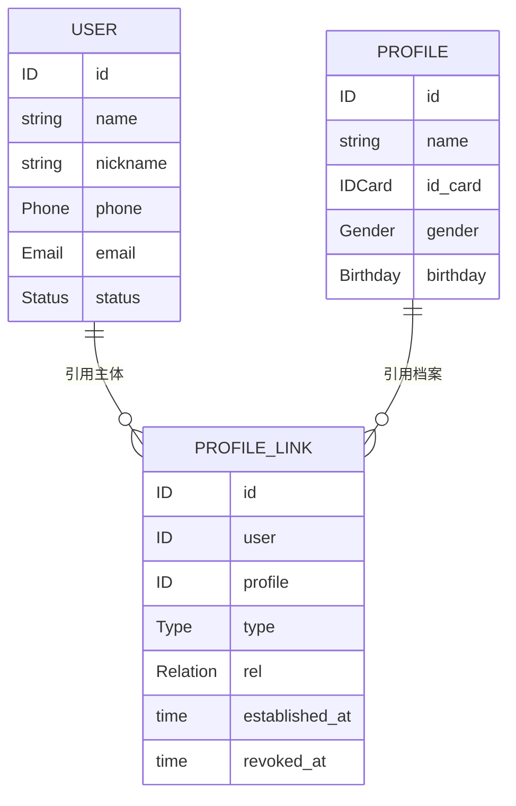
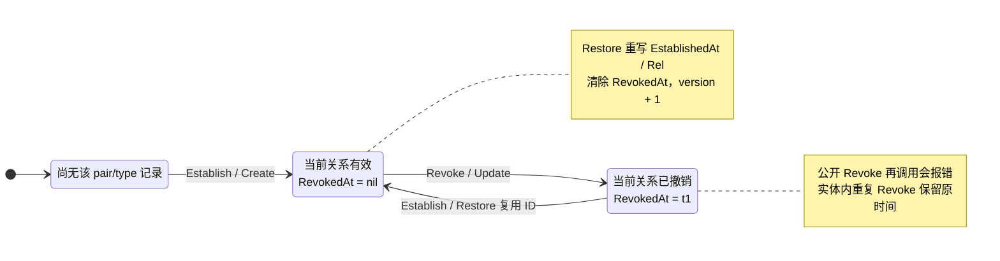

# 领域模型：User / Profile / ProfileLink

> 状态：已实现 · 本文维护当前模型、规则归属和设计取舍；候选设计单独标明。源码、存储约束、公开投影和真实环境验证分别取证。

## 1. 三个对象分别承载什么事实

Identity 将“可被系统引用的主体”“业务服务对象的档案”“主体与档案的关系”分开保存。**UserID 是主体锚点，ProfileID 是档案锚点，ProfileLink 是可撤销、可重新建立的关系记录。** 三者都不能单独证明自然人身份、亲属真实性或资源动作权限。

| 对象 | 回答的问题 | 当前内容 | 不应由它承担的内容 |
| --- | --- | --- | --- |
| User | IAM 引用哪个主体？ | 稳定 ID、名称/昵称、联系资料、运营状态 | 登录入口、密码、认证会话；“这个主体就是哪位自然人”的认证结论 |
| Profile | 业务记录哪份人员档案？ | ID、姓名、可选证件号、性别、生日 | 登录能力、唯一 owner、机构岗位或完整业务记录 |
| ProfileLink | 哪个 User 与哪个 Profile 建立了什么关系？ | 独立 ID、两端 ID、Type/Rel、建立/撤销时间 | 亲属证明、监护权证明、通用 PermissionGrant |

例如 User U17 刚创建时可以没有档案；随后建立 `U17 → P42, self` 和 `U17 → P43, parent`。另一个 User U18 可以关联 P43，而不用复制 P43。这里的 parent 是调用方填写的关系值，当前写链路不核验亲属材料，也不推导反向关系。


```mermaid
erDiagram
    USER ||--o{ PROFILE_LINK : "引用主体"
    PROFILE ||--o{ PROFILE_LINK : "引用档案"
    USER {
        ID id
        string name
        string nickname
        Phone phone
        Email email
        Status status
    }
    PROFILE {
        ID id
        string name
        IDCard id_card
        Gender gender
        Birthday birthday
    }
    PROFILE_LINK {
        ID id
        ID user
        ID profile
        Type type
        Relation rel
        time established_at
        time revoked_at
    }
```

图表示逻辑引用和模型基数，**没有数据库外键保证**。User 和 Profile 都可以对应零到多条 Link；“同 User 最多一条 active self”是额外约束，**没有“同 Profile 最多一个 self User”的反向约束**。示例 ID 是定位符，不表达 `UserID == ProfileID`。

事实源：[User](../../../internal/apiserver/domain/identity/user/user.go)、[Profile](../../../internal/apiserver/domain/identity/profile/profile.go)、[ProfileLink](../../../internal/apiserver/domain/identity/profilelink/profile_link.go)、[建关系用例](../../../internal/apiserver/application/identity/profilelink/service_command.go)。

## 2. 为什么分开建模，事务又怎样组合

如果把 Profile 做成 User 的扩展表，会默认一对一：未建档主体、多份关系人档案、同一档案的多个关系用户，都要用例外结构补救。若为每份关系人档案创建 User，又会把“被服务的人”误变成“可登录的主体”。当前分离保留了各自的 ID 和生命周期，也允许多个登录入口共同指向一个 User。

ProfileLink 需要独立实体，原因是关系本身有属性和生命周期。User 的 ProfileID 集合或 Profile 的单一 owner 字段不能表达关系分类、撤销时间和重新建立。AuthZ Assignment 则表达岗位分配，不能替代这份人员关系事实。

| 备选设计 | 能简化什么 | 在当前场景中的代价 |
| --- | --- | --- |
| User 内嵌唯一 Profile | 本人资料读写 | 无法直接表达关系人、多 User 共用档案，创建时也必须处理空档案 |
| Profile 固定 owner_user_id | 单拥有者访问 | 把当前多对多缩成单拥有者；更换“owner”与亲属关系混在一起 |
| User 持有全部 Profile/Link 的大聚合 | 在聚合内编排关系 | 同一 Profile 跨 User 时归属冲突；无关关系修改也绑在同一对象集合 |
| 当前三个独立实体和 repository | 分别引用、更新及查询 | 跨对象不变量必须由应用用例、事务和存储约束共同保护 |

最后一行是对当前结构的设计解释，不是已测得的性能结论；不能仅因有三张表就声称已证明三个最佳聚合边界。

**独立建模不等于当前公开用例允许任意组合写入。** Identity CreateUser 只建 User；AuthN SignUp 组合确保 User/LoginIdentity/Credential；当前 `MyProfiles.Create` 在同一 Identity UoW 中创建 Profile 和首条 Link，返回两者。没有公开的“只创建孤立 Profile”命令。所有关系撤销后，Profile 记录仍可存在，不会自动删除。

[Identity UoW](../../../internal/apiserver/infra/mysql/uow/identity/uow.go)组装同一事务上的三个仓储和 Session 撤销 Store。顶层调用成功才提交；若上下文已携带共享事务，则[共享 UoW](../../../pkg/uow/gorm/uow.go)借用它，由宿主决定提交/回滚。借用调用报错不会自动标记外层 rollback-only，宿主仍须传播错误。普通查询及预检查没有自动变成行锁，也没有跨 MySQL、Redis、AuthZ 和 Suggest 的共同事务。

## 3. User：稳定主体与联系资料

### 3.1 字段与创建、编辑的实际约束

| 字段/行为 | 当前规则 | 容易误读之处 |
| --- | --- | --- |
| ID | application 可指定非零 ID；UserPO 仅在 ID 未设置时生成 | 不是 Phone、外部 openid 或 ProfileID 的派生值 |
| Name | NewUser/Rename 去首尾空白并拒绝空值 | 是用户名称，不是已核验的法定姓名 |
| Nickname | WithNickname 去空白；ChangeNickname 直接赋值；PatchProfile 去空白且忽略空结果 | 不同调用路径的规范化规则不同 |
| Phone | 可为空；非空输入经 meta.NewPhone 解析为 E.164，目前允许中国地区的 MOBILE/FIXED_LINE_OR_MOBILE 类别 | 联系号码的格式正确不等于已证明控制权；空白原始输入不等于未提供 |
| Email | 可为空；非空输入经 meta.NewEmail 规范化 | 当前没有邮箱唯一约束或认证证明 |
| Status | active=1、inactive=2、blocked=3；构造默认 active 并校验枚举 | 不表示存在可用登录入口、档案或岗位 |

见[联系方式解析](../../../internal/apiserver/application/identity/user/contact_value.go)、[Editor](../../../internal/apiserver/application/identity/user/service_editor.go)、[Phone](../../../internal/pkg/meta/phone.go)、[Email](../../../internal/pkg/meta/email.go)、[UserPO](../../../internal/apiserver/infra/mysql/user/user.go)。

当前 UpdateContact/PatchProfile 的空 Phone/Email 表示保留原值，不能据此推导出清空功能；Nickname 的空补丁也被忽略。领域 ChangePhone 能赋零值，并不代表标准应用入口和存储能实现同样的清空语义。

公开 gRPC CreateUser 的 `nickname` 输入实际放入领域 Name；User 输出在 Nickname 为空时回退 Name。REST/gRPC 返回的 `VerifiedContact` 来自 User.Phone/Email，verified_at 未填；gRPC value 是完整规范化 Phone/Email，未实现 proto 注释所称“已脱敏展示值”。Identity 创建/修改没有 OTP 或联系渠道所有权核验，也不建立或更新 AuthN LoginIdentity。**修改联系手机号不会自动更换手机号登录入口。** 入口控制权归 AuthN，不能按响应类型名把联系资料当成认证事实。见[gRPC 生命周期映射](../../../internal/apiserver/transport/grpc/service/identity/identity_lifecycle.go)、[User 输出映射](../../../internal/apiserver/transport/grpc/service/identity/user_mapper.go)、[REST User](../../../internal/apiserver/transport/rest/identity/handler/user.go)。

### 3.2 Phone 唯一性：数据库与预检查并非相同集合

Identity Creator/Editor 使用 `UniquenessChecker` 提供冲突错误；空 Phone 跳过预检查。迁移[000017](../../../internal/pkg/migration/migrations/000017_users_active_phone_unique_guard.up.sql)以以下条件生成 active_phone，再建立唯一索引：

```text
deleted_at IS NULL 且 phone 非 NULL/空串 → active_phone = phone
其余行                              → active_phone = NULL
```

所以 inactive/blocked User 仍占非空手机号的唯一位，单改 Status 不释放；更换 Phone 会改变占位，deleted_at 非空则使该行 active_phone=NULL。清空号码或删除行也可释放数据库占位，但标准应用的清空限制仍如上文。AuthN SignUp 也受同一约束，但不按 Phone 自动合并账号。

需要保留一个实现差别：[UserRepository.FindByPhone](../../../internal/apiserver/infra/mysql/user/repo.go)没有排除 deleted_at；Identity 预检查仍可能找到已标记删除的旧 User 并拒绝复用。因此“数据库允许软删后复用”不能扩写成“所有创建/修改入口都保证复用成功”。当前也没有公开软删除 User 命令。Phone 是可变联系资料和唯一占位，不能替代稳定 UserID 或账号合并政策。

### 3.3 运营状态：合法枚举不等于迁移政策

Activate、Deactivate、Block 直接设置目标合法状态，没有 blocked 解封审批或允许迁移矩阵。Activate 当前是应用能力，没有公开 REST/gRPC 激活命令；Deactivate/Block 有 gRPC 入口。

Deactivate/Block 在状态改变时保存 User，并在配置 SessionRevocations 端口的同一事务中 Stage 撤销意图；已处于目标状态则早返回。标准 MySQL 更新不推进 users.version，Stage 按 UserVersion/action 去重，旧 completed 任务可能阻止再次生成 pending。Activate 不取消旧任务。**状态已保存、当次在线准入拒绝、Redis Session 已清理是三个结果。**

当前状态变更不撤销 ProfileLink 或 AuthZ Assignment，也不因 Status 本身把 Profile 从 Suggest 索引排除。源码推论与实际交错复现要分别取证；任务版本、晚到 Session 和在途请求的完整边界由[Identity 跨模块协作](04-模块边界-Identity与AuthN-AuthZ-Suggest.md)及[AuthN 边界](../02-AuthN/07-模块边界-AuthN与Identity-IDP-AuthZ.md)维护。

## 4. Profile：一份档案，不是已去重的自然人主数据

| 字段/行为 | Domain 与值对象 | 标准创建用例/存储 |
| --- | --- | --- |
| ID | 独立档案 ID | ProfilePO 创建时生成；不沿用 UserID |
| Name | NewProfile/Rename 只拒绝空串，不 TrimSpace | gRPC CreateProfile 去空白并拒绝空结果；直接应用创建规则较宽 |
| IDCard | 可选；meta.NewIDCard 规范化号码，并带一份姓名 | 创建输入非空先解析；IsValid 为真时查重及放入实体；空号码写 SQL NULL |
| Gender | NewGender 只是类型转换；合法值 0/1/2 | 应用创建拒绝非零非法值；gRPC 未指定/未知 enum 先降为0=other，不进入此拒绝分支 |
| Birthday | NewBirthday 只保存字符串；IsValid 校验日期格式 | 创建对非空值调用 IsValid；没有“必须早于今天”的 Birthday 规则 |
| 更新 | UpdateIDCard/UpdateProfile 直接赋值 | 不自带唯一性或性别/生日校验，需按实际入口判断 |

创建校验见[profile_creation.go](../../../internal/apiserver/application/identity/profile/profile_creation.go)及[gRPC 转换](../../../internal/apiserver/transport/grpc/service/identity/profile_command.go)，值对象见[IDCard](../../../internal/pkg/meta/idcard.go)、[Gender](../../../internal/pkg/meta/gender.go)、[Birthday](../../../internal/pkg/meta/birthday.go)。身份证号码的格式/校验位/日期规则没有调用外部实名机构；也没有将号码中的生日、性别与另外两个字段对照一致。legal_name 是协议字段名，不能据此声称法定身份已核验。

非空 IDCard 有创建预检查和 `profiles.uk_id_card` 并发兜底；空号码经 mapper 写 NULL，允许多份无证件档案。同姓名/性别/生日只是普通索引和查询条件，不是唯一键，也没有自动合并机制。因此同一自然人可能对应多份无证件 Profile；ProfileID 标识记录，不是已解决自然人判重后的唯一身份证明。证件可选的业务条件应单独记录，不能自行补写“因为未成年”之类未经确认的理由。

该唯一键覆盖已标记删除的记录，不随 deleted_at 释放。普通 repository 也没有自动删除过滤，不能类推 User 的 active_phone 政策。当前公开 Patch 没有 IDCard 字段，UpdateIDCard 只有领域行为，没有生产换证用例；创建 checker 不能当作现成的编辑查重规则。

### 4.1 创建、更新、回读的校验并不对称

当前 [MyProfiles.Patch](../../../internal/apiserver/application/identity/profile/service_my_profiles.go)对非空 legalName 去空白，但不对 Gender/Birthday 调用 IsValid。只要提供其中一项，就同时赋值两个字段，未提供项用零值。随后[ProfileRepository](../../../internal/apiserver/infra/mysql/profile/repo.go)经[BaseRepository](../../../internal/pkg/database/mysql/base.go)以 struct Updates 保存，零值字段会被省略。

例如现存 Gender=1，只补 Birthday：应用返回的内存 Gender=0，数据库更新可保留原来的1。非零非法 Gender 或非空非法日期又可能写入；不能把创建校验写成所有更新都有的保证，也不能把补丁返回当作完整回读。本例来自赋值/映射/更新规则的源码推演，本轮没有单独复现该输入。

持久化还会丢失值对象的一部分：IDCard.Scan 只恢复号码并清空内部姓名，[ProfileMapper.ToBO](../../../internal/apiserver/infra/mysql/profile/mapper.go)直接装配实体，没有用 Profile.Name 重建 IDCard。回读后号码仍可输出，但 IDCard.IsValid 可能为 false。UserMapper 则调用 NewUser，非法 Name/Status 会映射为 nil，FindByID 转成 not found 类错误；Profile/Link mapper 不经同等构造校验。**类型名和恢复成功都不是全量合法性证明。**

### 4.2 公开投影不等于领域字段原样输出

REST Profile 将证件号显式脱敏；gRPC Profile 的 `IdentityDocument.masked_number` 当前直接赋 ProfileResult.IDCard，即完整号码，名字没有实现脱敏。由 ProfileLink 组装的 gRPC Profile 又不填 IdentityDocument。领域对象不持有 CreatedAt/UpdatedAt，现行 Profile/User 投影没有据 PO 回填这些时间；不能按 schema 中有字段就声称已经返回。

依据：[应用 mapper](../../../internal/apiserver/application/identity/profile/mapper.go)、[REST mapper](../../../internal/apiserver/transport/rest/identity/handler/profile_mapping.go)、[gRPC mapper](../../../internal/apiserver/transport/grpc/service/identity/profile_mapper.go)。后续若统一脱敏/审计时间，应同时定义读权限和兼容合同，再修改实现。

## 5. ProfileLink：关系分类与不变量

### 5.1 Type 与 Rel 的分工

Link 保存 ID、User、Profile、Type、Rel、EstablishedAt、RevokedAt。Type 目前是 Rel 的粗分类：self → self，parent/grandparent/other → relation。公开命令输入 relation，Linker 派生 Type；没有供调用方独立选择 Type 的参数。

[ParseRelation](../../../internal/apiserver/domain/identity/profilelink/types.go)先去空白并转小写，识别 self/parent/grandparent，其余均返回 other。直接 Establish 的空值、未知拼写也会降为 other；CreateProfile 应用先拒绝空关系，但未知非空值仍可降级。gRPC 使用 enum，[mapper](../../../internal/apiserver/transport/grpc/service/identity/profile_link_command.go)也将 unspecified/未知值映射成 other。因此不能同时写“枚举是否合法由 Domain 检查”和“所有未知原始输入都会被拒绝”：Linker 看到的是转换后的合法值。

Type 可支持粗分查询和索引，但目前还没有独立业务规则证明它必须成为持久化字段。写链路保证派生一致，mapper 回读和数据库没有 Type/Rel 配对检查。新增 spouse/sibling 等关系时，需确定细分类、兼容未知值及索引语义；增加常量本身不能证明旧消费者会按同样方向理解它。

### 5.2 每条规则由谁保证

| 规则 | 应用/领域预检查 | 存储最终约束及边界 |
| --- | --- | --- |
| User/Profile 存在 | 应用分别查询两端 | 无 FK、无级联；普通读不锁两端，不保证后续生命周期不变 |
| Rel 合法、Type 与 Rel 对应 | Linker 校验转换后的 Relation 并派生 Type | VARCHAR 与 mapper 恢复不做一致性校验 |
| 同 pair 无重复 active Link | Linker 调 IsLinked，查任意 Type 的未撤销关系 | 唯一键是 pair/type；同 Type 有兜底，跨 Type 预检查竞态没有等价索引兜底 |
| 同 User 最多一条 active self | self 写入口显式调用 SelfProfileGuard | mapper 为未撤销 TypeSelf 设置 self_key=user_id；唯一索引裁决重复非 NULL 值 |
| 同 Profile 最多一个 self User | **没有该规则** | self_key 不按 profile_id 唯一 |
| TypeRelation 内 parent/grandparent/other 同 pair 独立共存 | active pair 预检查拒绝重复 | 三者共享 TypeRelation，唯一键不将 Rel 当作一部分 |
| 相同 pair/type 的多周期建立 | Establish 查旧 revoked 行后 Restore | 复用旧 ID，条件更新；不是每周期 INSERT，也不是完整历史日志 |

[SelfProfileGuard](../../../internal/apiserver/domain/identity/profilelink/self_profile_guard.go)查询 TypeSelf，再确认 RelSelf 和未撤销。它属于集合规则，不能由单条 Link 自己判断；[LinkSelf](../../../internal/apiserver/domain/identity/profilelink/linker.go)不会自动调用这个 guard，新增写入口仍需显式编排。

`self_key` 是普通可空列，**不是数据库生成列**。mapper 的计算只看 TypeSelf/RevokedAt，不检查 Rel 或 deleted_at；数据库只保证 self_key 非空值唯一，不会自动修复直写 SQL 的错误 key。迁移[000007](../../../internal/pkg/migration/migrations/000007_add_active_self_profile_link_guard.up.sql)初始回填又只覆盖未删除且未撤销 TypeSelf。这些边界限制了“数据库保证所有非法 self 都不可存在”的说法。

迁移初始归一 SQL 也不能按注释概括为“只把后续 active self 改为 parent”：UPDATE 筛选 keeper，但没有同等限定目标 pl 的 Type、撤销或删除状态，同 User 较晚的其他关系也可能匹配。升级前应检查实际目标集合和唯一键冲突；本文没有执行历史迁移或认定某环境已发生改写。

## 6. 撤销与重新建立：保留记录，覆盖旧周期

以下状态图按**同一 pair/type、标准用例**绘制；active-only 是未撤销条件，不是 User.Status：


```mermaid
stateDiagram-v2
    direction LR
    state "尚无该 pair/type 记录" as Missing
    state "当前关系有效<br/>RevokedAt = nil" as Active
    state "当前关系已撤销<br/>RevokedAt = t1" as Revoked
    [*] --> Missing
    Missing --> Active: Establish / Create
    Active --> Revoked: Revoke / Update
    Revoked --> Active: Establish / Restore 复用 ID
    note right of Active
        Restore 重写 EstablishedAt / Rel
        清除 RevokedAt，version + 1
    end note
    note right of Revoked
        公开 Revoke 再调用会报错
        实体内重复 Revoke 保留原时间
    end note
```

一个完整例子：

```text
t0：建立 L8(U17, P43, TypeRelation, parent)
t1：撤销 → L8.RevokedAt=t1
t2：同 pair 改以 grandparent 再建立
    → 找到旧 TypeRelation 行，Restore L8
    → ID 仍为 L8，Rel=grandparent，EstablishedAt=t2，RevokedAt=NULL
```

当前[Establish](../../../internal/apiserver/application/identity/profilelink/service_command.go)先检查参与者、relation=self 时的 active self 和任意 Type 的 active pair，再查同 User/Type 的历史行。同 pair/type 的 revoked 行由[Restore](../../../internal/apiserver/infra/mysql/profilelink/repo.go)以 ID/User/Profile/Type/旧 RevokedAt 为条件更新；不是盲目覆盖，RowsAffected 必须为1。另一条 active self 抢占唯一位时也会拒绝恢复。跨 Type 重建则可能创建另一行，旧 Type 的 revoked 行仍保留。

Restore 会清除原 RevokedAt、覆盖 EstablishedAt/Rel 并令 PO.version+1，因此 including-revoked 查询只是“包含当前仍 revoked 的行”，不能重放 t0/t1/t2 的历次关系历史；version 也没有作为公开命令的 expected version。业务若需解释“当时为何有权”，必须另定周期记录/事件合同，不能用这一行的最新时间代替审计。

[ProfileLink.Revoke](../../../internal/apiserver/domain/identity/profilelink/profile_link.go)用 mutex 保护同一内存实例的首次时间；不同请求可能加载不同实例。普通 Update 仅按 ID 写入，没有旧 RevokedAt/version 条件，也不要求影响一行。并发撤销可能覆盖时间，旧撤销写还可能与 Restore 交错；Restore 的条件保护没有覆盖整个生命周期。这是源码中的保护范围，相关交错本轮未作真实 MySQL 复现。

公开 Revoke 的 ID selector 显式拒绝已撤销行，pair selector 只查询未撤销行，故重复请求返回错误；不能根据实体方法幂等宣称 API 重试总成功。当前 reason/operator 没进入应用模型或持久化，也没有 ProfileLink 事件消费链保证 Suggest 即刻刷新。完整命令、批处理和错误映射见[建立与撤销链路](03-关键链路-建立与撤销ProfileLink.md)。

## 7. “有效”“删除”“可访问”必须按消费位置解释

[AuditFields.DeletedAt](../../../internal/pkg/database/mysql/audit.go)是普通 `*time.Time`，不是 GORM 删除类型；BaseRepository 没有自动过滤。User/Profile/ProfileLink 普通仓储不能概括为“软删行默认不可见”。ProfileLink 的多数 pair/list/IsLinked 查询显式排除 revoked_at，但 FindByID 包含已撤销行；IncludeRevoked 放开的是撤销条件，不提供完整审计或自动删除过滤。Revoke 只写撤销时间并释放 self_key，不写 deleted_at。

| 消费者/入口 | 实际读取什么 | 不能推导出的保证 |
| --- | --- | --- |
| Identity 建档/建关系 | 两端存在；self/pair 预检查 | 没有 User.IsUsable、实名或关系证明检查 |
| REST MyProfiles.Get/Patch | 当前 User 对 Profile 有未撤销 Link | 不是通用 AuthZ；不区分 self/parent 的编辑级别，也没锁住关系到请求完成 |
| gRPC GetProfile | 服务按 ProfileID 调 Directory | 不检查最终 User 对目标 Profile 的 Link；不能把 REST 访问前置套用到服务查询 |
| MyProfileLinks 当前用户方法 | Grant/List 限定目标 User 为 currentUser，Revoke 检查所属 User；List 指定 ProfileID 时先检查当前关系 | Grant 不要求预先有 Link；内部方法名不等于已开放 REST 写路由 |
| AuthN UserStatusReader | active/inactive/blocked/missing | 不检查 Profile 或 self；普通 User 读取不锁定后续状态 |
| AuthZ UserResolver | User 锚点存在 | 不要求 Status=active，不因 User 停用撤销已有 Assignment |
| Suggest 默认 SQL | Profile 未删、Link 未删且未撤销、关联 User 未删 | 不要求 User.Status=active；索引刷新不与 Identity 写提交同步 |

默认 Loader 用符合这些条件的关系聚合联系手机号；[VisibleProfileIDs](../../../internal/apiserver/infra/mysql/suggest/visibility_reader.go)却按未删除 Profile 的 created_by 查询，没有读取当前 ProfileLink。关联/解绑不会自动改变这个集合，结果还要满足可见性分支与候选仍在投影中的条件。

REST Identity 组由在线 AuthN middleware 准入；标准路由只开放 /me、档案和关系查询/资料补丁，建档、状态命令及建/撤关系走服务 gRPC。gRPC 中的目标 UserID 来自服务请求；服务调用准入与最终用户委派政策由调用通道负责，不能从实体字段得出授权结论。见[REST 路由](../../../internal/apiserver/transport/rest/identity/router.go)、[当前用户方法](../../../internal/apiserver/application/identity/profilelink/service_access.go)、[UserAccess](../../../internal/apiserver/domain/identity/useraccess/capabilities.go)。

MyProfiles.Get 的关系检查与档案读取分属两次 UoW；Patch 在一个事务内检查关系再保存档案，但没有关系行锁或版本条件。撤销成功不等于已通过检查的读取/编辑立即终止。业务对象操作还应明确组合动作能力、对象关系及对象状态；Suggest 可见性按全量能力、指定 ProfileID、同组织或 owner 匹配放行，默认 owner 来自 Profile.created_by，不能将某一条 ProfileLink 检查推广为所有搜索结果的共同前置。关联一个 Profile 不会自动将它加入 VisibleProfileIDs，撤销其中一条关系也未必排除 creator/org 的其他放行分支。参见[身份认证授权边界](../../06-专题设计/01-身份认证与授权边界.md)、[Suggest SQL](../../../internal/apiserver/infra/mysql/suggest/loader.go)、[Scope.Allows](../../../internal/apiserver/domain/suggest/visibility/scope.go)和[查询链路](../05-Suggest/03-关键链路-SuggestProfile查询.md)。

## 8. 需要明确的设计选择

以下是待决策方向，**没有在本轮实施**：

| 问题与具体触发 | 候选与代价 | 改实现前应验证什么 |
| --- | --- | --- |
| 已删除 U17 的 Phone 被 U18 复用，Identity 预检查却仍命中旧行 | 统一“未删除”查询；或继续保留不可复用政策。两者都要明确旧 User 是否仍可读/登录 | DB 生成列、所有创建/修改入口、旧登录入口与恢复行为使用同一政策 |
| 同一 P42 被 U17/U18 都声明 self | 保持只限制 User 方向；或增加 Profile 方向占位。后者将引入认领/转移/争议处理 | 谁能声明 self、如何证明本人、现存共享档案和并发认领 |
| Link L8 多次撤销/恢复，需要查询每周期证据 | 当前行加独立事件/周期表；或每周期新建关系并改唯一索引。前者双写需事务，后者会改变 ID 与选择器合同 | 历史查询、撤销重试、恢复和 Suggest 删除/恢复投影 |
| self 与 relation 同 pair 并发通过 IsLinked | 对两端/关系键使用统一锁协议；或建立仅 active pair 占位 | 所有写入口及 Restore 一致使用裁决，交错测试覆盖跨 Type |
| Type/Rel 双写、未知关系默认为 other | 保留粗分类并校验配对；或派生 Type；选择严格拒绝时需兼容 enum/旧客户端 | 迁移数据、查询索引和客户端扩展关系的往返行为 |
| 创建校验、Patch 零值、恢复/公开投影不一致 | 统一字段解析与补丁合同；按字段更新并回读；恢复时重建必要值对象 | omitted/empty/0 的区分、返回与重读一致、证件真实性/脱敏的边界 |

Phone/IDCard 为什么可选、blocked 是否可直接激活、parent/grandparent 方向及各类关系可以编辑什么，都需要产品或业务合同支持。当前源码支持的宽度只说明能表达什么，不证明这些政策已确认。

## 9. 证据与下一篇入口

| 已有验证入口 | 证明范围 | 不能替代的证据 |
| --- | --- | --- |
| domain/identity 各包测试 | Name/Status、关系解析、guard、单次撤销时间写入及 checker 替身行为；重复保留时间由源码确认 | 全部恢复数据合法性、实名/关系真实性 |
| application/identity 测试 | 组合建档、失败回滚、当前用户限制、self/parent 撤销再建立复用 ID | 真实 MySQL 锁竞争、所有生命周期交错 |
| MySQL adapter 的 Profile/ProfileLink 测试 | 本地 SQLite 的重复/并发索引、撤销过滤、Restore 条件/占位与 version | MySQL 迁移数据、生产约束和历史 SQL 改写范围 |
| REST/gRPC handler/service 测试 | 映射、目标校验、部分错误及命令调用 | 完整路由/mTLS、真实 caller 的委派和业务访问验收 |
| Suggest loader 测试 | SQLite 投影/删除场景，固定 SQL 条件 | 定时刷新时效、旧候选残留和最终业务接受 |

`TestCommands_ReestablishRevokedLink` 的 self/parent 用例已经验证复用旧 ID；`TestRepository_RestoreChecksRevokedRowAndSelfGuard` 验证错误旧时间、错误 User、另一个 self 占位和重复恢复被拒绝。它们没有证明无条件 Revoke 与 Restore 并发安全。[Profile 并发测试](../../../internal/apiserver/infra/mysql/profile/repo_profile_concurrent_test.go)要求一条成功和至少一个重复映射，不逐项要求所有失败都属于重复错误。gRPC mapper 测试传入预先脱敏样本，也不能据此证明实际 Profile 输出脱敏。

本篇对应的17个现有 Go package 已通过 race/count=1 验证，共217个 test pass 事件，没有 Skip 或仅编译包；移除外部数据库/消息环境并关闭依赖下载，未新增测试。仓储测试使用 SQLite，部分 Domain/transport 使用替身或直接服务调用。真实 MySQL 的[Identity 迁移专项](../../../internal/pkg/migration/identity_consistency_mysql_test.go)验证 active_phone 和撤销任务唯一键，本轮未执行，不能并入这17包结果。源码中的更新/删除/投影差别已核对，缺少的交错或异常输入专项仍按未验证处理。

[创建 User 与 Profile](02-关键链路-创建User与Profile.md)维护具体创建顺序、共享事务与失败；[建立与撤销 ProfileLink](03-关键链路-建立与撤销ProfileLink.md)维护命令/批处理与重试。本文拥有对象语义、基数和不变量归属，新增行为应先修改对应事实源，再同步这三篇及消费者摘要。
